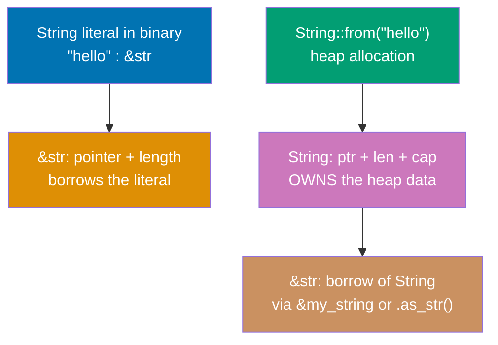
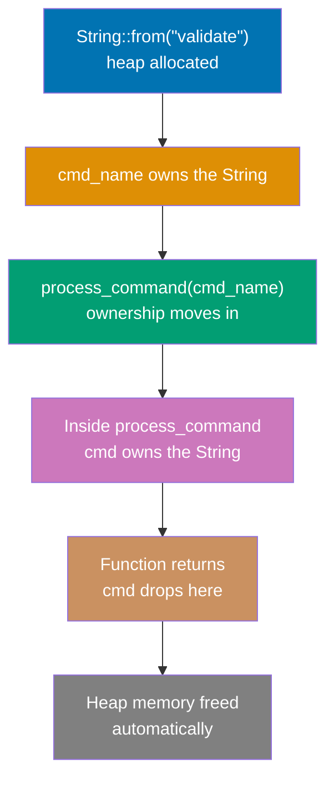

## Beginner Level: Rust Fundamentals via CLI Lens

Examples 1-28 teach Rust fundamentals using CLI-domain scenarios throughout. You will learn variables, functions, the ownership system, structs, enums, pattern matching, error handling with `Option` and `Result`, collections, iterators, closures, traits, and a first working CLI with clap. Every ownership example uses a command name, config path, or results accumulator—not abstract toy memory examples.

---

## Example 1: Hello World CLI

Every Rust program begins with a `main` function—the binary entry point. The `println!` macro (note the `!` suffix marking it as a macro, not a function) writes to stdout with an automatic newline. `cargo new` creates a project; `cargo run` compiles and executes. Unlike Java or Python, there is no runtime VM: Rust compiles directly to a native binary.

**Cargo basics**: `cargo new my-tool` creates `src/main.rs` with a hello world skeleton and `Cargo.toml` for metadata and dependencies. `cargo run` compiles in debug mode and runs. `cargo build --release` produces an optimized binary in `target/release/`.

**Syntax note**: `fn` declares a function. `main()` has implicit return type `()` (the unit type, similar to void). String literals like `"Hello from my-tool!"` have type `&str` (a string slice—covered in Example 5).

```rust
// Cargo.toml for this example:
// [package]
// name = "my-tool"
// version = "0.1.0"
// edition = "2024"

fn main() {                              // => Program entry point, called by the OS
                                         // => Return type is () implicitly
    println!("Hello from my-tool!");     // => println! macro expands at compile-time
                                         // => Writes to stdout with trailing newline
                                         // => Output: Hello from my-tool!

    println!("Version: {}", "1.0.0");    // => {} is a format placeholder
                                         // => Second argument fills the placeholder
                                         // => Output: Version: 1.0.0

    eprintln!("Debug: starting up");     // => eprintln! writes to stderr (not stdout)
                                         // => Convention: diagnostics go to stderr
                                         // => Does not appear in piped stdout output
}                                        // => main returns () implicitly
                                         // => Process exits with code 0
```

**Key Takeaway**: Every Rust CLI binary has a `main()` entry point, `println!` writes to stdout, and `eprintln!` writes to stderr. The `!` suffix always denotes a macro, which expands at compile time.

**Why It Matters**: The stdout/stderr separation is fundamental to Unix CLI composability. Tools like `ripgrep` write matches to stdout so they can be piped to other commands, while progress indicators go to stderr so they do not corrupt piped data. Getting this right from the first line of code is what separates CLI tools that play well in shell pipelines from ones that do not.

---

## Example 2: Variables and Mutability

Rust variables are immutable by default. You must explicitly write `let mut` to allow reassignment. This is the opposite of Java (`int x = 5; x = 6;` works silently), Python (all names are mutable), and Go (`x := 5; x = 6` works). Rust forces you to declare intent: if a variable never changes, omit `mut` and the compiler enforces that.

**Why immutability by default**: It prevents accidental state changes, enables compiler optimizations on values known to be stable, makes data-races structurally impossible for immutable data in concurrent code, and makes code review faster because `mut` is a visible signal that state changes happen here.

**Contrast with other languages**: Java's `final` keyword makes variables immutable—but programmers rarely use it. Go has no immutable local variables at all. Python has no immutable name bindings. Rust makes immutability the default and mutation the explicit exception.

```rust
fn main() {
    let tool_name = "checker";           // => tool_name is "checker" (type: &str)
                                         // => Immutable — compiler refuses reassignment
                                         // => Stored on the stack (just a pointer + length)

    // tool_name = "linter";             // => COMPILE ERROR: cannot assign twice to immutable variable
                                         // => Error caught at compile time, not runtime

    println!("Tool: {}", tool_name);     // => Reads tool_name
                                         // => Output: Tool: checker

    let mut exit_code = 0;               // => exit_code is 0 (type: i32, inferred)
                                         // => mut keyword allows future reassignment
                                         // => Stored on the stack

    println!("Exit code: {}", exit_code);// => Output: Exit code: 0

    exit_code = 1;                       // => Reassignment allowed because of mut
                                         // => exit_code is now 1
                                         // => Same stack location, new value

    println!("Exit code: {}", exit_code);// => Output: Exit code: 1

    let file_count: u32 = 0;             // => Explicit type annotation: u32 (unsigned 32-bit int)
                                         // => Type annotation syntax: let name: Type = value
                                         // => u32 range: 0 to 4,294,967,295
                                         // => Appropriate for counts (never negative)
    println!("Files: {}", file_count);   // => Output: Files: 0
}                                        // => All variables drop, stack memory freed
```

**Key Takeaway**: Variables are immutable by default in Rust; `let mut` makes them mutable. This forces explicit acknowledgment of every state change in your program and is enforced at compile time with zero runtime overhead.

**Why It Matters**: In production CLI tools that accumulate results across many files or directories, clearly distinguishing mutable accumulators from immutable configuration values prevents entire classes of bugs. When a code reviewer sees `let mut errors`, they immediately know that variable changes state. When they see `let threshold = 80`, they know it does not. This visibility replaces comments like `// this should not be reassigned` with a compile-time guarantee.

---

## Example 3: Variable Shadowing

Shadowing lets you reuse a variable name for a transformed version of the same data. Unlike mutation, shadowing creates a new binding and can change the type. This enables clean transformation pipelines without awkward naming like `input_raw`, `input_trimmed`, `input_parsed`.

**Shadowing versus mutation**: Mutation (`let mut x = 5; x = 6;`) modifies the same variable in place and must preserve the type. Shadowing (`let x = 5; let x = x + 1;`) creates a new variable that happens to share the name; the old binding is dropped and the type can change entirely.

**Common CLI use case**: You receive a string from the user, shadow it with the trimmed version, then shadow again with the parsed integer. Each step uses the same logical name `input`, and each step is immutable.

```rust
fn main() {
    let input = "  --verbose  ";        // => input is "  --verbose  " (type: &str)
                                         // => Raw input from CLI argument (hypothetical)

    let input = input.trim();            // => Shadow: input is now "--verbose" (type: &str)
                                         // => .trim() removes leading and trailing whitespace
                                         // => Old "  --verbose  " binding dropped
                                         // => Type stays &str (same here, but could change)

    println!("Trimmed: {}", input);      // => Reads the new input binding
                                         // => Output: Trimmed: --verbose

    let count = "42";                    // => count is "42" (type: &str)

    let count: u32 = count              // => Shadow: count will become u32
        .parse()                         // => .parse() attempts string-to-number conversion
        .unwrap_or(0);                   // => If parse fails, use 0 as default
                                         // => count is now 42 (type: u32)
                                         // => Type CHANGED from &str to u32 (shadowing allows this)

    println!("Count: {}", count);        // => Reads new count binding (u32 value)
                                         // => Output: Count: 42

    let flag = true;                     // => flag is true (type: bool)
    let flag = if flag { "on" } else { "off" };
                                         // => Shadow: flag is now "on" (type: &str)
                                         // => if expression returns a value
                                         // => Type changed from bool to &str
    println!("Flag: {}", flag);          // => Output: Flag: on
}
```

**Key Takeaway**: Shadowing creates a new binding with the same name, allowing type changes and keeping each stage immutable. It replaces multi-suffix variable names with a clean transformation pipeline.

**Why It Matters**: Real CLI argument processing chains—`cargo`, `git`, `clap` internals—use shadowing extensively. A raw `&str` argument gets shadowed into a `PathBuf`, then into a validated `Config` struct. Each step is type-safe, immutable, and readable without the noise of `_raw`, `_parsed`, `_validated` suffixes polluting the name. This is idiomatic Rust that you will see in every serious codebase.

---

## Example 4: Basic Types

Rust provides integer types with explicit bit widths (i8 through i128, u8 through u128), floating point (f32, f64), bool, and char. Type suffixes on literals (`5u32`, `3.14f64`) specify type inline. The `as` keyword performs explicit numeric casts. All types have compile-time-known sizes.

**Choosing integer types in CLIs**: Use `u32` or `u64` for counts (never negative). Use `i32` or `i64` for signed arithmetic. Use `usize` for indices and lengths (matches the platform's pointer size). Use `u8` for byte values. The compiler rejects implicit conversions between numeric types—you must cast explicitly with `as`.

**Type suffixes**: `5u32` means the literal 5 with type u32. `3.14f64` means 3.14 with type f64. Without a suffix, integer literals default to i32 and float literals default to f64.

```rust
fn main() {
    // Integer types with explicit widths
    let file_count: u32 = 42;           // => u32: unsigned 32-bit, range 0..4,294,967,295
                                         // => Good for counts: never negative
    let error_count: i32 = -3;          // => i32: signed 32-bit, range -2B..+2B
                                         // => Good for deltas or error codes
    let large_size: u64 = 8_000_000_000;// => u64: unsigned 64-bit for large values
                                         // => Underscores in literals improve readability
                                         // => 8_000_000_000 = 8 billion

    // Type suffixes on literals
    let timeout = 30u32;                 // => Type inferred from suffix: u32, value 30
    let ratio = 0.75f64;                 // => Type inferred from suffix: f64, value 0.75

    // Floating point
    let threshold: f64 = 80.0;          // => f64: 64-bit IEEE 754 double precision
                                         // => Default float type (more precise than f32)
    let score: f32 = 0.95_f32;          // => f32: 32-bit single precision
                                         // => Use f32 only when you need compact storage

    // Boolean
    let verbose: bool = false;           // => bool: exactly true or false
                                         // => No truthy/falsy: only bool works in if conditions
    let quiet = !verbose;                // => quiet is true (bool, inferred from ! operator)

    // Explicit casting with as
    let count: i32 = 100;               // => count is 100 (i32)
    let count_u64 = count as u64;       // => Explicit cast: i32 -> u64
                                         // => count_u64 is 100 (u64)
                                         // => No implicit numeric conversion in Rust

    let big: u64 = 300;
    let truncated = big as u8;           // => Truncation: 300 % 256 = 44
                                         // => truncated is 44 (u8, wraps around)
                                         // => Rust warns about this: be explicit when truncating

    println!("files={} errors={} size={}", file_count, error_count, large_size);
                                         // => Output: files=42 errors=-3 size=8000000000
    println!("threshold={} verbose={}", threshold, verbose);
                                         // => Output: threshold=80 verbose=false
    println!("cast: {} -> {}", count, count_u64);
                                         // => Output: cast: 100 -> 100
}
```

**Key Takeaway**: Rust integers have explicit widths (u32, i64, usize) and no implicit conversions. Use `as` to cast explicitly, knowing that narrowing casts can truncate. Choose unsigned types for counts and sizes that are never negative.

**Why It Matters**: The explicit width system prevents the class of bugs where `int` behaves differently on 32-bit versus 64-bit platforms—the source of many security vulnerabilities in C. In CLI tools processing large directory trees, using `u64` for byte counts prevents overflow that a u32 would hit at 4 GB. Rust's refusal to implicitly cast means these choices are visible and deliberate in every function signature.

---

## Example 5: String Types

Rust has two string types and understanding both is the single most important prerequisite for reading any Rust CLI codebase. `String` is an owned, heap-allocated, growable string. `&str` is a borrowed view into string data (a slice). Every other language you know has one string type; Rust has two because ownership requires distinguishing who controls the memory.

**The core distinction**:

- `String` — owns its data. When a `String` drops, its heap memory is freed. You can grow it, modify it, take ownership of it.
- `&str` — borrows a view. It does not own anything. The data it points to is owned by someone else (a `String`, a string literal in the binary, etc.).

**Comparison with other languages**:

- **Java**: `String` is immutable and heap-allocated. Closest to Rust's `&str` semantically (immutable view). Java hides the distinction by making all strings ref-counted objects.
- **Go**: `string` is an immutable sequence of bytes, similar to `&str`. Go's `[]byte` is closer to Rust's `String` (mutable, owned).
- **Python**: `str` is a unicode object with reference counting, closest to `Rc<str>`. Python hides allocation entirely.



**Why functions should take `&str` not `&String`**: A `&String` is a reference to a `String`. A `&str` is a string slice that can come from a `String`, a literal, or any other string storage. Functions that take `&str` accept both—this is called Deref coercion and happens automatically. Functions that take `&String` reject string literals unnecessarily.

```rust
fn main() {
    // &str: a borrowed string slice (view into data)
    let greeting: &str = "Hello, CLI!";  // => greeting is "&str" pointing to binary data
                                          // => No heap allocation: lives in the binary
                                          // => Cannot grow or modify: it's a view

    // String: an owned, heap-allocated, growable string
    let mut tool_name = String::from("my");// => tool_name is String "my" on the heap
                                           // => Owns heap memory: ptr=..., len=2, cap=2
                                           // => Can grow because it's owned

    tool_name.push_str("-tool");           // => Appends "-tool" to the owned String
                                           // => tool_name is now "my-tool"
                                           // => Heap may reallocate if capacity exceeded

    println!("{}", tool_name);             // => Output: my-tool

    // Converting between the two types
    let name_str: &str = &tool_name;       // => Borrows tool_name's data as &str
                                           // => name_str is a view into tool_name's heap
                                           // => tool_name still owns the data
    let name_str2: &str = tool_name.as_str();
                                           // => Explicit conversion: same result
                                           // => Both borrow tool_name without copying

    let owned: String = greeting.to_string();
                                           // => Creates new heap String from &str
                                           // => Allocates heap memory and copies "Hello, CLI!"
                                           // => owned owns its own copy

    let owned2: String = String::from(greeting);
                                           // => Another way to get an owned String from &str
                                           // => Equivalent to .to_string()

    // Deref coercion: &String automatically coerces to &str
    print_length(&tool_name);              // => Passes &String; coerces to &str automatically
    print_length(greeting);                // => Passes &str directly (no conversion needed)
    print_length("literal");              // => String literal is already &str

    println!("greeting={} tool={}", greeting, tool_name);
                                           // => Output: greeting=Hello, CLI! tool=my-tool
}

// Takes &str: accepts &String (via coercion), &str, and string literals
// This is more flexible than taking &String
fn print_length(s: &str) {               // => s is a &str (borrowed view)
                                          // => Works with String, &str, or literals
    println!("Length of '{}': {}", s, s.len());
                                          // => .len() returns byte length (not char count)
                                          // => Output depends on caller
}
```

**Key Takeaway**: `String` owns heap data and can grow; `&str` borrows a view into string data. Functions should take `&str` parameters, not `&String`, because `&str` accepts both string literals and `String` values through Deref coercion.

**Why It Matters**: Every Rust CLI that processes paths, arguments, or file content uses both types constantly. Getting this wrong leads to unnecessary heap allocations (cloning `String` when a borrow suffices) or compiler errors (trying to return a `&str` that borrows a local `String` that will drop). The Java/Go/Python programmer reflex to use one string type everywhere results in either compile errors or wasteful cloning until this distinction becomes intuitive.

---

## Example 6: Functions

Functions declare parameter types and return types explicitly. The last expression in a function body without a semicolon is the return value—no `return` keyword needed. `return` exists for early exits. This expression-based design means functions are naturally concise. Contrast with Java and Go, where every non-void function needs an explicit `return`.

**Expression versus statement**: An expression evaluates to a value (`x + y`, `if cond { a } else { b }`). A statement performs an action but returns `()` (`let x = 5;`, `println!(...);`). Adding a semicolon to an expression turns it into a statement that returns `()`. This is why the final line of a function body controls the return value.

**Function signatures as documentation**: Unlike Python where type hints are optional, Rust requires them. This makes function signatures machine-checked contracts that every caller must satisfy.

```rust
fn main() {
    let result = add(10, 20);            // => Calls add, passing 10 and 20
                                          // => result is 30 (i32, returned from add)

    println!("10 + 20 = {}", result);    // => Output: 10 + 20 = 30

    let msg = make_message("checker", 5);// => Calls make_message with two args
                                          // => msg is "checker found 5 issues" (String)

    println!("{}", msg);                  // => Output: checker found 5 issues

    let code = exit_code(0, 0);          // => Passes error_count=0, warning_count=0
                                          // => code is 0 (i32, all clean)

    println!("Exit code: {}", code);     // => Output: Exit code: 0

    let code2 = exit_code(3, 0);         // => Passes error_count=3
                                          // => code2 is 1 (i32, errors present)

    println!("Exit code: {}", code2);    // => Output: Exit code: 1
}

// Takes two i32 values, returns their sum as i32
fn add(a: i32, b: i32) -> i32 {         // => Parameter types required
                                          // => Return type required (-> i32)
    a + b                                 // => Last expression without semicolon = return value
                                          // => Equivalent to: return a + b;
}                                         // => No explicit return needed

// Takes a &str and u32, returns an owned String
fn make_message(tool: &str, count: u32) -> String {
                                          // => tool borrows the name, count owns u32
    format!("{} found {} issues", tool, count)
                                          // => format! creates an owned String
                                          // => Returns that String (expression, no semicolon)
}

// Early return with explicit return keyword
fn exit_code(error_count: u32, warning_count: u32) -> i32 {
    if error_count > 0 {
        return 1;                         // => Early return: exits function immediately
                                          // => Returns 1 when errors exist
    }
    if warning_count > 100 {
        return 2;                         // => Early return for too many warnings
    }
    0                                     // => Final expression: returns 0 (success)
                                          // => Reached only when no errors and warnings <= 100
}
```

**Key Takeaway**: Rust functions require explicit parameter and return types. The final expression without a semicolon is the implicit return value. Use `return` only for early exits. This makes function bodies naturally concise.

**Why It Matters**: In a CLI with dozens of helper functions, the difference between `fn check(path: &str) -> u32` and a Python function with optional type hints is that every caller in Rust is guaranteed to provide the right types. The expression-based return eliminates boilerplate `return` statements in simple functions. Production Rust CLIs like `cargo` have hundreds of these small, type-safe functions that compose cleanly because the compiler enforces every interface.

---

## Example 7: Ownership Basics

Every value in Rust has exactly one owner. When the owner goes out of scope, the value is dropped (memory freed automatically). When you assign a value to another variable or pass it to a function, ownership moves—the original binding becomes invalid. This is Rust's core memory safety guarantee: no garbage collector, no manual free, no double-free, no use-after-free.

**CLI domain scenario**: A command name is created, processed, and consumed. Once moved into a function, the original binding is gone. This forces you to think about who "owns" data at each stage of processing.



```rust
fn main() {
    let cmd_name = String::from("validate");
                                          // => cmd_name owns heap string "validate"
                                          // => Heap: [ptr=0x1234, len=8, cap=8]
                                          // => cmd_name is the single owner

    println!("Command: {}", cmd_name);   // => Reads cmd_name (borrowing for println, not moving)
                                          // => Output: Command: validate

    process_command(cmd_name);            // => MOVE: ownership transfers to process_command
                                          // => cmd_name is now invalid in this scope
                                          // => The heap string "validate" now belongs to the function

    // println!("{}", cmd_name);          // => COMPILE ERROR: value borrowed after move
                                          // => cmd_name was moved into process_command
                                          // => Rust prevents use-after-move at compile time

    // Copy types do NOT move — they copy
    let count: u32 = 42;                 // => count is 42 on the stack
                                          // => u32 implements Copy trait: assignment copies
    let count2 = count;                  // => Copy: count2 is 42 (independent copy)
                                          // => count is still valid (not moved)
    println!("count={} count2={}", count, count2);
                                          // => Output: count=42 count2=42
                                          // => Both are valid because u32 is Copy
}

fn process_command(cmd: String) {        // => cmd takes ownership of the String
                                          // => cmd_name from main is now invalid
    println!("Processing: {}", cmd);     // => Output: Processing: validate
}                                         // => cmd drops here: heap memory freed
                                          // => No manual free needed, no GC pause
```

**Key Takeaway**: Every heap-allocated value has one owner; moving it invalidates the original binding. Stack types like integers implement `Copy` and are duplicated on assignment. The compiler enforces ownership at compile time, making memory bugs impossible.

**Why It Matters**: This eliminates the use-after-free vulnerabilities that account for the majority of CVEs in C/C++ codebases. In a CLI processing hundreds of files, ownership guarantees that no path string can be used after the path object is freed. The zero-runtime-cost of this model—compared to garbage collection's pause-the-world approach—is why Rust CLIs can handle millions of files without latency spikes that would plague equivalent Java or Python tools.

---

## Example 8: Borrowing

Instead of moving ownership, you can borrow a value with `&T` (an immutable reference). Borrowing lets you read a value without taking ownership. Multiple immutable borrows can exist simultaneously. The borrow checker ensures the borrowed data outlives the reference. This is Rust's way of "lending without giving away."

**CLI domain scenario**: A validator function reads a config file path without owning it. The caller keeps ownership and can use the path after the validator returns.

**Comparison with Java**: In Java, every object variable is a reference—you always pass references. But Java has no concept of who owns the object; the GC tracks all live references. In Rust, you explicitly choose between move (transfer ownership) and borrow (temporary view). The cost: Rust borrows have lifetime restrictions; Java references have GC overhead.

```rust
fn main() {
    let config_path = String::from("/etc/my-tool/config.toml");
                                          // => config_path owns the String
                                          // => heap: "/etc/my-tool/config.toml"

    // Borrow config_path for validation (does not move it)
    let is_valid = validate_path(&config_path);
                                          // => &config_path creates an immutable reference
                                          // => validate_path borrows config_path temporarily
                                          // => config_path still owned by main after call

    println!("Path valid: {}", is_valid);// => config_path still accessible here
                                          // => Output: Path valid: true

    println!("Path: {}", config_path);   // => Still valid! Was borrowed, not moved
                                          // => Output: Path: /etc/my-tool/config.toml

    // Multiple immutable borrows are fine simultaneously
    let r1 = &config_path;               // => r1 borrows config_path
    let r2 = &config_path;               // => r2 also borrows config_path
    let r3 = &config_path;               // => r3 also borrows — multiple &T allowed
    println!("{} {} {}", r1, r2, r3);    // => All three can be used at the same time
                                          // => Output: /etc/... /etc/... /etc/...
}

fn validate_path(path: &str) -> bool {   // => Takes &str: a borrowed string slice
                                          // => Does NOT take ownership
                                          // => Caller keeps ownership of the original String
    path.starts_with('/')                 // => Checks if path is absolute
                                          // => Returns true for "/etc/..." paths
                                          // => Returns bool to caller (expression)
}
```

**Key Takeaway**: `&T` borrows a value without taking ownership. Multiple immutable borrows (`&T`) can coexist. The caller retains ownership and can continue using the value after the borrow ends.

**Why It Matters**: Borrowing is what makes Rust code efficient without copying data everywhere. A CLI that validates 10,000 file paths passes each path by reference to validators, formatters, and reporters—none of which need to own the path. Compare this to Go, where the equivalent requires either passing strings by value (copying all the bytes) or managing pointer lifetimes manually. Rust's borrow checker eliminates both the copy cost and the pointer safety issue.

---

## Example 9: Mutable Borrowing

A mutable reference (`&mut T`) lets you modify borrowed data. Rust enforces a critical rule: you can have either one mutable borrow or any number of immutable borrows—never both at the same time. This "exclusivity" rule eliminates data races at compile time.

**The exclusivity rule**: Having multiple simultaneous `&mut T` borrows, or mixing `&mut T` with `&T`, would allow one reference to modify data while another reference is reading it. Rust prevents this statically, making data races structurally impossible in safe code.

**CLI domain scenario**: A results accumulator is passed as `&mut Vec` to each sub-validator, which appends its findings. The caller passes the same mutable reference to each validator in sequence (not simultaneously).

```rust
fn main() {
    let mut errors: Vec<String> = Vec::new();
                                          // => errors is an empty Vec<String>
                                          // => mut required because we will modify it

    // Pass &mut errors to validators that append to it
    check_format(&mut errors, "bad_file.rs");
                                          // => &mut errors: mutable borrow of errors
                                          // => check_format can push to errors
                                          // => After return, mutable borrow ends

    check_naming(&mut errors, "BadName.rs");
                                          // => Second mutable borrow (first has ended)
                                          // => check_naming can also push to errors

    println!("Found {} errors:", errors.len());
                                          // => errors is ours again (borrows ended)
                                          // => .len() reads the Vec length
                                          // => Output: Found 2 errors:

    for err in &errors {                  // => Iterate with immutable borrows
        println!("  - {}", err);          // => Output lines:
    }                                     // =>   - bad_file.rs: underscores not allowed in filename
                                          // =>   - BadName.rs: filename must be lowercase

    // Cannot have &mut and & at same time
    let r = &errors;                      // => Immutable borrow active
    // errors.push(String::from("x"));   // => COMPILE ERROR: cannot borrow as mutable
                                          // => r (immutable borrow) is still active
                                          // => Cannot mix &mut with &
    println!("Count: {}", r.len());       // => r still in use here (immutable borrow)
}

fn check_format(errors: &mut Vec<String>, filename: &str) {
                                          // => errors: mutable borrow of the Vec
                                          // => filename: immutable borrow of a string
    if filename.contains('_') {
        errors.push(format!("{}: underscores not allowed in filename", filename));
                                          // => Pushes new String into errors Vec
                                          // => Modifies the Vec through the mutable borrow
    }
}

fn check_naming(errors: &mut Vec<String>, filename: &str) {
    if filename.chars().any(|c| c.is_uppercase()) {
                                          // => .chars() iterates Unicode characters
                                          // => .any(|c| ...) checks if any char matches
        errors.push(format!("{}: filename must be lowercase", filename));
    }
}
```

**Key Takeaway**: `&mut T` allows one exclusive mutable borrow at a time. You cannot mix `&mut T` with `&T` while both are active. This exclusivity rule makes data races impossible in safe Rust code.

**Why It Matters**: Data races are one of the hardest bugs to reproduce and diagnose in concurrent programs. By making them impossible at compile time—not just in multithreaded code but even in single-threaded code with references—Rust eliminates an entire debugging category. Real-world tools like `rustc` itself and `ripgrep` rely on this guarantee to handle complex mutable state during compilation and searching without race condition bugs.

---

## Example 10: Slices

A slice (`&[T]` for arrays/vecs, `&str` for strings) is a borrowed view into a contiguous sequence. Slices carry both a pointer and a length. They avoid copying data when you only need to read part of a collection. Functions that accept slices accept arrays, Vecs, and sub-ranges uniformly.

**Why prefer `&str` over `&String` and `&[T]` over `&Vec<T>`**: A slice is strictly more general. A `&String` can only come from a `String`; a `&str` can come from a `String`, a literal, or any string storage. Similarly, `&[T]` accepts arrays, Vecs, and sub-slices. Using slices in function parameters maximizes what callers can pass.

```rust
fn main() {
    // String slices (&str)
    let full_path = String::from("/home/<user>/.config/my-tool/config.toml");
                                          // => full_path owns the String

    let filename = &full_path[27..];      // => Slice from index 27 to end
                                          // => filename is "config.toml" (type: &str)
                                          // => No copy: just pointer + length into full_path
                                          // => full_path still owns all the data

    println!("Filename: {}", filename);   // => Output: Filename: config.toml

    let dir = &full_path[..27];           // => Slice from start to index 27
                                          // => dir is "/home/<user>/.config/my-tool/"
    println!("Dir: {}", dir);             // => Output: Dir: /home/<user>/.config/my-tool/

    // Array and Vec slices (&[T])
    let args = vec![                      // => Vec<String>, owned collection of Strings
        String::from("check"),
        String::from("--verbose"),
        String::from("src/"),
    ];

    let first_two: &[String] = &args[..2];// => Slice of first two elements
                                          // => type: &[String], borrowed view
                                          // => No copy, no allocation

    print_args(first_two);               // => Passes &[String] to function
                                          // => Output: check --verbose

    print_args(&args);                   // => &Vec<T> coerces to &[T] automatically
                                          // => Same function accepts whole Vec
                                          // => Output: check --verbose src/

    // Array (fixed-size) also coerces to slice
    let static_args: [&str; 2] = ["build", "--release"];
    count_args(&static_args);            // => Array coerces to &[&str]
                                          // => Output: 2 arguments
}

fn print_args(args: &[String]) {         // => Accepts &Vec<String> and &[String] slices
                                          // => More flexible than &Vec<String>
    let joined = args.join(" ");          // => Joins elements with space separator
    println!("{}", joined);              // => Output depends on caller
}

fn count_args(args: &[&str]) {           // => Accepts arrays, vecs, and slices of &str
    println!("{} arguments", args.len());// => .len() on slice returns element count
}
```

**Key Takeaway**: Slices (`&str`, `&[T]`) are borrowed views into contiguous data with no copying. Use them in function parameters instead of references to owned types (`&String`, `&Vec<T>`) for maximum flexibility.

**Why It Matters**: Real CLI argument parsing processes a `Vec<String>` of arguments, then passes slices to subcommand handlers. Using `&[String]` instead of `&Vec<String>` means tests can pass array literals directly without constructing a Vec. The `clap` library uses string slices throughout its public API for exactly this reason—it accepts both static strings and runtime-computed strings without requiring the caller to heap-allocate.

---

## Example 11: Structs

Structs group related data under a named type. In CLI tools, structs model config objects, validation results, file metadata, and report summaries. Rust structs have named fields (unlike tuples). Struct update syntax (`..other`) copies remaining fields from an existing instance.

**Contrast with Java classes**: Rust structs hold data only—no methods by default. Methods go in a separate `impl` block (Example 12). There is no inheritance. This separation of data and behavior is intentional and makes struct definitions readable without method noise.

```rust
// A struct representing one validation finding
struct ValidationCheck {                  // => Named struct type
    name: String,                         // => Field: owned String for check name
    passed: bool,                         // => Field: bool for pass/fail
    message: String,                      // => Field: owned String for human message
}

// A struct for CLI configuration
struct CliConfig {
    verbose: bool,                        // => Whether to print extra output
    output_path: String,                  // => Where to write results
    max_errors: u32,                      // => Stop after this many errors
}

fn main() {
    // Construct a ValidationCheck
    let check = ValidationCheck {         // => Create struct instance
        name: String::from("file-naming"),// => Set name field
        passed: false,                    // => Set passed field
        message: String::from("filename must be kebab-case"),
                                          // => Set message field
    };                                    // => All fields required in struct literal

    println!("Check: {}", check.name);   // => Field access with dot notation
                                          // => Output: Check: file-naming
    println!("Passed: {}", check.passed);// => Output: Passed: false
    println!("Message: {}", check.message);
                                          // => Output: Message: filename must be kebab-case

    let base_config = CliConfig {
        verbose: false,
        output_path: String::from("report.json"),
        max_errors: 100,
    };

    // Struct update syntax: copy all fields from base_config except verbose
    let verbose_config = CliConfig {
        verbose: true,                    // => Override this field
        ..base_config                     // => Copy all other fields from base_config
                                          // => output_path and max_errors copied
                                          // => MOVE: base_config's String fields move here
    };

    println!("verbose={} output={} max={}",
        verbose_config.verbose,
        verbose_config.output_path,
        verbose_config.max_errors);       // => Output: verbose=true output=report.json max=100

    // base_config.output_path is now MOVED into verbose_config
    // println!("{}", base_config.output_path); // => COMPILE ERROR: moved
    println!("verbose: {}", base_config.verbose);
                                          // => base_config.verbose is still valid (bool is Copy)
}
```

**Key Takeaway**: Structs group related fields under a named type. Field access uses dot notation. Struct update syntax (`..other`) copies remaining fields from an existing instance but moves non-Copy fields, invalidating them in the original.

**Why It Matters**: Every production CLI uses structs extensively: `cargo` has dozens of structs for package metadata, `ripgrep` has structs for search configuration and match results. Modeling domain concepts as structs rather than passing loose parameters makes function signatures self-documenting and makes it impossible to call `run_validation(path, count, verbose, quiet)` with arguments in the wrong order.

---

## Example 12: Struct impl Blocks

Methods and associated functions go in `impl` blocks separate from the struct definition. Methods take `&self` (read-only access), `&mut self` (mutable access), or `self` (consuming ownership). Associated functions (like constructors) do not take `self`. The convention for constructors is `Type::new(...)`.

**Contrast with Java**: In Java, methods and fields are declared together in the class body. In Rust, data (`struct`) and behavior (`impl`) are explicitly separated. This lets you add methods to types defined in other modules (via trait implementations).

```rust
struct CheckResult {
    name: String,
    passed: bool,
    details: String,
}

impl CheckResult {                        // => impl block: where methods live

    // Associated function (constructor) — no self parameter
    fn new(name: &str, passed: bool, details: &str) -> CheckResult {
                                          // => No self: called as CheckResult::new(...)
                                          // => Returns an owned CheckResult
        CheckResult {                     // => Construct and return instance
            name: name.to_string(),       // => &str -> String (creates owned copy)
            passed,                       // => Shorthand: field name = variable name
            details: details.to_string(),
        }
    }

    // Method with &self — read-only access to fields
    fn is_passing(&self) -> bool {        // => &self: borrows the CheckResult
                                          // => Cannot modify fields
        self.passed                       // => Returns the passed field value
    }

    // Method with &self returning a formatted string
    fn summary(&self) -> String {         // => Reads fields, returns new String
        if self.passed {
            format!("[PASS] {}", self.name)
                                          // => Returns "PASS" summary
        } else {
            format!("[FAIL] {}: {}", self.name, self.details)
                                          // => Returns "FAIL" summary with details
        }
    }

    // Method with &mut self — mutates a field
    fn override_pass(&mut self) {         // => &mut self: mutable borrow
                                          // => Can modify fields
        self.passed = true;               // => Mutates the passed field
        self.details = String::from("manually overridden");
    }
}

fn main() {
    let result = CheckResult::new(        // => Associated function call (no instance needed)
        "file-naming",                    // => name parameter
        false,                            // => passed parameter
        "must be kebab-case",             // => details parameter
    );                                    // => result owns the CheckResult

    println!("{}", result.summary());    // => Calls method on result
                                          // => Output: [FAIL] file-naming: must be kebab-case

    println!("Passing: {}", result.is_passing());
                                          // => Output: Passing: false

    let mut mutable_result = CheckResult::new("lint", false, "unused import");
    mutable_result.override_pass();       // => Calls &mut self method
                                          // => mutable_result.passed is now true

    println!("{}", mutable_result.summary());
                                          // => Output: [PASS] lint
}
```

**Key Takeaway**: `impl` blocks separate behavior from data. Methods take `&self` (read), `&mut self` (write), or `self` (consume). Associated functions like `::new()` are the idiomatic Rust constructor pattern.

**Why It Matters**: Every struct in production Rust CLIs has an `impl` block with at least a `::new()` constructor. The separation of data and behavior means you can read a struct definition and immediately understand what data it holds, then read the `impl` block separately for behavior. This is cleaner than Java classes where methods and fields are interspersed. Tools like `cargo` use this pattern for every major type.

---

## Example 13: Derive Macros

The `#[derive(...)]` attribute automatically generates trait implementations. The most commonly used derive macros are `Debug` (enables `{:?}` formatting for inspection), `Clone` (deep copy with `.clone()`), and `Default` (zero-value constructor via `Type::default()`). Without derive, you'd write these implementations manually.

**When to use each**:

- `Debug`: Always derive on internal data structures. Enables `dbg!()` macro and `{:?}` in format strings. Required for types used in test assertions.
- `Clone`: Derive when you need to copy a struct. Not derived by default because cloning heap data has a cost. Be intentional: every `.clone()` call is a heap allocation.
- `Default`: Derive when sensible zero values exist for all fields (0 for numbers, false for bools, empty string/vec for collections). Used by `clap` for struct initialization.

```rust
#[derive(Debug, Clone, Default)]         // => Three derive macros applied to CheckSummary
struct CheckSummary {
    total: u32,                           // => Default: 0
    passed: u32,                          // => Default: 0
    failed: u32,                          // => Default: 0
    tool_name: String,                    // => Default: "" (empty String)
}

fn main() {
    // Debug: enables {:?} and {:#?} formatting
    let summary = CheckSummary {
        total: 10,
        passed: 7,
        failed: 3,
        tool_name: String::from("my-checker"),
    };

    println!("{:?}", summary);            // => {:?} uses Debug trait
                                          // => Output: CheckSummary { total: 10, passed: 7, failed: 3, tool_name: "my-checker" }

    println!("{:#?}", summary);           // => {:#?} uses Debug with pretty-print (indented)
                                          // => Output: CheckSummary {
                                          // =>     total: 10,
                                          // =>     passed: 7,
                                          // =>     failed: 3,
                                          // =>     tool_name: "my-checker",
                                          // => }

    // Clone: deep copy (allocates new heap memory for String fields)
    let summary2 = summary.clone();       // => Creates a deep copy of summary
                                          // => summary2.tool_name is a new heap String
                                          // => summary is still valid (not moved)

    println!("Original: {:?}", summary); // => Still valid: was cloned, not moved
    println!("Clone: {:?}", summary2);   // => Independent copy

    // Default: creates a zero-value instance
    let empty: CheckSummary = CheckSummary::default();
                                          // => empty.total = 0, passed = 0, failed = 0
                                          // => empty.tool_name = "" (empty String)
    println!("Empty: {:?}", empty);      // => Output: CheckSummary { total: 0, passed: 0, failed: 0, tool_name: "" }

    // dbg! macro: prints expression and its Debug value, returns the value
    let n = dbg!(2 + 3);                 // => Prints: [src/main.rs:XX] 2 + 3 = 5
                                          // => n is 5 (dbg! returns the value)
    println!("n = {}", n);               // => Output: n = 5
}
```

**Key Takeaway**: `#[derive(Debug, Clone, Default)]` automatically generates boilerplate trait implementations. Always derive `Debug` on your data structures. Be intentional with `Clone`—every call allocates heap memory.

**Why It Matters**: `Debug` is indispensable during development and testing: every `assert_eq!` failure message uses `Debug` to show what the actual and expected values were. Without it, failing tests print unhelpful `assertion failed` with no values shown. Production CLI codebases derive `Debug` on every internal type and `Clone` only where necessary—the discipline of not auto-deriving `Clone` everywhere encourages thinking about data ownership rather than reflexively copying.

---

## Example 14: Enums

Rust enums define a type with a fixed set of variants. Unlike Java enums (which are named constants) and C enums (which are integers), Rust enum variants can carry data—making enums a powerful tool for modeling distinct cases. Even without data, enums are more expressive than boolean flags or magic integer codes.

**Contrast with Java enums**: Java `enum Status { OK, ERROR }` creates named integer constants with optional methods. Rust enums with no data are similar. But Rust goes further: variants can carry different types of data per variant (covered in Example 15).

**Contrast with Go**: Go has no enums; programmers use `const` blocks with `iota`. Rust's compile-time exhaustive matching on enums prevents forgetting to handle a variant.

```rust
// Enum for CLI subcommand categories
#[derive(Debug)]                          // => Derive Debug so we can print variants
enum CommandCategory {
    Check,                                // => Variant with no data
    Format,                               // => Variant with no data
    Report,                               // => Variant with no data
    Unknown,                              // => Catch-all variant
}

// Enum for output destinations
#[derive(Debug)]
enum OutputTarget {
    Stdout,                               // => Write to stdout
    Stderr,                               // => Write to stderr
    File,                                 // => Write to a file
}

fn main() {
    let cmd = CommandCategory::Check;     // => cmd is the Check variant
                                          // => Type: CommandCategory (enum)

    // match is the primary way to handle enums
    // The compiler requires ALL variants to be covered (exhaustive)
    let label = match cmd {               // => match returns a value (expression)
        CommandCategory::Check   => "running checks",
                                          // => Arm: Check variant => string literal
        CommandCategory::Format  => "formatting code",
        CommandCategory::Report  => "generating report",
        CommandCategory::Unknown => "unknown command",
    };                                    // => All 4 variants covered: no compile error
    println!("{}", label);               // => Output: running checks

    let target = OutputTarget::Stdout;
    describe_target(target);              // => MOVE: target moved into function
                                          // => OutputTarget has no Copy impl

    // Comparison: if we had used bool flags instead of enum
    // This is harder to read and extend:
    let _is_check = true;
    let _is_format = false;
    // Above: what if both are true? Enums make invalid states unrepresentable
}

fn describe_target(target: OutputTarget) {
                                          // => target is moved in (owned)
    match target {
        OutputTarget::Stdout => println!("writing to stdout"),
                                          // => Output: writing to stdout
        OutputTarget::Stderr => println!("writing to stderr"),
        OutputTarget::File   => println!("writing to file"),
    }
}
```

**Key Takeaway**: Rust enums define a closed set of variants, and `match` must cover all of them exhaustively. The compiler rejects `match` expressions that miss variants, preventing forgotten cases from becoming runtime bugs.

**Why It Matters**: CLI tools constantly distinguish between a fixed set of cases: output formats (text, JSON, markdown), severity levels (error, warning, info), or command categories. Modeling these as enums rather than string constants or integer codes means the compiler catches every place you forget to handle a new variant. When you add `OutputFormat::Markdown` to an existing enum, the compiler immediately tells you every `match` expression that needs updating.

---

## Example 15: Enums with Data

Rust enum variants can carry data, making enums equivalent to "sum types" or "tagged unions" in type theory. Each variant can hold different types and amounts of data. This is the foundation for `Option<T>` (a value or nothing) and `Result<T, E>` (success or error), which you'll see in every Rust program.

**Why this matters**: Instead of a struct with nullable fields or a boolean plus optional payload, an enum variant precisely encodes what's possible. `Validation::Passed` carries no data because there's nothing to report; `Validation::Failed` carries a message; `Validation::Warning` carries both a message and a code. Each variant is self-contained.

```rust
#[derive(Debug)]
enum Validation {
    Passed,                               // => No data: success has nothing to say
    Failed(String),                       // => Carries a String: the error message
    Warning { message: String, code: u32 },
                                          // => Named fields (struct-like variant)
                                          // => message: the warning text
                                          // => code: numeric warning identifier
}

fn main() {
    let results = vec![                   // => Vec of Validation enum values
        Validation::Passed,               // => No data
        Validation::Failed(String::from("filename not kebab-case")),
                                          // => Carries a String
        Validation::Warning {
            message: String::from("line too long"),
                                          // => Named field assignment
            code: 42,
        },
    ];

    for result in &results {              // => Iterate with borrows (& prevents move)
        match result {
            Validation::Passed => {
                println!("PASS");         // => Output: PASS
            }
            Validation::Failed(msg) => { // => Destructures: msg binds to the String
                println!("FAIL: {}", msg);// => Output: FAIL: filename not kebab-case
            }
            Validation::Warning { message, code } => {
                                          // => Destructures named fields
                                          // => message and code are bound
                println!("WARN [{}]: {}", code, message);
                                          // => Output: WARN [42]: line too long
            }
        }
    }
}

fn check_file(name: &str) -> Validation { // => Returns a Validation variant
    if name.contains(' ') {
        Validation::Failed(format!("{}: spaces not allowed", name))
                                          // => Returns Failed variant with message
    } else if name.len() > 50 {
        Validation::Warning {
            message: format!("{}: name is long", name),
            code: 101,
        }                                 // => Returns Warning variant with named fields
    } else {
        Validation::Passed               // => Returns Passed variant (no data)
    }
}
```

**Key Takeaway**: Enum variants can carry data—none, a tuple of values, or named fields. Pattern matching destructures the data from whichever variant is present. This is how `Option<T>` and `Result<T, E>` work internally.

**Why It Matters**: The ability to attach data to enum variants eliminates the null-check boilerplate of Java and Go. Instead of `if err != nil { ... }` scattered everywhere, Rust forces you to handle the error case in the match arm right where you use the value. Production CLIs use this for command dispatch (each subcommand variant carries its parsed arguments), error categorization (each error variant carries relevant context), and validation results (each result carries the evidence needed to report it).

---

## Example 16: Pattern Matching

`match` is an expression that tests a value against a series of patterns and executes the matching arm. It is exhaustive: every possible value must be covered, or the code fails to compile. Patterns can destructure structs, enums, and tuples, binding parts to variables. Match guards (`if condition`) add extra conditions.

**Match returns a value**: Like `if`, `match` is an expression. Every arm must produce the same type, and that value becomes the result of the whole `match` expression.

```rust
fn main() {
    // Match on a simple integer
    let error_count: u32 = 3;

    let exit_code = match error_count {   // => match returns a value assigned to exit_code
        0            => 0,                // => Pattern: exactly 0 => exit code 0
        1..=10       => 1,                // => Pattern: 1 to 10 inclusive => exit code 1
        _            => 2,                // => Wildcard: anything else => exit code 2
    };                                    // => exit_code is 1 (3 matches 1..=10)
    println!("Exit: {}", exit_code);      // => Output: Exit: 1

    // Match on a tuple (multiple values at once)
    let verbose = true;
    let quiet = false;

    let mode = match (verbose, quiet) {   // => Match on tuple of two booleans
        (true, false)  => "verbose",      // => Both conditions specified
        (false, true)  => "quiet",
        (false, false) => "normal",
        (true, true)   => "conflicting",  // => All 4 combinations covered
    };
    println!("Mode: {}", mode);           // => Output: Mode: verbose

    // Match with guards (additional conditions)
    let score: u32 = 85;

    let grade = match score {
        s if s >= 90 => "A",              // => Guard: s >= 90 (s binds the value 85)
        s if s >= 80 => "B",              // => Guard: s >= 80 (85 matches this)
        s if s >= 70 => "C",
        _            => "F",
    };                                    // => grade is "B" (85 >= 80)
    println!("Grade: {}", grade);         // => Output: Grade: B

    // Match with binding and destructuring
    let pair = (10u32, true);

    match pair {
        (n, true) if n > 5 => println!("big and true: {}", n),
                                          // => n binds first element, guard checks n > 5
                                          // => Output: big and true: 10
        (n, true)          => println!("small and true: {}", n),
        (_, false)         => println!("false"),
    }
}
```

**Key Takeaway**: `match` is exhaustive—every case must be handled—and returns a value. Patterns can destructure compound types, and guards (`if condition`) add extra constraints to specific arms.

**Why It Matters**: Exhaustive matching is the single biggest compile-time safety feature after the borrow checker. When you add a new variant to a CLI's `OutputFormat` enum, the compiler immediately points to every `match` that needs updating. Compare this to Go's `switch` (non-exhaustive) or Java's `switch` on an enum (no compile-time exhaustiveness until Java 21 preview features). Real CLIs use match extensively for command dispatch, error handling, and result reporting.

---

## Example 17: if let and while let

`if let` provides concise single-pattern matching when you only care about one variant. `while let` loops as long as a value matches a pattern. Both are syntactic sugar over `match` with a wildcard arm, useful when you want to act on one specific case and ignore others.

**When to use `if let` vs `match`**: Use `match` when you need to handle multiple variants differently or when exhaustiveness catches bugs. Use `if let` when you only care about one variant and want to ignore the rest. Use `while let` to drain a collection or channel one item at a time.

```rust
fn main() {
    let maybe_path: Option<String> = Some(String::from("/src/main.rs"));
                                          // => Option<String>: Some wraps a value
                                          // => Covered in detail in Example 18

    // if let: matches one pattern, ignores the rest
    if let Some(path) = maybe_path {      // => Tries to match Some(path) pattern
                                          // => If it matches: path binds to "/src/main.rs"
                                          // => If it doesn't match (None): skip block
        println!("Processing: {}", path); // => Output: Processing: /src/main.rs
    }
    // No else needed unless you want to handle the None case

    // if let with else
    let maybe_count: Option<u32> = None; // => None: no value

    if let Some(n) = maybe_count {
        println!("Count: {}", n);         // => Not reached (value is None)
    } else {
        println!("No count specified");   // => Output: No count specified
    }

    // while let: loop until pattern stops matching
    let mut stack = vec![3u32, 2, 1];     // => Vec acting as a stack

    while let Some(top) = stack.pop() {   // => .pop() returns Option<u32>
                                          // => Some(top): matches when Vec is non-empty
                                          // => None: loop exits when Vec is empty
        println!("Popped: {}", top);      // => Output (in order):
    }                                     // => Popped: 1
                                          // => Popped: 2
                                          // => Popped: 3

    // Combining if let with boolean condition
    let args: Vec<String> = vec![String::from("--verbose")];
    let first = args.first();             // => .first() returns Option<&String>

    if let Some(arg) = first {
        if arg.starts_with("--") {        // => Additional condition inside the block
            println!("Flag: {}", arg);    // => Output: Flag: --verbose
        }
    }
}
```

**Key Takeaway**: `if let` matches one pattern and ignores the rest, providing ergonomic access to a single enum variant without writing a full `match`. `while let` loops as long as the pattern matches.

**Why It Matters**: CLI code constantly checks whether optional values are present—`if let Some(output_file) = config.output_path { ... }`. Using `if let` instead of full `match` reduces noise when the absent case needs no action. The `while let Some(item) = queue.pop()` pattern appears in every work-queue-based CLI (batch processors, parallel validators) to drain items until the queue is empty.

---

## Example 18: Option

`Option<T>` represents a value that may or may not be present. It replaces `null` entirely. `Some(value)` wraps a value; `None` represents absence. Rust forces you to handle both cases before using the inner value—no null pointer exceptions are possible. This is the type returned by `Vec::first()`, `HashMap::get()`, `Iterator::next()`, and dozens of other standard library functions.

**Comparison with other languages**:

- **Java**: Nullable references (`String name = null`). Null checks optional, NullPointerException at runtime.
- **Go**: Zero values (`var s string` is `""`). No explicit "absent" type; often use pointer-to-value or sentinel values.
- **Python**: `None` is a valid value of any type. AttributeError or TypeError at runtime.
- **Rust**: `Option<T>` enforces handling at compile time. `None` is a distinct type state, not a magic value.

```rust
fn main() {
    // Creating Option values
    let some_name: Option<String> = Some(String::from("my-tool"));
                                          // => Some wraps an owned String
    let no_name: Option<String> = None;  // => None: explicit absence

    // Methods on Option
    println!("{}", some_name.is_some()); // => true: contains a value
                                          // => Output: true
    println!("{}", no_name.is_none());   // => true: contains no value
                                          // => Output: true

    // .unwrap_or(): use the value or a default
    let name = some_name.unwrap_or(String::from("default"));
                                          // => Returns "my-tool" (Some case)
                                          // => If None: would return "default"
    println!("Name: {}", name);           // => Output: Name: my-tool

    // .map(): transform the inner value if present
    let upper = some_name.as_ref()        // => as_ref(): Option<String> -> Option<&String>
                         .map(|s| s.to_uppercase());
                                          // => Closure called only if Some
                                          // => Returns Option<String>: Some("MY-TOOL")
    println!("{:?}", upper);             // => Output: Some("MY-TOOL")

    // .and_then(): chain Option-returning operations (flatMap)
    let result = parse_count("42")
        .and_then(|n| if n > 0 { Some(n) } else { None });
                                          // => parse_count returns Some(42)
                                          // => and_then: 42 > 0, returns Some(42)
    println!("{:?}", result);             // => Output: Some(42)

    let zero_result = parse_count("0")
        .and_then(|n| if n > 0 { Some(n) } else { None });
                                          // => parse_count returns Some(0)
                                          // => and_then: 0 > 0 is false, returns None
    println!("{:?}", zero_result);        // => Output: None

    // Common CLI pattern: look up in a HashMap
    let mut flags = std::collections::HashMap::new();
    flags.insert("verbose", true);        // => Insert key-value pair

    if let Some(is_verbose) = flags.get("verbose") {
                                          // => .get() returns Option<&bool>
                                          // => if let extracts the value
        println!("verbose={}", is_verbose);// => Output: verbose=true
    }
}

fn parse_count(s: &str) -> Option<u32> { // => Returns Some(n) or None
    s.parse().ok()                        // => .parse() returns Result; .ok() converts to Option
                                          // => Ok(n) becomes Some(n), Err(_) becomes None
}
```

**Key Takeaway**: `Option<T>` replaces null with a type that the compiler forces you to handle. Use `.unwrap_or()` for defaults, `.map()` to transform values, and `if let Some(v)` for single-case handling.

**Why It Matters**: Every major CLI has optional configuration values—output file, verbosity level, max error count. Modeling them as `Option<T>` instead of nullable types means the compiler guarantees you handle the absent case before using the value. This eliminates the NPE (NullPointerException) that is one of the most common runtime errors in Java codebases and the nil pointer dereference that crashes Go programs.

---

## Example 19: Result

`Result<T, E>` represents an operation that can succeed (`Ok(value)`) or fail (`Err(error)`). It replaces exceptions. Rust has no `try/catch`—errors are values returned from functions, and the type system forces callers to handle them. Every function that can fail returns `Result`.

**Comparison with exceptions**: Java and Python use exceptions that can propagate invisibly up the call stack. Rust's `Result` makes the possibility of failure explicit in the function signature: `fn read_file(path: &str) -> Result<String, io::Error>` tells you this can fail. You cannot accidentally ignore the error.

**Comparison with Go**: Go returns `(T, error)` pairs. Rust's `Result<T, E>` is a single return type that cannot be accidentally discarded—the compiler warns if you ignore a `Result`.

```rust
use std::num::ParseIntError;              // => Import error type for parse failures

fn main() {
    // Creating Result values
    let ok_result: Result<u32, String> = Ok(42);
                                          // => Ok wraps a success value
    let err_result: Result<u32, String> = Err(String::from("parse failed"));
                                          // => Err wraps an error value

    println!("ok.is_ok()={}", ok_result.is_ok());   // => Output: ok.is_ok()=true
    println!("err.is_ok()={}", err_result.is_ok()); // => Output: err.is_ok()=false

    // .map(): transform the success value
    let doubled = ok_result.map(|n| n * 2);
                                          // => Ok(42) -> Ok(84)
                                          // => Closure called only on Ok
    println!("{:?}", doubled);            // => Output: Ok(84)

    // .map_err(): transform the error value
    let mapped_err = err_result.map_err(|s| format!("Error: {}", s));
                                          // => Err("parse failed") -> Err("Error: parse failed")
    println!("{:?}", mapped_err);         // => Output: Err("Error: parse failed")

    // .unwrap_or(): use success value or a default on error
    let value = err_result.unwrap_or(0); // => Returns 0 (default) because it's Err
    println!("value: {}", value);        // => Output: value: 0

    // Practical: parse a CLI argument string
    match parse_max_errors("10") {
        Ok(n)  => println!("Max errors: {}", n),
                                          // => Output: Max errors: 10
        Err(e) => println!("Bad argument: {}", e),
    }

    match parse_max_errors("abc") {
        Ok(n)  => println!("Max errors: {}", n),
        Err(e) => println!("Bad argument: {}", e),
                                          // => Output: Bad argument: invalid digit found in string
    }
}

fn parse_max_errors(s: &str) -> Result<u32, ParseIntError> {
                                          // => Returns Ok(n) or Err(ParseIntError)
    s.parse::<u32>()                      // => Attempt to parse s as u32
                                          // => Returns Result<u32, ParseIntError>
}
```

**Key Takeaway**: `Result<T, E>` makes failure explicit in the type system. Use `match`, `if let Ok(v)`, `.map()`, `.unwrap_or()`, and the `?` operator (next example) to handle results. The compiler warns if you ignore a `Result`.

**Why It Matters**: In a CLI processing hundreds of files, every file read, parse, and write can fail. `Result` forces you to handle each failure site at compile time rather than discovering it as a runtime exception in production. Tools like `cargo` and `rustc` use `Result` throughout, producing precise error messages because each error carries exactly the context added at the failure site—not a stack trace from an uncaught exception.

---

## Example 20: The Question Mark Operator

The `?` operator on a `Result` (or `Option`) either unwraps the success value or returns early from the current function with the error. It replaces repetitive `match result { Ok(v) => v, Err(e) => return Err(e) }` boilerplate. Functions using `?` must return `Result` (or `Option`). This is the primary error propagation mechanism in production Rust code.

**How `?` works**: On `Result<T, E>`: if `Ok(v)`, evaluates to `v` and continues. If `Err(e)`, converts `e` to the function's error type (using the `From` trait) and returns early.

**`?` with `anyhow`**: In CLI applications (as opposed to libraries), `main()` can return `Result<(), anyhow::Error>` and use `?` directly. This is covered in detail in Example 42.

```rust
use std::fs;
use std::io;

fn main() -> Result<(), io::Error> {     // => main returns Result to enable ? operator
                                          // => () is the unit type (no success value)
                                          // => If any ? returns Err, main prints the error

    // Without ?: verbose match boilerplate
    let contents = match fs::read_to_string("config.toml") {
        Ok(s)  => s,                      // => Unwrap success
        Err(e) => return Err(e),          // => Early return on error
    };

    // With ?: same result, much shorter
    let contents2 = fs::read_to_string("config.toml")?;
                                          // => If Ok(s): contents2 = s, continue
                                          // => If Err(e): return Err(e) immediately
                                          // => Equivalent to the match above

    // Chaining ? operators
    let config = load_and_parse("config.toml")?;
                                          // => If load_and_parse returns Err, return it here
    println!("Config loaded: {} bytes", config.len());

    println!("Done");
    Ok(())                                // => Explicit Ok(()) to satisfy Result return type
}

fn load_and_parse(path: &str) -> Result<String, io::Error> {
    let raw = fs::read_to_string(path)?;  // => Read file or early return with io::Error
                                          // => raw is the file contents if Ok
    let trimmed = raw.trim().to_string(); // => Trim whitespace and convert to owned String
                                          // => This cannot fail, no ? needed
    Ok(trimmed)                           // => Wrap in Ok to match return type
}
```

**Key Takeaway**: The `?` operator propagates errors upward by converting `Err(e)` into an early return. It replaces verbose match-based error propagation with concise, readable code. Functions using `?` must return `Result` or `Option`.

**Why It Matters**: Without `?`, idiomatic error handling requires a `match` at every fallible call site—roughly doubling the line count of functions that do I/O. With `?`, a function that reads a config, parses it, validates it, and writes a report looks almost as linear as it would in Python or Go. The production Rust CLIs `cargo`, `ripgrep`, and `fd` use `?` extensively throughout their source. This is what makes Rust error handling both safe and readable.

---

## Example 21: Vec

`Vec<T>` is Rust's growable heap-allocated array. It is the most commonly used collection in CLI code. Methods include `.push()`, `.pop()`, `.len()`, `.is_empty()`, `.iter()`, and indexing with `[i]`. Bounds-checked indexing panics on out-of-bounds; `.get(i)` returns `Option<&T>` safely.

**Comparison with other languages**:

- **Java**: `ArrayList<T>` with boxing for primitives. Rust's `Vec<i32>` stores raw integers, no boxing.
- **Go**: `[]T` slice. Go slices have a similar pointer+length+capacity structure.
- **Python**: `list`. Python lists hold objects with ref counting; Vec holds values directly.
- **JavaScript/TypeScript**: `Array<T>`. Similar API but no bounds safety.

```rust
fn main() {
    // Creating a Vec
    let mut errors: Vec<String> = Vec::new();
                                          // => Empty Vec, type: Vec<String>
                                          // => Heap: ptr=..., len=0, cap=0
                                          // => mut required to modify it

    // Pushing elements
    errors.push(String::from("file1.rs: bad naming"));
                                          // => Appends element to end
                                          // => errors: len=1, cap=1 (or more)
    errors.push(String::from("file2.rs: long line"));
                                          // => errors: len=2
    errors.push(String::from("file3.rs: missing test"));
                                          // => errors: len=3

    println!("Error count: {}", errors.len());
                                          // => .len() returns number of elements
                                          // => Output: Error count: 3

    // Indexing (panics if out of bounds)
    println!("First: {}", errors[0]);     // => Access by index, zero-based
                                          // => Output: First: file1.rs: bad naming

    // Safe access with .get() returning Option<&T>
    if let Some(last) = errors.get(2) {   // => Returns Some(&String) or None
        println!("Last: {}", last);       // => Output: Last: file3.rs: missing test
    }

    // Iteration
    for error in &errors {                // => &errors: iterate with immutable borrows
                                          // => error is &String for each element
        println!("  {}", error);          // => Prints each error
    }                                     // => Output: file1.rs:... file2.rs:... file3.rs:...

    // Vec literal shorthand
    let codes: Vec<u32> = vec![0, 1, 2, 3];
                                          // => vec! macro creates Vec with initial values
                                          // => Equivalent to push four times

    let sum: u32 = codes.iter().sum();    // => Iterator method: sums all values
    println!("Sum: {}", sum);            // => Output: Sum: 6

    // Collecting from iterator into Vec
    let doubled: Vec<u32> = codes.iter()
        .map(|n| n * 2)                   // => Transform each element
        .collect();                       // => Gather results into Vec
    println!("{:?}", doubled);            // => Output: [0, 2, 4, 6]

    // Removing elements
    let last = errors.pop();              // => Removes last element, returns Option<String>
    println!("Popped: {:?}", last);       // => Output: Popped: Some("file3.rs: missing test")
    println!("Count: {}", errors.len());  // => Output: Count: 2
}
```

**Key Takeaway**: `Vec<T>` is the primary growable collection. Use `.push()` to add, `.pop()` to remove from the end, `.len()` for count, and `for item in &vec` to iterate without moving. Use `vec![...]` for initialization with known values.

**Why It Matters**: CLI tools accumulate results—validation errors, matched files, generated lines. `Vec` is the universal accumulator. The combination of `.push()` for accumulation, `.iter().map().filter().collect()` for transformation, and `.iter().for_each()` for output is the core data processing pattern in every Rust CLI from `cargo` to `ripgrep`.

---

## Example 22: HashMap

`HashMap<K, V>` maps keys to values with O(1) average lookup. Common operations: `.insert()`, `.get()`, `.contains_key()`, `.entry().or_insert()`. Keys must implement `Hash + Eq`. The entry API avoids the double-lookup pattern common in Java HashMap code.

**BTreeMap note**: `HashMap` iterates in random order. When your CLI output must be deterministic (same input always produces same output order), use `BTreeMap<K, V>` which iterates in sorted key order. This is covered in Example 46.

```rust
use std::collections::HashMap;

fn main() {
    let mut check_counts: HashMap<String, u32> = HashMap::new();
                                          // => Empty HashMap with String keys, u32 values
                                          // => Keys must be Hash + Eq (String implements both)

    // Insert key-value pairs
    check_counts.insert(String::from("file-naming"), 3);
                                          // => Inserts "file-naming" -> 3
                                          // => Returns Option<V>: old value if key existed

    check_counts.insert(String::from("line-length"), 7);
    check_counts.insert(String::from("missing-test"), 1);

    // Lookup by key (returns Option<&V>)
    if let Some(count) = check_counts.get("file-naming") {
                                          // => .get() returns Option<&u32>
                                          // => Borrows the value (does not remove it)
        println!("file-naming errors: {}", count);
                                          // => Output: file-naming errors: 3
    }

    // Check if key exists
    println!("has line-length: {}", check_counts.contains_key("line-length"));
                                          // => Output: has line-length: true

    // Entry API: insert if absent, update if present
    check_counts.entry(String::from("file-naming"))
                .and_modify(|v| *v += 1); // => Key exists: increment value
                                           // => file-naming is now 4

    check_counts.entry(String::from("new-check"))
                .or_insert(0);            // => Key absent: insert 0
                                           // => "new-check" -> 0 added

    // Increment counters idiom (most common entry use)
    let filenames = vec!["a.rs", "b.rs", "a.rs", "c.rs", "a.rs"];
    let mut freq: HashMap<&str, u32> = HashMap::new();

    for name in &filenames {
        let count = freq.entry(name).or_insert(0);
                                          // => If absent: insert 0 and return &mut 0
                                          // => If present: return &mut existing_value
        *count += 1;                      // => Dereference and increment
    }
    println!("{:?}", freq);               // => Output: {"a.rs": 3, "b.rs": 1, "c.rs": 1}
                                           // => (order may vary)

    // Iteration
    for (key, value) in &check_counts {   // => Borrows each key-value pair
        println!("{}: {}", key, value);   // => Output order is random (HashMap)
    }
}
```

**Key Takeaway**: `HashMap<K, V>` provides O(1) average lookups. Use `.entry().or_insert()` to avoid double-lookup when initializing or incrementing counts. Use `BTreeMap` when sorted output order matters.

**Why It Matters**: Frequency counting—how many times each error type appears, how many violations each file has—is ubiquitous in CLI validation tools. The `.entry().or_insert(0)` pattern followed by `*count += 1` is so common in Rust CLIs it has become a recognizable idiom. Understanding it lets you read production code from `cargo`'s dependency resolver and `ripgrep`'s statistics reporting.

---

## Example 23: Iterators

Rust iterators are lazy: they do not compute values until consumed. You chain adapters (`.map()`, `.filter()`, `.flat_map()`, `.take()`) and then consume with a terminal (`.collect()`, `.for_each()`, `.count()`, `.sum()`, `.any()`, `.all()`). This functional pipeline style is idiomatic Rust and more efficient than manual loops because the compiler can often optimize chains into single passes.

**Contrast with Java streams**: Java `Stream<T>` is similar in concept but requires more imports and has boxing overhead for primitives. Rust iterators are zero-cost: a `.map().filter().collect()` chain compiles to the same code as the equivalent `for` loop.

**Contrast with Python**: Python's list comprehensions `[f(x) for x in xs if pred(x)]` are similar in intent. Rust's iterator chains can be more verbose but are more composable and have no runtime overhead.

```rust
fn main() {
    let files = vec![
        "main.rs", "lib.rs", "bad_name.rs", "UPPERCASE.rs", "utils.rs",
    ];

    // .filter(): keep elements matching a predicate
    let valid: Vec<&str> = files.iter()   // => .iter() creates iterator of &&&str refs
        .filter(|name| {                  // => Closure receives &&str (double ref)
            let name = *name;             // => Dereference once to get &str
            !name.contains('_') && name.chars().all(|c| c.is_lowercase() || c == '.')
                                          // => Keep if no underscore and all lowercase
        })
        .copied()                         // => &&str -> &str (one less indirection)
        .collect();                       // => Collect into Vec<&str>

    println!("{:?}", valid);             // => Output: ["main.rs", "lib.rs", "utils.rs"]

    // .map(): transform each element
    let upper: Vec<String> = files.iter()
        .map(|name| name.to_uppercase())  // => Each &str -> String (uppercase)
        .collect();                       // => Vec<String>
    println!("{:?}", upper);             // => Output: ["MAIN.RS", "LIB.RS", ...]

    // .count(): terminal that counts elements
    let bad_count = files.iter()
        .filter(|name| name.contains('_'))
        .count();                         // => Number of names with underscores
    println!("Bad names: {}", bad_count);// => Output: Bad names: 1

    // .any() and .all(): short-circuit checks
    let any_bad = files.iter().any(|n| n.contains('_'));
                                          // => true if any name has underscore
    println!("any bad: {}", any_bad);    // => Output: any bad: true

    let all_rs = files.iter().all(|n| n.ends_with(".rs"));
                                          // => true only if ALL names end with .rs
    println!("all .rs: {}", all_rs);     // => Output: all .rs: true

    // Chaining multiple adapters
    let violations: Vec<String> = files.iter()
        .enumerate()                      // => (index, &&str) pairs
        .filter(|(_, name)| name.contains('_') || name.chars().any(|c| c.is_uppercase()))
                                          // => Keep names with underscores or uppercase
        .map(|(i, name)| format!("line {}: {}", i + 1, name))
                                          // => Format as violation message
        .collect();

    for v in &violations {
        println!("{}", v);                // => Output:
    }                                     // => line 3: bad_name.rs
                                          // => line 4: UPPERCASE.rs
}
```

**Key Takeaway**: Rust iterators are lazy and zero-cost. Chain `.filter()`, `.map()`, `.enumerate()`, and other adapters, then consume with `.collect()`, `.count()`, `.any()`, or `.all()`. The compiler optimizes chains to single-pass loops.

**Why It Matters**: CLI tools that process file lists, argument lists, and validation results live and die by their ability to compose transformations cleanly. The iterator pipeline replaces nested loops with named, readable stages. `ripgrep` uses iterator chains to process lines of text, filter by regex, transform to match objects, and format for output—all in a single declarative chain that the compiler compiles to tight native code.

---

## Example 24: Closures

Closures are anonymous functions that capture variables from their enclosing scope. Syntax: `|params| expression` or `|params| { block }`. They are used as arguments to iterator methods, thread spawn, and callbacks. Unlike Go function literals, Rust closures specify whether they capture by value (`move`) or by reference (default). Unlike Java lambdas, Rust closures can capture mutable references.

**The three closure traits**: `Fn` (can call multiple times, captures by reference), `FnMut` (can call multiple times, captures by mutable reference), `FnOnce` (can call only once, captures by value/move). Most closures used with iterators are `Fn`.

```rust
fn main() {
    // Basic closure: captures nothing from scope
    let double = |n: u32| n * 2;         // => Closure stored in variable double
                                          // => Takes u32, returns u32
    println!("{}", double(5));            // => Calls closure with 5
                                          // => Output: 10

    // Closure capturing from enclosing scope
    let prefix = "ERROR";                 // => Captured by reference in the closure below
    let make_msg = |text: &str| format!("[{}] {}", prefix, text);
                                          // => Captures prefix by reference
                                          // => prefix must outlive the closure
    println!("{}", make_msg("file not found"));
                                          // => Output: [ERROR] file not found

    // Closure as argument to iterator method
    let counts = vec![3u32, 1, 4, 1, 5, 9];

    let over_three: Vec<u32> = counts.iter()
        .filter(|&&n| n > 3)             // => Closure as filter predicate
                                          // => &&n: double deref (iter gives &&u32)
        .copied()
        .collect();
    println!("{:?}", over_three);        // => Output: [4, 5, 9]

    // Mutable closure: captures and mutates a local variable
    let mut total = 0u32;
    counts.iter().for_each(|&n| total += n);
                                          // => Closure mutates total (FnMut)
                                          // => Captures total by mutable reference
    println!("Total: {}", total);        // => Output: Total: 23

    // move closure: takes ownership of captured variables
    let tool_name = String::from("checker");
    let describe = move || {              // => move: captures tool_name by value (ownership)
        format!("Running {}", tool_name)  // => tool_name moved into the closure
    };
    // println!("{}", tool_name);         // => COMPILE ERROR: tool_name was moved
    println!("{}", describe());           // => Output: Running checker
}
```

**Key Takeaway**: Closures capture their environment by reference by default; `move` closures take ownership. They implement `Fn`, `FnMut`, or `FnOnce` depending on how they use captures. Use them as iterator method arguments and callbacks.

**Why It Matters**: Iterator chains without closures would require writing named functions for every transformation—making simple pipelines verbose. Every production CLI uses closures in iterator chains for filtering files, transforming results, and formatting output. The `move` closure pattern is essential for passing data to threads (covered when you need parallel processing) because the thread needs ownership of the data it will use.

---

## Example 25: Traits

Traits define shared behavior: a set of method signatures that types must implement. Unlike Java interfaces (nominal—you must explicitly declare `implements`), Rust traits are structurally applied but nominally declared (`impl Trait for Type`). Unlike Go interfaces (purely structural—any type with the right methods satisfies an interface automatically), Rust requires explicit `impl` declarations.

**Contrast summary**:

- **Java interface**: `class Dog implements Animal { ... }` — explicit declaration, single inheritance
- **Go interface**: Any type with `Bark() string` method satisfies `type Animal interface { Bark() string }` automatically
- **Rust trait**: `impl Animal for Dog { ... }` — explicit `impl`, no inheritance, multiple traits per type

```rust
// Define a trait: shared behavior contract
trait Reportable {                        // => Trait: a named set of method signatures
    fn summary(&self) -> String;          // => Required method: every impl must provide this
    fn is_critical(&self) -> bool {       // => Default method: impls can override or use this
        false                             // => Default: not critical
    }
}

// Two different types implementing the same trait
struct FileViolation {
    path: String,
    rule: String,
}

struct ConfigError {
    key: String,
    reason: String,
}

impl Reportable for FileViolation {       // => Implement Reportable for FileViolation
    fn summary(&self) -> String {         // => Provide the required method
        format!("{}: {}", self.path, self.rule)
    }
    fn is_critical(&self) -> bool {       // => Override the default
        self.rule.contains("security")    // => Critical if security-related
    }
}

impl Reportable for ConfigError {         // => Implement Reportable for ConfigError
    fn summary(&self) -> String {         // => Different implementation of same method
        format!("config.{}: {}", self.key, self.reason)
    }
    // is_critical() not overridden: uses default (returns false)
}

// Function accepting any type that implements Reportable
fn print_report(item: &impl Reportable) { // => &impl Trait: any type implementing Reportable
    println!("{}", item.summary());        // => Calls whichever summary() is appropriate
    if item.is_critical() {
        println!("  ^^^ CRITICAL");
    }
}

fn main() {
    let violation = FileViolation {
        path: String::from("src/auth.rs"),
        rule: String::from("security: unsafe block without justification"),
    };

    let config_err = ConfigError {
        key: String::from("max_connections"),
        reason: String::from("must be positive"),
    };

    print_report(&violation);             // => FileViolation's summary() called
                                          // => Output: src/auth.rs: security: unsafe...
                                          // =>         ^^^ CRITICAL

    print_report(&config_err);            // => ConfigError's summary() called
                                          // => Output: config.max_connections: must be positive
                                          // => (no CRITICAL: default is_critical returns false)
}
```

**Key Takeaway**: Traits define shared behavior contracts. Types implement traits explicitly with `impl Trait for Type`. Functions accept `&impl Trait` for any type implementing the trait. Default methods provide common implementations that types can override.

**Why It Matters**: Traits enable CLI tools to process heterogeneous types uniformly. A checker that produces `Vec<Box<dyn Reportable>>` can collect `FileViolation`, `ConfigError`, and `NetworkError` into a single list and report them all with the same code. This is how `cargo` handles dozens of different error types through a common error trait, and how `anyhow` (Example 42) provides a universal error type that any error can be converted to.

---

## Example 26: First CLI with clap

`clap` is the dominant Rust CLI argument parsing library. The derive API lets you describe your CLI as a struct with attributes. `#[derive(Parser)]` generates the parsing code. `Cli::parse()` in `main()` either returns a populated struct or prints a help message and exits. This example shows the minimal working `clap` CLI.

**Why clap**: It generates `--help`, `--version`, error messages for invalid arguments, and shell completion scripts automatically. The derive API means your struct definition IS the documentation.

```rust
// Cargo.toml addition:
// [dependencies]
// clap = { version = "4.6.1", features = ["derive"] }

use clap::Parser;                         // => Import the Parser derive macro

#[derive(Parser)]                         // => Generate argument parsing from this struct
#[command(
    name = "my-checker",                  // => Binary name shown in help
    version = "0.1.0",                    // => Shown with --version
    about = "Validates file naming conventions"
                                          // => One-line description in --help
)]
struct Cli {
    #[arg(short = 'v', long = "verbose")] // => -v and --verbose flags
    verbose: bool,                        // => bool: presence of flag = true

    #[arg(short = 'p', long = "path", default_value = ".")]
                                          // => -p and --path with default "."
    path: String,                         // => String: value of the argument

    #[arg(long = "max-errors", default_value = "100")]
    max_errors: u32,                      // => u32: parsed from the string argument
}

fn main() {
    let cli = Cli::parse();               // => Parse argv, or print help and exit on error
                                          // => cli is a populated Cli struct

    if cli.verbose {                      // => Access parsed arguments as struct fields
        eprintln!("Verbose mode on");     // => Only printed when --verbose was passed
    }

    println!("Checking: {}", cli.path);  // => Output: Checking: . (or user-specified path)
    println!("Max errors: {}", cli.max_errors);
                                          // => Output: Max errors: 100 (or user-specified)

    // Running: ./my-checker
    // Output: Checking: .
    //         Max errors: 100

    // Running: ./my-checker --verbose --path src/ --max-errors 50
    // Output: Verbose mode on (to stderr)
    //         Checking: src/
    //         Max errors: 50

    // Running: ./my-checker --help
    // Output: (auto-generated help message with all flags documented)
}
```

**Key Takeaway**: `clap`'s derive API generates argument parsing from a struct definition. `Cli::parse()` populates the struct or exits with a helpful error. Access parsed values as struct fields. `--help` and `--version` are generated automatically.

**Why It Matters**: Manual argument parsing with `std::env::args()` is error-prone and produces poor error messages. Every production Rust CLI uses `clap` or a similar library. The derive API means adding a new argument takes two lines—the field and its `#[arg]` attribute—and the help message updates automatically. When users run your tool incorrectly, they get a precise error message, not a panic or silent wrong behavior.

---

## Example 27: Module System

Rust's module system organizes code into namespaces. `mod` declares a module (inline or in a file). `pub` makes items public. `use` brings items into scope. File-based modules: a `mod foo;` declaration in `main.rs` (or `lib.rs`) loads `src/foo.rs` or `src/foo/mod.rs`. This is how production CLIs structure their code across multiple files.

**Convention**: `src/commands/` for CLI command handlers, `src/internal/` for logic not exposed to users. `pub(crate)` makes items visible within the crate but not to external users of a library.

```rust
// This example shows a single-file module demonstration
// In a real project, each module would be in its own file

mod checks {                              // => Declare a module named checks
    // Items inside are private by default

    pub struct CheckResult {              // => pub: visible outside this module
        pub name: String,                 // => pub: field accessible from outside
        pub passed: bool,
    }

    pub fn run_naming_check(filename: &str) -> CheckResult {
                                          // => pub fn: callable from outside checks module
        let passed = !filename.contains('_')
            && filename.chars().all(|c| c.is_lowercase() || c == '.' || c == '-');

        CheckResult {
            name: String::from("naming"),
            passed,
        }
    }

    fn internal_helper() -> bool {        // => No pub: private to this module only
        true                              // => Only callable from within checks module
    }
}

mod report {                              // => Another module
    use super::checks::CheckResult;       // => use super:: to reference sibling module

    pub fn print_result(result: &CheckResult) {
        let status = if result.passed { "PASS" } else { "FAIL" };
        println!("[{}] {}", status, result.name);
    }
}

fn main() {
    use checks::run_naming_check;         // => Bring function into scope
    use report::print_result;             // => Bring another function into scope

    let r1 = run_naming_check("my-file.rs");
                                          // => Calls checks::run_naming_check
                                          // => Returns CheckResult { name: "naming", passed: true }
    print_result(&r1);                    // => Calls report::print_result
                                          // => Output: [PASS] naming

    let r2 = checks::run_naming_check("bad_name.rs");
                                          // => Can also use full path without use declaration
    report::print_result(&r2);            // => Output: [FAIL] naming

    // checks::internal_helper();         // => COMPILE ERROR: function is private
                                          // => Only pub items are accessible
}
```

**Key Takeaway**: `mod` creates a namespace, `pub` makes items public, and `use` brings items into scope. Private items are only accessible within their module. File-based modules load from `src/module_name.rs`.

**Why It Matters**: Every production CLI with more than a few hundred lines uses multiple modules. The `mod commands; mod internal;` organization separates the user-facing command handlers from internal logic. Keeping implementation details private (no `pub`) means you can refactor internals without breaking external code. This is the structure used by `cargo`, `ripgrep`, and the tool described in Example 80's capstone.

---

## Example 28: Unit Tests

Rust test code lives in `#[cfg(test)]` modules alongside the production code. Tests use `#[test]` attribute, `assert!`, `assert_eq!`, and `assert_ne!`. Run with `cargo test`. The test module can access private functions in the same file. This is the standard Rust approach to unit testing.

**Why same-file tests**: In Rust, tests in a `#[cfg(test)]` module can access private functions. This allows testing implementation details without exposing them publicly. It also means tests are right next to the code they test, making them easy to update when the code changes.

```rust
// Production code
fn is_kebab_case(name: &str) -> bool {   // => Private function: only accessible in this file
    !name.is_empty()                      // => Must be non-empty
        && name.chars().all(|c| {         // => All characters must be:
            c.is_ascii_lowercase()        // => lowercase ASCII letter
                || c.is_ascii_digit()     // => digit
                || c == '-'               // => hyphen
                || c == '.'              // => dot (for file extensions)
        })
        && !name.starts_with('-')         // => Cannot start with hyphen
        && !name.ends_with('-')           // => Cannot end with hyphen
}

fn count_violations(names: &[&str]) -> u32 {
    names.iter()
        .filter(|name| !is_kebab_case(name))
        .count() as u32
}

// Test module — compiled only when running tests
#[cfg(test)]                              // => cfg: conditional compilation
                                          // => Only included in test builds
mod tests {
    use super::*;                         // => Import everything from parent module
                                          // => Gives access to private functions too

    #[test]                               // => Mark function as a test case
    fn test_kebab_valid() {               // => Test function: no args, no return
        assert!(is_kebab_case("my-tool"));// => assert!: panics if condition is false
        assert!(is_kebab_case("my-cli-1.0"));
        assert!(is_kebab_case("file.rs"));
    }

    #[test]
    fn test_kebab_invalid() {
        assert!(!is_kebab_case(""));       // => Empty string fails
        assert!(!is_kebab_case("MyTool")); // => Uppercase fails
        assert!(!is_kebab_case("my_tool"));// => Underscore fails
        assert!(!is_kebab_case("-start")); // => Leading hyphen fails
    }

    #[test]
    fn test_count() {
        let names = ["good-name.rs", "BadName.rs", "another_bad.rs", "ok.rs"];
        assert_eq!(count_violations(&names), 2);
                                          // => assert_eq!: panics if values differ
                                          // => Shows both values in failure message
    }

    #[test]
    #[should_panic]                       // => Test is expected to panic
    fn test_that_panics() {
        let v: Vec<u32> = vec![];
        let _ = v[0];                     // => Index out of bounds: panics
                                          // => #[should_panic]: test passes if it panics
    }
}

fn main() {                               // => main() is not called by cargo test
    println!("Run 'cargo test' to execute tests");
}
```

**Key Takeaway**: Place tests in a `#[cfg(test)]` module with `#[test]` functions. Use `assert!`, `assert_eq!`, and `assert_ne!`. Tests access private functions via `use super::*`. Run with `cargo test`.

**Why It Matters**: Tests in the same file as the code they test is the idiomatic Rust approach, and it gives access to private functions that would otherwise require `pub` just for testing. Every production Rust CLI has `#[cfg(test)]` modules. The discipline of writing tests alongside code—not in a separate test directory—encourages thinking about testability as you write the code, not as an afterthought.

---
