This advanced-level tutorial completes C4 Model mastery with 25 examples covering Code-level diagrams (Level 4), the `PurchaseOrder.approve()` FSM implementation, dynamic sequence diagrams tracing the full P2P lifecycle, Kubernetes deployment topology, and advanced cross-cutting concerns including security, observability, and multi-region deployment.

## Code-Level Diagrams — Level 4 (Examples 61–68)

### Example 61: PurchaseOrder Aggregate — Class Structure

Code diagrams (Level 4) show implementation details for critical domain components. The PurchaseOrder aggregate is the central workhorse of the P2P domain.

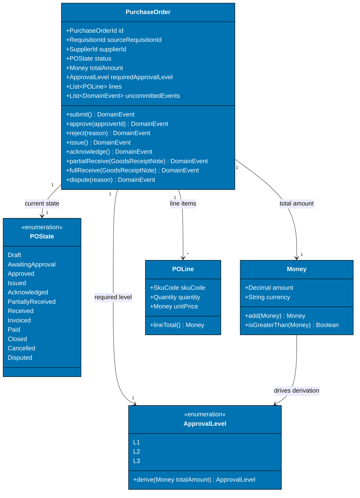

**Key Elements**:

- **Aggregate boundary**: PurchaseOrder owns POLine items — no direct access from outside
- **`uncommittedEvents` list**: Aggregate collects domain events internally; application service publishes them after save
- **`ApprovalLevel.derive()`**: Derives L1/L2/L3 from total — encapsulates the dollar-threshold business rule
- **All state-changing methods return DomainEvent**: Caller cannot miss the event — it is returned, not a side effect

**Design Rationale**: Returning domain events from aggregate methods (rather than emitting them as side effects) makes the event collection explicit and testable. A test can assert exactly which events were returned by `approve()`.

**Key Takeaway**: Model aggregate methods as returning domain events. Side-effect event emission hides events from unit tests and callers; return-based emission makes them visible and testable.

**Why It Matters**: Aggregates that emit events via side effects (e.g., directly calling an event bus) cannot be unit tested without a live event bus. Return-based event collection enables complete aggregate unit tests with zero infrastructure dependencies. Infrastructure-free aggregate tests run in milliseconds and can be executed on every commit, making test-driven development of P2P business rules practical without spinning up Kafka or a message broker.

---

### Example 62: PurchaseOrder.approve() — FSM Transition Guard

The `approve()` method is the most critical method in the aggregate. It enforces the FSM guard (state must be `AwaitingApproval`) before executing the transition.

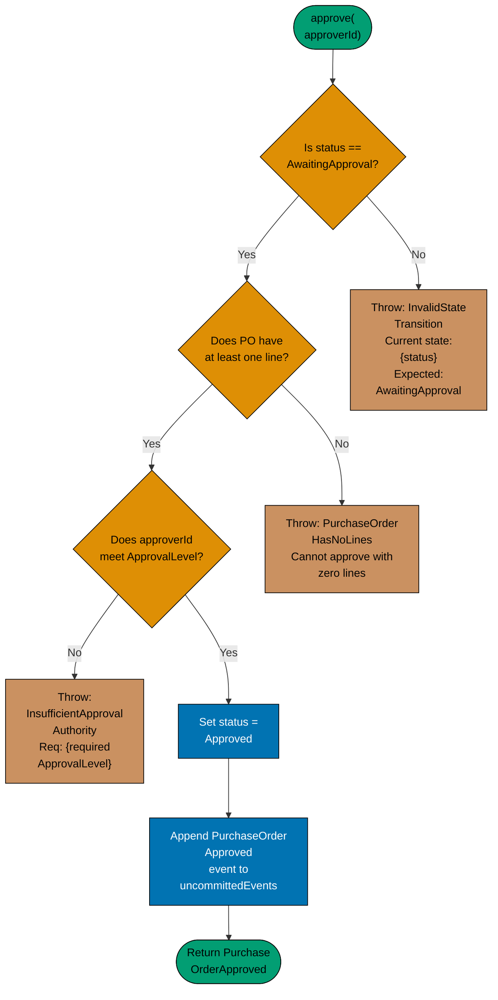

**Key Elements**:

- **Three guards in order**: State guard → lines guard → approval level guard
- **Distinct exception types**: Each guard throws a typed exception — no generic errors
- **Mutation only after all guards pass**: `status` is never mutated if a guard throws
- **Event appended before return**: `uncommittedEvents` accumulates the event

**Design Rationale**: Ordering guards from cheapest to most expensive (state check is O(1), approval level may require a DB lookup) optimizes for the common failure case. Most invalid calls fail at the state guard with zero additional cost.

**Key Takeaway**: Order FSM guards from cheapest to most expensive. State guard first, domain rule guard second, authorization guard last. This minimizes computation on invalid requests.

**Why It Matters**: Approval guard logic that allows a Buyer to approve their own requisition (missing authority check) or allows approval of a PO already in `Approved` state (missing state guard) produces a corrupted audit trail that undermines financial control compliance. When authorization checks are documented at the code-diagram level, compliance reviewers can confirm that segregation-of-duties requirements are enforced in the domain model without reading source code or waiting for an external audit finding.

---

### Example 63: PurchaseOrder State Machine — Full Transition Diagram

The full FSM for PurchaseOrder shows every state and transition, including off-ramp states (Cancelled, Disputed).

```mermaid
stateDiagram-v2
    accTitle: Example 63: PurchaseOrder State Machine — Full Transition Diagram
    accDescr: State diagram with 13 items: start or end, Draft, AwaitingApproval, Approved, Cancelled, Issued, Acknowledged, PartiallyReceived, Received, Invoiced, Paid, Closed, and 1 more. Relationships: start or end to Draft: created; Draft to AwaitingApproval: submit(); AwaitingApproval to Approved: approve(); AwaitingApproval to Cancelled: reject(); Approved to Issued: issue(); Issued to Acknowledged: acknowledge(); Acknowledged to PartiallyReceived: partialReceive(); Acknowledged to Received: fullReceive(); PartiallyReceived to PartiallyReceived: partialReceive(); PartiallyReceived to Received: fullReceive(); Received to Invoiced: invoiceMatched(); Invoiced to Paid: pay(); and 13 more.
    [*] --> Draft : created
    Draft --> AwaitingApproval : submit()
    AwaitingApproval --> Approved : approve()
    AwaitingApproval --> Cancelled : reject()
    Approved --> Issued : issue()
    Issued --> Acknowledged : acknowledge()
    Acknowledged --> PartiallyReceived : partialReceive()
    Acknowledged --> Received : fullReceive()
    PartiallyReceived --> PartiallyReceived : partialReceive()
    PartiallyReceived --> Received : fullReceive()
    Received --> Invoiced : invoiceMatched()
    Invoiced --> Paid : pay()
    Paid --> Closed : close()
    Draft --> Cancelled : cancel()
    AwaitingApproval --> Cancelled : cancel()
    Approved --> Cancelled : cancel()
    Issued --> Cancelled : cancel()
    Acknowledged --> Disputed : dispute()
    PartiallyReceived --> Disputed : dispute()
    Received --> Disputed : dispute()
    Invoiced --> Disputed : dispute()
    Disputed --> Approved : resolveApprove()
    Disputed --> Cancelled : resolveCancel()
    Cancelled --> [*]
    Closed --> [*]
```

**Key Elements**:

- **12 states**: Draft, AwaitingApproval, Approved, Issued, Acknowledged, PartiallyReceived, Received, Invoiced, Paid, Closed, Cancelled, Disputed
- **Off-ramp from any pre-Paid state**: `cancel()` is available until Paid
- **Disputed resolution**: Disputed can resolve to either Approved (data error) or Cancelled (unrecoverable)
- **PartiallyReceived self-loop**: Multiple partial receipts are valid before full receipt

**Design Rationale**: Mermaid stateDiagram-v2 is the most precise notation for FSM documentation. It produces an executable specification that can be validated against the aggregate implementation.

**Key Takeaway**: Use stateDiagram-v2 for FSM documentation. The diagram serves as a specification document for QA, product, and compliance teams — all of whom have authority over the transition rules.

**Why It Matters**: PO state machine violations (approving a Cancelled PO, issuing a Disputed PO) are financial controls failures. A published state machine diagram gives compliance and audit teams a verifiable specification to test against. State machine diagrams also serve as the definitive test specification — each valid transition becomes a positive test case and each invalid transition becomes a rejection test, ensuring complete behavioral coverage of the PO lifecycle.

---

### Example 64: PurchaseRequisition — Simplified State Machine

PurchaseRequisition has a shorter lifecycle: it exists only until converted to a PurchaseOrder.

```mermaid
stateDiagram-v2
    accTitle: Example 64: PurchaseRequisition — Simplified State Machine
    accDescr: State diagram with 7 items: start or end, Draft, Submitted, ManagerReview, Approved, Rejected, ConvertedToPO. Relationships: start or end to Draft: createDraft(); Draft to Submitted: submit(); Submitted to ManagerReview: routeForApproval(); ManagerReview to Approved: approve(); ManagerReview to Rejected: reject(); Approved to ConvertedToPO: convertToPO(); Rejected to start or end; ConvertedToPO to start or end.
    [*] --> Draft : createDraft()
    Draft --> Submitted : submit()
    Submitted --> ManagerReview : routeForApproval()
    ManagerReview --> Approved : approve()
    ManagerReview --> Rejected : reject()
    Approved --> ConvertedToPO : convertToPO()
    Rejected --> [*]
    ConvertedToPO --> [*]
```

**Key Elements**:

- **Six states**: Shorter lifecycle than PurchaseOrder
- **ConvertedToPO as terminal state**: Requisition ends when PO is created — it is not deleted, just archived
- **ManagerReview as explicit state**: Approval is not instantaneous — manager review is a distinct waiting state

**Design Rationale**: Keeping PurchaseRequisition as a separate aggregate from PurchaseOrder models reality accurately. A requisition can be rejected before ever becoming a PO; conflating them makes rejection modeling awkward.

**Key Takeaway**: Model requisition and purchase order as separate aggregates with separate state machines. Their lifecycles diverge at approval: rejected requisitions terminate, approved ones spawn a PO.

**Why It Matters**: Requisition-to-PO conversion tracking is a key procurement KPI (conversion rate, approval cycle time). Separate aggregates make this tracking straightforward — one aggregate for the request lifecycle, one for the fulfillment lifecycle. When every state transition is a domain event with a timestamp, procurement analytics dashboards can be built directly on the event log without requiring a separate reporting data model or custom ETL jobs.

---

### Example 65: PurchaseOrderId Value Object — Code Level

Value objects at code level show immutability, validation, and equality semantics.

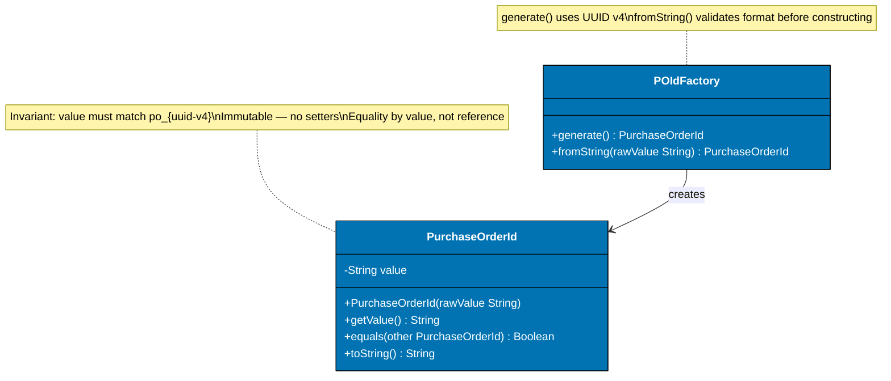

**Key Elements**:

- **Private `value` field**: No direct mutation — all access through `getValue()`
- **Constructor validates format**: `po_<uuid>` format enforced at construction — invalid IDs cannot exist
- **Equality by value**: Two `PurchaseOrderId` objects with the same string are equal
- **Factory separate from type**: `PurchaseOrderIdFactory.generate()` produces new IDs; `fromString()` re-hydrates

**Design Rationale**: Value objects with private constructors and factory methods ensure that invalid IDs cannot propagate through the system. An ID that fails format validation is rejected at construction, not at query time.

**Key Takeaway**: Code-level diagrams for value objects should show immutability (no setters), validation (constructor invariants), and equality semantics. These three properties define a valid value object.

**Why It Matters**: Systems that accept arbitrary strings as PO identifiers routinely encounter SQL injection vectors, cross-tenant ID guessing, and index scan inefficiencies. Format-validated value objects close all three risks at the type level. Value Objects also make domain language explicit in the type system, enabling compilers to catch category errors — such as passing a SupplierId where a PurchaseOrderId is required — at compile time rather than at runtime during production transactions.

---

### Example 66: Money Value Object — Arithmetic Safety

Money implements safe arithmetic to prevent currency mismatch bugs.

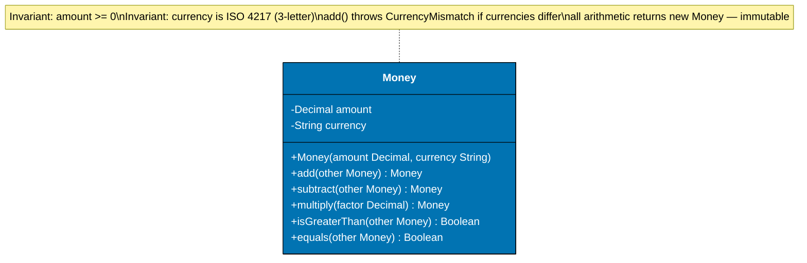

**Key Elements**:

- **`add()` throws CurrencyMismatch**: Cannot add USD to IDR — explicit guard
- **`multiply()` for quantity × unit price**: Used in PO line total calculation
- **All arithmetic returns new Money**: Immutable — no in-place mutation
- **`isGreaterThan()` for ApprovalLevel derivation**: $10,000 threshold check uses this method

**Design Rationale**: Arithmetic methods that return new Money instances enforce immutability. Methods that throw on currency mismatch prevent silent precision and currency conversion bugs.

**Key Takeaway**: Money arithmetic must be currency-aware and immutable. Unchecked arithmetic on money amounts (treating them as plain floats) produces currency mismatch bugs and floating-point rounding errors that corrupt payment amounts.

**Why It Matters**: ISO 20022 payment files carry exact decimal amounts. A float-based Money type that introduces rounding at the 15th decimal place produces payment amounts that differ from the invoice amount — triggering bank rejection or supplier disputes. Centralizing arithmetic in the Money Value Object ensures that currency conversion, rounding modes, and scale are applied consistently across all payment calculations rather than being implemented independently in each service.

---

### Example 67: GoodsReceiptNote Aggregate — Code Level

GoodsReceiptNote models the physical receipt event with quantity tolerance checking.

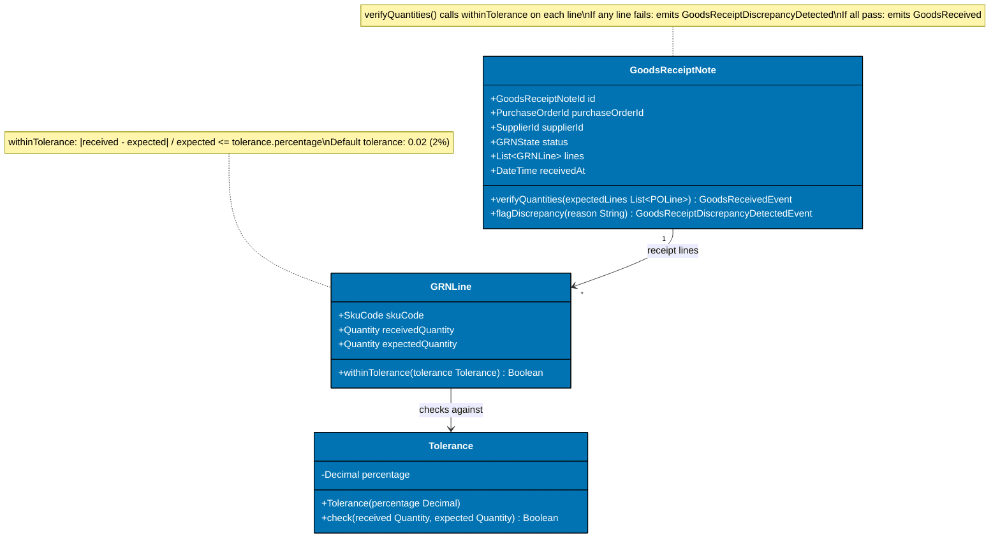

**Key Elements**:

- **Tolerance as value object**: Encapsulates 2% tolerance rule — not a magic number in a method
- **Two possible events**: `verifyQuantities()` returns either `GoodsReceived` or `GoodsReceiptDiscrepancyDetected`
- **Per-line tolerance check**: Every SKU line checked independently — not total-quantity comparison

**Design Rationale**: Per-line tolerance checking catches substitutions (receiving the correct total quantity but the wrong SKUs) that total-quantity checks miss. This is the correct implementation of three-way match tolerance.

**Key Takeaway**: Tolerance checking must be per-line, not per-total. Total-quantity tolerance allows SKU substitution fraud that per-line checking prevents.

**Why It Matters**: Suppliers who ship substituted goods (cheaper SKU in place of ordered SKU) exploit total-quantity tolerance checks. Per-line checking, modeled at code level with explicit `withinTolerance()` semantics, closes this audit gap. Code-level diagrams showing GRN line item validation make it clear that receiving-api must capture SKU-level quantities and apply tolerance checks per line, not just per shipment total, enabling finance teams to detect substitution before payment is authorized.

---

### Example 68: Domain Event — Code Level Structure

Domain events are immutable value objects with a timestamp, a source aggregate ID, and a payload.

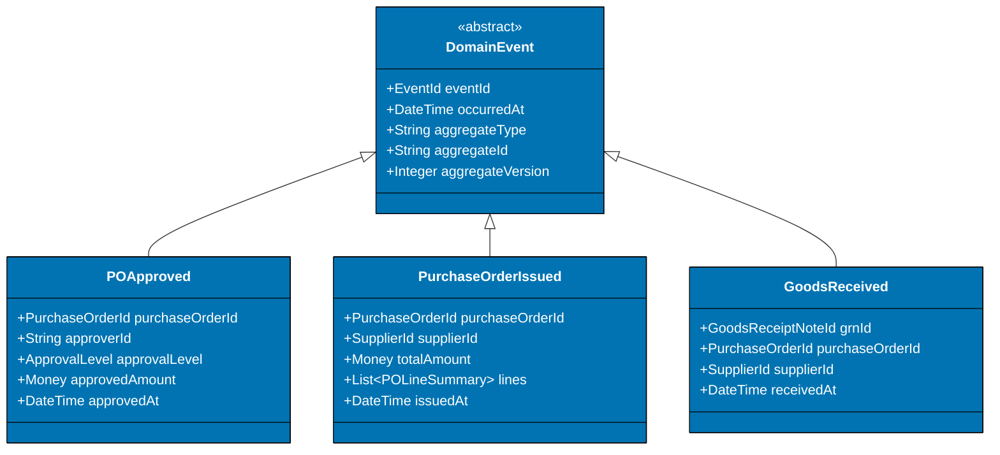

**Key Elements**:

- **Abstract base class**: All events share `eventId`, `occurredAt`, `aggregateType`, `aggregateId`, `aggregateVersion`
- **`aggregateVersion`**: Enables optimistic concurrency control — events carry the version at which they were raised
- **`PurchaseOrderIssued` carries line summary**: Downstream consumers (receiving-api) need line data without querying purchasing-api

**Design Rationale**: Events that carry sufficient payload reduce the need for consumers to query back into the producing context. `PurchaseOrderIssued` with line items means receiving-api can open GRN expectations without a synchronous PO query.

**Key Takeaway**: Include enough payload in domain events to satisfy common consumer needs without requiring callbacks into the producing context. Fat events reduce inter-service coupling at the cost of event schema versioning.

**Why It Matters**: Thin events (carrying only IDs) force consumers to query the producing service synchronously, creating temporal coupling. When purchasing-api is down, receiving-api cannot process a thin `PurchaseOrderIssued` event. Fat events with line summaries allow receiving-api to process the event independently. Event payload diagrams also function as schema contracts that consumer teams use to write deserializers and that schema registries use to enforce backward compatibility before breaking changes reach production.

---

## Dynamic Diagrams — P2P Lifecycle Flows (Examples 69–77)

### Example 69: Requisition Submission Flow — Dynamic Sequence

A dynamic sequence diagram traces one request across all containers and components in temporal order.

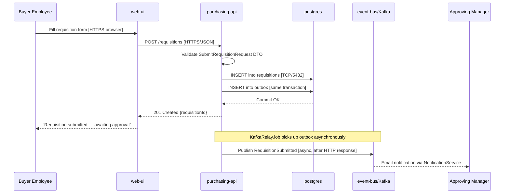

**Key Elements**:

- **Outbox transaction**: DB insert and outbox insert are in the same transaction — atomic
- **Async Kafka relay**: Event published after HTTP response — user is not blocked by Kafka latency
- **KafkaRelayJob note**: Clarifies that Kafka publish is decoupled from the HTTP request cycle

**Design Rationale**: The sequence diagram reveals the critical design decision: HTTP response is sent before Kafka publish. This means the user sees "submitted" before the approval notification is sent. This is acceptable if the relay lag is under one second.

**Key Takeaway**: Dynamic diagrams reveal the exact ordering of operations across containers. Use sequence diagrams to validate that the order of operations matches the desired user experience and consistency guarantees.

**Why It Matters**: Teams that do not draw sequence diagrams for key P2P flows routinely discover that their "successful submission" response is sent after Kafka publish — meaning a Kafka outage prevents users from submitting requisitions. The outbox pattern (publish after response) prevents this coupling. Walking through the sequence diagram with QA engineers before coding also generates the integration test scenarios that validate the complete flow in the staging environment against real infrastructure.

---

### Example 70: PO Approval Flow — Multi-Level Sequence

Tracing the approval flow through all three authorization levels as a dynamic sequence.

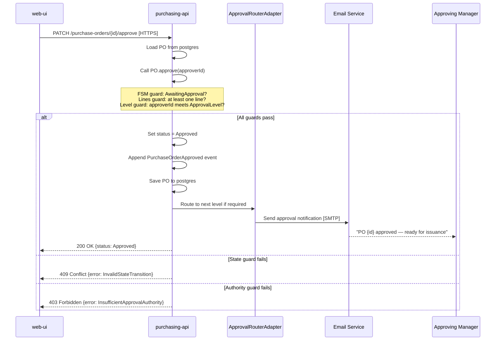

**Key Elements**:

- **Three alt branches**: Guards produce distinct HTTP status codes — 200, 409, 403
- **Guard order in note**: State → lines → level — cheapest guard first
- **Approval router called after save**: Notification is a side effect, not a pre-condition

**Design Rationale**: Showing the three alt branches with distinct status codes makes the API contract explicit. A 409 (state conflict) requires a different client response from a 403 (authority failure) — the API must distinguish them.

**Key Takeaway**: Model error paths in sequence diagrams using `alt` blocks. Error paths that return the same status code obscure the distinction between business rule failures and authorization failures.

**Why It Matters**: Approval UIs that cannot distinguish "wrong approver" (403) from "already approved" (409) display incorrect error messages, leading to support tickets and user frustration. Dynamic diagrams that show error branches drive correct API design. Explicit status codes in the sequence diagram also serve as the acceptance criteria that front-end engineers use to implement differentiated error handling in the approval interface, preventing generic error messages that confuse managers.

---

### Example 71: Goods Receipt Flow — Dynamic Sequence

The goods receipt flow shows how a warehouse operator entry triggers state changes in multiple containers.

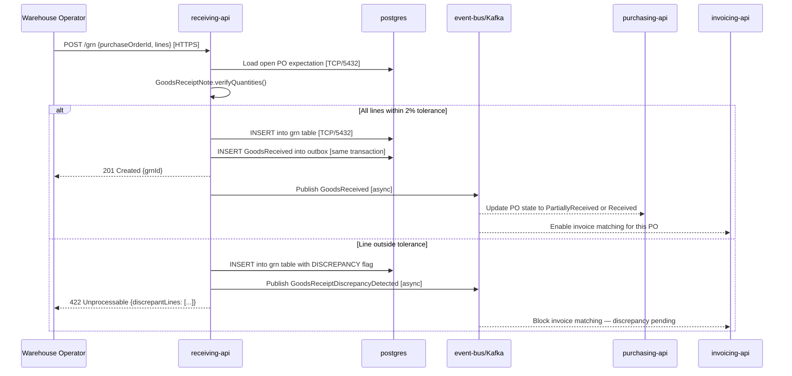

**Key Elements**:

- **Two alt branches**: Within tolerance → GoodsReceived; outside tolerance → Discrepancy event
- **Discrepancy blocks invoice matching**: InvAPI receives the discrepancy event and holds the invoice
- **Warehouse operator gets 422 with details**: Line-level discrepancy data returned for immediate action

**Design Rationale**: Returning discrepant line details in the 422 response means the warehouse operator knows immediately which SKUs have quantity issues, enabling same-day resolution rather than an overnight reconciliation cycle.

**Key Takeaway**: Goods receipt dynamic diagrams must show both the success and discrepancy paths. The discrepancy path triggers downstream blocking that can halt the entire P2P cycle — it must be designed explicitly.

**Why It Matters**: GRN discrepancies that are not surfaced immediately to warehouse operators result in delayed invoice matching, payment delays, and supplier relationship damage. Same-day resolution via explicit 422 responses is the difference between a well-designed and a poorly-designed receiving flow. Making discrepancy handling visible in the sequence diagram also prompts agreement on resolution SLAs — how long a warehouse operator has to confirm or dispute a quantity mismatch before the system automatically escalates to management.

---

### Example 72: Three-Way Match Flow — Dynamic Sequence

Invoice matching is the most complex flow in P2P, correlating data from three sources across multiple containers.

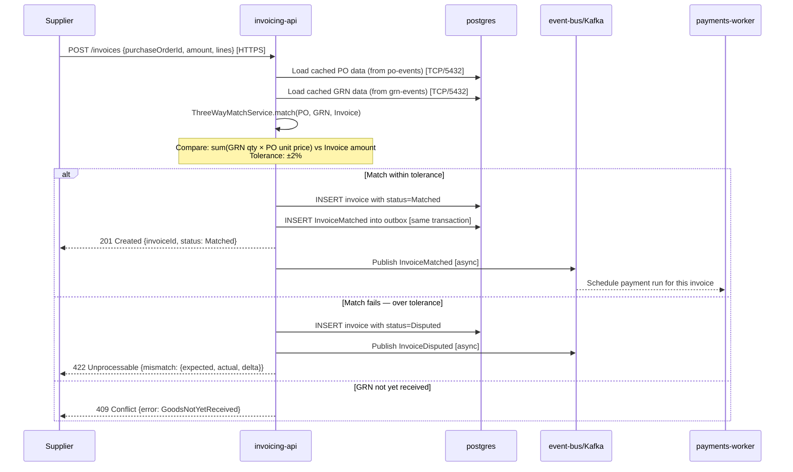

**Key Elements**:

- **Three alt branches**: Matched, Disputed, GRN not received — three distinct failure modes
- **GRN not received returns 409**: Invoice cannot be registered before goods are confirmed
- **Mismatch delta in 422 response**: Supplier receives exact delta — enabling immediate correction
- **Payment triggered by event**: PayWorker subscribes to InvoiceMatched — no polling

**Design Rationale**: Returning the exact mismatch delta in the 422 response means suppliers can correct and resubmit invoices without back-and-forth communication with the finance team.

**Key Takeaway**: Three-way match must be modeled as a dynamic diagram to expose the three failure modes. Each failure mode requires a different response to the supplier and a different state in the invoice aggregate.

**Why It Matters**: Invoice matching disputes are the single largest cause of payment delays in P2P. A matching flow that provides actionable error details (exact delta, missing GRN) reduces average dispute resolution from days to hours. Walking the matching sequence diagram with finance stakeholders before implementation also confirms which discrepancy conditions require human review versus automatic approval, aligning the system's behavior with the finance team's actual workflow.

---

### Example 73: Payment Run Flow — Dynamic Sequence

The payment run flow shows how the payments-worker processes a batch of matched invoices.

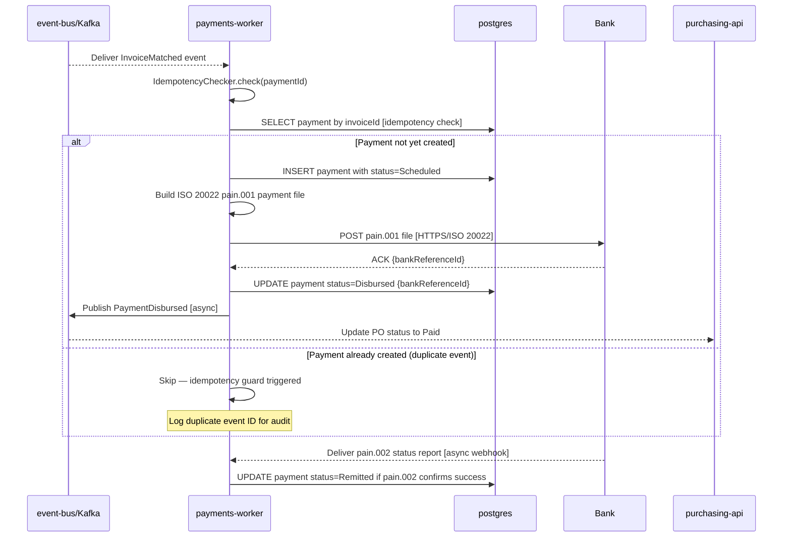

**Key Elements**:

- **Idempotency check first**: Before any state mutation, check if payment already exists for this invoiceId
- **pain.001 submission**: ISO 20022 payment initiation file sent to bank
- **pain.002 async callback**: Bank sends status report asynchronously — not in the same HTTP call
- **PO updated via event**: PurchaseOrder transitions to Paid through the event, not a direct call

**Design Rationale**: The idempotency check at the start of the payment flow is the last line of defense against double-payments. Kafka at-least-once delivery guarantees that `InvoiceMatched` may be delivered more than once; idempotency ensures only one payment is created per invoice.

**Key Takeaway**: Every payment flow must begin with an idempotency check. At-least-once Kafka delivery makes duplicate event processing inevitable — only idempotency makes it safe.

**Why It Matters**: Double-payments discovered after bank settlement require manual reversal processes that take days and damage supplier relationships. Idempotency checks that cost one database read prevent financial errors that cost thousands of person-hours to resolve. The payment run sequence diagram also serves as the runbook for on-call engineers investigating payment anomalies, reducing mean time to diagnosis during production incidents by providing a reference for expected system behavior.

---

### Example 74: Dispute Resolution Flow — Dynamic Sequence

When a GRN or invoice is disputed, a resolution flow must transition the PO through the Disputed state and back.

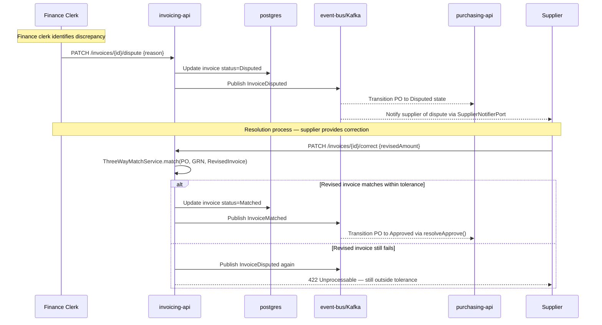

**Key Elements**:

- **PO transitions to Disputed via event**: InvAPI does not call purchasing-api directly
- **Supplier notified via SupplierNotifierPort**: Decoupled notification through the port
- **Resolution runs ThreeWayMatch again**: The match algorithm re-runs on the corrected invoice
- **PO re-enters Approved via `resolveApprove()`**: FSM transition from Disputed back to Approved

**Design Rationale**: Dispute resolution that re-runs the matching algorithm ensures the resolution path uses the same business rules as the initial match. Separate resolution logic would allow disputes to be resolved incorrectly.

**Key Takeaway**: Model dispute resolution as a complete dynamic diagram. Disputes that are resolved without re-running the match algorithm allow incorrect invoices to be cleared — a financial controls failure.

**Why It Matters**: Invoice disputes are the highest-risk transaction type in P2P. Dynamic diagrams that show the full dispute-to-resolution flow, including event chains across containers, enable compliance teams to audit the exact resolution path for any disputed invoice. Dispute resolution diagrams also define the state transitions that auditors check when investigating payment delays, making the audit trail verifiable against the design specification rather than requiring code inspection.

---

### Example 75: Cancelled PO Flow — Off-Ramp Sequence

A cancelled PO must notify the supplier and prevent further processing.

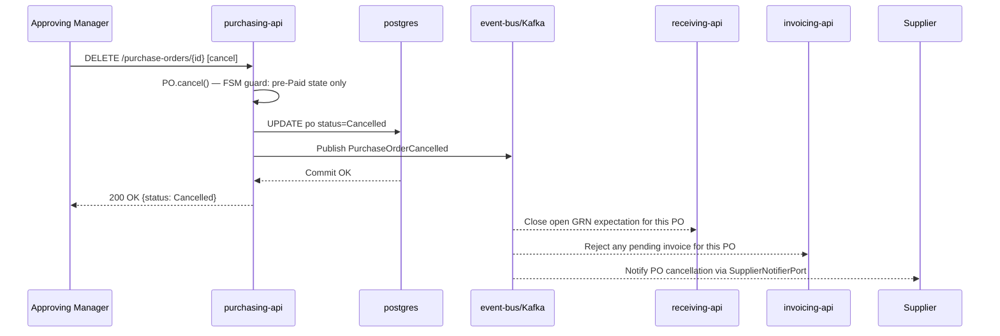

**Key Elements**:

- **FSM guard on cancel()**: Only pre-Paid state allows cancellation — guard enforced in aggregate
- **Three downstream consumers of Cancelled event**: receiving, invoicing, supplier notification
- **DELETE verb for cancellation**: Uses HTTP DELETE semantics — maps to FSM cancel transition

**Design Rationale**: Showing three downstream consumers of `PurchaseOrderCancelled` makes the fan-out visible. If receiving-api does not consume this event, warehouse staff could still attempt to receive goods against a cancelled PO.

**Key Takeaway**: Cancellation flows must explicitly show every downstream consumer that must react. Missing a consumer in the cancellation flow creates zombie workflows — processes that continue operating on cancelled orders.

**Why It Matters**: PO cancellations that do not notify receiving-api result in warehouse staff receiving goods that cannot be matched to any active PO, creating unmatched GRN records that require manual audit resolution. Including the cancellation sequence in architecture documentation also establishes the integration test scenario for receiving-api — verifying that it rejects GRN submissions against cancelled POs rather than silently accepting shipments that can never be matched.

---

### Example 76: Full P2P Happy Path — Abbreviated Sequence

The complete happy-path flow from requisition submission to payment confirmation in one diagram.

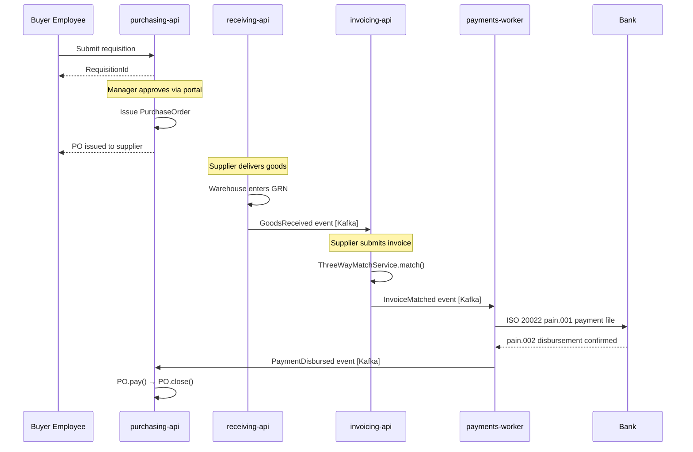

**Key Elements**:

- **Abbreviated for overview**: Notes replace detailed steps for human-driven interactions
- **Event connections shown**: Kafka events between containers are explicit
- **Final PO closure**: pay() followed by close() — two transitions to terminal state

**Design Rationale**: An abbreviated happy-path sequence diagram serves as an executive-level walkthrough of the P2P process, showing which containers are involved at each stage without the detailed alt branches.

**Key Takeaway**: Maintain both a detailed sequence diagram per flow and an abbreviated end-to-end diagram. The abbreviated diagram enables onboarding; the detailed diagrams enable debugging.

**Why It Matters**: New team members who understand the full P2P happy path from an abbreviated diagram can orient themselves in the codebase faster, reducing the time from onboarding to productive contribution. An abbreviated happy-path diagram also provides QA engineers with the end-to-end test scenario skeleton that exercises every service boundary in the P2P flow without requiring knowledge of every edge case or error branch.

---

### Example 77: Murabaha Financing Flow — Dynamic Sequence

When a high-value PO is financed through a Murabaha contract, the payment flow changes: the bank pays the supplier, and the buyer pays the bank in installments.

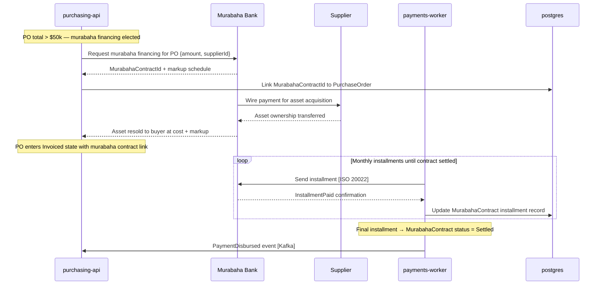

**Key Elements**:

- **Bank pays supplier directly**: Platform does not disburse to supplier — Murabaha Bank intermediates
- **Installment loop**: Multiple monthly payments until contract is settled
- **MurabahaContractId linked to PO**: The contract is associated with the PO in the purchasing schema

**Design Rationale**: Murabaha financing changes the payment architecture fundamentally. The dynamic diagram shows that the platform's role in the payment flow changes from "payer" to "installment scheduler" — a significant architectural difference.

**Key Takeaway**: Model Murabaha financing as a distinct dynamic flow, not as a variation of the standard payment flow. The three-party contract structure requires different containers and events from the two-party standard payment.

**Why It Matters**: Organizations entering Islamic finance markets that retrofit Murabaha into a standard payment architecture routinely violate the contractual structure of the Murabaha contract, creating Sharia compliance failures that invalidate the financing arrangement. An architecture-level Murabaha sequence diagram also gives Sharia scholars a reviewable artifact that does not require reading source code to assess whether the profit-rate, contract-acceptance, and disbursement steps follow the correct Sharia-compliant order.

---

## Deployment Diagrams (Examples 78–85)

### Example 78: Kubernetes Deployment — Basic Pod Layout

A deployment diagram shows where containers run and on what infrastructure. This example shows the Kubernetes deployment topology for the Procurement Platform.

```mermaid
graph TD
    accTitle: Example 78: Kubernetes Deployment — Basic Pod Layout
    accDescr: Graph with 8 nodes and 13 connections. Nodes: [Pod] purchasing-api 3 replicas 2 vCPU /4 GB RAM per pod, [Pod] receiving-api 2 replicas 1 vCPU /2 GB RAM per pod, [Pod] invoicing-api 2 replicas 1 vCPU /2 GB RAM per pod, [Pod] payments-worker 1 replica 2 vCPU / 4 GB RAM, [Ingress Controller] AWS ALB TLS termination, WAF, [Managed Service] AWS RDS PostgreSQL 16 Multi-AZ, db.r6g.xlarge, [Managed Service] AWS MSK Kafka 3.7 3 brokers, 6 partitions, [Managed Service] AWS Secrets Manager. Connections: [Ingress Controller] AWS ALB TLS termination, WAF to [Pod] purchasing-api 3 replicas 2 vCPU /4 GB RAM per pod (Routes to purchasing namespace), [Ingress Controller] AWS ALB TLS termination, WAF to [Pod] receiving-api 2 replicas 1 vCPU /2 GB RAM per pod (Routes to receiving namespace), [Ingress Controller] AWS ALB TLS termination, WAF to [Pod] invoicing-api 2 replicas 1 vCPU /2 GB RAM per pod (Routes to invoicing namespace), [Pod] purchasing-api 3 replicas 2 vCPU /4 GB RAM per pod to [Managed Service] AWS RDS PostgreSQL 16 Multi-AZ, db.r6g.xlarge (TCP/5432), [Pod] receiving-api 2 replicas 1 vCPU /2 GB RAM per pod to [Managed Service] AWS RDS PostgreSQL 16 Multi-AZ, db.r6g.xlarge (TCP/5432), [Pod] invoicing-api 2 replicas 1 vCPU /2 GB RAM per pod to [Managed Service] AWS RDS PostgreSQL 16 Multi-AZ, db.r6g.xlarge (TCP/5432), [Pod] payments-worker 1 replica 2 vCPU / 4 GB RAM to [Managed Service] AWS RDS PostgreSQL 16 Multi-AZ, db.r6g.xlarge (TCP/5432), [Pod] purchasing-api 3 replicas 2 vCPU /4 GB RAM per pod to [Managed Service] AWS MSK Kafka 3.7 3 brokers, 6 partitions (Kafka protocol), [Pod] receiving-api 2 replicas 1 vCPU /2 GB RAM per pod to [Managed Service] AWS MSK Kafka 3.7 3 brokers, 6 partitions (Kafka protocol), [Pod] invoicing-api 2 replicas 1 vCPU /2 GB RAM per pod to [Managed Service] AWS MSK Kafka 3.7 3 brokers, 6 partitions (Kafka protocol), [Pod] payments-worker 1 replica 2 vCPU / 4 GB RAM to [Managed Service] AWS MSK Kafka 3.7 3 brokers, 6 partitions (Kafka protocol), [Pod] purchasing-api 3 replicas 2 vCPU /4 GB RAM per pod to [Managed Service] AWS Secrets Manager (HTTPS), and 1 more.
    subgraph K8sCluster["Kubernetes Cluster —<br/>AWS EKS"]
        subgraph PurchNS["Namespace:<br/>purchasing"]
            PurchPod["[Pod]<br/>purchasing-api<br/>3 replicas<br/>2 vCPU /4 GB RAM per<br/>pod"]
        end

        subgraph RecvNS["Namespace: receiving"]
            RecvPod["[Pod]<br/>receiving-api<br/>2 replicas<br/>1 vCPU /2 GB RAM per<br/>pod"]
        end

        subgraph InvNS["Namespace: invoicing"]
            InvPod["[Pod]<br/>invoicing-api<br/>2 replicas<br/>1 vCPU /2 GB RAM per<br/>pod"]
        end

        subgraph PayNS["Namespace: payments"]
            PayPod["[Pod]<br/>payments-worker<br/>1 replica<br/>2 vCPU / 4 GB RAM"]
        end

        Ingress["[Ingress Controller]<br/>AWS ALB<br/>TLS termination, WAF"]
    end

    RDS["[Managed Service]<br/>AWS RDS PostgreSQL<br/>16<br/>Multi-AZ,<br/>db.r6g.xlarge"]
    MSK["[Managed Service]<br/>AWS MSK Kafka 3.7<br/>3 brokers, 6<br/>partitions"]
    Secrets["[Managed Service]<br/>AWS Secrets Manager"]

    Ingress -->|"Routes to<br/>purchasing<br/>namespace"| PurchPod
    Ingress -->|"Routes to receiving<br/>namespace"| RecvPod
    Ingress -->|"Routes to invoicing<br/>namespace"| InvPod
    PurchPod -->|"TCP/5432"| RDS
    RecvPod -->|"TCP/5432"| RDS
    InvPod -->|"TCP/5432"| RDS
    PayPod -->|"TCP/5432"| RDS
    PurchPod -->|"Kafka protocol"| MSK
    RecvPod -->|"Kafka protocol"| MSK
    InvPod -->|"Kafka protocol"| MSK
    PayPod -->|"Kafka protocol"| MSK
    PurchPod -->|"HTTPS"| Secrets
    PayPod -->|"HTTPS"| Secrets

    classDef pal-0173B2 fill:#0173B2,stroke:#000000,color:#FFFFFF
    class PurchPod pal-0173B2
    classDef pal-029E73 fill:#029E73,stroke:#000000,color:#000000
    class RecvPod pal-029E73
    class InvPod pal-029E73
    classDef pal-CC78BC fill:#CC78BC,stroke:#000000,color:#000000
    class PayPod pal-CC78BC
    classDef pal-DE8F05 fill:#DE8F05,stroke:#000000,color:#000000
    class Ingress pal-DE8F05
    classDef pal-CA9161 fill:#CA9161,stroke:#000000,color:#000000
    class RDS pal-CA9161
    class MSK pal-CA9161
    classDef pal-808080 fill:#808080,stroke:#000000,color:#000000
    class Secrets pal-808080
    classDef default fill:#FFFFFF,stroke:#000000,color:#000000
```

**Key Elements**:

- **Namespace-per-service**: Each API in its own Kubernetes namespace — network policy isolation
- **payments-worker: 1 replica**: Single instance enforced by deployment spec — no accidental scale-out
- **Managed services**: RDS, MSK, and Secrets Manager are AWS-managed, not self-hosted
- **Resource allocation visible**: vCPU and RAM in pod labels — capacity planning at diagram level

**Design Rationale**: Namespace-per-service enables Kubernetes NetworkPolicy to restrict cross-namespace traffic. purchasing-api pods cannot directly query invoicing-api's postgres schema — they must communicate through events.

**Key Takeaway**: Use separate Kubernetes namespaces per bounded context. Namespace isolation enforces the container-level data ownership decisions made in the Component diagrams.

**Why It Matters**: Kubernetes clusters without namespace isolation allow any pod to reach any database port. Namespace-scoped NetworkPolicy translates the bounded context boundaries from architectural diagrams into enforced network rules. Infrastructure engineers who provision clusters from deployment diagrams rather than from memory produce infrastructure-as-code that matches the architecture specification, reducing configuration drift between development, staging, and production environments.

---

### Example 79: Kubernetes — Health Check and Rolling Update

Deployment diagrams can show health check configuration and rolling update strategy for zero-downtime deployment.

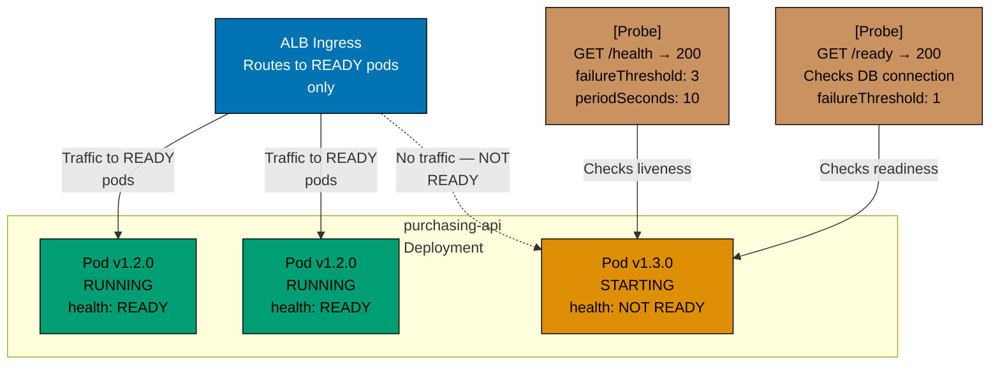

**Key Elements**:

- **Rolling update in progress**: v1.2.0 pods receive traffic; v1.3.0 pod is starting and not yet ready
- **ALB excludes NOT READY pods**: Zero-downtime — no user request reaches an unready pod
- **Two probe types with distinct thresholds**: Liveness tolerates 3 failures; readiness is strict (1 failure)

**Design Rationale**: The strict readiness probe (1 failure threshold) ensures that a pod without a database connection never receives user traffic. Tolerating readiness failures causes users to see 500 errors during startup.

**Key Takeaway**: Set readiness probe failure threshold to 1 for database-dependent APIs. Tolerating readiness failures routes user traffic to pods that cannot handle requests — directly causing user-visible errors.

**Why It Matters**: P2P platforms that experience partial rolling update failures (some pods ready, one without DB connection) produce intermittent 500 errors during deployment windows. Strict readiness probes make the failure complete and self-healing rather than intermittent and user-visible. Documenting the rolling update strategy in a deployment diagram also gives SREs the reference they need to configure `maxUnavailable` and `maxSurge` settings that match the platform's availability requirements before the first production deployment.

---

### Example 80: Kubernetes — Horizontal Pod Autoscaler

The HPA scales purchasing-api pods based on CPU and custom Kafka lag metrics.

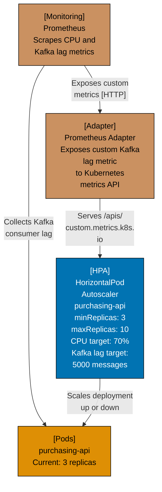

**Key Elements**:

- **Dual scaling metric**: CPU (70%) and Kafka consumer lag (5000 messages) — both trigger scaling
- **Prometheus Adapter**: Bridges Prometheus metrics to Kubernetes custom metrics API
- **minReplicas: 3**: Never scale below 3 — minimum for load distribution and availability

**Design Rationale**: Scaling on Kafka lag as well as CPU prevents the situation where CPU is low but the consumer is falling behind on event processing. Lag-based scaling catches throughput bottlenecks that CPU-only scaling misses.

**Key Takeaway**: Scale event-driven containers on consumer lag in addition to CPU. CPU-only scaling is insufficient for containers whose bottleneck is event processing throughput rather than compute.

**Why It Matters**: purchasing-api that falls behind on Kafka consumer lag during peak PO submission windows will miss `PaymentDisbursed` events, leaving POs stuck in `Invoiced` state indefinitely. Lag-based autoscaling prevents this accumulation. HPA configuration visible in deployment diagrams also allows SREs and product managers to agree on the scaling boundary — maximum replica count, cost ceiling, and lag threshold — before auto-scaling decisions are made independently by the cluster.

---

### Example 81: Deployment Diagram — Multi-Region Active-Active

For global P2P operations, the platform deploys in two regions with active-active traffic routing.

```mermaid
graph TD
    accTitle: Example 81: Deployment Diagram — Multi-Region Active-Active
    accDescr: Graph with 8 nodes and 8 connections. Nodes: Latency-based routing Buyer in APAC → APAC endpoint Buyer in EU → EU endpoint, EKS Cluster purchasing-api + receiving-api invoicing-api, RDS PostgreSQL Primary write node, MSK Kafka 3-broker cluster, EKS Cluster purchasing-api + receiving-api invoicing-api, RDS PostgreSQL Primary write node, MSK Kafka 3-broker cluster, Cross-Region MirrorMaker 2 Replicates events cross-region RPO: 30 seconds. Connections: Latency-based routing Buyer in APAC → APAC endpoint Buyer in EU → EU endpoint to EKS Cluster purchasing-api + receiving-api invoicing-api (Routes APAC buyers), Latency-based routing Buyer in APAC → APAC endpoint Buyer in EU → EU endpoint to EKS Cluster purchasing-api + receiving-api invoicing-api (Routes EU buyers), EKS Cluster purchasing-api + receiving-api invoicing-api to RDS PostgreSQL Primary write node (Writes [TCP/5432]), EKS Cluster purchasing-api + receiving-api invoicing-api to MSK Kafka 3-broker cluster (Events [Kafka]), EKS Cluster purchasing-api + receiving-api invoicing-api to RDS PostgreSQL Primary write node (Writes [TCP/5432]), EKS Cluster purchasing-api + receiving-api invoicing-api to MSK Kafka 3-broker cluster (Events [Kafka]), MSK Kafka 3-broker cluster to Cross-Region MirrorMaker 2 Replicates events cross-region RPO: 30 seconds (Replicates to EU), Cross-Region MirrorMaker 2 Replicates events cross-region RPO: 30 seconds to MSK Kafka 3-broker cluster (Delivers to EU Kafka).
    subgraph Route53["AWS Route53 — Global<br/>DNS"]
        DNS["Latency-based<br/>routing<br/>Buyer in APAC → APAC<br/>endpoint<br/>Buyer in EU → EU<br/>endpoint"]
    end

    subgraph APACRegion["APAC Region —<br/>ap-southeast-1"]
        APACCluster["EKS Cluster<br/>purchasing-api +<br/>receiving-api<br/>invoicing-api"]
        APACPostgres["RDS PostgreSQL<br/>Primary write node"]
        APACKafka["MSK Kafka<br/>3-broker cluster"]
    end

    subgraph EURegion["EU Region —<br/>eu-west-1"]
        EUCluster["EKS Cluster<br/>purchasing-api +<br/>receiving-api<br/>invoicing-api"]
        EUPostgres["RDS PostgreSQL<br/>Primary write node"]
        EUKafka["MSK Kafka<br/>3-broker cluster"]
    end

    CrossRegionReplication["Cross-Region<br/>MirrorMaker 2<br/>Replicates events<br/>cross-region<br/>RPO: 30 seconds"]

    DNS -->|"Routes APAC buyers"| APACCluster
    DNS -->|"Routes EU buyers"| EUCluster
    APACCluster -->|"Writes [TCP/5432]"| APACPostgres
    APACCluster -->|"Events [Kafka]"| APACKafka
    EUCluster -->|"Writes [TCP/5432]"| EUPostgres
    EUCluster -->|"Events [Kafka]"| EUKafka
    APACKafka -->|"Replicates to EU"| CrossRegionReplication
    CrossRegionReplication -->|"Delivers to EU<br/>Kafka"| EUKafka

    classDef pal-0173B2 fill:#0173B2,stroke:#000000,color:#FFFFFF
    class DNS pal-0173B2
    classDef pal-029E73 fill:#029E73,stroke:#000000,color:#000000
    class APACCluster pal-029E73
    class EUCluster pal-029E73
    classDef pal-CA9161 fill:#CA9161,stroke:#000000,color:#000000
    class APACPostgres pal-CA9161
    class EUPostgres pal-CA9161
    classDef pal-DE8F05 fill:#DE8F05,stroke:#000000,color:#000000
    class APACKafka pal-DE8F05
    class EUKafka pal-DE8F05
    classDef pal-CC78BC fill:#CC78BC,stroke:#000000,color:#000000
    class CrossRegionReplication pal-CC78BC
    classDef default fill:#FFFFFF,stroke:#000000,color:#000000
```

**Key Elements**:

- **Active-active routing**: Both regions serve traffic simultaneously — not active-passive
- **Region-local postgres**: Each region writes to its own database — no cross-region synchronous writes
- **Kafka MirrorMaker 2**: Asynchronous event replication with 30-second RPO
- **Latency-based DNS routing**: Buyers are routed to the nearest region by Route53

**Design Rationale**: Region-local postgres with event replication (rather than a shared global database) enables each region to write at full speed without cross-region latency. The 30-second RPO means EU invoices may not be immediately visible in APAC, but the system remains operational independently if a region fails.

**Key Takeaway**: Multi-region active-active deployments require region-local write stores. Cross-region synchronous writes create latency that defeats the purpose of multi-region deployment.

**Why It Matters**: Global procurement platforms that share a single database region force all writes through the primary region's network latency. APAC buyers submitting POs against an EU-hosted database experience 200ms+ latency for every transaction — an unacceptable UX degradation for a process that runs thousands of times daily. Multi-region deployment diagrams also surface the conflict resolution strategy for concurrent writes, a requirement that must be agreed upon by finance and engineering stakeholders before implementation.

---

### Example 82: Deployment Diagram — Blue-Green Deployment

Blue-green deployment enables zero-downtime releases with instant rollback capability.

```mermaid
graph TD
    accTitle: Example 82: Deployment Diagram — Blue-Green Deployment
    accDescr: Graph with 6 nodes and 5 connections. Nodes: AWS Application Load Balancer Current weights: Blue: 100 Green: 0, purchasing-api v1.4.2 3 pods — SERVING TRAFFIC, RDS PostgreSQL Schema v14, purchasing-api v1.5.0 3 pods — WARMED UP, IDLE, RDS PostgreSQL Schema v15 — migration run, [Test Suite] Green environment smoke tests Must pass before traffic switch. Connections: AWS Application Load Balancer Current weights: Blue: 100 Green: 0 to purchasing-api v1.4.2 3 pods — SERVING TRAFFIC (100 traffic), AWS Application Load Balancer Current weights: Blue: 100 Green: 0 to purchasing-api v1.5.0 3 pods — WARMED UP, IDLE (0 traffic (ready to switch)), purchasing-api v1.4.2 3 pods — SERVING TRAFFIC to RDS PostgreSQL Schema v14 (Reads/writes), purchasing-api v1.5.0 3 pods — WARMED UP, IDLE to RDS PostgreSQL Schema v15 — migration run (Reads/writes), [Test Suite] Green environment smoke tests Must pass before traffic switch to purchasing-api v1.5.0 3 pods — WARMED UP, IDLE (POST /requisitions smoke test [HTTPS]).
    ALB["AWS Application Load<br/>Balancer<br/>Current weights:<br/>Blue: 100%<br/>Green: 0%"]

    subgraph BlueEnv["Blue Environment —<br/>Current Production"]
        BluePods["purchasing-api<br/>v1.4.2<br/>3 pods — SERVING<br/>TRAFFIC"]
        BlueDB["RDS PostgreSQL<br/>Schema v14"]
    end

    subgraph GreenEnv["Green Environment —<br/>New Release"]
        GreenPods["purchasing-api<br/>v1.5.0<br/>3 pods — WARMED UP,<br/>IDLE"]
        GreenDB["RDS PostgreSQL<br/>Schema v15 —<br/>migration run"]
    end

    SmokeTest["[Test Suite]<br/>Green environment<br/>smoke tests<br/>Must pass before<br/>traffic switch"]

    ALB -->|"100% traffic"| BluePods
    ALB -.->|"0% traffic (ready<br/>to switch)"| GreenPods
    BluePods -->|"Reads/writes"| BlueDB
    GreenPods -->|"Reads/writes"| GreenDB
    SmokeTest -->|"POST /requisitions<br/>smoke test [HTTPS]"| GreenPods

    classDef pal-0173B2 fill:#0173B2,stroke:#000000,color:#FFFFFF
    class ALB pal-0173B2
    class BluePods pal-0173B2
    classDef pal-CA9161 fill:#CA9161,stroke:#000000,color:#000000
    class BlueDB pal-CA9161
    classDef pal-029E73 fill:#029E73,stroke:#000000,color:#000000
    class GreenPods pal-029E73
    class GreenDB pal-CA9161
    classDef pal-DE8F05 fill:#DE8F05,stroke:#000000,color:#000000
    class SmokeTest pal-DE8F05
    classDef default fill:#FFFFFF,stroke:#000000,color:#000000
```

**Key Elements**:

- **Two live environments**: Blue serves traffic; Green is ready but idle
- **Separate databases per environment**: Schema v14 (blue) vs v15 (green) — schema migration is independent
- **Smoke tests gate the switch**: Green must pass smoke tests before ALB shifts traffic
- **Instant rollback**: Set ALB weights to Blue: 100%, Green: 0% — rollback completes in seconds

**Design Rationale**: Blue-green deployment for P2P platforms is preferred over rolling updates because payment runs in progress on blue pods should not be interrupted. Blue-green keeps the current payment run on blue while green warms up.

**Key Takeaway**: Use blue-green deployment for payment-worker and invoicing-api to prevent interrupting in-progress payment runs during releases. Rolling updates risk splitting a payment run across old and new code versions.

**Why It Matters**: A payment worker that is halfway through a payment run when a rolling update replaces its pod may leave payments in an ambiguous state — initiated at the bank but not confirmed in the database. Blue-green deployment ensures that the current payment run completes on the stable environment before traffic switches.

---

### Example 83: Deployment Diagram — Database Migration Strategy

Database migrations in a multi-service deployment require careful ordering to prevent downtime.

```mermaid
graph LR
    accTitle: Example 83: Deployment Diagram — Database Migration Strategy
    accDescr: Graph with 6 nodes and 2 connections. Nodes: ALTER TABLE purchase_orders ADD COLUMN new_field TEXT DEFAULT NULL Old code: ignores new column New code: writes new column, Deploy purchasing-api v1.5.0 Reads and writes new_field Old code runs during rollout, ALTER TABLE purchase_orders ALTER new_field NOT NULL After 100 pods on v1.5.0, Step1, Step2, Step3. Connections: Step1 to Step2 (Migration runs first), Step2 to Step3 (All pods updated).
    subgraph Step1["Step 1:<br/>Backward-Compatible<br/>Migration"]
        M1["ALTER TABLE<br/>purchase_orders<br/>ADD COLUMN new_field<br/>TEXT<br/>DEFAULT NULL<br/>Old code: ignores<br/>new column<br/>New code: writes new<br/>column"]
    end

    subgraph Step2["Step 2: Deploy New<br/>Code"]
        D1["Deploy<br/>purchasing-api<br/>v1.5.0<br/>Reads and writes<br/>new_field<br/>Old code runs during<br/>rollout"]
    end

    subgraph Step3["Step 3: Remove Old<br/>Compatibility"]
        M2["ALTER TABLE<br/>purchase_orders<br/>ALTER new_field NOT<br/>NULL<br/>After 100% pods on<br/>v1.5.0"]
    end

    Step1 -->|"Migration runs<br/>first"| Step2
    Step2 -->|"All pods updated"| Step3

    classDef pal-0173B2 fill:#0173B2,stroke:#000000,color:#FFFFFF
    class M1 pal-0173B2
    classDef pal-DE8F05 fill:#DE8F05,stroke:#000000,color:#000000
    class D1 pal-DE8F05
    classDef pal-029E73 fill:#029E73,stroke:#000000,color:#000000
    class M2 pal-029E73
    classDef default fill:#FFFFFF,stroke:#000000,color:#000000
```

**Key Elements**:

- **Backward-compatible migration first**: New column added as nullable — old code runs without errors
- **Code deployment second**: New code writes the new column; old code coexists and ignores it
- **Constraint tightening last**: NOT NULL constraint applied only after all pods run new code

**Design Rationale**: The three-step expand/contract migration pattern ensures zero downtime. Adding a NOT NULL column before deploying new code causes old pods to fail with constraint violations — a downtime-causing migration mistake.

**Key Takeaway**: Always use backward-compatible (expand/contract) migrations for P2P schemas. A migration that causes old pods to fail produces downtime that cannot be resolved without a rollback of both code and schema.

**Why It Matters**: P2P schema migrations that cause downtime block purchase orders in flight from being saved to the database. Transactions in progress that cannot commit result in lost requisition data and angry buyers. Documenting the migration sequence in a deployment diagram also gives DBAs and release engineers a shared reference that prevents the expand-contract pattern from being skipped under delivery pressure, ensuring zero-downtime migrations even when timelines are tight.

---

### Example 84: Deployment Diagram — Observability Stack

The observability infrastructure for the Procurement Platform collects metrics, traces, and logs from all containers.

```mermaid
graph TD
    accTitle: Example 84: Deployment Diagram — Observability Stack
    accDescr: Graph with 11 nodes and 11 connections. Nodes: purchasing-api, receiving-api, invoicing-api, payments-worker, [Sidecar] OpenTelemetry Agent Collects traces and metrics per pod, [Deployment] OpenTelemetry Collector Central aggregation and export, Prometheus Metrics storage, Grafana Tempo Trace storage, Grafana Loki Log aggregation, Grafana Unified dashboard, [Person] On-Call Engineer. Connections: purchasing-api to [Sidecar] OpenTelemetry Agent Collects traces and metrics per pod (OTLP/gRPC traces and metrics), receiving-api to [Sidecar] OpenTelemetry Agent Collects traces and metrics per pod (OTLP/gRPC), invoicing-api to [Sidecar] OpenTelemetry Agent Collects traces and metrics per pod (OTLP/gRPC), payments-worker to [Sidecar] OpenTelemetry Agent Collects traces and metrics per pod (OTLP/gRPC), [Sidecar] OpenTelemetry Agent Collects traces and metrics per pod to [Deployment] OpenTelemetry Collector Central aggregation and export (Forwards to collector [OTLP]), [Deployment] OpenTelemetry Collector Central aggregation and export to Prometheus Metrics storage (Exports metrics [remote_write]), [Deployment] OpenTelemetry Collector Central aggregation and export to Grafana Tempo Trace storage (Exports traces [OTLP]), [Deployment] OpenTelemetry Collector Central aggregation and export to Grafana Loki Log aggregation (Exports logs [OTLP]), Prometheus Metrics storage to Grafana Unified dashboard (Queries metrics [PromQL]), Prometheus Metrics storage to [Person] On-Call Engineer (Alerts on threshold breach), Grafana Unified dashboard to [Person] On-Call Engineer (Displays metrics, traces, logs).
    subgraph AppTier["Application<br/>Containers"]
        PurchAPI["purchasing-api"]
        RecvAPI["receiving-api"]
        InvAPI["invoicing-api"]
        PayWorker["payments-worker"]
    end

    subgraph OtelLayer["OpenTelemetry Layer"]
        OtelAgent["[Sidecar]<br/>OpenTelemetry Agent<br/>Collects traces and<br/>metrics<br/>per pod"]
        OtelCollector["[Deployment]<br/>OpenTelemetry<br/>Collector<br/>Central aggregation<br/>and export"]
    end

    subgraph ObsSinks["Observability Sinks"]
        Prometheus["Prometheus<br/>Metrics storage"]
        Tempo["Grafana Tempo<br/>Trace storage"]
        Loki["Grafana Loki<br/>Log aggregation"]
        Grafana["Grafana<br/>Unified dashboard"]
    end

    OnCall["[Person]<br/>On-Call Engineer"]

    PurchAPI -->|"OTLP/gRPC traces<br/>and metrics"| OtelAgent
    RecvAPI -->|"OTLP/gRPC"| OtelAgent
    InvAPI -->|"OTLP/gRPC"| OtelAgent
    PayWorker -->|"OTLP/gRPC"| OtelAgent
    OtelAgent -->|"Forwards to<br/>collector [OTLP]"| OtelCollector
    OtelCollector -->|"Exports metrics<br/>[remote_write]"| Prometheus
    OtelCollector -->|"Exports traces<br/>[OTLP]"| Tempo
    OtelCollector -->|"Exports logs<br/>[OTLP]"| Loki
    Prometheus -->|"Queries metrics<br/>[PromQL]"| Grafana
    Prometheus -->|"Alerts on threshold<br/>breach"| OnCall
    Grafana -->|"Displays metrics,<br/>traces, logs"| OnCall

    classDef pal-0173B2 fill:#0173B2,stroke:#000000,color:#FFFFFF
    class PurchAPI pal-0173B2
    classDef pal-029E73 fill:#029E73,stroke:#000000,color:#000000
    class RecvAPI pal-029E73
    class InvAPI pal-029E73
    classDef pal-CC78BC fill:#CC78BC,stroke:#000000,color:#000000
    class PayWorker pal-CC78BC
    classDef pal-DE8F05 fill:#DE8F05,stroke:#000000,color:#000000
    class OtelAgent pal-DE8F05
    class OtelCollector pal-DE8F05
    classDef pal-CA9161 fill:#CA9161,stroke:#000000,color:#000000
    class Prometheus pal-CA9161
    class Tempo pal-CA9161
    class Loki pal-CA9161
    classDef pal-808080 fill:#808080,stroke:#000000,color:#000000
    class Grafana pal-808080
    class OnCall pal-029E73
    classDef default fill:#FFFFFF,stroke:#000000,color:#000000
```

**Key Elements**:

- **Sidecar OTel agent per pod**: Collects telemetry at pod level — no code changes in application
- **Central collector**: Single aggregation point before routing to sinks — vendor-swappable
- **Three observability pillars**: Metrics (Prometheus), traces (Tempo), logs (Loki) — complete observability

**Design Rationale**: Sidecar-based collection decouples telemetry instrumentation from application code. Applications emit OTLP; the collector decides where to route. Swapping from Tempo to Jaeger requires only collector config, not code changes.

**Key Takeaway**: Model the full observability stack as a deployment diagram. Observability is infrastructure — it has deployment topology, resource requirements, and failure modes that must be designed and documented.

**Why It Matters**: On-call engineers investigating P2P incidents without distributed traces spend hours on manual log correlation across purchasing-api, invoicing-api, and payments-worker. Distributed traces that correlate a single `purchaseOrderId` across all containers reduce mean time to resolution from hours to minutes. Observability infrastructure visible in deployment diagrams also defines the data retention and sampling rate decisions that must be made before the stack is deployed, when they are inexpensive to change.

---

### Example 85: C4 Diagram Versioning and Change Management

Managing C4 diagrams as versioned artifacts alongside code prevents documentation drift.

```mermaid
graph TD
    accTitle: Example 85: C4 Diagram Versioning and Change Management
    accDescr: Graph with 6 nodes and 6 connections. Nodes: [Repository] Architecture Diagrams Stored as Mermaid text in Git Same repo as application code, [CI Check] Architecture Review Gate PR requires diagram update if container or component added, [Directory] Architecture Decision Records ADR-001: Use Kafka for events ADR-002: Schema-per-service ADR-003: Outbox pattern, [Artifact] Container Diagram v2.4 Last updated: when payments-worker added Linked from ARCHITECTURE.md, [Artifact] Component Diagram v1.8 purchasing-api internal structure Updated with each new handler, [Process] Monthly Architecture Review Validate diagrams match implementation Identify drift. Connections: [Repository] Architecture Diagrams Stored as Mermaid text in Git Same repo as application code to [CI Check] Architecture Review Gate PR requires diagram update if container or component added (PR lint checks diagram syntax), [Repository] Architecture Diagrams Stored as Mermaid text in Git Same repo as application code to [Directory] Architecture Decision Records ADR-001: Use Kafka for events ADR-002: Schema-per-service ADR-003: Outbox pattern (Stores), [Repository] Architecture Diagrams Stored as Mermaid text in Git Same repo as application code to [Artifact] Container Diagram v2.4 Last updated: when payments-worker added Linked from ARCHITECTURE.md (Stores), [Repository] Architecture Diagrams Stored as Mermaid text in Git Same repo as application code to [Artifact] Component Diagram v1.8 purchasing-api internal structure Updated with each new handler (Stores), [Artifact] Container Diagram v2.4 Last updated: when payments-worker added Linked from ARCHITECTURE.md to [Directory] Architecture Decision Records ADR-001: Use Kafka for events ADR-002: Schema-per-service ADR-003: Outbox pattern (References), [Process] Monthly Architecture Review Validate diagrams match implementation Identify drift to [Repository] Architecture Diagrams Stored as Mermaid text in Git Same repo as application code (Validates diagrams against).
    ArchRepo["[Repository]<br/>Architecture<br/>Diagrams<br/>Stored as Mermaid<br/>text in Git<br/>Same repo as<br/>application code"]
    PRCheck["[CI Check]<br/>Architecture Review<br/>Gate<br/>PR requires diagram<br/>update<br/>if container or<br/>component added"]
    ADRDir["[Directory]<br/>Architecture<br/>Decision Records<br/>ADR-001: Use Kafka<br/>for events<br/>ADR-002:<br/>Schema-per-service<br/>ADR-003: Outbox<br/>pattern"]
    ContainerDiagram["[Artifact]<br/>Container Diagram<br/>v2.4<br/>Last updated: when<br/>payments-worker<br/>added<br/>Linked from<br/>ARCHITECTURE.md"]
    ComponentDiagram["[Artifact]<br/>Component Diagram<br/>v1.8<br/>purchasing-api<br/>internal structure<br/>Updated with each<br/>new handler"]
    TeamReview["[Process]<br/>Monthly Architecture<br/>Review<br/>Validate diagrams<br/>match implementation<br/>Identify drift"]

    ArchRepo -->|"PR lint checks<br/>diagram syntax"| PRCheck
    ArchRepo -->|"Stores"| ADRDir
    ArchRepo -->|"Stores"| ContainerDiagram
    ArchRepo -->|"Stores"| ComponentDiagram
    ContainerDiagram -->|"References"| ADRDir
    TeamReview -->|"Validates diagrams<br/>against"| ArchRepo

    classDef pal-0173B2 fill:#0173B2,stroke:#000000,color:#FFFFFF
    class ArchRepo pal-0173B2
    classDef pal-DE8F05 fill:#DE8F05,stroke:#000000,color:#000000
    class PRCheck pal-DE8F05
    classDef pal-CA9161 fill:#CA9161,stroke:#000000,color:#000000
    class ADRDir pal-CA9161
    classDef pal-029E73 fill:#029E73,stroke:#000000,color:#000000
    class ContainerDiagram pal-029E73
    class ComponentDiagram pal-029E73
    classDef pal-CC78BC fill:#CC78BC,stroke:#000000,color:#000000
    class TeamReview pal-CC78BC
    classDef default fill:#FFFFFF,stroke:#000000,color:#000000
```

**Key Elements**:

- **Diagrams in the same repo as code**: Co-location ensures diagrams are updated with code changes
- **CI gate on diagram updates**: PRs that add containers must update the Container diagram
- **Monthly architecture review**: Human validation that diagrams still match implementation
- **ADRs linked from diagrams**: Architectural decisions traceable from the diagram element

**Design Rationale**: Storing Mermaid diagrams as text in Git gives architecture diagrams the same versioning, review, and rollback capabilities as code. Diagrams stored in Confluence or draw.io cannot be diffed in pull requests.

**Key Takeaway**: Store C4 diagrams as Mermaid text in the same repository as the application code. Treat diagram updates as a required change in PRs that introduce new containers or components.

**Why It Matters**: Architecture diagrams that are not version-controlled drift from the implementation within months. A P2P platform where the Container diagram no longer reflects the actual deployment topology is a platform where on-call engineers cannot trust architectural documentation during incidents — when correct documentation is most critical. Version-controlled diagrams also enable automated checks — such as CI pipeline steps that verify diagram syntax and flag diagrams not updated when related source files change.
