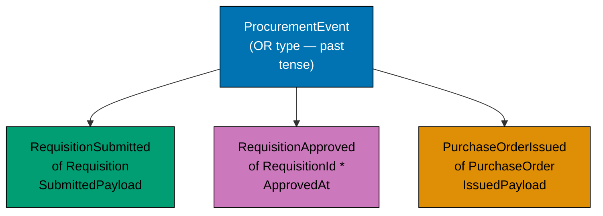
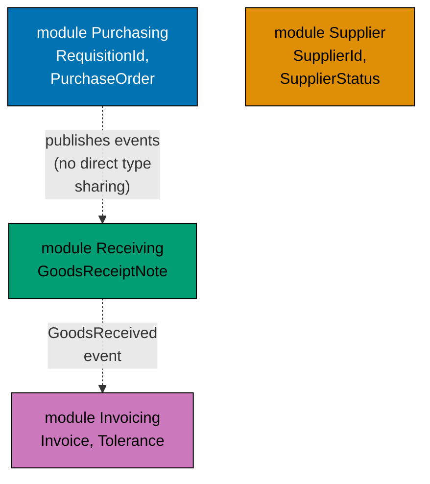
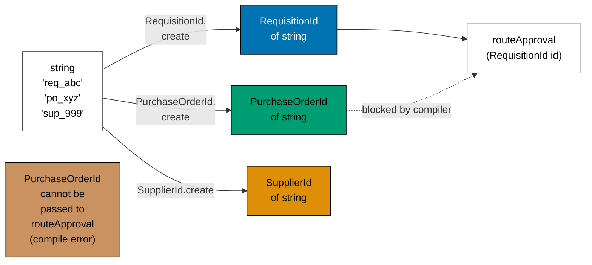
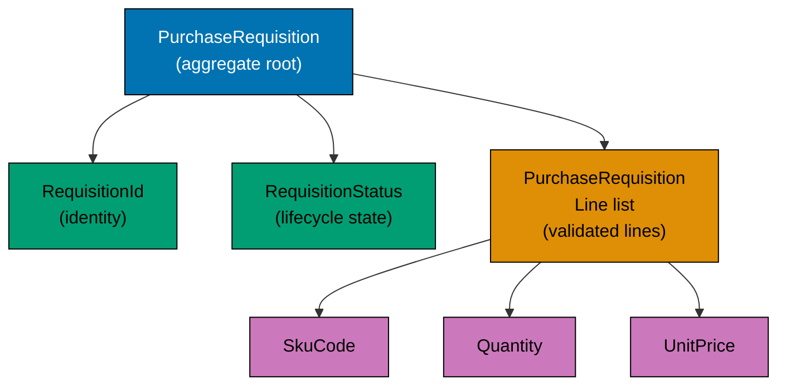
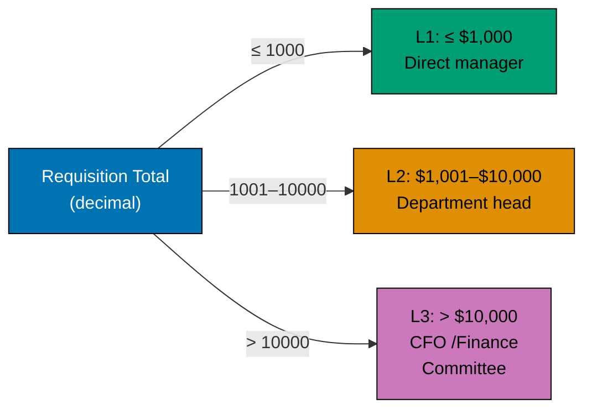

This beginner-level section introduces DDD through type-system design, using the `purchasing` bounded context of a Procure-to-Pay procurement platform. The central thesis — **encode business rules in the type system so illegal states are unrepresentable** — is established through 25 progressive examples built around `PurchaseRequisition`, `Money`, `SkuCode`, `Quantity`, and `RequisitionId`. Examples are shown in F# (canonical), with Clojure, TypeScript, and Haskell equivalents throughout.

## Types as the Design (Examples 1–10)

### Example 1: Ubiquitous Language as Type Aliases

Ubiquitous language means every term the business uses has an exact counterpart in the code. In FP a type alias is the cheapest way to honour this: it gives the domain concept a name at zero runtime cost without forcing the developer through a wrapper constructor at every use-site. The alias lives next to the rest of the domain model and is visible to both developers and procurement domain experts reading the code.





```fsharp
// ── file: PurchasingDomain.fs ─────────────────────────────────────────────
// Type aliases map procurement vocabulary directly to F# identifiers.
// The compiler treats these as the same underlying type but the names
// document intent and form the shared dictionary of the purchasing context.
// [Clojure: namespaced keywords :purchasing/requisition-id — no type alias needed; keywords are the lingua franca]

// "A requisition is identified by a RequisitionId, not a raw string"
type RequisitionId = string
// => RequisitionId is an alias for string; no boxing, no overhead

type PurchaseOrderId = string
// => Distinct alias; prevents accidentally mixing RequisitionId and PurchaseOrderId in signatures

type SupplierId = string
// => Every important noun in the domain gets its own alias

type SkuCode = string
// => SKU code alias; raw (string -> string -> string) becomes (RequisitionId -> SupplierId -> SkuCode) — self-documenting

// Usage in a workflow function signature — pure documentation value
type GetRequisitionById = RequisitionId -> string option
// => Arrow type reads "given a RequisitionId, produce an optional string"
// => Domain experts can read this as "look up a requisition by its id"

printfn "Type aliases defined — zero runtime cost, maximum documentation value"
// => Output: Type aliases defined — zero runtime cost, maximum documentation value
```





```clojure
;; ── file: purchasing_domain.clj ───────────────────────────────────────────
;; Ubiquitous language in Clojure is expressed through namespaced keywords.
;; [F#: type alias (type RequisitionId = string) — compile-time name only; Clojure uses runtime keywords]
;; Namespaced keywords act as the shared vocabulary of the purchasing context.

(ns purchasing.domain
  ;; => Namespace declaration establishes the purchasing bounded context
  ;; => All vars and keywords defined here belong to the purchasing namespace
  )

;; In Clojure, domain identity is expressed via namespaced keywords on maps,
;; not via type aliases. ::purchasing/requisition-id IS the ubiquitous language.
(def sample-requisition
  ;; => A plain Clojure map is the domain entity — no class or record needed
  {:purchasing/requisition-id  "req_f4c2a1b7"
   ;; => ::requisition-id expands to :purchasing/requisition-id — self-documenting
   :purchasing/purchase-order-id nil
   ;; => nil until a PO is created from this requisition
   :purchasing/supplier-id     "sup_001"
   ;; => Namespaced key — distinct from :supplier/supplier-id in the supplier context
   :purchasing/sku-code        "OFF-0042"
   ;; => SKU code as a plain string value under its domain-namespaced key
   })
;; => sample-requisition : map — all keys are namespaced keywords

;; A workflow function signature documents the ubiquitous language via its key names
(defn get-requisition-by-id
  ;; => Takes a requisition-id (string), returns a map or nil — equivalent to option
  [requisition-id]
  ;; => requisition-id : string — the purchasing domain identifier
  (when (seq requisition-id)
    ;; => (seq s) is truthy for non-empty strings — guard against blank IDs
    {:purchasing/requisition-id requisition-id}))
;; => Returns a map (found) or nil (not found) — idiomatic Clojure option pattern

(println "Namespaced keywords defined — runtime vocabulary, REPL-readable")
;; => Output: Namespaced keywords defined — runtime vocabulary, REPL-readable
```





```typescript
// ── file: purchasingDomain.ts ────────────────────────────────────────────────
// Branded types map procurement vocabulary to distinct TypeScript identifiers.
// Unlike plain string aliases, branded types prevent accidental interchangeability.
// [F#: type alias (type RequisitionId = string) — zero overhead; TS brands add nominal safety]
// [Clojure: namespaced keywords :purchasing/requisition-id — runtime; TS brands are compile-time]

// Branded ID types — each is a distinct nominal type at compile time
type RequisitionId = string & { readonly __brand: "RequisitionId" };
// => Branding makes RequisitionId distinct from PurchaseOrderId at compile time
// => No runtime overhead — the brand exists only in the type system

type PurchaseOrderId = string & { readonly __brand: "PurchaseOrderId" };
// => Distinct from RequisitionId — cannot be accidentally substituted

type SupplierId = string & { readonly __brand: "SupplierId" };
// => Every important domain noun gets its own branded type

type SkuCode = string & { readonly __brand: "SkuCode" };
// => SkuCode brand — raw (string -> string -> string) becomes self-documenting

// Helper casts — used only at the validated boundary (smart constructors)
const asRequisitionId = (s: string): RequisitionId => s as RequisitionId;
// => Cast is safe here: called only after validation
const asPurchaseOrderId = (s: string): PurchaseOrderId => s as PurchaseOrderId;
// => Each brand gets its own cast function

// Usage in a workflow function signature — pure documentation value
type GetRequisitionById = (id: RequisitionId) => string | null;
// => Arrow type reads "given a RequisitionId, produce a string or null"
// => Domain experts can read this as "look up a requisition by its id"

const reqId: RequisitionId = asRequisitionId("req_f4c2a1b7");
// => reqId : RequisitionId — branded type prevents passing a SupplierId here

console.log("Branded types defined — zero runtime cost, maximum documentation value");
// => Output: Branded types defined — zero runtime cost, maximum documentation value
```





```haskell
-- ── file: PurchasingDomain.hs ─────────────────────────────────────────────
-- Type aliases map procurement vocabulary directly to Haskell identifiers.
-- For zero-cost documentation, use 'type'; for nominal safety, use 'newtype'.
-- [F#: type alias (type RequisitionId = string) — compile-time name only]
-- [Clojure: namespaced keywords :purchasing/requisition-id — runtime vocabulary]
-- [TypeScript: branded type for nominal safety; this Haskell tab shows both forms]

{-# LANGUAGE OverloadedStrings #-}

module PurchasingDomain where

import Data.Text (Text)
-- => Text is the canonical string type for procurement vocabulary.

-- "A requisition is identified by a RequisitionId, not a raw Text"
type RequisitionId = Text
-- => RequisitionId is an alias for Text; no runtime cost, pure documentation.

type PurchaseOrderId = Text
-- => Distinct alias name — prevents accidentally mixing the meanings in signatures.

type SupplierId = Text
-- => Every important noun in the domain gets its own alias.

type SkuCode = Text
-- => Raw (Text -> Text -> Text) becomes (RequisitionId -> SupplierId -> SkuCode).
-- => Self-documenting signature for domain experts and developers.

-- Usage in a workflow function signature — pure documentation value
type GetRequisitionById = RequisitionId -> Maybe Text
-- => Reads "given a RequisitionId, produce an optional Text".
-- => Domain experts can read this as "look up a requisition by its id".

-- Example function with the documented type alias.
getRequisitionById :: GetRequisitionById
getRequisitionById _ = Just "stub"
-- => Returns Just for the example; production code does a real lookup.

main :: IO ()
main = putStrLn "Type aliases defined - zero runtime cost, maximum documentation value"
-- => Output: Type aliases defined - zero runtime cost, maximum documentation value
```





**Key Takeaway**: Type aliases convert the ubiquitous language of procurement into domain-named identifiers at zero runtime cost and maximum readability. In F# these are `type` aliases; Clojure uses spec keywords; TypeScript uses type aliases; Haskell uses `type` aliases or `newtype` declarations — all achieving the same readable domain vocabulary.

**Why It Matters**: When a new developer joins the procurement platform team and reads `RequisitionId -> SupplierId -> SkuCode`, they immediately understand the function's purpose from the domain vocabulary. Without aliases, `string -> string -> string` forces them to read the implementation to understand what each argument represents. This is the simplest possible application of type-driven DDD: make the domain model readable to domain experts — a purchasing manager or procurement analyst should recognise every identifier. Even before writing any logic, type aliases establish the vocabulary that will permeate every function signature and module.

---

### Example 2: Domain Event Named in Past Tense

Domain events represent facts that have already occurred in the domain. DDD convention names events in the past tense, making them read as business facts. A typical functional representation pairs a closed sum of event variants with their payload data, so the type system enumerates every fact that can occur in the domain.







```fsharp
// Domain events are immutable facts — something that happened in the domain.
// Past-tense naming is a DDD convention — event = something that already occurred.
// [Clojure: maps with :event/type keyword — open dispatch, no closed union; see defmulti pattern]

// The payload carries everything a downstream consumer needs to react
type RequisitionSubmittedPayload = {
    // => Record type groups related fields; all immutable by default
    RequisitionId: string
    // => The identifier of the submitted requisition
    RequestedBy: string
    // => Who submitted it — approval router needs this for routing logic
    TotalAmount: decimal
    // => Sum of all line items — determines the approval level (L1/L2/L3)
    SubmittedAt: System.DateTimeOffset
    // => Timestamp — used for SLA tracking and audit trail
}
// => RequisitionSubmittedPayload : record with four fields

// The top-level event DU — each case IS a different event
type ProcurementEvent =
    | RequisitionSubmitted of RequisitionSubmittedPayload
    // => Fired when an employee submits a purchase requisition
    // => Consumer: approval-router routes to the correct manager
    | RequisitionApproved  of requisitionId: string * approvedAt: System.DateTimeOffset
    // => Fired when a manager approves the requisition
    // => Consumer: purchasing context auto-converts to a PO Draft
    | PurchaseOrderIssued  of purchaseOrderId: string * supplierId: string
    // => Fired when an approved PO is formally sent to the supplier
    // => Consumer: supplier-notifier, receiving context (opens GRN expectation)

// Constructing events
let submitted = RequisitionSubmitted {
    RequisitionId = "req_f4c2a1b7"
    // => Canonical format: "req_" prefix + UUID v4 segment
    RequestedBy   = "emp_00123"
    // => Employee identifier — drives approval routing
    TotalAmount   = 2500.00m
    // => 2 500 USD — falls in L2 approval bracket (≤ $10 k)
    SubmittedAt   = System.DateTimeOffset.UtcNow
    // => Wall-clock timestamp captured at submission time
}
// => submitted : ProcurementEvent = RequisitionSubmitted { ... }

printfn "Event created: %A" submitted
// => Output: Event created: RequisitionSubmitted { RequisitionId = "req_f4c2a1b7"; ... }
```





```clojure
;; Domain events in Clojure are plain maps with a namespaced :event/type key.
;; [F#: discriminated union (type ProcurementEvent = ...) — closed, compiler-exhaustive]
;; Clojure events are open: adding a new event type requires no change to existing consumers.

(ns purchasing.events
  (:require [clojure.spec.alpha :as s]))
;; => Namespace scopes all event definitions to the purchasing context

;; Spec the requisition-submitted payload — enforces domain invariants at runtime
(s/def :event/type keyword?)
;; => Every event map must carry a :event/type keyword for dispatch

(s/def :requisition/id string?)
(s/def :requisition/requested-by string?)
(s/def :requisition/total-amount decimal?)
(s/def :requisition/submitted-at inst?)
;; => Each field spec mirrors the F# record field — validated at system boundaries

(s/def :event/requisition-submitted
  ;; => Spec for the full requisition-submitted event map
  (s/keys :req [:event/type
                :requisition/id
                :requisition/requested-by
                :requisition/total-amount
                :requisition/submitted-at]))
;; => s/keys enforces required keys — analogous to F# record's required fields

;; Constructor function — past-tense name, returns a validated map
(defn requisition-submitted
  ;; [F#: RequisitionSubmitted of RequisitionSubmittedPayload — DU constructor]
  ;; Clojure equivalent: a factory function returning a map with :event/type dispatch key
  [requisition-id requested-by total-amount submitted-at]
  {:event/type                  :procurement/requisition-submitted
   ;; => :event/type is the dispatch key — consumers pattern-match on this keyword
   :requisition/id              requisition-id
   ;; => Namespaced key prevents collision with other contexts' id fields
   :requisition/requested-by   requested-by
   :requisition/total-amount   total-amount
   :requisition/submitted-at   submitted-at})
;; => Returns a plain map — printable, serialisable, REPL-inspectable

;; Constructing an event
(def submitted
  (requisition-submitted
    "req_f4c2a1b7"
    "emp_00123"
    2500.00M
    ;; => BigDecimal literal for monetary amounts — avoids floating-point precision loss
    (java.time.Instant/now)))
;; => submitted : map with :event/type :procurement/requisition-submitted

(println "Event created:" submitted)
;; => Output: Event created: {:event/type :procurement/requisition-submitted, ...}
```





```typescript
// Domain events are readonly objects with a discriminant literal type.
// Past-tense naming signals an immutable fact that already occurred.
// [F#: DU with payload records — compile-time exhaustive match; TS uses tagged unions]
// [Clojure: maps with :event/type keyword — open runtime dispatch; TS tags are closed]

// Branded IDs
type RequisitionId = string & { readonly __brand: "RequisitionId" };
type PurchaseOrderId = string & { readonly __brand: "PurchaseOrderId" };
type SupplierId = string & { readonly __brand: "SupplierId" };
const asRequisitionId = (s: string): RequisitionId => s as RequisitionId;

// Payload record for the RequisitionSubmitted event
interface RequisitionSubmittedPayload {
  readonly requisitionId: RequisitionId;
  // => The identifier of the submitted requisition
  readonly requestedBy: string;
  // => Who submitted it — approval router needs this for routing logic
  readonly totalAmount: number;
  // => Sum of all line items — determines the approval level (L1/L2/L3)
  readonly submittedAt: string;
  // => ISO 8601 timestamp — used for SLA tracking and audit trail
}
// => RequisitionSubmittedPayload : readonly interface with four fields

// Tagged union for procurement events — literal type tags close the set
type ProcurementEvent =
  | { readonly type: "RequisitionSubmitted"; readonly payload: RequisitionSubmittedPayload }
  // => Fired when an employee submits a purchase requisition
  | { readonly type: "RequisitionApproved"; readonly requisitionId: RequisitionId; readonly approvedAt: string }
  // => Fired when a manager approves the requisition
  | {
      readonly type: "PurchaseOrderIssued";
      readonly purchaseOrderId: PurchaseOrderId;
      readonly supplierId: SupplierId;
    };
// => Fired when an approved PO is formally sent to the supplier
// => ProcurementEvent : closed tagged union — exhaustive switch required

// Constructing an event
const submitted: ProcurementEvent = {
  type: "RequisitionSubmitted",
  // => Literal string tag — enables narrowing in switch/if checks
  payload: {
    requisitionId: asRequisitionId("req_f4c2a1b7"),
    // => Branded ID created at submission boundary
    requestedBy: "emp_00123",
    // => Employee identifier — drives approval routing
    totalAmount: 2500.0,
    // => 2500 USD — falls in L2 approval bracket
    submittedAt: new Date().toISOString(),
    // => ISO 8601 wall-clock timestamp captured at submission
  },
};
// => submitted : ProcurementEvent (narrowed to RequisitionSubmitted case)

console.log("Event created:", submitted.type);
// => Output: Event created: RequisitionSubmitted
```





```haskell
-- ── file: ProcurementEvents.hs ────────────────────────────────────────────
-- Domain events are immutable facts — something that happened in the domain.
-- Past-tense naming is a DDD convention — events record completed action.
-- [F#: discriminated union with payload records — exhaustive match]
-- [Clojure: maps with :event/type keyword — open dispatch via defmulti]
-- [TypeScript: tagged union literal types — closed exhaustive switch]

{-# LANGUAGE OverloadedStrings #-}

module ProcurementEvents where

import Data.Text (Text)
import Data.Time (UTCTime, getCurrentTime)

-- Payload record for the RequisitionSubmitted event.
data RequisitionSubmittedPayload = RequisitionSubmittedPayload
  { rsRequisitionId :: Text
  -- => Identifier of the submitted requisition.
  , rsRequestedBy   :: Text
  -- => Who submitted — approval router needs this for routing logic.
  , rsTotalAmount   :: Double
  -- => Sum of all line items — determines approval level (L1/L2/L3).
  , rsSubmittedAt   :: UTCTime
  -- => Timestamp — used for SLA tracking and audit trail.
  } deriving (Show)
-- => Record with four required fields.

-- The top-level event sum type — each constructor IS a different event.
data ProcurementEvent
  = RequisitionSubmitted RequisitionSubmittedPayload
  -- => Fired when an employee submits a purchase requisition.
  | RequisitionApproved Text UTCTime
  -- => Fired when a manager approves the requisition. (Text = requisitionId.)
  | PurchaseOrderIssued Text Text
  -- => Fired when an approved PO is formally sent to the supplier.
  --   (Text * Text = purchaseOrderId, supplierId.)
  deriving (Show)

main :: IO ()
main = do
  now <- getCurrentTime
  let submitted = RequisitionSubmitted RequisitionSubmittedPayload
        { rsRequisitionId = "req_f4c2a1b7"
        -- => Canonical format: "req_" prefix + identifier segment.
        , rsRequestedBy   = "emp_00123"
        -- => Employee identifier — drives approval routing.
        , rsTotalAmount   = 2500.00
        -- => 2500 USD — falls in L2 approval bracket (<= $10k).
        , rsSubmittedAt   = now
        -- => Wall-clock timestamp captured at submission time.
        }
      -- => submitted :: ProcurementEvent = RequisitionSubmitted (RequisitionSubmittedPayload ...).
  putStrLn ("Event created: " <> show submitted)
  -- => Output: Event created: RequisitionSubmitted (RequisitionSubmittedPayload { ... })
```





**Key Takeaway**: Past-tense named discriminated union cases model domain events as immutable facts, with payloads carrying everything downstream consumers need.

**Why It Matters**: Naming events `RequisitionSubmitted` (not `SubmitRequisition`) enforces a crucial mindset shift: an event is a fact that already happened, not a command to do something. This distinction drives the entire event-driven architecture of the procurement platform — the approval router reacts to `RequisitionSubmitted`, the receiving context reacts to `PurchaseOrderIssued`, and the invoicing context reacts to `GoodsReceived`. Each consumer is decoupled from the source and needs only the event payload to perform its work.

---

### Example 3: Bounded Context as Module / Namespace

A bounded context is an explicit boundary within which a particular domain model applies. The module or namespace system of the host language provides that boundary cheaply: all types and functions for the `purchasing` context live in a dedicated namespace, keeping them isolated from the `supplier`, `receiving`, and `invoicing` contexts.







```fsharp
// ── Each bounded context gets its own module (or namespace + module) ──────
// Types defined inside one module are fully isolated from types in another.
// This prevents the "God Model" anti-pattern where a single Order type
// tries to serve every context and ends up serving none well.
// [Clojure: separate (ns purchasing.domain) and (ns supplier.domain) — namespace IS the context boundary]

module Purchasing =
    // => Everything inside this module belongs to the purchasing bounded context
    // => Only types meaningful to purchasing stakeholders live here

    type RequisitionId = RequisitionId of string
    // => RequisitionId is a purchasing-context concept
    // => The supplier context has no use for this type

    type RequisitionStatus =
        | Draft
        | Submitted
        | ManagerReview
        | Approved
        | Rejected
        | ConvertedToPO
    // => Full lifecycle of a purchase requisition within the purchasing context
    // => Other contexts don't care about this internal lifecycle

    type PurchaseRequisition = {
        // => The aggregate root of the purchasing context at the beginner level
        Id:          RequisitionId
        // => Identity of the requisition — required, drives all lookups
        RequestedBy: string
        // => Employee identifier — drives approval routing rules
        Status:      RequisitionStatus
        // => Current lifecycle state — only transitions allowed by the FSM are valid
        Lines:       string list
        // => Line items (simplified for this example — elaborated in later examples)
    }
    // => PurchaseRequisition : record with four fields; all fields are required

module Supplier =
    // => Separate module — the supplier context has its own model of a "supplier"
    // => These are NOT the same type as any supplier-related concept in Purchasing

    type SupplierId = SupplierId of string
    // => The supplier context's identity type — different from RequisitionId
    type SupplierStatus = Pending | Approved | Suspended | Blacklisted
    // => Supplier lifecycle states — invisible to the purchasing context directly
    // => Purchasing learns about supplier eligibility via domain events (SupplierApproved)

// Modules keep contexts honest
let req : Purchasing.PurchaseRequisition = {
    Id          = Purchasing.RequisitionId "req_abc123"
    // => Fully qualified type — unambiguous which context this belongs to
    RequestedBy = "emp_00456"
    Status      = Purchasing.Draft
    // => Starts in Draft — cannot be submitted until at least one line is added
    Lines       = []
    // => No lines yet — requisition is in its initial empty state
}
// => req : Purchasing.PurchaseRequisition — purchasing context aggregate root
printfn "Requisition: %A" req
// => Output: Requisition: { Id = RequisitionId "req_abc123"; Status = Draft; ... }
```





```clojure
;; ── Each bounded context gets its own Clojure namespace ──────────────────
;; Namespaces are the Clojure equivalent of F# modules for context isolation.
;; [F#: module Purchasing = ... — compile-time boundary; Clojure: (ns purchasing.domain) — runtime boundary]
;; Namespaced keywords enforce per-context vocabulary without sharing types.

(ns purchasing.domain)
;; => All vars and keywords below belong to the purchasing bounded context
;; => Other namespaces can require this ns but cannot mutate it

(defn make-requisition
  ;; => Factory function — analogous to F# record literal inside Purchasing module
  [requisition-id requested-by]
  {:purchasing/requisition-id requisition-id
   ;; => Namespaced key — :purchasing/ prefix prevents collision with :supplier/ keys
   :purchasing/requested-by   requested-by
   ;; => Employee identifier drives approval routing
   :purchasing/status         :purchasing/draft
   ;; => Initial status; keyword is namespaced to the purchasing context
   :purchasing/lines          []})
   ;; => Empty vector of line items — requisition starts blank

;; The supplier context lives in its own namespace — completely separate model
(ns supplier.domain)
;; => Switching namespace — all definitions below belong to the supplier context
;; => A :supplier/supplier-id is a DIFFERENT concept from :purchasing/requisition-id

(defn make-supplier
  ;; [F#: module Supplier with SupplierId and SupplierStatus — separate closed types]
  [supplier-id]
  {:supplier/supplier-id supplier-id
   ;; => :supplier/ namespace — distinct from any purchasing key
   :supplier/status      :supplier/pending})
   ;; => Initial supplier status — :supplier/pending, :supplier/approved, etc.

;; Back to purchasing to demonstrate context isolation
(ns purchasing.domain)
(def req (make-requisition "req_abc123" "emp_00456"))
;; => req : map — {:purchasing/requisition-id "req_abc123", :purchasing/status :purchasing/draft, ...}

(println "Requisition:" req)
;; => Output: Requisition: {:purchasing/requisition-id "req_abc123", :purchasing/status :purchasing/draft, ...}
```





```typescript
// Bounded contexts as TypeScript namespaces — each context owns its own types.
// [F#: module Purchasing = ... — compile-time boundary; TS namespaces group types per context]
// [Clojure: (ns purchasing.domain) — runtime boundary; TS module separation is compile-time]

namespace Purchasing {
  export type RequisitionId = string & { readonly __brand: "Purchasing.RequisitionId" };
  // => RequisitionId is a purchasing-context concept
  // => The supplier context has no use for this type

  export type RequisitionStatus = "Draft" | "Submitted" | "ManagerReview" | "Approved" | "Rejected" | "ConvertedToPO";
  // => Literal union — full lifecycle of a purchase requisition
  // => Other contexts don't care about this internal lifecycle

  export interface PurchaseRequisition {
    readonly id: RequisitionId;
    // => Identity of the requisition — required, drives all lookups
    readonly requestedBy: string;
    // => Employee identifier — drives approval routing rules
    readonly status: RequisitionStatus;
    // => Current lifecycle state — only FSM-allowed transitions are valid
    readonly lines: readonly string[];
    // => Line items (simplified for this example — elaborated in later examples)
  }
  // => PurchaseRequisition : readonly interface with four fields
}

namespace Supplier {
  export type SupplierId = string & { readonly __brand: "Supplier.SupplierId" };
  // => The supplier context's identity type — different from Purchasing.RequisitionId
  export type SupplierStatus = "Pending" | "Approved" | "Suspended" | "Blacklisted";
  // => Supplier lifecycle states — invisible to the purchasing context directly
}

// Modules keep contexts honest
const req: Purchasing.PurchaseRequisition = {
  id: "req_abc123" as Purchasing.RequisitionId,
  // => Fully typed — unambiguous which context this belongs to
  requestedBy: "emp_00456",
  status: "Draft",
  // => Starts in Draft — cannot be submitted until at least one line is added
  lines: [],
  // => No lines yet — requisition is in its initial empty state
};
// => req : Purchasing.PurchaseRequisition — purchasing context aggregate root

console.log("Requisition:", req.id, "status:", req.status);
// => Output: Requisition: req_abc123 status: Draft
```





```haskell
-- ── file: Purchasing.hs ───────────────────────────────────────────────────
-- Each bounded context gets its own Haskell module.
-- Module boundaries are first-class: types defined in one module are isolated.
-- [F#: module Purchasing = ... — compile-time boundary]
-- [Clojure: (ns purchasing.domain) — runtime boundary]
-- [TypeScript: namespace Purchasing { ... } — compile-time boundary]

{-# LANGUAGE OverloadedStrings #-}

module Purchasing where
-- => Everything below belongs to the purchasing bounded context.

import Data.Text (Text)

newtype RequisitionId = RequisitionId Text deriving (Show, Eq)
-- => RequisitionId is a purchasing-context concept.
-- => Supplier context has no use for this type.

data RequisitionStatus
  = Draft
  | Submitted
  | ManagerReview
  | Approved
  | Rejected
  | ConvertedToPO
  deriving (Show, Eq)
-- => Full lifecycle of a purchase requisition within the purchasing context.

data PurchaseRequisition = PurchaseRequisition
  { prId          :: RequisitionId
  -- => Identity of the requisition — required, drives all lookups.
  , prRequestedBy :: Text
  -- => Employee identifier — drives approval routing rules.
  , prStatus      :: RequisitionStatus
  -- => Current lifecycle state — only FSM-allowed transitions are valid.
  , prLines       :: [Text]
  -- => Line items (simplified for this example).
  } deriving (Show)

-- A separate module (in its own file) would hold the supplier context:
--
--   module Supplier where
--     newtype SupplierId = SupplierId Text deriving (Show, Eq)
--     data SupplierStatus = Pending | Approved | Suspended | Blacklisted
--       deriving (Show, Eq)
--
-- => SupplierId is NOT the same type as Purchasing.RequisitionId.
-- => Cross-context references travel via domain events, not direct imports.

main :: IO ()
main = do
  let req = PurchaseRequisition
        { prId          = RequisitionId "req_abc123"
        -- => Fully qualified type — unambiguous which context this belongs to.
        , prRequestedBy = "emp_00456"
        , prStatus      = Draft
        -- => Starts in Draft — cannot submit until at least one line is added.
        , prLines       = []
        }
  putStrLn ("Requisition: " <> show req)
  -- => Output: Requisition: PurchaseRequisition { prId = RequisitionId "req_abc123", ... }
```





**Key Takeaway**: Modules (namespaces) are the zero-cost mechanical translation of bounded contexts — they enforce the boundary between purchasing, supplier, receiving, and invoicing without any framework overhead. F# uses named modules; Clojure uses namespaces; TypeScript uses ES modules — all provide the same context isolation at zero runtime cost.

**Why It Matters**: In a procurement platform, the word "supplier" means something different in the `supplier` context (vendor master data, approval state, risk score) than it does in the `purchasing` context (a reference ID on a PO line) or the `payments` context (a bank account to disburse to). Modules prevent these different meanings from merging into an ambiguous mega-object. Each context owns its model; cross-context communication happens via domain events and Anti-Corruption Layers.

---

### Example 4: AND Type — Record

A record type is an AND type: a `PurchaseRequisitionLine` has a `SkuCode` AND a `Quantity` AND a `UnitPrice`. All fields are required and immutable by default. Records are the primary building block for aggregates and value objects in functional DDD.





```fsharp
// Record types model AND relationships — all fields must be present.
// In DDD terms, records are the natural representation of value objects
// and entities where every field is a required part of the concept.
// [Clojure: plain map with s/keys spec — all keys required; assoc produces a new map]

// A line item on a purchase requisition
type PurchaseRequisitionLine = {
    SkuCode:   string
    // => Stock-Keeping Unit — identifies exactly what is being requested
    // => Example: "OFF-0042" for office supplies item 42
    Quantity:  int
    // => How many units are requested — must be > 0 (enforced by smart constructor later)
    UnitPrice: decimal
    // => Price per unit in the configured currency — used to compute line total
}
// => PurchaseRequisitionLine : record with three required fields

// Records use with-expressions for "update" — original is unchanged
let line1 = { SkuCode = "OFF-0042"; Quantity = 10; UnitPrice = 4.99m }
// => line1 : PurchaseRequisitionLine = { SkuCode = "OFF-0042"; Quantity = 10; UnitPrice = 4.99 }

let correctedLine = { line1 with Quantity = 12 }
// => with-expression creates a NEW record — line1 is still { Quantity = 10 }
// => correctedLine : PurchaseRequisitionLine = { ...; Quantity = 12; ... }
// => Immutability: correction produces a new value, never mutates in place

let lineTotal = correctedLine.Quantity |> float |> (*) (float correctedLine.UnitPrice)
// => Quantity 12 * UnitPrice 4.99 = 59.88
// => lineTotal : float = 59.88 — used to compute requisition total for approval routing

printfn "Line: %A"  line1
// => Output: Line: { SkuCode = "OFF-0042"; Quantity = 10; UnitPrice = 4.99 }
printfn "Corrected: %A" correctedLine
// => Output: Corrected: { SkuCode = "OFF-0042"; Quantity = 12; UnitPrice = 4.99 }
printfn "Line total: %.2f" lineTotal
// => Output: Line total: 59.88
```





```clojure
;; Maps with namespaced keys model AND relationships in Clojure.
;; [F#: record type with required fields — compile-time structural guarantee]
;; Clojure enforces required keys at runtime via clojure.spec — equally rigorous, but dynamic.

(ns purchasing.domain
  (:require [clojure.spec.alpha :as s]))

;; Spec each field individually — reusable across multiple entity specs
(s/def :line/sku-code (s/and string? seq))
;; => :line/sku-code must be a non-empty string — "OFF-0042" passes, "" fails

(s/def :line/quantity (s/and int? pos?))
;; => pos? enforces > 0 — negative quantities are invalid in procurement

(s/def :line/unit-price (s/and decimal? pos?))
;; => Decimal for monetary precision — pos? rules out zero-price lines

;; Compose the AND relationship via s/keys — all three keys required
(s/def :purchasing/requisition-line
  (s/keys :req [:line/sku-code :line/quantity :line/unit-price]))
;; => s/keys :req means every listed key is mandatory — mirrors F# record fields

;; Construct a line item — a plain map; all keys namespaced
(def line1
  {:line/sku-code   "OFF-0042"
   :line/quantity   10
   :line/unit-price 4.99M})
;; => line1 : map — {:line/sku-code "OFF-0042", :line/quantity 10, :line/unit-price 4.99M}

;; assoc produces a NEW map — line1 is unchanged (persistent data structures)
(def corrected-line (assoc line1 :line/quantity 12))
;; => assoc does not mutate line1; it returns a structurally-shared new map
;; => corrected-line : map — {:line/quantity 12, :line/sku-code "OFF-0042", ...}

;; Compute the line total via a threading macro
(def line-total
  (-> corrected-line
      (update :line/quantity bigdec)
      ;; => Convert quantity to BigDecimal for precise decimal arithmetic
      (#(* (:line/quantity %) (:line/unit-price %)))))
;; => (* 12M 4.99M) = 59.88M — BigDecimal multiplication avoids floating-point drift

(println "Line:" line1)
;; => Output: Line: {:line/sku-code OFF-0042, :line/quantity 10, :line/unit-price 4.99M}
(println "Corrected:" corrected-line)
;; => Output: Corrected: {:line/sku-code OFF-0042, :line/quantity 12, :line/unit-price 4.99M}
(println (format "Line total: %.2f" (double line-total)))
;; => Output: Line total: 59.88
```





```typescript
// Readonly interfaces model AND types — all fields must be present and immutable.
// [F#: record type with required fields — compile-time structural guarantee]
// [Clojure: plain map with s/keys spec — runtime; TS readonly interfaces are compile-time]

// A line item on a purchase requisition
interface PurchaseRequisitionLine {
  readonly skuCode: string;
  // => Stock-Keeping Unit — identifies exactly what is being requested
  // => Example: "OFF-0042" for office supplies item 42
  readonly quantity: number;
  // => How many units are requested — must be > 0 (enforced by smart constructor later)
  readonly unitPrice: number;
  // => Price per unit in the configured currency — used to compute line total
}
// => PurchaseRequisitionLine : readonly interface with three required fields

// Object spread for "update" — original is unchanged (immutable pattern)
const line1: PurchaseRequisitionLine = { skuCode: "OFF-0042", quantity: 10, unitPrice: 4.99 };
// => line1 : PurchaseRequisitionLine = { skuCode: "OFF-0042", quantity: 10, unitPrice: 4.99 }

const correctedLine: PurchaseRequisitionLine = { ...line1, quantity: 12 };
// => Spread creates a NEW object — line1 is still { quantity: 10 }
// => correctedLine : PurchaseRequisitionLine = { ..., quantity: 12, ... }
// => Immutability: correction produces a new value, never mutates in place

const lineTotal = correctedLine.quantity * correctedLine.unitPrice;
// => 12 * 4.99 = 59.88
// => lineTotal : number = 59.88 — used to compute requisition total for approval routing

console.log("Line:", line1);
// => Output: Line: { skuCode: 'OFF-0042', quantity: 10, unitPrice: 4.99 }
console.log("Corrected:", correctedLine);
// => Output: Corrected: { skuCode: 'OFF-0042', quantity: 12, unitPrice: 4.99 }
console.log(`Line total: ${lineTotal.toFixed(2)}`);
// => Output: Line total: 59.88
```





```haskell
-- ── file: PurchaseRequisitionLine.hs ──────────────────────────────────────
-- Records (data types with record syntax) model AND relationships.
-- All fields are required; record update syntax produces a new value.
-- [F#: record type with required fields — compile-time structural guarantee]
-- [Clojure: map with s/keys spec — runtime check enforces required keys]
-- [TypeScript: readonly interface — compile-time required fields]

{-# LANGUAGE OverloadedStrings #-}

module PurchaseRequisitionLineExample where

import Data.Text (Text)
import qualified Data.Text as T
import Text.Printf (printf)

-- A line item on a purchase requisition.
data PurchaseRequisitionLine = PurchaseRequisitionLine
  { skuCode   :: Text
  -- => Stock-Keeping Unit — identifies exactly what is being requested.
  , quantity  :: Int
  -- => How many units are requested — must be > 0 (enforced by smart constructor later).
  , unitPrice :: Double
  -- => Price per unit in the configured currency — used to compute line total.
  } deriving (Show)
-- => Record syntax generates accessor functions: skuCode, quantity, unitPrice.

main :: IO ()
main = do
  -- Record creation — all fields required by GHC.
  let line1 = PurchaseRequisitionLine
        { skuCode   = "OFF-0042"
        , quantity  = 10
        , unitPrice = 4.99
        }
      -- => line1 :: PurchaseRequisitionLine.

      -- Record update syntax produces a NEW value — line1 is unchanged.
      correctedLine = line1 { quantity = 12 }
      -- => correctedLine :: PurchaseRequisitionLine = line1 with quantity = 12.
      -- => Immutability: correction produces a new value, never mutates in place.

      lineTotal :: Double
      lineTotal = fromIntegral (quantity correctedLine) * unitPrice correctedLine
      -- => 12 * 4.99 = 59.88
  putStrLn ("Line: " <> show line1)
  -- => Output: Line: PurchaseRequisitionLine { skuCode = "OFF-0042", quantity = 10, ... }
  putStrLn ("Corrected: " <> show correctedLine)
  -- => Output: Corrected: PurchaseRequisitionLine { skuCode = "OFF-0042", quantity = 12, ... }
  printf "Line total: %.2f\n" lineTotal
  -- => Output: Line total: 59.88
```





**Key Takeaway**: Records model AND-types — all fields required, all immutable, with `with`-expressions providing safe "update" that creates a new value rather than mutating the existing one.

**Why It Matters**: Procurement line items have a strict invariant: every line must have a SKU code, a quantity, and a unit price — none can be absent. Records enforce this structurally. The `with`-expression pattern for updates means correction history is preserved naturally (the old value still exists), which matters in approval workflows where an auditor may need to see what was changed between requisition versions.

---

### Example 5: OR Type — Discriminated Union

A discriminated union (DU) is an OR type: an `ApprovalLevel` is either `L1` OR `L2` OR `L3`. Exactly one case applies at any given time. Sum types are the functional mechanism for making mutually exclusive states explicit and compiler-checked — exhaustive pattern matching on the sum forces all cases to be handled.





```fsharp
// Discriminated unions model OR relationships — exactly one case is active.
// In DDD, DUs represent states, variants, and sum types that have no
// natural representation as records with boolean flags.
// [Clojure: multimethod on :approval/level keyword — open dispatch, same domain rule]

// Approval level derived from the total value of a purchase order
type ApprovalLevel =
    | L1  // => Requisitions up to $1,000 — approved by direct manager
    | L2  // => Requisitions $1,001–$10,000 — approved by department head
    | L3  // => Requisitions above $10,000 — approved by CFO or finance committee
// => Exactly one of these is active — never "L1 and L2 simultaneously"

// Derive the approval level from the total amount — a pure domain rule
let deriveApprovalLevel (totalAmount: decimal) : ApprovalLevel =
    // => Pure function — no side effects, deterministic
    if totalAmount <= 1000m then
        L1
        // => Under $1,000 — direct manager approval sufficient
    elif totalAmount <= 10000m then
        L2
        // => $1,001–$10,000 — department head must approve
    else
        L3
        // => Over $10,000 — CFO-level approval required

// Test cases
let level1 = deriveApprovalLevel 500m
// => 500 <= 1000 — level1 : ApprovalLevel = L1
let level2 = deriveApprovalLevel 5000m
// => 5000 > 1000 and <= 10000 — level2 : ApprovalLevel = L2
let level3 = deriveApprovalLevel 50000m
// => 50000 > 10000 — level3 : ApprovalLevel = L3

// Consuming the union — pattern match is exhaustive
let describeLevel (level: ApprovalLevel) : string =
    match level with
    | L1 -> "Direct manager approval (≤ $1,000)"
    // => L1 branch: single manager can approve
    | L2 -> "Department head approval ($1,001–$10,000)"
    // => L2 branch: escalated to department leadership
    | L3 -> "CFO approval (> $10,000)"
    // => L3 branch: finance committee must sign off

printfn "%s" (describeLevel level1)
// => Output: Direct manager approval (≤ $1,000)
printfn "%s" (describeLevel level2)
// => Output: Department head approval ($1,001–$10,000)
printfn "%s" (describeLevel level3)
// => Output: CFO approval (> $10,000)
```





```clojure
;; OR relationships in Clojure are expressed via multimethods — open dispatch on a keyword.
;; [F#: discriminated union ApprovalLevel — closed, compile-time exhaustive match]
;; Clojure multimethods are open: adding :l4 requires only a new defmethod, no change to existing ones.

(ns purchasing.approval)

;; Pure domain function: derive the approval level keyword from the total amount
(defn derive-approval-level
  ;; => Takes total-amount as a BigDecimal; returns a namespaced keyword
  [total-amount]
  (cond
    (<= total-amount 1000M)  :approval/l1
    ;; => ≤ $1,000 — direct manager approval sufficient
    (<= total-amount 10000M) :approval/l2
    ;; => $1,001–$10,000 — department head must approve
    :else                    :approval/l3))
    ;; => > $10,000 — CFO-level approval required
;; => Returns a keyword (not a string) — keywords are efficient, comparable, printable

;; defmulti declares the dispatch function — dispatches on :approval/level key
;; [F#: match level with | L1 -> ... | L2 -> ... — closed, compiler-checked]
;; Clojure: defmulti + defmethod — open, runtime dispatch, extensible without modification
(defmulti describe-level
  ;; => identity dispatch: the level keyword IS the dispatch value
  identity)

(defmethod describe-level :approval/l1 [_]
  ;; => _ ignores the argument — dispatch value already consumed
  "Direct manager approval (≤ $1,000)")
;; => Output for L1 requests

(defmethod describe-level :approval/l2 [_]
  "Department head approval ($1,001–$10,000)")
;; => Output for L2 requests

(defmethod describe-level :approval/l3 [_]
  "CFO approval (> $10,000)")
;; => Output for L3 requests

;; Test cases using the threading macro for readable derivation + description
(def level1 (derive-approval-level 500M))   ;; => :approval/l1
(def level2 (derive-approval-level 5000M))  ;; => :approval/l2
(def level3 (derive-approval-level 50000M)) ;; => :approval/l3

(println (describe-level level1))
;; => Output: Direct manager approval (≤ $1,000)
(println (describe-level level2))
;; => Output: Department head approval ($1,001–$10,000)
(println (describe-level level3))
;; => Output: CFO approval (> $10,000)
```





```typescript
// Literal union types model OR relationships — exactly one member is active.
// [F#: discriminated union with exhaustive match — compiler-enforced coverage]
// [Clojure: defmulti on :approval/level keyword — open dispatch; TS literal unions are closed]

// ApprovalLevel derived from the total value of a purchase order
type ApprovalLevel = "L1" | "L2" | "L3";
// => "L1": direct manager (<=  $1,000)
// => "L2": department head ($1,001-$10,000)
// => "L3": CFO / finance committee (> $10,000)
// => Exactly one of these is active — never "L1 and L2 simultaneously"

// Derive the approval level from the total amount — a pure domain rule
function deriveApprovalLevel(totalAmount: number): ApprovalLevel {
  // => Pure function — no side effects, deterministic
  if (totalAmount <= 1000) return "L1";
  // => Under $1,000 — direct manager approval sufficient
  if (totalAmount <= 10000) return "L2";
  // => $1,001-$10,000 — department head must approve
  return "L3";
  // => Over $10,000 — CFO-level approval required
}

// Test cases
const level1 = deriveApprovalLevel(500);
// => 500 <= 1000 — level1 : ApprovalLevel = "L1"
const level2 = deriveApprovalLevel(5000);
// => 5000 > 1000 and <= 10000 — level2 : ApprovalLevel = "L2"
const level3 = deriveApprovalLevel(50000);
// => 50000 > 10000 — level3 : ApprovalLevel = "L3"

// Consuming the union — exhaustive switch narrows the type
function describeLevel(level: ApprovalLevel): string {
  switch (level) {
    case "L1":
      return "Direct manager approval (<= $1,000)";
    // => L1 branch: single manager can approve
    case "L2":
      return "Department head approval ($1,001-$10,000)";
    // => L2 branch: escalated to department leadership
    case "L3":
      return "CFO approval (> $10,000)";
    // => L3 branch: finance committee must sign off
  }
}
// => TypeScript exhaustiveness: if a new case is added, switch requires a new arm

console.log(describeLevel(level1));
// => Output: Direct manager approval (<= $1,000)
console.log(describeLevel(level2));
// => Output: Department head approval ($1,001-$10,000)
console.log(describeLevel(level3));
// => Output: CFO approval (> $10,000)
```





```haskell
-- ── file: ApprovalLevel.hs ────────────────────────────────────────────────
-- Sum types model OR relationships — exactly one constructor is active.
-- In DDD, sum types represent states and variants without boolean-flag confusion.
-- [F#: discriminated union ApprovalLevel = L1 | L2 | L3 — exhaustive match]
-- [Clojure: keyword + defmulti — open dispatch, same domain rule]
-- [TypeScript: literal union "L1" | "L2" | "L3" — exhaustive switch]

module ApprovalLevel where

-- Approval level derived from the total value of a purchase order
data ApprovalLevel = L1 | L2 | L3 deriving (Show, Eq)
-- => L1: Requisitions up to $1,000 — approved by direct manager.
-- => L2: Requisitions $1,001-$10,000 — approved by department head.
-- => L3: Requisitions above $10,000 — approved by CFO / finance committee.
-- => Exactly one of these is active — never "L1 and L2 simultaneously".

-- Pure derivation: a Double total to an ApprovalLevel.
deriveApprovalLevel :: Double -> ApprovalLevel
deriveApprovalLevel total
  | total <= 1000     = L1
  -- => Under $1,000 — direct manager approval sufficient.
  | total <= 10000    = L2
  -- => $1,001-$10,000 — department head must approve.
  | otherwise         = L3
  -- => Over $10,000 — CFO-level approval required.

-- Consuming the sum type — pattern match is exhaustive.
describeLevel :: ApprovalLevel -> String
describeLevel L1 = "Direct manager approval (<= $1,000)"
-- => L1 branch: single manager can approve.
describeLevel L2 = "Department head approval ($1,001-$10,000)"
-- => L2 branch: escalated to department leadership.
describeLevel L3 = "CFO approval (> $10,000)"
-- => L3 branch: finance committee must sign off.

main :: IO ()
main = do
  let level1 = deriveApprovalLevel 500
      -- => 500 <= 1000 — level1 :: ApprovalLevel = L1.
      level2 = deriveApprovalLevel 5000
      -- => 5000 > 1000 and <= 10000 — level2 :: ApprovalLevel = L2.
      level3 = deriveApprovalLevel 50000
      -- => 50000 > 10000 — level3 :: ApprovalLevel = L3.
  putStrLn (describeLevel level1)
  -- => Output: Direct manager approval (<= $1,000)
  putStrLn (describeLevel level2)
  -- => Output: Department head approval ($1,001-$10,000)
  putStrLn (describeLevel level3)
  -- => Output: CFO approval (> $10,000)
```





**Key Takeaway**: Discriminated unions make mutually exclusive states explicit and exhaustively checkable — the compiler ensures you handle every case, eliminating silent bugs from unhandled states.

**Why It Matters**: Boolean flags like `isL1`, `isL2`, and `isL3` can all be true simultaneously if set incorrectly. A discriminated union makes it physically impossible: `ApprovalLevel` is exactly one case. When a new level is added (say `L4` for board approval above $100k), the compiler immediately highlights every match expression that must be updated — you get a compile-time checklist of all affected approval-routing code paths.

---

### Example 6: Workflow Expressed as a Function Type

A business workflow is modelled as a plain function type. The type signature is the contract: it names what goes in, what comes out, and what errors are possible. In the procurement platform, `SubmitRequisition` takes an unvalidated input and produces either a list of domain events or a procurement error.





```fsharp
// Workflows are function types — the signature IS the contract.
// No classes, no interfaces, no abstract methods — just function types.
// The signature documents the workflow for domain experts and developers alike.
// [Clojure: defn with spec/fdef contract — runtime-checked, data-in/data-out]

// The unvalidated input coming from the HTTP layer or CLI
type UnvalidatedRequisition = {
    RequestedBy: string
    // => Raw employee ID string from the HTTP request body
    Lines: (string * int * decimal) list
    // => Raw list of (skuCode, quantity, unitPrice) tuples — not yet validated
}
// => UnvalidatedRequisition : DTO-shaped record — may contain invalid data

// Possible errors the submission workflow can produce
type SubmissionError =
    | NoLinesProvided
    // => A requisition with zero lines cannot be submitted
    | InvalidSkuCode of sku: string
    // => A line item references a SKU that does not match the required format
    | NegativeQuantity of sku: string * qty: int
    // => A quantity ≤ 0 violates the purchasing invariant
    | RequestedByRequired
    // => The employee identifier is blank — cannot route approval without it

// The workflow type alias — the entire contract in one line
type SubmitRequisition =
    UnvalidatedRequisition -> Result<ProcurementEvent list, SubmissionError>
// => Input:  UnvalidatedRequisition — the raw command from outside
// => Output: Result — either Ok with a list of events, or Error with a named failure
// => Result means callers cannot ignore the possibility of failure

// A simplified implementation matching the signature
let submitRequisition : SubmitRequisition =
    fun (req: UnvalidatedRequisition) ->
        // => Pattern: validate all inputs before producing events
        if req.RequestedBy = "" then
            Error RequestedByRequired
            // => First guard: cannot route approval without an employee ID
        elif req.Lines.IsEmpty then
            Error NoLinesProvided
            // => Second guard: a blank requisition has no business meaning
        else
            let event = RequisitionSubmitted {
                // => All guards passed — produce the domain event
                RequisitionId = "req_" + System.Guid.NewGuid().ToString("N").[..7]
                // => Generate a short requisition ID for demonstration
                RequestedBy   = req.RequestedBy
                // => Carry the employee ID into the event payload
                TotalAmount   = req.Lines |> List.sumBy (fun (_, qty, price) -> decimal qty * price)
                // => Compute total for approval level routing
                SubmittedAt   = System.DateTimeOffset.UtcNow
                // => Capture submission timestamp
            }
            Ok [event]
            // => Single event in the list — more events possible in richer workflows

printfn "Workflow type defined — signature is the domain contract"
// => Output: Workflow type defined — signature is the domain contract
```





```clojure
;; Workflows in Clojure are plain defn functions — data in, data out.
;; [F#: type alias (type SubmitRequisition = UnvalidatedRequisition -> Result<...>) — compile-time contract]
;; Clojure uses spec/fdef to document and instrument the workflow contract at runtime.

(ns purchasing.workflow
  (:require [clojure.spec.alpha :as s]
            [clojure.spec.gen.alpha :as gen]))

;; Specs for unvalidated input — mirrors F# UnvalidatedRequisition record
(s/def :unvalidated/requested-by string?)
;; => Any string is accepted here — validation happens inside the workflow
(s/def :unvalidated/line (s/tuple string? int? decimal?))
;; => Tuple of (sku-code, quantity, unit-price) — mirrors (string * int * decimal)
(s/def :unvalidated/lines (s/coll-of :unvalidated/line))
;; => Zero or more line tuples — may be empty (caught by workflow guard)

;; Error keywords replace F# SubmissionError DU cases
(def submission-errors
  ;; => Set of all possible error keywords — open for extension
  #{:error/no-lines-provided
    :error/requested-by-required
    :error/invalid-sku-code
    :error/negative-quantity})
;; => [F#: SubmissionError DU — closed, exhaustive; Clojure: keywords in a set — open, convention-based]

;; The workflow function — signature is the contract; spec documents it
(defn submit-requisition
  ;; => Takes a raw map (the unvalidated requisition from HTTP/CLI)
  ;; => Returns {:ok event-list} or {:error error-keyword} — explicit result
  [{:unvalidated/keys [requested-by lines]}]
  (cond
    (clojure.string/blank? requested-by)
    {:error :error/requested-by-required}
    ;; => First guard: cannot route approval without an employee ID

    (empty? lines)
    {:error :error/no-lines-provided}
    ;; => Second guard: a blank requisition has no business meaning

    :else
    (let [total (->> lines
                     (map (fn [[_ qty price]] (* (bigdec qty) price)))
                     ;; => Destructure each tuple: qty * price for each line
                     (reduce + 0M))
          ;; => Sum all line totals — BigDecimal precision for monetary arithmetic
          event {:event/type                 :procurement/requisition-submitted
                 :requisition/id             (str "req_" (subs (str (random-uuid)) 0 8))
                 ;; => Short ID for demonstration — production uses UUID v4
                 :requisition/requested-by   requested-by
                 :requisition/total-amount   total
                 ;; => Carry computed total into the event for approval routing
                 :requisition/submitted-at   (java.time.Instant/now)}]
      {:ok [event]})))
      ;; => {:ok [event]} mirrors F# Ok [event] — caller pattern-matches on :ok / :error

(println "Workflow function defined — data contract, no type alias needed")
;; => Output: Workflow function defined — data contract, no type alias needed
```





```typescript
// Workflows as typed function signatures — the function type IS the domain contract.
// [F#: type alias (type SubmitRequisition = UnvalidatedRequisition -> Result<...>)]
// [Clojure: defn with spec/fdef contract — runtime; TS function types are compile-time]

// Result<T,E> modelled as a discriminated union — mirrors F# built-in Result
type Result<T, E> = { readonly ok: true; readonly value: T } | { readonly ok: false; readonly error: E };
const okResult = <T, E>(v: T): Result => ({ ok: true, value: v });
const errResult = <T, E>(e: E): Result => ({ ok: false, error: e });
// => [F#: built-in Ok/Error constructors; TS: hand-rolled for clarity without extra deps]

// Branded ID
type RequisitionId = string & { readonly __brand: "RequisitionId" };
const asRequisitionId = (s: string): RequisitionId => s as RequisitionId;

// The unvalidated input from the HTTP layer
interface UnvalidatedRequisition {
  readonly requestedBy: string;
  // => Raw employee ID string from the HTTP request body
  readonly lines: ReadonlyArray;
  // => Raw array of [skuCode, quantity, unitPrice] tuples — not yet validated
}
// => UnvalidatedRequisition : DTO-shaped interface — may contain invalid data

// Possible errors the submission workflow can produce
type SubmissionError =
  | { readonly kind: "NoLinesProvided" }
  | { readonly kind: "InvalidSkuCode"; readonly sku: string }
  | { readonly kind: "NegativeQuantity"; readonly sku: string; readonly qty: number }
  | { readonly kind: "RequestedByRequired" };
// => Tagged union — each error carries the data needed for diagnostic messages

// Domain event produced on success
interface RequisitionSubmittedPayload {
  readonly requisitionId: RequisitionId;
  readonly requestedBy: string;
  readonly totalAmount: number;
  readonly submittedAt: string;
}
type ProcurementEvent = { readonly type: "RequisitionSubmitted"; readonly payload: RequisitionSubmittedPayload };

// The workflow function type — the entire contract in one line
type SubmitRequisition = (req: UnvalidatedRequisition) => Result;
// => Input:  UnvalidatedRequisition — the raw command from outside
// => Output: Result — either success with a list of events, or a named failure
// => Result forces callers to handle both branches explicitly

// A simplified implementation matching the signature
const submitRequisition: SubmitRequisition = (req) => {
  if (!req.requestedBy.trim()) return errResult({ kind: "RequestedByRequired" });
  // => First guard: cannot route approval without an employee ID
  if (req.lines.length === 0) return errResult({ kind: "NoLinesProvided" });
  // => Second guard: a blank requisition has no business meaning
  const total = req.lines.reduce((s, [, q, p]) => s + q * p, 0);
  // => Compute total across all line items for approval level routing
  const event: ProcurementEvent = {
    type: "RequisitionSubmitted",
    payload: {
      requisitionId: asRequisitionId("req_" + Math.random().toString(36).slice(2, 10)),
      requestedBy: req.requestedBy,
      totalAmount: total,
      submittedAt: new Date().toISOString(),
    },
  };
  return okResult([event]);
  // => Single event in the array — more events possible in richer workflows
};

console.log("Workflow type defined — signature is the domain contract");
// => Output: Workflow type defined — signature is the domain contract
```





```haskell
-- ── file: SubmitWorkflow.hs ───────────────────────────────────────────────
-- Workflows are function types — the signature IS the contract.
-- No classes, no interfaces — just type aliases for functions.
-- [F#: type alias SubmitRequisition = UnvalidatedRequisition -> Result<...>]
-- [Clojure: defn with spec/fdef contract — runtime-checked, data-in/data-out]
-- [TypeScript: type SubmitRequisition = (req) => Result<RequisitionEvent[], ...>]

{-# LANGUAGE OverloadedStrings #-}

module SubmitWorkflow where

import Data.Text (Text)
import qualified Data.Text as T
import Data.Time (UTCTime, getCurrentTime)

-- The unvalidated input coming from the HTTP layer or CLI
data UnvalidatedRequisition = UnvalidatedRequisition
  { uRequestedBy :: Text
  -- => Raw employee ID string from the HTTP request body.
  , uLines       :: [(Text, Int, Double)]
  -- => Raw list of (skuCode, quantity, unitPrice) tuples — not yet validated.
  } deriving (Show)

-- Possible errors the submission workflow can produce
data SubmissionError
  = NoLinesProvided
  -- => A requisition with zero lines cannot be submitted.
  | InvalidSkuCode Text
  -- => A line item references a malformed SKU.
  | NegativeQuantity Text Int
  -- => A quantity <= 0 violates the purchasing invariant.
  | RequestedByRequired
  -- => Employee identifier is blank — cannot route approval without it.
  deriving (Show, Eq)

-- Domain event produced on success
data RequisitionEvent
  = RequisitionSubmitted
      { eRequisitionId :: Text
      , eRequestedBy   :: Text
      , eTotalAmount   :: Double
      , eSubmittedAt   :: UTCTime
      }
  deriving (Show)

-- The workflow type alias — the entire contract in one line.
type SubmitRequisition =
  UnvalidatedRequisition -> IO (Either SubmissionError [RequisitionEvent])
-- => Input:  UnvalidatedRequisition — raw command from outside.
-- => Output: IO (Either SubmissionError [RequisitionEvent]) — IO for timestamp,
--           Either forces callers to handle success and failure explicitly.

-- A simplified implementation matching the signature.
submitRequisition :: SubmitRequisition
submitRequisition req
  | T.null (T.strip (uRequestedBy req)) = pure (Left RequestedByRequired)
  -- => Guard 1: cannot route approval without an employee ID.
  | null (uLines req)                   = pure (Left NoLinesProvided)
  -- => Guard 2: a blank requisition has no business meaning.
  | otherwise = do
      now <- getCurrentTime
      -- => IO action captures the submission timestamp.
      let total = sum [fromIntegral q * p | (_, q, p) <- uLines req]
          -- => Sum quantity * unit price across all raw line tuples.
          event = RequisitionSubmitted
            { eRequisitionId = "req_" <> "00000001"
            -- => Short generated id for the example.
            , eRequestedBy   = uRequestedBy req
            , eTotalAmount   = total
            , eSubmittedAt   = now
            }
      pure (Right [event])
      -- => Single event in the list — more possible in richer workflows.

main :: IO ()
main = putStrLn "Workflow type defined - signature is the domain contract"
-- => Output: Workflow type defined - signature is the domain contract
```





**Key Takeaway**: Modelling workflows as function types makes the entire domain contract — inputs, outputs, and failure modes — visible at the type level before any implementation is written.

**Why It Matters**: In a procurement platform, a workflow like "submit requisition" is not just an HTTP endpoint — it is a business operation with invariants, possible failure modes, and outputs in the form of domain events. Expressing it as a function type forces the team to agree on the contract upfront. The type alias `SubmitRequisition = UnvalidatedRequisition -> Result<ProcurementEvent list, SubmissionError>` can be written and reviewed in a domain modelling session before a single line of implementation exists.

---

### Example 7: Single-Case Discriminated Union Wrapper

A single-case DU wraps a primitive type to give it a distinct identity. This prevents accidentally passing a `RequisitionId` where a `PurchaseOrderId` is expected, even though both are strings underneath. Single-case wrappers are the cheapest form of domain type safety — expressed as single-case discriminated unions in F#, `newtype` declarations in Haskell, single-key spec records in Clojure, and branded types in TypeScript.







```fsharp
// Without wrappers, all IDs are interchangeable strings — a source of bugs.
// With wrappers, the type system enforces correct usage at compile time.
// [Clojure: spec predicates (s/def :purchasing/requisition-id ...) — runtime guard, not compile-time]

// Wrapper types — each is a distinct type despite sharing the string representation
type RequisitionId    = RequisitionId    of string
// => "RequisitionId of string" — type name and constructor name are the same
// => This is idiomatic F# for simple wrapper types

type PurchaseOrderId  = PurchaseOrderId  of string
// => Distinct from RequisitionId — cannot be accidentally substituted

type SupplierId       = SupplierId       of string
// => Same pattern for every domain identifier in the procurement platform

// A function that takes a RequisitionId cannot accidentally receive a PurchaseOrderId
let routeApproval (RequisitionId id) (approverEmail: string) =
    // => Pattern-matching in the parameter list unwraps the value inline
    printfn "Routing requisition %s to approver %s" id approverEmail
    // => id : string — the unwrapped value, safe to use here

// Construction
let reqId = RequisitionId "req_f4c2a1b7"
// => reqId : RequisitionId
let poId  = PurchaseOrderId "po_e3d1f8a0"
// => poId : PurchaseOrderId — different type, same underlying string shape

routeApproval reqId "manager@procurement.example.com"
// => Output: Routing requisition req_f4c2a1b7 to approver manager@procurement.example.com

// routeApproval poId "..."  ← compile error: expected RequisitionId, got PurchaseOrderId
// => The type system prevents this mistake at compile time — zero runtime cost

printfn "Type wrappers prevent ID confusion at compile time"
// => Output: Type wrappers prevent ID confusion at compile time
```





```clojure
;; In Clojure, domain ID identity is enforced via spec predicates and convention.
;; [F#: single-case DU (type RequisitionId = RequisitionId of string) — compile-time nominal type]
;; Clojure uses namespaced keywords + spec to distinguish IDs at runtime and in documentation.

(ns purchasing.ids
  (:require [clojure.spec.alpha :as s]))

;; Spec each ID type as a distinct predicate — enforces format and namespace semantics
(s/def :purchasing/requisition-id
  ;; => Must start with "req_" — mirrors F# single-case wrapper convention
  (s/and string? #(clojure.string/starts-with? % "req_")))

(s/def :purchasing/purchase-order-id
  ;; => Must start with "po_" — distinct from :purchasing/requisition-id
  (s/and string? #(clojure.string/starts-with? % "po_")))

(s/def :purchasing/supplier-id
  ;; => Must start with "sup_" — distinct namespace prevents cross-context confusion
  (s/and string? #(clojure.string/starts-with? % "sup_")))

;; A workflow function documents which ID it accepts via its spec/fdef contract
(defn route-approval
  ;; => Takes a requisition-id string and an approver email
  ;; => [F#: (RequisitionId id) pattern in parameter — unwrap + compile-time type check]
  ;; => Clojure: spec instruments validate at runtime via (s/instrument) in dev/test
  [requisition-id approver-email]
  {:pre [(s/valid? :purchasing/requisition-id requisition-id)]}
  ;; => :pre assertion fires at call time in dev — catches wrong ID type immediately
  (println "Routing requisition" requisition-id "to approver" approver-email))
;; => Prints routing message; assertion guards against passing a po_ or sup_ ID

;; Construction — plain strings with spec-validated format
(def req-id "req_f4c2a1b7")
;; => req-id : string conforming to :purchasing/requisition-id spec

(def po-id "po_e3d1f8a0")
;; => po-id : string conforming to :purchasing/purchase-order-id spec — different spec

(route-approval req-id "manager@procurement.example.com")
;; => :pre passes — "req_f4c2a1b7" satisfies :purchasing/requisition-id
;; => Output: Routing requisition req_f4c2a1b7 to approver manager@procurement.example.com

;; (route-approval po-id "...") — :pre assertion fires at runtime
;; => AssertionError: (s/valid? :purchasing/requisition-id "po_e3d1f8a0") is false

(println "Spec predicates enforce ID identity at runtime — dev/test protection")
;; => Output: Spec predicates enforce ID identity at runtime — dev/test protection
```





```typescript
// Branded types prevent ID confusion at compile time — same underlying string, distinct types.
// [F#: single-case DU (type RequisitionId = RequisitionId of string) — compile-time nominal type]
// [Clojure: spec predicates (s/def :purchasing/requisition-id ...) — runtime guard; TS is compile-time]

// Each branded ID type is distinct — cannot be accidentally substituted
type RequisitionId = string & { readonly __brand: "RequisitionId" };
// => "RequisitionId" brand — distinct from PurchaseOrderId and SupplierId
type PurchaseOrderId = string & { readonly __brand: "PurchaseOrderId" };
// => Distinct brand — cannot be passed where RequisitionId is expected
type SupplierId = string & { readonly __brand: "SupplierId" };
// => Same pattern for every domain identifier in the procurement platform

// Smart factory functions — the only safe way to create branded values
function makeRequisitionId(raw: string): RequisitionId {
  if (!raw.startsWith("req_")) throw new Error(`Invalid RequisitionId: ${raw}`);
  // => Enforce the "req_" prefix at creation time — mirrors F# single-case constructor
  return raw as RequisitionId;
  // => Cast is safe: invariant already verified above
}

// A function that takes a RequisitionId cannot accidentally receive a PurchaseOrderId
function routeApproval(id: RequisitionId, approverEmail: string): void {
  // => TypeScript brand check: PurchaseOrderId passed here is a compile error
  console.log(`Routing requisition ${id} to approver ${approverEmail}`);
  // => id : RequisitionId — the branded value, safe to use here
}

// Construction
const reqId = makeRequisitionId("req_f4c2a1b7");
// => reqId : RequisitionId
const poId = "po_e3d1f8a0" as PurchaseOrderId;
// => poId : PurchaseOrderId — different type, same underlying string shape

routeApproval(reqId, "manager@procurement.example.com");
// => Output: Routing requisition req_f4c2a1b7 to approver manager@procurement.example.com

// routeApproval(poId, "...")  <- TypeScript compile error: PurchaseOrderId is not assignable to RequisitionId
// => The branded type system prevents this mistake at compile time

console.log("Branded types prevent ID confusion at compile time");
// => Output: Branded types prevent ID confusion at compile time
```





```haskell
-- ── file: DomainIds.hs ────────────────────────────────────────────────────
-- newtype wrappers provide nominal typing at zero runtime cost.
-- The compiler treats each wrapped type as distinct despite the shared representation.
-- [F#: single-case DU (type RequisitionId = RequisitionId of string) — nominal type]
-- [Clojure: spec predicates (s/def :purchasing/requisition-id ...) — runtime check]
-- [TypeScript: branded types (string & { __brand: "RequisitionId" }) — compile-time]

{-# LANGUAGE OverloadedStrings #-}

module DomainIds where

import Data.Text (Text)
import qualified Data.Text as T

-- Wrapper types — each is a distinct type despite the shared Text representation.
newtype RequisitionId   = RequisitionId Text   deriving (Show, Eq)
-- => "RequisitionId" — newtype enforces nominal typing at compile time.
newtype PurchaseOrderId = PurchaseOrderId Text deriving (Show, Eq)
-- => Distinct from RequisitionId — cannot be accidentally substituted.
newtype SupplierId      = SupplierId Text      deriving (Show, Eq)
-- => Same pattern for every domain identifier in the procurement platform.

-- A function that takes a RequisitionId cannot accidentally receive a PurchaseOrderId.
routeApproval :: RequisitionId -> Text -> IO ()
routeApproval (RequisitionId rid) approverEmail =
  -- => Pattern match unwraps the newtype inline — only this argument shape compiles.
  putStrLn ("Routing requisition " <> T.unpack rid <> " to approver " <> T.unpack approverEmail)

main :: IO ()
main = do
  let reqId = RequisitionId "req_f4c2a1b7"
      -- => reqId :: RequisitionId — distinct from PurchaseOrderId.
      poId  = PurchaseOrderId "po_e3d1f8a0"
      -- => poId :: PurchaseOrderId — different type, same underlying Text.
  routeApproval reqId "manager@procurement.example.com"
  -- => Output: Routing requisition req_f4c2a1b7 to approver manager@procurement.example.com

  -- routeApproval poId "..."  -- compile error: expected RequisitionId, got PurchaseOrderId
  -- => GHC rejects this at compile time — zero runtime cost for the protection.
  putStrLn "Type wrappers prevent ID confusion at compile time"
  -- => Output: Type wrappers prevent ID confusion at compile time
```





**Key Takeaway**: Single-case discriminated unions create nominally distinct types from primitives, so the compiler prevents the common bug of confusing two IDs that happen to share the same string representation.

**Why It Matters**: In a procurement platform with dozens of ID types (RequisitionId, PurchaseOrderId, SupplierId, InvoiceId, PaymentId...), mixing them up is a common and costly bug. It is invisible in tests that use hardcoded string values, and only surfaces in production when a payment is dispatched to the wrong entity. Single-case wrappers cost nothing at runtime and eliminate this entire category of mistake at compile time.

---

### Example 8: Smart Constructor Returning Result

A smart constructor validates its input and returns `Result<'T, 'Error>` rather than throwing an exception. This keeps validation in the type system and forces callers to handle the failure case. Smart constructors are the primary integrity mechanism for value objects in the procurement domain.

````mermaid
graph LR
    accTitle: Example 8: Smart Constructor Returning Result
    accDescr: Graph with 14 nodes and 5 connections. Nodes: raw: string (untrusted input), IsNullOrWhiteSpace?, Matches req_ prefix?, Ok (RequisitionId raw) (valid wrapper), Error RequisitionId is blank, Error must start with req_, type, module, let, if, sprintf RequisitionId s must start with req_ raw, elif, and 2 more. Connections: raw: string (untrusted input) to IsNullOrWhiteSpace?, IsNullOrWhiteSpace? to Error RequisitionId is blank (yes), IsNullOrWhiteSpace? to Matches req_ prefix? (no), Matches req_ prefix? to Error must start with req_ (no), Matches req_ prefix? to Ok (RequisitionId raw) (valid wrapper) (yes).
    Raw["raw: string<br/>(untrusted input)"]
    Check1{"IsNullOrWhiteSpace?"}
    Check2{"Matches req_ prefix?"}
    Ok["Ok (RequisitionId<br/>raw)<br/>(valid wrapper)"]
    Err1["Error<br/>'RequisitionId is<br/>blank'"]
    Err2["Error<br/>'must start with<br/>req_'"]

    Raw --> Check1
    Check1 -- "yes" --> Err1
    Check1 -- "no" --> Check2
    Check2 -- "no" --> Err2
    Check2 -- "yes" --> Ok

```





```fsharp
// Smart constructors validate invariants and return Result, not throw exceptions.
// Callers cannot ignore the possibility of failure — it is in the return type.

type RequisitionId = private RequisitionId of string
// => "private" makes the constructor inaccessible outside this module
// => The ONLY way to get a RequisitionId is through the smart constructor below

module RequisitionId =
    // => Convention: module with same name as the type holds the smart constructor

    let create (raw: string) : Result<RequisitionId, string> =
        // => Input: raw string from outside (DTO, HTTP body,<br/>config)
        // => Output: Ok with a validated RequisitionId, or Error with a message
        if System.String.IsNullOrWhiteSpace(raw) then
            // => Guard 1: empty or whitespace IDs are not valid in this domain
            Error "RequisitionId cannot be blank"
            // => Returns Error case — caller must handle this
        elif not (raw.StartsWith("req_<br/>")) then
            // => Guard 2: canonical format requires the "req_" prefix
            Error (sprintf<br/>"RequisitionId '%s'<br/>must start with<br/>'req_'" raw)
            // => Descriptive error message for logging and API error responses
        else
            Ok (RequisitionId raw)
            // => Validation passed — wrap in the private constructor
            // => Caller receives a RequisitionId they know is valid

    let value (RequisitionId id) = id
    // => Accessor: safely unwrap the string when needed (e.g., for<br/>persistence)

// Usage
let result1 = RequisitionId.create "req_f4c2a1b7"
// => result1 : Result<RequisitionId, string> = Ok (RequisitionId<br/>"req_f4c2a1b7")

let result2 = RequisitionId.create ""
// => result2 : Result<RequisitionId, string> = Error "RequisitionId cannot be blank"

let result3 = RequisitionId.create "12345"
// => result3 : Result<RequisitionId, string> = Error "RequisitionId '12345' must start with 'req_'"

match result1 with
| Ok id   -> printfn "Valid: %s" (RequisitionId.value<br/>id)
| Error e -> printfn "Invalid: %s" e
// => Output: Valid: req_f4c2a1b7
    classDef pal-029E73 fill:#029E73,stroke:#000000,color:#000000
    class Ok pal-029E73
    classDef pal-CC78BC fill:#CC78BC,stroke:#000000,color:#000000
    class Err1 pal-CC78BC
    class Err2 pal-CC78BC
    classDef default fill:#0173B2,stroke:#000000,color:#FFFFFF
````





```clojure
;; Smart constructors validate invariants and return a result map, not throw exceptions.
;; [F#: Result<RequisitionId, string> — compile-time forced error handling; Clojure uses plain maps]
;; Clojure represents a result as {:ok value} or {:error message} — data-first, REPL-friendly.

(ns procurement.domain.requisition-id
  ;; Namespace groups all RequisitionId functions — mirrors F# module convention
  (:require [clojure.string :as str]))

(defn create-requisition-id
  ;; Smart constructor: validates raw string and returns a result map
  ;; [F#: private constructor + module — Clojure uses ns-qualified defn instead]
  [raw]
  ;; raw: untrusted string from outside (HTTP body, DTO, config file)
  (cond
    (or (nil? raw) (str/blank? raw))
    ;; Guard 1: nil or blank strings are not valid in this domain
    {:error "RequisitionId cannot be blank"}
    ;; => Returns error map — caller pattern-matches on :error key

    (not (str/starts-with? raw "req_"))
    ;; Guard 2: canonical format requires the "req_" prefix
    {:error (str "RequisitionId '" raw "' must start with 'req_'")}
    ;; => Descriptive error message for logging and API error responses

    :else
    ;; Both guards passed — wrap the validated string in a namespaced map
    {:ok {::id raw}}))
    ;; => ::id expands to :procurement.domain.requisition-id/id — namespaced key prevents collision

(defn requisition-id-value
  ;; Accessor: safely unwrap the string from the result map
  ;; [F#: let value (RequisitionId id) = id — pattern-match destructs the DU]
  [requisition-id]
  ;; requisition-id: the {:ok {::id "..."}} inner map (already unwrapped from result)
  (::id requisition-id))
  ;; => Extracts the raw string using the namespaced key

;; Usage — parallel to the F# tab's three examples
(def result1 (create-requisition-id "req_f4c2a1b7"))
;; => result1 : map = {:ok {::id "req_f4c2a1b7"}}

(def result2 (create-requisition-id ""))
;; => result2 : map = {:error "RequisitionId cannot be blank"}

(def result3 (create-requisition-id "12345"))
;; => result3 : map = {:error "RequisitionId '12345' must start with 'req_'"}

;; Consuming the result — cond on :ok/:error keys mirrors F# match on Ok/Error
(if-let [rid (:ok result1)]
  ;; if-let binds rid to the inner map when :ok key is present
  (println "Valid:" (requisition-id-value rid))
  ;; => Prints: Valid: req_f4c2a1b7
  (println "Invalid:" (:error result1)))
;; => No NullPointerException possible — the cond exhausts both branches
```





```typescript
// Smart constructors with Result<T,E> make validation mandatory at construction time.
// [F#: private constructor + module returning Result<RequisitionId, string>]
// [Clojure: {:ok ...} / {:error ...} maps — same contract, different representation]

// Result type — explicit success/failure without exceptions
type Result<T, E> = { readonly ok: true; readonly value: T } | { readonly ok: false; readonly error: E };
const okR = <T, E>(v: T): Result => ({ ok: true, value: v });
const errR = <T, E>(e: E): Result => ({ ok: false, error: e });

// Branded type — private by convention (factory is the only entry point)
type RequisitionId = string & { readonly __brand: "RequisitionId" };

// Smart constructor: validates raw string and returns Result<RequisitionId, string>
function createRequisitionId(raw: string): Result {
  // => raw : string — untrusted input from HTTP body, DTO, config file
  if (!raw || raw.trim() === "") {
    return errR("RequisitionId cannot be blank");
    // => Guard 1: nil or blank strings are not valid in this domain
  }
  if (!raw.startsWith("req_")) {
    return errR(`RequisitionId '${raw}' must start with 'req_'`);
    // => Guard 2: canonical format requires the "req_" prefix
    // => Descriptive error message for logging and API error responses
  }
  return okR(raw as RequisitionId);
  // => Both guards passed — cast is safe here; downstream code trusts the brand
}

// Accessor: extract the string from the branded type
function requisitionIdValue(id: RequisitionId): string {
  return id as string;
  // => [F#: let value (RequisitionId id) = id — pattern-match destructs the DU]
}

// Usage — parallel to the F# tab's three examples
const result1 = createRequisitionId("req_f4c2a1b7");
// => result1 : Result<RequisitionId, string> = { ok: true, value: RequisitionId }

const result2 = createRequisitionId("");
// => result2 : Result<RequisitionId, string> = { ok: false, error: "RequisitionId cannot be blank" }

const result3 = createRequisitionId("12345");
// => result3 : Result<RequisitionId, string> = { ok: false, error: "RequisitionId '12345' must start with 'req_'" }

// Consuming the result — check ok before accessing value
if (result1.ok) console.log("Valid:", requisitionIdValue(result1.value));
// => Output: Valid: req_f4c2a1b7

if (!result2.ok) console.log("Invalid:", result2.error);
// => Output: Invalid: RequisitionId cannot be blank
```





```haskell
-- ── file: RequisitionId.hs ────────────────────────────────────────────────
-- Smart constructor validates the invariant and returns Either, not throws.
-- Either Text RequisitionId is the explicit success/failure contract.
-- [F#: private RequisitionId of string with module returning Result<RequisitionId, string>]
-- [Clojure: create-requisition-id returning {:ok ...} or {:error ...}]
-- [TypeScript: createRequisitionId returning Result<RequisitionId, string>]

{-# LANGUAGE OverloadedStrings #-}

module RequisitionId
  ( RequisitionId
  -- => Type exported; constructor hidden so smart constructor is the only entry.
  , createRequisitionId
  , requisitionIdValue
  ) where

import Data.Text (Text)
import qualified Data.Text as T

newtype RequisitionId = RequisitionId Text deriving (Show, Eq)
-- => Single-case wrapper; only this module can pattern match the constructor.

-- Smart constructor: validates the format invariant and returns Either.
createRequisitionId :: Text -> Either Text RequisitionId
createRequisitionId raw
  | T.null (T.strip raw) =
      Left "RequisitionId cannot be blank"
      -- => Guard 1: empty/whitespace IDs are not valid in this domain.
  | not (T.isPrefixOf "req_" raw) =
      Left ("RequisitionId '" <> raw <> "' must start with 'req_'")
      -- => Guard 2: canonical format requires the "req_" prefix.
  | otherwise = Right (RequisitionId raw)
  -- => Validation passed — wrap in the hidden constructor.

-- Accessor: safely unwrap the Text when persistence requires it.
requisitionIdValue :: RequisitionId -> Text
requisitionIdValue (RequisitionId i) = i
-- => Pattern match works here because we are inside the defining module.

-- Usage example (typically in a Main module)
main :: IO ()
main = do
  let result1 = createRequisitionId "req_f4c2a1b7"
      -- => result1 :: Either Text RequisitionId = Right (RequisitionId "req_f4c2a1b7").
      result2 = createRequisitionId ""
      -- => result2 :: Either Text RequisitionId = Left "RequisitionId cannot be blank".
      result3 = createRequisitionId "12345"
      -- => result3 :: Either Text RequisitionId = Left "RequisitionId '12345' must ...".
  case result1 of
    Right rid -> putStrLn ("Valid: " <> T.unpack (requisitionIdValue rid))
    -- => Output: Valid: req_f4c2a1b7
    Left err  -> putStrLn ("Invalid: " <> T.unpack err)
  case result2 of
    Right _   -> putStrLn "Should not reach here"
    Left err  -> putStrLn ("Invalid: " <> T.unpack err)
    -- => Output: Invalid: RequisitionId cannot be blank
  case result3 of
    Right _   -> putStrLn "Should not reach here"
    Left err  -> putStrLn ("Invalid: " <> T.unpack err)
```





**Key Takeaway**: Smart constructors with `Result` return types make validation mandatory — the compiler requires every call site to handle the failure case, preventing invalid domain objects from ever existing.

**Why It Matters**: Exception-throwing constructors are an implicit contract: callers often forget to catch them, leading to unhandled exceptions in production procurement workflows. A `Result`-returning smart constructor makes the contract explicit and checked. It also composes naturally with Railway-Oriented Programming (covered in Examples 31–33): the `Ok` branch flows forward through the pipeline, and the `Error` branch short-circuits cleanly without try/catch blocks scattered throughout the approval workflow.

---

### Example 9: Pattern Matching on a Discriminated Union

Pattern matching is the primary tool for consuming discriminated union values. It forces you to decide what happens in every case. Combined with exhaustive match checking enforced by the compiler or type system, it eliminates entire classes of "forgot to handle this case" bugs.





```fsharp
// Pattern matching on a DU — the compiler verifies exhaustiveness.

type RequisitionStatus =
    | Draft
    | Submitted
    | ManagerReview
    | Approved
    | Rejected
    | ConvertedToPO
// => Six mutually exclusive states in the PurchaseRequisition lifecycle

// A function that handles all requisition statuses
let describeStatus (status: RequisitionStatus) : string =
    // => match expression — must cover every DU case
    match status with
    | Draft ->
        // => Initial state — requisition not yet submitted
        "Draft: employee is building the line items"
    | Submitted ->
        // => Employee has submitted — awaiting manager routing
        "Submitted: awaiting approval routing"
    | ManagerReview ->
        // => Routed to the appropriate approver based on amount
        "Under review by approving manager"
    | Approved ->
        // => Manager has approved — can be converted to a PO
        "Approved: ready for PO creation"
    | Rejected ->
        // => Manager rejected — employee notified via email
        "Rejected: employee notified"
    | ConvertedToPO ->
        // => Successfully converted — downstream PO lifecycle begins
        "Converted to Purchase Order"

// Test each case
let s1 = Draft
// => s1 : RequisitionStatus = Draft
let s2 = ManagerReview
// => s2 : RequisitionStatus = ManagerReview
let s3 = Approved
// => s3 : RequisitionStatus = Approved

printfn "%s" (describeStatus s1)
// => Matches Draft case
// => Output: Draft: employee is building the line items
printfn "%s" (describeStatus s2)
// => Matches ManagerReview case
// => Output: Under review by approving manager
printfn "%s" (describeStatus s3)
// => Matches Approved case
// => Output: Approved: ready for PO creation

// If you add a new state (e.g. | OnHold) to RequisitionStatus,
// the compiler immediately warns on describeStatus — every match must be updated
// => Compile-time checklist of all code paths that need updating
```





```clojure
;; Pattern matching on domain state — Clojure uses multimethods for open dispatch.
;; [F#: discriminated union with exhaustive match — compiler-enforced; Clojure uses defmulti/defmethod]
;; defmulti dispatches on the :status key; each defmethod handles one variant.

(ns procurement.domain.requisition-status)

;; Six mutually exclusive states in the PurchaseRequisition lifecycle
;; [F#: DU cases — Clojure represents state as a map key value]
(defmulti describe-status
  ;; Dispatch function: extract the :status keyword from the requisition map
  :status)
;; => defmulti creates the dispatch table — defmethod fills each row

(defmethod describe-status :draft [_]
  ;; Initial state — requisition not yet submitted
  ;; _ ignores the full map; only the dispatch value matters here
  "Draft: employee is building the line items")
;; => Matches {:status :draft ...} requisition maps

(defmethod describe-status :submitted [_]
  ;; Employee has submitted — awaiting manager routing
  "Submitted: awaiting approval routing")

(defmethod describe-status :manager-review [_]
  ;; Routed to the appropriate approver based on amount
  "Under review by approving manager")

(defmethod describe-status :approved [_]
  ;; Manager has approved — can be converted to a PO
  "Approved: ready for PO creation")

(defmethod describe-status :rejected [_]
  ;; Manager rejected — employee notified via email
  "Rejected: employee notified")

(defmethod describe-status :converted-to-po [_]
  ;; Successfully converted — downstream PO lifecycle begins
  "Converted to Purchase Order")
;; => Unlike F# DUs, adding a new :status variant does NOT produce a compile error
;; => Clojure multimethods are open — new variants add a defmethod without touching existing ones
;; => Trade-off: more extensible, but missing a variant is a runtime NoMethodFoundException, not compile error

;; Test each case using namespaced keyword maps
(def s1 {:status :draft})
;; => s1 : map = {:status :draft}
(def s2 {:status :manager-review})
;; => s2 : map = {:status :manager-review}
(def s3 {:status :approved})
;; => s3 : map = {:status :approved}

(println (describe-status s1))
;; => Dispatches on :draft
;; => Output: Draft: employee is building the line items
(println (describe-status s2))
;; => Dispatches on :manager-review
;; => Output: Under review by approving manager
(println (describe-status s3))
;; => Dispatches on :approved
;; => Output: Approved: ready for PO creation
```





```typescript
// Exhaustive switch over a literal union — TypeScript enforces coverage at compile time.
// [F#: DU with exhaustive match — FS0025 warning on missing cases; TS uses never type]
// [Clojure: defmulti — open dispatch; adding :status doesn't break existing code]

// Six mutually exclusive states in the PurchaseRequisition lifecycle
type RequisitionStatus = "Draft" | "Submitted" | "ManagerReview" | "Approved" | "Rejected" | "ConvertedToPO";
// => Literal union — adding a new member requires all switches to be updated

// Exhaustiveness helper — any unhandled branch narrows to never
function assertNever(x: never): never {
  throw new Error(`Unhandled status: ${String(x)}`);
  // => Runtime guard catches missed cases in non-strict builds
}

// A function that handles all requisition statuses
function describeStatus(status: RequisitionStatus): string {
  switch (status) {
    case "Draft":
      return "Draft: employee is building the line items";
    // => Initial state — requisition not yet submitted
    case "Submitted":
      return "Submitted: awaiting approval routing";
    // => Employee has submitted — awaiting manager routing
    case "ManagerReview":
      return "Under review by approving manager";
    // => Routed to the appropriate approver based on amount
    case "Approved":
      return "Approved: ready for PO creation";
    // => Manager has approved — can be converted to a PO
    case "Rejected":
      return "Rejected: employee notified";
    // => Manager rejected — employee notified via email
    case "ConvertedToPO":
      return "Converted to Purchase Order";
    // => Successfully converted — downstream PO lifecycle begins
    default:
      return assertNever(status);
    // => TypeScript narrows status to never here — all cases handled
  }
}

// Test each case
const s1: RequisitionStatus = "Draft";
const s2: RequisitionStatus = "ManagerReview";
const s3: RequisitionStatus = "Approved";

console.log(describeStatus(s1));
// => Matches "Draft" case — Output: Draft: employee is building the line items
console.log(describeStatus(s2));
// => Matches "ManagerReview" case — Output: Under review by approving manager
console.log(describeStatus(s3));
// => Matches "Approved" case — Output: Approved: ready for PO creation
// => Adding a new status (e.g. "OnHold") causes a TypeScript error on describeStatus
// => Compile-time checklist of all code paths that need updating
```





```haskell
-- ── file: RequisitionStatus.hs ────────────────────────────────────────────
-- Pattern matching on a sum type — GHC verifies exhaustiveness with -Wall.
-- [F#: discriminated union with exhaustive match — FS0025 compile warning]
-- [Clojure: defmulti/defmethod — open dispatch; no compile-time check]
-- [TypeScript: exhaustive switch with assertNever for narrow-to-never]

{-# OPTIONS_GHC -Wincomplete-patterns #-}

module RequisitionStatus where

data RequisitionStatus
  = Draft
  | Submitted
  | ManagerReview
  | Approved
  | Rejected
  | ConvertedToPO
  deriving (Show, Eq, Bounded, Enum)
-- => Six mutually exclusive states in the PurchaseRequisition lifecycle.

-- A function that handles all requisition statuses.
-- Each pattern arm covers one constructor; GHC warns if any are missing.
describeStatus :: RequisitionStatus -> String
describeStatus Draft         = "Draft: employee is building the line items"
-- => Initial state — requisition not yet submitted.
describeStatus Submitted     = "Submitted: awaiting approval routing"
-- => Employee has submitted — awaiting manager routing.
describeStatus ManagerReview = "Under review by approving manager"
-- => Routed to the appropriate approver based on amount.
describeStatus Approved      = "Approved: ready for PO creation"
-- => Manager has approved — can be converted to a PO.
describeStatus Rejected      = "Rejected: employee notified"
-- => Manager rejected — employee notified via email.
describeStatus ConvertedToPO = "Converted to Purchase Order"
-- => Successfully converted — downstream PO lifecycle begins.

main :: IO ()
main = do
  let s1 = Draft
      s2 = ManagerReview
      s3 = Approved
  putStrLn (describeStatus s1)
  -- => Matches Draft case.
  -- => Output: Draft: employee is building the line items
  putStrLn (describeStatus s2)
  -- => Output: Under review by approving manager
  putStrLn (describeStatus s3)
  -- => Output: Approved: ready for PO creation
  -- => Adding a new constructor (e.g. OnHold) immediately surfaces every
  --   pattern match in the codebase via -Wincomplete-patterns.
```





**Key Takeaway**: Pattern matching on discriminated unions is exhaustive by default — adding a new state to the type immediately surfaces every match expression that must handle it.

**Why It Matters**: In a procurement approval workflow, adding a new requisition state such as `OnHold` (pending budget confirmation) requires updating every piece of code that inspects requisition status. The compiler's exhaustive match checking turns this from a risky manual search into a compile-time checklist. No test required to find the gaps — the build fails until every match is updated, preventing production incidents from unhandled states.

---

### Example 10: Exhaustive Match — Compiler-Enforced

Statically-typed functional languages issue a warning or error when a match expression does not cover all cases of a sum type — treated as an error in strict builds. This example shows how to see the warning, how to fix it, and why compiler-enforced exhaustiveness is one of the most valuable correctness tools in functional DDD.





```fsharp
// The compiler enforces exhaustive pattern matching.
// Incomplete matches are a warning (FS0025) — treated as error with <TreatWarningsAsErrors>.

type PurchaseOrderStatus =
    | Draft
    | AwaitingApproval
    | Approved
    | Issued
    | Cancelled
// => Five PurchaseOrder states (simplified subset of the full state machine)

// INCOMPLETE match — compiler warning FS0025:
// let approvalRequired (status: PurchaseOrderStatus) : bool =
//     match status with
//     | Draft           -> false
//     | AwaitingApproval -> true
//     | Approved        -> false
//     // => MISSING: Issued, Cancelled — compiler warns here

// COMPLETE match — all cases handled
let approvalRequired (status: PurchaseOrderStatus) : bool =
    match status with
    | Draft            -> false
    // => Draft POs have not yet been submitted for approval
    | AwaitingApproval -> true
    // => This is the exactly the state requiring approval action
    | Approved         -> false
    // => Already approved — approval is no longer required
    | Issued           -> false
    // => Issued to supplier — past the approval gate
    | Cancelled        -> false
    // => Cancelled — approval is moot; the PO is no longer active
// => All five cases covered — compiler is satisfied; no FS0025 warning

// Test
let statuses = [Draft; AwaitingApproval; Approved; Issued; Cancelled]
// => List of all five PurchaseOrderStatus values for verification

let results = statuses |> List.map (fun s -> s, approvalRequired s)
// => Maps each status to its (status, bool) pair
// => results : (PurchaseOrderStatus * bool) list

results |> List.iter (fun (s, r) ->
    printfn "%A -> approvalRequired: %b" s r
    // => Output for each pair: e.g. "Draft -> approvalRequired: false"
)
// => Output: Draft -> approvalRequired: false
// => Output: AwaitingApproval -> approvalRequired: true
// => Output: Approved -> approvalRequired: false
// => Output: Issued -> approvalRequired: false
// => Output: Cancelled -> approvalRequired: false
```





```clojure
;; Exhaustive dispatch in Clojure — cond or case provide explicit coverage over all variants.
;; [F#: compiler-enforced FS0025 warning for missing DU cases — Clojure relies on :default clause]
;; cond checks each :status keyword explicitly; :else catches unhandled variants at runtime.

(ns procurement.domain.purchase-order-status)

;; Five PurchaseOrder states as keyword values — no type declaration needed
;; [F#: DU with five cases — Clojure uses plain keywords, no union type]
(def all-statuses
  ;; All valid status values — explicit enumeration documents the closed set
  [:draft :awaiting-approval :approved :issued :cancelled])
;; => all-statuses : vector of keywords — serves as the documentation of the full set

(defn approval-required?
  ;; Returns true if the PO status requires an approval action, false otherwise.
  ;; [F#: returns bool — Clojure returns true/false; predicate named with ? by convention]
  [status]
  (case status
    ;; case dispatches on a constant keyword — O(1) lookup, equivalent to F# match
    :draft false
    ;; Draft POs have not yet been submitted for approval
    :awaiting-approval true
    ;; This is exactly the state requiring approval action
    :approved false
    ;; Already approved — approval is no longer required
    :issued false
    ;; Issued to supplier — past the approval gate
    :cancelled false
    ;; Cancelled — approval is moot; the PO is no longer active
    ;; The :else clause below catches any unhandled variant at runtime
    (throw (ex-info "Unhandled PurchaseOrderStatus" {:status status}))))
    ;; => [F#: FS0025 compile error — Clojure throws at runtime; add spec/malli to catch earlier]

;; Test — map each status to its approval-required? result
(def results
  (->> all-statuses
       ;; Thread the statuses vector through map
       (map (fn [s] [s (approval-required? s)]))))
       ;; => Each element: [status bool-result]
;; => results : lazy-seq of [[:draft false] [:awaiting-approval true] ...]

(doseq [[s r] results]
  ;; Iterate and print each pair — mirrors F# List.iter
  (println (str (name s) " -> approval-required? " r)))
  ;; => (name kw) converts :draft to "draft" for readable output
;; => Output: draft -> approval-required? false
;; => Output: awaiting-approval -> approval-required? true
;; => Output: approved -> approval-required? false
;; => Output: issued -> approval-required? false
;; => Output: cancelled -> approval-required? false
```





```typescript
// Exhaustive switch with never type — TypeScript guarantees all union members handled.
// [F#: FS0025 compile warning for missing DU cases — treated as error in strict builds]
// [Clojure: :else clause catches unhandled variants at runtime — no compile guard]

type PurchaseOrderStatus = "Draft" | "AwaitingApproval" | "Approved" | "Issued" | "Cancelled";
// => Five PurchaseOrder states (simplified subset of the full state machine)

// Exhaustiveness guard — if any case is missing, TypeScript narrows to never
function assertNever(x: never): never {
  throw new Error(`Unhandled PurchaseOrderStatus: ${String(x)}`);
}

// COMPLETE switch — all cases handled
function approvalRequired(status: PurchaseOrderStatus): boolean {
  switch (status) {
    case "Draft":
      return false;
    // => Draft POs have not yet been submitted for approval
    case "AwaitingApproval":
      return true;
    // => This is exactly the state requiring approval action
    case "Approved":
      return false;
    // => Already approved — approval is no longer required
    case "Issued":
      return false;
    // => Issued to supplier — past the approval gate
    case "Cancelled":
      return false;
    // => Cancelled — approval is moot; the PO is no longer active
    default:
      return assertNever(status);
    // => All five cases covered — compiler satisfied
  }
}
// => Adding "Disputed" to PurchaseOrderStatus immediately errors on this switch

// Test
const statuses: PurchaseOrderStatus[] = ["Draft", "AwaitingApproval", "Approved", "Issued", "Cancelled"];
const results = statuses.map((s) => [s, approvalRequired(s)] as const);

results.forEach(([s, r]) => {
  console.log(`${s} -> approvalRequired: ${r}`);
});
// => Output: Draft -> approvalRequired: false
// => Output: AwaitingApproval -> approvalRequired: true
// => Output: Approved -> approvalRequired: false
// => Output: Issued -> approvalRequired: false
// => Output: Cancelled -> approvalRequired: false
```





```haskell
-- ── file: PurchaseOrderStatus.hs ──────────────────────────────────────────
-- Exhaustive pattern matching — GHC warns on incomplete matches with
-- -Wincomplete-patterns; treat as error with -Werror for production builds.
-- [F#: FS0025 compile warning for missing DU cases — Haskell equivalent below]
-- [Clojure: :else clause catches unhandled variants at runtime]
-- [TypeScript: assertNever exhaustiveness via never type]

{-# OPTIONS_GHC -Wincomplete-patterns -Werror=incomplete-patterns #-}
-- => GHC pragma turns missing-case warnings into compile errors.

module PurchaseOrderStatus where

data PurchaseOrderStatus
  = Draft
  | AwaitingApproval
  | Approved
  | Issued
  | Cancelled
  deriving (Show, Eq, Bounded, Enum)
-- => Five PurchaseOrder states (simplified subset of the full state machine).
-- => Bounded/Enum enable enumeration of all constructors for testing.

-- INCOMPLETE match — GHC compile error (with -Werror=incomplete-patterns):
-- approvalRequired :: PurchaseOrderStatus -> Bool
-- approvalRequired Draft            = False
-- approvalRequired AwaitingApproval = True
-- approvalRequired Approved         = False
-- => MISSING: Issued, Cancelled — GHC errors here.

-- COMPLETE match — all cases handled
approvalRequired :: PurchaseOrderStatus -> Bool
approvalRequired Draft            = False
-- => Draft POs have not yet been submitted for approval.
approvalRequired AwaitingApproval = True
-- => This is exactly the state requiring approval action.
approvalRequired Approved         = False
-- => Already approved — approval is no longer required.
approvalRequired Issued           = False
-- => Issued to supplier — past the approval gate.
approvalRequired Cancelled        = False
-- => Cancelled — approval is moot; the PO is no longer active.
-- => All five constructors covered — GHC is satisfied.

-- Test: enumerate every constructor and apply approvalRequired.
main :: IO ()
main = do
  let statuses = [minBound .. maxBound] :: [PurchaseOrderStatus]
      -- => Bounded/Enum let us enumerate every constructor — useful in tests.
      results = map (\s -> (s, approvalRequired s)) statuses
  mapM_ (\(s, r) -> putStrLn (show s <> " -> approvalRequired: " <> show r)) results
  -- => Output: Draft -> approvalRequired: False
  -- => Output: AwaitingApproval -> approvalRequired: True
  -- => Output: Approved -> approvalRequired: False
  -- => Output: Issued -> approvalRequired: False
  -- => Output: Cancelled -> approvalRequired: False
```





**Key Takeaway**: Exhaustive pattern matching is a compile-time correctness guarantee — it ensures every state of a union type is handled, preventing silent bugs from newly added cases. F# enforces this through compiler warnings on incomplete `match` expressions; Clojure relies on spec conformance; TypeScript enforces it via discriminated union narrowing with a never-check fallthrough.

**Why It Matters**: In a live procurement system, adding a new `PurchaseOrderStatus` case such as `Disputed` should immediately surface all the places in the codebase that need updating. The compiler's match exhaustiveness check is a zero-cost, zero-test-required audit. It is more reliable than code search because it catches even indirect usages via type aliases and intermediate let-bindings, making it one of the highest-value features of F# for DDD practitioners.

---

## Value Objects and Constrained Types (Examples 11–20)

### Example 11: Option Type Replacing Null

`Option<'T>` models the presence or absence of a value without using null. In F#, null is not a valid value for most types. `Option` is the explicit, type-safe alternative that forces callers to handle the "not present" case — something nullable references never enforce.





```fsharp
// Option<'T> replaces null — the compiler requires handling both cases.
// In the procurement domain, optional fields are common:
// secondary address lines, notes, preferred supplier hints.

// An address record with an optional secondary line
type SupplierAddress = {
    Street:        string
    // => Required: every supplier address must have a street
    City:          string
    // => Required: city is always known
    PostalCode:    string
    // => Required: needed for logistics and tax calculations
    SecondaryLine: string option
    // => Optional: not all addresses have suite/floor/building info
    // => string option = Some "Suite 400" or None — never null
}

// Address with secondary line present
let addressWithSuite = {
    Street        = "Jl. Sudirman No. 1"
    City          = "Jakarta"
    PostalCode    = "10220"
    SecondaryLine = Some "Lantai 12"
    // => Some wraps the value — explicitly present
    // => The suite number is available; we can display it
}
// => addressWithSuite.SecondaryLine : string option = Some "Lantai 12"

// Address without secondary line
let simpleAddress = {
    Street        = "Jl. Gatot Subroto 45"
    City          = "Jakarta"
    PostalCode    = "12930"
    SecondaryLine = None
    // => None — explicitly absent, not null, not empty string
    // => The secondary line is absent — no suite/floor for this address
}
// => simpleAddress.SecondaryLine : string option = None

// Consuming the optional value with pattern matching
let formatAddress (addr: SupplierAddress) =
    let line2 =
        match addr.SecondaryLine with
        | Some s -> "\n" + s
        // => Unwraps the string if present; prepend newline for formatting
        | None   -> ""
        // => Produces empty string if absent — no NullReferenceException possible
    sprintf "%s%s\n%s %s" addr.Street line2 addr.City addr.PostalCode
    // => Formats the address with or without the secondary line

printfn "%s" (formatAddress addressWithSuite)
// => Output: Jl. Sudirman No. 1
// =>         Lantai 12
// =>         Jakarta 10220

printfn "%s" (formatAddress simpleAddress)
// => Output: Jl. Gatot Subroto 45
// =>         Jakarta 12930
```





```clojure
;; Optional fields in Clojure — absent keys and nil are the idiomatic representation.
;; [F#: Option<'T> with Some/None — compiler-forced handling; Clojure uses nil and get-with-default]
;; A missing map key returns nil by default; when? and if-let handle the absent case explicitly.

(ns procurement.domain.supplier-address)

;; Supplier address as a plain map with namespaced keywords
;; [F#: record type with SecondaryLine: string option — Clojure omits the key when absent]
(def address-with-suite
  ;; Address where the optional secondary line is present
  {::street        "Jl. Sudirman No. 1"
   ;; => Required field — always present in a valid address
   ::city          "Jakarta"
   ;; => Required field
   ::postal-code   "10220"
   ;; => Required field — needed for logistics and tax calculations
   ::secondary-line "Lantai 12"})
   ;; => Optional field present — Clojure encodes presence as key existence, not Some/None
;; => address-with-suite : map with ::secondary-line present

(def simple-address
  ;; Address where the optional secondary line is absent — key simply omitted
  {::street      "Jl. Gatot Subroto 45"
   ;; => Required field
   ::city        "Jakarta"
   ;; => Required field
   ::postal-code "12930"})
   ;; => No ::secondary-line key — (get simple-address ::secondary-line) returns nil
;; => simple-address : map without ::secondary-line — absence is idiomatic, not nil assignment

(defn format-address
  ;; Formats a supplier address map, handling the optional secondary line.
  ;; [F#: match addr.SecondaryLine with Some s -> ... | None -> ""]
  [addr]
  (let [line2 (when-let [sl (::secondary-line addr)]
                ;; when-let: binds sl only when ::secondary-line is non-nil
                ;; => If key absent or nil, the whole when-let returns nil
                (str "\n" sl))]
    ;; => line2 is "\nLantai 12" when present, nil when absent
    (str (::street addr)
         (or line2 "")
         ;; => (or nil "") short-circuits to "" — equivalent to F# None -> ""
         "\n" (::city addr) " " (::postal-code addr))))
         ;; => Formats: "Street\nOptionalLine\nCity PostalCode"

(println (format-address address-with-suite))
;; => Output: Jl. Sudirman No. 1
;; =>         Lantai 12
;; =>         Jakarta 10220

(println (format-address simple-address))
;; => ::secondary-line absent — when-let returns nil, (or nil "") produces ""
;; => Output: Jl. Gatot Subroto 45
;; =>         Jakarta 12930
```





```typescript
// Optional values with explicit presence — no null surprises.
// [F#: Option<'T> with Some/None — compiler-forced handling; TS uses T | undefined]
// [Clojure: absent key returns nil; when-let handles the absent case explicitly]

// An address interface with an optional secondary line
interface SupplierAddress {
  readonly street: string;
  // => Required: every supplier address must have a street
  readonly city: string;
  // => Required: city is always known
  readonly postalCode: string;
  // => Required: needed for logistics and tax calculations
  readonly secondaryLine?: string;
  // => Optional field: absent = undefined — never null by design
  // => [F#: string option = Some "Suite 400" or None; TS: string | undefined]
}

// Address with secondary line present
const addressWithSuite: SupplierAddress = {
  street: "Jl. Sudirman No. 1",
  city: "Jakarta",
  postalCode: "10220",
  secondaryLine: "Lantai 12",
  // => Optional field present — value is a string
};
// => addressWithSuite.secondaryLine : string | undefined = "Lantai 12"

// Address without secondary line
const simpleAddress: SupplierAddress = {
  street: "Jl. Gatot Subroto 45",
  city: "Jakarta",
  postalCode: "12930",
  // => secondaryLine omitted — accessing it returns undefined, not null
};
// => simpleAddress.secondaryLine : string | undefined = undefined

// Consuming the optional value — conditional check mirrors F# Some/None match
function formatAddress(addr: SupplierAddress): string {
  const line2 =
    addr.secondaryLine !== undefined
      ? `\n${addr.secondaryLine}`
      : // => Present: prepend newline — mirrors F# Some s -> "\n" + s
        "";
  // => Absent: produce empty string — mirrors F# None -> ""
  return `${addr.street}${line2}\n${addr.city} ${addr.postalCode}`;
}

console.log(formatAddress(addressWithSuite));
// => Output: Jl. Sudirman No. 1
// =>         Lantai 12
// =>         Jakarta 10220

console.log(formatAddress(simpleAddress));
// => secondaryLine absent — conditional takes the "" branch
// => Output: Jl. Gatot Subroto 45
// =>         Jakarta 12930
```





```haskell
-- ── file: SupplierAddress.hs ──────────────────────────────────────────────
-- Maybe replaces null — the compiler requires handling both Just and Nothing.
-- In the procurement domain, optional fields are common: secondary address lines,
-- notes, preferred supplier hints.
-- [F#: Option<'T> with Some/None — compiler-forced handling]
-- [Clojure: absent map key returns nil; when-let handles the case explicitly]
-- [TypeScript: T | undefined; conditional check narrows the type]

{-# LANGUAGE OverloadedStrings #-}

module SupplierAddress where

import Data.Text (Text)
import qualified Data.Text as T

-- An address record with an optional secondary line.
data SupplierAddress = SupplierAddress
  { street        :: Text
  -- => Required: every supplier address must have a street.
  , city          :: Text
  -- => Required: city is always known.
  , postalCode    :: Text
  -- => Required: needed for logistics and tax calculations.
  , secondaryLine :: Maybe Text
  -- => Optional: not all addresses have suite/floor info.
  -- => Maybe Text = Just "Suite 400" or Nothing — never null.
  } deriving (Show)

-- Address with secondary line present
addressWithSuite :: SupplierAddress
addressWithSuite = SupplierAddress
  { street        = "Jl. Sudirman No. 1"
  , city          = "Jakarta"
  , postalCode    = "10220"
  , secondaryLine = Just "Lantai 12"
  -- => Just wraps the value — explicitly present.
  }

-- Address without secondary line
simpleAddress :: SupplierAddress
simpleAddress = SupplierAddress
  { street        = "Jl. Gatot Subroto 45"
  , city          = "Jakarta"
  , postalCode    = "12930"
  , secondaryLine = Nothing
  -- => Nothing — explicitly absent, not null, not empty string.
  }

-- Consuming the optional value with pattern matching
formatAddress :: SupplierAddress -> Text
formatAddress addr =
  let line2 = case secondaryLine addr of
        Just s  -> "\n" <> s
        -- => Unwrap the Just; prepend newline for formatting.
        Nothing -> ""
        -- => Produce empty string — no NullPointerException possible.
  in street addr <> line2 <> "\n" <> city addr <> " " <> postalCode addr
-- => Formats the address with or without the secondary line.

main :: IO ()
main = do
  putStrLn (T.unpack (formatAddress addressWithSuite))
  -- => Output: Jl. Sudirman No. 1
  -- =>         Lantai 12
  -- =>         Jakarta 10220
  putStrLn (T.unpack (formatAddress simpleAddress))
  -- => Output: Jl. Gatot Subroto 45
  -- =>         Jakarta 12930
```





**Key Takeaway**: `Option<'T>` makes optionality explicit in the type system — you must handle both `Some` and `None`, eliminating null-reference exceptions by construction.

**Why It Matters**: Null-reference exceptions are one of the most common causes of production procurement system failures. In F#, the type system forces you to explicitly acknowledge that a value might be absent. Every `match` on an `Option` is a reminder that the optional path must be handled. Supplier addresses, requisition notes, and preferred-supplier hints are all naturally modelled as `Option` types, making the domain model self-documenting about what is and is not required.

---

### Example 12: Constrained String — SkuCode

A constrained `SkuCode` type enforces format invariants at the boundary. The P2P spec mandates the pattern `^[A-Z]{3}-\d{4,8}$` — for example `OFF-0042` or `ELE-12345`. Once inside the type, the value is guaranteed to satisfy the pattern.





```fsharp
// SkuCode is a string guaranteed to match ^[A-Z]{3}-\d{4,8}$.
// The private constructor ensures the invariant is always met.
// External code cannot call SkuCode "hello" directly — must go through create.

open System.Text.RegularExpressions

type SkuCode = private SkuCode of string
// => Single-case DU with private constructor
// => "private" hides the raw constructor — only the module below can create values

module SkuCode =
    // => Module has the same name as the type — idiomatic F# convention
    let private skuPattern = Regex(@"^[A-Z]{3}-\d{4,8}$")
    // => Pre-compiled regex for performance — compiled once at module load time
    // => Pattern: three uppercase letters, hyphen, 4–8 digits (e.g. OFF-0042)

    let create (raw: string) : Result<SkuCode, string> =
        // => raw: the input string to validate (untrusted — comes from outside)
        // => Return type Result<SkuCode, string>: Ok = valid wrapper, Error = message
        if System.String.IsNullOrWhiteSpace(raw) then
            // => Guard 1: blank or whitespace strings are not valid SKU codes
            Error "SkuCode must not be blank"
            // => Explicit error — helpful for requisition line validation feedback
        elif not (skuPattern.IsMatch(raw)) then
            // => Guard 2: string does not match the canonical SKU pattern
            Error (sprintf "SkuCode '%s' must match ^[A-Z]{3}-\\d{4,8}$ (e.g. OFF-0042)" raw)
            // => Includes the actual value and expected pattern — useful for debugging
        else
            Ok (SkuCode raw)
            // => Both guards passed — wrap the validated string in the private constructor
            // => The invariant is now baked into the type — no downstream re-checking needed

    let value (SkuCode s) = s
    // => Accessor: pattern-matches the DU to extract the raw string
    // => Needed when writing to the database or sending to supplier EDI systems

// Building a SkuCode from valid input
let validSku = SkuCode.create "OFF-0042"
// => "OFF-0042" matches ^[A-Z]{3}-\d{4,8}$ — three uppercase letters + 4 digits
// => validSku : Result<SkuCode, string> = Ok (SkuCode "OFF-0042")

// Invalid inputs
let badFormat = SkuCode.create "off-0042"
// => "off-0042" has lowercase letters — does not match [A-Z]{3}
// => badFormat : Result<SkuCode, string> = Error "SkuCode 'off-0042' must match ..."

let tooShort = SkuCode.create "OF-42"
// => "OF-42" has only 2 letters and 2 digits — pattern requires 3 letters and 4+ digits
// => tooShort : Result<SkuCode, string> = Error "..."

match validSku with
| Ok sku  -> printfn "SKU: %s" (SkuCode.value sku)
| Error e -> printfn "Error: %s" e
// => Output: SKU: OFF-0042

match badFormat with
| Ok _    -> printfn "Should not reach here"
| Error e -> printfn "Validation error: %s" e
// => Output: Validation error: SkuCode 'off-0042' must match ...
```





```clojure
;; SkuCode as a validated string in Clojure — malli schema enforces the pattern invariant.
;; [F#: private single-case DU with module — Clojure uses spec/malli for constraint encoding]
;; malli validates at the boundary; the returned map carries the raw string and its schema tag.

(ns procurement.domain.sku-code
  (:require [malli.core :as m]
            [clojure.string :as str]))

;; SKU pattern: three uppercase letters, hyphen, 4–8 digits (e.g. OFF-0042)
;; [F#: Regex compiled once at module load — malli schema is also compiled once here]
(def sku-schema
  ;; malli schema: string matching ^[A-Z]{3}-\d{4,8}$
  [:re #"^[A-Z]{3}-\d{4,8}$"])
  ;; => sku-schema : malli schema — reusable across create and validate calls

(defn create-sku-code
  ;; Smart constructor: validates raw string against the SKU schema.
  ;; [F#: Result<SkuCode, string> — Clojure returns {:ok {:sku/code raw}} or {:error msg}]
  [raw]
  (cond
    (or (nil? raw) (str/blank? raw))
    ;; Guard 1: blank or nil strings are not valid SKU codes
    {:error "SkuCode must not be blank"}
    ;; => Returns error map — caller checks :error key

    (not (m/validate sku-schema raw))
    ;; Guard 2: string does not satisfy the malli schema
    ;; m/validate returns true/false — false means the pattern did not match
    {:error (str "SkuCode '" raw "' must match ^[A-Z]{3}-\\d{4,8}$ (e.g. OFF-0042)")}
    ;; => Descriptive message with actual value and expected pattern

    :else
    ;; Both guards passed — return the validated code in a namespaced map
    {:ok {:sku/code raw}}))
    ;; => :sku/code is a namespaced key — prevents field collision in composed maps
    ;; => The schema validation happened here; downstream code trusts the shape

(defn sku-code-value
  ;; Accessor: extract the raw string from the validated SKU map.
  ;; [F#: let value (SkuCode s) = s — pattern-match destructs the DU]
  [sku]
  ;; sku: the {:sku/code "..."} inner map (already unwrapped from result)
  (:sku/code sku))
  ;; => Returns the raw string for database persistence or EDI output

;; Building a SkuCode from valid input
(def valid-sku (create-sku-code "OFF-0042"))
;; => "OFF-0042" matches the schema — three uppercase letters + 4 digits
;; => valid-sku : map = {:ok {:sku/code "OFF-0042"}}

;; Invalid inputs
(def bad-format (create-sku-code "off-0042"))
;; => "off-0042" has lowercase letters — fails m/validate
;; => bad-format : map = {:error "SkuCode 'off-0042' must match ..."}

(def too-short (create-sku-code "OF-42"))
;; => "OF-42" has only 2 letters and 2 digits — fails the schema
;; => too-short : map = {:error "SkuCode 'OF-42' must match ..."}

(if-let [sku (:ok valid-sku)]
  ;; if-let binds sku to {:sku/code "OFF-0042"} when :ok is present
  (println "SKU:" (sku-code-value sku))
  ;; => Output: SKU: OFF-0042
  (println "Error:" (:error valid-sku)))

(if-let [_ (:ok bad-format)]
  (println "Should not reach here")
  (println "Validation error:" (:error bad-format)))
  ;; => Output: Validation error: SkuCode 'off-0042' must match ...
```





```typescript
// SkuCode branded type: validates the pattern ^[A-Z]{3}-\d{4,8}$ at construction time.
// [F#: private single-case DU with module — only SkuCode.create can produce values]
// [Clojure: malli schema validates at boundary; TS brands enforce after validation]

// Result type — explicit error handling without exceptions
type Result<T, E> = { readonly ok: true; readonly value: T } | { readonly ok: false; readonly error: E };
const okR = <T, E>(v: T): Result => ({ ok: true, value: v });
const errR = <T, E>(e: E): Result => ({ ok: false, error: e });

// Branded SkuCode type — private constructor by convention
type SkuCode = string & { readonly __brand: "SkuCode" };

// Pre-compiled regex for performance — compiled once at module load
const skuPattern = /^[A-Z]{3}-\d{4,8}$/;
// => Pattern: three uppercase letters, hyphen, 4-8 digits (e.g. OFF-0042)

// Smart constructor: validates and brands the raw string
function createSkuCode(raw: string): Result {
  if (!raw || raw.trim() === "") {
    return errR("SkuCode must not be blank");
    // => Guard 1: blank or whitespace strings are not valid SKU codes
  }
  if (!skuPattern.test(raw)) {
    return errR(`SkuCode '${raw}' must match ^[A-Z]{3}-\\d{4,8}$ (e.g. OFF-0042)`);
    // => Guard 2: string does not match the canonical SKU pattern
  }
  return okR(raw as SkuCode);
  // => Both guards passed — brand the validated string; no downstream re-checking needed
}

// Accessor: extract the raw string from the branded type
const skuCodeValue = (sku: SkuCode): string => sku as string;
// => [F#: let value (SkuCode s) = s — pattern-matches the private constructor]

// Building a SkuCode from valid input
const validSku = createSkuCode("OFF-0042");
// => "OFF-0042" matches pattern — { ok: true, value: SkuCode }

const badFormat = createSkuCode("off-0042");
// => "off-0042" has lowercase letters — { ok: false, error: "SkuCode 'off-0042' must match ..." }

const tooShort = createSkuCode("OF-42");
// => "OF-42" has only 2 letters and 2 digits — { ok: false, error: "..." }

if (validSku.ok) console.log("SKU:", skuCodeValue(validSku.value));
// => Output: SKU: OFF-0042

if (!badFormat.ok) console.log("Validation error:", badFormat.error);
// => Output: Validation error: SkuCode 'off-0042' must match ...
```





```haskell
-- ── file: SkuCode.hs ──────────────────────────────────────────────────────
-- SkuCode: a Text guaranteed to match ^[A-Z]{3}-[0-9]{4,8}$.
-- Smart constructor enforces the pattern; data constructor hidden at module boundary.
-- [F#: private SkuCode of string with module + Regex — only create produces values]
-- [Clojure: create-sku-code with malli schema returning {:ok map} or {:error msg}]
-- [TypeScript: createSkuCode returning Result<SkuCode, string> branded type]

{-# LANGUAGE OverloadedStrings #-}

module SkuCode
  ( SkuCode
  -- => Type exported; constructor hidden behind smart constructor.
  , createSkuCode
  , skuCodeValue
  ) where

import Data.Text (Text)
import qualified Data.Text as T
import Text.Regex.TDFA ((=~))

newtype SkuCode = SkuCode Text deriving (Show, Eq)
-- => Single-case nominal wrapper; downstream code trusts the format.

-- Pattern: three uppercase letters, hyphen, 4-8 digits.
skuPattern :: String
skuPattern = "^[A-Z]{3}-[0-9]{4,8}$"
-- => Defined at module scope so the regex compiler can cache it.

-- Smart constructor: validates and brands the raw Text.
createSkuCode :: Text -> Either Text SkuCode
createSkuCode raw
  | T.null (T.strip raw) =
      Left "SkuCode must not be blank"
      -- => Guard 1: blank/whitespace strings are not valid SKU codes.
  | not (T.unpack raw =~ skuPattern) =
      Left ("SkuCode '" <> raw <> "' must match ^[A-Z]{3}-[0-9]{4,8}$ (e.g. OFF-0042)")
      -- => Guard 2: pattern does not match — describe the expected format.
  | otherwise = Right (SkuCode raw)
  -- => Both guards passed; wrap in the private constructor.

-- Accessor: extract the raw Text for persistence or EDI output.
skuCodeValue :: SkuCode -> Text
skuCodeValue (SkuCode s) = s
-- => Pattern matches the private constructor — only this module can do so.

-- Usage example
main :: IO ()
main = do
  let validSku  = createSkuCode "OFF-0042"
      -- => Matches the pattern — Right (SkuCode "OFF-0042").
      badFormat = createSkuCode "off-0042"
      -- => Lowercase letters — Left "SkuCode 'off-0042' must match ...".
      tooShort  = createSkuCode "OF-42"
      -- => Only 2 letters and 2 digits — Left "...".
  case validSku of
    Right sku -> putStrLn ("SKU: " <> T.unpack (skuCodeValue sku))
    -- => Output: SKU: OFF-0042
    Left err  -> putStrLn ("Error: " <> T.unpack err)
  case badFormat of
    Right _   -> putStrLn "Should not reach here"
    Left err  -> putStrLn ("Validation error: " <> T.unpack err)
    -- => Output: Validation error: SkuCode 'off-0042' must match ...
  case tooShort of
    Right _   -> putStrLn "Should not reach here"
    Left err  -> putStrLn ("Too short: " <> T.unpack err)
```





**Key Takeaway**: Constrained string types wrap raw strings with validated invariants, so any value that exists is guaranteed valid — no defensive checks needed downstream in the procurement pipeline.

**Why It Matters**: When a requisition line item contains a malformed SKU code, the error should be caught at the boundary (HTTP layer or CSV import), not deep inside the pricing engine. Constrained types like `SkuCode` validate at creation time and guarantee validity everywhere the type appears. A pricing function that accepts `SkuCode` can trust the format without an inline regex check, reducing cognitive load and the risk of inconsistent validation logic scattered across multiple services.

---

### Example 13: Quantity as a Smart-Constructed Value Object

`Quantity` wraps an integer and a unit of measure, guaranteeing the integer is strictly positive and the unit is one of the allowed domain values. Domain invariant: a purchase line item must request at least one unit.





```fsharp
// Quantity: a positive integer paired with a unit of measure.
// Models the "how many" and "of what kind" for a requisition line item.

// UnitOfMeasure is a closed enum — new values require a code change
type UnitOfMeasure = EACH | BOX | KG | LITRE | HOUR
// => EACH: individual items (chairs, laptops)
// => BOX: boxes of supplies (pens, paper)
// => KG: weight-based goods (raw materials)
// => LITRE: liquid goods (cleaning supplies)
// => HOUR: services measured in time (consulting, maintenance)

// Quantity wraps value + unit together as a value object
type Quantity = private Quantity of value: int * unit: UnitOfMeasure
// => Both components are private — must go through the smart constructor

module Quantity =
    let create (value: int) (unit: UnitOfMeasure) : Result<Quantity, string> =
        // => Validate: value must be strictly positive (> 0)
        // => Domain rule: you cannot requisition zero or negative units
        if value <= 0 then
            Error (sprintf "Quantity must be > 0, got %d" value)
            // => Returns a descriptive error — API layer uses this in 400 response
        else
            Ok (Quantity (value, unit))
            // => Invariant satisfied — the Quantity is safe to use in any domain function

    let value (Quantity (v, _)) = v
    // => Extracts the integer component (e.g., 12)

    let unit (Quantity (_, u)) = u
    // => Extracts the UnitOfMeasure component (e.g., BOX)

    let describe (Quantity (v, u)) =
        sprintf "%d %A" v u
        // => Produces human-readable string like "12 BOX" or "3 EACH"

// Creating quantities for a procurement requisition
let laptopQty    = Quantity.create 3 EACH
// => 3 > 0 and EACH is a valid unit — Ok (Quantity (3, EACH))
let paperBoxQty  = Quantity.create 20 BOX
// => 20 > 0 and BOX is a valid unit — Ok (Quantity (20, BOX))
let invalidQty   = Quantity.create 0 KG
// => 0 <= 0 — Error "Quantity must be > 0, got 0"

match laptopQty with
| Ok q  -> printfn "Laptop quantity: %s" (Quantity.describe q)
| Error e -> printfn "Error: %s" e
// => Output: Laptop quantity: 3 EACH

match paperBoxQty with
| Ok q  -> printfn "Paper quantity: %s" (Quantity.describe q)
| Error e -> printfn "Error: %s" e
// => Output: Paper quantity: 20 BOX

match invalidQty with
| Ok _  -> printfn "Should not reach here"
| Error e -> printfn "Validation error: %s" e
// => Output: Validation error: Quantity must be > 0, got 0
```





```clojure
;; Quantity as a validated map pairing a positive integer with a unit keyword.
;; [F#: private single-case DU Quantity of int * UnitOfMeasure — Clojure uses a plain namespaced map]
;; The smart constructor validates the invariant; the returned map carries both components.

(ns procurement.domain.quantity)

;; Valid units of measure as a closed set of keywords
;; [F#: DU UnitOfMeasure with five cases — Clojure uses a set for closed enumeration]
(def valid-units
  ;; Closed set of allowed units — membership check replaces DU case exhaustion
  #{:each :box :kg :litre :hour})
  ;; => :each individual items, :box boxes, :kg weight, :litre liquid, :hour time

(defn create-quantity
  ;; Smart constructor: validates value > 0 and unit is a known keyword.
  ;; [F#: Result<Quantity, string> — Clojure returns {:ok map} or {:error string}]
  [value unit]
  ;; value: integer to validate; unit: keyword from valid-units
  (cond
    (<= value 0)
    ;; Guard 1: domain rule — cannot requisition zero or negative units
    {:error (str "Quantity must be > 0, got " value)}
    ;; => Returns error map — API layer uses :error value in 400 response body

    (not (valid-units unit))
    ;; Guard 2: unit must be one of the recognised domain keywords
    {:error (str "Unknown unit of measure: " unit)}
    ;; => Protects against typos like :each-unit or :boxes

    :else
    ;; Both invariants satisfied — return a namespaced quantity map
    {:ok {:quantity/value value
          ;; => :quantity/value carries the validated positive integer
          :quantity/unit  unit}}))
          ;; => :quantity/unit carries the validated keyword

(defn quantity-value
  ;; Extracts the integer component from a validated Quantity map.
  [qty]
  ;; qty: the {:quantity/value n :quantity/unit kw} inner map
  (:quantity/value qty))
  ;; => Returns the integer (e.g., 3)

(defn quantity-unit
  ;; Extracts the unit keyword from a validated Quantity map.
  [qty]
  (:quantity/unit qty))
  ;; => Returns the keyword (e.g., :each)

(defn describe-quantity
  ;; Produces human-readable string like "3 :each" or "20 :box".
  ;; [F#: sprintf "%d %A" v u — Clojure uses str with (name kw) for readable output]
  [qty]
  (str (quantity-value qty) " " (name (quantity-unit qty))))
  ;; => (name :each) produces "each" — more readable than the keyword literal

;; Creating quantities for a procurement requisition
(def laptop-qty (create-quantity 3 :each))
;; => 3 > 0 and :each is in valid-units — {:ok {:quantity/value 3 :quantity/unit :each}}
(def paper-box-qty (create-quantity 20 :box))
;; => 20 > 0 and :box is in valid-units — {:ok {:quantity/value 20 :quantity/unit :box}}
(def invalid-qty (create-quantity 0 :kg))
;; => 0 <= 0 — {:error "Quantity must be > 0, got 0"}

(if-let [q (:ok laptop-qty)]
  (println "Laptop quantity:" (describe-quantity q))
  ;; => Output: Laptop quantity: 3 each
  (println "Error:" (:error laptop-qty)))

(if-let [q (:ok paper-box-qty)]
  (println "Paper quantity:" (describe-quantity q))
  ;; => Output: Paper quantity: 20 box
  (println "Error:" (:error paper-box-qty)))

(if-let [_ (:ok invalid-qty)]
  (println "Should not reach here")
  (println "Validation error:" (:error invalid-qty)))
  ;; => Output: Validation error: Quantity must be > 0, got 0
```





```typescript
// Quantity branded type: wraps a positive integer and a unit of measure.
// [F#: private Quantity of int * UnitOfMeasure — smart constructor validates both]
// [Clojure: {:quantity/value n :quantity/unit kw} map; TS brands the validated pair]

// Result type
type Result<T, E> = { readonly ok: true; readonly value: T } | { readonly ok: false; readonly error: E };
const okR = <T, E>(v: T): Result => ({ ok: true, value: v });
const errR = <T, E>(e: E): Result => ({ ok: false, error: e });

// UnitOfMeasure as a closed literal union
type UnitOfMeasure = "EACH" | "BOX" | "KG" | "LITRE" | "HOUR";
// => EACH: individual items; BOX: boxes; KG: weight; LITRE: liquid; HOUR: time

// Branded Quantity interface — both components validated before creation
interface QuantityBrand {
  readonly __brand: "Quantity";
}
type Quantity = { readonly value: number; readonly unit: UnitOfMeasure } & QuantityBrand;

// Smart constructor: validates value > 0 and unit is a valid member
function createQuantity(value: number, unit: UnitOfMeasure): Result {
  if (value <= 0) {
    return errR(`Quantity must be > 0, got ${value}`);
    // => Domain rule: you cannot requisition zero or negative units
  }
  return okR({ value, unit } as Quantity);
  // => Invariant satisfied — the Quantity is safe to use in any domain function
}

// Accessors
const quantityValue = (q: Quantity): number => q.value;
const quantityUnit = (q: Quantity): UnitOfMeasure => q.unit;
const describeQuantity = (q: Quantity): string => `${q.value} ${q.unit}`;
// => Produces human-readable string like "12 BOX" or "3 EACH"

// Creating quantities for a procurement requisition
const laptopQty = createQuantity(3, "EACH");
// => 3 > 0 and "EACH" is a valid unit — { ok: true, value: Quantity }
const paperBoxQty = createQuantity(20, "BOX");
// => 20 > 0 and "BOX" is a valid unit — { ok: true, value: Quantity }
const invalidQty = createQuantity(0, "KG");
// => 0 <= 0 — { ok: false, error: "Quantity must be > 0, got 0" }

if (laptopQty.ok) console.log("Laptop quantity:", describeQuantity(laptopQty.value));
// => Output: Laptop quantity: 3 EACH
if (paperBoxQty.ok) console.log("Paper quantity:", describeQuantity(paperBoxQty.value));
// => Output: Paper quantity: 20 BOX
if (!invalidQty.ok) console.log("Validation error:", invalidQty.error);
// => Output: Validation error: Quantity must be > 0, got 0
```





```haskell
-- ── file: Quantity.hs ─────────────────────────────────────────────────────
-- Quantity: a positive Int paired with a closed UnitOfMeasure.
-- Smart constructor enforces value > 0; UnitOfMeasure sum type closes the unit set.
-- [F#: private Quantity of int * UnitOfMeasure — smart constructor validates both]
-- [Clojure: {:quantity/value n :quantity/unit kw} — runtime guards in create-quantity]
-- [TypeScript: createQuantity returning Result<Quantity, string> branded interface]

{-# LANGUAGE OverloadedStrings #-}

module Quantity
  ( Quantity
  -- => Type exported; data constructor hidden behind the smart constructor.
  , UnitOfMeasure(..)
  -- => UnitOfMeasure constructors exported for downstream pattern matching.
  , createQuantity
  , quantityValue
  , quantityUnit
  , describeQuantity
  ) where

import Data.Text (Text)
import qualified Data.Text as T

-- Closed sum type for the unit of measure — pattern matching is exhaustive.
data UnitOfMeasure = EACH | BOX | KG | LITRE | HOUR deriving (Show, Eq)
-- => EACH: individual items; BOX: boxes; KG: weight; LITRE: liquid; HOUR: time.

data Quantity = Quantity
  { qValue :: Int
  , qUnit  :: UnitOfMeasure
  } deriving (Show, Eq)
-- => Constructor hidden; only createQuantity produces valid values.

-- Smart constructor: validates value > 0.
createQuantity :: Int -> UnitOfMeasure -> Either Text Quantity
createQuantity value unit
  | value <= 0 =
      Left ("Quantity must be > 0, got " <> T.pack (show value))
      -- => Domain rule: cannot requisition zero or negative units.
  | otherwise  = Right Quantity { qValue = value, qUnit = unit }
  -- => Invariant satisfied — Quantity is safe to use in any domain function.

quantityValue :: Quantity -> Int
quantityValue = qValue
-- => Accessor for the integer component.

quantityUnit :: Quantity -> UnitOfMeasure
quantityUnit = qUnit
-- => Accessor for the unit constructor.

describeQuantity :: Quantity -> String
describeQuantity q = show (qValue q) <> " " <> show (qUnit q)
-- => Produces "12 BOX" or "3 EACH" — show uses the constructor names.

-- Usage example
main :: IO ()
main = do
  let laptopQty   = createQuantity 3  EACH
      -- => 3 > 0 and EACH is a valid constructor — Right (Quantity ...).
      paperBoxQty = createQuantity 20 BOX
      -- => 20 > 0 and BOX is a valid constructor — Right (Quantity ...).
      invalidQty  = createQuantity 0  KG
      -- => 0 <= 0 — Left "Quantity must be > 0, got 0".
  case laptopQty of
    Right q -> putStrLn ("Laptop quantity: " <> describeQuantity q)
    -- => Output: Laptop quantity: 3 EACH
    Left e  -> putStrLn ("Error: " <> T.unpack e)
  case paperBoxQty of
    Right q -> putStrLn ("Paper quantity: " <> describeQuantity q)
    -- => Output: Paper quantity: 20 BOX
    Left e  -> putStrLn ("Error: " <> T.unpack e)
  case invalidQty of
    Right _ -> putStrLn "Should not reach here"
    Left e  -> putStrLn ("Validation error: " <> T.unpack e)
    -- => Output: Validation error: Quantity must be > 0, got 0
```





**Key Takeaway**: Wrapping a primitive pair in a constrained value object prevents invalid quantities from ever entering procurement logic — a function accepting `Quantity` cannot accidentally receive zero or a negative count.

**Why It Matters**: Order quantities and counts all have minimum values that business rules enforce. Encoding `Quantity` as a constrained type rather than a plain `int` means domain functions can be written without defensive `if qty <= 0 then failwith ...` guards — the type already guarantees validity. This reduces both boilerplate and the risk of forgetting a guard somewhere in a complex approval or pricing pipeline.

---

### Example 14: Money Record with Currency

`Money` is a value object combining a non-negative decimal amount with an ISO 4217 currency code. It is one of the most important value objects in the procurement domain — every line item price, PO total, and invoice amount is expressed as `Money`.





```fsharp
// Money: amount + currency, where amount >= 0 and currency is a valid ISO 4217 code.
// Money is a value object — equality is by value, not by reference.

open System.Text.RegularExpressions

type Money = private Money of amount: decimal * currency: string
// => Private constructor — only the module below can create valid Money values
// => Both fields are private components of the single-case DU

module Money =
    let private isoPattern = Regex(@"^[A-Z]{3}$")
    // => ISO 4217 format: exactly three uppercase letters (USD, IDR, EUR, GBP)

    let create (amount: decimal) (currency: string) : Result<Money, string> =
        // => Validate both components before constructing
        if amount < 0m then
            Error (sprintf "Money amount must be >= 0, got %M" amount)
            // => Negative money is not meaningful in the procurement domain
        elif not (isoPattern.IsMatch(currency)) then
            Error (sprintf "Currency '%s' is not a valid ISO 4217 code" currency)
            // => Currency must be a three-letter ISO code — not a symbol, not a name
        else
            Ok (Money (amount, currency))
            // => Both invariants satisfied — valid Money value object

    let amount   (Money (a, _)) = a
    // => Extracts the decimal amount (e.g., 2500.00)
    let currency (Money (_, c)) = c
    // => Extracts the ISO currency code (e.g., "USD")

    let add (Money (a1, c1)) (Money (a2, c2)) : Result<Money, string> =
        // => Addition only makes sense when currencies match
        if c1 <> c2 then
            Error (sprintf "Cannot add %s and %s — currency mismatch" c1 c2)
            // => Cross-currency addition requires an exchange rate — out of scope here
        else
            Ok (Money (a1 + a2, c1))
            // => Same currency — simply sum the amounts

    let format (Money (a, c)) =
        sprintf "%s %.2f" c a
        // => "USD 2500.00" — currency first, amount to 2 decimal places

// Building Money for requisition line items
let unitPrice = Money.create 499.99m "USD"
// => 499.99 >= 0 and "USD" matches [A-Z]{3} — Ok (Money (499.99, "USD"))
let qty       = 5
let lineTotal = unitPrice |> Result.map (fun m -> Money (decimal qty * Money.amount m, Money.currency m))
// => Multiply unit price by quantity to get line total — 5 × 499.99 = 2499.95
// => lineTotal : Result<Money, string>

let badCurrency = Money.create 100m "dollars"
// => "dollars" does not match [A-Z]{3} — Error "Currency 'dollars' is not a valid ISO 4217 code"

match unitPrice with
| Ok m  -> printfn "Unit price: %s" (Money.format m)
| Error e -> printfn "Error: %s" e
// => Output: Unit price: USD 499.99
```





```clojure
;; Money as a validated map: non-negative BigDecimal amount + ISO 4217 currency keyword.
;; [F#: private Money of decimal * string with module — Clojure uses plain maps + malli schema]
;; Currency is a keyword (:usd, :idr, :eur) rather than a string — idiomatic Clojure dispatch.

(ns procurement.domain.money
  (:require [malli.core :as m]
            [clojure.string :as str]))

;; ISO 4217 currency code validation via malli regex schema
;; [F#: Regex(@"^[A-Z]{3}$") compiled at module load — malli schema is compiled here]
(def iso-currency-schema
  ;; Three uppercase letters exactly — matches USD, IDR, EUR, GBP
  [:re #"^[A-Z]{3}$"])
  ;; => iso-currency-schema : malli schema — reusable for validation calls

(defn create-money
  ;; Smart constructor: validates amount >= 0 and currency matches ISO 4217.
  ;; [F#: Result<Money, string> — Clojure returns {:ok map} or {:error string}]
  [amount currency]
  ;; amount: numeric value (BigDecimal preferred for precision); currency: string like "USD"
  (cond
    (< amount 0)
    ;; Guard 1: negative amounts are not meaningful in procurement
    {:error (str "Money amount must be >= 0, got " amount)}
    ;; => Returns error map — API layer uses :error in 400 response body

    (not (m/validate iso-currency-schema currency))
    ;; Guard 2: currency must be a valid ISO 4217 three-letter code
    {:error (str "Currency '" currency "' is not a valid ISO 4217 code")}
    ;; => Rejects symbols ("$"), full names ("dollars"), and partial codes ("US")

    :else
    ;; Both invariants satisfied — return a namespaced Money map
    {:ok {:money/amount   amount
          ;; => :money/amount carries the validated non-negative number
          :money/currency currency}}))
          ;; => :money/currency carries the ISO 4217 string (e.g., "USD")

(defn money-amount
  ;; Extracts the numeric amount from a validated Money map.
  [money]
  (:money/amount money))
  ;; => Returns the number (e.g., 499.99)

(defn money-currency
  ;; Extracts the ISO currency string from a validated Money map.
  [money]
  (:money/currency money))
  ;; => Returns the string (e.g., "USD")

(defn add-money
  ;; Adds two Money maps — only valid when currencies match.
  ;; [F#: Result<Money, string> — same error-map pattern for currency mismatch]
  [m1 m2]
  (if (not= (money-currency m1) (money-currency m2))
    ;; Currencies differ — cross-currency addition requires an exchange rate
    {:error (str "Cannot add " (money-currency m1) " and " (money-currency m2) " — currency mismatch")}
    ;; => Returns error map — caller decides whether to fetch exchange rate
    {:ok {:money/amount   (+ (money-amount m1) (money-amount m2))
          ;; => Sum the amounts — same currency guarantees meaningful result
          :money/currency (money-currency m1)}}))
          ;; => Preserve the common currency in the result

(defn format-money
  ;; Formats a Money map as "USD 2500.00".
  ;; [F#: sprintf "%s %.2f" c a — Clojure uses format with Java's %.2f]
  [money]
  (format "%s %.2f" (money-currency money) (double (money-amount money))))
  ;; => (double ...) coerces to Java double for format compatibility

;; Building Money for requisition line items
(def unit-price (create-money 499.99 "USD"))
;; => 499.99 >= 0 and "USD" matches [A-Z]{3} — {:ok {:money/amount 499.99 :money/currency "USD"}}
(def qty 5)
(def line-total
  (when-let [m (:ok unit-price)]
    ;; Multiply unit price by quantity: 5 x 499.99 = 2499.95
    (create-money (* qty (money-amount m)) (money-currency m))))
    ;; => line-total : {:ok {:money/amount 2499.95 :money/currency "USD"}}

(def bad-currency (create-money 100 "dollars"))
;; => "dollars" does not match [A-Z]{3} — {:error "Currency 'dollars' is not a valid ISO 4217 code"}

(if-let [m (:ok unit-price)]
  (println "Unit price:" (format-money m))
  ;; => Output: Unit price: USD 499.99
  (println "Error:" (:error unit-price)))
```





```typescript
// Money branded type: non-negative amount plus ISO 4217 currency code.
// [F#: private Money of decimal * string with module — only Money.create produces values]
// [Clojure: malli iso-currency-schema validates at boundary; TS brands after validation]

// Result type
type Result<T, E> = { readonly ok: true; readonly value: T } | { readonly ok: false; readonly error: E };
const okR = <T, E>(v: T): Result => ({ ok: true, value: v });
const errR = <T, E>(e: E): Result => ({ ok: false, error: e });

// Branded Money interface — encapsulates both validated components
interface MoneyBrand {
  readonly __brand: "Money";
}
type Money = { readonly amount: number; readonly currency: string } & MoneyBrand;

// ISO 4217 pattern: exactly three uppercase letters (USD, IDR, EUR, GBP)
const isoPattern = /^[A-Z]{3}$/;

// Smart constructor: validates both components before branding
function createMoney(amount: number, currency: string): Result {
  if (amount < 0) {
    return errR(`Money amount must be >= 0, got ${amount}`);
    // => Negative money is not meaningful in the procurement domain
  }
  if (!isoPattern.test(currency)) {
    return errR(`Currency '${currency}' is not a valid ISO 4217 code`);
    // => Currency must be a three-letter ISO code — not a symbol, not a name
  }
  return okR({ amount, currency } as Money);
  // => Both invariants satisfied — valid Money value object
}

// Accessors
const moneyAmount = (m: Money): number => m.amount;
const moneyCurrency = (m: Money): string => m.currency;
const formatMoney = (m: Money): string => `${m.currency} ${m.amount.toFixed(2)}`;
// => "USD 2500.00" — currency first, amount to 2 decimal places

function addMoney(m1: Money, m2: Money): Result {
  if (moneyCurrency(m1) !== moneyCurrency(m2)) {
    return errR(`Cannot add ${moneyCurrency(m1)} and ${moneyCurrency(m2)} — currency mismatch`);
    // => Cross-currency addition requires an exchange rate — out of scope here
  }
  return okR({ amount: moneyAmount(m1) + moneyAmount(m2), currency: moneyCurrency(m1) } as Money);
  // => Same currency — simply sum the amounts
}

// Building Money for requisition line items
const unitPrice = createMoney(499.99, "USD");
// => 499.99 >= 0 and "USD" matches [A-Z]{3} — { ok: true, value: Money }
const qty = 5;
const lineTotal = unitPrice.ok
  ? createMoney(qty * moneyAmount(unitPrice.value), moneyCurrency(unitPrice.value))
  : unitPrice;
// => 5 x 499.99 = 2499.95

const badCurrency = createMoney(100, "dollars");
// => "dollars" does not match [A-Z]{3} — { ok: false, error: "Currency 'dollars' is not a valid ISO 4217 code" }

if (unitPrice.ok) console.log("Unit price:", formatMoney(unitPrice.value));
// => Output: Unit price: USD 499.99
```





```haskell
-- ── file: Money.hs ────────────────────────────────────────────────────────
-- Money: non-negative amount paired with a validated ISO 4217 currency code.
-- Smart constructor enforces both invariants; data constructor hidden at boundary.
-- [F#: private Money of decimal * string with module returning Result<Money, string>]
-- [Clojure: create-money returning {:ok map} or {:error string} with malli schema]
-- [TypeScript: createMoney returning Result<Money, string> branded type]

{-# LANGUAGE OverloadedStrings #-}

module Money
  ( Money
  -- => Type exported; data constructor hidden behind smart constructor.
  , createMoney
  , moneyAmount
  , moneyCurrency
  , addMoney
  , formatMoney
  ) where

import Data.Text (Text)
import qualified Data.Text as T
import Text.Printf (printf)
import Text.Regex.TDFA ((=~))

data Money = Money
  { mAmount   :: Double
  , mCurrency :: Text
  } deriving (Show, Eq)
-- => Constructor hidden by export list — only createMoney builds Money values.

-- ISO 4217 pattern: exactly three uppercase letters.
isoPattern :: String
isoPattern = "^[A-Z]{3}$"
-- => Three letters exactly — matches USD, IDR, EUR, GBP, etc.

-- Smart constructor: validates both components before constructing.
createMoney :: Double -> Text -> Either Text Money
createMoney amount currency
  | amount < 0 =
      Left ("Money amount must be >= 0, got " <> T.pack (show amount))
      -- => Negative money is not meaningful in procurement.
  | not (T.unpack currency =~ isoPattern) =
      Left ("Currency '" <> currency <> "' is not a valid ISO 4217 code")
      -- => Currency must be three uppercase letters — not symbols or names.
  | otherwise = Right Money { mAmount = amount, mCurrency = currency }
  -- => Both invariants satisfied — valid Money value object.

-- Accessors
moneyAmount :: Money -> Double
moneyAmount = mAmount
-- => Function-style accessor; the record selector also works directly.

moneyCurrency :: Money -> Text
moneyCurrency = mCurrency

-- Addition only makes sense when currencies match.
addMoney :: Money -> Money -> Either Text Money
addMoney m1 m2
  | mCurrency m1 /= mCurrency m2 =
      Left ("Cannot add " <> mCurrency m1 <> " and " <> mCurrency m2 <> " - currency mismatch")
      -- => Cross-currency addition requires an exchange rate — out of scope here.
  | otherwise =
      Right Money { mAmount = mAmount m1 + mAmount m2, mCurrency = mCurrency m1 }
      -- => Same currency — simply sum the amounts.

-- Formats Money as "USD 2500.00" — currency first, two decimal places.
formatMoney :: Money -> String
formatMoney m = printf "%s %.2f" (T.unpack (mCurrency m)) (mAmount m)
-- => printf handles the fixed-width formatting required for monetary display.

-- Usage example (typically in a Main module)
main :: IO ()
main = do
  let unitPrice   = createMoney 499.99 "USD"
      -- => 499.99 >= 0 and "USD" matches [A-Z]{3} — Right (Money ...).
      qty         = 5
      badCurrency = createMoney 100 "dollars"
      -- => "dollars" does not match [A-Z]{3} — Left "...".
  case unitPrice of
    Right m -> do
      putStrLn ("Unit price: " <> formatMoney m)
      -- => Output: Unit price: USD 499.99
      case createMoney (fromIntegral qty * moneyAmount m) (moneyCurrency m) of
        Right lineTotal -> putStrLn ("Line total: " <> formatMoney lineTotal)
        -- => 5 * 499.99 = 2499.95 — Output: Line total: USD 2499.95
        Left err        -> putStrLn ("Error: " <> T.unpack err)
    Left err -> putStrLn ("Error: " <> T.unpack err)
  case badCurrency of
    Right _  -> putStrLn "Should not reach here"
    Left err -> putStrLn ("Currency rejected: " <> T.unpack err)
```





**Key Takeaway**: The `Money` value object encapsulates both amount and currency, with invariant checking ensuring non-negative amounts and valid ISO currency codes — preventing the common Falsehoods Programmers Believe About Money.

**Why It Matters**: Money handling is one of the most error-prone areas in any financial system. Storing amounts without currency (implicitly assuming a single currency) is a latent bug waiting for the first multinational supplier. The `Money` value object makes currency explicit at every point it matters: line items, PO totals, invoice amounts, and payment disbursements all carry the currency as part of the value, making cross-currency errors visible at the type level.

---

### Example 15: Lifecycle States as a Discriminated Union

The full `PurchaseRequisition` lifecycle has six states: `Draft`, `Submitted`, `ManagerReview`, `Approved`, `Rejected`, and `ConvertedToPO`. Modelling these as a discriminated union, rather than a status string, makes illegal state transitions detectable at compile time.

```mermaid
stateDiagram-v2
    accTitle: Example 15: Lifecycle States as a Discriminated Union
    accDescr: State diagram with 7 items: start or end, Draft, Submitted, ManagerReview, Approved, Rejected, ConvertedToPO. Relationships: start or end to Draft: create; Draft to Submitted: submit; Submitted to ManagerReview: route to manager; ManagerReview to Approved: manager approves; ManagerReview to Rejected: manager rejects; Approved to ConvertedToPO: purchasing converts; ConvertedToPO to start or end; Rejected to start or end.
    [*] --> Draft : create
    Draft --> Submitted : submit
    Submitted --> ManagerReview : route to manager
    ManagerReview --> Approved : manager approves
    ManagerReview --> Rejected : manager rejects
    Approved --> ConvertedToPO : purchasing converts
    ConvertedToPO --> [*]
    Rejected --> [*]
```







```fsharp
// The full PurchaseRequisition lifecycle as a DU.
// Each state can carry different payload — the type encodes what data
// is available in each state, not just what the state is called.

type RequisitionId = RequisitionId of string
// => Wrapper for the requisition identifier — used in all states

// Each state carries only the data that is meaningful in that state
type PurchaseRequisition =
    | Draft of draftLines: string list
    // => Draft: just the line items being built — no submission metadata yet
    | Submitted of requisitionId: RequisitionId * requestedBy: string * submittedAt: System.DateTimeOffset
    // => Submitted: requisitionId assigned, who submitted, when submitted
    // => Line items are baked into the event at submission — not re-carried in state
    | ManagerReview of requisitionId: RequisitionId * approverEmail: string
    // => Under review: know which approver is responsible
    | Approved of requisitionId: RequisitionId * approvedAt: System.DateTimeOffset
    // => Approved: timestamp of approval captured for audit trail
    | Rejected of requisitionId: RequisitionId * reason: string
    // => Rejected: rejection reason mandatory — employee needs feedback
    | ConvertedToPO of requisitionId: RequisitionId * purchaseOrderId: string
    // => Converted: linked to the resulting PO — bidirectional traceability

// State transition — submit a Draft requisition
let submitRequisition (Draft lines) (requestedBy: string) : PurchaseRequisition =
    // => Pattern match in parameter destructs the Draft case directly
    // => If called with any other case, compile error — not a Draft
    let id = RequisitionId ("req_" + System.Guid.NewGuid().ToString("N").[..7])
    // => Generate a requisition ID at submission time — not before
    Submitted (id, requestedBy, System.DateTimeOffset.UtcNow)
    // => Produces Submitted state — Draft data is consumed, new state has its own payload

// Create a draft requisition
let myReq = Draft ["OFF-0042"; "ELE-1001"]
// => myReq : PurchaseRequisition = Draft ["OFF-0042"; "ELE-1001"]
// => Two line items on the draft requisition

let submitted = submitRequisition myReq "emp_00456"
// => submitRequisition transitions Draft → Submitted
// => submitted : PurchaseRequisition = Submitted (RequisitionId "req_...", "emp_00456", ...)

printfn "Initial state: %A" myReq
// => Output: Initial state: Draft ["OFF-0042"; "ELE-1001"]
printfn "After submit: %A" submitted
// => Output: After submit: Submitted (RequisitionId "req_...", "emp_00456", ...)
```





```clojure
;; The full PurchaseRequisition lifecycle as a map with a :status keyword.
;; [F#: discriminated union — compiler-enforced exhaustiveness; each case carries typed payload]
;; Clojure encodes lifecycle states as plain maps: the :status key drives dispatch,
;; and each state includes only the keys meaningful in that state.

(ns procurement.requisition
  (:require [clojure.string :as str]))

;; Helper: generate a short requisition ID
(defn- gen-req-id []
  ;; => Produces a string like "req_a3f2b1c7" — unique per requisition
  (str "req_" (subs (str (random-uuid)) 0 8)))

;; Multimethods dispatch on the :status key of the requisition map
;; [F#: match expression — closed set; compiler rejects missing cases]
;; defmulti is open: new :status values require only a new defmethod
(defmulti describe-status :status)

(defmethod describe-status :draft [_]
  ;; => :draft state — lines being assembled, no submission metadata yet
  "awaiting submission")

(defmethod describe-status :submitted [{:keys [requested-by]}]
  ;; => :submitted state — carries who submitted and when
  (str "submitted by " requested-by))

(defmethod describe-status :manager-review [{:keys [approver-email]}]
  ;; => :manager-review — carries the responsible approver's email
  (str "under review by " approver-email))

(defmethod describe-status :approved [{:keys [approved-at]}]
  ;; => :approved — carries the timestamp for the audit trail
  (str "approved at " approved-at))

(defmethod describe-status :rejected [{:keys [reason]}]
  ;; => :rejected — rejection reason is mandatory for employee feedback
  (str "rejected: " reason))

(defmethod describe-status :converted-to-po [{:keys [purchase-order-id]}]
  ;; => :converted-to-po — linked to the resulting PO for traceability
  (str "converted to PO " purchase-order-id))

;; Create a draft requisition — only :status and :lines are meaningful here
(def my-req
  {:status :draft
   :lines  ["OFF-0042" "ELE-1001"]})
;; => my-req is {:status :draft, :lines ["OFF-0042" "ELE-1001"]}
;; => Two line items on the draft requisition

;; State transition: submit moves :draft → :submitted
(defn submit-requisition [requisition requested-by]
  ;; => Accepts any map; idiomatically the caller should pass a :draft map
  ;; => [F#: typed transition — calling with non-Draft is a compile error]
  (-> requisition
      ;; Thread the map through transformations
      (assoc :status :submitted)
      ;; => Change the lifecycle state
      (assoc :requisition-id (gen-req-id))
      ;; => Assign the ID at submission time — not at creation
      (assoc :requested-by requested-by)
      ;; => Record who submitted
      (assoc :submitted-at (str (java.time.Instant/now)))
      ;; => Capture the submission timestamp for the audit trail
      (dissoc :lines)))
      ;; => Lines are archived at submission; the submitted state omits them

(def submitted (submit-requisition my-req "emp_00456"))
;; => submit-requisition transitions :draft → :submitted
;; => submitted is {:status :submitted, :requisition-id "req_...", :requested-by "emp_00456", ...}

(println "Initial state:" (describe-status my-req))
;; => Output: Initial state: awaiting submission
(println "After submit: " (describe-status submitted))
;; => Output: After submit:  submitted by emp_00456
```





```typescript
// Lifecycle states as a tagged union — each state carries its own payload.
// [F#: DU where each case carries different payload — accessing wrong state field is compile error]
// [Clojure: map with :status keyword — multimethods dispatch; TS narrows via discriminant]

// Branded ID
type RequisitionId = string & { readonly __brand: "RequisitionId" };
const asRequisitionId = (s: string): RequisitionId => s as RequisitionId;

// Each state as a distinct interface carrying only its meaningful data
interface DraftState {
  readonly status: "Draft";
  readonly lines: readonly string[];
}
// => Draft: just the line items being built — no submission metadata yet
interface SubmittedState {
  readonly status: "Submitted";
  readonly requisitionId: RequisitionId;
  readonly requestedBy: string;
  readonly submittedAt: string;
}
// => Submitted: requisitionId assigned, who submitted, when submitted
interface ManagerReviewState {
  readonly status: "ManagerReview";
  readonly requisitionId: RequisitionId;
  readonly approverEmail: string;
}
// => Under review: know which approver is responsible
interface ApprovedState {
  readonly status: "Approved";
  readonly requisitionId: RequisitionId;
  readonly approvedAt: string;
}
// => Approved: timestamp of approval captured for audit trail
interface RejectedState {
  readonly status: "Rejected";
  readonly requisitionId: RequisitionId;
  readonly reason: string;
}
// => Rejected: rejection reason mandatory — employee needs feedback
interface ConvertedToPOState {
  readonly status: "ConvertedToPO";
  readonly requisitionId: RequisitionId;
  readonly purchaseOrderId: string;
}
// => Converted: linked to the resulting PO — bidirectional traceability

// The full lifecycle union — discriminated by the "status" literal
type PurchaseRequisition =
  | DraftState
  | SubmittedState
  | ManagerReviewState
  | ApprovedState
  | RejectedState
  | ConvertedToPOState;

// State transition — submit a Draft requisition
function submitRequisition(req: DraftState, requestedBy: string): SubmittedState {
  // => TypeScript enforces: only DraftState can be passed here
  // => Calling submitRequisition with an ApprovedState is a compile error
  return {
    status: "Submitted",
    requisitionId: asRequisitionId(`req_${Math.random().toString(36).slice(2, 10)}`),
    // => Generate a requisition ID at submission time — not before
    requestedBy,
    submittedAt: new Date().toISOString(),
  };
}

const myReq: PurchaseRequisition = { status: "Draft", lines: ["OFF-0042", "ELE-1001"] };
// => myReq : PurchaseRequisition (typed as DraftState)

const submitted = submitRequisition(myReq as DraftState, "emp_00456");
// => submitRequisition transitions Draft -> Submitted

console.log("Initial state:", myReq.status);
// => Output: Initial state: Draft
console.log("After submit:", submitted.status, submitted.requestedBy);
// => Output: After submit: Submitted emp_00456
```





```haskell
-- ── file: RequisitionLifecycle.hs ─────────────────────────────────────────
-- The full PurchaseRequisition lifecycle as a sum type with per-case fields.
-- Each constructor carries only the data meaningful in that state.
-- [F#: DU where each case has its own payload — accessing wrong-state field is compile error]
-- [Clojure: map with :status keyword — multimethods dispatch on state]
-- [TypeScript: tagged union; narrowing via discriminant]

{-# LANGUAGE OverloadedStrings #-}

module RequisitionLifecycle where

import Data.Text (Text)
import Data.Time (UTCTime, getCurrentTime)

newtype RequisitionId = RequisitionId Text deriving (Show, Eq)
-- => Wrapped identifier used in most lifecycle states.

-- Each constructor models a distinct lifecycle state, carrying its own payload.
data PurchaseRequisition
  = Draft { draftLines :: [Text] }
  -- => Draft: just the line items being built — no submission metadata yet.
  | Submitted { sId :: RequisitionId, sRequestedBy :: Text, sSubmittedAt :: UTCTime }
  -- => Submitted: ID assigned, who submitted, when submitted.
  | ManagerReview { mrId :: RequisitionId, mrApproverEmail :: Text }
  -- => Under review: know which approver is responsible.
  | Approved { apId :: RequisitionId, apApprovedAt :: UTCTime }
  -- => Approved: timestamp captured for audit trail.
  | Rejected { rjId :: RequisitionId, rjReason :: Text }
  -- => Rejected: rejection reason mandatory — employee needs feedback.
  | ConvertedToPO { cpId :: RequisitionId, cpPurchaseOrderId :: Text }
  -- => Converted: linked to the resulting PO — bidirectional traceability.
  deriving (Show)

-- State transition: submit a Draft requisition.
-- Pattern match in the parameter destructs Draft directly.
submitRequisition :: PurchaseRequisition -> Text -> IO PurchaseRequisition
submitRequisition (Draft _) requestedBy = do
  now <- getCurrentTime
  -- => IO captures the submission timestamp.
  pure Submitted
    { sId          = RequisitionId "req_abc12345"
    -- => Generate ID at submission time (deterministic for the example).
    , sRequestedBy = requestedBy
    -- => Carry employee ID into the new state.
    , sSubmittedAt = now
    -- => Record the submission timestamp.
    }
-- => Calling submitRequisition with any non-Draft constructor produces a pattern
--   match warning at compile time when -Wincomplete-patterns is enabled.
submitRequisition req _ = pure req
-- => Fallback for non-Draft states — keeps the function total.

main :: IO ()
main = do
  let myReq = Draft { draftLines = ["OFF-0042", "ELE-1001"] }
      -- => myReq :: PurchaseRequisition = Draft { draftLines = ["OFF-0042", "ELE-1001"] }
      -- => Two line items on the draft requisition.
  submitted <- submitRequisition myReq "emp_00456"
  -- => Transitions Draft -> Submitted.
  putStrLn ("Initial state: " <> show myReq)
  -- => Output: Initial state: Draft { draftLines = ["OFF-0042","ELE-1001"] }
  putStrLn ("After submit: " <> show submitted)
  -- => Output: After submit: Submitted { sId = RequisitionId "req_abc12345", ... }
```





**Key Takeaway**: Modelling lifecycle states as a discriminated union where each case carries its own payload makes illegal states and premature data access impossible — you cannot access the `approverEmail` of a `Draft` requisition because `Draft` does not have that field.

**Why It Matters**: In a string-based status model, code can access `ApproverEmail` when the requisition is still in `Draft` (it will just be null). The DU model makes this physically impossible — the `Draft` case has no `approverEmail` field. This removes an entire class of defensive null checks from the codebase and ensures each state carries exactly the data it needs, no more and no less.

---

### Example 16: State Machine Encoded Purely by Type Transitions

State transitions in the procurement domain are pure functions from one state to the next. A `submitRequisition` function accepts a `Draft` state and returns a `Submitted` state. Calling it with any other state is a compile error.

```mermaid
stateDiagram-v2
    accTitle: Example 16: State Machine Encoded Purely by Type Transitions
    accDescr: State diagram with 4 items: start or end, DraftRequisition, SubmittedRequisition, ApprovedRequisition. Relationships: start or end to DraftRequisition: create; DraftRequisition to SubmittedRequisition: submitRequisition (pure fn); SubmittedRequisition to ApprovedRequisition: approveRequisition (pure fn); DraftRequisition to start or end: cancelled.
    [*] --> DraftRequisition : create
    DraftRequisition --> SubmittedRequisition : submitRequisition (pure fn)
    SubmittedRequisition --> ApprovedRequisition : approveRequisition (pure fn)
    DraftRequisition --> [*] : cancelled
```







```fsharp
// State transitions as typed functions — illegal transitions are compile errors.
// The type system encodes what transitions are allowed, not just which states exist.

type RequisitionId = RequisitionId of string
// => Wrapped requisition identifier

// States as separate types (alternative to a single DU — different trade-offs)
type DraftRequisition    = { Lines: string list; RequestedBy: string }
// => Draft state: only knows its lines and the submitter
type SubmittedRequisition = {
    Id:          RequisitionId
    RequestedBy: string
    SubmittedAt: System.DateTimeOffset
    Lines:       string list
}
// => Submitted state: has an ID and a timestamp — assigned at submission

type ApprovedRequisition  = { Id: RequisitionId; ApprovedAt: System.DateTimeOffset }
// => Approved state: knows when approval happened
type RejectedRequisition  = { Id: RequisitionId; Reason: string }
// => Rejected state: knows why it was rejected — mandatory feedback

// Transition functions — each takes exactly the right input state
let submit (draft: DraftRequisition) : SubmittedRequisition =
    // => submit : DraftRequisition -> SubmittedRequisition
    // => Cannot accidentally call submit on an ApprovedRequisition — different type
    { Id          = RequisitionId ("req_" + System.Guid.NewGuid().ToString("N").[..7])
      // => ID generated at submission time
      RequestedBy = draft.RequestedBy
      // => Carry the employee identifier forward
      SubmittedAt = System.DateTimeOffset.UtcNow
      // => Record the submission timestamp
      Lines       = draft.Lines
      // => Carry the line items forward for the approval review
    }

let approve (submitted: SubmittedRequisition) : ApprovedRequisition =
    // => approve : SubmittedRequisition -> ApprovedRequisition
    // => Cannot approve a DraftRequisition or RejectedRequisition — compiler blocks it
    { Id         = submitted.Id
      // => Preserve the requisition identity through the approval transition
      ApprovedAt = System.DateTimeOffset.UtcNow
      // => Record the approval timestamp for audit trail
    }

// Usage
let draft  = { Lines = ["OFF-0042"]; RequestedBy = "emp_00123" }
// => draft : DraftRequisition
let subm   = submit draft
// => subm : SubmittedRequisition — submit transitions Draft → Submitted
let approv = approve subm
// => approv : ApprovedRequisition — approve transitions Submitted → Approved

// approve draft  ← compile error: expected SubmittedRequisition, got DraftRequisition
// => The type system prevents transitioning from Draft directly to Approved

printfn "Approved requisition: %A" approv
// => Output: Approved requisition: { Id = RequisitionId "req_..."; ApprovedAt = ... }
```





```clojure
;; State transitions as data-transforming functions — invalid transitions guarded at runtime.
;; [F#: typed functions per state — compiler prevents calling approve on a draft]
;; Clojure checks :status at the boundary of each transition function and returns an
;; error map when the precondition is not met, following the data-orientation philosophy.

(ns procurement.state-machine
  (:require [clojure.string :as str]))

;; Helper: generate a short requisition ID
(defn- gen-req-id []
  ;; => Produces "req_" + first 8 chars of a UUID
  (str "req_" (subs (str (random-uuid)) 0 8)))

;; Transition: draft → submitted
(defn submit
  "Transitions a :draft requisition to :submitted.
   Returns {:error ...} when the precondition is not met."
  [requisition]
  ;; => Guard: only :draft requisitions may be submitted
  (if (not= :draft (:status requisition))
    {:error (str "submit requires :draft, got " (:status requisition))}
    ;; [F#: this guard is a compile-time type check; Clojure makes it a runtime assertion]
    (-> requisition
        (assoc :status :submitted)
        ;; => Move to the next lifecycle state
        (assoc :requisition-id (gen-req-id))
        ;; => Assign the requisition ID at submission time — not at creation
        (assoc :submitted-at (str (java.time.Instant/now))))))
        ;; => Record the submission timestamp for the audit trail

;; Transition: submitted → approved
(defn approve
  "Transitions a :submitted requisition to :approved.
   Returns {:error ...} when the precondition is not met."
  [requisition]
  ;; => Guard: only :submitted requisitions may be approved
  (if (not= :submitted (:status requisition))
    {:error (str "approve requires :submitted, got " (:status requisition))}
    ;; => [F#: DraftRequisition passed to approve is a compile error; here it is a runtime error]
    (-> requisition
        (assoc :status :approved)
        ;; => Transition to the approved lifecycle state
        (assoc :approved-at (str (java.time.Instant/now))))))
        ;; => Capture approval timestamp for audit trail

;; Usage
(def draft-req
  {:status :draft
   :lines  ["OFF-0042"]
   :requested-by "emp_00123"})
;; => draft-req is {:status :draft, :lines [...], :requested-by "emp_00123"}

(def submitted-req (submit draft-req))
;; => submit transitions :draft → :submitted
;; => submitted-req is {:status :submitted, :requisition-id "req_...", :submitted-at "..."}

(def approved-req (approve submitted-req))
;; => approve transitions :submitted → :approved
;; => approved-req is {:status :approved, :approved-at "..."}

;; Attempting an illegal transition — approve on a draft
(def bad-transition (approve draft-req))
;; => :draft does not satisfy the :submitted precondition
;; => bad-transition is {:error "approve requires :submitted, got :draft"}

(println "Approved requisition:" approved-req)
;; => Output: Approved requisition: {:status :approved, :requisition-id "req_...", ...}
(println "Bad transition:" bad-transition)
;; => Output: Bad transition: {:error "approve requires :submitted, got :draft"}
```





```typescript
// State transitions as typed functions — illegal transitions are compile errors.
// [F#: typed functions per state — compile error if wrong input state is passed]
// [Clojure: runtime :status guard; TS enforces the precondition at compile time]

// Branded ID
type RequisitionId = string & { readonly __brand: "RequisitionId" };
const asRequisitionId = (s: string): RequisitionId => s as RequisitionId;

// Separate state types — each is a distinct interface
interface DraftRequisition {
  readonly lines: readonly string[];
  readonly requestedBy: string;
}
// => Draft state: only knows its lines and the submitter

interface SubmittedRequisition {
  readonly id: RequisitionId;
  readonly requestedBy: string;
  readonly submittedAt: string;
  readonly lines: readonly string[];
}
// => Submitted state: has an ID and a timestamp — assigned at submission

interface ApprovedRequisition {
  readonly id: RequisitionId;
  readonly approvedAt: string;
}
// => Approved state: knows when approval happened

interface RejectedRequisition {
  readonly id: RequisitionId;
  readonly reason: string;
}
// => Rejected state: knows why it was rejected — mandatory feedback

// Transition functions — each takes exactly the right input state
function submit(draft: DraftRequisition): SubmittedRequisition {
  // => submit : DraftRequisition -> SubmittedRequisition
  // => Cannot accidentally call submit on an ApprovedRequisition — different type
  return {
    id: asRequisitionId(`req_${Math.random().toString(36).slice(2, 10)}`),
    requestedBy: draft.requestedBy,
    // => Carry the employee identifier forward
    submittedAt: new Date().toISOString(),
    // => Record the submission timestamp
    lines: draft.lines,
    // => Carry the line items forward for the approval review
  };
}

function approve(submitted: SubmittedRequisition): ApprovedRequisition {
  // => approve : SubmittedRequisition -> ApprovedRequisition
  // => Cannot approve a DraftRequisition — TypeScript blocks it
  return {
    id: submitted.id,
    approvedAt: new Date().toISOString(),
    // => Record the approval timestamp for audit trail
  };
}

const draft: DraftRequisition = { lines: ["OFF-0042"], requestedBy: "emp_00123" };
const subm = submit(draft);
// => subm : SubmittedRequisition — submit transitions Draft -> Submitted
const approv = approve(subm);
// => approv : ApprovedRequisition — approve transitions Submitted -> Approved

// approve(draft)  <- TypeScript compile error: DraftRequisition not assignable to SubmittedRequisition
console.log("Approved requisition:", approv.id, "at", approv.approvedAt);
// => Output: Approved requisition: req_... at 2026-...
```





```haskell
-- ── file: StateTransitions.hs ─────────────────────────────────────────────
-- State transitions as typed functions — illegal transitions are compile errors.
-- Each state is a distinct record type; transition functions accept one state, produce another.
-- [F#: typed functions per state — compile-time guard against wrong input state]
-- [Clojure: runtime :status guard — same semantics, runtime check]
-- [TypeScript: separate interfaces; compile error if wrong state passed]

{-# LANGUAGE OverloadedStrings #-}

module StateTransitions where

import Data.Text (Text)
import Data.Time (UTCTime, getCurrentTime)

newtype RequisitionId = RequisitionId Text deriving (Show, Eq)
-- => Wrapped requisition identifier.

-- Separate state types — each is a distinct record (no shared base class).
data DraftRequisition = DraftRequisition
  { dLines       :: [Text]
  , dRequestedBy :: Text
  } deriving (Show)
-- => Draft state: only knows its lines and the submitter.

data SubmittedRequisition = SubmittedRequisition
  { sId          :: RequisitionId
  , sRequestedBy :: Text
  , sSubmittedAt :: UTCTime
  , sLines       :: [Text]
  } deriving (Show)
-- => Submitted state: has an ID and a timestamp — assigned at submission.

data ApprovedRequisition = ApprovedRequisition
  { aId         :: RequisitionId
  , aApprovedAt :: UTCTime
  } deriving (Show)
-- => Approved state: knows when approval happened.

data RejectedRequisition = RejectedRequisition
  { rId     :: RequisitionId
  , rReason :: Text
  } deriving (Show)
-- => Rejected state: knows why it was rejected — mandatory feedback.

-- Generate a short requisition id (production code would use UUID v4).
genId :: Int -> RequisitionId
genId n = RequisitionId ("req_" <> "00000000")
-- => Deterministic for the example.

-- Transition functions — each accepts exactly the right input state.
submitReq :: DraftRequisition -> IO SubmittedRequisition
submitReq draft = do
  now <- getCurrentTime
  -- => IO captures timestamp — kept in the imperative shell.
  pure SubmittedRequisition
    { sId          = genId 0
    , sRequestedBy = dRequestedBy draft
    -- => Carry the employee identifier forward.
    , sSubmittedAt = now
    , sLines       = dLines draft
    -- => Carry the line items forward for the approval review.
    }
-- => submitReq : DraftRequisition -> IO SubmittedRequisition.
-- => Cannot accidentally call submitReq on an ApprovedRequisition — type error.

approveReq :: SubmittedRequisition -> IO ApprovedRequisition
approveReq submitted = do
  now <- getCurrentTime
  pure ApprovedRequisition
    { aId         = sId submitted
    -- => Preserve the requisition identity through the approval transition.
    , aApprovedAt = now
    -- => Record the approval timestamp for the audit trail.
    }
-- => approveReq : SubmittedRequisition -> IO ApprovedRequisition.
-- => Cannot approve a DraftRequisition — GHC blocks it at compile time.

main :: IO ()
main = do
  let draft = DraftRequisition { dLines = ["OFF-0042"], dRequestedBy = "emp_00123" }
      -- => draft :: DraftRequisition.
  subm   <- submitReq draft
  -- => subm :: SubmittedRequisition — submitReq transitions Draft -> Submitted.
  approv <- approveReq subm
  -- => approv :: ApprovedRequisition — approveReq transitions Submitted -> Approved.

  -- approveReq draft  -- compile error: expected SubmittedRequisition, got DraftRequisition
  putStrLn ("Approved requisition: " <> show approv)
  -- => Output: Approved requisition: ApprovedRequisition { aId = ..., aApprovedAt = ... }
```





**Key Takeaway**: Encoding state transitions as functions with typed inputs and outputs makes illegal transitions (Draft → Approved without going through Submitted) literal compile errors rather than runtime bugs caught only in testing.

**Why It Matters**: In approval workflows, skipping states (a requisition going straight from Draft to Approved without manager review) is a serious compliance risk. When state transitions are typed functions, bypassing the `submit` step is not possible without changing the type — the compiler enforces the workflow sequence. This is more reliable than any runtime guard because it operates before the code ever runs.

---

### Example 17: Domain Primitive Wrapping Decimal — Unit Price

`UnitPrice` wraps a `decimal` and guarantees it is strictly positive. A zero-price item is likely a data entry error; a negative price is impossible in the procurement context. The wrapper makes this invariant permanent.





```fsharp
// UnitPrice: a decimal guaranteed to be > 0.
// Models the per-unit cost of a line item on a purchase requisition or PO.

type UnitPrice = private UnitPrice of decimal
// => private constructor — only the module below can create values

module UnitPrice =
    let create (fieldName: string) (value: decimal) : Result<UnitPrice, string> =
        // => Validate that value satisfies the "positive price" invariant
        // => fieldName: used in error messages to identify which price field failed
        if value <= 0m then
            Error (sprintf "%s must be > 0, got %M" fieldName value)
            // => Zero and negative prices violate the procurement domain invariant
            // => Error message names the field for structured API error responses
        else
            Ok (UnitPrice value)
            // => Wraps the validated decimal — invariant is now documented in the type

    let value (UnitPrice v) = v
    // => Unwrap for arithmetic, persistence, or display

// Usage in the purchasing context
let priceResult  = UnitPrice.create "UnitPrice" 4.99m
// => 4.99 > 0 — passes the positive-price guard
// => priceResult : Result<UnitPrice, string> = Ok (UnitPrice 4.99)

let zeroResult   = UnitPrice.create "UnitPrice" 0m
// => 0 <= 0 — fails the guard
// => zeroResult : Result<UnitPrice, string> = Error "UnitPrice must be > 0, got 0"

let negResult    = UnitPrice.create "UnitPrice" (-10m)
// => -10 <= 0 — fails the guard
// => negResult : Result<UnitPrice, string> = Error "UnitPrice must be > 0, got -10"

match priceResult with
| Ok price -> printfn "Unit price: %M" (UnitPrice.value price)
// => UnitPrice.value unwraps to the decimal 4.99 for use in printfn
| Error e  -> printfn "Error: %s" e
// => priceResult was Ok — Ok branch runs
// => Output: Unit price: 4.9900

// Compute a line total using validated types
let computeLineTotal (price: UnitPrice) (qty: int) : decimal =
    // => Both arguments are validated — no defensive checks needed here
    UnitPrice.value price * decimal qty
    // => Pure arithmetic — no validation, no guards, no exceptions

let lineTotal = priceResult |> Result.map (fun p -> computeLineTotal p 10)
// => lineTotal : Result<decimal, string>
// => If price is Ok, compute 4.99 × 10 = 49.90
printfn "Line total: %A" lineTotal
// => Output: Line total: Ok 49.9000M
```





```clojure
;; unit-price: a numeric value guaranteed to be > 0.
;; [F#: private constructor wrapping decimal — only UnitPrice.create can produce values]
;; Clojure encodes the invariant as a spec and a smart constructor function;
;; the value is a plain number, not a wrapped opaque type.

(ns procurement.unit-price
  (:require [clojure.spec.alpha :as s]))

;; Define the domain invariant as a spec: price must be a positive number
(s/def ::unit-price (s/and number? pos?))
;; => s/and composes predicates: must be a number AND strictly positive
;; => [F#: the private constructor enforces this at construction time]

;; Smart constructor: returns {:ok value} or {:error message}
;; [F#: Result<UnitPrice, string> — same shape, different representation]
(defn create-unit-price
  "Returns {:ok price} when value > 0, {:error message} otherwise."
  [field-name value]
  ;; => field-name used in the error message to identify which price field failed
  (cond
    (not (number? value))
    {:error (str field-name " must be a number, got " (type value))}
    ;; => Guard: must be numeric — catches string inputs at the boundary

    (<= value 0)
    {:error (str field-name " must be > 0, got " value)}
    ;; => Zero and negative prices violate the procurement domain invariant

    :else
    {:ok value}))
    ;; => Invariant satisfied — the value is the canonical representation

;; Helper: unwrap the :ok value for arithmetic
(defn unit-price-value [price-result]
  ;; => Caller should check :ok before calling this
  (:ok price-result))
;; => [F#: UnitPrice.value pattern-matches the private constructor to extract decimal]

;; Usage in the purchasing context
(def price-result (create-unit-price "UnitPrice" 4.99))
;; => 4.99 > 0 — passes the positive-price guard
;; => price-result is {:ok 4.99}

(def zero-result (create-unit-price "UnitPrice" 0))
;; => 0 <= 0 — fails the guard
;; => zero-result is {:error "UnitPrice must be > 0, got 0"}

(def neg-result (create-unit-price "UnitPrice" -10))
;; => -10 <= 0 — fails the guard
;; => neg-result is {:error "UnitPrice must be > 0, got -10"}

;; Compute a line total using validated price
(defn compute-line-total [price-result qty]
  ;; => Only compute when the price is valid — mirrors F# Result.map pattern
  (if-let [price (:ok price-result)]
    {:ok (* price qty)}
    ;; => Pure arithmetic on validated value — no defensive checks needed
    {:error (:error price-result)}))
    ;; => Propagate the error upward — mirrors railway-oriented programming

(def line-total (compute-line-total price-result 10))
;; => price-result is {:ok 4.99}, qty is 10
;; => line-total is {:ok 49.9}

(if-let [p (:ok price-result)]
  (println "Unit price:" p)
  (println "Error:" (:error price-result)))
;; => price-result was {:ok 4.99} — :ok branch runs
;; => Output: Unit price: 4.99

(println "Line total:" line-total)
;; => Output: Line total: {:ok 49.9}
```





```typescript
// UnitPrice branded type: a number guaranteed to be strictly positive.
// [F#: private UnitPrice of decimal with module returning Result<UnitPrice, string>]
// [Clojure: create-unit-price returning {:ok value} or {:error message}; TS brands after validation]

// Result type
type Result<T, E> = { readonly ok: true; readonly value: T } | { readonly ok: false; readonly error: E };
const okR = <T, E>(v: T): Result => ({ ok: true, value: v });
const errR = <T, E>(e: E): Result => ({ ok: false, error: e });

// Branded UnitPrice — positive number, enforced by smart constructor
type UnitPrice = number & { readonly __brand: "UnitPrice" };

// Smart constructor: validates value > 0
function createUnitPrice(fieldName: string, value: number): Result {
  if (value <= 0) {
    return errR(`${fieldName} must be > 0, got ${value}`);
    // => Zero and negative prices violate the procurement domain invariant
    // => fieldName names the field for structured API error responses
  }
  return okR(value as UnitPrice);
  // => Wraps the validated number — invariant is now documented in the type
}

// Accessor: unwrap for arithmetic, persistence, or display
const unitPriceValue = (p: UnitPrice): number => p as number;
// => [F#: let value (UnitPrice v) = v — pattern-matches the private constructor]

// Usage in the purchasing context
const priceResult = createUnitPrice("UnitPrice", 4.99);
// => 4.99 > 0 — { ok: true, value: UnitPrice(4.99) }
const zeroResult = createUnitPrice("UnitPrice", 0);
// => 0 <= 0 — { ok: false, error: "UnitPrice must be > 0, got 0" }
const negResult = createUnitPrice("UnitPrice", -10);
// => -10 <= 0 — { ok: false, error: "UnitPrice must be > 0, got -10" }

if (priceResult.ok) console.log("Unit price:", unitPriceValue(priceResult.value));
// => Output: Unit price: 4.99

// Compute a line total using validated types
function computeLineTotal(price: UnitPrice, qty: number): number {
  return unitPriceValue(price) * qty;
  // => Pure arithmetic — no defensive checks; both inputs are trusted types
}

if (priceResult.ok) {
  const total = computeLineTotal(priceResult.value, 10);
  // => priceResult was { ok: true } — compute 4.99 x 10 = 49.9
  console.log(`Line total: ${total.toFixed(2)}`);
  // => Output: Line total: 49.90
}
```





```haskell
-- ── file: UnitPrice.hs ────────────────────────────────────────────────────
-- UnitPrice: a Double guaranteed to be strictly positive.
-- Smart constructor enforces the invariant; data constructor is hidden at boundary.
-- [F#: private UnitPrice of decimal with module returning Result<UnitPrice, string>]
-- [Clojure: create-unit-price returning {:ok value} or {:error msg}]
-- [TypeScript: createUnitPrice returning Result<UnitPrice, string> branded type]

{-# LANGUAGE OverloadedStrings #-}

module UnitPrice
  ( UnitPrice
  -- => Type exported but data constructor NOT exported — invariant preserved.
  , createUnitPrice
  , unitPriceValue
  , computeLineTotal
  ) where

import Data.Text (Text)
import qualified Data.Text as T

newtype UnitPrice = UnitPrice Double deriving (Show, Eq)
-- => Wraps a Double; nominal typing prevents passing arbitrary numbers.

-- Smart constructor: validates value > 0.
-- fieldName is included in error messages for diagnostic feedback.
createUnitPrice :: Text -> Double -> Either Text UnitPrice
createUnitPrice fieldName value
  | value <= 0 = Left (fieldName <> " must be > 0, got " <> T.pack (show value))
  -- => Zero and negative prices violate the procurement domain invariant.
  | otherwise  = Right (UnitPrice value)
  -- => Wraps the validated number — invariant lives in the type.

-- Accessor: unwrap for arithmetic, persistence, or display.
unitPriceValue :: UnitPrice -> Double
unitPriceValue (UnitPrice v) = v
-- => Pattern matches the private constructor — only this module can do so.

-- Compute a line total using a validated price.
computeLineTotal :: UnitPrice -> Int -> Double
computeLineTotal price qty = unitPriceValue price * fromIntegral qty
-- => Pure arithmetic — no defensive checks because UnitPrice is trusted.

-- Usage (typically in a Main module that imports the above)
main :: IO ()
main = do
  let priceResult = createUnitPrice "UnitPrice" 4.99
      -- => 4.99 > 0 — Right (UnitPrice 4.99).
      zeroResult  = createUnitPrice "UnitPrice" 0
      -- => 0 <= 0 — Left "UnitPrice must be > 0, got 0.0".
      negResult   = createUnitPrice "UnitPrice" (-10)
      -- => -10 <= 0 — Left "UnitPrice must be > 0, got -10.0".
  case priceResult of
    Right price -> do
      putStrLn ("Unit price: " <> show (unitPriceValue price))
      -- => Output: Unit price: 4.99
      let total = computeLineTotal price 10
      -- => 4.99 * 10 = 49.9
      putStrLn ("Line total: " <> show total)
      -- => Output: Line total: 49.9
    Left err -> putStrLn ("Error: " <> T.unpack err)
  case zeroResult of
    Right _  -> putStrLn "Should not reach here"
    Left err -> putStrLn ("Zero rejected: " <> T.unpack err)
  case negResult of
    Right _  -> putStrLn "Should not reach here"
    Left err -> putStrLn ("Negative rejected: " <> T.unpack err)
```





**Key Takeaway**: Wrapping decimal prices in constrained types prevents invalid values from ever entering procurement logic — a function that accepts `UnitPrice` cannot accidentally receive zero or a negative number.

**Why It Matters**: Pricing errors in procurement are costly: a zero-price line item could generate a PO with no obligation to pay, while a negative price could trigger a refund flow in the accounting integration. Encoding positivity as a type constraint catches these errors at the data entry boundary, long before they propagate through approval workflows, ERP integrations, or supplier EDI messages.

---

### Example 18: Units of Measure

Compile-time dimensional analysis prevents mixing amounts in different units. F# provides this natively through units of measure — a type-level mechanism that makes a `Quantity<kg>` and a `Quantity<each>` incompatible at compile time. Haskell approximates the same safety using phantom types. Clojure and TypeScript achieve similar protection through tagged wrappers or branded numeric types. In the procurement context, this means you cannot accidentally add a quantity in `KG` to a quantity in `EACH` without explicit conversion.





```fsharp
// F# units of measure: compile-time dimension tracking.
// Prevents quantity calculation errors at the type level.

// Define units of measure used in the procurement domain
[<Measure>] type each
// => Discrete items — laptops, chairs, monitors
[<Measure>] type box
// => Packaged quantities — boxes of pens, reams of paper
[<Measure>] type kg
// => Weight-based goods — raw materials, chemicals
[<Measure>] type litre
// => Volume-based goods — cleaning supplies, lubricants
[<Measure>] type usd
// => Currency unit — prevents mixing money amounts with quantity amounts

// Typed quantities
let laptopCount   = 3<each>
// => laptopCount : int<each> = 3 — three individual laptops
let paperBoxCount = 20<box>
// => paperBoxCount : int<box> = 20 — twenty boxes of paper
let steelWeight   = 150<kg>
// => steelWeight : int<kg> = 150 — 150 kilograms of steel

// Typed prices
let laptopUnitPrice = 899.99m<usd/each>
// => Price per laptop in USD — type: decimal<usd/each>
let paperBoxPrice   = 8.50m<usd/box>
// => Price per paper box in USD — type: decimal<usd/box>

// Computing line totals — units cancel correctly
let laptopTotal = decimal laptopCount * laptopUnitPrice
// => int<each> × decimal<usd/each> = decimal<usd> — units cancel to USD amount
// => laptopTotal : decimal<usd> = 2699.97<usd>

let paperTotal = decimal paperBoxCount * paperBoxPrice
// => int<box> × decimal<usd/box> = decimal<usd> — units cancel to USD amount
// => paperTotal : decimal<usd> = 170.00<usd>

// Adding totals — both are in USD, so addition is type-safe
let requisitionTotal = laptopTotal + paperTotal
// => decimal<usd> + decimal<usd> = decimal<usd>
// => requisitionTotal : decimal<usd> = 2869.97<usd>

// This would be a compile error:
// let invalid = laptopCount + paperBoxCount
// => int<each> + int<box> — units don't match — compiler rejects the expression

printfn "Laptop total: %M USD" (decimal laptopTotal)
// => Output: Laptop total: 2699.9700 USD
printfn "Paper total: %M USD" (decimal paperTotal)
// => Output: Paper total: 170.0000 USD
printfn "Requisition total: %M USD" (decimal requisitionTotal)
// => Output: Requisition total: 2869.9700 USD
```





```clojure
;; Clojure unit tracking: encode units as namespaced keys on quantity maps.
;; [F#: units of measure — compile-time dimension analysis; mixing units is a compile error]
;; Clojure has no first-class unit system. The idiomatic approach pairs a numeric
;; value with a :unit key, then guards mixing with runtime assertions in arithmetic helpers.

(ns procurement.units)

;; Quantity maps: each quantity is {:value n :unit :each/:box/:kg/:litre}
;; [F#: int<each>, int<box> — the unit is part of the static type]
;; Clojure carries the unit as data alongside the value — REPL-friendly and inspectable

(def laptop-count   {:value 3   :unit :each})
;; => 3 individual laptops — unit is a first-class key, not a type annotation
(def paper-box-count {:value 20  :unit :box})
;; => 20 boxes of paper
(def steel-weight   {:value 150 :unit :kg})
;; => 150 kg of steel

;; Price maps: {:value n :currency :usd :per-unit :each/:box}
(def laptop-unit-price {:value 899.99 :currency :usd :per-unit :each})
;; => $899.99 per laptop — per-unit records the dimension that must cancel
(def paper-box-price   {:value 8.50   :currency :usd :per-unit :box})
;; => $8.50 per box

;; Unit-safe multiplication: quantity × unit-price → currency amount
(defn line-total
  "Returns {:value amount :currency c} or {:error msg} when units mismatch."
  [qty price]
  ;; => Guard: the quantity unit must match the price per-unit dimension
  (if (= (:unit qty) (:per-unit price))
    {:value    (* (:value qty) (:value price))
     ;; => Pure arithmetic on the numeric values — guarded by the unit check above
     :currency (:currency price)}
    ;; => Result carries the currency dimension explicitly
    {:error (str "unit mismatch: " (:unit qty) " vs " (:per-unit price))}))
    ;; => [F#: int<each> + int<box> is a compile error; here it is a runtime error map]

(def laptop-total (line-total laptop-count laptop-unit-price))
;; => :each matches :each — unit check passes
;; => laptop-total is {:value 2699.97, :currency :usd}

(def paper-total (line-total paper-box-count paper-box-price))
;; => :box matches :box — unit check passes
;; => paper-total is {:value 170.0, :currency :usd}

;; Adding currency amounts — both must be in the same currency
(defn add-currency-amounts [a b]
  ;; => Guard: both amounts must carry the same currency
  (if (= (:currency a) (:currency b))
    {:value    (+ (:value a) (:value b))
     ;; => Numeric addition — currencies match, safe to add
     :currency (:currency a)}
    {:error (str "currency mismatch: " (:currency a) " vs " (:currency b))}))

(def requisition-total (add-currency-amounts laptop-total paper-total))
;; => Both carry :usd — currency check passes
;; => requisition-total is {:value 2869.97, :currency :usd}

;; Attempting a unit-mismatched line total
(def bad-total (line-total laptop-count paper-box-price))
;; => :each does not match :box — guard fires
;; => bad-total is {:error "unit mismatch: :each vs :box"}

(println "Laptop total:" laptop-total)
;; => Output: Laptop total: {:value 2699.97, :currency :usd}
(println "Paper total:" paper-total)
;; => Output: Paper total: {:value 170.0, :currency :usd}
(println "Requisition total:" requisition-total)
;; => Output: Requisition total: {:value 2869.97, :currency :usd}
(println "Bad total:" bad-total)
;; => Output: Bad total: {:error "unit mismatch: :each vs :box"}
```





```typescript
// Units of measure encoded as branded numeric types — prevent dimension mixing.
// [F#: first-class [<Measure>] types — compile-time dimensional analysis]
// [Clojure: {:value n :unit :each} maps with runtime unit guards; TS brands simulate F# measures]

// Generic quantity brand — Qty<"each"> cannot be added to Qty<"box">
type Qty<TUnit extends string> = number & { readonly __unit: TUnit };

// Currency amount brands — USD<"each"> is price-per-item; USD<""> is a plain amount
type USD<TPerUnit extends string = ""> = number & { readonly __currency: "USD"; readonly __per: TPerUnit };

// Helper casts — used only after dimensional check
const qty = <T extends string>(n: number): Qty => n as Qty;
const price = <T extends string>(n: number): USD => n as USD;
const money = (n: number): USD => n as USD;

// Typed quantities
const laptopCount: Qty = qty<"each">(3);
// => 3 individual laptops — brand encodes the unit dimension
const paperBoxCount: Qty = qty<"box">(20);
// => 20 boxes of paper
const steelWeight: Qty = qty<"kg">(150);
// => 150 kg of steel (unused in totals — illustrates the brand)

// Typed prices
const laptopUnitPrice: USD = price<"each">(899.99);
// => $899.99 per laptop — brand encodes "per each"
const paperBoxPrice: USD = price<"box">(8.5);
// => $8.50 per box

// Unit-aware multiplication: Qty<T> x USD<T> = USD<""> — units cancel
function lineTotal<TUnit extends string>(q: Qty, p: USD): USD {
  return money(q * p);
  // => TypeScript enforces matching unit brands: Qty<"each"> x USD<"each"> is valid
  // => Qty<"each"> x USD<"box"> would be a compile error — different T
}

const laptopTotal = lineTotal(laptopCount, laptopUnitPrice);
// => Qty<"each"> x USD<"each"> = USD<""> = 2699.97
const paperTotal = lineTotal(paperBoxCount, paperBoxPrice);
// => Qty<"box"> x USD<"box"> = USD<""> = 170.00

const requisitionTotal = money(laptopTotal + paperTotal);
// => USD<""> + USD<""> = USD<""> = 2869.97
// => [F#: decimal<usd> + decimal<usd> = decimal<usd> — same unit guarantee]

// lineTotal(laptopCount, paperBoxPrice)  <- TypeScript error: Qty<"each"> vs USD<"box">
console.log(`Laptop total: ${laptopTotal.toFixed(4)} USD`);
// => Output: Laptop total: 2699.9700 USD
console.log(`Paper total: ${paperTotal.toFixed(4)} USD`);
// => Output: Paper total: 170.0000 USD
console.log(`Requisition total: ${requisitionTotal.toFixed(4)} USD`);
// => Output: Requisition total: 2869.9700 USD
```





```haskell
-- ── file: UnitsOfMeasure.hs ───────────────────────────────────────────────
-- Compile-time unit tracking via phantom-typed newtypes.
-- Each unit is a phantom type parameter — mixing units is a compile error.
-- [F#: native [<Measure>] types — first-class compile-time dimensional analysis]
-- [Clojure: {:value n :unit :each} maps with runtime unit guards]
-- [TypeScript: Qty<TUnit> branded numeric type — closest direct analogue]

{-# LANGUAGE DataKinds #-}
{-# LANGUAGE KindSignatures #-}

module UnitsOfMeasure where

import Data.Kind (Type)

-- Phantom-typed quantity: the unit is a type parameter with no runtime presence.
newtype Qty (unit :: Type) = Qty Double deriving (Show)
-- => Qty Each and Qty Box are distinct types despite same runtime representation.

-- Phantom-typed price-per-unit: brand carries the dimension that must cancel.
newtype PricePerUnit (unit :: Type) = PricePerUnit Double deriving (Show)
-- => PricePerUnit Each cannot be multiplied with Qty Box (compile error).

-- Currency amount with no unit dimension after cancellation.
newtype Usd = Usd Double deriving (Show)
-- => Result of Qty * PricePerUnit — the unit has cancelled out.

-- Empty data types serve as type-level tags for units.
data Each
-- => Discrete items — laptops, chairs, monitors.
data Box
-- => Packaged quantities — boxes of pens, reams of paper.
data Kg
-- => Weight-based goods.
data Litre
-- => Volume-based goods.

-- Unit-safe multiplication: Qty u * PricePerUnit u = Usd (units cancel).
lineTotal :: Qty u -> PricePerUnit u -> Usd
lineTotal (Qty q) (PricePerUnit p) = Usd (q * p)
-- => Type variable u must match on both arguments — compile error if not.
-- => Mirrors F# decimal<usd/each> * int<each> = decimal<usd>.

-- Adding currency amounts — both must be in Usd (no unit dimension left).
addUsd :: Usd -> Usd -> Usd
addUsd (Usd a) (Usd b) = Usd (a + b)
-- => Same dimension on both sides — guaranteed safe to add.

main :: IO ()
main = do
  let laptopCount   = Qty 3   :: Qty Each
      -- => 3 individual laptops — phantom type Each captures the dimension.
      paperBoxCount = Qty 20  :: Qty Box
      -- => 20 boxes of paper.
      _steelWeight  = Qty 150 :: Qty Kg
      -- => Unused example showing a different unit dimension.

      laptopPrice = PricePerUnit 899.99 :: PricePerUnit Each
      -- => $899.99 per laptop.
      paperPrice  = PricePerUnit 8.50   :: PricePerUnit Box
      -- => $8.50 per box.

      laptopTotal = lineTotal laptopCount laptopPrice
      -- => Qty Each * PricePerUnit Each = Usd 2699.97.
      paperTotal  = lineTotal paperBoxCount paperPrice
      -- => Qty Box * PricePerUnit Box = Usd 170.0.

      requisitionTotal = addUsd laptopTotal paperTotal
      -- => Usd + Usd = Usd 2869.97.

  -- lineTotal laptopCount paperPrice  -- compile error: Each /= Box
  putStrLn ("Laptop total: " <> show laptopTotal)
  -- => Output: Laptop total: Usd 2699.97
  putStrLn ("Paper total: "  <> show paperTotal)
  -- => Output: Paper total: Usd 170.0
  putStrLn ("Requisition total: " <> show requisitionTotal)
  -- => Output: Requisition total: Usd 2869.97
```





**Key Takeaway**: Compile-time dimensional analysis prevents unit-mismatch bugs — mixing quantities in different units (KG vs EACH) or adding money to quantity becomes a compile error, not a runtime bug. F# achieves this natively with units of measure; Clojure and TypeScript use tagged wrappers to approximate the same protection at the domain boundary.

**Why It Matters**: Unit mismatch errors in procurement (ordering 100 KG when the spec said 100 EACH, or adding a weight to a price) can be catastrophically expensive. Units of measure bring the same compile-time safety that physical dimension analysis provides in engineering domains. While not all codebases use this feature, it is uniquely powerful for procurement systems where multiple measurement dimensions (weight, volume, count, currency) interact in complex line-item calculations.

---

### Example 19: Email Value via Regex Validation

An email address on a supplier or employee record is a constrained string with format requirements. Embedding format validation inside the type's construction step keeps the predicate co-located with the type, making it reusable across the procurement codebase without scattering defensive regex checks through every function that touches an address.





```fsharp
// Email: a string verified to match a minimal email format.
// Active patterns provide reusable validation logic in match syntax.

open System.Text.RegularExpressions

type Email = private Email of string
// => Private constructor — only valid emails can be constructed

// Active pattern for email validation — reusable across the procurement codebase
let (|ValidEmail|InvalidEmail|) (s: string) =
    // => Active pattern: returns either ValidEmail or InvalidEmail
    let pattern = @"^[^@\s]+@[^@\s]+\.[^@\s]+$"
    // => Minimal regex: something @ something . something — sufficient for a domain check
    // => Full RFC 5322 compliance is complex; this covers 99% of real addresses
    if Regex.IsMatch(s, pattern) then
        ValidEmail s
        // => Valid pattern matched — carries the original string
    else
        InvalidEmail
        // => Pattern did not match — no payload

module Email =
    let create (raw: string) : Result<Email, string> =
        match raw with
        // => Use the active pattern in the match expression
        | ValidEmail s -> Ok (Email (s.ToLowerInvariant()))
        // => Normalise to lowercase — consistent storage in the supplier master
        | InvalidEmail -> Error (sprintf "'%s' is not a valid email address" raw)
        // => Active pattern makes the validation readable as prose

    let value (Email e) = e
    // => Unwrap when sending notifications or writing to supplier records

// Creating emails for procurement contacts
let supplierEmail = Email.create "purchasing@acme-supplies.com"
// => Matches ValidEmail — normalised to lowercase
// => supplierEmail : Result<Email, string> = Ok (Email "purchasing@acme-supplies.com")

let approverEmail = Email.create "manager.finance@company.com"
// => Valid format — Ok (Email "manager.finance@company.com")

let badEmail = Email.create "not-an-email"
// => "not-an-email" has no @ — matches InvalidEmail
// => badEmail : Result<Email, string> = Error "'not-an-email' is not a valid email address"

match supplierEmail with
| Ok e  -> printfn "Supplier contact: %s" (Email.value e)
| Error err -> printfn "Error: %s" err
// => Output: Supplier contact: purchasing@acme-supplies.com

match badEmail with
| Ok _  -> printfn "Should not reach here"
| Error err -> printfn "Validation error: %s" err
// => Output: Validation error: 'not-an-email' is not a valid email address
```





```clojure
;; Email: a string verified to match a minimal email format.
;; [F#: active patterns — reusable validation logic embedded in match syntax]
;; Clojure uses a spec for the format invariant and a smart constructor
;; that returns {:ok email} or {:error message}, following data-orientation.

(ns procurement.email
  (:require [clojure.spec.alpha :as s]
            [clojure.string :as str]))

;; Define the email format invariant as a spec predicate
(defn valid-email-format? [s]
  ;; => Minimal regex: something @ something . something
  ;; => [F#: ValidEmail active pattern — reusable across the codebase via the same mechanism]
  (boolean (re-matches #"^[^\s@]+@[^\s@]+\.[^\s@]+$" s)))
;; => Returns true/false — composable as a spec predicate

(s/def ::email (s/and string? valid-email-format?))
;; => ::email spec: must be a string AND match the format
;; => Clojure specs are globally registered — reusable anywhere via s/valid?

;; Smart constructor: returns {:ok normalised-email} or {:error message}
(defn create-email
  "Returns {:ok email} when format is valid, {:error message} otherwise."
  [raw]
  ;; => raw is the user-supplied string — not yet validated
  (if (and (string? raw) (valid-email-format? raw))
    {:ok (str/lower-case raw)}
    ;; => Normalise to lowercase — consistent storage in the supplier master
    ;; => [F#: s.ToLowerInvariant() inside the Ok branch]
    {:error (str "'" raw "' is not a valid email address")}))
    ;; => Error message includes the offending value for diagnostic feedback

;; Helper: extract the email value from a successful result
(defn email-value [result]
  ;; => Caller is responsible for checking :ok before calling
  (:ok result))
;; => [F#: Email.value pattern-matches the private constructor]

;; Creating emails for procurement contacts
(def supplier-email (create-email "purchasing@acme-supplies.com"))
;; => Matches the format spec — normalised to lowercase
;; => supplier-email is {:ok "purchasing@acme-supplies.com"}

(def approver-email (create-email "manager.finance@company.com"))
;; => Valid format — {:ok "manager.finance@company.com"}

(def bad-email (create-email "not-an-email"))
;; => "not-an-email" has no @ — fails the format check
;; => bad-email is {:error "'not-an-email' is not a valid email address"}

;; Consuming the results
(if-let [e (:ok supplier-email)]
  (println "Supplier contact:" e)
  (println "Error:" (:error supplier-email)))
;; => supplier-email was {:ok "..."} — :ok branch runs
;; => Output: Supplier contact: purchasing@acme-supplies.com

(if-let [_ (:ok bad-email)]
  (println "Should not reach here")
  (println "Validation error:" (:error bad-email)))
;; => bad-email was {:error "..."} — else branch runs
;; => Output: Validation error: 'not-an-email' is not a valid email address
```





```typescript
// Email branded type: validated against a minimal format regex.
// [F#: active patterns (|ValidEmail|InvalidEmail|) embedded in match syntax]
// [Clojure: valid-email-format? predicate + create-email; TS smart constructor returns Result]

// Result type
type Result<T, E> = { readonly ok: true; readonly value: T } | { readonly ok: false; readonly error: E };
const okR = <T, E>(v: T): Result => ({ ok: true, value: v });
const errR = <T, E>(e: E): Result => ({ ok: false, error: e });

// Branded Email type — only lowercase-normalised valid emails
type Email = string & { readonly __brand: "Email" };

// Minimal email regex: something @ something . something
const emailPattern = /^[^\s@]+@[^\s@]+\.[^\s@]+$/;
// => Full RFC 5322 compliance is complex; this covers 99% of real addresses
// => Pre-compiled for performance — compiled once at module load

// Smart constructor: validates and normalises the raw string
function createEmail(raw: string): Result {
  if (!raw || !emailPattern.test(raw)) {
    return errR(`'${raw}' is not a valid email address`);
    // => Pattern did not match — return descriptive error
  }
  return okR(raw.toLowerCase() as Email);
  // => Normalise to lowercase — consistent storage in the supplier master
  // => [F#: s.ToLowerInvariant() inside the Ok branch]
}

// Accessor: extract the string when sending notifications
const emailValue = (e: Email): string => e as string;
// => [F#: Email.value pattern-matches the private constructor]

// Creating emails for procurement contacts
const supplierEmail = createEmail("purchasing@acme-supplies.com");
// => Matches the format — normalised to lowercase — { ok: true, value: Email }

const approverEmail = createEmail("manager.finance@company.com");
// => Valid format — { ok: true, value: Email }

const badEmail = createEmail("not-an-email");
// => "not-an-email" has no @ — { ok: false, error: "'not-an-email' is not a valid email address" }

if (supplierEmail.ok) console.log("Supplier contact:", emailValue(supplierEmail.value));
// => Output: Supplier contact: purchasing@acme-supplies.com

if (!badEmail.ok) console.log("Validation error:", badEmail.error);
// => Output: Validation error: 'not-an-email' is not a valid email address
```





```haskell
-- ── file: Email.hs ────────────────────────────────────────────────────────
-- Email: a Text verified to match a minimal email format.
-- A view pattern can mirror F#'s active pattern: validation is expressed in match.
-- [F#: active patterns (|ValidEmail|InvalidEmail|) embedded in match syntax]
-- [Clojure: valid-email-format? predicate + create-email returning {:ok ...}]
-- [TypeScript: createEmail returning Result<Email, string> branded type]

{-# LANGUAGE OverloadedStrings #-}

module Email
  ( Email
  -- => Export the type but NOT the constructor — only createEmail constructs it.
  , createEmail
  , emailValue
  ) where

import Data.Text (Text)
import qualified Data.Text as T
import Text.Regex.TDFA ((=~))
-- => POSIX regex match used by the validator below.

newtype Email = Email Text deriving (Show, Eq)
-- => Constructor hidden by module export list — smart constructor is the only entry.

-- Minimal email regex: something @ something . something
-- Full RFC 5322 compliance is complex; this covers 99% of real addresses.
emailPattern :: String
emailPattern = "^[^[:space:]@]+@[^[:space:]@]+\\.[^[:space:]@]+$"
-- => Pre-defined regex string — compiled by Text.Regex.TDFA at match time.

-- Smart constructor: validates and normalises the raw Text
createEmail :: Text -> Either Text Email
createEmail raw
  | T.unpack raw =~ emailPattern = Right (Email (T.toLower raw))
  -- => Pattern matched — normalise to lowercase for consistent storage.
  -- => Mirrors F# s.ToLowerInvariant() inside the Ok branch.
  | otherwise                    = Left ("'" <> raw <> "' is not a valid email address")
  -- => Pattern did not match — return descriptive Left.

-- Accessor: extract the Text for sending notifications
emailValue :: Email -> Text
emailValue (Email e) = e
-- => Pattern-matches the private constructor — only this module can do so.

-- Creating emails for procurement contacts (in a separate Main module typically)
main :: IO ()
main = do
  let supplierEmail = createEmail "purchasing@acme-supplies.com"
      -- => Matches the format — normalised to lowercase.
      approverEmail = createEmail "manager.finance@company.com"
      -- => Valid format — Right (Email "manager.finance@company.com").
      badEmail      = createEmail "not-an-email"
      -- => "not-an-email" has no @ — Left "'not-an-email' is not a valid email address".
  case supplierEmail of
    Right e -> putStrLn ("Supplier contact: " <> T.unpack (emailValue e))
    -- => Output: Supplier contact: purchasing@acme-supplies.com
    Left err -> putStrLn ("Error: " <> T.unpack err)
  case badEmail of
    Right _  -> putStrLn "Should not reach here"
    Left err -> putStrLn ("Validation error: " <> T.unpack err)
    -- => Output: Validation error: 'not-an-email' is not a valid email address
  case approverEmail of
    Right e -> putStrLn ("Approver: " <> T.unpack (emailValue e))
    Left _  -> pure ()
```





**Key Takeaway**: Embedding validation logic inside the type's smart constructor makes the construction rule readable as a domain policy rather than an imperative if/else chain, and ensures the predicate is reused rather than duplicated.

**Why It Matters**: In a procurement system, supplier notification emails and approver routing emails are critical: a malformed email address means a supplier never receives the PO or an approver never gets the approval request. Validating at construction time and using the `Email` type throughout means any code path that sends notifications can trust the address is well-formed — the construction step is the single source of truth for the validation rule.

---

### Example 20: ProductCode as a Union of Two Subtypes

Some domain concepts have multiple valid forms. A `ProductCode` in the procurement domain can be either a standard `SkuCode` (format `OFF-0042`) or a `ServiceCode` (format `SVC-YYYYMMDD-NNN` for contracted services). The union type captures both forms without collapsing them into a single string.





```fsharp
// ProductCode is a union of SkuCode and ServiceCode — two valid forms of product identity.
// Using a union type preserves the distinction rather than collapsing to a single string.

open System.Text.RegularExpressions

// Two formats, two types
type SkuCode     = private SkuCode     of string
// => Goods: format ^[A-Z]{3}-\d{4,8}$ e.g. OFF-0042
type ServiceCode = private ServiceCode of string
// => Services: format SVC-YYYYMMDD-NNN e.g. SVC-20260101-001

// The union type — a ProductCode is one OR the other
type ProductCode =
    | Sku     of SkuCode
    // => Physical goods with a stock-keeping unit identifier
    | Service of ServiceCode
    // => Contracted services (consulting, maintenance, cleaning)

module SkuCode =
    let private p = Regex(@"^[A-Z]{3}-\d{4,8}$")
    let create (s: string) =
        if p.IsMatch(s) then Ok (SkuCode s)
        else Error (sprintf "Invalid SKU: %s" s)
    let value (SkuCode s) = s
    // => Accessor for the raw string

module ServiceCode =
    let private p = Regex(@"^SVC-\d{8}-\d{3}$")
    // => Format: SVC- + 8 digit date + hyphen + 3 digit sequence
    let create (s: string) =
        if p.IsMatch(s) then Ok (ServiceCode s)
        else Error (sprintf "Invalid ServiceCode: %s" s)
    let value (ServiceCode s) = s
    // => Accessor for the raw string

module ProductCode =
    let describeLineType (code: ProductCode) : string =
        match code with
        | Sku     (SkuCode s)     -> sprintf "Physical goods: %s" s
        // => Sku branch: standard goods with warehouse inventory
        | Service (ServiceCode s) -> sprintf "Contracted service: %s" s
        // => Service branch: no inventory, billed by service agreement

// Building product codes
let laptop  = SkuCode.create "ELE-0099" |> Result.map Sku
// => "ELE-0099" matches ^[A-Z]{3}-\d{4,8}$ — Ok (Sku (SkuCode "ELE-0099"))
let cleaning = ServiceCode.create "SVC-20260601-003" |> Result.map Service
// => "SVC-20260601-003" matches ^SVC-\d{8}-\d{3}$ — Ok (Service (ServiceCode "SVC-20260601-003"))

match laptop with
| Ok code -> printfn "%s" (ProductCode.describeLineType code)
| Error e -> printfn "Error: %s" e
// => Output: Physical goods: ELE-0099

match cleaning with
| Ok code -> printfn "%s" (ProductCode.describeLineType code)
| Error e -> printfn "Error: %s" e
// => Output: Contracted service: SVC-20260601-003
```





```clojure
;; ProductCode is a map with a :kind key distinguishing :sku and :service variants.
;; [F#: discriminated union Sku | Service — compiler-enforced exhaustiveness on match]
;; Clojure uses a :kind dispatch key on a plain map; multimethods provide open dispatch
;; without requiring a closed type hierarchy.

(ns procurement.product-code
  (:require [clojure.string :as str]))

;; Regex patterns for the two code formats
(def sku-pattern     #"^[A-Z]{3}-\d{4,8}$")
;; => Format: THREE-UPPERCASE-LETTERS + hyphen + 4–8 digits e.g. OFF-0042
(def service-pattern #"^SVC-\d{8}-\d{3}$")
;; => Format: SVC- + 8-digit date + hyphen + 3-digit sequence e.g. SVC-20260601-003

;; Smart constructor for SKU codes
(defn create-sku [s]
  ;; => Returns {:ok {:kind :sku :code s}} or {:error message}
  (if (re-matches sku-pattern s)
    {:ok {:kind :sku :code s}}
    ;; => [F#: Ok (Sku (SkuCode s)) — wrapped in the union type]
    {:error (str "Invalid SKU: " s)}))
    ;; => Format violation surfaced as a data error — not an exception

;; Smart constructor for service codes
(defn create-service [s]
  ;; => Returns {:ok {:kind :service :code s}} or {:error message}
  (if (re-matches service-pattern s)
    {:ok {:kind :service :code s}}
    ;; => [F#: Ok (Service (ServiceCode s))]
    {:error (str "Invalid ServiceCode: " s)}))

;; Multimethod: dispatch on :kind to describe the line type
;; [F#: match code with | Sku ... | Service ... — exhaustive, compile-checked]
;; defmulti is open: a new :kind requires only a new defmethod, no change to existing code
(defmulti describe-line-type :kind)

(defmethod describe-line-type :sku [{:keys [code]}]
  ;; => Destructure the map to access the :code field
  (str "Physical goods: " code))
;; => :sku branch: standard goods with warehouse inventory

(defmethod describe-line-type :service [{:keys [code]}]
  (str "Contracted service: " code))
;; => :service branch: no inventory, billed by service agreement

;; Building product codes
(def laptop   (create-sku "ELE-0099"))
;; => "ELE-0099" matches ^[A-Z]{3}-\d{4,8}$ — {:ok {:kind :sku, :code "ELE-0099"}}
(def cleaning (create-service "SVC-20260601-003"))
;; => "SVC-20260601-003" matches ^SVC-\d{8}-\d{3}$ — {:ok {:kind :service, :code "SVC-20260601-003"}}
(def bad-code (create-sku "not-a-sku"))
;; => Does not match the SKU pattern — {:error "Invalid SKU: not-a-sku"}

(if-let [code (:ok laptop)]
  (println (describe-line-type code))
  (println "Error:" (:error laptop)))
;; => laptop was {:ok {...}} — :ok branch runs
;; => Output: Physical goods: ELE-0099

(if-let [code (:ok cleaning)]
  (println (describe-line-type code))
  (println "Error:" (:error cleaning)))
;; => Output: Contracted service: SVC-20260601-003
```





```typescript
// ProductCode as a tagged union of two validated subtypes.
// [F#: DU ProductCode = Sku of SkuCode | Service of ServiceCode — exhaustive match]
// [Clojure: {:kind :sku/:service :code "..."} maps with defmulti; TS uses tagged union]

// Result type
type Result<T, E> = { readonly ok: true; readonly value: T } | { readonly ok: false; readonly error: E };
const okR = <T, E>(v: T): Result => ({ ok: true, value: v });
const errR = <T, E>(e: E): Result => ({ ok: false, error: e });

// Two branded subtypes — each with its own format invariant
type SkuCode = string & { readonly __brand: "SkuCode" };
// => Goods: format ^[A-Z]{3}-\d{4,8}$ e.g. OFF-0042
type ServiceCode = string & { readonly __brand: "ServiceCode" };
// => Services: format SVC-YYYYMMDD-NNN e.g. SVC-20260101-001

// The tagged union — a ProductCode is one OR the other
type ProductCode =
  | { readonly kind: "Sku"; readonly code: SkuCode }
  // => Physical goods with a stock-keeping unit identifier
  | { readonly kind: "Service"; readonly code: ServiceCode };
// => Contracted services (consulting, maintenance, cleaning)

// Smart constructors for each subtype
const skuPattern = /^[A-Z]{3}-\d{4,8}$/;
const servicePattern = /^SVC-\d{8}-\d{3}$/;

function createSku(s: string): Result {
  if (!skuPattern.test(s)) return errR(`Invalid SKU: ${s}`);
  return okR({ kind: "Sku", code: s as SkuCode });
  // => [F#: Ok (Sku (SkuCode s)) — wrapped in the union type]
}

function createService(s: string): Result {
  if (!servicePattern.test(s)) return errR(`Invalid ServiceCode: ${s}`);
  return okR({ kind: "Service", code: s as ServiceCode });
  // => [F#: Ok (Service (ServiceCode s))]
}

// Exhaustive switch — TypeScript enforces coverage via never
function describeLineType(code: ProductCode): string {
  switch (code.kind) {
    case "Sku":
      return `Physical goods: ${code.code}`;
    // => Sku branch: standard goods with warehouse inventory
    case "Service":
      return `Contracted service: ${code.code}`;
    // => Service branch: no inventory, billed by service agreement
  }
}

const laptop = createSku("ELE-0099");
// => "ELE-0099" matches pattern — { ok: true, value: { kind: "Sku", code: "ELE-0099" } }
const cleaning = createService("SVC-20260601-003");
// => "SVC-20260601-003" matches pattern — { ok: true, value: { kind: "Service", ... } }

if (laptop.ok) console.log(describeLineType(laptop.value));
// => Output: Physical goods: ELE-0099
if (cleaning.ok) console.log(describeLineType(cleaning.value));
// => Output: Contracted service: SVC-20260601-003
```





```haskell
-- ── file: ProductCode.hs ──────────────────────────────────────────────────
-- ProductCode is a sum of SkuCode and ServiceCode — two valid forms of product identity.
-- Using a sum type preserves the distinction rather than collapsing to one string.
-- [F#: DU ProductCode = Sku of SkuCode | Service of ServiceCode — exhaustive match]
-- [Clojure: {:kind :sku/:service :code ...} map with defmulti dispatch — open]
-- [TypeScript: tagged union with discriminant kind field]

{-# LANGUAGE OverloadedStrings #-}

module ProductCode where

import Data.Text (Text)
import qualified Data.Text as T
import Text.Regex.TDFA ((=~))
-- => Text.Regex.TDFA provides POSIX regex matching for validation.

-- Two formats, two newtypes
newtype SkuCode     = SkuCode Text     deriving (Show, Eq)
-- => Goods: format ^[A-Z]{3}-[0-9]{4,8}$ e.g. OFF-0042.
newtype ServiceCode = ServiceCode Text deriving (Show, Eq)
-- => Services: format SVC-YYYYMMDD-NNN e.g. SVC-20260601-003.

-- The sum type — a ProductCode is one OR the other
data ProductCode
  = Sku SkuCode
  -- => Physical goods with a stock-keeping unit identifier.
  | Service ServiceCode
  -- => Contracted services (consulting, maintenance, cleaning).
  deriving (Show)

-- Smart constructor for SKU codes
createSku :: Text -> Either Text ProductCode
createSku s
  | T.unpack s =~ ("^[A-Z]{3}-[0-9]{4,8}$" :: String) = Right (Sku (SkuCode s))
  -- => Regex match succeeds — wrap in ProductCode's Sku constructor.
  | otherwise = Left ("Invalid SKU: " <> s)
  -- => Pattern violation surfaced as a Left — no exceptions thrown.

-- Smart constructor for service codes
createService :: Text -> Either Text ProductCode
createService s
  | T.unpack s =~ ("^SVC-[0-9]{8}-[0-9]{3}$" :: String) = Right (Service (ServiceCode s))
  -- => Wrap valid service code in ProductCode's Service constructor.
  | otherwise = Left ("Invalid ServiceCode: " <> s)

-- Exhaustive pattern match — GHC warns if a constructor is missed
describeLineType :: ProductCode -> Text
describeLineType (Sku (SkuCode s))         = "Physical goods: " <> s
-- => Sku branch: standard goods with warehouse inventory.
describeLineType (Service (ServiceCode s)) = "Contracted service: " <> s
-- => Service branch: no inventory, billed by service agreement.

-- Building product codes
main :: IO ()
main = do
  let laptop   = createSku "ELE-0099"
      -- => "ELE-0099" matches the SKU pattern — Right (Sku (SkuCode "ELE-0099")).
      cleaning = createService "SVC-20260601-003"
      -- => Matches the service pattern — Right (Service (ServiceCode ...)).
  case laptop of
    Right code -> putStrLn (T.unpack (describeLineType code))
    -- => Output: Physical goods: ELE-0099
    Left err   -> putStrLn ("Error: " <> T.unpack err)
  case cleaning of
    Right code -> putStrLn (T.unpack (describeLineType code))
    -- => Output: Contracted service: SVC-20260601-003
    Left err   -> putStrLn ("Error: " <> T.unpack err)
```





**Key Takeaway**: A union type for `ProductCode` preserves the semantic distinction between physical goods and contracted services, enabling different handling rules to be enforced at compile time rather than at runtime via string prefix checks.

**Why It Matters**: Physical goods and contracted services have fundamentally different procurement paths: goods generate goods receipt notes and three-way matching, while services generate a service acceptance form. Collapsing both into a single `string productCode` means the distinction must be re-inferred at runtime via string prefix inspection — a fragile pattern prone to omission errors. The union type makes the distinction permanent and exploits the compiler's exhaustive match to enforce different handling rules.

---

## Domain Records and DTO Types (Examples 21–25)

### Example 21: PurchaseRequisitionLine Record — Composing Value Objects

A `PurchaseRequisitionLine` composes the validated value objects from the previous examples into a single record. Every field is a domain type, not a primitive — the record itself becomes valid by construction if all its fields were validated.





```fsharp
// PurchaseRequisitionLine: a record that composes validated value objects.
// Each field is a domain type — the record inherits their guarantees.

// For this example, we use simple wrappers to keep the code self-contained
type SkuCode   = SkuCode   of string
type UnitPrice = UnitPrice of decimal
type UnitOfMeasure = EACH | BOX | KG | LITRE | HOUR

type Quantity = { Value: int; Unit: UnitOfMeasure }
// => Simplified Quantity record for composition example

// The composed line record — all fields are domain types
type PurchaseRequisitionLine = {
    LineNumber: int
    // => 1-based position within the requisition — for display ordering
    SkuCode:    SkuCode
    // => Validated SKU — not a raw string, not null
    Quantity:   Quantity
    // => Validated quantity — value > 0, unit is a closed enum
    UnitPrice:  UnitPrice
    // => Validated price — > 0 decimal
}
// => All fields are domain types — if they exist, they are valid

// A helper to compute the line total
let lineTotal (line: PurchaseRequisitionLine) : decimal =
    let (UnitPrice price) = line.UnitPrice
    // => Destructure UnitPrice to access the decimal
    decimal line.Quantity.Value * price
    // => Multiply quantity by unit price — both are validated, no guards needed

// Constructing a line — all field values are validated types
let line1 = {
    LineNumber = 1
    // => First line item on the requisition
    SkuCode    = SkuCode "OFF-0042"
    // => Using the SkuCode wrapper — not a raw string
    Quantity   = { Value = 10; Unit = BOX }
    // => 10 boxes — Value > 0, Unit is a valid enum case
    UnitPrice  = UnitPrice 8.50m
    // => $8.50 per box — positive price
}
// => line1 : PurchaseRequisitionLine — valid by construction

let line2 = {
    LineNumber = 2
    SkuCode    = SkuCode "ELE-0099"
    // => Electronics SKU
    Quantity   = { Value = 3; Unit = EACH }
    // => 3 individual laptops
    UnitPrice  = UnitPrice 899.99m
    // => $899.99 per laptop
}
// => line2 : PurchaseRequisitionLine

printfn "Line 1 total: %M" (lineTotal line1)
// => 10 × 8.50 = 85.00
// => Output: Line 1 total: 85.0000M

printfn "Line 2 total: %M" (lineTotal line2)
// => 3 × 899.99 = 2699.97
// => Output: Line 2 total: 2699.9700M
```





```clojure
;; PurchaseRequisitionLine: a map composing validated value-object maps.
;; [F#: record type — all fields are domain types, valid by construction]
;; Clojure composes line items as plain maps with namespaced keywords;
;; each nested map carries its own validated value, inheriting the invariant.

(ns procurement.requisition-line
  (:require [clojure.spec.alpha :as s]))

;; Specs for the component value objects
(s/def ::sku-code    (s/and string? #(re-matches #"^[A-Z]{3}-\d{4,8}$" %)))
;; => SKU must match the pattern ^[A-Z]{3}-\d{4,8}$
(s/def ::unit        #{:each :box :kg :litre :hour})
;; => UnitOfMeasure: closed set of keyword values
(s/def ::qty-value   (s/and int? pos?))
;; => Quantity value must be a positive integer
(s/def ::unit-price  (s/and number? pos?))
;; => Unit price must be a positive number

;; Spec for the composed line map
(s/def ::line-number pos-int?)
;; => 1-based position — must be a positive integer
(s/def ::quantity    (s/keys :req [::qty-value ::unit]))
;; => Quantity is a map with :qty-value and :unit
(s/def ::purchase-requisition-line
  (s/keys :req [::line-number ::sku-code ::quantity ::unit-price]))
;; => The line spec composes all field specs — valid by construction when all pass
;; => [F#: record type — if it exists, it is valid; Clojure: s/valid? checks at boundaries]

;; Helper: compute the line total from a validated line map
(defn line-total [line]
  ;; => Extracts :qty-value and :unit-price from the composed map
  (* (get-in line [::quantity ::qty-value])
     ;; => Access nested quantity value — get-in navigates nested maps
     (::unit-price line)))
     ;; => Multiply by unit price — both validated via specs, no guards needed

;; Construct line 1 — composing validated value objects as nested maps
(def line1
  {::line-number 1
   ;; => First line item on the requisition
   ::sku-code    "OFF-0042"
   ;; => Validated SKU string — matches ^[A-Z]{3}-\d{4,8}$
   ::quantity    {::qty-value 10 ::unit :box}
   ;; => 10 boxes — qty-value > 0, unit is a valid keyword
   ::unit-price  8.50})
   ;; => $8.50 per box — positive number

;; Construct line 2
(def line2
  {::line-number 2
   ::sku-code    "ELE-0099"
   ;; => Electronics SKU
   ::quantity    {::qty-value 3 ::unit :each}
   ;; => 3 individual laptops
   ::unit-price  899.99})
   ;; => $899.99 per laptop

;; Validate lines at the boundary using the spec
(println "line1 valid?" (s/valid? ::purchase-requisition-line line1))
;; => All fields pass their specs — true
;; => Output: line1 valid? true

(println "Line 1 total:" (line-total line1))
;; => 10 × 8.50 = 85.0
;; => Output: Line 1 total: 85.0

(println "Line 2 total:" (line-total line2))
;; => 3 × 899.99 = 2699.97
;; => Output: Line 2 total: 2699.97
```





```typescript
// PurchaseRequisitionLine: composed of validated branded value types.
// [F#: record type — all fields are domain types, valid by construction]
// [Clojure: namespaced map with s/keys spec; TS readonly interface with branded fields]

// Simplified branded and literal types for composition
type SkuCode = string & { readonly __brand: "SkuCode" };
type UnitPrice = number & { readonly __brand: "UnitPrice" };
type UnitOfMeasure = "EACH" | "BOX" | "KG" | "LITRE" | "HOUR";
interface Quantity {
  readonly value: number;
  readonly unit: UnitOfMeasure;
}
// => Simplified Quantity interface for composition example

// The composed line interface — all fields are domain types
interface PurchaseRequisitionLine {
  readonly lineNumber: number;
  // => 1-based position within the requisition — for display ordering
  readonly skuCode: SkuCode;
  // => Validated SKU — not a raw string
  readonly quantity: Quantity;
  // => Validated quantity — value > 0, unit is a closed literal union
  readonly unitPrice: UnitPrice;
  // => Validated price — > 0 number
}
// => All fields are domain types — if they exist, they are valid

// Helper to compute the line total
function lineTotal(line: PurchaseRequisitionLine): number {
  return line.quantity.value * (line.unitPrice as number);
  // => Both arguments are validated — no defensive checks needed here
}

// Constructing lines — all field values are validated types
const line1: PurchaseRequisitionLine = {
  lineNumber: 1,
  // => First line item on the requisition
  skuCode: "OFF-0042" as SkuCode,
  // => Using the SkuCode brand — not a raw string
  quantity: { value: 10, unit: "BOX" },
  // => 10 boxes — value > 0, unit is a valid literal union member
  unitPrice: 8.5 as UnitPrice,
  // => $8.50 per box — positive price
};
// => line1 : PurchaseRequisitionLine — valid by construction

const line2: PurchaseRequisitionLine = {
  lineNumber: 2,
  skuCode: "ELE-0099" as SkuCode,
  // => Electronics SKU
  quantity: { value: 3, unit: "EACH" },
  // => 3 individual laptops
  unitPrice: 899.99 as UnitPrice,
  // => $899.99 per laptop
};

console.log(`Line 1 total: ${lineTotal(line1).toFixed(4)}`);
// => 10 x 8.50 = 85.00 — Output: Line 1 total: 85.0000
console.log(`Line 2 total: ${lineTotal(line2).toFixed(4)}`);
// => 3 x 899.99 = 2699.97 — Output: Line 2 total: 2699.9700
```





```haskell
-- ── file: PurchaseRequisitionLine.hs ──────────────────────────────────────
-- PurchaseRequisitionLine: a record that composes validated value objects.
-- Each field is a domain newtype/data — the record inherits all guarantees.
-- [F#: record type with domain fields — valid by construction]
-- [Clojure: map with namespaced keys + spec — runtime validation at boundaries]
-- [TypeScript: readonly interface with branded fields — compile-time safety]

{-# LANGUAGE OverloadedStrings #-}

module PurchaseRequisitionLine where

import Data.Text (Text)

-- Simplified value objects (smart constructors covered earlier)
newtype SkuCode = SkuCode Text deriving (Show, Eq)
-- => Validated SKU value object — only constructed via the smart constructor.
newtype UnitPrice = UnitPrice Double deriving (Show, Eq)
-- => Validated positive price.

data UnitOfMeasure = EACH | BOX | KG | LITRE | HOUR deriving (Show, Eq)
-- => Closed sum type for the unit.

data Quantity = Quantity
  { qValue :: Int
  -- => Positive integer (enforced by Quantity smart constructor in Example 13).
  , qUnit  :: UnitOfMeasure
  -- => Validated unit constructor.
  } deriving (Show, Eq)

-- The composed line record — all fields are domain types
data PurchaseRequisitionLine = PurchaseRequisitionLine
  { lineNumber :: Int
  -- => 1-based display ordering.
  , lineSku    :: SkuCode
  -- => Validated SKU — not a raw Text.
  , lineQty    :: Quantity
  -- => Validated quantity — value > 0, unit is a closed sum.
  , linePrice  :: UnitPrice
  -- => Validated price — > 0.
  } deriving (Show)
-- => All fields are domain types — if it exists, it is valid.

-- Helper to compute the line total
lineTotal :: PurchaseRequisitionLine -> Double
lineTotal line =
  let UnitPrice p = linePrice line
      -- => Pattern match destructures the UnitPrice newtype.
  in fromIntegral (qValue (lineQty line)) * p
-- => Multiply quantity by unit price — both validated, no guards needed here.

-- Constructing a line — all field values are validated types
main :: IO ()
main = do
  let line1 = PurchaseRequisitionLine
        { lineNumber = 1
        -- => First line item on the requisition.
        , lineSku    = SkuCode "OFF-0042"
        -- => Wrapped in SkuCode — not a raw Text.
        , lineQty    = Quantity { qValue = 10, qUnit = BOX }
        -- => 10 boxes — qValue > 0, qUnit is a valid constructor.
        , linePrice  = UnitPrice 8.50
        -- => $8.50 per box — positive price.
        }
      line2 = PurchaseRequisitionLine
        { lineNumber = 2
        , lineSku    = SkuCode "ELE-0099"
        -- => Electronics SKU.
        , lineQty    = Quantity { qValue = 3, qUnit = EACH }
        -- => 3 individual laptops.
        , linePrice  = UnitPrice 899.99
        -- => $899.99 per laptop.
        }
  putStrLn ("Line 1 total: " <> show (lineTotal line1))
  -- => 10 * 8.50 = 85.0 — Output: Line 1 total: 85.0
  putStrLn ("Line 2 total: " <> show (lineTotal line2))
  -- => 3 * 899.99 = 2699.97 — Output: Line 2 total: 2699.97
```





**Key Takeaway**: Composing validated value objects into a record creates a record that is valid by construction — no downstream function needs to re-validate individual fields because the types already guarantee their invariants.

**Why It Matters**: The composition principle is the key to scalable domain modelling. Each value object (`SkuCode`, `Quantity`, `UnitPrice`) enforces its own invariant. When composed into a `PurchaseRequisitionLine`, the composed type automatically inherits all those guarantees. A pricing function that accepts `PurchaseRequisitionLine` can focus entirely on the business logic of computing a total, not on defensive input checking.

---

### Example 22: PurchaseRequisition Aggregate Record

The `PurchaseRequisition` is the aggregate root of the purchasing context at the beginner level. It groups an identity, a status, a list of validated line items, and metadata about who requested it. The aggregate record is the primary domain object passed through the approval workflow.







```fsharp
// PurchaseRequisition: the aggregate root of the purchasing context.
// Groups identity, status, lines, and metadata into a single cohesive record.
// [Clojure: plain map with namespaced keys — spec validates required keys at the boundary]

type RequisitionId     = RequisitionId     of string
type RequisitionStatus = Draft | Submitted | ManagerReview | Approved | Rejected | ConvertedToPO
type SkuCode   = SkuCode   of string
type UnitPrice = UnitPrice of decimal
type UnitOfMeasure = EACH | BOX | KG | LITRE | HOUR
type Quantity  = { Value: int; Unit: UnitOfMeasure }

type PurchaseRequisitionLine = {
    LineNumber: int
    SkuCode:    SkuCode
    Quantity:   Quantity
    UnitPrice:  UnitPrice
}
// => Line item type reused from Example 21

// The aggregate root
type PurchaseRequisition = {
    Id:          RequisitionId
    // => Unique identity — drives all lookups and event references
    RequestedBy: string
    // => Employee identifier — used for approval routing and audit trail
    Status:      RequisitionStatus
    // => Current lifecycle state — only legal transitions permitted
    Lines:       PurchaseRequisitionLine list
    // => Line items — at least one required before submission
    CreatedAt:   System.DateTimeOffset
    // => When the requisition was first saved — for SLA tracking
    UpdatedAt:   System.DateTimeOffset
    // => When the requisition was last modified — for concurrency detection
}
// => PurchaseRequisition : aggregate root with identity, status, lines, metadata

// Helper: compute the total value of the requisition
let requisitionTotal (req: PurchaseRequisition) : decimal =
    req.Lines |> List.sumBy (fun line ->
        let (UnitPrice p) = line.UnitPrice
        // => Destructure UnitPrice for arithmetic
        decimal line.Quantity.Value * p
        // => Line total = quantity × unit price
    )
    // => Sum all line totals to get the requisition total

// Build a sample requisition
let sampleReq = {
    Id          = RequisitionId "req_f4c2a1b7"
    // => Formatted requisition ID — "req_" prefix + UUID segment
    RequestedBy = "emp_00456"
    // => Employee who is requesting the goods
    Status      = Draft
    // => Starts in Draft — cannot submit until validated
    Lines       = [
        { LineNumber = 1; SkuCode = SkuCode "OFF-0042"; Quantity = { Value = 10; Unit = BOX }; UnitPrice = UnitPrice 8.50m }
        // => 10 boxes of office supplies at $8.50 each = $85.00
        { LineNumber = 2; SkuCode = SkuCode "ELE-0099"; Quantity = { Value = 3; Unit = EACH }; UnitPrice = UnitPrice 899.99m }
        // => 3 laptops at $899.99 each = $2,699.97
    ]
    CreatedAt   = System.DateTimeOffset.UtcNow
    // => Timestamp at creation
    UpdatedAt   = System.DateTimeOffset.UtcNow
    // => Starts equal to CreatedAt — updated on each state transition
}
// => sampleReq : PurchaseRequisition = Draft requisition with two lines

printfn "Requisition %A" sampleReq.Id
// => Output: Requisition RequisitionId "req_f4c2a1b7"
printfn "Total: %M" (requisitionTotal sampleReq)
// => 85.00 + 2699.97 = 2784.97
// => Output: Total: 2784.9700M
printfn "Status: %A" sampleReq.Status
// => Output: Status: Draft
```





```clojure
;; PurchaseRequisition aggregate root as a plain Clojure map.
;; [F#: record type with required fields — compiler guarantees all fields present]
;; Clojure encodes the aggregate as a map with namespaced keys; spec enforces the
;; required-key contract at system boundaries.

(ns procurement.purchase-requisition
  (:require [clojure.spec.alpha :as s]))

;; Specs for the line-item fields — same constraints as the F# domain types
(s/def :line/line-number pos-int?)
;; => Line number must be a positive integer — 1-based display ordering
(s/def :line/sku-code    (s/and string? #(re-matches #"^[A-Z]{3}-\d{4,8}$" %)))
;; => SKU must match the domain pattern — validated at the boundary
(s/def :line/qty-value   (s/and int? pos?))
;; => Quantity must be a positive integer — zero and negative are domain violations
(s/def :line/unit        #{:each :box :kg :litre :hour})
;; => Closed set of valid unit keywords — matches F# UnitOfMeasure DU cases
(s/def :line/unit-price  (s/and number? pos?))
;; => Unit price must be positive — zero-price lines are data-entry errors

;; Spec for a single line item — all keys required
(s/def :purchasing/line
  (s/keys :req [:line/line-number :line/sku-code
                :line/qty-value   :line/unit
                :line/unit-price]))
;; => [F#: PurchaseRequisitionLine record — all fields required and typed]

;; Spec for the aggregate root
(s/def :req/id          (s/and string? #(clojure.string/starts-with? % "req_")))
;; => Requisition identity — "req_" prefix is the domain convention
(s/def :req/requested-by (s/and string? seq))
;; => Employee identifier — non-empty string required for approval routing
(s/def :req/status      #{:draft :submitted :manager-review :approved :rejected :converted-to-po})
;; => Lifecycle state — closed set mirrors the F# RequisitionStatus DU
(s/def :req/lines       (s/coll-of :purchasing/line :min-count 0))
;; => Zero or more validated line maps — at least one required before submission
(s/def :req/created-at  inst?)
;; => java.util.Date or java.time.Instant — creation timestamp
(s/def :req/updated-at  inst?)
;; => Last-modified timestamp — used for concurrency detection

(s/def :purchasing/requisition
  ;; [F#: PurchaseRequisition record — compiler enforces all fields present]
  ;; s/keys :req mirrors the record field requirement; spec/valid? checks at boundaries
  (s/keys :req [:req/id :req/requested-by :req/status
                :req/lines :req/created-at :req/updated-at]))

;; Helper: compute the total value of the requisition
(defn requisition-total [req]
  ;; => Sum (:line/qty-value × :line/unit-price) across all line maps
  (->> (:req/lines req)
       ;; Thread the line list through the aggregation pipeline
       (map (fn [line]
              (* (:line/qty-value line) (:line/unit-price line))))
       ;; => Multiply quantity by unit price for each line
       (reduce + 0)))
       ;; => Sum all line totals — returns 0 for an empty requisition

;; Build a sample aggregate map
(def sample-req
  {:req/id           "req_f4c2a1b7"
   ;; => Formatted requisition ID — "req_" prefix + identifier segment
   :req/requested-by "emp_00456"
   ;; => Employee requesting the goods — drives approval routing
   :req/status       :draft
   ;; => Starts in :draft — cannot submit until at least one line is added
   :req/lines        [{:line/line-number 1
                       ;; => First line item
                       :line/sku-code    "OFF-0042"
                       ;; => Office supplies SKU — matches ^[A-Z]{3}-\d{4,8}$
                       :line/qty-value   10
                       ;; => 10 boxes — positive integer
                       :line/unit        :box
                       ;; => Unit is :box — a member of the valid-units set
                       :line/unit-price  8.50}
                      ;; => $8.50 per box — positive number; 10 × 8.50 = $85.00
                      {:line/line-number 2
                       :line/sku-code    "ELE-0099"
                       ;; => Electronics SKU
                       :line/qty-value   3
                       ;; => 3 individual laptops
                       :line/unit        :each
                       :line/unit-price  899.99}]
                      ;; => $899.99 per laptop; 3 × 899.99 = $2,699.97
   :req/created-at   (java.util.Date.)
   ;; => Timestamp at creation — for SLA tracking
   :req/updated-at   (java.util.Date.)})
   ;; => Starts equal to created-at — updated on each state transition

(println "Requisition:" (:req/id sample-req))
;; => Output: Requisition: req_f4c2a1b7
(println "Total:" (requisition-total sample-req))
;; => 85.0 + 2699.97 = 2784.97
;; => Output: Total: 2784.97
(println "Status:" (:req/status sample-req))
;; => Output: Status: :draft
(println "Valid aggregate?" (s/valid? :purchasing/requisition sample-req))
;; => All required keys present and passing their specs
;; => Output: Valid aggregate? true
```





```typescript
// PurchaseRequisition aggregate root: groups identity, status, lines, and metadata.
// [F#: record type — compiler guarantees all required fields are present]
// [Clojure: map with :purchasing/requisition spec; TS readonly interface enforces shape]

// Simplified branded and literal types for this example
type RequisitionId = string & { readonly __brand: "RequisitionId" };
type RequisitionStatus = "Draft" | "Submitted" | "ManagerReview" | "Approved" | "Rejected" | "ConvertedToPO";
type SkuCode = string & { readonly __brand: "SkuCode" };
type UnitPrice = number & { readonly __brand: "UnitPrice" };
type UnitOfMeasure = "EACH" | "BOX" | "KG" | "LITRE" | "HOUR";
interface Quantity {
  readonly value: number;
  readonly unit: UnitOfMeasure;
}

interface PurchaseRequisitionLine {
  readonly lineNumber: number;
  readonly skuCode: SkuCode;
  readonly quantity: Quantity;
  readonly unitPrice: UnitPrice;
}

// The aggregate root
interface PurchaseRequisition {
  readonly id: RequisitionId;
  // => Unique identity — drives all lookups and event references
  readonly requestedBy: string;
  // => Employee identifier — used for approval routing and audit trail
  readonly status: RequisitionStatus;
  // => Current lifecycle state — only legal transitions permitted
  readonly lines: readonly PurchaseRequisitionLine[];
  // => Line items — at least one required before submission
  readonly createdAt: string;
  // => ISO 8601 timestamp when the requisition was first saved — for SLA tracking
  readonly updatedAt: string;
  // => ISO 8601 timestamp when last modified — for concurrency detection
}
// => PurchaseRequisition : aggregate root with identity, status, lines, metadata

// Helper: compute the total value of the requisition
function requisitionTotal(req: PurchaseRequisition): number {
  return req.lines.reduce((sum, line) => sum + line.quantity.value * (line.unitPrice as number), 0);
  // => Sum all line totals to get the requisition total
}

// Build a sample requisition
const sampleReq: PurchaseRequisition = {
  id: "req_f4c2a1b7" as RequisitionId,
  requestedBy: "emp_00456",
  status: "Draft",
  lines: [
    {
      lineNumber: 1,
      skuCode: "OFF-0042" as SkuCode,
      quantity: { value: 10, unit: "BOX" },
      unitPrice: 8.5 as UnitPrice,
    },
    // => 10 x $8.50 = $85.00
    {
      lineNumber: 2,
      skuCode: "ELE-0099" as SkuCode,
      quantity: { value: 3, unit: "EACH" },
      unitPrice: 899.99 as UnitPrice,
    },
    // => 3 x $899.99 = $2,699.97
  ],
  createdAt: new Date().toISOString(),
  updatedAt: new Date().toISOString(),
};

console.log("Requisition", sampleReq.id);
// => Output: Requisition req_f4c2a1b7
console.log(`Total: ${requisitionTotal(sampleReq).toFixed(4)}`);
// => 85.00 + 2699.97 = 2784.97 — Output: Total: 2784.9700
console.log("Status:", sampleReq.status);
// => Output: Status: Draft
```





```haskell
-- ── file: PurchaseRequisitionAggregate.hs ─────────────────────────────────
-- PurchaseRequisition: the aggregate root of the purchasing context.
-- Groups identity, status, lines, and metadata into a single cohesive record.
-- [F#: record type — compiler guarantees required fields are present]
-- [Clojure: namespaced map with :purchasing/requisition spec — runtime check]
-- [TypeScript: readonly interface with branded id field]

{-# LANGUAGE OverloadedStrings #-}

module PurchaseRequisitionAggregate where

import Data.Text (Text)
import Data.Time (UTCTime, getCurrentTime)

-- Simplified domain types reused from earlier examples
newtype RequisitionId = RequisitionId Text deriving (Show, Eq)
-- => Single-case nominal wrapper — distinct from raw Text.
data RequisitionStatus
  = Draft | Submitted | ManagerReview | Approved | Rejected | ConvertedToPO
  deriving (Show, Eq)
-- => Six mutually exclusive lifecycle states.
newtype SkuCode = SkuCode Text deriving (Show, Eq)
newtype UnitPrice = UnitPrice Double deriving (Show, Eq)
data UnitOfMeasure = EACH | BOX | KG | LITRE | HOUR deriving (Show, Eq)

data Quantity = Quantity
  { qValue :: Int
  , qUnit  :: UnitOfMeasure
  } deriving (Show, Eq)
-- => Simplified Quantity record (validation deferred to smart constructor elsewhere).

data PurchaseRequisitionLine = PurchaseRequisitionLine
  { lineNumber :: Int
  -- => 1-based display ordering.
  , lineSku    :: SkuCode
  -- => Validated SKU value object.
  , lineQty    :: Quantity
  -- => Validated quantity value object.
  , linePrice  :: UnitPrice
  -- => Validated unit price.
  } deriving (Show)

-- The aggregate root record
data PurchaseRequisition = PurchaseRequisition
  { prId          :: RequisitionId
  -- => Unique identity — drives lookups and event references.
  , prRequestedBy :: Text
  -- => Employee identifier — used for approval routing and audit trail.
  , prStatus      :: RequisitionStatus
  -- => Current lifecycle state — only legal transitions permitted.
  , prLines       :: [PurchaseRequisitionLine]
  -- => Line items — at least one required before submission.
  , prCreatedAt   :: UTCTime
  -- => Timestamp when first saved — for SLA tracking.
  , prUpdatedAt   :: UTCTime
  -- => Timestamp of last modification — for concurrency detection.
  } deriving (Show)
-- => PurchaseRequisition : aggregate root grouping identity, status, lines, metadata.

-- Helper: compute the total value of the requisition
requisitionTotal :: PurchaseRequisition -> Double
requisitionTotal req = sum (map oneLine (prLines req))
  where
    -- => Local helper destructures the validated UnitPrice newtype.
    oneLine l =
      let UnitPrice p = linePrice l
      in fromIntegral (qValue (lineQty l)) * p
-- => Sum all line totals to get the requisition total.

-- Build a sample requisition (timestamps would normally come from IO)
sampleReq :: UTCTime -> PurchaseRequisition
sampleReq now = PurchaseRequisition
  { prId          = RequisitionId "req_f4c2a1b7"
  , prRequestedBy = "emp_00456"
  , prStatus      = Draft
  -- => Starts in Draft — cannot submit until validated.
  , prLines =
      [ PurchaseRequisitionLine
          { lineNumber = 1
          , lineSku    = SkuCode "OFF-0042"
          , lineQty    = Quantity { qValue = 10, qUnit = BOX }
          , linePrice  = UnitPrice 8.50
          }
        -- => 10 boxes of office supplies at $8.50 each = $85.00
      , PurchaseRequisitionLine
          { lineNumber = 2
          , lineSku    = SkuCode "ELE-0099"
          , lineQty    = Quantity { qValue = 3, qUnit = EACH }
          , linePrice  = UnitPrice 899.99
          }
        -- => 3 laptops at $899.99 each = $2,699.97
      ]
  , prCreatedAt   = now
  , prUpdatedAt   = now
  -- => Equal to created-at initially; updated on each state transition.
  }

main :: IO ()
main = do
  now <- getCurrentTime
  -- => IO action captures the current UTCTime — kept in the imperative shell.
  let req = sampleReq now
  putStrLn ("Requisition " <> show (prId req))
  -- => Output: Requisition RequisitionId "req_f4c2a1b7"
  putStrLn ("Total: " <> show (requisitionTotal req))
  -- => Output: Total: 2784.97
  putStrLn ("Status: " <> show (prStatus req))
  -- => Output: Status: Draft
```





**Key Takeaway**: The aggregate root record groups identity, status, line items, and metadata into a single cohesive type that the entire approval workflow passes through as a unit.

**Why It Matters**: The aggregate root is the unit of consistency in DDD. All changes to a `PurchaseRequisition` are made as a whole — the `Status` transitions atomically with the update of `UpdatedAt`, and the `Lines` are only mutable in the `Draft` state (enforced by workflow functions, explored in intermediate examples). Grouping everything into one record makes the aggregate boundary explicit and prevents partial updates that leave the aggregate in an inconsistent state.

---

### Example 23: UnvalidatedRequisition DTO-Shaped Record

The `UnvalidatedRequisition` is the DTO that arrives from the HTTP layer. It uses only primitives — strings, ints, decimals — because JSON deserialisation produces raw values. The workflow's first step is to validate this DTO into the domain aggregate.





```fsharp
// UnvalidatedRequisition: the DTO arriving from the HTTP layer.
// Uses only primitives — JSON deserialisation produces raw strings, ints, decimals.
// The workflow validates this into a domain PurchaseRequisition.
// [Clojure: unvalidated map with plain keys — spec validation converts to domain map]

// Raw line item from the HTTP request body
type UnvalidatedLine = {
    SkuCode:   string
    // => Raw string — may be empty, wrong format, or null
    Quantity:  int
    // => Raw int — may be zero or negative
    UnitPrice: decimal
    // => Raw decimal — may be zero or negative
    Unit:      string
    // => Raw string representation of the unit — may not match a valid UnitOfMeasure
}
// => UnvalidatedLine : primitive-only DTO — no domain type guarantees

// Raw requisition from the HTTP request body
type UnvalidatedRequisition = {
    RequestedBy: string
    // => Raw employee ID — may be empty or not exist in the employee directory
    Lines:       UnvalidatedLine list
    // => List of unvalidated line items — may be empty, may have invalid items
}
// => UnvalidatedRequisition : DTO-shaped aggregate — purely for deserialization

// The validated domain types (simplified for this example)
type SkuCode = SkuCode of string
type UnitOfMeasure = EACH | BOX | KG | LITRE | HOUR
type Quantity = { Value: int; Unit: UnitOfMeasure }
type UnitPrice = UnitPrice of decimal
type PurchaseRequisitionLine = { LineNumber: int; SkuCode: SkuCode; Quantity: Quantity; UnitPrice: UnitPrice }

// Validate a raw unit string to a UnitOfMeasure
let parseUnit (s: string) : Result<UnitOfMeasure, string> =
    match s.ToUpperInvariant() with
    | "EACH"  -> Ok EACH
    | "BOX"   -> Ok BOX
    | "KG"    -> Ok KG
    | "LITRE" -> Ok LITRE
    | "HOUR"  -> Ok HOUR
    | other   -> Error (sprintf "Unknown unit: '%s' — expected EACH, BOX, KG, LITRE, or HOUR" other)
    // => Pattern match on the normalised string — rejects unknown units

// Validate a single unvalidated line
let validateLine (n: int) (raw: UnvalidatedLine) : Result<PurchaseRequisitionLine, string> =
    // => Sequentially validate each field — short-circuit on first error (use Result.bind)
    if System.String.IsNullOrWhiteSpace(raw.SkuCode) then Error "SkuCode required"
    // => Guard 1: blank SKU
    elif raw.Quantity <= 0 then Error (sprintf "Quantity must be > 0, got %d" raw.Quantity)
    // => Guard 2: invalid quantity
    elif raw.UnitPrice <= 0m then Error (sprintf "UnitPrice must be > 0, got %M" raw.UnitPrice)
    // => Guard 3: non-positive price
    else
        parseUnit raw.Unit |> Result.map (fun u ->
            { LineNumber = n
              SkuCode    = SkuCode raw.SkuCode
              // => Wrap in SkuCode after basic checks
              Quantity   = { Value = raw.Quantity; Unit = u }
              // => Combine validated int with validated unit
              UnitPrice  = UnitPrice raw.UnitPrice
              // => Wrap in UnitPrice after positivity check
            }
        )

// Test with sample DTO input
let rawReq = {
    RequestedBy = "emp_00456"
    Lines = [
        { SkuCode = "OFF-0042"; Quantity = 10; UnitPrice = 8.50m; Unit = "BOX" }
        { SkuCode = "ELE-0099"; Quantity = 3; UnitPrice = 899.99m; Unit = "EACH" }
    ]
}
// => rawReq : UnvalidatedRequisition — from HTTP body / JSON deserialization

let validatedLine1 = validateLine 1 rawReq.Lines.[0]
// => "OFF-0042" non-blank, 10 > 0, 8.50 > 0, "BOX" matches — Ok (PurchaseRequisitionLine ...)

match validatedLine1 with
| Ok line -> printfn "Line 1 validated: %A" line.SkuCode
| Error e -> printfn "Error: %s" e
// => Output: Line 1 validated: SkuCode "OFF-0042"
```





```clojure
;; UnvalidatedRequisition: a plain map of primitives arriving from the HTTP layer.
;; [F#: record type using only string/int/decimal fields — distinct type from domain types]
;; Clojure represents the unvalidated DTO as a map with plain (non-namespaced) keys;
;; the validated domain map uses namespaced keys — the key namespace IS the boundary marker.

(ns procurement.dto-validation
  (:require [clojure.string :as str]))

;; The unvalidated DTO arrives as a plain map from JSON deserialization.
;; Plain keys (:sku-code, :quantity, ...) signal "not yet domain-typed".
;; [F#: UnvalidatedLine record — primitive-only, distinct from PurchaseRequisitionLine]
(def raw-req
  {:requested-by "emp_00456"
   ;; => Raw employee ID — may be empty or not in the employee directory
   :lines [{:sku-code   "OFF-0042"
            ;; => Raw string — may not match the SKU pattern
            :quantity   10
            ;; => Raw int — may be zero or negative
            :unit-price 8.50
            ;; => Raw number — may be zero or negative
            :unit       "BOX"}
           ;; => Raw unit string — may not be a valid unit keyword
           {:sku-code   "ELE-0099"
            :quantity   3
            :unit-price 899.99
            :unit       "EACH"}]})
;; => raw-req : plain map — no namespaced keys, no domain invariants yet

;; Parse a raw unit string to a domain keyword
;; [F#: parseUnit via match on s.ToUpperInvariant() — pattern match on normalised string]
;; Clojure uses a conversion map — O(1) lookup, no string-switch needed
(def unit-keyword-map
  ;; Maps the raw HTTP string to the domain keyword
  {"EACH"  :each
   "BOX"   :box
   "KG"    :kg
   "LITRE" :litre
   "HOUR"  :hour})
;; => unit-keyword-map : map — closed set mirrors the F# UnitOfMeasure DU

(defn parse-unit [raw-unit]
  ;; => Returns {:ok :keyword} or {:error message}
  (if-let [kw (unit-keyword-map (str/upper-case (or raw-unit "")))]
    ;; if-let: binds kw only when the lookup succeeds (non-nil)
    {:ok kw}
    ;; => :ok carries the domain keyword — safe to use in the aggregate map
    {:error (str "Unknown unit: '" raw-unit "' — expected EACH, BOX, KG, LITRE, or HOUR")}))
    ;; => :error surfaces the invalid value for structured API error response

;; Validate a single raw line map into a domain line map
;; [F#: validateLine : int -> UnvalidatedLine -> Result<PurchaseRequisitionLine, string>]
;; Clojure: returns {:ok domain-line} or {:error message} — same railway-oriented shape
(defn validate-line [n raw-line]
  ;; n: 1-based line number; raw-line: the unvalidated map from the HTTP body
  (cond
    (str/blank? (:sku-code raw-line))
    {:error "SkuCode required"}
    ;; => Guard 1: blank SKU code violates the domain invariant

    (<= (:quantity raw-line) 0)
    {:error (str "Quantity must be > 0, got " (:quantity raw-line))}
    ;; => Guard 2: zero or negative quantity is a domain violation

    (<= (:unit-price raw-line) 0)
    {:error (str "UnitPrice must be > 0, got " (:unit-price raw-line))}
    ;; => Guard 3: non-positive price is a domain violation

    :else
    (let [unit-result (parse-unit (:unit raw-line))]
      ;; => Validate the unit string and short-circuit on error
      (if (:error unit-result)
        unit-result
        ;; => Propagate the unit parse error upward
        {:ok {:line/line-number n
              ;; => Assign the 1-based position within the requisition
              :line/sku-code    (:sku-code raw-line)
              ;; => Promote raw string to domain-namespaced key
              :line/qty-value   (:quantity raw-line)
              ;; => Validated positive integer under domain key
              :line/unit        (:ok unit-result)
              ;; => Validated domain keyword from parse-unit
              :line/unit-price  (:unit-price raw-line)}}))))
              ;; => Validated positive number under domain key

;; Test with sample DTO
(def validated-line1 (validate-line 1 (first (:lines raw-req))))
;; => "OFF-0042" non-blank, 10 > 0, 8.50 > 0, "BOX" -> :box — all guards pass
;; => validated-line1 : {:ok {:line/line-number 1, :line/sku-code "OFF-0042", ...}}

(if-let [line (:ok validated-line1)]
  (println "Line 1 validated:" (:line/sku-code line))
  ;; => :line/sku-code is the namespaced domain key — not the raw :sku-code
  (println "Error:" (:error validated-line1)))
;; => Output: Line 1 validated: OFF-0042
```





```typescript
// UnvalidatedRequisition: the DTO arriving from the HTTP layer — primitives only.
// [F#: record type using only string/int/decimal fields — distinct from domain types]
// [Clojure: plain map with non-namespaced keys — key namespace IS the boundary marker; TS uses separate interfaces]

// Raw line item from the HTTP request body
interface UnvalidatedLine {
  skuCode: string;
  // => Raw string — may be empty, wrong format, or missing
  quantity: number;
  // => Raw number — may be zero or negative
  unitPrice: number;
  // => Raw number — may be zero or negative
  unit: string;
  // => Raw string representation of the unit — may not match a valid UnitOfMeasure
}
// => UnvalidatedLine : primitive-only DTO — no domain type guarantees

// Raw requisition from the HTTP request body
interface UnvalidatedRequisition {
  requestedBy: string;
  // => Raw employee ID — may be empty or not exist in the employee directory
  lines: UnvalidatedLine[];
  // => Array of unvalidated line items — may be empty or contain invalid items
}
// => UnvalidatedRequisition : DTO-shaped aggregate — purely for deserialization

// Validated domain line (branded types separate from DTO types)
type SkuCode = string & { readonly __brand: "SkuCode" };
type UnitOfMeasure = "EACH" | "BOX" | "KG" | "LITRE" | "HOUR";
interface ValidatedLine {
  readonly lineNumber: number;
  readonly skuCode: SkuCode;
  readonly qty: number;
  readonly unit: UnitOfMeasure;
  readonly unitPrice: number;
}

// Parse a raw unit string to a UnitOfMeasure
function parseUnit(raw: string): UnitOfMeasure | null {
  const map: Record = { EACH: "EACH", BOX: "BOX", KG: "KG", LITRE: "LITRE", HOUR: "HOUR" };
  return map[raw.toUpperCase()] ?? null;
  // => Returns null for unknown units — caller checks before using
}

// Validate a single unvalidated line — returns ValidatedLine or an error string
function validateLine(n: number, raw: UnvalidatedLine): ValidatedLine | string {
  if (!raw.skuCode.trim()) return "SkuCode required";
  // => Guard 1: blank SKU code violates the domain invariant
  if (raw.quantity <= 0) return `Quantity must be > 0, got ${raw.quantity}`;
  // => Guard 2: zero or negative quantity is a domain violation
  if (raw.unitPrice <= 0) return `UnitPrice must be > 0, got ${raw.unitPrice}`;
  // => Guard 3: non-positive price is a domain violation
  const unit = parseUnit(raw.unit);
  if (!unit) return `Unknown unit: '${raw.unit}' — expected EACH, BOX, KG, LITRE, or HOUR`;
  // => Guard 4: invalid unit string
  return { lineNumber: n, skuCode: raw.skuCode as SkuCode, qty: raw.quantity, unit, unitPrice: raw.unitPrice };
  // => All guards passed — promote primitives to branded domain types
}

// Test with sample DTO input
const rawReq: UnvalidatedRequisition = {
  requestedBy: "emp_00456",
  lines: [
    { skuCode: "OFF-0042", quantity: 10, unitPrice: 8.5, unit: "BOX" },
    { skuCode: "ELE-0099", quantity: 3, unitPrice: 899.99, unit: "EACH" },
  ],
};
// => rawReq : UnvalidatedRequisition — from HTTP body / JSON deserialization

const validatedLine1 = validateLine(1, rawReq.lines[0]);
// => "OFF-0042" non-blank, 10 > 0, 8.50 > 0, "BOX" matches — ValidatedLine

typeof validatedLine1 === "string"
  ? console.log("Error:", validatedLine1)
  : console.log("Line 1 validated:", validatedLine1.skuCode);
// => Output: Line 1 validated: OFF-0042
```





```haskell
-- ── file: DtoValidation.hs ─────────────────────────────────────────────────
-- UnvalidatedRequisition: the DTO arriving from the HTTP layer.
-- Uses only primitives — JSON deserialisation produces raw Text/Int/Double values.
-- [F#: distinct record types for DTO and domain; type system prevents mixing]
-- [Clojure: plain keys (raw) vs namespaced keys (validated) — key namespace IS the boundary]
-- [TypeScript: separate UnvalidatedLine and ValidatedLine interfaces]

{-# LANGUAGE OverloadedStrings #-}

module DtoValidation where

import Data.Text (Text)
-- => Text replaces String for correctness and performance.
import qualified Data.Text as T
-- => Qualified for T.null, T.strip, T.toUpper, T.unpack.

-- ── Unvalidated DTO ─────────────────────────────────────────────────────────
data UnvalidatedLine = UnvalidatedLine
  { uSkuCode   :: Text
  -- => Raw string — may be empty, wrong format, or missing.
  , uQuantity  :: Int
  -- => Raw int — may be zero or negative.
  , uUnitPrice :: Double
  -- => Raw double — may be zero or negative.
  , uUnit      :: Text
  -- => Raw string for unit — may not match a known UnitOfMeasure.
  } deriving (Show)
-- => UnvalidatedLine : primitive-only DTO record — no domain guarantees.

data UnvalidatedRequisition = UnvalidatedRequisition
  { uRequestedBy :: Text
  -- => Raw employee ID — may be empty.
  , uLines       :: [UnvalidatedLine]
  -- => List of unvalidated lines — may be empty or contain invalid items.
  } deriving (Show)

-- ── Validated domain types (distinct from DTO types) ────────────────────────
newtype SkuCode = SkuCode Text deriving (Show, Eq)
-- => Validated SKU — only constructed via the validator below.

data UnitOfMeasure = EACH | BOX | KG | LITRE | HOUR deriving (Show, Eq)
-- => Closed sum type for the unit; pattern matching is exhaustive.

data ValidatedLine = ValidatedLine
  { vLineNumber :: Int
  , vSkuCode    :: SkuCode
  -- => Wrapped in SkuCode — type-distinct from raw Text.
  , vQty        :: Int
  -- => Validated positive integer.
  , vUnit       :: UnitOfMeasure
  -- => Validated unit constructor.
  , vUnitPrice  :: Double
  -- => Validated positive number.
  } deriving (Show)

-- Parse a raw unit string to a UnitOfMeasure — Either captures failure.
parseUnit :: Text -> Either Text UnitOfMeasure
parseUnit raw = case T.toUpper raw of
  "EACH"  -> Right EACH
  "BOX"   -> Right BOX
  "KG"    -> Right KG
  "LITRE" -> Right LITRE
  "HOUR"  -> Right HOUR
  other   -> Left ("Unknown unit: '" <> other <> "' - expected EACH, BOX, KG, LITRE, or HOUR")
  -- => Pattern match on the normalised string — rejects unknown units.

-- Validate a single unvalidated line; short-circuits on the first error.
validateLine :: Int -> UnvalidatedLine -> Either Text ValidatedLine
validateLine n raw
  | T.null (T.strip (uSkuCode raw))   = Left "SkuCode required"
  -- => Guard 1: blank SKU code is a domain violation.
  | uQuantity raw <= 0                = Left ("Quantity must be > 0, got " <> T.pack (show (uQuantity raw)))
  -- => Guard 2: zero or negative quantity is invalid.
  | uUnitPrice raw <= 0               = Left ("UnitPrice must be > 0, got " <> T.pack (show (uUnitPrice raw)))
  -- => Guard 3: non-positive price is invalid.
  | otherwise = do
      unit <- parseUnit (uUnit raw)
      -- => Bind in Either: short-circuits on Left, continues on Right.
      Right ValidatedLine
        { vLineNumber = n
        , vSkuCode    = SkuCode (uSkuCode raw)
        -- => Promote raw Text into the SkuCode newtype.
        , vQty        = uQuantity raw
        , vUnit       = unit
        , vUnitPrice  = uUnitPrice raw
        }

-- Test with sample DTO input
main :: IO ()
main = do
  let rawReq = UnvalidatedRequisition
        { uRequestedBy = "emp_00456"
        , uLines =
            [ UnvalidatedLine { uSkuCode = "OFF-0042", uQuantity = 10, uUnitPrice = 8.50,   uUnit = "BOX" }
            , UnvalidatedLine { uSkuCode = "ELE-0099", uQuantity = 3,  uUnitPrice = 899.99, uUnit = "EACH" }
            ]
        }
      validated1 = validateLine 1 (head (uLines rawReq))
      -- => All guards pass for the first line.
  case validated1 of
    Right line -> putStrLn ("Line 1 validated: " <> show (vSkuCode line))
    -- => Output: Line 1 validated: SkuCode "OFF-0042"
    Left err   -> putStrLn ("Error: " <> T.unpack err)
```





**Key Takeaway**: A separate DTO type for unvalidated input makes the boundary between "outside the domain" and "inside the domain" explicit — the type system prevents raw DTO fields from being used where validated domain types are expected.

**Why It Matters**: The DTO boundary is where all domain invariants are enforced. Everything to the left of the boundary (HTTP, JSON, user input) is untrusted; everything to the right (domain logic, approval workflow, event generation) is trusted. A separate `UnvalidatedRequisition` type makes this boundary visible and architectural — it is impossible to accidentally pass an `UnvalidatedLine` to a function that expects a `PurchaseRequisitionLine` because they are different types.

---

### Example 24: Approval Level Derived from Requisition Total

The `ApprovalLevel` of a purchase requisition is a domain rule derived from its total value. This derivation is a pure function — no side effects, fully deterministic — and the result is a constrained type that drives the approval routing workflow.







```fsharp
// Deriving ApprovalLevel from a requisition total is a pure domain rule.
// It is the decision point that determines which manager must approve.
// [Clojure: derive-approval-level returns a keyword; defmulti dispatches on it]

type ApprovalLevel = L1 | L2 | L3
// => L1: direct manager (≤ $1,000)
// => L2: department head ($1,001–$10,000)
// => L3: CFO / finance committee (> $10,000)

type UnitPrice = UnitPrice of decimal
type UnitOfMeasure = EACH | BOX | KG | LITRE | HOUR
type Quantity = { Value: int; Unit: UnitOfMeasure }
type PurchaseRequisitionLine = {
    LineNumber: int
    UnitPrice:  UnitPrice
    Quantity:   Quantity
}
// => Line type with the fields needed for total calculation

// Pure domain functions
let lineTotal (line: PurchaseRequisitionLine) : decimal =
    let (UnitPrice p) = line.UnitPrice
    // => Destructure UnitPrice to access the decimal
    decimal line.Quantity.Value * p
    // => Line total = quantity × unit price

let requisitionTotal (lines: PurchaseRequisitionLine list) : decimal =
    lines |> List.sumBy lineTotal
    // => Sum all line totals — pure, no side effects

let deriveApprovalLevel (total: decimal) : ApprovalLevel =
    // => Pure derivation — same input always produces same output
    if total <= 1000m then L1
    // => Under $1,000 — direct manager approval
    elif total <= 10000m then L2
    // => $1,001–$10,000 — department head
    else L3
    // => Over $10,000 — CFO-level required

// Describe what the approval level means in the routing workflow
let describeApprovalRouting (level: ApprovalLevel) : string =
    match level with
    | L1 -> "Route to direct manager — SLA: 2 business days"
    // => L1 is the simplest approval path — fastest SLA
    | L2 -> "Route to department head — SLA: 5 business days"
    // => L2 requires escalation — longer SLA reflects the more complex review
    | L3 -> "Route to CFO approval committee — SLA: 10 business days"
    // => L3 is the most scrutinised — longest SLA, most stakeholders involved

// Test with sample line items
let lines = [
    { LineNumber = 1; UnitPrice = UnitPrice 899.99m; Quantity = { Value = 3; Unit = EACH } }
    // => 3 × $899.99 = $2,699.97
    { LineNumber = 2; UnitPrice = UnitPrice 8.50m;   Quantity = { Value = 20; Unit = BOX } }
    // => 20 × $8.50 = $170.00
]

let total = requisitionTotal lines
// => 2699.97 + 170.00 = 2869.97
// => total : decimal = 2869.97

let level = deriveApprovalLevel total
// => 2869.97 > 1000 and <= 10000 — L2
// => level : ApprovalLevel = L2

printfn "Total: %M" total
// => Output: Total: 2869.9700M
printfn "Approval level: %A" level
// => Output: Approval level: L2
printfn "Routing: %s" (describeApprovalRouting level)
// => Output: Routing: Route to department head — SLA: 5 business days
```





```clojure
;; ApprovalLevel derived from requisition total — a pure domain rule in Clojure.
;; [F#: ApprovalLevel DU with L1 | L2 | L3 — closed, compiler-exhaustive match]
;; Clojure: derive-approval-level returns a keyword; defmulti dispatches on it —
;; open dispatch allows future levels (:approval/l4) without modifying existing methods.

(ns procurement.approval-routing)

;; Pure domain function: derive the approval-level keyword from a BigDecimal total
(defn derive-approval-level
  ;; [F#: deriveApprovalLevel : decimal -> ApprovalLevel — pure, deterministic]
  ;; Clojure: same contract; keyword return value is REPL-printable and dispatch-friendly
  [total]
  ;; total: numeric value representing the sum of all line item totals
  (cond
    (<= total 1000M)  :approval/l1
    ;; => Under $1,000 — direct manager approval; M suffix forces BigDecimal arithmetic
    (<= total 10000M) :approval/l2
    ;; => $1,001–$10,000 — department head escalation
    :else             :approval/l3))
    ;; => Over $10,000 — CFO or finance committee approval required

;; Pure line-total computation: qty × unit-price
(defn line-total [line]
  ;; => Pure function — no side effects; same input always produces same output
  (* (:line/qty-value line) (:line/unit-price line)))
  ;; => Returns a number — qty-value × unit-price

;; Pure requisition-total computation: sum of all line totals
(defn requisition-total [lines]
  ;; => Threading macro feeds lines into map then reduce
  (->> lines
       (map line-total)
       ;; => Compute line total for each line map
       (reduce + 0)))
       ;; => Sum all totals — 0 is the identity for empty requisitions

;; Multimethod: describe the routing rule for an approval level keyword
;; [F#: describeApprovalRouting : ApprovalLevel -> string — exhaustive match]
;; defmulti dispatches on the keyword identity — each defmethod handles one level
(defmulti describe-approval-routing
  ;; identity dispatch: the keyword itself is the dispatch value
  identity)

(defmethod describe-approval-routing :approval/l1 [_]
  ;; _ ignores the keyword — dispatch value already consumed
  "Route to direct manager — SLA: 2 business days")
;; => L1 is the simplest approval path — fastest SLA

(defmethod describe-approval-routing :approval/l2 [_]
  "Route to department head — SLA: 5 business days")
;; => L2 requires escalation — longer SLA reflects the more complex review

(defmethod describe-approval-routing :approval/l3 [_]
  "Route to CFO approval committee — SLA: 10 business days")
;; => L3 is the most scrutinised — longest SLA, most stakeholders involved

;; Test with sample line maps
(def lines
  [{:line/line-number 1 :line/qty-value 3  :line/unit-price 899.99}
   ;; => 3 × $899.99 = $2,699.97
   {:line/line-number 2 :line/qty-value 20 :line/unit-price 8.50}])
   ;; => 20 × $8.50 = $170.00

(def total (requisition-total lines))
;; => 2699.97 + 170.0 = 2869.97
;; => total : number = 2869.97

(def level (derive-approval-level total))
;; => 2869.97 > 1000 and <= 10000 — :approval/l2
;; => level : keyword = :approval/l2

(println "Total:" total)
;; => Output: Total: 2869.97
(println "Approval level:" level)
;; => Output: Approval level: :approval/l2
(println "Routing:" (describe-approval-routing level))
;; => Dispatches on :approval/l2 defmethod
;; => Output: Routing: Route to department head — SLA: 5 business days
```





```typescript
// ApprovalLevel derived from requisition total — a pure domain rule.
// [F#: deriveApprovalLevel : decimal -> ApprovalLevel — pure, deterministic function]
// [Clojure: derive-approval-level returns a keyword; defmulti dispatches on it; TS uses exhaustive switch]

// Literal union — closed set of approval levels
type ApprovalLevel = "L1" | "L2" | "L3";
// => "L1": direct manager (<= $1,000)
// => "L2": department head ($1,001-$10,000)
// => "L3": CFO / finance committee (> $10,000)

interface PurchaseRequisitionLine {
  readonly lineNumber: number;
  readonly unitPrice: number;
  readonly qty: number;
}

// Pure domain functions
function lineTotal(line: PurchaseRequisitionLine): number {
  return line.qty * line.unitPrice;
  // => Pure, no side effects — same input always produces same output
}

function requisitionTotal(lines: readonly PurchaseRequisitionLine[]): number {
  return lines.reduce((sum, line) => sum + lineTotal(line), 0);
  // => Sum all line totals — identity element 0 handles empty requisitions
}

function deriveApprovalLevel(total: number): ApprovalLevel {
  if (total <= 1000) return "L1";
  // => Under $1,000 — direct manager approval
  if (total <= 10000) return "L2";
  // => $1,001-$10,000 — department head
  return "L3";
  // => Over $10,000 — CFO-level required
}

// Exhaustive switch — TypeScript enforces all cases are handled
function describeApprovalRouting(level: ApprovalLevel): string {
  switch (level) {
    case "L1":
      return "Route to direct manager — SLA: 2 business days";
    case "L2":
      return "Route to department head — SLA: 5 business days";
    case "L3":
      return "Route to CFO approval committee — SLA: 10 business days";
  }
}

// Test with sample line items
const lines: PurchaseRequisitionLine[] = [
  { lineNumber: 1, unitPrice: 899.99, qty: 3 },
  // => 3 x $899.99 = $2,699.97
  { lineNumber: 2, unitPrice: 8.5, qty: 20 },
  // => 20 x $8.50 = $170.00
];

const total = requisitionTotal(lines);
// => 2699.97 + 170.00 = 2869.97
const level = deriveApprovalLevel(total);
// => 2869.97 > 1000 and <= 10000 — "L2"

console.log(`Total: ${total.toFixed(4)}`);
// => Output: Total: 2869.9700
console.log("Approval level:", level);
// => Output: Approval level: L2
console.log("Routing:", describeApprovalRouting(level));
// => Output: Routing: Route to department head — SLA: 5 business days
```





```haskell
-- ── file: ApprovalRouting.hs ──────────────────────────────────────────────
-- Deriving ApprovalLevel from a requisition total is a pure domain rule.
-- [F#: deriveApprovalLevel : decimal -> ApprovalLevel — pure, deterministic]
-- [Clojure: derive-approval-level returns a keyword; defmulti dispatches]
-- [TypeScript: deriveApprovalLevel returns "L1" | "L2" | "L3"; exhaustive switch]

module ApprovalRouting where

-- Sum type — closed set of approval levels; pattern matching is exhaustive.
data ApprovalLevel = L1 | L2 | L3 deriving (Show, Eq)
-- => L1: direct manager (<= $1,000)
-- => L2: department head ($1,001–$10,000)
-- => L3: CFO / finance committee (> $10,000)

-- Line record — only the fields needed for total calculation.
data PurchaseRequisitionLine = PurchaseRequisitionLine
  { lineNumber :: Int
  -- => 1-based display ordering.
  , unitPrice  :: Double
  -- => Price per unit (validated upstream as > 0).
  , qty        :: Int
  -- => Quantity (validated upstream as > 0).
  } deriving (Show)

-- Pure line total: qty * unit price.
lineTotal :: PurchaseRequisitionLine -> Double
lineTotal l = fromIntegral (qty l) * unitPrice l
-- => Pure function — same input always produces same output.

-- Pure requisition total: sum of all line totals.
requisitionTotal :: [PurchaseRequisitionLine] -> Double
requisitionTotal = sum . map lineTotal
-- => Point-free composition: map lineTotal then sum.
-- => Identity element 0 (from sum) handles empty requisitions.

-- Pure derivation: ApprovalLevel from total.
deriveApprovalLevel :: Double -> ApprovalLevel
deriveApprovalLevel total
  | total <= 1000    = L1
  -- => Under $1,000 — direct manager approval.
  | total <= 10000   = L2
  -- => $1,001–$10,000 — department head.
  | otherwise        = L3
  -- => Over $10,000 — CFO-level required.

-- Pure description: routing rule per level — exhaustive pattern match.
describeApprovalRouting :: ApprovalLevel -> String
describeApprovalRouting L1 = "Route to direct manager - SLA: 2 business days"
-- => L1 is the simplest approval path — fastest SLA.
describeApprovalRouting L2 = "Route to department head - SLA: 5 business days"
-- => L2 requires escalation — longer SLA for the more complex review.
describeApprovalRouting L3 = "Route to CFO approval committee - SLA: 10 business days"
-- => L3 is the most scrutinised — longest SLA, most stakeholders.

-- Test with sample line items
main :: IO ()
main = do
  let lines' =
        [ PurchaseRequisitionLine { lineNumber = 1, unitPrice = 899.99, qty = 3 }
        -- => 3 * $899.99 = $2,699.97
        , PurchaseRequisitionLine { lineNumber = 2, unitPrice = 8.50,   qty = 20 }
        -- => 20 * $8.50 = $170.00
        ]
      total = requisitionTotal lines'
      -- => 2699.97 + 170.0 = 2869.97
      level = deriveApprovalLevel total
      -- => 2869.97 > 1000 and <= 10000 — L2
  putStrLn ("Total: " <> show total)
  -- => Output: Total: 2869.97
  putStrLn ("Approval level: " <> show level)
  -- => Output: Approval level: L2
  putStrLn ("Routing: " <> describeApprovalRouting level)
  -- => Output: Routing: Route to department head - SLA: 5 business days
```





**Key Takeaway**: Deriving `ApprovalLevel` as a pure function from the requisition total keeps the approval routing rule in the domain layer, independently testable and free of infrastructure dependencies.

**Why It Matters**: Approval thresholds are one of the most frequently audited business rules in a procurement system. Keeping the derivation as a pure function (`decimal -> ApprovalLevel`) means it can be unit tested exhaustively — including boundary cases at exactly $1,000 and $10,000 — without spinning up a database, a workflow engine, or a notification service. This is the functional core / imperative shell principle applied to compliance-critical logic.

---

### Example 25: Workflow Type Alias — Full SubmitRequisition Signature

The complete `SubmitRequisition` workflow signature ties together all the types from this beginner section. The type alias is the domain contract — a self-documenting specification that makes the workflow's purpose, inputs, outputs, and failure modes visible without reading the implementation.





```fsharp
// The complete SubmitRequisition workflow signature — ties all beginner types together.
// This is the boundary between the "outside" (HTTP, JSON, user input)
// and the "inside" (domain logic, events, state transitions).
// [Clojure: submit-requisition defn with spec/fdef — runtime contract, same data flow]

// Domain types (simplified for composition demonstration)
type RequisitionId     = RequisitionId of string
type ApprovalLevel     = L1 | L2 | L3
type RequisitionStatus = Draft | Submitted | ManagerReview | Approved | Rejected | ConvertedToPO
type SkuCode           = SkuCode of string
type UnitOfMeasure     = EACH | BOX | KG | LITRE | HOUR
type Quantity          = { Value: int; Unit: UnitOfMeasure }
type UnitPrice         = UnitPrice of decimal
type PurchaseRequisitionLine = { LineNumber: int; SkuCode: SkuCode; Quantity: Quantity; UnitPrice: UnitPrice }

// The unvalidated DTO arriving from the HTTP layer
type UnvalidatedRequisition = {
    RequestedBy: string
    // => Raw employee ID — not validated
    RawLines:    (string * int * decimal * string) list
    // => Raw tuples: (skuCode, quantity, unitPrice, unit) — not validated
}
// => UnvalidatedRequisition : DTO-shaped input — purely for deserialisation

// Domain events produced by a successful submission
type RequisitionSubmittedPayload = {
    RequisitionId:  RequisitionId
    // => Newly assigned ID
    ApprovalLevel:  ApprovalLevel
    // => L1/L2/L3 — drives the approval router
    RequestedBy:    string
    // => Employee identifier — for notification
    TotalAmount:    decimal
    // => Requisition total — for finance ledger event
    SubmittedAt:    System.DateTimeOffset
    // => Submission timestamp — for SLA tracking
}
// => RequisitionSubmittedPayload : event payload carrying everything consumers need

type RequisitionEvent =
    | RequisitionSubmitted of RequisitionSubmittedPayload
    // => The event emitted on successful submission

// Possible errors from the submission workflow
type SubmissionError =
    | RequestedByRequired
    // => Cannot route approval without an employee ID
    | NoLinesProvided
    // => A blank requisition has no business meaning
    | InvalidSkuCode     of sku: string
    // => A line item references a malformed SKU
    | InvalidQuantity    of sku: string * qty: int
    // => A quantity ≤ 0 on a line item
    | InvalidUnitPrice   of sku: string * price: decimal
    // => A price ≤ 0 on a line item
    | UnknownUnit        of unit: string
    // => A line item references an unknown unit of measure

// The workflow type alias — the entire domain contract
type SubmitRequisition =
    UnvalidatedRequisition -> Result<RequisitionEvent list, SubmissionError>
// => Arrow type reads: "given an unvalidated requisition, produce either a list of
//    domain events (success) or a named submission error (failure)"
// => Result forces callers to handle both cases — no unchecked exceptions

// A stub implementation matching the signature
let submitRequisition : SubmitRequisition =
    fun (req: UnvalidatedRequisition) ->
        // => First validate the inputs
        if req.RequestedBy = "" then Error RequestedByRequired
        // => Guard 1: employee ID required for approval routing
        elif req.RawLines.IsEmpty then Error NoLinesProvided
        // => Guard 2: at least one line item required
        else
            let id     = RequisitionId ("req_" + System.Guid.NewGuid().ToString("N").[..7])
            // => Assign the requisition ID at submission time
            let total  = req.RawLines |> List.sumBy (fun (_, qty, price, _) -> decimal qty * price)
            // => Compute total for approval level derivation
            let level  = if total <= 1000m then L1 elif total <= 10000m then L2 else L3
            // => Derive approval level from total — pure domain rule
            let payload = { RequisitionId = id; ApprovalLevel = level; RequestedBy = req.RequestedBy
                            TotalAmount = total; SubmittedAt = System.DateTimeOffset.UtcNow }
            // => Assemble the event payload with all required fields
            Ok [RequisitionSubmitted payload]
            // => Return the single domain event — downstream consumers react to it

// Test the complete workflow
let testReq = {
    RequestedBy = "emp_00456"
    // => Valid employee ID
    RawLines    = [("OFF-0042", 10, 8.50m, "BOX"); ("ELE-0099", 3, 899.99m, "EACH")]
    // => Two valid raw line items
}

let result = submitRequisition testReq
// => Validates inputs, assigns ID, derives approval level, emits event
// => result : Result<RequisitionEvent list, SubmissionError>

match result with
| Ok events ->
    printfn "Submission successful — %d event(s) produced" events.Length
    // => Output: Submission successful — 1 event(s) produced
    events |> List.iter (fun e -> printfn "Event: %A" e)
    // => Output: Event: RequisitionSubmitted { RequisitionId = ...; ApprovalLevel = L2; ... }
| Error e ->
    printfn "Submission failed: %A" e
    // => Would output the specific error if validation failed
```





```clojure
;; The complete submit-requisition workflow — ties all beginner Clojure patterns together.
;; [F#: SubmitRequisition type alias = UnvalidatedRequisition -> Result<...,SubmissionError>]
;; Clojure: submit-requisition defn accepts a raw map, returns {:ok [event]} or {:error kw}.
;; spec/fdef documents the contract; the function body mirrors the F# guard sequence.

(ns procurement.submit-workflow
  (:require [clojure.string :as str]))

;; ── Unvalidated DTO ─────────────────────────────────────────────────────────
;; Plain map with non-namespaced keys — signals "not yet domain-typed"
;; [F#: UnvalidatedRequisition record — primitive-only, distinct type]
(def unvalidated-schema-keys
  ;; Document the expected shape for readers and spec instrumentation
  [:requested-by :raw-lines])
;; => :requested-by — raw employee ID string (may be blank)
;; => :raw-lines — vector of raw tuples [sku qty price unit-str]

;; ── Error keywords ──────────────────────────────────────────────────────────
;; [F#: SubmissionError DU — closed, exhaustive; Clojure: open keyword set]
(def submission-errors
  #{:error/requested-by-required
    :error/no-lines-provided
    :error/invalid-sku-code
    :error/invalid-quantity
    :error/invalid-unit-price
    :error/unknown-unit})
;; => Closed set by convention — error consumers dispatch on these keywords

;; ── Helper: derive approval level keyword from total ────────────────────────
(defn- derive-level [total]
  ;; [F#: if total <= 1000m then L1 elif ... — DU result]
  ;; Clojure: returns a keyword — same pure derivation, keyword for open dispatch
  (cond
    (<= total 1000)  :approval/l1
    ;; => Under $1,000 — direct manager
    (<= total 10000) :approval/l2
    ;; => $1,001–$10,000 — department head
    :else            :approval/l3))
    ;; => Over $10,000 — CFO-level

;; ── The workflow function ────────────────────────────────────────────────────
(defn submit-requisition
  "Validates an unvalidated-requisition map and returns {:ok [event]} or {:error kw}.
   Mirrors the F# SubmitRequisition type alias contract."
  ;; [F#: type alias SubmitRequisition = UnvalidatedRequisition -> Result<RequisitionEvent list, SubmissionError>]
  ;; Clojure: same pipeline in a single defn; :ok/:error replaces Ok/Error
  [req]
  (cond
    (str/blank? (:requested-by req))
    {:error :error/requested-by-required}
    ;; => Guard 1: employee ID required for approval routing — mirrors RequestedByRequired

    (empty? (:raw-lines req))
    {:error :error/no-lines-provided}
    ;; => Guard 2: at least one line required — mirrors NoLinesProvided

    :else
    (let [id    (str "req_" (subs (str (random-uuid)) 0 8))
          ;; => Assign the requisition ID at submission time — not at DTO creation
          total (->> (:raw-lines req)
                     (map (fn [[_ qty price _]] (* qty price)))
                     ;; => Destructure each raw tuple: qty × price per line
                     (reduce + 0))
          ;; => Sum all line totals — mirrors List.sumBy in F#
          level (derive-level total)
          ;; => Pure derivation — :approval/l1, :approval/l2, or :approval/l3
          event {:event/type                 :procurement/requisition-submitted
                 ;; => Dispatch key — consumers match on this keyword
                 :requisition/id             id
                 ;; => Newly assigned requisition identity
                 :requisition/approval-level level
                 ;; => Drives the approval router downstream
                 :requisition/requested-by   (:requested-by req)
                 ;; => Employee identifier — for notification routing
                 :requisition/total-amount   total
                 ;; => Total for finance ledger event
                 :requisition/submitted-at   (str (java.time.Instant/now))}]
                 ;; => Submission timestamp — for SLA tracking
      {:ok [event]})))
      ;; => {:ok [event]} mirrors F# Ok [RequisitionSubmitted payload]

;; ── Test the complete workflow ───────────────────────────────────────────────
(def test-req
  {:requested-by "emp_00456"
   ;; => Valid employee ID — satisfies Guard 1
   :raw-lines    [["OFF-0042" 10 8.50  "BOX"]
                  ;; => 10 × $8.50 = $85.00
                  ["ELE-0099"  3 899.99 "EACH"]]})
                  ;; => 3 × $899.99 = $2,699.97

(def result (submit-requisition test-req))
;; => Guards pass; total = 2784.97; level = :approval/l2; event emitted
;; => result : {:ok [{:event/type :procurement/requisition-submitted, ...}]}

(if-let [events (:ok result)]
  (do
    (println "Submission successful —" (count events) "event(s) produced")
    ;; => Output: Submission successful — 1 event(s) produced
    (doseq [e events]
      (println "Event:" (:event/type e) "level:" (:requisition/approval-level e))))
      ;; => Output: Event: :procurement/requisition-submitted level: :approval/l2
  (println "Submission failed:" (:error result)))
  ;; => Would print the error keyword if any guard fired
```





```typescript
// The complete SubmitRequisition workflow — ties all beginner types together.
// [F#: type alias SubmitRequisition = UnvalidatedRequisition -> Result<RequisitionEvent list, SubmissionError>]
// [Clojure: submit-requisition defn with {:ok [event]} / {:error kw} — same data-first contract]

// Result type — mirrors F# built-in Result
type Result<T, E> = { readonly ok: true; readonly value: T } | { readonly ok: false; readonly error: E };
const okR = <T, E>(v: T): Result => ({ ok: true, value: v });
const errR = <T, E>(e: E): Result => ({ ok: false, error: e });

// ── Domain types (simplified for composition demonstration) ──────────────────
type RequisitionId = string & { readonly __brand: "RequisitionId" };
type ApprovalLevel = "L1" | "L2" | "L3";
const asRequisitionId = (s: string): RequisitionId => s as RequisitionId;

// ── Unvalidated DTO ───────────────────────────────────────────────────────────
interface UnvalidatedRequisition {
  readonly requestedBy: string;
  // => Raw employee ID — not validated
  readonly rawLines: ReadonlyArray;
  // => Raw tuples: (skuCode, quantity, unitPrice, unit) — not validated
}

// ── Domain event payload ──────────────────────────────────────────────────────
interface RequisitionSubmittedPayload {
  readonly requisitionId: RequisitionId;
  readonly approvalLevel: ApprovalLevel;
  // => "L1"/"L2"/"L3" — drives the approval router
  readonly requestedBy: string;
  readonly totalAmount: number;
  readonly submittedAt: string;
}
type RequisitionEvent = { readonly type: "RequisitionSubmitted"; readonly payload: RequisitionSubmittedPayload };

// ── Error union ───────────────────────────────────────────────────────────────
type SubmissionError =
  | { readonly kind: "RequestedByRequired" }
  | { readonly kind: "NoLinesProvided" }
  | { readonly kind: "InvalidSkuCode"; readonly sku: string }
  | { readonly kind: "InvalidQuantity"; readonly sku: string; readonly qty: number }
  | { readonly kind: "InvalidUnitPrice"; readonly sku: string; readonly price: number }
  | { readonly kind: "UnknownUnit"; readonly unit: string };
// => Tagged union — each error carries the data needed for diagnostic messages

// ── The workflow function type ────────────────────────────────────────────────
type SubmitRequisition = (req: UnvalidatedRequisition) => Result;
// => Input:  UnvalidatedRequisition — raw command from outside
// => Output: Result — success with domain events, or named failure
// => Result forces callers to handle both branches explicitly

// ── Stub implementation matching the signature ────────────────────────────────
const submitRequisition: SubmitRequisition = (req) => {
  if (!req.requestedBy.trim()) return errR({ kind: "RequestedByRequired" });
  // => Guard 1: employee ID required for approval routing
  if (req.rawLines.length === 0) return errR({ kind: "NoLinesProvided" });
  // => Guard 2: at least one line item required
  const total = req.rawLines.reduce((sum, [, qty, price]) => sum + qty * price, 0);
  // => Compute total for approval level derivation
  const level: ApprovalLevel = total <= 1000 ? "L1" : total <= 10000 ? "L2" : "L3";
  // => Derive approval level from total — pure domain rule
  const payload: RequisitionSubmittedPayload = {
    requisitionId: asRequisitionId(`req_${Math.random().toString(36).slice(2, 10)}`),
    approvalLevel: level,
    requestedBy: req.requestedBy,
    totalAmount: total,
    submittedAt: new Date().toISOString(),
  };
  return okR([{ type: "RequisitionSubmitted", payload }]);
  // => Return the single domain event — downstream consumers react to it
};

// ── Test the complete workflow ─────────────────────────────────────────────────
const testReq: UnvalidatedRequisition = {
  requestedBy: "emp_00456",
  rawLines: [
    ["OFF-0042", 10, 8.5, "BOX"],
    ["ELE-0099", 3, 899.99, "EACH"],
  ],
};

const result = submitRequisition(testReq);
// => Guards pass; total = 2784.97; level = "L2"; event emitted

if (result.ok) {
  console.log(`Submission successful — ${result.value.length} event(s) produced`);
  // => Output: Submission successful — 1 event(s) produced
  result.value.forEach((e) => console.log("Event:", e.type, "level:", e.payload.approvalLevel));
  // => Output: Event: RequisitionSubmitted level: L2
} else {
  console.log("Submission failed:", result.error.kind);
}
```





```haskell
-- ── file: SubmitRequisition.hs ────────────────────────────────────────────
-- The complete submitRequisition workflow — ties all beginner Haskell types together.
-- [F#: SubmitRequisition type alias = UnvalidatedRequisition -> Result<RequisitionEvent list, SubmissionError>]
-- [Clojure: submit-requisition defn returning {:ok [event]} or {:error kw}]
-- [TypeScript: function type SubmitRequisition = (req) => Result<RequisitionEvent[], SubmissionError>]

{-# LANGUAGE OverloadedStrings #-}
{-# LANGUAGE DeriveGeneric    #-}

module SubmitRequisition where
-- => Module groups all workflow types and the implementation together.

import Data.Text (Text)
-- => Text is preferred over String for performance and correctness.
import qualified Data.Text as T
-- => Qualified import for Text functions like T.null and T.strip.
import Data.Time (UTCTime, getCurrentTime)
-- => UTCTime captures the submission timestamp.

-- ── Domain types (simplified for composition demonstration) ─────────────────
newtype RequisitionId = RequisitionId Text deriving (Show, Eq)
-- => newtype provides nominal typing at zero runtime cost — mirrors F# single-case DU.

data ApprovalLevel = L1 | L2 | L3 deriving (Show, Eq)
-- => Sum type with three nullary constructors — exhaustive pattern matching guaranteed.

-- ── Unvalidated DTO arriving from the HTTP layer ────────────────────────────
data UnvalidatedRequisition = UnvalidatedRequisition
  { uRequestedBy :: Text
  -- => Raw employee ID — not validated yet.
  , uRawLines    :: [(Text, Int, Double, Text)]
  -- => Raw tuples: (skuCode, quantity, unitPrice, unit) — not validated.
  } deriving (Show)
-- => UnvalidatedRequisition : DTO-shaped record — primitives only.

-- ── Domain event payload ────────────────────────────────────────────────────
data RequisitionSubmittedPayload = RequisitionSubmittedPayload
  { rspRequisitionId :: RequisitionId
  -- => Newly assigned identity.
  , rspApprovalLevel :: ApprovalLevel
  -- => L1/L2/L3 — drives the approval router.
  , rspRequestedBy   :: Text
  -- => Employee identifier for notification.
  , rspTotalAmount   :: Double
  -- => Requisition total for finance ledger event.
  , rspSubmittedAt   :: UTCTime
  -- => Submission timestamp for SLA tracking.
  } deriving (Show)

data RequisitionEvent
  = RequisitionSubmitted RequisitionSubmittedPayload
  deriving (Show)
-- => Single-case sum here — easily extended with more events in later examples.

-- ── Error sum type ──────────────────────────────────────────────────────────
data SubmissionError
  = RequestedByRequired
  -- => Cannot route approval without an employee ID.
  | NoLinesProvided
  -- => A blank requisition has no business meaning.
  | InvalidSkuCode Text
  -- => Sku payload — line item references a malformed SKU.
  | InvalidQuantity Text Int
  -- => Sku + offending quantity — quantity must be > 0.
  | InvalidUnitPrice Text Double
  -- => Sku + offending price — price must be > 0.
  | UnknownUnit Text
  -- => Offending unit string — must match a known UnitOfMeasure constructor.
  deriving (Show, Eq)
-- => Each constructor carries exactly the data needed for diagnostic messages.

-- ── The workflow type alias — the entire domain contract ────────────────────
type SubmitRequisition =
  UnvalidatedRequisition -> IO (Either SubmissionError [RequisitionEvent])
-- => Input:  UnvalidatedRequisition — the raw command from outside.
-- => Output: IO (Either SubmissionError [RequisitionEvent]) — IO for timestamp;
--           Either forces callers to handle both success and failure branches.
-- => Reads as: "given an unvalidated requisition, produce in IO either a list of
--   domain events (success) or a named submission error (failure)".

-- Pure helper: derive approval level from total
deriveApprovalLevel :: Double -> ApprovalLevel
deriveApprovalLevel total
  | total <= 1000    = L1
  -- => Under $1,000 — direct manager approval.
  | total <= 10000   = L2
  -- => $1,001–$10,000 — department head.
  | otherwise        = L3
  -- => Over $10,000 — CFO-level required.

-- Pure helper: short requisition id string from a seed (kept deterministic here)
shortId :: Int -> Text
shortId n = "req_" <> T.pack (show n)
-- => Deterministic for the example; production code uses UUID v4.

-- A stub implementation matching the SubmitRequisition signature
submitRequisition :: SubmitRequisition
submitRequisition req
  | T.null (T.strip (uRequestedBy req)) = pure (Left RequestedByRequired)
  -- => Guard 1: employee ID required for approval routing.
  | null (uRawLines req)                = pure (Left NoLinesProvided)
  -- => Guard 2: at least one line item required.
  | otherwise = do
      now <- getCurrentTime
      -- => IO action — captures submission timestamp inside the IO effect.
      let total = sum [fromIntegral q * p | (_, q, p, _) <- uRawLines req]
          -- => List comprehension: qty * price for each raw tuple, then sum.
          level = deriveApprovalLevel total
          -- => Pure domain rule — derives L1/L2/L3 from the total.
          payload = RequisitionSubmittedPayload
            { rspRequisitionId = RequisitionId (shortId (length (uRawLines req)))
            , rspApprovalLevel = level
            , rspRequestedBy   = uRequestedBy req
            , rspTotalAmount   = total
            , rspSubmittedAt   = now
            }
      pure (Right [RequisitionSubmitted payload])
      -- => Right wraps success — single event in the list; more possible later.

-- ── Test the complete workflow ───────────────────────────────────────────────
main :: IO ()
main = do
  let testReq = UnvalidatedRequisition
        { uRequestedBy = "emp_00456"
        -- => Valid employee ID — satisfies Guard 1.
        , uRawLines    = [ ("OFF-0042", 10, 8.50,   "BOX")
                         -- => 10 * $8.50 = $85.00
                         , ("ELE-0099",  3, 899.99, "EACH")
                         ]
                         -- => 3 * $899.99 = $2,699.97
        }
  result <- submitRequisition testReq
  -- => Runs the IO action; returns Either SubmissionError [RequisitionEvent].
  case result of
    Right events -> do
      putStrLn ("Submission successful — " <> show (length events) <> " event(s) produced")
      -- => Output: Submission successful — 1 event(s) produced
      mapM_ print events
      -- => Output: RequisitionSubmitted RequisitionSubmittedPayload { rspApprovalLevel = L2, ... }
    Left err ->
      putStrLn ("Submission failed: " <> show err)
      -- => Would output the specific error constructor if validation failed.
```





**Key Takeaway**: A workflow type alias is the domain contract — it names the inputs, outputs, and failure modes of an entire business workflow in a single line that domain experts and developers can read and review together.

**Why It Matters**: The `SubmitRequisition` type alias is the capstone of the beginner section — it shows how ubiquitous language (Example 1), domain events (Example 2), bounded contexts (Example 3), record types (Example 4), discriminated unions (Examples 5–6), wrapper types (Example 7), smart constructors (Example 8), and value objects (Examples 12–20) all compose into a coherent workflow signature. This is the central promise of type-driven DDD: the type system becomes the domain model, and the domain model becomes the specification.
