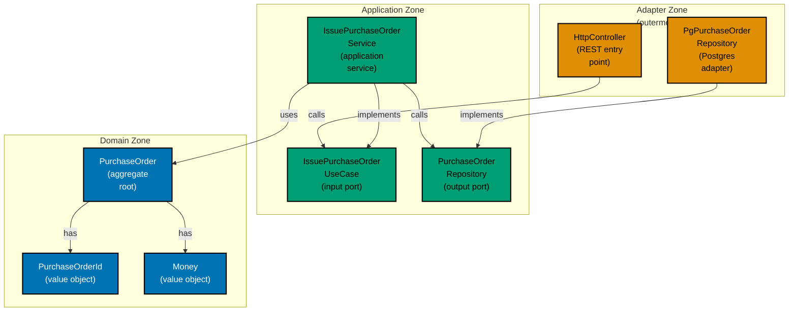

Examples 1–20 introduce hexagonal architecture (ports and adapters) using a procurement platform domain (`purchasing` context). Every code block is self-contained and runnable in Java 21+. Annotation density targets 1.0–2.25 comment lines per code line per example.

## The Three Zones (Examples 1–4)

### Example 1: The hexagon metaphor — three zones as packages

Hexagonal architecture divides every application into three concentric zones: the domain (pure business logic), the application (use-case orchestration), and the adapters (technology connectors). Each zone is a distinct Java package. The domain imports nothing from outside itself; the application imports only the domain; adapters import the application plus any framework.






```java
// Zone 1: Domain — zero framework imports allowed
// => Package: com.example.procurement.purchasing.domain
// => Only JDK standard library (java.util, java.math) permitted
package com.example.procurement.purchasing.domain;

// PurchaseOrder: pure Java record — no @Entity, no @JsonProperty, no Spring annotations
// => Compiles and runs without Spring, JPA, or any framework on the classpath
public record PurchaseOrder(
    PurchaseOrderId id,      // => strongly-typed identity value object (format: po_<uuid>)
    SupplierId supplierId,   // => typed; cannot accidentally swap with PurchaseOrderId
    Money total,             // => Money carries both amount and ISO 4217 currency
    POStatus status          // => domain enum; no framework dependency
) {}

// Zone 2: Application — imports domain only
// => Package: com.example.procurement.purchasing.application
// => May import domain.*; must not import adapter packages

// Zone 3: Adapter — imports application and framework
// => Package: com.example.procurement.purchasing.adapter.in.web
// => May import org.springframework.*, application.*
package com.example.procurement.purchasing.adapter.in.web;
```




```kotlin
// Zone 1: Domain — zero framework imports allowed
// => Package: com.example.procurement.purchasing.domain
// => Only Kotlin stdlib permitted; no framework on the classpath

package com.example.procurement.purchasing.domain

// PurchaseOrder: Kotlin data class — no @Entity, no @JsonProperty, no Spring annotations
// => data class: compiler generates equals, hashCode, copy, toString automatically
// => compiles and runs without Spring, JPA, or any external framework
data class PurchaseOrder(
    val id: PurchaseOrderId,        // => strongly-typed identity value object (format: po_<uuid>)
    val supplierId: SupplierId,     // => distinct type; compiler prevents accidental swaps
    val total: Money,               // => Money carries both amount and ISO 4217 currency code
    val status: POStatus            // => sealed class or enum; exhaustive when enforced by compiler
)
// => immutable by convention: all properties are val (read-only); use copy() to derive new state

// Zone 2: Application — imports domain only
// => Package: com.example.procurement.purchasing.application
// => May import domain.*; must not reference adapter packages

// Zone 3: Adapter — imports application and framework
// => Package: com.example.procurement.purchasing.adapter.in.web
// => May import org.springframework.*, application.*
```




```csharp
// Zone 1: Domain — zero framework imports allowed
// => Namespace: Procurement.Purchasing.Domain
// => Only .NET BCL (System, System.Collections) permitted; no EF Core, no ASP.NET

namespace Procurement.Purchasing.Domain;

// PurchaseOrder: C# record — no [Entity], no [JsonProperty], no framework attributes
// => record: compiler generates Equals, GetHashCode, ToString, and with-expressions
// => immutable by default: init-only properties cannot be reassigned after construction
public sealed record PurchaseOrder(
    PurchaseOrderId Id,        // => strongly-typed identity value object (format: po_<uuid>)
    SupplierId SupplierId,     // => distinct type; compiler prevents accidental argument swaps
    Money Total,               // => Money record carrying Amount + ISO 4217 CurrencyCode
    POStatus Status            // => enum or discriminated-union; exhaustive switch enforced
);
// => immutable: all constructor parameters become init-only properties automatically
// => with-expression: var approved = po with { Status = POStatus.AwaitingApproval };

// Zone 2: Application — references Domain only
// => Namespace: Procurement.Purchasing.Application
// => May use Domain.*; must not reference Adapter namespaces

// Zone 3: Adapter — references Application and framework
// => Namespace: Procurement.Purchasing.Adapter.In.Web
// => May use Microsoft.AspNetCore.*, Application.*
```





```typescript
// Zone 1: Domain — zero framework imports allowed
// => Module: src/purchasing/domain/
// => Only TypeScript built-ins permitted; no NestJS, TypeORM, or Express

// PurchaseOrder: plain TypeScript class — no @Entity, no @JsonProperty, no NestJS decorators
// => compiles and runs without any framework on the module path
export class PurchaseOrder {
  // => readonly: TypeScript equivalent of immutability; fields set at construction only
  constructor(
    readonly id: PurchaseOrderId, // => strongly-typed identity value object (format: po_<uuid>)
    readonly supplierId: SupplierId, // => distinct type; compiler prevents accidental swaps
    readonly total: Money, // => Money carries both amount and ISO 4217 currency
    readonly status: POStatus, // => enum; exhaustive switch enforced by TypeScript
  ) {}
}
// => immutable by convention: all fields are readonly; spread-copy to derive new state

// Zone 2: Application — imports domain only
// => Module: src/purchasing/application/
// => May import from domain/; must not import from adapter/ paths

// Zone 3: Adapter — imports application and framework
// => Module: src/purchasing/adapter/in/web/
// => May import @nestjs/*, application/*
```




**Key Takeaway**: Domain knows nothing, application knows domain, adapters know application and frameworks.

**Why It Matters**: When the domain zone has zero framework imports, every domain test runs with no server, no database, and no container — feedback loop collapses from minutes to milliseconds. Swapping any persistence or web framework becomes a one-zone change confined to the adapter layer.

---

### Example 2: Domain entity — pure record / data class, no framework annotations

A domain entity contains only business state and behaviour. Framework annotations (`@Entity`, `@Table`, `@JsonProperty`) are infrastructure concerns that belong in adapter-layer mapping classes. Placing them in the domain couples the domain to a specific framework and forces recompilation whenever that framework changes.

**Anti-pattern — framework annotation in the domain**:




```java
// WRONG: @Entity and @JsonProperty leak infrastructure into the domain
// => domain class now requires JPA at test time; cannot run without Hibernate
import jakarta.persistence.Entity;               // => infrastructure import in domain zone
import com.fasterxml.jackson.annotation.JsonProperty; // => JSON framework in business class

@Entity                                          // => couples PurchaseOrder to JPA container
public class PurchaseOrder {
    @JsonProperty("supplier_id")                 // => JSON naming belongs in an adapter DTO
    private String supplierId;                   // => raw String; typed safety lost
}
// Problem: every unit test must bootstrap a JPA context and Jackson
// => coupling cost: framework deps forced into all domain tests
```




```kotlin
// WRONG: @Entity and @JsonProperty leak infrastructure into the domain
// => Kotlin data class now requires JPA at test time; cannot run without Hibernate
import jakarta.persistence.Entity               // => infrastructure import pulled into domain zone
import com.fasterxml.jackson.annotation.JsonProperty // => JSON serialisation concern in business class

@Entity                                         // => couples PurchaseOrder to JPA container lifecycle
data class PurchaseOrder(
    @JsonProperty("supplier_id")                // => serialisation naming belongs in an adapter DTO
    val supplierId: String                      // => raw String; typed safety and null-safety lost
)
// Problem: every unit test must load a JPA context and the Jackson runtime
// => coupling cost: Hibernate + Jackson forced onto the domain test classpath
```




```csharp
// WRONG: [Table] and [JsonPropertyName] leak infrastructure into the domain
// => record now requires EF Core at test time; cannot instantiate without the EF runtime
using Microsoft.EntityFrameworkCore;            // => infrastructure namespace in domain zone
using System.Text.Json.Serialization;           // => JSON serialisation concern in business class

[Table("purchase_orders")]                      // => couples PurchaseOrder to EF Core schema
public record PurchaseOrder(
    [property: JsonPropertyName("supplier_id")] // => JSON naming belongs in an adapter DTO
    string SupplierId                           // => raw string; typed safety and nullability lost
);
// Problem: every unit test must configure a DbContext and System.Text.Json
// => coupling cost: EF Core + JSON runtime forced onto the domain test dependency graph
```





```typescript
// WRONG: @Column and class-transformer decorators leak infrastructure into the domain
// => domain class now requires TypeORM at test time; cannot run without TypeORM
import { Column, Entity, PrimaryColumn } from "typeorm"; // => infrastructure import in domain zone
import { Expose } from "class-transformer"; // => serialisation concern in business class

@Entity("purchase_orders") // => couples PurchaseOrder to TypeORM; forces DB in all domain tests
export class PurchaseOrder {
  @Expose({ name: "supplier_id" }) // => JSON naming belongs in an adapter DTO
  @Column()
  supplierId: string; // => raw string; typed safety lost
}
// Problem: every unit test must bootstrap a TypeORM DataSource and class-transformer
// => coupling cost: framework deps forced into all domain tests
```




**Correct — clean domain record**:




```java
// PurchaseOrder: zero framework imports; compiles with only the JDK
// => No @Entity, no @Id, no @JsonProperty, no Spring, no Jackson
package com.example.procurement.purchasing.domain;

public record PurchaseOrder(       // => record = immutable; equals/hashCode/toString generated
    PurchaseOrderId id,            // => domain value object, not raw String
    SupplierId supplierId,         // => distinct type; prevents id-kind confusion at compile time
    Money total,                   // => Money(amount, currency); richer than BigDecimal alone
    POStatus status                // => domain enum; exhaustive switch enforced by compiler
) {
    // Domain behaviour: pure function, no I/O, no framework calls
    public PurchaseOrder submit() {           // => returns new PurchaseOrder; this unchanged
        if (status != POStatus.DRAFT) {       // => guard: only DRAFT can be submitted
            throw new IllegalStateException("Can only submit a DRAFT PO"); // => domain rule
        }
        return new PurchaseOrder(id, supplierId, total, POStatus.AWAITING_APPROVAL);
        // => state transition: DRAFT → AWAITING_APPROVAL
    }
}
// Test: new PurchaseOrder(id, sup, money, DRAFT) — no framework; sub-millisecond
```




```kotlin
// PurchaseOrder: zero framework imports; compiles with only the Kotlin stdlib
// => No @Entity, no @Id, no @JsonProperty, no Spring, no Jackson
package com.example.procurement.purchasing.domain

data class PurchaseOrder(          // => data class: equals/hashCode/copy/toString generated
    val id: PurchaseOrderId,       // => domain value object, not raw String
    val supplierId: SupplierId,    // => distinct type; prevents id-kind mix-up at compile time
    val total: Money,              // => Money(amount, currency); richer than BigDecimal alone
    val status: POStatus           // => sealed class or enum; exhaustive when enforced by compiler
) {
    // Domain behaviour: pure function — no I/O, no framework calls
    fun submit(): PurchaseOrder {              // => returns new PurchaseOrder via copy(); this unchanged
        require(status == POStatus.DRAFT) {    // => Kotlin stdlib guard: throws IllegalArgumentException
            "Can only submit a DRAFT PO"       // => domain rule expressed as lambda message
        }
        return copy(status = POStatus.AWAITING_APPROVAL)
        // => copy() creates new instance; only status field changes; all others preserved
        // => state transition: DRAFT → AWAITING_APPROVAL
    }
}
// Test: PurchaseOrder(id, sup, money, DRAFT) — no framework; sub-millisecond
```




```csharp
// PurchaseOrder: zero framework references; compiles with only the .NET BCL
// => No [Table], no [Key], no [JsonPropertyName], no EF Core, no ASP.NET
namespace Procurement.Purchasing.Domain;

public sealed record PurchaseOrder( // => sealed record: immutable; Equals/GetHashCode/ToString generated
    PurchaseOrderId Id,             // => domain value object, not raw string
    SupplierId SupplierId,          // => distinct type; compiler rejects accidental argument swaps
    Money Total,                    // => Money(Amount, CurrencyCode); richer than decimal alone
    POStatus Status                 // => enum; exhaustive switch expression enforced by compiler
) {
    // Domain behaviour: pure method — no I/O, no framework calls
    public PurchaseOrder Submit()
    {
        if (Status != POStatus.Draft)           // => guard: only Draft orders may be submitted
            throw new InvalidOperationException("Can only submit a Draft PO"); // => domain rule
        return this with { Status = POStatus.AwaitingApproval };
        // => with-expression: creates new record; only Status changes; all other fields preserved
        // => state transition: Draft → AwaitingApproval
    }
}
// Test: new PurchaseOrder(id, sup, money, Draft) — no framework; sub-millisecond
```





```typescript
// PurchaseOrder: zero framework imports; compiles with only TypeScript
// => No @Entity, no @Column, no @Injectable, no NestJS, no TypeORM
// src/purchasing/domain/purchase-order.ts

import { PurchaseOrderId } from "./purchase-order-id";
import { SupplierId } from "./supplier-id";
import { Money } from "./money";
import { POStatus } from "./po-status";

export class PurchaseOrder {
  // => readonly fields: TypeScript enforces immutability at compile time
  constructor(
    readonly id: PurchaseOrderId, // => domain value object, not raw string
    readonly supplierId: SupplierId, // => distinct type; prevents id-kind confusion
    readonly total: Money, // => Money(amount, currency); richer than number alone
    readonly status: POStatus, // => enum; exhaustive switch enforced by compiler
  ) {}

  // Domain behaviour: pure function, no I/O, no framework calls
  submit(): PurchaseOrder {
    // => returns new PurchaseOrder; this unchanged
    if (this.status !== POStatus.DRAFT) {
      // => guard: only DRAFT can be submitted
      throw new Error("Can only submit a DRAFT PO"); // => domain rule
    }
    return new PurchaseOrder(this.id, this.supplierId, this.total, POStatus.AWAITING_APPROVAL);
    // => state transition: DRAFT → AWAITING_APPROVAL
  }
}
// Test: new PurchaseOrder(id, sup, money, POStatus.DRAFT) — no framework; sub-millisecond
```




**Key Takeaway**: Domain records carry only business state and rules. Zero framework annotations means zero framework test dependencies.

**Why It Matters**: A domain class free of infrastructure annotations can be instantiated in a plain JUnit test in under a millisecond. Teams that enforce this boundary report that switching ORMs (e.g., JPA to jOOQ) touches only adapter files — thousands of lines of domain logic remain untouched.

---

### Example 3: Value object — PurchaseOrderId and Money

Value objects encapsulate a primitive value plus its invariants. They make illegal states unrepresentable at the type level and prevent the billion-dollar mistake of mixing up raw strings.




```java
// Domain value objects: PurchaseOrderId and Money
// => package com.example.procurement.purchasing.domain
package com.example.procurement.purchasing.domain;

import java.math.BigDecimal;
import java.util.Objects;

// PurchaseOrderId: wraps a String but enforces the "po_<uuid>" format invariant
// => record: compiler generates equals, hashCode, toString automatically
// => value(): generated accessor — no need to hand-write getter
public record PurchaseOrderId(String value) {
    // Compact canonical constructor: runs validation before the implicit record constructor
    // => compact form omits parameter list; implicit this.value = value assignment still runs
    public PurchaseOrderId {
        Objects.requireNonNull(value, "PurchaseOrderId must not be null");
        // => null guard: fails fast at construction; no null PurchaseOrderId can exist
        if (!value.startsWith("po_") || value.length() < 39) {
            // => format invariant: "po_" prefix + 36-char UUID = minimum 39 chars
            throw new IllegalArgumentException("Invalid PurchaseOrderId: " + value);
            // => construction fails: caller sees the invalid value in the error message
        }
    }
    // => PurchaseOrderId("po_550e8400-e29b-41d4-a716-446655440000") — succeeds; 39 chars
    // => PurchaseOrderId("abc") — throws IllegalArgumentException; does not start with "po_"
    // => PurchaseOrderId(null)  — throws NullPointerException from requireNonNull above
}

// Money: immutable value object combining amount + ISO 4217 currency code
// => richer than BigDecimal alone: prevents silently mixing USD and EUR amounts
// => record: generated equals() compares both amount and currency fields
public record Money(BigDecimal amount, String currency) {
    // Compact canonical constructor: validates both fields before the record is built
    public Money {
        Objects.requireNonNull(amount, "amount required");
        // => null guard: amount field cannot be null; BigDecimal.ZERO is valid
        Objects.requireNonNull(currency, "currency required");
        // => null guard: currency field cannot be null; empty string caught below
        if (amount.compareTo(BigDecimal.ZERO) < 0) {
            // => invariant: negative money is not meaningful in the P2P domain
            throw new IllegalArgumentException("Money amount must be >= 0");
            // => caller sees clear message: "Money amount must be >= 0"
        }
        if (currency.length() != 3) {
            // => ISO 4217: all currency codes are exactly 3 uppercase letters (USD, EUR, IDR)
            throw new IllegalArgumentException("Currency must be 3-letter ISO 4217 code");
            // => "US" (2 chars) and "USDD" (4 chars) both fail here
        }
    }
    // => Money(new BigDecimal("1000.00"), "USD") — succeeds; amount >= 0, currency = 3 chars
    // => Money(new BigDecimal("-1"), "USD")       — throws; amount < 0 violates invariant
    // => Money(new BigDecimal("500"), "US")       — throws; currency must be 3 letters
}
```




```kotlin
// Domain value objects: PurchaseOrderId and Money
// => package com.example.procurement.purchasing.domain
package com.example.procurement.purchasing.domain

import java.math.BigDecimal

// PurchaseOrderId: wraps a String but enforces the "po_<uuid>" format invariant
// => value class: zero-overhead wrapper; JVM erases to plain String at call sites
// => value property: generated by @JvmInline; no hand-written accessor needed
@JvmInline
value class PurchaseOrderId(val value: String) {
    // init block: Kotlin's canonical place for constructor-time validation
    // => runs after the primary constructor assigns the field; ideal for invariant checks
    init {
        requireNotNull(value) { "PurchaseOrderId must not be null" }
        // => null guard: Kotlin non-nullable type already prevents null at call site;
        // => explicit check documents the invariant and guards Java interop callers
        require(value.startsWith("po_") && value.length >= 39) {
            // => format invariant: "po_" prefix + 36-char UUID = minimum 39 chars
            "Invalid PurchaseOrderId: $value"
            // => string template: caller sees the invalid value in the error message
        }
    }
    // => PurchaseOrderId("po_550e8400-e29b-41d4-a716-446655440000") — succeeds; 39 chars
    // => PurchaseOrderId("abc") — throws IllegalArgumentException; fails startsWith check
}

// Money: immutable value object combining amount + ISO 4217 currency code
// => data class: compiler generates equals(), hashCode(), copy(), toString()
// => richer than BigDecimal alone: prevents silently mixing USD and EUR at compile time
data class Money(val amount: BigDecimal, val currency: String) {
    // init block: validates both fields before the data class is considered constructed
    init {
        require(amount >= BigDecimal.ZERO) {
            // => invariant: negative money has no meaning in a P2P procurement domain
            "Money amount must be >= 0"
            // => caller sees clear message; amount value in scope for string template if needed
        }
        require(currency.length == 3) {
            // => ISO 4217: all currency codes are exactly 3 uppercase letters (USD, EUR, IDR)
            "Currency must be 3-letter ISO 4217 code"
            // => "US" (2 chars) and "USDD" (4 chars) both fail this check
        }
    }
    // => Money(BigDecimal("1000.00"), "USD") — succeeds; amount >= 0, currency = 3 chars
    // => Money(BigDecimal("-1"), "USD")       — throws IllegalArgumentException; amount < 0
    // => Money(BigDecimal("500"), "US")       — throws IllegalArgumentException; currency length != 3
}
```




```csharp
// Domain value objects: PurchaseOrderId and Money
// => Namespace: Procurement.Purchasing.Domain
// => Only System and System.Diagnostics.CodeAnalysis from the BCL
namespace Procurement.Purchasing.Domain;

// PurchaseOrderId: wraps a string but enforces the "po_<uuid>" format invariant
// => readonly record struct: value semantics + structural equality + zero heap allocation
// => Value property: generated by the record; no hand-written getter needed
public readonly record struct PurchaseOrderId(string Value)
{
    // Primary constructor guard via static factory — idiomatic for C# records
    // => records cannot have instance constructors with validation in a compact form;
    // => use a static Create method or a custom constructor as the validation entry point
    public static PurchaseOrderId Create(string value)
    {
        ArgumentNullException.ThrowIfNull(value, nameof(value));
        // => null guard: fails fast at creation; no null PurchaseOrderId can exist
        if (!value.StartsWith("po_", StringComparison.Ordinal) || value.Length < 39)
        {
            // => format invariant: "po_" prefix + 36-char UUID = minimum 39 chars
            throw new ArgumentException($"Invalid PurchaseOrderId: {value}", nameof(value));
            // => caller sees the invalid value interpolated into the exception message
        }
        return new PurchaseOrderId(value);
        // => only valid instances are returned; invalid input never produces an instance
    }
    // => PurchaseOrderId.Create("po_550e8400-e29b-41d4-a716-446655440000") — succeeds; 39 chars
    // => PurchaseOrderId.Create("abc") — throws ArgumentException; does not start with "po_"
    // => PurchaseOrderId.Create(null)  — throws ArgumentNullException from ThrowIfNull above
}

// Money: immutable value object combining Amount + ISO 4217 CurrencyCode
// => readonly record struct: structural equality compares both fields automatically
// => richer than decimal alone: prevents silently mixing USD and EUR at compile time
public readonly record struct Money(decimal Amount, string CurrencyCode)
{
    public static Money Create(decimal amount, string currencyCode)
    {
        ArgumentNullException.ThrowIfNull(currencyCode, nameof(currencyCode));
        // => null guard: currency field cannot be null; empty string caught below
        if (amount < 0)
        {
            // => invariant: negative money has no meaning in a P2P procurement domain
            throw new ArgumentOutOfRangeException(nameof(amount), "Money amount must be >= 0");
            // => caller sees clear message: "Money amount must be >= 0"
        }
        if (currencyCode.Length != 3)
        {
            // => ISO 4217: all currency codes are exactly 3 uppercase letters (USD, EUR, IDR)
            throw new ArgumentException("CurrencyCode must be 3-letter ISO 4217 code", nameof(currencyCode));
            // => "US" (2 chars) and "USDD" (4 chars) both fail this guard
        }
        return new Money(amount, currencyCode);
        // => only valid instances reach callers; invalid state cannot be constructed
    }
    // => Money.Create(1000.00m, "USD") — succeeds; amount >= 0, currencyCode = 3 chars
    // => Money.Create(-1m, "USD")       — throws ArgumentOutOfRangeException; amount < 0
    // => Money.Create(500m, "US")       — throws ArgumentException; currencyCode length != 3
}
```





```typescript
// TypeScript equivalent
// => src/purchasing/
// Domain value objects: PurchaseOrderId and Money
// => package com.example.procurement.purchasing.domain
// PurchaseOrderId: wraps a String but enforces the "po_<uuid>" format invariant
// => record: compiler generates equals, hashCode, toString automatically
// => value(): generated accessor — no need to hand-write getter
// Compact canonical constructor: runs validation before the implicit record constructor
// => compact form omits parameter list; implicit this.value = value assignment still runs
// => null guard: fails fast at construction; no null PurchaseOrderId can exist
// => format invariant: "po_" prefix + 36-char UUID = minimum 39 chars
// => construction fails: caller sees the invalid value in the error message
// => TypeScript implementation follows same hexagonal pattern
// => ports: TypeScript interfaces; adapters: classes implementing interfaces
// => composition root: NestJS @Module or manual bootstrap function
```




**Key Takeaway**: Value objects enforce invariants at construction, making invalid states impossible to represent downstream.

**Why It Matters**: When `PurchaseOrderId` and `SupplierId` are distinct types, the compiler catches accidental argument swaps that code review misses. Encoding the `po_` prefix in the type means no controller, service, or repository needs to re-validate format — the object simply cannot exist in an invalid state.

---

### Example 4: The dependency rule — what can import what

The dependency rule is the single most important invariant in hexagonal architecture: dependencies always point inward. Outer zones depend on inner zones; inner zones never depend on outer zones. This is enforced by package visibility, module boundaries, or architectural tests.

**Legal imports (inward dependencies only)**:




```java
// Application zone: may import domain types — inward dependency is always legal
// => package com.example.procurement.purchasing.application
import com.example.procurement.purchasing.domain.PurchaseOrder;   // => ok: inward dependency
import com.example.procurement.purchasing.domain.PurchaseOrderId; // => ok: inward direction
import com.example.procurement.purchasing.domain.Money;            // => ok: domain value object

// Adapter zone: may import application types — one step further outward
// => package com.example.procurement.purchasing.adapter.in.web
import com.example.procurement.purchasing.application.IssuePurchaseOrderUseCase; // => ok: inward
```




```kotlin
// Application zone: may import domain types — inward dependency is always legal
// => package com.example.procurement.purchasing.application
import com.example.procurement.purchasing.domain.PurchaseOrder   // => ok: inward dependency
import com.example.procurement.purchasing.domain.PurchaseOrderId // => ok: inward direction
import com.example.procurement.purchasing.domain.Money           // => ok: domain value object
// => Kotlin: no semicolons; each import on its own line; same inward-only rule applies

// Adapter zone: may import application types — one step further outward
// => package com.example.procurement.purchasing.adapter.in.web
import com.example.procurement.purchasing.application.IssuePurchaseOrderUseCase // => ok: inward
// => all legal: outer zone imports inner zone; dependency arrow always points inward
```




```csharp
// Application zone: may reference Domain namespace — inward dependency is always legal
// => Namespace: Procurement.Purchasing.Application
using Procurement.Purchasing.Domain;   // => ok: inward dependency; Domain has no reciprocal using
// => PurchaseOrder, PurchaseOrderId, Money, POStatus all become available

// Adapter zone: may reference Application namespace — one step further outward
// => Namespace: Procurement.Purchasing.Adapter.In.Web
using Procurement.Purchasing.Application; // => ok: inward; adapter knows about use-case interfaces
// => the dependency arrow always points inward: Adapter → Application → Domain
```





```typescript
// Application zone: may import domain types — inward dependency is always legal
// => Module: src/purchasing/application/
import type { PurchaseOrder } from "../domain/purchase-order"; // => ok: inward dependency
import type { PurchaseOrderId } from "../domain/purchase-order-id"; // => ok: inward direction
import type { Money } from "../domain/money"; // => ok: domain value object
// => TypeScript: import type avoids runtime coupling; still enforces structural typing

// Adapter zone: may import application types — one step further outward
// => Module: src/purchasing/adapter/in/web/
import type { IssuePurchaseOrderUseCase } from "../../application/issue-purchase-order.usecase";
// => ok: inward; adapter knows about use-case interfaces
```




**Illegal imports (outward dependencies — architecture violations)**:




```java
// Domain zone importing Application: FORBIDDEN
// => package com.example.procurement.purchasing.domain
// import com.example.procurement.purchasing.application.IssuePurchaseOrderService; // => NEVER
// => domain would depend on orchestration; creates circular compile dependency

// Application zone importing Adapter: FORBIDDEN
// => package com.example.procurement.purchasing.application
// import com.example.procurement.purchasing.adapter.in.web.PurchaseOrderHttpController; // => NEVER
// => application logic coupled to Spring; cannot test without web container
```




```kotlin
// Domain zone importing Application: FORBIDDEN
// => package com.example.procurement.purchasing.domain
// import com.example.procurement.purchasing.application.IssuePurchaseOrderService // => NEVER
// => domain would depend on orchestration; creates circular compile dependency

// Application zone importing Adapter: FORBIDDEN
// => package com.example.procurement.purchasing.application
// import com.example.procurement.purchasing.adapter.`in`.web.PurchaseOrderHttpController // => NEVER
// => application logic coupled to Spring/Ktor; cannot test without web container
// => Kotlin: backticks required around `in` because it is a reserved keyword
```




```csharp
// Domain zone referencing Application: FORBIDDEN
// => Namespace: Procurement.Purchasing.Domain
// using Procurement.Purchasing.Application; // => NEVER
// => Domain would depend on orchestration layer; circular project reference

// Application zone referencing Adapter: FORBIDDEN
// => Namespace: Procurement.Purchasing.Application
// using Procurement.Purchasing.Adapter.In.Web; // => NEVER
// => Application logic coupled to ASP.NET Core; cannot test without web host
// => violates the dependency rule: outward dependency is always a violation
```





```typescript
// Domain zone importing Application: FORBIDDEN
// => Module: src/purchasing/domain/
// import { IssuePurchaseOrderService } from '../application/issue-purchase-order.service'; // => NEVER
// => domain would depend on orchestration; creates circular import in TypeScript module graph

// Application zone importing Adapter: FORBIDDEN
// => Module: src/purchasing/application/
// import { PurchaseOrderController } from '../adapter/in/web/purchase-order.controller'; // => NEVER
// => application logic coupled to NestJS; cannot test without HTTP context
// => TypeScript module resolution would allow it — only import discipline prevents it
```




**ArchUnit test enforcing the dependency rule in CI**:




```java
// ArchUnit: dependency rule as an executable test — runs in < 500ms
// => package com.example.procurement.architecture
package com.example.procurement.architecture;

import com.tngtech.archunit.core.importer.ClassFileImporter;
import static com.tngtech.archunit.lang.syntax.ArchRuleDefinition.noClasses;
import org.junit.jupiter.api.Test;

class HexagonDependencyTest {

    private static final var classes =
        new ClassFileImporter().importPackages("com.example.procurement");
    // => classes: all compiled .class files in the procurement package tree

    @Test void domain_must_not_depend_on_application() {
        noClasses().that().resideInAPackage("..domain..")
            .should().dependOnClassesThat().resideInAPackage("..application..")
            .check(classes);
        // => fails: any domain class that imports an application type → CI build broken
        // => passes: domain imports only java.* and sibling domain types
    }

    @Test void domain_must_not_depend_on_adapters() {
        noClasses().that().resideInAPackage("..domain..")
            .should().dependOnClassesThat().resideInAPackage("..adapter..")
            .check(classes);
        // => fails: @Entity or @RestController imported in domain → caught immediately
    }

    @Test void application_must_not_depend_on_adapters() {
        noClasses().that().resideInAPackage("..application..")
            .should().dependOnClassesThat().resideInAPackage("..adapter..")
            .check(classes);
        // => fails: application service imports PgPurchaseOrderRepository directly
        // => passes: application imports only domain types and port interfaces
    }
}
// => all three ArchUnit tests run as part of test:unit; sub-second; zero infrastructure
```




```kotlin
// ArchUnit: dependency rule as an executable test — runs in < 500ms on Kotlin projects
// => package com.example.procurement.architecture
package com.example.procurement.architecture

import com.tngtech.archunit.core.importer.ClassFileImporter
import com.tngtech.archunit.lang.syntax.ArchRuleDefinition.noClasses
import org.junit.jupiter.api.Test

class HexagonDependencyTest {

    private val classes = ClassFileImporter().importPackages("com.example.procurement")
    // => classes: all compiled .class files in the procurement package tree
    // => Kotlin: val replaces static final; type inferred as ArchClasses

    @Test fun domain_must_not_depend_on_application() {
        noClasses().that().resideInAPackage("..domain..")
            .should().dependOnClassesThat().resideInAPackage("..application..")
            .check(classes)
        // => fails: any domain class that imports an application type → CI build broken
        // => passes: domain imports only kotlin.* / java.* and sibling domain types
    }

    @Test fun domain_must_not_depend_on_adapters() {
        noClasses().that().resideInAPackage("..domain..")
            .should().dependOnClassesThat().resideInAPackage("..adapter..")
            .check(classes)
        // => fails: @Entity or @RestController imported in domain → caught immediately
    }

    @Test fun application_must_not_depend_on_adapters() {
        noClasses().that().resideInAPackage("..application..")
            .should().dependOnClassesThat().resideInAPackage("..adapter..")
            .check(classes)
        // => fails: application service imports PgPurchaseOrderRepository directly
        // => passes: application imports only domain types and port interfaces
    }
}
// => all three tests run as JUnit 5 test:unit targets; sub-second; zero infrastructure
```




```csharp
// NetArchTest: dependency rule as an executable test — NuGet: NetArchTest.Rules
// => Project: Procurement.Architecture.Tests (xUnit or NUnit project)
using NetArchTest.Rules;
using Xunit;

public class HexagonDependencyTests
{
    private const string RootNamespace = "Procurement.Purchasing";
    // => RootNamespace: scopes NetArchTest to the purchasing bounded context only

    [Fact]
    public void Domain_must_not_depend_on_Application()
    {
        var result = Types.InCurrentDomain()
            .That().ResideInNamespace($"{RootNamespace}.Domain")
            // => selects all types in the Domain namespace for inspection
            .ShouldNot().HaveDependencyOn($"{RootNamespace}.Application")
            // => rule: Domain types must have no compile-time dependency on Application
            .GetResult();
        Assert.True(result.IsSuccessful);
        // => fails: any Domain class that references an Application type → test red
        // => passes: Domain references only BCL (System.*) and sibling Domain types
    }

    [Fact]
    public void Domain_must_not_depend_on_Adapters()
    {
        var result = Types.InCurrentDomain()
            .That().ResideInNamespace($"{RootNamespace}.Domain")
            .ShouldNot().HaveDependencyOn($"{RootNamespace}.Adapter")
            // => catches accidental EF Core or ASP.NET Core imports in the domain
            .GetResult();
        Assert.True(result.IsSuccessful);
        // => fails: [Table] or [HttpGet] in Domain → test red immediately
    }

    [Fact]
    public void Application_must_not_depend_on_Adapters()
    {
        var result = Types.InCurrentDomain()
            .That().ResideInNamespace($"{RootNamespace}.Application")
            .ShouldNot().HaveDependencyOn($"{RootNamespace}.Adapter")
            // => rule: Application types must not reference any Adapter namespace
            .GetResult();
        Assert.True(result.IsSuccessful);
        // => fails: application service imports EfCorePurchaseOrderRepository directly
        // => passes: application references only Domain types and port interfaces
    }
}
// => all three Fact tests run as test:unit; sub-second; no Docker or web host required
```





```typescript
// dependency-cruiser: dependency rule as config — enforced in CI
// => Install: npm install --save-dev dependency-cruiser
// => Config: .dependency-cruiser.json at project root

// .dependency-cruiser.json (excerpt):
// {
//   "forbidden": [
//     {
//       "name": "domain-must-not-depend-on-application",
//       "from": { "path": "src/purchasing/domain" },
//       "to": { "path": "src/purchasing/application" }
//     },
//     {
//       "name": "domain-must-not-depend-on-adapters",
//       "from": { "path": "src/purchasing/domain" },
//       "to": { "path": "src/purchasing/adapter" }
//     },
//     {
//       "name": "application-must-not-depend-on-adapters",
//       "from": { "path": "src/purchasing/application" },
//       "to": { "path": "src/purchasing/adapter" }
//     }
//   ]
// }

// Jest test wrapping dependency-cruiser (runs in < 500ms)
import { cruise } from "dependency-cruiser";

describe("HexagonDependencyRules", () => {
  const result = cruise(["src/purchasing"], {
    /* config from .dependency-cruiser.json */
  });
  // => cruise: statically analyses all import/require statements in the source tree

  it("domain must not depend on application", () => {
    const violations = result.output.summary.violations.filter(
      (v) => v.rule.name === "domain-must-not-depend-on-application",
    );
    // => violations: array of files that break the rule; should be empty
    expect(violations).toHaveLength(0);
    // => fails: any domain file that imports from application/ → test red in CI
  });

  it("application must not depend on adapters", () => {
    const violations = result.output.summary.violations.filter(
      (v) => v.rule.name === "application-must-not-depend-on-adapters",
    );
    expect(violations).toHaveLength(0);
    // => fails: application service imports NestJS controller → caught immediately
  });
});
// => all dependency-cruiser checks run as Jest unit tests; sub-second; zero infrastructure
```




**Key Takeaway**: Dependencies always point inward — domain ← application ← adapters. The reverse direction is always an architectural violation.

**Why It Matters**: Enforcing the dependency rule with ArchUnit turns a convention into a compile-like gate. Any future commit that accidentally imports a Spring class into the domain will fail the CI build immediately, before it reaches code review. In a growing P2P platform, this protection becomes increasingly valuable — as the team scales from 5 to 50 developers, manual enforcement of architectural rules is unreliable. ArchUnit makes the hexagon self-defending: the architecture test suite rejects rule violations the same way a compiler rejects type errors.

---

## Output Ports (Examples 5–8)

### Example 5: Output port interface — PurchaseOrderRepository

An output port is an interface (or equivalent structural type) placed in the application's inward-facing package. It expresses what the application needs from the outside world (e.g., persistence) using domain language. The port has no knowledge of databases, SQL, or frameworks — it speaks only in domain types.




```java
// Output port: lives in application package; speaks domain language only
// => package com.example.procurement.purchasing.application
package com.example.procurement.purchasing.application;

import com.example.procurement.purchasing.domain.PurchaseOrder;
import com.example.procurement.purchasing.domain.PurchaseOrderId;
import java.util.Optional;

// PurchaseOrderRepository: output port for PO persistence
// => This is an interface — no implementation details here
// => Adapters implement this; domain/application code only calls this
public interface PurchaseOrderRepository {

    // save: persist a PurchaseOrder; return the saved instance (may have generated id)
    // => takes domain type; returns domain type; no JPA/JDBC types visible
    PurchaseOrder save(PurchaseOrder purchaseOrder);
    // => caller: repository.save(po) — does not know if storage is Postgres or in-memory

    // findById: retrieve a PurchaseOrder by its typed identity
    // => Optional<> makes the "not found" case explicit; no null returns
    Optional<PurchaseOrder> findById(PurchaseOrderId id);
    // => returns Optional.empty() when PO does not exist — caller handles absence explicitly

    // existsById: lightweight existence check without loading the full aggregate
    // => useful for duplicate-check guard before saving a new PO
    boolean existsById(PurchaseOrderId id);
    // => returns true if PO with given id is present; false otherwise
}
// => Application service calls this interface; zero coupling to Postgres/JPA
```




```kotlin
// Output port: lives in application package; speaks domain language only
// => package com.example.procurement.purchasing.application
package com.example.procurement.purchasing.application

import com.example.procurement.purchasing.domain.PurchaseOrder
import com.example.procurement.purchasing.domain.PurchaseOrderId

// PurchaseOrderRepository: output port for PO persistence
// => Kotlin interface — no implementation details; no framework annotations
// => Adapters implement this; domain/application code only calls this interface
interface PurchaseOrderRepository {

    // save: persist a PurchaseOrder; return the saved instance (may carry generated id)
    // => takes domain type; returns domain type; no JPA/Exposed types visible to callers
    fun save(purchaseOrder: PurchaseOrder): PurchaseOrder
    // => caller: repository.save(po) — unaware whether storage is Postgres or HashMap

    // findById: retrieve a PurchaseOrder by its typed identity
    // => Kotlin nullable return: PurchaseOrder? avoids Optional wrapper; null = not found
    fun findById(id: PurchaseOrderId): PurchaseOrder?
    // => returns null when PO does not exist; caller uses ?: or checkNotNull to handle absence

    // existsById: lightweight existence check without loading the full aggregate
    // => useful for duplicate-check guard before persisting a new PO
    fun existsById(id: PurchaseOrderId): Boolean
    // => returns true if PO with given id is present; false otherwise; no aggregate loaded
}
// => Application service calls this interface; zero coupling to Postgres/Exposed/JDBC
```




```csharp
// Output port: lives in Application namespace; speaks domain language only
// => Namespace: Procurement.Purchasing.Application
namespace Procurement.Purchasing.Application;

using Procurement.Purchasing.Domain;
// => only Domain types imported; no EF Core, no Dapper, no SqlClient visible

// IPurchaseOrderRepository: output port for PO persistence
// => C# convention: interface names are prefixed with I
// => Adapters implement this; domain/application code only calls this interface
public interface IPurchaseOrderRepository
{
    // Save: persist a PurchaseOrder; return the saved instance (may carry generated id)
    // => takes domain type; returns domain type; no EF Core or Dapper types visible
    PurchaseOrder Save(PurchaseOrder purchaseOrder);
    // => caller: repository.Save(po) — unaware whether storage is Postgres or in-memory

    // FindById: retrieve a PurchaseOrder by its typed identity
    // => nullable return: PurchaseOrder? avoids wrapping in Option<T>; null = not found
    PurchaseOrder? FindById(PurchaseOrderId id);
    // => returns null when PO does not exist; caller uses null-check or ?? to handle absence

    // ExistsById: lightweight existence check without loading the full aggregate
    // => useful for duplicate-check guard before persisting a new PurchaseOrder
    bool ExistsById(PurchaseOrderId id);
    // => returns true if PO with given id is present; false otherwise; no aggregate loaded
}
// => Application service depends on IPurchaseOrderRepository; zero coupling to EF Core
```





```typescript
// Output port: lives in application module; speaks domain language only
// src/purchasing/application/purchase-order-repository.port.ts

import type { PurchaseOrder } from "../domain/purchase-order";
import type { PurchaseOrderId } from "../domain/purchase-order-id";

// PurchaseOrderRepository: output port for PO persistence
// => TypeScript interface: no implementation here; adapters supply the "how"
// => Adapters implement this; domain/application code only calls this
export interface PurchaseOrderRepository {
  // save: persist a PurchaseOrder; return the saved instance (may have generated id)
  // => takes domain type; returns domain type; no ORM types visible
  save(purchaseOrder: PurchaseOrder): Promise;
  // => caller: await repository.save(po) — does not know if storage is Postgres or in-memory

  // findById: retrieve a PurchaseOrder by its typed identity
  // => Promise<PurchaseOrder | null>: null signals absence without throwing
  findById(id: PurchaseOrderId): Promise;
  // => returns null when PO does not exist — caller handles absence explicitly

  // existsById: lightweight existence check without loading the full aggregate
  // => useful for duplicate-check guard before saving a new PO
  existsById(id: PurchaseOrderId): Promise;
  // => returns true if PO with given id is present; false otherwise
}
// => Application service imports only this interface; zero coupling to TypeORM/Prisma
```




**Key Takeaway**: Output ports are interfaces in the application package that speak only in domain types — no SQL, no JPA/EF Core, no HTTP.

**Why It Matters**: Because `PurchaseOrderRepository` is an interface, the application service can be tested with an in-memory implementation that runs in microseconds. Swapping from JPA to jOOQ later means writing one new adapter class — the application service and every test remain unchanged.

---

### Example 6: Clock output port — making time testable

Time is an implicit dependency. Code that calls `LocalDateTime.now()` directly is non-deterministic and cannot be tested without mocking the JVM clock. Wrapping time behind a `Clock` output port makes the dependency explicit and swappable.




```java
// Clock output port: time as an explicit dependency
// => package com.example.procurement.purchasing.application
package com.example.procurement.purchasing.application;

import java.time.Instant;

// Clock: output port; returns current time as a domain-neutral Instant
// => Adapter in production: returns Instant.now() from system clock
// => Adapter in tests: returns a fixed Instant — deterministic, no sleep() needed
public interface Clock {
    // now: returns the current point in time
    // => caller never calls Instant.now() directly; always goes through this port
    Instant now();
    // => test adapter: () -> Instant.parse("2026-01-01T00:00:00Z") — always same value
}

// Usage inside an application service:
// => clock.now() instead of Instant.now() — the port is injected by the composition root
public class IssuePurchaseOrderService {
    private final Clock clock; // => injected; production vs test adapter determined at wiring
    // => field clock: Clock — injected dependency; implementation chosen at wiring time

    public IssuePurchaseOrderService(Clock clock) { // => constructor injection; no @Autowired
        this.clock = clock; // => stored for use in business methods below
    }

    public PurchaseOrder issue(PurchaseOrder po) {
        Instant issuedAt = clock.now();  // => explicit; testable; no hidden System.currentTimeMillis
        // => issuedAt: the timestamp will be embedded in the issued PO or an event
        return po.issue(issuedAt);       // => delegates state transition to domain method
    }
}
```




```kotlin
// Clock output port: time as an explicit dependency
// => package com.example.procurement.purchasing.application
package com.example.procurement.purchasing.application

import java.time.Instant

// Clock: output port; returns current time as a domain-neutral Instant
// => Adapter in production: SystemClock returns Instant.now() from the JVM wall clock
// => Adapter in tests: FixedClock returns a pinned Instant — deterministic, no sleep needed
fun interface Clock {
    // now: returns the current point in time
    // => fun interface: single-abstract-method; enables SAM conversion with lambda syntax
    fun now(): Instant
    // => test adapter: Clock { Instant.parse("2026-01-01T00:00:00Z") } — always same value
}

// Usage inside an application service:
// => clock.now() instead of Instant.now() — port injected by the composition root (DI)
class IssuePurchaseOrderService(
    private val clock: Clock  // => constructor property; Kotlin eliminates boilerplate field+assign
    // => production: SystemClock; test: FixedClock — determined at wiring time
) {
    fun issue(po: PurchaseOrder): PurchaseOrder {
        val issuedAt = clock.now()  // => explicit; testable; no hidden System.currentTimeMillis
        // => issuedAt: Instant — embedded in the issued PO or a domain event
        return po.issue(issuedAt)   // => delegates state transition to domain method; this unchanged
    }
}
```




```csharp
// IClock output port: time as an explicit dependency
// => Namespace: Procurement.Purchasing.Application
namespace Procurement.Purchasing.Application;

using System;

// IClock: output port; returns current time as a domain-neutral DateTimeOffset
// => Adapter in production: SystemClock returns DateTimeOffset.UtcNow
// => Adapter in tests: FixedClock returns a pinned DateTimeOffset — deterministic, no Thread.Sleep
public interface IClock
{
    // UtcNow: returns the current point in time as UTC
    // => caller never accesses DateTimeOffset.UtcNow directly; always uses this port
    DateTimeOffset UtcNow { get; }
    // => test adapter: new FixedClock(DateTimeOffset.Parse("2026-01-01T00:00:00Z"))
}

// Usage inside an application service:
// => clock.UtcNow instead of DateTimeOffset.UtcNow — port injected by DI container
public sealed class IssuePurchaseOrderService
{
    private readonly IClock _clock;
    // => _clock: IClock — injected dependency; implementation chosen at composition root

    public IssuePurchaseOrderService(IClock clock)
    // => constructor injection; no [Inject] or service-locator pattern
    {
        _clock = clock;
        // => stored for use in Issue(); production vs test implementation resolved at wiring
    }

    public PurchaseOrder Issue(PurchaseOrder po)
    {
        var issuedAt = _clock.UtcNow;
        // => explicit; testable; no hidden DateTime.Now or DateTimeOffset.UtcNow calls
        // => issuedAt: embedded in the issued PO record or a domain event
        return po.Issue(issuedAt);
        // => delegates state transition to the domain method; this service stays orchestration-only
    }
}
```





```typescript
// Clock output port: time as an explicit dependency
// src/purchasing/application/clock.port.ts

// Clock: output port; returns current time as a domain-neutral Date
// => Adapter in production: returns new Date() from system clock
// => Adapter in tests: returns a fixed Date — deterministic, no setTimeout needed
export interface Clock {
  // now: returns the current point in time
  // => caller never uses new Date() directly; always goes through this port
  now(): Date;
  // => test adapter: { now: () => new Date('2026-01-01T00:00:00Z') } — always same value
}

// Usage inside an application service:
// => clock.now() instead of new Date() — the port is injected by the composition root
// src/purchasing/application/issue-purchase-order.service.ts
export class IssuePurchaseOrderService {
  constructor(
    private readonly repository: PurchaseOrderRepository,
    private readonly clock: Clock, // => injected; production vs test adapter determined at wiring
  ) {}

  async issue(po: PurchaseOrder): Promise {
    const issuedAt = this.clock.now(); // => explicit; testable; no hidden new Date()
    // => issuedAt: the timestamp will be embedded in the issued PO or an event
    return po.issue(issuedAt); // => delegates state transition to domain method
  }
}
```




**Key Takeaway**: Wrapping the system clock behind a `Clock` port makes time an explicit, swappable dependency — test adapters return fixed timestamps.

**Why It Matters**: Time-dependent business rules (e.g., "PO must be issued within 30 days of approval") become deterministically testable. Tests run at the same speed regardless of wall-clock time, and the CI build produces the same result at 3 AM as at 3 PM.

---

### Example 7: In-memory adapter implementing PurchaseOrderRepository

An in-memory adapter implements the output port using a `HashMap`. It has no external dependencies, starts instantly, and is the default adapter for unit and integration tests. It is a first-class production artifact — not a test utility — that lives in an `adapter.out.persistence` package.




```java
// In-memory adapter: implements PurchaseOrderRepository with a HashMap
// => package com.example.procurement.purchasing.adapter.out.persistence
package com.example.procurement.purchasing.adapter.out.persistence;

import com.example.procurement.purchasing.application.PurchaseOrderRepository;
import com.example.procurement.purchasing.domain.PurchaseOrder;
import com.example.procurement.purchasing.domain.PurchaseOrderId;

import java.util.HashMap;
import java.util.Map;
import java.util.Optional;

// InMemoryPurchaseOrderRepository: adapter implementing the output port
// => No JPA, no Postgres; HashMap is the store
// => Thread-safety omitted for clarity; use ConcurrentHashMap in shared test contexts
public class InMemoryPurchaseOrderRepository implements PurchaseOrderRepository {

    private final Map<PurchaseOrderId, PurchaseOrder> store = new HashMap<>();
    // => store: HashMap<PurchaseOrderId, PurchaseOrder> — in-memory map as the backing store

    @Override
    public PurchaseOrder save(PurchaseOrder po) {
        store.put(po.id(), po);  // => key = typed PurchaseOrderId; value = PurchaseOrder record
        return po;               // => return the same instance; consistent with repository contract
    }

    @Override
    public Optional<PurchaseOrder> findById(PurchaseOrderId id) {
        return Optional.ofNullable(store.get(id)); // => absent = Optional.empty(); never null
        // => caller handles absence with Optional.orElseThrow() or Optional.isEmpty()
    }

    @Override
    public boolean existsById(PurchaseOrderId id) {
        return store.containsKey(id); // => O(1) lookup; returns true/false
    }
}
// Usage in test:
// var repo = new InMemoryPurchaseOrderRepository();
// var service = new IssuePurchaseOrderService(repo, new FixedClock());
// => wired in 2 lines; no Spring context; starts in < 1ms
```




```kotlin
// In-memory adapter: implements PurchaseOrderRepository with a HashMap
// => package com.example.procurement.purchasing.adapter.out.persistence
package com.example.procurement.purchasing.adapter.out.persistence

import com.example.procurement.purchasing.application.PurchaseOrderRepository
import com.example.procurement.purchasing.domain.PurchaseOrder
import com.example.procurement.purchasing.domain.PurchaseOrderId

// InMemoryPurchaseOrderRepository: adapter implementing the output port
// => No JPA, no Postgres; mutableMapOf() backed by LinkedHashMap is the store
// => Thread-safety omitted for clarity; use ConcurrentHashMap for shared test contexts
class InMemoryPurchaseOrderRepository : PurchaseOrderRepository {

    private val store: MutableMap<PurchaseOrderId, PurchaseOrder> = mutableMapOf()
    // => store: MutableMap<PurchaseOrderId, PurchaseOrder> — in-memory map as the backing store
    // => mutableMapOf(): Kotlin stdlib; backed by LinkedHashMap; preserves insertion order

    override fun save(po: PurchaseOrder): PurchaseOrder {
        store[po.id] = po  // => Kotlin operator syntax: store.put(po.id, po) equivalent
        // => key = typed PurchaseOrderId; value = PurchaseOrder data class instance
        return po          // => return the same instance; consistent with repository contract
    }

    override fun findById(id: PurchaseOrderId): PurchaseOrder? {
        return store[id]   // => Kotlin nullable return: null when absent; no Optional wrapper
        // => caller uses ?: or checkNotNull; Kotlin compiler enforces null-check at call site
    }

    override fun existsById(id: PurchaseOrderId): Boolean {
        return store.containsKey(id) // => O(1) lookup; returns true when id is a stored key
        // => Boolean (non-nullable): Kotlin has no boxed Boolean here; direct primitive mapping
    }
}
// Usage in test:
// val repo = InMemoryPurchaseOrderRepository()
// val service = IssuePurchaseOrderService(repo, FixedClock())
// => wired in 2 lines; no Spring context; starts in < 1ms
```




```csharp
// In-memory adapter: implements IPurchaseOrderRepository with a Dictionary
// => Namespace: Procurement.Purchasing.Adapter.Out.Persistence
namespace Procurement.Purchasing.Adapter.Out.Persistence;

using System.Collections.Generic;
using Procurement.Purchasing.Application;
using Procurement.Purchasing.Domain;

// InMemoryPurchaseOrderRepository: adapter implementing the output port
// => No EF Core, no Postgres; Dictionary<K,V> is the store
// => Thread-safety omitted for clarity; use ConcurrentDictionary in shared test contexts
public sealed class InMemoryPurchaseOrderRepository : IPurchaseOrderRepository
{
    private readonly Dictionary<PurchaseOrderId, PurchaseOrder> _store = new();
    // => _store: Dictionary<PurchaseOrderId, PurchaseOrder> — in-memory map as the backing store
    // => new(): C# 9 target-typed new; Dictionary<PurchaseOrderId, PurchaseOrder> inferred

    public PurchaseOrder Save(PurchaseOrder po)
    {
        _store[po.Id] = po;  // => indexer assignment: _store.Add or overwrite existing key
        // => key = typed PurchaseOrderId (record struct); value = PurchaseOrder record
        return po;           // => return the same instance; consistent with repository contract
    }

    public PurchaseOrder? FindById(PurchaseOrderId id)
    {
        _store.TryGetValue(id, out var po);
        // => TryGetValue: out param po set to found value or default; returns bool (ignored)
        // => po is null when id not in dictionary; nullable return documents the absent case
        return po;           // => null when absent; caller uses null-check or ?? to handle
    }

    public bool ExistsById(PurchaseOrderId id)
    {
        return _store.ContainsKey(id); // => O(1) lookup; returns true when id is a stored key
        // => bool (non-nullable): Dictionary<K,V>.ContainsKey always returns true or false
    }
}
// Usage in test:
// var repo = new InMemoryPurchaseOrderRepository();
// var service = new IssuePurchaseOrderService(repo, new FixedClock());
// => wired in 2 lines; no DI container; starts in < 1ms
```





```typescript
// In-memory adapter: implements PurchaseOrderRepository with a Map
// src/purchasing/adapter/out/persistence/in-memory-purchase-order.repository.ts

import type { PurchaseOrderRepository } from "../../../application/purchase-order-repository.port";
import type { PurchaseOrder } from "../../../domain/purchase-order";
import type { PurchaseOrderId } from "../../../domain/purchase-order-id";

// InMemoryPurchaseOrderRepository: adapter implementing the output port
// => No TypeORM, no Postgres; Map<string, PurchaseOrder> is the store
// => Thread-safety not a concern in Node.js single-threaded event loop
export class InMemoryPurchaseOrderRepository implements PurchaseOrderRepository {
  private readonly store = new Map<string, PurchaseOrder>();
  // => store: Map keyed by PurchaseOrderId.value string — in-memory backing store

  async save(po: PurchaseOrder): Promise {
    this.store.set(po.id.value, po); // => key = raw string from typed PurchaseOrderId
    // => overwrites existing entry if id already present; consistent with repository contract
    return po; // => return the same instance; consistent with repository contract
  }

  async findById(id: PurchaseOrderId): Promise {
    return this.store.get(id.value) ?? null;
    // => ?? null: nullish coalescing; undefined becomes null; caller handles absence
  }

  async existsById(id: PurchaseOrderId): Promise {
    return this.store.has(id.value); // => O(1) lookup; returns true/false
  }
}
// Usage in test:
// const repo = new InMemoryPurchaseOrderRepository();
// const service = new IssuePurchaseOrderService(repo, { now: () => new Date('2026-01-01') });
// => wired in 2 lines; no NestJS context; starts in < 1ms
```




**Key Takeaway**: The in-memory adapter implements the port with a `HashMap` — no framework, no database, instantiates in microseconds.

**Why It Matters**: Because the in-memory adapter satisfies the same interface as the Postgres adapter, every application service test can run without Docker. A suite of 500 service tests completes in under a second. The same tests run identically in CI without a database container.

---

### Example 8: JPA adapter implementing PurchaseOrderRepository

The JPA adapter implements `PurchaseOrderRepository` using Spring Data JPA. It lives in the adapter layer and contains all JPA-specific code: `@Entity`, `@Repository`, ORM mapping. The domain record remains annotation-free — the adapter maps between the domain record and a JPA entity class.




```java
// JPA adapter: persistence adapter implementing the output port
// => package com.example.procurement.purchasing.adapter.out.persistence
package com.example.procurement.purchasing.adapter.out.persistence;

import com.example.procurement.purchasing.application.PurchaseOrderRepository;
import com.example.procurement.purchasing.domain.*;
import jakarta.persistence.*;
import org.springframework.stereotype.Repository;
import java.math.BigDecimal;
import java.util.Optional;

// JPA entity: lives in adapter layer; domain record stays annotation-free
// => @Entity tells JPA to manage this class as a persistent entity
// => @Table maps the class to the "purchase_orders" table — adapter concern only
@Entity @Table(name = "purchase_orders")
class PurchaseOrderJpaEntity {
    @Id String id;               // => @Id: JPA primary key column; raw String ok (adapter layer)
    String supplierId;           // => raw String; reconstructed to typed SupplierId on load
    BigDecimal totalAmount;      // => stored as DECIMAL(19,4); currency stored in separate column
    String totalCurrency;        // => ISO 4217 code e.g. "USD"; reconstructed into Money on load
    String status;               // => stored as enum name string e.g. "AWAITING_APPROVAL"
    // => no domain annotations (@Entity, @Table) leak to the domain record — adapter boundary holds
}

// Spring Data JPA repository interface — adapter-internal; never exposed to application layer
// => extends JpaRepository: Spring generates all CRUD methods at boot time via reflection
// => @Repository: Spring marks this as a persistence component; exception translation enabled
@Repository
interface JpaPoRepository extends JpaRepository<PurchaseOrderJpaEntity, String> {}
// => Spring creates a proxy at startup; no handwritten SQL for basic CRUD operations

// PgPurchaseOrderRepository: the actual output port implementation used in production
// => implements PurchaseOrderRepository (domain-facing interface) using JPA internally
// => application service depends on PurchaseOrderRepository; never sees this class
public class PgPurchaseOrderRepository implements PurchaseOrderRepository {

    private final JpaPoRepository jpa; // => Spring Data JPA — adapter-internal detail only

    // Constructor injection: jpa is injected by the composition root (Spring @Configuration)
    // => no @Autowired on fields; domain and application zones never use @Autowired
    public PgPurchaseOrderRepository(JpaPoRepository jpa) {
        this.jpa = jpa; // => stored for use in save(), findById(), existsById()
    }

    @Override
    public PurchaseOrder save(PurchaseOrder po) {
        jpa.save(toEntity(po));  // => toEntity(): domain record → JPA entity mapping
        // => jpa.save(): Spring Data issues INSERT or UPDATE; returns managed entity (ignored)
        return po;               // => return original domain record; caller sees domain type only
        // => JPA entity never leaks past this method; boundary maintained
    }

    @Override
    public Optional<PurchaseOrder> findById(PurchaseOrderId id) {
        return jpa.findById(id.value())  // => id.value(): unwrap typed id to raw String for JPA
                  .map(this::toDomain);  // => toDomain(): JPA entity → domain record on the way out
        // => Optional.empty() when row not found; Optional<PurchaseOrder> propagated to caller
    }

    @Override
    public boolean existsById(PurchaseOrderId id) {
        return jpa.existsById(id.value());
        // => Spring Data: SELECT COUNT(*) WHERE id=?; returns boolean; O(1) cost
        // => id.value(): raw String unwrapped from typed PurchaseOrderId for JPA query
    }

    // toEntity: translate domain record → JPA entity (adapter-internal; domain never calls this)
    // => all field assignments are primitive unwrappings from typed value objects
    private PurchaseOrderJpaEntity toEntity(PurchaseOrder po) {
        var e = new PurchaseOrderJpaEntity();
        e.id = po.id().value();            // => PurchaseOrderId → raw String for @Id column
        e.supplierId = po.supplierId().value(); // => SupplierId → raw String for supplier_id column
        e.totalAmount = po.total().amount();    // => Money.amount() → BigDecimal for DECIMAL column
        e.totalCurrency = po.total().currency(); // => Money.currency() → String for currency column
        e.status = po.status().name();          // => POStatus enum → String name for status column
        return e;
        // => e: fully populated JPA entity; passed to jpa.save(); adapter-internal only
    }

    // toDomain: translate JPA entity → domain record (adapter-internal; called only from findById)
    // => reconstructs each typed value object from the raw DB column values
    private PurchaseOrder toDomain(PurchaseOrderJpaEntity e) {
        return new PurchaseOrder(
            new PurchaseOrderId(e.id),              // => raw String → typed PurchaseOrderId
            new SupplierId(e.supplierId),            // => raw String → typed SupplierId
            new Money(e.totalAmount, e.totalCurrency), // => BigDecimal + String → Money value object
            POStatus.valueOf(e.status)               // => String name → domain enum constant
        );
        // => domain record: fully reconstructed with typed value objects; no raw Strings visible
    }
}
// => domain record PurchaseOrder has zero JPA annotations; compiles without jakarta.persistence
// => swapping to jOOQ: replace toEntity/toDomain + JpaPoRepository; application service unchanged
```




```kotlin
// JPA adapter: persistence adapter implementing the output port
// => package com.example.procurement.purchasing.adapter.out.persistence
package com.example.procurement.purchasing.adapter.out.persistence

import com.example.procurement.purchasing.application.PurchaseOrderRepository
import com.example.procurement.purchasing.domain.*
import jakarta.persistence.*
import org.springframework.data.jpa.repository.JpaRepository
import org.springframework.stereotype.Repository
import java.math.BigDecimal

// JPA entity: lives in adapter layer; domain data class stays annotation-free
// => @Entity tells JPA to manage this class as a persistent entity
// => @Table maps it to the "purchase_orders" table — adapter concern only
// => mutable var fields: JPA requires a no-arg constructor + mutable state; Kotlin adapts via @Entity
@Entity
@Table(name = "purchase_orders")
class PurchaseOrderJpaEntity(
    @Id var id: String = "",                    // => @Id: JPA primary key; raw String (adapter layer)
    var supplierId: String = "",                // => raw String; reconstructed to SupplierId on load
    var totalAmount: BigDecimal = BigDecimal.ZERO, // => DECIMAL(19,4) column; currency in next field
    var totalCurrency: String = "",             // => ISO 4217 code e.g. "USD"; part of Money on load
    var status: String = ""                     // => enum name e.g. "AWAITING_APPROVAL"; String in DB
    // => no domain annotations leak to PurchaseOrder data class — adapter boundary preserved
)

// Spring Data JPA repository — adapter-internal; never exposed to application layer
// => JpaRepository: Spring generates all CRUD methods at boot via reflection and proxies
// => @Repository: Spring marks this as a persistence component; exception translation enabled
@Repository
interface JpaPoRepository : JpaRepository<PurchaseOrderJpaEntity, String>
// => Spring creates a proxy at startup; no handwritten SQL for basic CRUD operations

// PgPurchaseOrderRepository: the actual output port implementation used in production
// => implements PurchaseOrderRepository (domain-facing interface) using JPA internally
// => application service depends on PurchaseOrderRepository; never sees this class
class PgPurchaseOrderRepository(
    private val jpa: JpaPoRepository // => constructor property; Spring Data JPA adapter-internal
    // => production: injected by Spring @Configuration; test: injected by test composition root
) : PurchaseOrderRepository {

    override fun save(po: PurchaseOrder): PurchaseOrder {
        jpa.save(toEntity(po))  // => toEntity(): domain data class → JPA entity mapping
        // => jpa.save(): Spring Data issues INSERT or UPDATE; returns managed entity (ignored)
        return po                // => return original domain data class; caller sees domain type only
        // => JPA entity never leaks past this method; boundary maintained
    }

    override fun findById(id: PurchaseOrderId): PurchaseOrder? {
        return jpa.findById(id.value)   // => id.value: unwrap typed id to raw String for JPA query
                  .map(::toDomain)      // => toDomain(): JPA entity → domain data class on the way out
                  .orElse(null)         // => null when row not found; Kotlin nullable return
        // => caller uses ?: or checkNotNull; Kotlin compiler enforces null-check at call site
    }

    override fun existsById(id: PurchaseOrderId): Boolean {
        return jpa.existsById(id.value)
        // => Spring Data: SELECT COUNT(*) WHERE id=?; returns boolean; O(1) cost
        // => id.value: raw String unwrapped from typed PurchaseOrderId for JPA query
    }

    // toEntity: translate domain data class → JPA entity (adapter-internal; domain never calls this)
    // => all assignments are primitive unwrappings from typed value objects
    private fun toEntity(po: PurchaseOrder) = PurchaseOrderJpaEntity(
        id = po.id.value,              // => PurchaseOrderId.value → raw String for @Id column
        supplierId = po.supplierId.value, // => SupplierId.value → raw String for supplier_id column
        totalAmount = po.total.amount,    // => Money.amount → BigDecimal for DECIMAL column
        totalCurrency = po.total.currency, // => Money.currency → String for currency column
        status = po.status.name           // => POStatus enum → String name for status column
    )
    // => named argument syntax: each mapping is explicit and readable without intermediate var

    // toDomain: translate JPA entity → domain data class (adapter-internal; called only from findById)
    // => reconstructs each typed value object from the raw DB column values
    private fun toDomain(e: PurchaseOrderJpaEntity) = PurchaseOrder(
        id = PurchaseOrderId(e.id),              // => raw String → typed PurchaseOrderId
        supplierId = SupplierId(e.supplierId),   // => raw String → typed SupplierId
        total = Money(e.totalAmount, e.totalCurrency), // => BigDecimal + String → Money value object
        status = POStatus.valueOf(e.status)      // => String name → domain enum constant
    )
    // => domain data class: fully reconstructed with typed value objects; no raw Strings visible
}
// => domain data class PurchaseOrder has zero JPA annotations; compiles without jakarta.persistence
// => swapping to Exposed: replace toEntity/toDomain + JpaPoRepository; application service unchanged
```




```csharp
// EF Core adapter: persistence adapter implementing the output port
// => Namespace: Procurement.Purchasing.Adapter.Out.Persistence
namespace Procurement.Purchasing.Adapter.Out.Persistence;

using System;
using Microsoft.EntityFrameworkCore;
using Procurement.Purchasing.Application;
using Procurement.Purchasing.Domain;

// PurchaseOrderDbEntity: EF Core entity; lives in adapter layer; domain record stays annotation-free
// => [Table] and [Key] are adapter concerns; domain record has no EF Core attributes
[Table("purchase_orders")]
public sealed class PurchaseOrderDbEntity
{
    [Key]
    public string Id { get; set; } = string.Empty;
    // => [Key]: EF Core primary key column; raw string ok in the adapter layer
    public string SupplierId { get; set; } = string.Empty;
    // => raw string; reconstructed to typed SupplierId when loading domain record
    public decimal TotalAmount { get; set; }
    // => stored as DECIMAL(19,4); currency stored in TotalCurrency column separately
    public string TotalCurrency { get; set; } = string.Empty;
    // => ISO 4217 code e.g. "USD"; combined with TotalAmount into Money on load
    public string Status { get; set; } = string.Empty;
    // => enum name e.g. "AwaitingApproval"; stored as string in DB for readability
    // => no EF Core attributes leak to the domain PurchaseOrder record — boundary preserved
}

// PurchasingDbContext: EF Core DbContext scoped to the purchasing bounded context
// => adapter-internal; application layer never references DbContext directly
public sealed class PurchasingDbContext(DbContextOptions<PurchasingDbContext> options)
    : DbContext(options)
{
    public DbSet<PurchaseOrderDbEntity> PurchaseOrders => Set<PurchaseOrderDbEntity>();
    // => DbSet: EF Core maps this to the purchase_orders table via PurchaseOrderDbEntity
}

// EfCorePurchaseOrderRepository: the actual output port implementation used in production
// => implements IPurchaseOrderRepository (domain-facing interface) using EF Core internally
// => application service depends on IPurchaseOrderRepository; never sees this class
public sealed class EfCorePurchaseOrderRepository(PurchasingDbContext db)
    : IPurchaseOrderRepository
{
    // => primary constructor (C# 12): db injected by composition root (DI container)
    // => production: registered in Program.cs; test: injected by test composition root

    public PurchaseOrder Save(PurchaseOrder po)
    {
        var entity = ToEntity(po);        // => ToEntity(): domain record → EF Core entity mapping
        db.PurchaseOrders.Update(entity); // => Update(): INSERT or UPDATE (upsert semantics)
        db.SaveChanges();                 // => EF Core flushes the change-tracked entity to DB
        return po;                        // => return original domain record; caller sees domain type only
        // => EF Core entity never leaks past this method; boundary maintained
    }

    public PurchaseOrder? FindById(PurchaseOrderId id)
    {
        var entity = db.PurchaseOrders.Find(id.Value);
        // => Find(): EF Core checks first-level cache then issues SELECT WHERE id=?
        // => id.Value: raw string unwrapped from typed PurchaseOrderId for EF Core query
        return entity is null ? null : ToDomain(entity);
        // => null when row not found; ToDomain() reconstructs typed domain record on hit
    }

    public bool ExistsById(PurchaseOrderId id)
    {
        return db.PurchaseOrders.Any(e => e.Id == id.Value);
        // => Any(): EF Core issues SELECT 1 WHERE id=?; returns bool; O(1) cost
        // => id.Value: raw string for the LINQ predicate; no full entity loaded
    }

    // ToEntity: translate domain record → EF Core entity (adapter-internal; domain never calls this)
    // => all assignments are primitive unwrappings from typed value objects
    private static PurchaseOrderDbEntity ToEntity(PurchaseOrder po) => new()
    {
        Id = po.Id.Value,                    // => PurchaseOrderId.Value → raw string for [Key] column
        SupplierId = po.SupplierId.Value,    // => SupplierId.Value → raw string for supplier_id column
        TotalAmount = po.Total.Amount,       // => Money.Amount → decimal for DECIMAL column
        TotalCurrency = po.Total.CurrencyCode, // => Money.CurrencyCode → string for currency column
        Status = po.Status.ToString()        // => POStatus enum → string name for status column
    };
    // => object initialiser: each mapping explicit; static method; no DbContext dependency

    // ToDomain: translate EF Core entity → domain record (adapter-internal; called only from FindById)
    // => reconstructs each typed value object from the raw DB column values
    private static PurchaseOrder ToDomain(PurchaseOrderDbEntity e) => new(
        Id: PurchaseOrderId.Create(e.Id),              // => raw string → typed PurchaseOrderId
        SupplierId: SupplierId.Create(e.SupplierId),   // => raw string → typed SupplierId
        Total: Money.Create(e.TotalAmount, e.TotalCurrency), // => decimal + string → Money record
        Status: Enum.Parse<POStatus>(e.Status)         // => string name → domain enum constant
    );
    // => domain record: fully reconstructed with typed value objects; no raw strings visible
}
// => domain record PurchaseOrder has zero EF Core attributes; compiles without Microsoft.EntityFrameworkCore
// => swapping to Dapper: replace ToEntity/ToDomain + PurchasingDbContext; application service unchanged
```





```typescript
// TypeORM adapter: persistence adapter implementing the output port
// src/purchasing/adapter/out/persistence/typeorm-purchase-order.repository.ts

import { Repository, DataSource } from "typeorm";
import { Column, Entity, PrimaryColumn } from "typeorm";
import type { PurchaseOrderRepository } from "../../../application/purchase-order-repository.port";
import type { PurchaseOrder as DomainPO } from "../../../domain/purchase-order";
import { PurchaseOrderId } from "../../../domain/purchase-order-id";
import { SupplierId } from "../../../domain/supplier-id";
import { Money } from "../../../domain/money";
import { POStatus } from "../../../domain/po-status";

// TypeORM entity: lives in adapter layer; domain class stays decorator-free
// => @Entity and @Column are adapter concerns; domain PurchaseOrder has no TypeORM decorators
@Entity("purchase_orders")
class PurchaseOrderEntity {
  @PrimaryColumn()
  id!: string; // => @PrimaryColumn: TypeORM primary key; raw string ok in adapter layer
  @Column()
  supplierId!: string; // => raw string; reconstructed to typed SupplierId on load
  @Column("decimal", { precision: 19, scale: 4 })
  totalAmount!: number; // => stored as DECIMAL; currency stored in separate column
  @Column()
  totalCurrency!: string; // => ISO 4217 code e.g. "USD"; combined with totalAmount into Money
  @Column()
  status!: string; // => enum name e.g. "AWAITING_APPROVAL"; string in DB for readability
  // => no domain decorators leak to the domain PurchaseOrder class — boundary preserved
}

// TypeOrmPurchaseOrderRepository: the actual output port implementation used in production
// => implements PurchaseOrderRepository (domain-facing interface) using TypeORM internally
// => application service depends on PurchaseOrderRepository; never sees this class
export class TypeOrmPurchaseOrderRepository implements PurchaseOrderRepository {
  private readonly repo: Repository;
  constructor(dataSource: DataSource) {
    this.repo = dataSource.getRepository(PurchaseOrderEntity);
    // => dataSource: injected by composition root (NestJS module or manual wiring)
  }

  async save(po: DomainPO): Promise {
    await this.repo.save(this.toEntity(po)); // => toEntity(): domain → TypeORM entity mapping
    // => TypeORM issues INSERT or UPDATE; entity never leaks past this method
    return po; // => return original domain object; caller sees domain type only
  }

  async findById(id: PurchaseOrderId): Promise {
    const entity = await this.repo.findOneBy({ id: id.value });
    // => id.value: raw string for the WHERE id=? clause
    return entity ? this.toDomain(entity) : null;
    // => null when row not found; toDomain() reconstructs typed domain object on hit
  }

  async existsById(id: PurchaseOrderId): Promise {
    return this.repo.existsBy({ id: id.value });
    // => TypeORM issues SELECT EXISTS; returns boolean; O(1) cost
  }

  private toEntity(po: DomainPO): PurchaseOrderEntity {
    const e = new PurchaseOrderEntity();
    e.id = po.id.value; // => PurchaseOrderId.value → raw string
    e.supplierId = po.supplierId.value; // => SupplierId.value → raw string
    e.totalAmount = po.total.amount; // => Money.amount → number for DECIMAL column
    e.totalCurrency = po.total.currency; // => Money.currency → string
    e.status = po.status; // => POStatus enum value → string
    return e;
    // => e: fully populated TypeORM entity; adapter-internal only
  }

  private toDomain(e: PurchaseOrderEntity): DomainPO {
    return new DomainPO(
      PurchaseOrderId.create(e.id), // => raw string → typed PurchaseOrderId
      SupplierId.create(e.supplierId), // => raw string → typed SupplierId
      Money.create(e.totalAmount, e.totalCurrency), // => number + string → Money value object
      e.status as POStatus, // => string → domain enum
    );
    // => domain object: fully reconstructed with typed value objects
  }
}
// => domain PurchaseOrder has zero TypeORM decorators; compiles without typeorm
// => swapping to Prisma: replace TypeORM entity + repo; application service unchanged
```




**Key Takeaway**: The JPA adapter maps between the domain record and a JPA entity. All `@Entity` annotations stay in the adapter layer; the domain record remains annotation-free.

**Why It Matters**: Keeping JPA entities in the adapter layer means the domain is never recompiled when a column name changes or an index is added. The mapping methods are the only translation boundary — a single place to change when the schema evolves.

---

## Input Ports and Application Services (Examples 9–12)

### Example 9: Input port interface — use-case contract

An input port is an interface (or equivalent structural type) that defines a use case the application exposes to the outside world. Primary adapters (HTTP controllers, CLI, event consumers) call input ports; they never call application service classes directly. This keeps the adapter decoupled from service implementation details.




```java
// Input port: use-case interface in the application package
// => package com.example.procurement.purchasing.application
package com.example.procurement.purchasing.application;

import com.example.procurement.purchasing.domain.PurchaseOrder;
import com.example.procurement.purchasing.domain.PurchaseOrderId;

// IssuePurchaseOrderUseCase: input port; defines the contract for issuing a PO
// => HTTP controller calls this interface; never the concrete service class
public interface IssuePurchaseOrderUseCase {

    // IssuePOCommand: immutable command DTO carrying everything the use case needs
    // => record = compact; compiler-generated equals/hashCode; no Lombok required
    record IssuePOCommand(
        String supplierId,     // => raw String from HTTP layer; validated inside use case
        String totalAmount,    // => String from JSON; parsed to BigDecimal in service
        String totalCurrency   // => ISO 4217 currency code
    ) {}

    // execute: the single method of this use case
    // => takes a command (inbound DTO); returns the resulting domain object
    PurchaseOrder execute(IssuePOCommand command);
    // => throwing unchecked exception on domain violation; caller maps to HTTP 422
}
// => Controller wires to this interface; can be replaced with CLI or test double
```




```kotlin
// Input port: use-case interface in the application package
// => package com.example.procurement.purchasing.application
package com.example.procurement.purchasing.application

import com.example.procurement.purchasing.domain.PurchaseOrder

// IssuePurchaseOrderUseCase: input port; defines the contract for issuing a PO
// => HTTP controller calls this interface; never the concrete service class
interface IssuePurchaseOrderUseCase {

    // IssuePOCommand: immutable command data class carrying everything the use case needs
    // => data class: compiler generates equals(), hashCode(), copy(), toString() automatically
    // => no Lombok, no annotation processing; idiomatic Kotlin value carrier
    data class IssuePOCommand(
        val supplierId: String,    // => raw String from HTTP layer; validated inside use case
        val totalAmount: String,   // => String from JSON; parsed to BigDecimal in service
        val totalCurrency: String  // => ISO 4217 currency code e.g. "USD"
    )

    // execute: the single method of this use case
    // => takes a command (inbound data class); returns the resulting domain object
    fun execute(command: IssuePOCommand): PurchaseOrder
    // => throws unchecked exception on domain violation; calling adapter maps to HTTP 422
}
// => Controller wires to this interface; can be replaced with CLI or test double
// => fun interface not used here: two declarations (IssuePOCommand + execute) prevent SAM
```




```csharp
// Input port: use-case interface in the Application namespace
// => Namespace: Procurement.Purchasing.Application
namespace Procurement.Purchasing.Application;

using Procurement.Purchasing.Domain;

// IIssuePurchaseOrderUseCase: input port; defines the contract for issuing a PO
// => C# convention: interface names prefixed with I
// => HTTP controller depends on this interface; never on the concrete service class
public interface IIssuePurchaseOrderUseCase
{
    // IssuePOCommand: immutable command record carrying everything the use case needs
    // => record: compiler generates Equals, GetHashCode, ToString, and with-expressions
    // => init-only properties: command cannot be mutated after construction
    public record IssuePOCommand(
        string SupplierId,    // => raw string from HTTP layer; validated inside use case
        string TotalAmount,   // => string from JSON body; parsed to decimal in service
        string TotalCurrency  // => ISO 4217 currency code e.g. "USD"
    );

    // Execute: the single method of this use case
    // => takes a command (inbound record); returns the resulting domain object
    PurchaseOrder Execute(IssuePOCommand command);
    // => throws unchecked exception on domain violation; controller maps to HTTP 422
}
// => Controller depends on IIssuePurchaseOrderUseCase; can be replaced with CLI or test double
// => default interface members (C# 8+) avoided here: use-case contracts stay minimal
```





```typescript
// Input port: use-case interface in the application module
// src/purchasing/application/issue-purchase-order.usecase.ts

import type { PurchaseOrder } from "../domain/purchase-order";

// IssuePurchaseOrderUseCase: input port; defines the contract for issuing a PO
// => HTTP controller calls this interface; never the concrete service class
export interface IssuePurchaseOrderUseCase {
  execute(command: IssuePOCommand): Promise;
  // => throws domain error on violation; calling adapter maps to HTTP 422
}

// IssuePOCommand: immutable command object carrying everything the use case needs
// => readonly: TypeScript prevents mutation after construction; no class needed
export interface IssuePOCommand {
  readonly supplierId: string; // => raw string from HTTP layer; validated inside use case
  readonly totalAmount: string; // => string from JSON; parsed to number in service
  readonly totalCurrency: string; // => ISO 4217 currency code e.g. "USD"
}
// => Controller depends on IssuePurchaseOrderUseCase; can be replaced with CLI or test double
```




**Key Takeaway**: Input ports are interface contracts in the application package — primary adapters depend on the interface, not the concrete service class. Java expresses this as a `public interface` in the application package; Kotlin and C# follow the same pattern with their own interface syntax; TypeScript uses a structural interface or type alias.

**Why It Matters**: When a controller depends on `IssuePurchaseOrderUseCase` (an interface), a test can swap in a stub returning a known `PurchaseOrder` — no Spring context needed. Adding a CLI adapter that calls the same use case requires zero changes to the service or the interface.

---

### Example 10: Application service implementing the input port

The application service is the orchestration layer. It implements the input port, coordinates the domain objects, and calls output ports. It contains no business rules itself — those live in the domain. It contains no framework annotations — those live in the adapter layer.




```java
// Application service: implements input port; orchestrates domain + output ports
// => package com.example.procurement.purchasing.application
package com.example.procurement.purchasing.application;

import com.example.procurement.purchasing.domain.*;
import java.math.BigDecimal;
import java.util.UUID;

// IssuePurchaseOrderService: the concrete use-case orchestrator
// => No @Service, no @Transactional — framework annotations belong in the adapter layer
public class IssuePurchaseOrderService implements IssuePurchaseOrderUseCase {

    private final PurchaseOrderRepository repository; // => output port; injected at wiring time
    private final Clock clock;                        // => output port; testable time source

    // Constructor injection: explicit, no reflection, no framework needed for wiring
    // => composition root (main or Spring config) calls this constructor
    public IssuePurchaseOrderService(
        PurchaseOrderRepository repository,  // => injected: InMemory or Postgres adapter
        Clock clock                          // => injected: FixedClock or SystemClock adapter
    ) {
        this.repository = repository; // => stored for use in execute() below
        this.clock = clock;           // => stored for use in execute() below
    }

    @Override
    public PurchaseOrder execute(IssuePOCommand command) {
        // 1. Build typed domain value objects from the raw command fields
        var id = new PurchaseOrderId("po_" + UUID.randomUUID());
        // => generate a new ID; format "po_<uuid>" satisfies PurchaseOrderId invariant
        var supplierId = new SupplierId("sup_" + command.supplierId());
        // => wrap supplier id; SupplierId constructor validates format
        var total = new Money(
            new BigDecimal(command.totalAmount()), // => parse String → BigDecimal
            command.totalCurrency()                // => pass ISO code; Money validates length
        );

        // 2. Construct domain object in initial DRAFT state
        var po = new PurchaseOrder(id, supplierId, total, POStatus.DRAFT);
        // => new PurchaseOrder: immutable record in DRAFT state

        // 3. Apply domain transition: DRAFT → AWAITING_APPROVAL
        var submitted = po.submit(); // => domain method enforces guard; throws if not DRAFT
        // => submitted: new PurchaseOrder with status = AWAITING_APPROVAL

        // 4. Persist via output port
        return repository.save(submitted); // => output port call; adapter handles actual storage
        // => returns persisted PurchaseOrder; caller (controller) maps to response DTO
    }
}
```




```kotlin
// Application service: implements input port; orchestrates domain + output ports
// => package com.example.procurement.purchasing.application
package com.example.procurement.purchasing.application

import com.example.procurement.purchasing.domain.*
import java.math.BigDecimal
import java.util.UUID

// IssuePurchaseOrderService: the concrete use-case orchestrator
// => No @Service, no @Transactional — framework annotations belong in the adapter layer
// => Kotlin primary constructor: dependencies declared inline; no boilerplate field+assign
class IssuePurchaseOrderService(
    private val repository: PurchaseOrderRepository, // => output port; injected at wiring time
    private val clock: Clock                         // => output port; testable time source
) : IssuePurchaseOrderUseCase {
    // => constructor injection: explicit, no reflection, no framework needed for wiring
    // => composition root calls this constructor; implementation chosen there, not here

    override fun execute(command: IssuePurchaseOrderUseCase.IssuePOCommand): PurchaseOrder {
        // 1. Build typed domain value objects from the raw command fields
        val id = PurchaseOrderId("po_${UUID.randomUUID()}")
        // => string template: "po_" prefix + UUID satisfies PurchaseOrderId invariant
        val supplierId = SupplierId("sup_${command.supplierId}")
        // => wrap supplier id; SupplierId init block validates format
        val total = Money(
            BigDecimal(command.totalAmount),  // => parse String → BigDecimal
            command.totalCurrency             // => pass ISO code; Money init block validates length
        )

        // 2. Construct domain object in initial DRAFT state
        val po = PurchaseOrder(id, supplierId, total, POStatus.DRAFT)
        // => val po: immutable reference to DRAFT PurchaseOrder data class instance

        // 3. Apply domain transition: DRAFT → AWAITING_APPROVAL
        val submitted = po.submit()
        // => submit(): domain method enforces guard via require(); throws if not DRAFT
        // => submitted: new PurchaseOrder via copy(); status = AWAITING_APPROVAL; po unchanged

        // 4. Persist via output port
        return repository.save(submitted)
        // => output port call; adapter handles actual storage (InMemory or Postgres)
        // => returns persisted PurchaseOrder; caller (controller) maps to response DTO
    }
}
```




```csharp
// Application service: implements input port; orchestrates domain + output ports
// => Namespace: Procurement.Purchasing.Application
namespace Procurement.Purchasing.Application;

using System;
using Procurement.Purchasing.Domain;

// IssuePurchaseOrderService: the concrete use-case orchestrator
// => No [Service], no [Transactional] — framework attributes belong in the adapter layer
// => C# 12 primary constructor: dependencies declared inline; no boilerplate field+assign
public sealed class IssuePurchaseOrderService(
    IPurchaseOrderRepository repository, // => output port; injected at wiring time
    IClock clock                         // => output port; testable time source
) : IIssuePurchaseOrderUseCase
{
    // => primary constructor: composition root injects InMemory or EfCore + Fixed or System adapters
    // => sealed: prevents accidental subclassing; service is a leaf implementation

    public PurchaseOrder Execute(IIssuePurchaseOrderUseCase.IssuePOCommand command)
    {
        // 1. Build typed domain value objects from the raw command fields
        var id = PurchaseOrderId.Create($"po_{Guid.NewGuid()}");
        // => string interpolation: "po_" prefix + Guid satisfies PurchaseOrderId invariant
        // => Create(): static factory validates format; throws ArgumentException on violation
        var supplierId = SupplierId.Create($"sup_{command.SupplierId}");
        // => wrap supplier id; SupplierId.Create validates format invariant
        var total = Money.Create(
            decimal.Parse(command.TotalAmount),  // => parse string → decimal
            command.TotalCurrency                // => pass ISO code; Money.Create validates length
        );

        // 2. Construct domain object in initial Draft state
        var po = new PurchaseOrder(id, supplierId, total, POStatus.Draft);
        // => var po: immutable PurchaseOrder record in Draft state

        // 3. Apply domain transition: Draft → AwaitingApproval
        var submitted = po.Submit();
        // => Submit(): domain method enforces guard; throws InvalidOperationException if not Draft
        // => submitted: new PurchaseOrder via with-expression; Status = AwaitingApproval; po unchanged

        // 4. Persist via output port
        return repository.Save(submitted);
        // => output port call; adapter handles actual storage (InMemory or EfCore)
        // => returns persisted PurchaseOrder; caller (controller) maps to response DTO
    }
}
```





```typescript
// Domain value objects: PurchaseOrderId and Money
// src/purchasing/domain/

// PurchaseOrderId: wraps a string but enforces the "po_<uuid>" format invariant
// => class with private constructor + static create: enforces invariants at construction time
export class PurchaseOrderId {
  // => private constructor: only Create() can produce instances; invalid state impossible
  private constructor(readonly value: string) {}

  static create(value: string): PurchaseOrderId {
    if (!value || !value.startsWith("po_") || value.length < 39) {
      // => format invariant: "po_" prefix + 36-char UUID = minimum 39 chars
      throw new Error(`Invalid PurchaseOrderId: ${value}`);
      // => construction fails: caller sees the invalid value in the error message
    }
    return new PurchaseOrderId(value);
    // => only valid instances are returned; invalid input never produces an instance
  }
  // => PurchaseOrderId.create("po_550e8400-e29b-41d4-a716-446655440000") — succeeds
  // => PurchaseOrderId.create("abc") — throws Error; does not start with "po_"
}

// Money: immutable value object combining amount + ISO 4217 currency code
// => richer than number alone: prevents silently mixing USD and EUR amounts
export class Money {
  private constructor(
    readonly amount: number,
    readonly currency: string,
  ) {}

  static create(amount: number, currency: string): Money {
    if (amount < 0) {
      // => invariant: negative money is not meaningful in the P2P domain
      throw new Error("Money amount must be >= 0");
    }
    if (!currency || currency.length !== 3) {
      // => ISO 4217: all currency codes are exactly 3 uppercase letters (USD, EUR, IDR)
      throw new Error("Currency must be 3-letter ISO 4217 code");
    }
    return new Money(amount, currency);
    // => only valid instances reach callers; invalid state cannot be constructed
  }
  // => Money.create(1000.00, "USD") — succeeds; amount >= 0, currency = 3 chars
  // => Money.create(-1, "USD")      — throws; amount < 0 violates invariant
}
```




**Key Takeaway**: The application service orchestrates domain objects and output ports. No business rules here; no framework annotations here.

**Why It Matters**: Because the service has no `@Service` or `@Transactional` annotation, it can be instantiated with `new` in a plain JUnit test. The entire use case — domain logic + port interactions — is testable without a Spring context, Postgres container, or HTTP server.

---

### Example 11: Naming conventions — ports and adapters

Consistent naming is the map that makes the hexagonal codebase navigable. When every developer follows the same suffix conventions, the role of any class is immediately obvious from its name alone.




```java
// Naming conventions for ports and adapters in the purchasing context
// => consistent naming makes architecture visible from class names alone

// OUTPUT PORTS (interfaces in application package):
// => Suffix: "Repository" for persistence, "Port" for other output concerns
interface PurchaseOrderRepository {}  // => output port: persistence
interface Clock {}                    // => output port: time (single-method; no suffix needed)
interface EventPublisher {}           // => output port: domain event publishing (future intermediate)

// INPUT PORTS (interfaces in application package):
// => Suffix: "UseCase" signals a driving-side port
interface IssuePurchaseOrderUseCase {}  // => input port: action verb + aggregate + UseCase
interface ApprovePurchaseOrderUseCase {}// => input port: different use case, same aggregate

// APPLICATION SERVICES (application package, no suffix confusion):
// => Suffix: "Service" implements an input port
class IssuePurchaseOrderService implements IssuePurchaseOrderUseCase {}
// => class name mirrors the use case it implements; easy grep

// ADAPTERS (adapter package):
// => Prefix with technology or direction; suffix: "Adapter" or "Controller"
class InMemoryPurchaseOrderRepository implements PurchaseOrderRepository {}
// => InMemory prefix signals the adapter technology
class PgPurchaseOrderRepository implements PurchaseOrderRepository {}
// => Pg prefix signals Postgres; implements the same port

class PurchaseOrderHttpController {}   // => primary adapter; HTTP in-bound
// => no "Impl" suffix anywhere — that suffix hides rather than reveals intent
```




```kotlin
// Naming conventions for ports and adapters in the purchasing context
// => consistent naming makes architecture visible from class names alone
// => Kotlin uses the same conventions as Java; no language-specific suffixes needed

// OUTPUT PORTS (interfaces in application package):
// => Suffix: "Repository" for persistence, "Port" for other output concerns
interface PurchaseOrderRepository   // => output port: persistence; Kotlin omits {}
interface Clock                     // => output port: time (fun interface; SAM-convertible)
interface EventPublisher            // => output port: domain event publishing

// INPUT PORTS (interfaces in application package):
// => Suffix: "UseCase" signals a driving-side port
interface IssuePurchaseOrderUseCase   // => input port: action verb + aggregate + UseCase
interface ApprovePurchaseOrderUseCase // => input port: different use case, same aggregate

// APPLICATION SERVICES (application package):
// => Suffix: "Service" implements an input port
class IssuePurchaseOrderService : IssuePurchaseOrderUseCase
// => class name mirrors the use case it implements; easy grep from any IDE

// ADAPTERS (adapter package):
// => Prefix with technology or direction; suffix: "Adapter" or "Controller"
class InMemoryPurchaseOrderRepository : PurchaseOrderRepository
// => InMemory prefix signals the adapter technology (no JPA, no DB)
class PgPurchaseOrderRepository : PurchaseOrderRepository
// => Pg prefix signals Postgres JPA adapter; implements the same port

class PurchaseOrderHttpController
// => primary adapter; HTTP in-bound; typically annotated with Spring @RestController
// => no "Impl" suffix anywhere — that suffix hides rather than reveals architectural intent
```




```csharp
// Naming conventions for ports and adapters in the purchasing context
// => consistent naming makes architecture visible from class names alone
// => C# convention: interfaces are prefixed with I (differs from Java/Kotlin)

// OUTPUT PORTS (interfaces in Application namespace):
// => C# prefix: I; suffix: "Repository" for persistence, "Port" for other output concerns
interface IPurchaseOrderRepository { }  // => output port: persistence
interface IClock { }                    // => output port: time (single property UtcNow)
interface IEventPublisher { }           // => output port: domain event publishing

// INPUT PORTS (interfaces in Application namespace):
// => C# prefix: I; suffix: "UseCase" signals a driving-side port
interface IIssuePurchaseOrderUseCase { }   // => input port: I + action verb + aggregate + UseCase
interface IApprovePurchaseOrderUseCase { } // => input port: different use case, same aggregate

// APPLICATION SERVICES (Application namespace):
// => Suffix: "Service" implements an input port; no I prefix (concrete, not interface)
sealed class IssuePurchaseOrderService : IIssuePurchaseOrderUseCase { }
// => sealed: leaf implementation; class name mirrors the use case it implements

// ADAPTERS (Adapter namespace):
// => Prefix with technology or direction; suffix: "Repository", "Controller", or "Adapter"
sealed class InMemoryPurchaseOrderRepository : IPurchaseOrderRepository { }
// => InMemory prefix signals the adapter technology (Dictionary, no EF Core)
sealed class EfCorePurchaseOrderRepository : IPurchaseOrderRepository { }
// => EfCore prefix signals Entity Framework Core adapter; implements the same port

sealed class PurchaseOrderHttpController { }
// => primary adapter; HTTP in-bound; typically annotated with [ApiController] and [Route]
// => no "Impl" suffix anywhere — that suffix hides rather than reveals architectural intent
```





```typescript
// Clock output port: time as an explicit dependency
// src/purchasing/application/clock.port.ts

// Clock: output port; returns current time as a domain-neutral Date
// => Adapter in production: returns new Date() from system clock
// => Adapter in tests: returns a fixed Date — deterministic, no setTimeout needed
export interface Clock {
  // now: returns the current point in time
  // => caller never uses new Date() directly; always goes through this port
  now(): Date;
  // => test adapter: { now: () => new Date('2026-01-01T00:00:00Z') } — always same value
}

// Usage inside an application service:
// => clock.now() instead of new Date() — the port is injected by the composition root
// src/purchasing/application/issue-purchase-order.service.ts
export class IssuePurchaseOrderService {
  constructor(
    private readonly repository: PurchaseOrderRepository,
    private readonly clock: Clock, // => injected; production vs test adapter determined at wiring
  ) {}

  async issue(po: PurchaseOrder): Promise {
    const issuedAt = this.clock.now(); // => explicit; testable; no hidden new Date()
    // => issuedAt: the timestamp will be embedded in the issued PO or an event
    return po.issue(issuedAt); // => delegates state transition to domain method
  }
}
```




**Key Takeaway**: Output ports end in `Repository`/`Port`, input ports end in `UseCase`, services end in `Service`, adapters are prefixed with their technology (`InMemory`, `Pg`, `Http`).

**Why It Matters**: When the naming convention is universally applied, a developer can locate the Postgres persistence adapter for `PurchaseOrder` by searching for `PgPurchaseOrder` — no IDE navigation required. Onboarding a new engineer to the codebase takes hours, not days. Consistent suffixes also make grep-based audits possible: finding all use cases is `grep -r "UseCase" src/`, and all adapters is `grep -r "implements.*Repository" src/`. Convention consistency pays compound interest as the team grows.

---

### Example 12: Package/namespace structure for hexagonal

The package structure enforces the three-zone separation at the filesystem level. A flat or disorganized package layout makes the dependency rule unenforceable and the architecture invisible to tooling.




```java
// Canonical package layout for the purchasing bounded context
// => each level of the hierarchy maps to a hexagonal zone

// com.example.procurement.purchasing.domain
//   PurchaseOrder.java          — aggregate root (record)
//   PurchaseOrderId.java        — value object (record)
//   SupplierId.java             — value object (record)
//   Money.java                  — value object (record)
//   POStatus.java               — domain enum (DRAFT, AWAITING_APPROVAL, APPROVED, ISSUED, ...)
//   DomainException.java        — base unchecked exception for domain violations

// com.example.procurement.purchasing.application
//   PurchaseOrderRepository.java — output port interface
//   Clock.java                   — output port interface
//   IssuePurchaseOrderUseCase.java — input port interface (+ IssuePOCommand record inside)
//   IssuePurchaseOrderService.java — application service (implements input port)

// com.example.procurement.purchasing.adapter.in.web
//   PurchaseOrderHttpController.java — primary adapter (Spring @RestController)
//   CreatePORequest.java             — inbound DTO (adapter-layer record)
//   CreatePOResponse.java            — outbound DTO (adapter-layer record)

// com.example.procurement.purchasing.adapter.out.persistence
//   InMemoryPurchaseOrderRepository.java — in-memory adapter (implements output port)
//   PgPurchaseOrderRepository.java       — JPA adapter (implements output port)
//   PurchaseOrderJpaEntity.java          — JPA entity class (adapter-internal)

// com.example.procurement
//   ProcurementApplication.java         — composition root (Spring @SpringBootApplication)

// => "in" packages = primary (driving) adapters; "out" packages = secondary (driven) adapters
// => the package tree makes the dependency direction readable without opening any file
```




```kotlin
// Canonical package layout for the purchasing bounded context (Kotlin)
// => identical zone mapping as Java; Kotlin source files use .kt extension
// => Kotlin allows multiple top-level declarations per file; one class per file still recommended

// com.example.procurement.purchasing.domain
//   PurchaseOrder.kt          — aggregate root (data class)
//   PurchaseOrderId.kt        — value object (@JvmInline value class)
//   SupplierId.kt             — value object (@JvmInline value class)
//   Money.kt                  — value object (data class)
//   POStatus.kt               — domain enum (DRAFT, AWAITING_APPROVAL, APPROVED, ISSUED, ...)
//   DomainException.kt        — base RuntimeException subclass for domain violations

// com.example.procurement.purchasing.application
//   PurchaseOrderRepository.kt — output port interface
//   Clock.kt                   — output port fun interface (SAM-convertible)
//   IssuePurchaseOrderUseCase.kt — input port interface (+ IssuePOCommand data class inside)
//   IssuePurchaseOrderService.kt — application service (implements input port)

// com.example.procurement.purchasing.adapter.`in`.web
//   PurchaseOrderHttpController.kt — primary adapter (Spring @RestController)
//   CreatePORequest.kt             — inbound DTO (data class; no framework annotation in domain)
//   CreatePOResponse.kt            — outbound DTO (data class; adapter-layer only)
// => Kotlin: backtick `in` required when used as package segment; `in` is a reserved keyword

// com.example.procurement.purchasing.adapter.out.persistence
//   InMemoryPurchaseOrderRepository.kt — in-memory adapter (implements output port)
//   PgPurchaseOrderRepository.kt       — JPA adapter (implements output port)
//   PurchaseOrderJpaEntity.kt          — JPA entity class (adapter-internal; @Entity here only)

// com.example.procurement
//   ProcurementApplication.kt         — composition root (Spring @SpringBootApplication)

// => "in" packages = primary (driving) adapters; "out" packages = secondary (driven) adapters
// => package tree makes dependency direction readable without opening any file
```




```csharp
// Canonical namespace layout for the purchasing bounded context (C#)
// => C# uses namespaces instead of packages; directory structure mirrors namespace hierarchy
// => each namespace segment maps to a hexagonal zone

// Procurement.Purchasing.Domain/
//   PurchaseOrder.cs          — aggregate root (sealed record)
//   PurchaseOrderId.cs        — value object (readonly record struct + static Create)
//   SupplierId.cs             — value object (readonly record struct + static Create)
//   Money.cs                  — value object (readonly record struct + static Create)
//   POStatus.cs               — domain enum (Draft, AwaitingApproval, Approved, Issued, ...)
//   DomainException.cs        — base InvalidOperationException subclass for domain violations

// Procurement.Purchasing.Application/
//   IPurchaseOrderRepository.cs    — output port interface
//   IClock.cs                      — output port interface (single property: UtcNow)
//   IIssuePurchaseOrderUseCase.cs  — input port interface (+ IssuePOCommand record inside)
//   IssuePurchaseOrderService.cs   — application service (implements input port)

// Procurement.Purchasing.Adapter.In.Web/
//   PurchaseOrderHttpController.cs — primary adapter ([ApiController] + [Route])
//   CreatePORequest.cs             — inbound DTO (record; no framework attribute in domain)
//   CreatePOResponse.cs            — outbound DTO (record; adapter-layer only)
// => "In" namespace segment signals primary (driving) adapter; matches hexagonal convention

// Procurement.Purchasing.Adapter.Out.Persistence/
//   InMemoryPurchaseOrderRepository.cs — in-memory adapter (implements output port)
//   EfCorePurchaseOrderRepository.cs   — EF Core adapter (implements output port)
//   PurchaseOrderDbEntity.cs           — EF Core entity class (adapter-internal; [Table] here only)
//   PurchasingDbContext.cs             — EF Core DbContext (adapter-internal; no domain ref)

// Procurement/
//   Program.cs                         — composition root (WebApplication.CreateBuilder)
//   Procurement.csproj                 — .NET project; references all four namespace assemblies

// => "In" namespaces = primary (driving) adapters; "Out" = secondary (driven) adapters
// => namespace tree makes dependency direction readable before opening any source file
```





```typescript
// Clock output port: time as an explicit dependency
// src/purchasing/application/clock.port.ts

// Clock: output port; returns current time as a domain-neutral Date
// => Adapter in production: returns new Date() from system clock
// => Adapter in tests: returns a fixed Date — deterministic, no setTimeout needed
export interface Clock {
  // now: returns the current point in time
  // => caller never uses new Date() directly; always goes through this port
  now(): Date;
  // => test adapter: { now: () => new Date('2026-01-01T00:00:00Z') } — always same value
}

// Usage inside an application service:
// => clock.now() instead of new Date() — the port is injected by the composition root
// src/purchasing/application/issue-purchase-order.service.ts
export class IssuePurchaseOrderService {
  constructor(
    private readonly repository: PurchaseOrderRepository,
    private readonly clock: Clock, // => injected; production vs test adapter determined at wiring
  ) {}

  async issue(po: PurchaseOrder): Promise {
    const issuedAt = this.clock.now(); // => explicit; testable; no hidden new Date()
    // => issuedAt: the timestamp will be embedded in the issued PO or an event
    return po.issue(issuedAt); // => delegates state transition to domain method
  }
}
```




**Key Takeaway**: Package paths encode the hexagonal zone (`domain`, `application`, `adapter.in.*`, `adapter.out.*`). The directory tree is the architecture diagram.

**Why It Matters**: Tools like ArchUnit can assert dependency rules by package path pattern — `noClasses().that().resideIn("..domain..").should().dependOn("..adapter..")`. Making the package structure match the architecture prevents silent violations that accumulate over months. When a new developer joins, the directory layout itself communicates the architecture without needing a whiteboard session. The package tree is the cheapest always-up-to-date architectural documentation in the codebase.

---

## Primary Adapters (Examples 13–15)

### Example 13: HTTP input adapter — thin controller

The HTTP controller is a primary (driving) adapter. Its job is to translate HTTP concepts (requests, status codes, error responses) into domain concepts (commands, domain objects, domain errors). It delegates all logic to an input port and must not contain any business rules.




```java
// Primary adapter: HTTP controller translating HTTP ↔ application layer
// => package com.example.procurement.purchasing.adapter.in.web
package com.example.procurement.purchasing.adapter.in.web;

import com.example.procurement.purchasing.application.*;
import com.example.procurement.purchasing.domain.PurchaseOrder;
import org.springframework.http.*;
import org.springframework.web.bind.annotation.*;

// CreatePORequest: inbound DTO — adapter-layer record; never crosses into domain
// => all fields are String: raw JSON values; application service parses and validates them
// => record: immutable; generated equals/hashCode; Jackson deserialises from JSON body
record CreatePORequest(String supplierId, String totalAmount, String totalCurrency) {}
// => JSON example: {"supplierId":"550e...","totalAmount":"1500.00","totalCurrency":"USD"}

// CreatePOResponse: outbound DTO — adapter-layer record; built from domain types
// => domain typed fields are unwrapped to primitives for JSON serialisation
// => record: Spring's Jackson converter serialises all accessor methods to JSON fields
record CreatePOResponse(String id, String supplierId, String status) {}
// => JSON output: {"id":"po_...","supplierId":"sup_...","status":"AWAITING_APPROVAL"}

// PurchaseOrderHttpController: primary adapter — thin; zero business logic
// => @RestController: Spring annotation; marks this class as an HTTP adapter
// => @RequestMapping: all endpoints in this class are under /api/v1/purchase-orders
@RestController
@RequestMapping("/api/v1/purchase-orders")
public class PurchaseOrderHttpController {

    private final IssuePurchaseOrderUseCase useCase; // => input port interface; not the concrete service
    // => depends on interface: controller can be tested with a stub without Spring context

    public PurchaseOrderHttpController(IssuePurchaseOrderUseCase useCase) {
        this.useCase = useCase; // => constructor injection; Spring DI populates this from @Bean
        // => no @Autowired on field; explicit constructor dependency is visible and testable
    }

    // create: handles POST /api/v1/purchase-orders
    // => @PostMapping: maps HTTP POST to this method; @RequestBody: deserialises JSON body
    @PostMapping
    public ResponseEntity<CreatePOResponse> create(@RequestBody CreatePORequest req) {
        // Step 1: Translate HTTP inbound DTO → application command (no business logic)
        var command = new IssuePurchaseOrderUseCase.IssuePOCommand(
            req.supplierId(), req.totalAmount(), req.totalCurrency()
        );
        // => command: adapter-layer fields forwarded to application-layer command record

        // Step 2: Delegate to use case — all business logic lives in the service
        PurchaseOrder po = useCase.execute(command);
        // => execute(): port call; returns domain PurchaseOrder; adapter never sees service impl

        // Step 3: Translate domain result → HTTP outbound DTO
        var response = new CreatePOResponse(
            po.id().value(),          // => PurchaseOrderId → raw String for JSON "id" field
            po.supplierId().value(),  // => SupplierId → raw String for JSON "supplierId" field
            po.status().name()        // => POStatus enum → String name for JSON "status" field
        );
        return ResponseEntity.status(HttpStatus.CREATED).body(response);
        // => HTTP 201 Created; JSON body: {"id":"po_...","supplierId":"sup_...","status":"AWAITING_APPROVAL"}
    }
}
```




```kotlin
// Primary adapter: HTTP controller translating HTTP ↔ application layer
// => package com.example.procurement.purchasing.adapter.in.web
package com.example.procurement.purchasing.adapter.in.web

import com.example.procurement.purchasing.application.IssuePurchaseOrderUseCase
import com.example.procurement.purchasing.domain.PurchaseOrder
import org.springframework.http.HttpStatus
import org.springframework.http.ResponseEntity
import org.springframework.web.bind.annotation.*

// CreatePORequest: inbound DTO — data class; never crosses into domain
// => data class: compiler generates equals/hashCode/copy; Jackson deserialises from JSON body
// => all fields are String: raw JSON values; application service parses and validates them
data class CreatePORequest(
    val supplierId: String,     // => raw supplier UUID from client; validated in service
    val totalAmount: String,    // => "1500.00"; service parses BigDecimal
    val totalCurrency: String   // => "USD"; service validates 3-letter ISO 4217
)
// => JSON example: {"supplierId":"550e...","totalAmount":"1500.00","totalCurrency":"USD"}

// CreatePOResponse: outbound DTO — data class; built from domain types for serialisation
// => domain typed fields are unwrapped to primitives for JSON serialisation
data class CreatePOResponse(
    val id: String,         // => po.id.value — strip typed wrapper for JSON
    val supplierId: String, // => po.supplierId.value — strip SupplierId wrapper
    val status: String      // => po.status.name — domain enum to String
)
// => JSON output: {"id":"po_...","supplierId":"sup_...","status":"AWAITING_APPROVAL"}

// PurchaseOrderHttpController: primary adapter — thin; zero business logic
// => @RestController: Spring annotation; marks this class as an HTTP adapter
// => @RequestMapping: all endpoints in this controller are under /api/v1/purchase-orders
@RestController
@RequestMapping("/api/v1/purchase-orders")
class PurchaseOrderHttpController(
    private val useCase: IssuePurchaseOrderUseCase // => constructor injection; input port interface
    // => depends on interface: controller can be tested with a stub without Spring context
) {

    // create: handles POST /api/v1/purchase-orders
    // => @PostMapping: maps HTTP POST to this method; @RequestBody: deserialises JSON body
    @PostMapping
    fun create(@RequestBody req: CreatePORequest): ResponseEntity<CreatePOResponse> {
        // Step 1: Translate HTTP inbound DTO → application command (no business logic)
        val command = IssuePurchaseOrderUseCase.IssuePOCommand(
            req.supplierId, req.totalAmount, req.totalCurrency
        )
        // => command: adapter-layer fields forwarded to application-layer command data class

        // Step 2: Delegate to use case — all business logic lives in the service
        val po: PurchaseOrder = useCase.execute(command)
        // => execute(): port call; returns domain PurchaseOrder; adapter never sees service impl

        // Step 3: Translate domain result → HTTP outbound DTO
        val response = CreatePOResponse(
            id = po.id.value,           // => PurchaseOrderId → raw String for JSON "id" field
            supplierId = po.supplierId.value, // => SupplierId → raw String for JSON "supplierId" field
            status = po.status.name     // => POStatus enum → String name for JSON "status" field
        )
        return ResponseEntity.status(HttpStatus.CREATED).body(response)
        // => HTTP 201 Created; JSON body: {"id":"po_...","supplierId":"sup_...","status":"AWAITING_APPROVAL"}
    }
}
```




```csharp
// Primary adapter: HTTP controller translating HTTP ↔ application layer
// => Namespace: Procurement.Purchasing.Adapter.In.Web
using Procurement.Purchasing.Application;
using Procurement.Purchasing.Domain;
using Microsoft.AspNetCore.Mvc;

namespace Procurement.Purchasing.Adapter.In.Web;

// CreatePORequest: inbound DTO — record; never crosses into domain
// => record: immutable; compiler generates Equals/GetHashCode; model binding deserialises from JSON
// => all properties are string: raw JSON values; application service parses and validates them
public sealed record CreatePORequest(
    string SupplierId,      // => raw supplier UUID from client; validated in service
    string TotalAmount,     // => "1500.00"; service parses decimal
    string TotalCurrency    // => "USD"; service validates 3-letter ISO 4217
);
// => JSON example: {"supplierId":"550e...","totalAmount":"1500.00","totalCurrency":"USD"}

// CreatePOResponse: outbound DTO — record; built from domain types for serialisation
// => domain typed fields are unwrapped to JSON-serialisable primitives
public sealed record CreatePOResponse(
    string Id,          // => po.Id.Value — strip typed wrapper for JSON
    string SupplierId,  // => po.SupplierId.Value — strip SupplierId wrapper
    string Status       // => po.Status.ToString() — domain enum to string
);
// => JSON output: {"id":"po_...","supplierId":"sup_...","status":"AWAITING_APPROVAL"}

// PurchaseOrderController: primary adapter — thin; zero business logic
// => [ApiController]: enables automatic model validation and binding conventions
// => [Route]: all endpoints in this controller are under /api/v1/purchase-orders
[ApiController]
[Route("api/v1/purchase-orders")]
public sealed class PurchaseOrderController(
    IssuePurchaseOrderUseCase useCase // => constructor injection; input port; not the concrete service
    // => depends on interface: controller can be tested with a stub without ASP.NET context
) : ControllerBase
{
    // Create: handles POST /api/v1/purchase-orders
    // => [HttpPost]: maps HTTP POST to this action; [FromBody]: deserialises JSON body
    [HttpPost]
    public IActionResult Create([FromBody] CreatePORequest req)
    {
        // Step 1: Translate HTTP inbound DTO → application command (no business logic)
        var command = new IssuePurchaseOrderUseCase.IssuePOCommand(
            req.SupplierId, req.TotalAmount, req.TotalCurrency
        );
        // => command: adapter-layer fields forwarded to application-layer command record

        // Step 2: Delegate to use case — all business logic lives in the service
        PurchaseOrder po = useCase.Execute(command);
        // => Execute(): port call; returns domain PurchaseOrder; adapter never sees service impl

        // Step 3: Translate domain result → HTTP outbound DTO
        var response = new CreatePOResponse(
            Id: po.Id.Value,              // => PurchaseOrderId → raw string for JSON "id" field
            SupplierId: po.SupplierId.Value, // => SupplierId → raw string for JSON "supplierId" field
            Status: po.Status.ToString()  // => POStatus enum → string for JSON "status" field
        );
        return StatusCode(201, response);
        // => HTTP 201 Created; JSON body: {"id":"po_...","supplierId":"sup_...","status":"AWAITING_APPROVAL"}
    }
}
```





```typescript
// Primary adapter: HTTP controller translating HTTP ↔ application layer
// src/purchasing/adapter/in/web/purchase-order.controller.ts

import { Controller, Post, Body, HttpCode } from "@nestjs/common";
import type { IssuePurchaseOrderUseCase } from "../../../application/issue-purchase-order.usecase";

// CreatePoRequest: inbound DTO — plain class; never crosses into domain
// => all fields are string: raw JSON values; application service parses and validates them
export class CreatePoRequest {
  supplierId!: string; // => raw supplier UUID from client; validated in service
  totalAmount!: string; // => "1500.00"; service parses to number
  totalCurrency!: string; // => "USD"; service validates 3-letter ISO 4217
}
// => JSON example: {"supplierId":"550e...","totalAmount":"1500.00","totalCurrency":"USD"}

// CreatePoResponse: outbound DTO — plain class; built from domain types
// => domain typed fields are unwrapped to primitives for JSON serialisation
export class CreatePoResponse {
  constructor(
    readonly id: string, // => po.id.value — strip typed wrapper for JSON
    readonly supplierId: string, // => po.supplierId.value — strip SupplierId wrapper
    readonly status: string, // => po.status — domain enum value as string
  ) {}
}

// PurchaseOrderController: primary adapter — thin; zero business logic
// => @Controller: NestJS annotation; marks this class as an HTTP adapter
// => 'api/v1/purchase-orders': all endpoints in this controller share this prefix
@Controller("api/v1/purchase-orders")
export class PurchaseOrderController {
  constructor(
    private readonly useCase: IssuePurchaseOrderUseCase, // => input port interface; not concrete service
    // => depends on interface: controller can be tested with a stub without NestJS context
  ) {}

  // create: handles POST /api/v1/purchase-orders
  // => @Post: maps HTTP POST to this method; @Body: deserialises JSON body
  @Post()
  @HttpCode(201)
  async create(@Body() req: CreatePoRequest): Promise {
    // Step 1: Translate HTTP inbound DTO → application command (no business logic)
    const command = {
      supplierId: req.supplierId,
      totalAmount: req.totalAmount,
      totalCurrency: req.totalCurrency,
    };
    // => command: adapter-layer fields forwarded to application-layer command object

    // Step 2: Delegate to use case — all business logic lives in the service
    const po = await this.useCase.execute(command);
    // => execute(): port call; returns domain PurchaseOrder; adapter never sees service impl

    // Step 3: Translate domain result → HTTP outbound DTO
    return new CreatePoResponse(
      po.id.value, // => PurchaseOrderId → raw string for JSON "id" field
      po.supplierId.value, // => SupplierId → raw string for JSON "supplierId" field
      po.status, // => POStatus enum → string for JSON "status" field
    );
    // => HTTP 201 Created; JSON body: {"id":"po_...","supplierId":"sup_...","status":"AWAITING_APPROVAL"}
  }
}
```




**Key Takeaway**: The controller translates HTTP ↔ application layer. It holds `@RestController` but zero business logic — all logic lives in the use case.

**Why It Matters**: A controller that delegates immediately to a use case can be replaced by a CLI adapter with minimal effort. Both adapters share the same application service — the logic does not duplicate. When business rules change, only the service changes; the controller is unaffected.

---

### Example 14: DTO at the adapter boundary — inbound and outbound

DTOs (Data Transfer Objects) at the adapter boundary prevent domain objects from leaking into the HTTP response and prevent HTTP concepts from leaking into the domain. The mapping is explicit and happens at the adapter boundary.




```java
// Inbound DTO: adapter receives this from HTTP; converts to command before entering application
// => package com.example.procurement.purchasing.adapter.in.web
package com.example.procurement.purchasing.adapter.in.web;

// CreatePORequest: raw HTTP body; all fields are nullable Strings from JSON
// => adapter validates and converts to typed command; domain never sees this record
public record CreatePORequest(
    String supplierId,      // => raw supplier UUID from client; validated in service
    String totalAmount,     // => String from JSON; "1500.00"; service parses BigDecimal
    String totalCurrency    // => "USD"; service validates 3-letter ISO 4217
) {}
// => If a field is null, the application service throws a domain validation error
// => HTTP adapter catches it and returns 422 Unprocessable Entity

// Outbound DTO: adapter builds this from domain result before writing HTTP response
// => domain types are unwrapped to JSON-serialisable primitives
public record CreatePOResponse(
    String id,           // => po.id().value() — strip the typed wrapper for JSON
    String supplierId,   // => po.supplierId().value() — strip SupplierId wrapper
    String totalAmount,  // => po.total().amount().toPlainString() — BigDecimal to String
    String currency,     // => po.total().currency() — already a String
    String status        // => po.status().name() — domain enum to String
) {}
// => JSON output: {"id":"po_...","supplierId":"sup_...","totalAmount":"1500.00","currency":"USD","status":"AWAITING_APPROVAL"}

// Mapping in controller (explicit, no magic):
// CreatePOResponse toResponse(PurchaseOrder po) {
//     return new CreatePOResponse(
//         po.id().value(),
//         po.supplierId().value(),
//         po.total().amount().toPlainString(),
//         po.total().currency(),
//         po.status().name()
//     );
// } // => one method; no reflection; no framework annotation; trivially testable
```




```kotlin
// Inbound DTO: adapter receives this from HTTP; converts to command before entering application
// => package com.example.procurement.purchasing.adapter.in.web
package com.example.procurement.purchasing.adapter.in.web

// CreatePORequest: raw HTTP body; data class with all-String fields from JSON
// => data class: compiler generates equals/hashCode/copy; Jackson deserialises from JSON body
// => adapter converts to typed command; domain never sees this data class
data class CreatePORequest(
    val supplierId: String,     // => raw supplier UUID from client; validated in service
    val totalAmount: String,    // => "1500.00"; service parses BigDecimal
    val totalCurrency: String   // => "USD"; service validates 3-letter ISO 4217
)
// => If a field is blank, the application service throws a domain validation error
// => HTTP adapter catches it and returns 422 Unprocessable Entity

// CreatePOResponse: outbound DTO — data class; built from domain result for JSON serialisation
// => domain types are unwrapped to JSON-serialisable primitives
data class CreatePOResponse(
    val id: String,          // => po.id.value — strip typed PurchaseOrderId wrapper for JSON
    val supplierId: String,  // => po.supplierId.value — strip SupplierId wrapper
    val totalAmount: String, // => po.total.amount.toPlainString() — BigDecimal to String
    val currency: String,    // => po.total.currency — already a String
    val status: String       // => po.status.name — domain enum to String
)
// => JSON output: {"id":"po_...","supplierId":"sup_...","totalAmount":"1500.00","currency":"USD","status":"AWAITING_APPROVAL"}

// Mapping in controller (explicit, no magic):
// fun toResponse(po: PurchaseOrder) = CreatePOResponse(
//     id = po.id.value,
//     supplierId = po.supplierId.value,
//     totalAmount = po.total.amount.toPlainString(),
//     currency = po.total.currency,
//     status = po.status.name
// ) // => named arguments; no reflection; no framework annotation; trivially testable
```




```csharp
// Inbound DTO: adapter receives this from HTTP; converts to command before entering application
// => Namespace: Procurement.Purchasing.Adapter.In.Web
namespace Procurement.Purchasing.Adapter.In.Web;

// CreatePORequest: raw HTTP body — sealed record; all properties are string from JSON
// => record: immutable; model binding deserialises from JSON; domain never sees this record
public sealed record CreatePORequest(
    string SupplierId,      // => raw supplier UUID from client; validated in service
    string TotalAmount,     // => "1500.00"; service parses decimal
    string TotalCurrency    // => "USD"; service validates 3-letter ISO 4217
);
// => If a property is null/empty, the application service throws a domain validation error
// => HTTP adapter catches it and returns 422 Unprocessable Entity

// CreatePOResponse: outbound DTO — sealed record; built from domain result for JSON serialisation
// => domain types are unwrapped to JSON-serialisable primitives
public sealed record CreatePOResponse(
    string Id,           // => po.Id.Value — strip typed PurchaseOrderId wrapper for JSON
    string SupplierId,   // => po.SupplierId.Value — strip SupplierId wrapper
    string TotalAmount,  // => po.Total.Amount.ToString("F2") — decimal to string
    string Currency,     // => po.Total.Currency — already a string
    string Status        // => po.Status.ToString() — domain enum to string
);
// => JSON output: {"id":"po_...","supplierId":"sup_...","totalAmount":"1500.00","currency":"USD","status":"AWAITING_APPROVAL"}

// Mapping in controller (explicit, no magic):
// static CreatePOResponse ToResponse(PurchaseOrder po) => new(
//     Id: po.Id.Value,
//     SupplierId: po.SupplierId.Value,
//     TotalAmount: po.Total.Amount.ToString("F2"),
//     Currency: po.Total.Currency,
//     Status: po.Status.ToString()
// ); // => static helper; no reflection; no AutoMapper; trivially testable
```





```typescript
// Inbound DTO: adapter receives this from HTTP; converts to command before entering application
// src/purchasing/adapter/in/web/create-po.request.ts

// CreatePoRequest: raw HTTP body — all fields are string from JSON
// => adapter converts to typed command; domain never sees this object
export interface CreatePoRequest {
  readonly supplierId: string; // => raw supplier UUID from client; validated in service
  readonly totalAmount: string; // => "1500.00"; service parses to number
  readonly totalCurrency: string; // => "USD"; service validates 3-letter ISO 4217
}
// => If a field is missing, the application service throws a domain validation error
// => HTTP adapter catches it and returns 422 Unprocessable Entity

// CreatePoResponse: outbound DTO — built from domain result for JSON serialisation
// => domain types are unwrapped to JSON-serialisable primitives
export interface CreatePoResponse {
  readonly id: string; // => po.id.value — strip typed PurchaseOrderId wrapper for JSON
  readonly supplierId: string; // => po.supplierId.value — strip SupplierId wrapper
  readonly totalAmount: string; // => po.total.amount.toString() — number to string
  readonly currency: string; // => po.total.currency — already a string
  readonly status: string; // => po.status — domain enum to string
}
// => JSON output: {"id":"po_...","supplierId":"sup_...","totalAmount":"1500.00","currency":"USD","status":"AWAITING_APPROVAL"}

// Mapping in controller (explicit, no magic):
// function toResponse(po: PurchaseOrder): CreatePoResponse {
//   return {
//     id: po.id.value,
//     supplierId: po.supplierId.value,
//     totalAmount: po.total.amount.toString(),
//     currency: po.total.currency,
//     status: po.status,
//   };
// } // => one function; no reflection; no mapper library; trivially testable
```




**Key Takeaway**: Inbound DTOs carry raw HTTP data into the adapter boundary; outbound DTOs carry serialisable data out. Domain objects never cross either boundary.

**Why It Matters**: When the API response schema changes (e.g., adding a field), only the outbound DTO and the mapping method change — not the domain. When the domain model changes (e.g., renaming a field), only the mapping method changes — not the JSON contract. The boundary decouples both directions of change.

---

### Example 15: Multi-adapter — HTTP and CLI calling the same use case

Because the application service implements the input port (an interface or equivalent structural type), any number of primary adapters can call it without the service knowing. This is the "multiple ports" promise of hexagonal architecture.




```java
// Two primary adapters calling the same use case
// => HTTP adapter and CLI adapter both call IssuePurchaseOrderUseCase

// --- Adapter 1: HTTP (shown in Example 13) ---
// PurchaseOrderHttpController depends on IssuePurchaseOrderUseCase
// => receives HTTP POST; builds command; calls useCase.execute(command)

// --- Adapter 2: CLI ---
// => package com.example.procurement.purchasing.adapter.in.cli
package com.example.procurement.purchasing.adapter.in.cli;

import com.example.procurement.purchasing.application.IssuePurchaseOrderUseCase;
import com.example.procurement.purchasing.application.IssuePurchaseOrderUseCase.IssuePOCommand;

// PurchaseOrderCliAdapter: secondary primary adapter — reads from CLI args instead of HTTP
// => No @RestController; no Spring MVC; pure Java main-method adapter
public class PurchaseOrderCliAdapter {

    private final IssuePurchaseOrderUseCase useCase; // => same interface as HTTP controller
    // => depends on interface, not concrete class: same wiring, different caller

    public PurchaseOrderCliAdapter(IssuePurchaseOrderUseCase useCase) {
        this.useCase = useCase; // => injected at composition root alongside HTTP controller
    }

    // run: parse CLI args and call the use case
    // => args[0] = supplierId, args[1] = totalAmount, args[2] = currency
    public void run(String[] args) {
        if (args.length < 3) {
            System.err.println("Usage: issue-po <supplierId> <amount> <currency>");
            // => usage error; no business logic here; adapter responsibility only
            return;
        }
        var command = new IssuePOCommand(args[0], args[1], args[2]);
        // => build command from CLI args; same command type as HTTP adapter uses
        var po = useCase.execute(command); // => same use case, same application logic
        System.out.println("PO issued: " + po.id().value() + " status=" + po.status());
        // => output to stdout; CLI-specific presentation; domain unchanged
    }
}
// => IssuePurchaseOrderService.execute() is called by both adapters
// => Application logic runs once; adapters multiply without logic duplication
```




```kotlin
// Two primary adapters calling the same use case
// => HTTP adapter and CLI adapter both call IssuePurchaseOrderUseCase

// --- Adapter 1: HTTP (shown in Example 13) ---
// PurchaseOrderHttpController depends on IssuePurchaseOrderUseCase
// => receives HTTP POST; builds command; calls useCase.execute(command)

// --- Adapter 2: CLI ---
// => package com.example.procurement.purchasing.adapter.in.cli
package com.example.procurement.purchasing.adapter.in.cli

import com.example.procurement.purchasing.application.IssuePurchaseOrderUseCase
import com.example.procurement.purchasing.application.IssuePurchaseOrderUseCase.IssuePOCommand

// PurchaseOrderCliAdapter: secondary primary adapter — reads from CLI args instead of HTTP
// => No @RestController; no Spring MVC; pure Kotlin class invoked from a main function
class PurchaseOrderCliAdapter(
    private val useCase: IssuePurchaseOrderUseCase // => same interface as HTTP controller
    // => depends on interface, not concrete class: same wiring, different caller
) {

    // run: parse CLI args and call the use case
    // => args[0] = supplierId, args[1] = totalAmount, args[2] = currency
    fun run(args: Array<String>) {
        if (args.size < 3) {
            System.err.println("Usage: issue-po <supplierId> <amount> <currency>")
            // => usage error; no business logic here; adapter responsibility only
            return
        }
        val command = IssuePOCommand(args[0], args[1], args[2])
        // => build command from CLI args; same command type as HTTP adapter uses
        val po = useCase.execute(command) // => same use case, same application logic
        println("PO issued: ${po.id.value} status=${po.status}")
        // => output to stdout; CLI-specific presentation; domain unchanged
    }
}
// => IssuePurchaseOrderService.execute() is called by both adapters
// => Application logic runs once; adapters multiply without logic duplication
```




```csharp
// Two primary adapters calling the same use case
// => HTTP adapter and CLI adapter both call IssuePurchaseOrderUseCase

// --- Adapter 1: HTTP (shown in Example 13) ---
// PurchaseOrderController depends on IssuePurchaseOrderUseCase
// => receives HTTP POST; builds command; calls useCase.Execute(command)

// --- Adapter 2: CLI ---
// => Namespace: Procurement.Purchasing.Adapter.In.Cli
namespace Procurement.Purchasing.Adapter.In.Cli;

using Procurement.Purchasing.Application;

// PurchaseOrderCliAdapter: secondary primary adapter — reads from CLI args instead of HTTP
// => No [ApiController]; no ASP.NET; pure C# class invoked from Program.cs
public sealed class PurchaseOrderCliAdapter(
    IssuePurchaseOrderUseCase useCase // => same interface as HTTP controller
    // => depends on interface, not concrete class: same wiring, different caller
)
{
    // Run: parse CLI args and call the use case
    // => args[0] = supplierId, args[1] = totalAmount, args[2] = currency
    public void Run(string[] args)
    {
        if (args.Length < 3)
        {
            Console.Error.WriteLine("Usage: issue-po <supplierId> <amount> <currency>");
            // => usage error; no business logic here; adapter responsibility only
            return;
        }
        var command = new IssuePurchaseOrderUseCase.IssuePOCommand(args[0], args[1], args[2]);
        // => build command from CLI args; same command record as HTTP adapter uses
        var po = useCase.Execute(command); // => same use case, same application logic
        Console.WriteLine($"PO issued: {po.Id.Value} status={po.Status}");
        // => output to stdout; CLI-specific presentation; domain unchanged
    }
}
// => IssuePurchaseOrderService.Execute() is called by both adapters
// => Application logic runs once; adapters multiply without logic duplication
```





```typescript
// Two primary adapters calling the same use case
// => HTTP adapter and CLI adapter both call IssuePurchaseOrderUseCase

// --- Adapter 1: HTTP (shown in previous example) ---
// PurchaseOrderController depends on IssuePurchaseOrderUseCase
// => receives HTTP POST; builds command; calls useCase.execute(command)

// --- Adapter 2: CLI ---
// src/purchasing/adapter/in/cli/purchase-order-cli.adapter.ts

import type { IssuePurchaseOrderUseCase } from "../../../application/issue-purchase-order.usecase";

// PurchaseOrderCliAdapter: second primary adapter — reads from process.argv instead of HTTP
// => No @Controller; no NestJS; pure Node.js CLI adapter
export class PurchaseOrderCliAdapter {
  constructor(
    private readonly useCase: IssuePurchaseOrderUseCase, // => same interface as HTTP controller
    // => depends on interface, not concrete class: same wiring, different caller
  ) {}

  // run: parse CLI args and call the use case
  // => process.argv[2] = supplierId, [3] = totalAmount, [4] = currency
  async run(args: string[]): Promise {
    if (args.length < 3) {
      process.stderr.write("Usage: issue-po <supplierId> <amount> <currency>\n");
      // => usage error; no business logic here; adapter responsibility only
      return;
    }
    const command = { supplierId: args[0], totalAmount: args[1], totalCurrency: args[2] };
    // => build command from CLI args; same command type as HTTP adapter uses
    const po = await this.useCase.execute(command); // => same use case, same application logic
    process.stdout.write(`PO issued: ${po.id.value} status=${po.status}\n`);
    // => output to stdout; CLI-specific presentation; domain unchanged
  }
}
// => IssuePurchaseOrderService.execute() is called by both adapters
// => Application logic runs once; adapters multiply without logic duplication
```




**Key Takeaway**: Multiple primary adapters can call the same input port. Adding a CLI or Kafka consumer adapter requires zero changes to the application service.

**Why It Matters**: The multi-adapter pattern is the practical payoff of hexagonal architecture. When a batch job needs the same PO issuance logic as the REST API, the team adds one adapter class — not a duplicated service method. All the business rules are tested once, against the single service.

---

## Composition Root and Wiring (Examples 16–17)

### Example 16: Composition root — wiring the hexagon at startup

The composition root is the single place in the application where adapters are selected and wired to ports. In a Spring Boot application, this is a `@Configuration` class. Outside Spring, it is a `main` method. The composition root is the only place that knows both sides of every port boundary.




```java
// Composition root: wires adapters to ports
// => package com.example.procurement (application root)
package com.example.procurement;

import com.example.procurement.purchasing.adapter.out.persistence.*;
import com.example.procurement.purchasing.application.*;
import org.springframework.context.annotation.*;

// HexagonConfiguration: Spring @Configuration as composition root
// => This class knows both the interface (port) and the implementation (adapter)
// => Domain and application classes know neither; only the composition root knows both
@Configuration
public class HexagonConfiguration {

    // clockBean: wires the system clock adapter to the Clock output port
    // => production: SystemClock adapter returns Instant.now()
    // => tests: FixedClock adapter returns a hard-coded Instant (see Example 7 wiring)
    @Bean
    public Clock clock() {
        return Instant::now; // => lambda implements the single-method Clock interface
        // => equivalent to: new SystemClock() that calls Instant.now()
    }

    // purchaseOrderRepository: wires the JPA adapter to the output port
    // => PgPurchaseOrderRepository implements PurchaseOrderRepository (the port)
    @Bean
    public PurchaseOrderRepository purchaseOrderRepository(JpaPoRepository jpa) {
        return new PgPurchaseOrderRepository(jpa); // => adapter selected here; port receives it
        // => swapping to InMemoryPurchaseOrderRepository is a one-line change here
    }

    // issuePurchaseOrderUseCase: wires the application service to the input port
    // => IssuePurchaseOrderService implements IssuePurchaseOrderUseCase (the port)
    @Bean
    public IssuePurchaseOrderUseCase issuePurchaseOrderUseCase(
        PurchaseOrderRepository repository, // => Spring injects the bean above
        Clock clock                         // => Spring injects the clock bean above
    ) {
        return new IssuePurchaseOrderService(repository, clock);
        // => application service constructed with explicit dependencies; no @Autowired inside
    }
}
// => PurchaseOrderHttpController receives IssuePurchaseOrderUseCase via constructor injection
// => Spring autowires the @Bean; controller never knows if it is Pg or InMemory adapter
```




```kotlin
// Composition root: wires adapters to ports using Spring @Configuration
// => package com.example.procurement (application root)
package com.example.procurement

import com.example.procurement.purchasing.adapter.out.persistence.JpaPoRepository
import com.example.procurement.purchasing.adapter.out.persistence.PgPurchaseOrderRepository
import com.example.procurement.purchasing.application.*
import org.springframework.context.annotation.Bean
import org.springframework.context.annotation.Configuration
import java.time.Instant

// HexagonConfiguration: Spring @Configuration acting as composition root
// => @Configuration class is the single location that knows port interfaces AND adapter implementations
// => domain and application packages remain ignorant of the wiring; only this class knows both sides
@Configuration
class HexagonConfiguration {

    // clock: wires the system clock adapter to the Clock output port
    // => fun interface Clock allows SAM conversion — lambda satisfies the single-method contract
    // => production: Instant::now; tests replace this bean with a FixedClock via @TestConfiguration
    @Bean
    fun clock(): Clock = Clock { Instant.now() }
    // => equivalent to: object : Clock { override fun now() = Instant.now() }

    // purchaseOrderRepository: wires the JPA adapter to the output port
    // => PgPurchaseOrderRepository implements PurchaseOrderRepository (the port interface)
    @Bean
    fun purchaseOrderRepository(jpa: JpaPoRepository): PurchaseOrderRepository =
        PgPurchaseOrderRepository(jpa)
    // => swapping to InMemoryPurchaseOrderRepository is a single-line change here

    // issuePurchaseOrderUseCase: wires the application service to the input port
    // => IssuePurchaseOrderService implements IssuePurchaseOrderUseCase (the port interface)
    // => Spring resolves the two parameters from beans declared above; no @Autowired anywhere
    @Bean
    fun issuePurchaseOrderUseCase(
        repository: PurchaseOrderRepository, // => injected from purchaseOrderRepository bean
        clock: Clock                         // => injected from clock bean above
    ): IssuePurchaseOrderUseCase =
        IssuePurchaseOrderService(repository, clock)
    // => application service constructed with explicit deps; controller receives the interface
}
// => PurchaseOrderHttpController receives IssuePurchaseOrderUseCase via constructor injection
// => Spring autowires the @Bean; controller never knows if it is Pg or InMemory adapter
```




```csharp
// Composition root: wires adapters to ports via ASP.NET Core DI container
// => Namespace: Procurement (application root)
// => Program.cs / Startup extension method is the conventional C# composition root
using Procurement.Purchasing.Adapter.Out.Persistence;
using Procurement.Purchasing.Application;

// AddPurchasingHexagon: extension method isolates wiring from Program.cs boilerplate
// => extension method on IServiceCollection — keeps Program.cs focused on host configuration
// => this method is the only place in the codebase that sees both ports and adapters
public static class PurchasingServiceCollectionExtensions
{
    public static IServiceCollection AddPurchasingHexagon(this IServiceCollection services)
    {
        // 1. Wire the Clock output port to the system clock adapter
        // => IClock is the output port; lambda adapter satisfies it without a named class
        services.AddSingleton<IClock>(_ => new SystemClock());
        // => SystemClock.Now returns DateTimeOffset.UtcNow; swap to FixedClock in tests

        // 2. Wire the repository output port to the EF Core adapter
        // => IPurchaseOrderRepository is the port; EfCorePurchaseOrderRepository is the adapter
        services.AddScoped<IPurchaseOrderRepository, EfCorePurchaseOrderRepository>();
        // => swapping to InMemoryPurchaseOrderRepository is a one-line change here

        // 3. Wire the application service to the input port
        // => IIssuePurchaseOrderUseCase is the port; IssuePurchaseOrderService is the service
        services.AddScoped<IIssuePurchaseOrderUseCase, IssuePurchaseOrderService>();
        // => DI container resolves IPurchaseOrderRepository and IClock from registrations above

        return services;
        // => caller: builder.Services.AddPurchasingHexagon(); in Program.cs
    }
}
// => PurchaseOrderController receives IIssuePurchaseOrderUseCase via constructor injection
// => ASP.NET Core DI resolves the chain; controller never knows if it is EF Core or InMemory
```





```typescript
// Clock output port: time as an explicit dependency
// src/purchasing/application/clock.port.ts

// Clock: output port; returns current time as a domain-neutral Date
// => Adapter in production: returns new Date() from system clock
// => Adapter in tests: returns a fixed Date — deterministic, no setTimeout needed
export interface Clock {
  // now: returns the current point in time
  // => caller never uses new Date() directly; always goes through this port
  now(): Date;
  // => test adapter: { now: () => new Date('2026-01-01T00:00:00Z') } — always same value
}

// Usage inside an application service:
// => clock.now() instead of new Date() — the port is injected by the composition root
// src/purchasing/application/issue-purchase-order.service.ts
export class IssuePurchaseOrderService {
  constructor(
    private readonly repository: PurchaseOrderRepository,
    private readonly clock: Clock, // => injected; production vs test adapter determined at wiring
  ) {}

  async issue(po: PurchaseOrder): Promise {
    const issuedAt = this.clock.now(); // => explicit; testable; no hidden new Date()
    // => issuedAt: the timestamp will be embedded in the issued PO or an event
    return po.issue(issuedAt); // => delegates state transition to domain method
  }
}
```




**Key Takeaway**: The composition root is the only class that knows both port interfaces and their adapter implementations. All other classes are unaware of the wiring.

**Why It Matters**: Swapping from a Postgres adapter to an in-memory adapter (e.g., for a test profile) is a one-line change in the composition root — `return new InMemoryPurchaseOrderRepository()` instead of `return new PgPurchaseOrderRepository(jpa)`. No application service, no domain class, and no test double is modified.

---

### Example 17: Dependency injection wiring without Spring

For teams not using Spring, the hexagon can be wired manually in a `main` method. Constructor injection makes the wiring explicit and the dependency graph readable at a glance.




```java
// Manual composition root: wires the hexagon without a DI framework
// => package com.example.procurement
package com.example.procurement;

import com.example.procurement.purchasing.adapter.in.web.*;
import com.example.procurement.purchasing.adapter.out.persistence.*;
import com.example.procurement.purchasing.application.*;
import java.time.Instant;

public class Main {
    public static void main(String[] args) {
        // 1. Construct output port adapters (innermost dependencies first)
        Clock clock = Instant::now;
        // => clock: lambda adapter; Instant::now satisfies the single-method Clock port

        PurchaseOrderRepository repository = new InMemoryPurchaseOrderRepository();
        // => InMemoryPurchaseOrderRepository: adapter; implements PurchaseOrderRepository port

        // 2. Construct application service (depends on output ports only)
        IssuePurchaseOrderUseCase useCase =
            new IssuePurchaseOrderService(repository, clock);
        // => IssuePurchaseOrderService: implements the input port; depends on two output ports

        // 3. Construct primary adapter (depends on input port only)
        PurchaseOrderHttpController controller =
            new PurchaseOrderHttpController(useCase);
        // => controller: primary adapter; depends on interface, not concrete service

        // 4. Register controller with HTTP server (framework-specific step)
        // => e.g., Javalin.create(config -> config.addRoute(controller::create)).start(8080);
        // => or: HttpServer.create(new InetSocketAddress(8080), 0); etc.

        System.out.println("Procurement platform started");
        // => Output: Procurement platform started
        // => All dependencies resolved without a DI framework or reflection
    }
}
// Dependency graph visible in main():
// Main → controller → useCase → repository
//                            → clock
// => outermost (adapter) depends on inner (use case); inner depends on innermost (ports)
// => no dependency points outward; hexagonal rule enforced in plain Java
```




```kotlin
// Manual composition root: wires the hexagon without a DI framework
// => package com.example.procurement
package com.example.procurement

import com.example.procurement.purchasing.adapter.`in`.web.PurchaseOrderHttpController
import com.example.procurement.purchasing.adapter.out.persistence.InMemoryPurchaseOrderRepository
import com.example.procurement.purchasing.application.*
import java.time.Instant

fun main() {
    // 1. Construct output port adapters (innermost dependencies first)
    // => fun interface Clock enables SAM conversion; lambda satisfies the single-method port
    val clock: Clock = Clock { Instant.now() }
    // => production clock: always returns the current wall-clock Instant

    val repository: PurchaseOrderRepository = InMemoryPurchaseOrderRepository()
    // => InMemoryPurchaseOrderRepository: HashMap-backed adapter; implements output port

    // 2. Construct application service (depends on output ports only)
    val useCase: IssuePurchaseOrderUseCase =
        IssuePurchaseOrderService(repository, clock)
    // => IssuePurchaseOrderService: implements input port; receives both output ports via ctor

    // 3. Construct primary adapter (depends on input port interface only)
    val controller = PurchaseOrderHttpController(useCase)
    // => controller: primary adapter; depends on the interface, not the concrete service

    // 4. Register controller with HTTP server (framework-specific step)
    // => e.g., embeddedServer(Netty, port = 8080) { routing { post("/pos") { controller.create(call) } } }.start()
    // => or: Javalin.create { it.addRoute(controller::create) }.start(8080)

    println("Procurement platform started")
    // => Output: Procurement platform started
    // => all dependencies resolved without a DI framework or reflection
}
// Dependency graph visible in main():
// main → controller → useCase → repository
//                            → clock
// => outermost (adapter) depends on inner (use case); inner depends on innermost (ports)
// => no dependency points outward; hexagonal rule enforced without any framework
```




```csharp
// Manual composition root: wires the hexagon without a DI framework
// => top-level Program.cs; no ASP.NET Core host; pure manual wiring
using Procurement.Purchasing.Adapter.In.Web;
using Procurement.Purchasing.Adapter.Out.Persistence;
using Procurement.Purchasing.Application;

// 1. Construct output port adapters (innermost dependencies first)
// => IClock output port satisfied by a simple lambda-like SystemClock record
IClock clock = new SystemClock();
// => SystemClock.Now returns DateTimeOffset.UtcNow; swap to FixedClock in tests

IPurchaseOrderRepository repository = new InMemoryPurchaseOrderRepository();
// => InMemoryPurchaseOrderRepository: Dictionary-backed adapter; implements the port

// 2. Construct application service (depends on output ports only)
IIssuePurchaseOrderUseCase useCase =
    new IssuePurchaseOrderService(repository, clock);
// => IssuePurchaseOrderService: implements the input port; receives output ports via ctor
// => no service locator, no reflection, no DI container magic

// 3. Construct primary adapter (depends on input port interface only)
var controller = new PurchaseOrderController(useCase);
// => controller: primary adapter; typed against the interface, not the concrete service

// 4. Register controller with HTTP server (framework-specific step)
// => e.g., app.MapPost("/purchase-orders", controller.Create);
// => or: HttpListener wired to controller.Create manually

Console.WriteLine("Procurement platform started");
// => Output: Procurement platform started
// => entire dependency graph resolved without a DI container or attribute scanning

// Dependency graph visible here:
// Program → controller → useCase → repository
//                               → clock
// => outermost (adapter) depends on inner (use case); inner depends on innermost (ports)
// => no dependency points outward; hexagonal rule enforced in plain C#
```





```typescript
// Clock output port: time as an explicit dependency
// src/purchasing/application/clock.port.ts

// Clock: output port; returns current time as a domain-neutral Date
// => Adapter in production: returns new Date() from system clock
// => Adapter in tests: returns a fixed Date — deterministic, no setTimeout needed
export interface Clock {
  // now: returns the current point in time
  // => caller never uses new Date() directly; always goes through this port
  now(): Date;
  // => test adapter: { now: () => new Date('2026-01-01T00:00:00Z') } — always same value
}

// Usage inside an application service:
// => clock.now() instead of new Date() — the port is injected by the composition root
// src/purchasing/application/issue-purchase-order.service.ts
export class IssuePurchaseOrderService {
  constructor(
    private readonly repository: PurchaseOrderRepository,
    private readonly clock: Clock, // => injected; production vs test adapter determined at wiring
  ) {}

  async issue(po: PurchaseOrder): Promise {
    const issuedAt = this.clock.now(); // => explicit; testable; no hidden new Date()
    // => issuedAt: the timestamp will be embedded in the issued PO or an event
    return po.issue(issuedAt); // => delegates state transition to domain method
  }
}
```




**Key Takeaway**: The hexagon can be fully wired without a DI framework — constructor injection makes the dependency graph explicit and readable.

**Why It Matters**: A manually-wired composition root makes the full dependency graph visible in one method. Teams that start without a DI framework avoid magic and annotation scanning. When they later adopt Spring, the DI annotations are additive — the constructor injection pattern remains unchanged.

---

## Testing and Error Handling (Examples 18–20)

### Example 18: Testing with the in-memory adapter — fast, no DB

The in-memory adapter enables the application service to be tested in a plain JUnit test without any framework bootstrap. This is the fastest, most reliable test level for business logic verification.




```java
// Application service test: uses in-memory adapter; no Spring, no Postgres, no Docker
// => package com.example.procurement.purchasing.application
package com.example.procurement.purchasing.application;

import com.example.procurement.purchasing.adapter.out.persistence.InMemoryPurchaseOrderRepository;
import com.example.procurement.purchasing.domain.*;
import org.junit.jupiter.api.*;
import static org.assertj.core.api.Assertions.*;

class IssuePurchaseOrderServiceTest {

    // Fixed clock: returns the same Instant every call — deterministic
    // => lambda implements the single-method Clock interface
    private static final Clock FIXED_CLOCK = () -> java.time.Instant.parse("2026-01-01T00:00:00Z");
    // => every test runs at 2026-01-01T00:00:00Z; no flakiness from wall-clock time

    private IssuePurchaseOrderService service;
    private InMemoryPurchaseOrderRepository repository;

    @BeforeEach void setUp() {
        repository = new InMemoryPurchaseOrderRepository(); // => fresh store for each test
        service = new IssuePurchaseOrderService(repository, FIXED_CLOCK);
        // => wired with two lines; no Spring context; starts in < 1ms
    }

    @Test void issues_purchase_order_and_persists_it() {
        // Arrange: build a valid command
        var command = new IssuePurchaseOrderUseCase.IssuePOCommand(
            "550e8400-e29b-41d4-a716-446655440000", // => supplierId raw value
            "1500.00",                               // => amount as String
            "USD"                                    // => ISO 4217 currency
        );

        // Act: call the use case
        PurchaseOrder result = service.execute(command);
        // => result: newly created PurchaseOrder in AWAITING_APPROVAL state

        // Assert: domain state
        assertThat(result.status()).isEqualTo(POStatus.AWAITING_APPROVAL);
        // => state transition DRAFT → AWAITING_APPROVAL completed by submit()
        assertThat(result.id().value()).startsWith("po_");
        // => id satisfies PurchaseOrderId invariant format "po_<uuid>"
        assertThat(result.total()).isEqualTo(new Money(new java.math.BigDecimal("1500.00"), "USD"));
        // => Money value equality from record equals()

        // Assert: persisted in repository
        var found = repository.findById(result.id());
        assertThat(found).isPresent();              // => Optional not empty
        assertThat(found.get().status()).isEqualTo(POStatus.AWAITING_APPROVAL); // => correct status
    }
}
// => Test runs in < 10ms; no Docker, no Spring, no Postgres; 100% deterministic
```




```kotlin
// Application service test: uses in-memory adapter; no Spring, no Postgres, no Docker
// => package com.example.procurement.purchasing.application
package com.example.procurement.purchasing.application

import com.example.procurement.purchasing.adapter.out.persistence.InMemoryPurchaseOrderRepository
import com.example.procurement.purchasing.domain.*
import org.junit.jupiter.api.BeforeEach
import org.junit.jupiter.api.Test
import org.assertj.core.api.Assertions.assertThat
import java.math.BigDecimal
import java.time.Instant

class IssuePurchaseOrderServiceTest {

    // fixedClock: returns the same Instant on every call — fully deterministic
    // => fun interface Clock allows SAM conversion; lambda satisfies the single abstract method
    private val fixedClock: Clock = Clock { Instant.parse("2026-01-01T00:00:00Z") }
    // => every test runs at 2026-01-01T00:00:00Z; no flakiness from system wall-clock

    private lateinit var repository: InMemoryPurchaseOrderRepository
    // => lateinit: Kotlin guarantees assignment in @BeforeEach before any @Test runs
    private lateinit var service: IssuePurchaseOrderService

    @BeforeEach fun setUp() {
        repository = InMemoryPurchaseOrderRepository() // => fresh HashMap store for each test
        service = IssuePurchaseOrderService(repository, fixedClock)
        // => wired in two lines; no Spring context, no Testcontainers; starts in < 1ms
    }

    @Test fun `issues purchase order and persists it`() {
        // Arrange: build a valid command using backtick-named test for readability
        val command = IssuePurchaseOrderUseCase.IssuePOCommand(
            supplierId = "550e8400-e29b-41d4-a716-446655440000", // => named arg; supplierId raw value
            amount     = "1500.00",                              // => amount as String; parsed in service
            currency   = "USD"                                   // => ISO 4217 currency code
        )

        // Act: call the use case method
        val result = service.execute(command)
        // => result: PurchaseOrder in AWAITING_APPROVAL state; returned by the service

        // Assert: domain state
        assertThat(result.status).isEqualTo(POStatus.AWAITING_APPROVAL)
        // => state transition DRAFT → AWAITING_APPROVAL completed by domain submit()
        assertThat(result.id.value).startsWith("po_")
        // => id satisfies PurchaseOrderId invariant: "po_" prefix + UUID
        assertThat(result.total).isEqualTo(Money(BigDecimal("1500.00"), "USD"))
        // => Money structural equality from data class equals() — amount AND currency must match

        // Assert: persisted in repository
        val found = repository.findById(result.id)
        assertThat(found).isNotNull                              // => Kotlin nullable; null = not found
        assertThat(found!!.status).isEqualTo(POStatus.AWAITING_APPROVAL) // => correct persisted state
    }
}
// => Test runs in < 10ms; no Docker, no Spring, no Postgres; 100% deterministic
```




```csharp
// Application service test: uses in-memory adapter; no ASP.NET Core, no EF Core, no Docker
// => Namespace: Procurement.Purchasing.Application.Tests
using Procurement.Purchasing.Adapter.Out.Persistence;
using Procurement.Purchasing.Application;
using Procurement.Purchasing.Domain;
using Xunit;

namespace Procurement.Purchasing.Application.Tests;

public class IssuePurchaseOrderServiceTests
{
    // fixedClock: returns the same DateTimeOffset on every call — fully deterministic
    // => IClock output port satisfied by an inline record implementing the interface
    private static readonly IClock FixedClock =
        new FixedClock(new DateTimeOffset(2026, 1, 1, 0, 0, 0, TimeSpan.Zero));
    // => every test runs at 2026-01-01T00:00:00Z; no flakiness from system UTC clock

    private readonly InMemoryPurchaseOrderRepository _repository;
    // => fresh Dictionary-backed store constructed per test class instance (xUnit default)
    private readonly IssuePurchaseOrderService _service;

    public IssuePurchaseOrderServiceTests()
    {
        _repository = new InMemoryPurchaseOrderRepository();
        // => InMemoryPurchaseOrderRepository: implements IPurchaseOrderRepository port
        _service = new IssuePurchaseOrderService(_repository, FixedClock);
        // => wired in two lines; no DI container, no web host; constructor resolves < 1ms
    }

    [Fact]
    public void Issues_PurchaseOrder_And_Persists_It()
    {
        // Arrange: build a valid command record
        var command = new IssuePOCommand(
            SupplierId: "550e8400-e29b-41d4-a716-446655440000", // => raw supplier guid string
            Amount:     "1500.00",                              // => amount parsed in service
            Currency:   "USD"                                   // => ISO 4217 currency code
        );

        // Act: call the use case method
        var result = _service.Execute(command);
        // => result: PurchaseOrder record in AwaitingApproval state

        // Assert: domain state
        Assert.Equal(POStatus.AwaitingApproval, result.Status);
        // => state transition Draft → AwaitingApproval completed by domain Submit()
        Assert.StartsWith("po_", result.Id.Value);
        // => Id satisfies PurchaseOrderId invariant: "po_" prefix + UUID
        Assert.Equal(Money.Create(1500.00m, "USD"), result.Total);
        // => Money structural equality from record Equals() — Amount AND CurrencyCode compared

        // Assert: persisted in repository
        var found = _repository.FindById(result.Id);
        Assert.NotNull(found);                                  // => null = not found; must be present
        Assert.Equal(POStatus.AwaitingApproval, found!.Status); // => null-forgiving: already asserted
    }
}
// => Test runs in < 10ms; no Docker, no EF Core, no web host; 100% deterministic
```





```typescript
// Domain value objects: PurchaseOrderId and Money
// src/purchasing/domain/

// PurchaseOrderId: wraps a string but enforces the "po_<uuid>" format invariant
// => class with private constructor + static create: enforces invariants at construction time
export class PurchaseOrderId {
  // => private constructor: only Create() can produce instances; invalid state impossible
  private constructor(readonly value: string) {}

  static create(value: string): PurchaseOrderId {
    if (!value || !value.startsWith("po_") || value.length < 39) {
      // => format invariant: "po_" prefix + 36-char UUID = minimum 39 chars
      throw new Error(`Invalid PurchaseOrderId: ${value}`);
      // => construction fails: caller sees the invalid value in the error message
    }
    return new PurchaseOrderId(value);
    // => only valid instances are returned; invalid input never produces an instance
  }
  // => PurchaseOrderId.create("po_550e8400-e29b-41d4-a716-446655440000") — succeeds
  // => PurchaseOrderId.create("abc") — throws Error; does not start with "po_"
}

// Money: immutable value object combining amount + ISO 4217 currency code
// => richer than number alone: prevents silently mixing USD and EUR amounts
export class Money {
  private constructor(
    readonly amount: number,
    readonly currency: string,
  ) {}

  static create(amount: number, currency: string): Money {
    if (amount < 0) {
      // => invariant: negative money is not meaningful in the P2P domain
      throw new Error("Money amount must be >= 0");
    }
    if (!currency || currency.length !== 3) {
      // => ISO 4217: all currency codes are exactly 3 uppercase letters (USD, EUR, IDR)
      throw new Error("Currency must be 3-letter ISO 4217 code");
    }
    return new Money(amount, currency);
    // => only valid instances reach callers; invalid state cannot be constructed
  }
  // => Money.create(1000.00, "USD") — succeeds; amount >= 0, currency = 3 chars
  // => Money.create(-1, "USD")      — throws; amount < 0 violates invariant
}
```




**Key Takeaway**: The in-memory adapter makes application service tests framework-free, instant, and 100% deterministic.

**Why It Matters**: A suite of 200 application service tests that runs in under two seconds enables fearless refactoring. Developers run the full suite on every save. When a domain rule changes, the relevant test fails immediately — not after a 90-second Docker boot. In a P2P platform context, this means that adding a new approval level or changing a PO state machine rule produces CI feedback in seconds rather than minutes, reducing the cycle time for every developer on the team.

---

### Example 19: Domain error hierarchy at port boundaries

Domain violations should be expressed as typed exceptions, not raw strings or generic `RuntimeException`. A domain error hierarchy allows the adapter layer to catch specific types and map them to appropriate HTTP status codes without knowing what caused them.




```java
// Domain error hierarchy: typed exceptions for business rule violations
// => package com.example.procurement.purchasing.domain
package com.example.procurement.purchasing.domain;

// DomainException: base unchecked exception for all domain violations
// => extends RuntimeException: no checked-exception pollution in use cases
public class DomainException extends RuntimeException {
    public DomainException(String message) { super(message); }
    // => message carries the domain-language description; logged as-is
}

// InvalidStateTransitionException: PO state machine violation
// => thrown when submit(), approve(), issue() called in wrong state
public class InvalidStateTransitionException extends DomainException {
    private final POStatus current;   // => the state the PO was in
    private final String attempted;   // => the transition that was attempted

    public InvalidStateTransitionException(POStatus current, String attempted) {
        super("Cannot " + attempted + " a PurchaseOrder in state " + current);
        // => message: "Cannot issue a PurchaseOrder in state DRAFT"
        this.current = current;   // => stored for adapter to inspect if needed
        this.attempted = attempted;
    }
    public POStatus current() { return current; }
    // => adapter can read current() to decide HTTP status code (e.g., 409 Conflict)
}

// Domain method throwing typed exception:
// inside PurchaseOrder.java
public PurchaseOrder submit() {
    if (status != POStatus.DRAFT) {
        throw new InvalidStateTransitionException(status, "submit");
        // => adapter catches InvalidStateTransitionException → HTTP 409 Conflict
    }
    return new PurchaseOrder(id, supplierId, total, POStatus.AWAITING_APPROVAL);
    // => returns new immutable record; this unchanged
}

// Adapter mapping domain error to HTTP status:
// inside PurchaseOrderHttpController.java
// @ExceptionHandler(InvalidStateTransitionException.class)
// ResponseEntity<String> handleInvalidTransition(InvalidStateTransitionException ex) {
//     return ResponseEntity.status(409).body(ex.getMessage());
//     // => 409 Conflict: "Cannot submit a PurchaseOrder in state AWAITING_APPROVAL"
// }
```




```kotlin
// Domain error hierarchy: typed exceptions for business rule violations
// => package com.example.procurement.purchasing.domain
package com.example.procurement.purchasing.domain

// DomainException: sealed open class — base for all domain violations
// => open allows subclassing; sealed alternative restricts to same package (Kotlin sealed works per module)
open class DomainException(message: String) : RuntimeException(message)
// => extends RuntimeException: no checked-exception concept in Kotlin; all exceptions are unchecked

// InvalidStateTransitionException: PO state machine violation
// => thrown when submit(), approve(), or issue() called in wrong state
class InvalidStateTransitionException(
    val current: POStatus,    // => the state the PO was in when the transition was attempted
    val attempted: String     // => the name of the transition attempted (e.g., "submit")
) : DomainException("Cannot $attempted a PurchaseOrder in state $current")
// => message uses string template: "Cannot issue a PurchaseOrder in state DRAFT"
// => current and attempted are val properties; adapter can inspect them to pick HTTP status

// Domain method throwing typed exception:
// inside PurchaseOrder.kt
fun submit(): PurchaseOrder {
    // => guard: only DRAFT POs may be submitted
    if (status != POStatus.DRAFT) {
        throw InvalidStateTransitionException(status, "submit")
        // => adapter catches InvalidStateTransitionException → HTTP 409 Conflict
    }
    return copy(status = POStatus.AWAITING_APPROVAL)
    // => data class copy() returns new instance; this instance unchanged (immutability preserved)
}

// Adapter mapping domain error to HTTP status:
// inside PurchaseOrderHttpController.kt (Ktor example)
// install(StatusPages) {
//     exception<InvalidStateTransitionException> { call, ex ->
//         call.respond(HttpStatusCode.Conflict, ex.message ?: "state conflict")
//         // => 409 Conflict: "Cannot submit a PurchaseOrder in state AWAITING_APPROVAL"
//     }
// }
```




```csharp
// Domain error hierarchy: typed exceptions for business rule violations
// => Namespace: Procurement.Purchasing.Domain
namespace Procurement.Purchasing.Domain;

// DomainException: base unchecked exception for all domain violations
// => inherits from Exception; no checked-exception concept in C#
public class DomainException : Exception
{
    public DomainException(string message) : base(message) { }
    // => message carries the domain-language description; surfaced to adapter as-is
}

// InvalidStateTransitionException: PO state machine violation
// => thrown when Submit(), Approve(), or Issue() called in wrong state
public class InvalidStateTransitionException : DomainException
{
    public POStatus Current { get; }    // => the state the PO was in
    public string Attempted { get; }    // => the transition that was attempted

    public InvalidStateTransitionException(POStatus current, string attempted)
        : base($"Cannot {attempted} a PurchaseOrder in state {current}")
    // => interpolated message: "Cannot issue a PurchaseOrder in state Draft"
    {
        Current = current;      // => stored for adapter to inspect (e.g., choose 409 vs 422)
        Attempted = attempted;  // => stored for structured logging in adapter
    }
}

// Domain method throwing typed exception:
// inside PurchaseOrder.cs
public PurchaseOrder Submit()
{
    // => guard: only Draft POs may be submitted
    if (Status != POStatus.Draft)
        throw new InvalidStateTransitionException(Status, "submit");
    // => adapter catches InvalidStateTransitionException → HTTP 409 Conflict

    return this with { Status = POStatus.AwaitingApproval };
    // => C# record with-expression: returns new instance; original PO unchanged
}

// Adapter mapping domain error to HTTP status:
// inside PurchaseOrderController.cs (ASP.NET Core minimal API example)
// app.UseExceptionHandler(exApp => exApp.Run(async ctx => {
//     var ex = ctx.Features.Get<IExceptionHandlerFeature>()?.Error;
//     if (ex is InvalidStateTransitionException iste) {
//         ctx.Response.StatusCode = 409;
//         await ctx.Response.WriteAsJsonAsync(new { error = iste.Message });
//         // => 409 Conflict: "Cannot submit a PurchaseOrder in state AwaitingApproval"
//     }
// }));
```





```typescript
// Domain error hierarchy at port boundaries
// src/purchasing/domain/domain.error.ts

// DomainError: base class for all domain violations
// => extends Error: stack trace preserved; caught by adapter error handlers
export class DomainError extends Error {
  constructor(message: string) {
    super(message);
    this.name = this.constructor.name;
    // => name: class name used by error handlers to classify the error
  }
}

// PurchaseOrderNotFoundError: thrown when findById returns null and caller requires a value
// => adapter catches this and returns HTTP 404
export class PurchaseOrderNotFoundError extends DomainError {
  constructor(id: string) {
    super(`PurchaseOrder not found: ${id}`);
    // => message includes the id for easy log correlation
  }
}

// DomainValidationError: thrown when domain invariants are violated
// => adapter catches this and returns HTTP 422 Unprocessable Entity
export class DomainValidationError extends DomainError {
  constructor(message: string) {
    super(message);
    // => e.g., "Can only submit a DRAFT PO" — from PurchaseOrder.submit()
  }
}

// Usage in application service:
// const po = await this.repository.findById(id);
// if (!po) throw new PurchaseOrderNotFoundError(id.value);
// => port boundary: adapter maps DomainError subclass → correct HTTP status code
// => domain never imports Express or NestJS; adapter imports domain error types only
```




**Key Takeaway**: Domain errors are typed exceptions. The adapter layer catches specific types and maps them to HTTP status codes — no domain logic in the error handler.

**Why It Matters**: Typed domain exceptions make the domain's error contract explicit. A new adapter (CLI, GraphQL, gRPC) can map the same exception to its own protocol-specific error format without changing the domain or the application service. In a P2P platform, the same `InvalidStateTransitionException` maps to HTTP 409 in the REST adapter, an exit code 2 in the CLI adapter, and a `BAD_USER_INPUT` GraphQL error in the GraphQL adapter — one exception class, multiple protocol mappings, zero duplication of the domain rule that triggered it.

---

### Example 20: Full hexagonal flow — HTTP request to domain to response

This final example traces the complete request lifecycle from HTTP POST through every layer: adapter → input port → application service → domain → output port → response.




```java
// Full flow: HTTP POST /api/v1/purchase-orders
// => traces every layer; each comment shows which zone handles that step

// STEP 1 — HTTP request arrives at primary adapter
// => zone: adapter.in.web (PurchaseOrderHttpController)
// POST /api/v1/purchase-orders  body: {"supplierId":"550e...","totalAmount":"1500.00","currency":"USD"}
CreatePORequest req = new CreatePORequest("550e...", "1500.00", "USD");
// => HTTP body deserialised to adapter-layer inbound DTO; no domain type used here

// STEP 2 — Adapter translates request → command (boundary crossing)
// => zone: adapter.in.web → application (command is application-layer record)
IssuePurchaseOrderUseCase.IssuePOCommand command =
    new IssuePurchaseOrderUseCase.IssuePOCommand(
        req.supplierId(), req.totalAmount(), req.totalCurrency()
    );
// => command crosses from adapter zone into application zone; DTO stays in adapter zone

// STEP 3 — Application service orchestrates (no business rules here)
// => zone: application (IssuePurchaseOrderService)
// service.execute(command) runs:
PurchaseOrderId id = new PurchaseOrderId("po_" + UUID.randomUUID());
// => new id generated inside service; domain rule: format "po_<uuid>"
SupplierId supplierId = new SupplierId("sup_" + command.supplierId());
// => wrap to typed value object; SupplierId validates format
Money total = new Money(new BigDecimal(command.totalAmount()), command.totalCurrency());
// => Money validates: amount >= 0, currency is 3-letter ISO code

// STEP 4 — Domain object created and transition applied (business logic lives here)
// => zone: domain (PurchaseOrder.submit())
PurchaseOrder po = new PurchaseOrder(id, supplierId, total, POStatus.DRAFT);
// => initial state: DRAFT; immutable record
PurchaseOrder submitted = po.submit();
// => domain method: guards state = DRAFT; returns new PurchaseOrder(AWAITING_APPROVAL)
// => throws InvalidStateTransitionException if state != DRAFT — caught by adapter error handler

// STEP 5 — Output port call persists result
// => zone: application calls output port; adapter.out.persistence handles it
PurchaseOrder saved = repository.save(submitted);
// => repository: PurchaseOrderRepository (port); InMemory or Pg adapter selected at wiring
// => adapter stores record; returns same record; domain never sees SQL or HashMap internals

// STEP 6 — Response mapped back to adapter DTO and HTTP 201 returned
// => zone: adapter.in.web (PurchaseOrderHttpController)
CreatePOResponse response = new CreatePOResponse(
    saved.id().value(),         // => unwrap typed id → String for JSON
    saved.supplierId().value(), // => unwrap SupplierId → String
    saved.total().amount().toPlainString(), // => BigDecimal → String
    saved.total().currency(),   // => already String
    saved.status().name()       // => domain enum → String
);
// => HTTP 201 Created; body: {"id":"po_...","supplierId":"sup_...","totalAmount":"1500.00","currency":"USD","status":"AWAITING_APPROVAL"}
// => flow complete: HTTP → adapter → application → domain → output port → adapter → HTTP
```




```kotlin
// Full flow: HTTP POST /api/v1/purchase-orders
// => traces every layer; each comment shows which zone handles that step

// STEP 1 — HTTP request arrives at primary adapter
// => zone: adapter.in.web (PurchaseOrderHttpController; Ktor or Spring MVC)
// POST /api/v1/purchase-orders  body: {"supplierId":"550e...","totalAmount":"1500.00","currency":"USD"}
val req = CreatePORequest(supplierId = "550e...", totalAmount = "1500.00", currency = "USD")
// => HTTP body deserialised to adapter-layer data class DTO; no domain type used here

// STEP 2 — Adapter translates request → command (boundary crossing)
// => zone: adapter.in.web → application (IssuePOCommand is application-layer data class)
val command = IssuePurchaseOrderUseCase.IssuePOCommand(
    supplierId = req.supplierId,    // => named arg; maps DTO field to command field
    amount     = req.totalAmount,   // => amount stays String; service validates
    currency   = req.currency       // => ISO 4217 code passed through boundary
)
// => command crosses adapter zone into application zone; DTO stays behind in adapter zone

// STEP 3 — Application service orchestrates (no business rules here)
// => zone: application (IssuePurchaseOrderService.execute)
// service.execute(command) runs:
val id = PurchaseOrderId("po_${UUID.randomUUID()}")
// => id generated inside service; domain rule "po_<uuid>" enforced here, not in controller
val supplierId = SupplierId("sup_${command.supplierId}")
// => wraps raw string to typed value object; SupplierId validates non-blank format
val total = Money(BigDecimal(command.amount), command.currency)
// => Money validates: amount >= 0 via init block, currency is 3-letter ISO code

// STEP 4 — Domain object created and state transition applied (business logic lives here)
// => zone: domain (PurchaseOrder.submit())
val po = PurchaseOrder(id = id, supplierId = supplierId, total = total, status = POStatus.DRAFT)
// => initial state: DRAFT; Kotlin data class — immutable by convention
val submitted = po.submit()
// => domain fun submit(): guards status == DRAFT; returns copy(status = AWAITING_APPROVAL)
// => throws InvalidStateTransitionException if status != DRAFT — caught by Ktor StatusPages

// STEP 5 — Output port call persists result
// => zone: application calls output port; adapter.out.persistence implements it
val saved = repository.save(submitted)
// => repository: PurchaseOrderRepository (port); InMemory or JPA adapter selected at wiring time
// => adapter stores data class; returns same instance; domain never sees SQL or HashMap internals

// STEP 6 — Response mapped back to adapter DTO and HTTP 201 returned
// => zone: adapter.in.web (PurchaseOrderHttpController)
val response = CreatePOResponse(
    id          = saved.id.value,                   // => unwrap typed PurchaseOrderId → String
    supplierId  = saved.supplierId.value,            // => unwrap SupplierId → String
    totalAmount = saved.total.amount.toPlainString(),// => BigDecimal → String for JSON
    currency    = saved.total.currency,              // => already String
    status      = saved.status.name                 // => Kotlin enum name → String
)
// => HTTP 201 Created; body: {"id":"po_...","supplierId":"sup_...","totalAmount":"1500.00","currency":"USD","status":"AWAITING_APPROVAL"}
// => flow complete: HTTP → adapter → application → domain → output port → adapter → HTTP
```




```csharp
// Full flow: HTTP POST /api/v1/purchase-orders
// => traces every layer; each comment shows which zone handles that step

// STEP 1 — HTTP request arrives at primary adapter
// => zone: Adapter.In.Web (PurchaseOrderController; ASP.NET Core minimal API or MVC)
// POST /api/v1/purchase-orders  body: {"supplierId":"550e...","totalAmount":"1500.00","currency":"USD"}
var req = new CreatePORequest("550e...", "1500.00", "USD");
// => HTTP body deserialised to adapter-layer record DTO; no domain type appears here

// STEP 2 — Adapter translates request → command (boundary crossing)
// => zone: Adapter.In.Web → Application (IssuePOCommand is application-layer record)
var command = new IssuePOCommand(
    SupplierId: req.SupplierId,    // => positional record arg; maps DTO property to command
    Amount:     req.TotalAmount,   // => stays string; service parses and validates
    Currency:   req.Currency       // => ISO 4217 code passed through the boundary
);
// => command crosses adapter zone into application zone; DTO remains in adapter zone

// STEP 3 — Application service orchestrates (no business rules here)
// => zone: Application (IssuePurchaseOrderService.Execute)
// _service.Execute(command) runs:
var id = new PurchaseOrderId($"po_{Guid.NewGuid()}");
// => id generated inside service; "po_<guid>" rule enforced here, not in controller
var supplierId = new SupplierId($"sup_{command.SupplierId}");
// => wraps raw string to typed value object; SupplierId validates non-empty format
var total = Money.Create(decimal.Parse(command.Amount), command.Currency);
// => Money.Create validates: Amount >= 0, Currency is 3-letter ISO code; throws on violation

// STEP 4 — Domain object created and state transition applied (business logic lives here)
// => zone: Domain (PurchaseOrder.Submit())
var po = new PurchaseOrder(id, supplierId, total, POStatus.Draft);
// => initial state: Draft; C# record — structurally immutable
var submitted = po.Submit();
// => domain method Submit(): guards Status == Draft; returns this with { Status = AwaitingApproval }
// => throws InvalidStateTransitionException if Status != Draft — caught by ASP.NET Core middleware

// STEP 5 — Output port call persists result
// => zone: Application calls output port; Adapter.Out.Persistence implements it
var saved = _repository.Save(submitted);
// => _repository: IPurchaseOrderRepository (port); InMemory or EF Core adapter selected at wiring
// => adapter stores record; returns same instance; domain never sees SQL or Dictionary internals

// STEP 6 — Response mapped back to adapter DTO and HTTP 201 returned
// => zone: Adapter.In.Web (PurchaseOrderController)
var response = new CreatePOResponse(
    Id:          saved.Id.Value,                        // => unwrap PurchaseOrderId → string
    SupplierId:  saved.SupplierId.Value,                // => unwrap SupplierId → string
    TotalAmount: saved.Total.Amount.ToString("F2"),     // => decimal → "1500.00" string for JSON
    Currency:    saved.Total.CurrencyCode,              // => already string
    Status:      saved.Status.ToString()                // => enum → "AwaitingApproval" string
);
// => HTTP 201 Created; body: {"id":"po_...","supplierId":"sup_...","totalAmount":"1500.00","currency":"USD","status":"AwaitingApproval"}
// => flow complete: HTTP → adapter → application → domain → output port → adapter → HTTP
```





```typescript
// Domain value objects: PurchaseOrderId and Money
// src/purchasing/domain/

// PurchaseOrderId: wraps a string but enforces the "po_<uuid>" format invariant
// => class with private constructor + static create: enforces invariants at construction time
export class PurchaseOrderId {
  // => private constructor: only Create() can produce instances; invalid state impossible
  private constructor(readonly value: string) {}

  static create(value: string): PurchaseOrderId {
    if (!value || !value.startsWith("po_") || value.length < 39) {
      // => format invariant: "po_" prefix + 36-char UUID = minimum 39 chars
      throw new Error(`Invalid PurchaseOrderId: ${value}`);
      // => construction fails: caller sees the invalid value in the error message
    }
    return new PurchaseOrderId(value);
    // => only valid instances are returned; invalid input never produces an instance
  }
  // => PurchaseOrderId.create("po_550e8400-e29b-41d4-a716-446655440000") — succeeds
  // => PurchaseOrderId.create("abc") — throws Error; does not start with "po_"
}

// Money: immutable value object combining amount + ISO 4217 currency code
// => richer than number alone: prevents silently mixing USD and EUR amounts
export class Money {
  private constructor(
    readonly amount: number,
    readonly currency: string,
  ) {}

  static create(amount: number, currency: string): Money {
    if (amount < 0) {
      // => invariant: negative money is not meaningful in the P2P domain
      throw new Error("Money amount must be >= 0");
    }
    if (!currency || currency.length !== 3) {
      // => ISO 4217: all currency codes are exactly 3 uppercase letters (USD, EUR, IDR)
      throw new Error("Currency must be 3-letter ISO 4217 code");
    }
    return new Money(amount, currency);
    // => only valid instances reach callers; invalid state cannot be constructed
  }
  // => Money.create(1000.00, "USD") — succeeds; amount >= 0, currency = 3 chars
  // => Money.create(-1, "USD")      — throws; amount < 0 violates invariant
}
```




**Key Takeaway**: The full flow crosses three zone boundaries (adapter → application → domain → output port → adapter), each crossing made explicit by a type transformation.

**Why It Matters**: Tracing the full flow reveals that every zone change is accompanied by a data translation — inbound DTO → command, command → domain types, domain types → persisted record, domain record → outbound DTO. These explicit translations are the system's natural seams: each can be tested in isolation, each can be modified without touching the others. This is the practical definition of a loosely coupled system.
