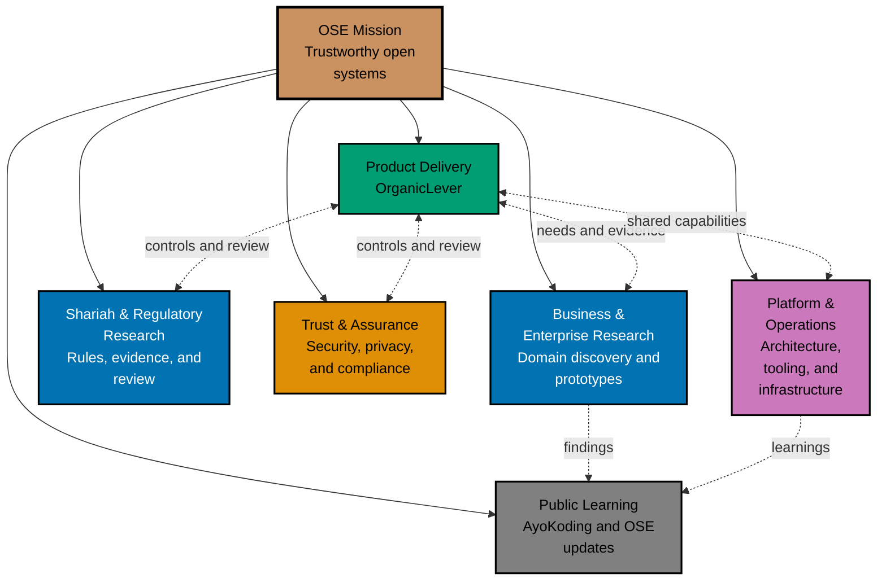

# About Open Sharia Enterprise

Open Sharia Enterprise (OSE) Platform is an **open-source (MIT)** platform for building Sharia-compliant enterprise solutions. Built for Islamic finance institutions and Sharia-compliant businesses, starting with Indonesian regulations and expanding globally.

## The Opportunity

Islamic finance is a multi-trillion dollar industry growing at double-digit rates, creating massive demand for Sharia-compliant enterprise systems. While purpose-built platforms exist, they're typically proprietary and expensive. Many organizations still struggle with legacy systems retrofitted for Sharia compliance.

**The gap?** Accessible, open-source solutions with built-in compliance and radical transparency.

## Mission

Our mission is to democratize access to **trustworthy**, Sharia-compliant enterprise technology for organizations of all sizes, regardless of region or industry.

We develop products, platform capabilities, and research through concurrent workstreams. Product
delivery, Shariah and regulatory research, trust and assurance, business and enterprise research,
platform engineering, and public learning can all progress in parallel. Each production-facing
deliverable must satisfy the readiness checks relevant to its risks and claims.

## Why Open Source Matters

**Transparency builds trust in Sharia-compliant systems.** Unlike expensive proprietary solutions, OSE Platform's source code is publicly visible and auditable by anyone.

### Trust Through Transparency

- **Community verification** - Anyone can review the code to verify Sharia compliance
- **Auditable by scholars** - Islamic finance experts can examine implementation details
- **No hidden mechanisms** - Complete transparency in financial calculations and processes
- **Trust through openness** - Open standards and shared knowledge drive innovation

### Accessible Code

- **Read and learn** - Full source code is publicly available on GitHub
- **Self-host freely** - Deploy for your own organization's use
- **No vendor lock-in** - Own your data, control your infrastructure
- **Fully open-source** - MIT license throughout, no restrictions

### Open Standards

- **Interoperability** - Works with existing systems through open standards
- **Portable** - Not tied to specific vendors or proprietary formats
- **Extensible** - Customize for your organization's specific needs
- **Future-proof** - Community ensures long-term sustainability

## Development Approach

We're building OSE Platform **in the open from day one**, with transparency and knowledge-sharing as core principles.

### Built in the Open

- **Public development** - All code, discussions, and decisions happen publicly on GitHub
- **Security and compliance infrastructure developed in parallel** - Not bolted on later
- **Community-driven roadmap** - Transparent planning and prioritization
- **Open governance** - Clear decision-making processes and contribution guidelines

### Learning in Public

We share our OSE Platform journey through [**monthly updates**](/updates/) published every 2nd Sunday of the month. Technical insights and lessons learned are documented on [**AyoKoding**](https://ayokoding.com), our bilingual educational platform. This "learning in public" approach:

- **Monthly platform updates** - Progress, decisions, and direction posted every 2nd Sunday at [oseplatform.com/updates](/updates/)
- **Shares technical insights** - Tutorials, guides, and lessons learned on AyoKoding
- **Builds community expertise** - Help others learn from our experiences
- **Demonstrates transparency** - Show how decisions are made
- **Accelerates ecosystem growth** - Enable others to build on our foundation

## Concurrent Workstreams

The roadmap organizes work through mission-aligned workstreams:

The connections show coordination and evidence exchange, not a start-to-finish sequence.

### Product Delivery

**OrganicLever** is an active product-delivery workstream:

- 🌐 **Marketing site** - [organiclever.com](https://www.organiclever.com/)
- 💻 **Product client** - Next.js 16 local-first web application with PGlite
- 🔧 **Backend** - F#/Giraffe/ASP.NET REST API
- 📚 **Learning goals** - Product validation, local-first data ownership, deployment, and
  proportional assurance

Small and medium business systems and enterprise systems remain important product directions.
Focused research, domain modelling, contract design, and prototypes can begin whenever a clear
question and sufficient capacity exist. OrganicLever does not have to finish before that work
starts.

### Shariah, Regulatory, and Enterprise Research

Research work develops traceable Shariah rules, jurisdiction-specific knowledge, scholar-review
requirements, business-domain models, and enterprise architecture evidence. Findings become
dependencies only when a specific deliverable relies on them.

### Trust, Platform, and Operations

Security, privacy, governance, shared architecture, tooling, deployment, observability, and
reliability evolve continuously. Production-facing work must meet controls proportional to its
risks; parallel exploration does not bypass readiness.

### Public Learning

AyoKoding, OSE updates, repository documentation, and specifications share reusable knowledge from
any active workstream while respecting security, privacy, licensing, and factual-accuracy
constraints.

## Prioritization and Readiness

We prioritize work by mission impact, user evidence, explicit dependencies, risk reduction,
capacity, and funding. Priority focuses execution without turning one workstream into a universal
gate for the others.

Each initiative or deliverable can occupy a different readiness state:

1. **Discovery** - Define the problem, research constraints, and test assumptions.
2. **Validation** - Demonstrate user value and technical feasibility with evidence.
3. **Production readiness** - Satisfy the relevant product, Shariah, security, operational, and
   quality gates.

These states apply to individual deliverables. They are not portfolio-wide stages, so research and
development can progress in parallel.

## Why This Approach?

- 🔀 **Parallel learning** - Useful work progresses wherever dependencies allow.
- 🎯 **Focused execution** - Explicit priorities prevent uncontrolled multitasking.
- 🔗 **Real dependencies** - Deliverables wait for necessary evidence, not arbitrary stage labels.
- 🧪 **Continuous validation** - Each deliverable proves its own assumptions.
- 🕌 **Compliance by design** - Shariah and regulatory research run alongside product discovery.
- 🛡️ **Assurance from the start** - Security, privacy, and governance evolve continuously.
- 📈 **Progressive complexity** - Initiatives add complexity only when evidence justifies it.
- 💰 **Sustainable choices** - Funding affects priority and scope without dictating a fixed product
  order.

## Core Principles

- 🕌 **Sharia-compliance as a foundation** - Built in from the ground up, not bolted on later
- 🔓 **Transparency and openness** - Code transparency builds trust
- 🌐 **Open-source by default** - Radical transparency unless it compromises security/privacy
- 🤖 **AI-assisted development** - Leverage AI systematically to enhance productivity
- 🤝 **Community collaboration** - Accelerate development of accessible tools
- 🛡️ **Governance and security from day one** - Essential for enterprise solutions

## Project Status

Development and research proceed through parallel workstreams:

- 🚀 **Product delivery** - OrganicLever marketing site, local-first client, backend, and paired
  end-to-end suites
- 🕌 **Shariah and regulatory research** - Principles, rules, review methods, and prototypes
- 🏢 **Business and enterprise research** - Domain discovery, process models, and experiments
- 🛡️ **Trust and assurance** - Security, privacy, governance, and compliance capabilities
- ⚙️ **Platform and operations** - Architecture, developer tooling, infrastructure, and reliability
- 📚 **Public learning** - AyoKoding educational content and OSE project updates

**Note:**

- 🔄 APIs and architecture are actively evolving
- ❌ Not accepting public contributions yet

## Technology

We choose technology for the initiative that needs it rather than reserving stacks for future
portfolio stages:

- **Product clients and public sites** - Next.js 16 + TypeScript
- **Local-first product data** - PGlite (PostgreSQL-WASM) backed by IndexedDB
- **Backend APIs** - F# + Giraffe + ASP.NET 10
- **Backend data** - PostgreSQL
- **CLI tools** - Rust for repository and content automation
- **PDF-to-Markdown tooling** - F#
- **Operations** - Vercel deployment plus Kubernetes, observability, and reliability research

## License

This project is licensed under the **[MIT License](https://github.com/wahidyankf/ose-public/blob/main/LICENSE)** — free to use, fork, modify, and distribute for any purpose, including commercial use.

All code in the repository (product applications, shared libraries, specifications, and AI agent configuration) is MIT-licensed with no competing-use restrictions.

See [LICENSING-NOTICE.md](https://github.com/wahidyankf/ose-public/blob/main/LICENSING-NOTICE.md) for full details.

## Get Involved

While we're not yet accepting public contributions, you can stay connected and support the project:

### Follow the Project

- **GitHub Repository**: [open-sharia-enterprise](https://github.com/wahidyankf/ose-public)
  - ⭐ Star the repository to show your support
  - 👀 Watch for updates and release announcements
  - 📋 Read the [detailed roadmap](https://github.com/wahidyankf/ose-public/blob/main/roadmap.md) and planning documents

### Learn and Explore

- **AyoKoding**: [ayokoding.com](https://ayokoding.com)
  - 📚 Educational content documenting our "learning in public" journey
  - 🎓 Tutorials, guides, and technical resources in Indonesian and English
  - 💡 Insights into building enterprise Sharia-compliant systems

### Spread the Word

- 📢 Share the project with your network
- 💬 Discuss with colleagues in Islamic finance and fintech
- 🤝 Connect with others interested in open-source Sharia-compliant solutions

## Key Resources

- **Main Repository**: [github.com/wahidyankf/ose-public](https://github.com/wahidyankf/ose-public)
- **Project Updates**: [oseplatform.com/updates](/updates/) - monthly, every 2nd Sunday
- **Educational Platform**: [ayokoding.com](https://ayokoding.com)
- **License**: MIT — fully open-source, no restrictions
