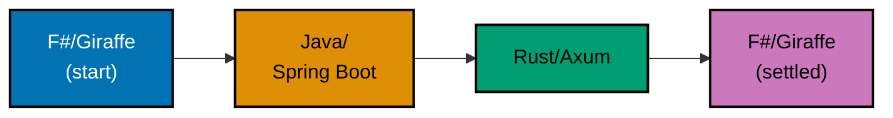
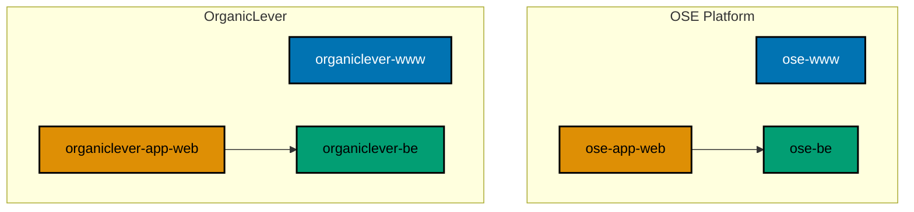

The previous update (Week 13) ended on two decisions: OrganicLever had gone local-first with an
in-browser PGlite database, and the single repository had split into independent siblings. Both held.
What did not hold was the backend language. Over the five weeks since, the product backends churned
through stacks — the full arc ran F#/Giraffe → Java/Spring Boot → Rust/Axum — before both settled
back on **F#/Giraffe**. That round trip is the spine of this update, and rather than hide it, this
post documents it: what each move was chasing, and why F# turned out to be the right home after all.

The rest of the period was consolidation around that decision: a cleaner naming taxonomy that makes
each project's deployment role legible from its name, OrganicLever's first deployment to
`app.organiclever.com` (only that — not even alpha, let alone production-ready), a domain-first GitHub Actions
pipeline naming scheme with a value-less env-injection contract, and — on the infrastructure side —
turning a recurring connectivity outage into a hardened two-node on-premise fleet.

Step back and the whole month has a single theme: **finding the patterns, architecture, and
infrastructure** the platform will stand on — not shipping product. That is the lens for everything
below. It is why a backend could be rewritten three times without anything "shipping," why so much
energy went into naming, governance, and a self-hosted fleet, and why the one user-facing event —
OrganicLever's first deployment — is exactly that and no more: a deployment, not a launch.

## The Backend Language Odyssey: F# → Java → Rust → F#

Week 13 left `organiclever-be` as a kept-warm F# scaffold and `ose-app-be` (the OSE Application
backend) as the production target. What followed was a deliberate, if winding, search for the right
backend stack:

- **F# → Java/Spring Boot** (mid-May). `organiclever-be` was migrated to Java/Spring Boot to evaluate
  the JVM ecosystem for the product backends.
- **Java → Rust/Axum** (late May). The backend went all-in on Rust: `organiclever-be` was rebuilt on
  Rust/Axum with `cucumber-rs` BDD tests at 98% unit coverage, and `ose-app-be` was reset to a
  Rust/Axum scaffold. A shared F# media service (`crane-be`, PDF-to-Markdown over HTTP + NATS) and
  the `fsharp-crane-core` library were stood up alongside.
- **Rust → F#/Giraffe** (mid-June). Both backends were rewritten one final time to **F# on .NET 10**
  — Giraffe for HTTP, EF Core 10 for data access, DbUp for run-on-boot migrations, and NATS.Net for
  messaging.

The flip-flop was not indecision for its own sake; each move answered a real question, and the final
F# rewrite was scoped by a plan whose grilling surfaced the deciding facts:

- **Generic-first backends.** The team self-hosts Kubernetes, so each product runs **one generic
  backend** (`<product>-be`) rather than a per-tier split. `ose-app-be` was renamed to **`ose-be`** —
  the generic name — and ported to F#; `organiclever-be` (already generically named) was rewritten in
  place. A future split stays possible without paying for multiple backends today.
- **A real backend, not an empty shell.** Because OrganicLever's web client is local-first, the
  backend had no product consumer beyond a health check. The decision was to make `organiclever-be` a
  _real_ service — minimal `journal` CRUD mirroring the in-browser schema, plus health and a
  JetStream messaging demo — rather than port an empty skeleton or drop it.
- **F# preserves what matters.** `ose-be` is the backend for the OSE Application, which is heading
  toward a broader Sharia-compliant **ERP** domain — regulatory and governance gap-analysis is just
  one area among several the product will grow into. Its existing AI/LLM integration (via OpenRouter)
  was preserved through the F# port. The `crane-be` media service was dropped from the platform —
  media handling moves back to the `crane-cli` tool — while the shared `fsharp-crane-core` library
  stayed.

The CLI tools tell the mirror-image story. `crane-cli` briefly ported to Rust, then reverted to **F#**
for clean .NET interop; the other CLIs (`rhino-cli`, `ose-cli`, `ayokoding-cli`) stayed Rust on the
shared `rust-commons` crate. The settled rule of thumb: **Rust for the CLIs and the infrastructure
that has to run lean; F#/.NET for the product backends and anything that benefits from the .NET
ecosystem.**

Both backends share the same internal shape: **hexagonal layers inside DDD bounded contexts**, with
their HTTP surface driven **contract-first** from an OpenAPI 3.1 spec. Generated clients are checked
against the spec in CI — drift fails the build — so the frontend and backend cannot silently disagree
about the API.

### Why This Middle Path

Underneath the back-and-forth is a deliberate bet about where software engineering is heading. In the
near future, product teams will increasingly make **"surface" changes to the codebase directly** —
this is already happening, and it should be encouraged. Product engineering will become a blend of
today's product and product-engineering roles plus anyone who specializes in driving **direct business
impact**, and they will be judged by that impact. They — together with other domain experts like IT
security or data-modeling specialists — will operate on top of the infrastructure, guardrails,
reliability, and stability provided by a **software engineering** team that knows how to work
cross-platform and do the deep optimization underneath.

But that whole picture rests on one assumption: that the **cost per unit of "IQ"** — today's LLMs or
whatever comparable tools come next — keeps dropping. Until it does, the real barrier to putting AI in
production is not capability; **it is cost**, and cost has to be monitored closely. The honest stance
is to stay aware of the hype without letting fear-mongering sway the decision either way. AI is a tool
with particular characteristics and particular costs — no more, no less.

Because that future is still uncertain, the tech-stack choices have to work **both ways** — including
the world where we go back to writing code by hand. That is exactly why F# for the main business
domain and Rust for the CLIs and the lean infrastructure feels like the right middle path right now:
both are readable and maintainable by a human, and both give an AI agent strong, explicit signals to
reason from. Whichever way the cost curve bends, the codebase stays legible to whoever — or whatever —
is editing it next.

And there is a deeper reason these two languages fit an **agentic** workflow specifically: **strong,
solid static typing is itself a deterministic guardrail.** An AI agent is non-deterministic by nature
— it proposes; it can be confidently wrong. A rich type system, an exhaustive compiler, and the
domain modeled directly in types turn a whole class of those mistakes into a hard compile error rather
than a runtime surprise found in production. The machine checks the machine. The more of the work that
agents do, the more essential that deterministic backstop becomes — which is why a language's type
system, not just its readability, is a first-class selection criterion here. F# and Rust both earn
their place on exactly that axis: their type systems do real work on every edit, human or agent.

The two criteria are not really separate, and one principle ties them together: **if a human engineer
cannot read the patterns in a codebase, do not expect an AI to write good code in it either.**
Readability is not a nicety that trades off against AI productivity — it is the precondition for it. A
clear, well-typed, consistently-patterned codebase is exactly the one an agent navigates well, because
the same signals a person relies on to reason about the code are the signals the model relies on too.
Keep the codebase legible to humans and you keep it legible to the machine; let it rot into something
only the original author could follow and no amount of model capability rescues it.

## A Cleaner App Taxonomy: `-www` / `-app-web` / `-be`

The naming was ambiguous: `-web` meant both a public marketing site and an application's web client,
so a project's **deployment role** was not legible from its name. This period adopted a repo-wide
taxonomy:

- **`<domain>-www`** — a public marketing/landing site served at the domain root (Vercel).
- **`<domain>-app-web`** — an application's web client served at `app.*` (Vercel).
- **`<domain>-be`** — the generic backend for a product domain.

Every public site was renamed to the `-www` suffix (`ose-web` → `ose-www`, `ayokoding-web` →
`ayokoding-www`, `wahidyankf-web` → `wahidyankf-www`), and OrganicLever — which had conflated a
marketing landing page with the local-first journal app in a single project — was split into a simple
marketing site (`organiclever-www`) and a separate app client (`organiclever-app-web`). The suffix
denotes deployment role, not internal architecture: established content platforms kept their existing
tRPC/content internals; only the role label changed.

The two app clients (`ose-app-web`, `organiclever-app-web`) consume the shared `web-ui` design-system
library, so the common components and tokens live in one place rather than being copied per app.

## `app.organiclever.com`: First Deployment (Not Yet Production-Ready)

The taxonomy split set up OrganicLever's first deployment. The `wire-vercel-www-app-cutover`
plan wired the environment branches for the `-www` and `-app-web` tiers and brought
**`app.organiclever.com`** online on Vercel — the first time the OrganicLever app is reachable at its
own URL. To be clear about its state: **this is only the first deployment — not even alpha, let alone
a production-ready release.** Getting even this far meant resolving the realities of deploying a
local-first app: running the PGlite
migration generator in the Vercel build command, building the preview from the right branch via an
`ignoreCommand` guard, and skipping the local web server in the E2E config when a deployed base URL is
supplied.

The OSE app tier (`ose-app-web` + `ose-be`, for `app.oseplatform.com`) is wired on the same shape —
`vercel.json`, staging and production branches — and is likewise nowhere near production-ready.
Neither app is close to a real launch; OrganicLever's `app.organiclever.com` is simply the first to
be reachable at its own URL — a deployment milestone, not a production launch.

## GitHub Actions: Domain-First Naming + a Value-Less Env Manifest

With more deployable surfaces, the CI pipeline naming needed structure. The
`standardize-github-actions-pipeline-naming` plan gave every workflow a **domain-first name** that
states which tier it serves, and reorganized the reusable workflows around the new
`-www` / `-app-web` / `-be` tiers. As part of that work, the app-tier staging-gate workflows were
renamed to drop a misleading `-deploy-prod` suffix — they run the staging E2E gate and stop, because
production CD is still deferred, so the name now matches the behavior.

Alongside the naming work, a new env-injection manifest declares, per app and per deploy
stage, _where_ each environment key is injected — **names only, never values**. `rhino-cli env
validate` checks the manifest for internal consistency, giving a drift guard over the env surface
without putting a single secret in a tracked file. The hard rule that no secret ever lands in a
git-tracked file held throughout. (The manifest was later merged into the `env-injection:` section
of `repo-config.yml`.)

## Cross-Repo Governance Hardening

Several governance changes landed across all three repos this period:

- **`governance/` → `repo-governance/`** — the vendor-neutral governance tree was renamed across every
  repo for clarity.
- **Unified markdown gate** — link and `#anchor` validation, heading-hierarchy checks on a prose
  allowlist, and Mermaid validation were consolidated behind `rhino-cli` and a single
  `validate-markdown` CI workflow.
- **Cross-language lint gates** — shellcheck, hadolint, and actionlint were added at a uniform
  warning-and-above threshold, joining the existing F# strict build (`TreatWarningsAsErrors` +
  G-Research analyzers + Fantomas) so shell scripts, Dockerfiles, and workflow files are gated like
  everything else.
- **Dependency bump policy** — a three-path decision tree now governs every dependency bump, with CVE
  clearance required from five sources including the **CISA KEV** catalog and **EPSS** scoring, exact
  version pins throughout, and waivers documented in writing.
- **Blameless post-mortems** — a post-mortem convention was adopted across all three repos (its first
  real exercise is the infra outage below).
- **Gherkin keyword cardinality** — a hard rule (one Given/When/Then shape per scenario) with a new
  `rhino-cli` audit backing it.

## `ayokoding-www`: More Tutorials

The educational site continued producing content under its maker/checker/fixer agent triplets,
including new by-example and architecture material and a learn-tree reorganization. The bilingual
(English/Indonesian) tutorial pipeline remains one of the busiest surfaces in the repo by commit
volume.

## `ose-infra`: On-Premise First, and an Outage Becomes a Hardened Fleet

Before the technical detail, the deliberate strategy this sits inside: **the platform starts on
on-premise infrastructure and expands to the cloud only as needed.** Cloud compute prices keep
climbing while the Indonesian Rupiah (IDR) weakens against the US Dollar, so a USD-denominated cloud
bill paid from IDR revenue gets more expensive on both axes at once. Self-hosting on Proxmox hardware
the project already owns is the economically sane starting point — and it pairs with the language
decisions above, because lean Rust CLIs and a modest F#/.NET backend footprint keep the resource
budget (and therefore the eventual cloud bill, when it comes) small. On-premise first is not an
ideological stance; it is a cost-driven default that buys runway. The plan is to expand incrementally —
moving production to the cloud or to proper datacenter colocation with a disaster-recovery site — as
the project grows and the economics justify it.

The infrastructure repo spent this period turning a recurring connectivity problem into a more
resilient base on that on-premise foundation. A "host unreachable" condition on the single Proxmox
host was investigated as a **blameless post-mortem** that disambiguated two distinct failure modes —
a dual-WAN egress flap (host up) and a full host-down event — using a single probe from a LAN peer.
The remediation shipped as infrastructure-as-code and runbooks: Wake-on-LAN enabled and verified,
scheduled VM backups, a watchdog, and off-host alerting.

From there the fleet expanded: a second self-hosted node was brought online, completing Part 1 of a
twin-cluster plan, and a Proxmox Datacenter Manager VM was added to coordinate the two nodes. Planning
for **twin k3s clusters** (a staging-1 / prod-2 replica policy) is staged for the next phase. All
infrastructure topology lives as code, with real addresses, subnets, and the tailnet name kept in
gitignored files and represented by placeholders in every committed document.

## `ose-primer`: Absorbing the Cross-Repo Work

The downstream template kept pace by absorbing the period's cross-cutting work across its polyglot
demo apps: the unified markdown gate, the dependency-hygiene pass (exact pins, CVE-clean toolchain),
the post-mortem convention, the Gherkin keyword-cardinality rule, and the harness-binding updates.
It also **dropped the Go build of `rhino-cli`** this period: after a stretch of running the Go and
Rust implementations side by side under a parity harness, the template removed the Go version and
renamed `rhino-cli-rust` → `rhino-cli`, consolidating on Rust to match `ose-public`. (Go is still one
of the template's demo backend languages — `crud-be-golang-gin`, `golang-commons` — just no longer the
CLI's.) Its specs also adopted the flat product-surface directory layout.

## Numerical Snapshot

What changed in roughly five weeks (2026-05-10 → 2026-06-15):

- **Commit cadence**: ~1,536 commits across the three repos (`ose-public` 855, `ose-infra` 388,
  `ose-primer` 293) over ~36 days — about 43 commits per day.
- **Product backend language**: F# → Java/Spring Boot → Rust/Axum → **F#/Giraffe** (.NET 10, EF Core
  10, DbUp, NATS.Net), settled.
- **Backend naming**: `ose-app-be` → **`ose-be`** (generic per-product backend); `organiclever-be`
  rewritten in place.
- **Public-site renames**: `ose-web` → `ose-www`, `ayokoding-web` → `ayokoding-www`, `wahidyankf-web`
  → `wahidyankf-www`.
- **OrganicLever split**: one `organiclever-web` → `organiclever-www` (marketing) +
  `organiclever-app-web` (app client).
- **First app deployment**: `app.organiclever.com` online on Vercel — only a first deployment, not
  even alpha, let alone production-ready.
- **`crane-be` media service**: stood up, then dropped (media returns to `crane-cli`, which reverted
  Rust → F#).
- **CI**: domain-first workflow naming + a value-less env-injection manifest (now in `repo-config.yml`) with
  `rhino-cli env validate`; shellcheck/hadolint/actionlint gates added.
- **Governance**: `governance/` → `repo-governance/`; unified markdown gate; CISA KEV + EPSS
  dependency policy; blameless post-mortem convention.

## What's Next

- **Ship the first backend to a real environment.** With both backends on a settled F# stack and the
  app tier live on Vercel, the next step is running `ose-be` and `organiclever-be` against the
  on-premise k3s clusters — moving the backends from local-stack CI to a deployed staging environment.
- **Twin k3s clusters.** Bring up staging and production k3s beside the CI runners on the two-node
  fleet (staging-1 / prod-2 replica policy). Power remains the honest risk for on-premise hosting;
  production moves incrementally to the cloud or a colocation/DR site as the project grows.
- **Backend E2E against staging.** The `BASE_URL` → `API_BASE_URL` rename this period set up the
  backend E2E suites to point at a deployed staging backend; consuming a real staging URL is the
  deferred follow-on once a reachable backend environment exists.
- **OrganicLever feature build-out.** With `app.organiclever.com` merely deployed — not even alpha —
  the local-first journal, workout sessions, history, and progress views are the work that turns that
  first deployment into something actually usable end-to-end; the F# `organiclever-be` is positioned
  for eventual sync.
- **Standardize secrets and env handling** across the repos, building on the env-injection manifest
  and the per-app env conventions.

Every commit is visible on [GitHub](https://github.com/wahidyankf/ose-public). `ose-primer` lives at
<https://github.com/wahidyankf/ose-primer>. Updates are published here on oseplatform.com, with
educational content on [ayokoding.com](https://ayokoding.com) and the personal portfolio at
[wahidyankf.com](https://www.wahidyankf.com/).

We continue to publish platform updates roughly monthly. Subscribe to the RSS feed or check back as
Phase 1 continues, Insha Allah.
