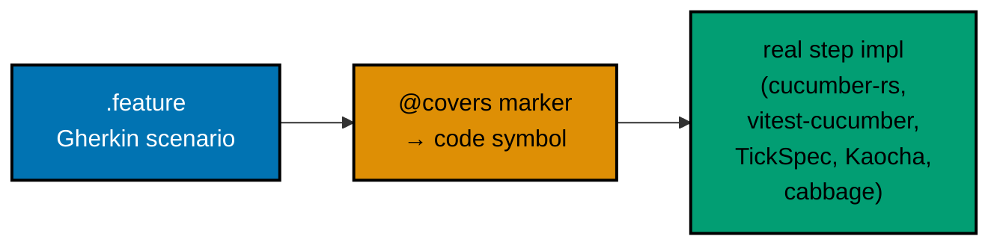
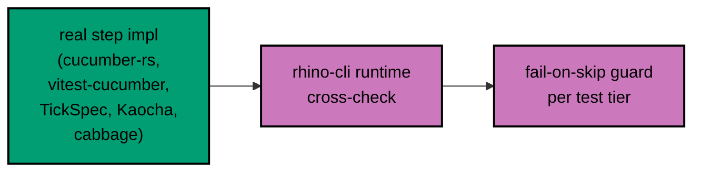
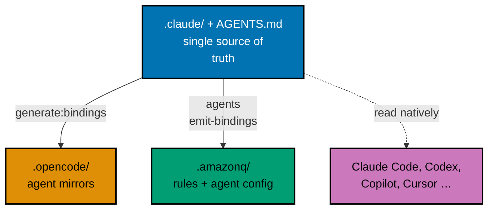

The last update (Week 18) ended with both product backends settled on F#, the app taxonomy cleaned
up into `-www` / `-app-web` / `-be`, and OrganicLever's first deployment reachable at
`app.organiclever.com`. The stated next steps were to ship a backend to a real environment and stand
up twin k3s clusters. Neither of those shipped this month — and that is the honest headline.

What did happen is harder to screenshot but more important: the **engineering substrate** underneath
all three repos was hardened. The shared CLI that gates every commit was converged into a single
byte-identical tool. The repository's test specifications — a large fraction of which were hollow
placeholders that passed by doing nothing — were rewritten to actually execute. Delivery moved
behind pull requests with a real review cycle. And the one user-facing thing that did ship — a
cost-of-living and salary calculator on the education site — went out only after a new hardening
convention, born from a post-mortem, forced it through a three-lens live-site retest first.

Step back and the month has a single theme, and it is the same lens as last month worn deeper:
**making the machinery trustworthy before scaling the product on top of it.** In an increasingly
agent-driven workflow, the guardrails are the product until the product exists. That is why a month
could pass with almost no new feature surface and still be one of the most consequential stretches so
far.

## rhino-cli: One Canonical Tool, Byte-Identical Across Three Repos

`rhino-cli` — the repository's hygiene-and-integration CLI that runs as a pre-commit and pre-push
validator — had drifted. Each of the three repos carried a slightly different copy: divergent command
names, divergent config files, subtly different validators. That drift is exactly the kind of thing
that erodes trust in a gate, because a check that means one thing in `ose-public` and another in
`ose-primer` is not really a shared standard.

Two back-to-back plans (`standardize-rhino-cli-sdlc-parity`, then `unify-rhino-cli-sdlc-parity`)
resolved it by making the CLI **byte-identical across all three repos**, including its entire Gherkin
behavior tree — every `.feature` file and every `README.md`. That byte-identity is now a written
boundary in an **SDLC Gate Standard** document, with zero carve-outs: if the tool differs across
repos, the parity gate fails the build.

The convergence pulled the surface into a consistent shape:

- **Verb-last command hierarchy** — commands were reorganized so the object comes before the action
  (`specs coverage validate`, `docs mermaid validate`, `agents naming validate`), giving the whole
  surface a predictable grammar rather than a grab-bag of verbs.
- **A single `repo-config.yml`** — the scattered per-concern config files (including the env-injection
  manifest introduced last month) were merged into one schema-validated config, with a schema-parity
  gate wired at pre-commit, PR, and main.
- **A mandatory Nx target set** — every project across all three repos now carries the same
  "mandatory-six" target names plus `deps:audit`, `compat:min-version`, `test:specs`, and native
  `test:coverage`. `namedInputs.specs` was wired across dozens of projects so a spec change correctly
  invalidates the Nx cache.

Because `ose-infra` is proprietary but must still run the identical tool, its copy of `rhino-cli` was
relicensed **MIT in place** — the tool is shared and public even though the repo around it is not. The
byte-identity boundary is drawn around the CLI, not the repo.

## De-Hollowing the Specs: Gherkin That Actually Runs

This is the biggest technical story of the month, and it is worth being blunt about the starting
point: **many of the repository's Gherkin scenarios were hollow.** They existed as `.feature` files
and satisfied a structural "specs exist" check, but their step definitions were stubs — they passed by
asserting nothing, or were skipped silently, or were never wired to a real BDD runner at all. A green
spec suite that does not exercise the code is worse than no suite, because it manufactures false
confidence — which is precisely the failure mode the post-mortem below is about.

Two plans (`enforce-identical-rhino-cli-gherkin` and `enforce-repo-wide-scenario-implementation`)
turned that around across **every project in all three repos**. The work had three moving parts:

- **Real BDD harnesses, per language.** Every hollow suite was migrated to an actual runner:
  **cucumber-rs** for Rust, **vitest-cucumber** for TypeScript, **TickSpec** for F#,
  **Kaocha-cucumber** for Clojure, and **cabbage / ExUnit** for Elixir. Scenarios that used to no-op
  now drive real code paths and fail when the code is wrong.
- **`@covers` traceability.** A new `@covers` marker convention links each scenario to the code
  symbol it exercises, and a `rhino-cli` **behavior-coverage runtime cross-check** verifies at build
  time that the linkage is real — that the scenario actually reaches what it claims to cover, not just
  that a tag string is present.
- **Fail-on-skip guards, per tier.** Every test tier (`test:unit`, `test:integration`, `test:e2e`,
  `test:specs`) now runs with a guard that turns a silently-skipped scenario into a hard failure. A
  scenario can no longer quietly opt out of running.

The first half of the chain is authoring: a scenario declares what it covers, and that declaration
resolves to a real step implementation on a real runner.

The second half is enforcement: that step implementation is checked at runtime, and the per-tier
guard turns any silent skip into a hard failure.

The payoff is a spec suite that can no longer lie. If a scenario passes, it ran; if it ran, it
touched the code it names. Combined with the byte-identical `rhino-cli` above, spec-versus-code drift
is now caught at pre-push in exactly the same way in every repo.

## Delivery Moves Behind Pull Requests

Last month's default was direct pushes to `main` under Trunk-Based Development. This month the default
flipped: every plan now declares a **Delivery Mode**, and the new default is **`worktree-to-pr`** —
work happens in an isolated worktree, lands as a draft PR, and a human does the final merge on their
own schedule. The change went out across all three repos (`ose-public` #29, `ose-infra` #6, and
`ose-primer` #3, the last of which was itself merged through the new flow as a proof of the mechanism).

Two supporting pieces landed with it:

- **A PR-Review Maker→Fixer Cycle.** Two agents, `pr-review-maker` and `pr-review-fixer`, run a
  default of three sequential CI-gated review rounds before the human merge. The maker posts
  line-anchored, evidence-cited findings through the GitHub Reviews API; the fixer triages each
  thread, pushes fixes to the PR branch, and resolves only what it actually addressed. The distinction
  the convention draws is deliberate: **"done" (a green, fully-reviewed PR handed off) is not the same
  as "merged"** (on the human's schedule).
- **A mandatory Knowledge Capture phase.** Every plan now ends by triaging its `learnings.md` to a
  permanent home or discarding it explicitly — codified as a convention, enforced by the plan agents,
  and emitted into the plan template. The lessons a plan surfaces no longer evaporate when the plan is
  archived.

## Live-Site Testing and a Post-Mortem About Green Gates

The delivery-hardening work traces back to a real incident, recorded as a blameless post-mortem: a
**UI change shipped past every green gate** and still reached production with defects, because the
gates were checking that code compiled and stub specs passed — not that the rendered page actually
behaved. (This is the same false-confidence failure the de-hollowed specs above are designed to kill.)

The response was a **User-Facing Delivery Hardening convention** — now sixteen rules — whose
centerpiece (Rule 15) forces UI plans to run a near-end exploratory retest on the _running_ page
before archival, not just unit and e2e checks. To make that retest real, a **live-site tester triad**
was built out, each agent judging a running site from a different vantage point:

- **`web-exploratory-tester`** — spec-aware; hunts functional and edge-case defects against existing
  Gherkin, and proposes new scenarios for behaviors that lack coverage.
- **`web-usability-tester`** — deliberately spec-blind; judges only what a first-time user perceives,
  against established usability heuristics.
- **`web-design-tester`** — design-aware; checks whether the rendered page matches its mockups, design
  tokens, and shared design-system primitives.

An **`api-exploratory-tester`** was added alongside for live REST/GraphQL testing, and all four gained
selectable output modes (`plan` / `delivery` / `local-temp`) so their findings can open a new backlog
plan, fold into an existing plan's retest, or drop a throwaway findings file for direct fixing.

## The One User-Facing Ship: Calculator + Navigation Revamp on the Education Site

Amid all the substrate work, one genuinely user-facing feature shipped — and it went out on
[ayokoding.com](https://ayokoding.com), the sibling education site, not on this platform. It is worth
reporting because it is where the new hardening machinery got its first real workout end-to-end:

- **A cost-of-living / salary-savings calculator.** A multi-tab tool with FX and city data, household
  scaling, dual-currency display, a minimum-engineering-role reverse lookup, and full URL state as the
  single source of truth (filters, tabs, and city deep-links are all encoded in the URL). It went
  through the three-lens tester triad twice, absorbed dozens of findings across usability, design, and
  accessibility, got locale-aware i18n and CSP headers, and shipped responsive layouts (mobile cards,
  tablet columns). It was deployed and verified live.
- **An information-architecture navigation revamp.** A new `/c` content namespace with 308 redirects,
  a global header / footer / mobile primary navigation, and a proper landing homepage — the structural
  backbone the growing tutorial catalog needed.
- **A new Kali Linux tooling tutorial** joined the bilingual education catalog.

The relevant point for this platform is not the calculator itself but that it became the proving
ground for Rule 15 and the tester triad: the first feature that could not be called "done" until a
browser-driven retest of the running page said so.

## Amazon Q: A Third Agent-Harness Binding

The repo already maintained dual compatibility with Claude Code (primary) and OpenCode (secondary,
auto-synced). This month **Amazon Q Developer** was added as a third binding. Because Amazon Q does not
read `AGENTS.md` natively, `rhino-cli` now emits a generated `.amazonq/` bridge — a rules file that
imports the canonical instruction surface plus a default agent config — from the same
`.claude/` source of truth as the OpenCode mirror. The governance stayed vendor-neutral; only a new
mechanical emitter was added, keeping the "edit `.claude/` first, then sync" workflow intact.

Alongside it, the OpenCode Go model mapping was refreshed to the current roster — **`opencode-go/glm-5.2`**
for the thinking and execution tiers and **`opencode-go/minimax-m3`** for the fast tier — continuing
last month's push to route routine agent work through a cheaper model path without losing the
Anthropic-backed Claude Code option for the hard work.

## `ose-infra`: On-Premise Clusters Move From Idea to Plan

The infrastructure repo stayed in the planning-and-hardening lane it entered last month. The
twin-k3s-cluster effort was sharpened into executable staging and production deploy plans: capacity
was right-sized for the monitoring stack, inaccurate figures were corrected against the real fleet,
and SSH-over-Tailscale access was made explicit. A
**ci-runner-health-monitoring** backlog plan was added to watch the self-hosted runners. Following the
Week-18 outage post-mortem, a second one landed this month — an **observer-side false-outage**
(Mode C): a case where the monitoring vantage point reported an outage that was not real, disambiguated
so the alerting does not cry wolf. `coralpolyp`, the infra's Rust/Axum app, migrated to **Rust edition
2024**, and the repo absorbed the full byte-identical `rhino-cli` and the governance parity work.

The k3s clusters still are not up, and no backend has been deployed to a real environment yet. That
remains the headline pending item — now with a much more concrete plan behind it.

## `ose-primer`: Polyglot CI Restored, BDD Brought Up to Parity

The downstream template did the same substrate work over a much wider language spread. Its standout
plan was **`primer-polyglot-codegen-ci-restoration`**: restoring green CI across the eleven polyglot
demo backends and the demo frontends, which meant fixing contract-codegen races and framework quirks
across Dart, Elixir, .NET, and Rust toolchains at once. On top of that it took the same BDD
de-hollowing pass — `@covers` markers and real runners across every `crud-*` variant and the Elixir /
Clojure support libraries — migrated its Rust crates to **edition 2024**, resolved 103 orphaned
README / doc files, and adopted the byte-identical `rhino-cli` and `worktree-to-pr` flow (its #3 PR was
merged through the new cycle). It is now a template a team can clone and get the same trustworthy gates
`ose-public` runs.

## Rust Edition 2024 and Toolchain Pins

A smaller cross-cutting thread: the Rust crates across the repos moved to **edition 2024**, and the
`lint-staged` and CI toolchain were pinned to match (`rustfmt --edition 2024`, a pre-installed MSRV
toolchain to defeat a `rustup` download race on the self-hosted runner). Several of the month's `fix(ci)`
commits are exactly this genre — bounding memory, serializing MSBuild and F# lint to dodge concurrent-build
races, and stabilizing timing-sensitive tests on constrained CI hardware — the unglamorous tax of
running a polyglot monorepo on a self-hosted fleet.

## Numerical Snapshot

What changed in roughly four weeks (2026-06-16 → 2026-07-13):

- **`rhino-cli`**: converged to a **byte-identical** tool across all three repos (feature tree
  included), verb-last command hierarchy, config merged into a single schema-validated `repo-config.yml`,
  relicensed MIT inside proprietary `ose-infra` to preserve identity.
- **BDD**: hollow Gherkin replaced with **real BDD harnesses** in every language (cucumber-rs,
  vitest-cucumber, TickSpec, Kaocha-cucumber, cabbage/ExUnit), `@covers` traceability with a runtime
  cross-check, and per-tier fail-on-skip guards across all three repos.
- **Delivery**: default mode → **`worktree-to-pr`** (public #29, infra #6, primer #3) with a
  `pr-review-maker`/`pr-review-fixer` cycle and a mandatory Knowledge Capture phase.
- **Testing agents**: live-site tester triad (`web-exploratory` / `web-usability` / `web-design`) plus
  `api-exploratory-tester`, all with selectable output modes; User-Facing Delivery Hardening convention
  grew to **sixteen rules** off a post-mortem.
- **Harness bindings**: Amazon Q Developer added as a **third** binding via a generated `.amazonq/`
  bridge; OpenCode Go models refreshed to `glm-5.2` / `minimax-m3`.
- **User-facing ship**: cost-of-living / salary calculator + IA navigation revamp went **live on
  ayokoding.com** (the education site), the first feature gated by the new browser-driven retest.
- **`ose-infra`**: twin-k3s staging/prod deploy plans sharpened (right-sized capacity, Tailscale SSH),
  ci-runner-health-monitoring plan added, Mode-C false-outage post-mortem, `coralpolyp` → Rust edition 2024.
- **`ose-primer`**: polyglot demo CI restored across 11 backends + frontends, BDD brought to parity,
  Rust edition 2024, 103 orphaned docs resolved.

## What's Next

- **Actually ship a backend.** The pending item from Week 18 is unchanged and now unblocked by the
  concrete k3s plans: bring up the twin staging/production clusters on the on-premise fleet and
  run `ose-be` / `organiclever-be` against a real staging environment instead of local-stack CI. Power
  remains the honest risk for on-premise hosting.
- **Execute the "Fundamentally Strong Software Engineer" curriculum.** A large tutorial plan is in
  progress for ayokoding-www — a breadth-first, 94-topic relearn-and-drill section spanning computer
  science through IT security, with paired learning (by-example depth) and drilling (active-recall)
  tracks. It is deliberately framed for the AI age: the engineer's durable edge is the fundamentals
  needed to judge, review, and correct generated code. This is authored as a plan today; turning it into
  content is the next phase.
- **Exercise the new delivery machinery in anger.** With `worktree-to-pr` and the PR-review cycle now
  the default, the next month is the first real test of whether the maker→fixer loop meaningfully raises
  the quality bar before human merge, or just adds ceremony — and tuning it based on that.
- **Keep routing routine work to cheaper models.** With the OpenCode Go mapping refreshed and a third
  harness binding in place, continue calibrating which capability tier each model fits, now that the
  substrate is trustworthy enough that a cheaper agent's output lands on the same hard gates.

Every commit is visible on [GitHub](https://github.com/wahidyankf/ose-public). `ose-primer` lives at
<https://github.com/wahidyankf/ose-primer>. Updates are published here on oseplatform.com, with
educational content on [ayokoding.com](https://ayokoding.com) and the personal portfolio at
[wahidyankf.com](https://www.wahidyankf.com/).

We continue to publish platform updates roughly monthly. Subscribe to the RSS feed or check back as
Phase 1 continues, Insha Allah.
</content>
</invoke>
