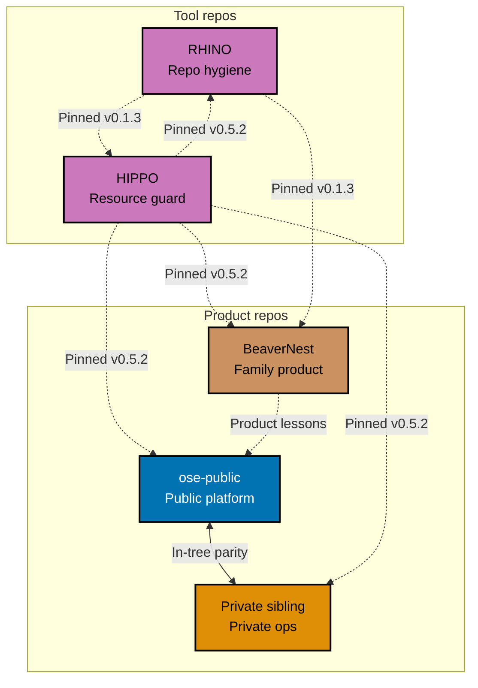
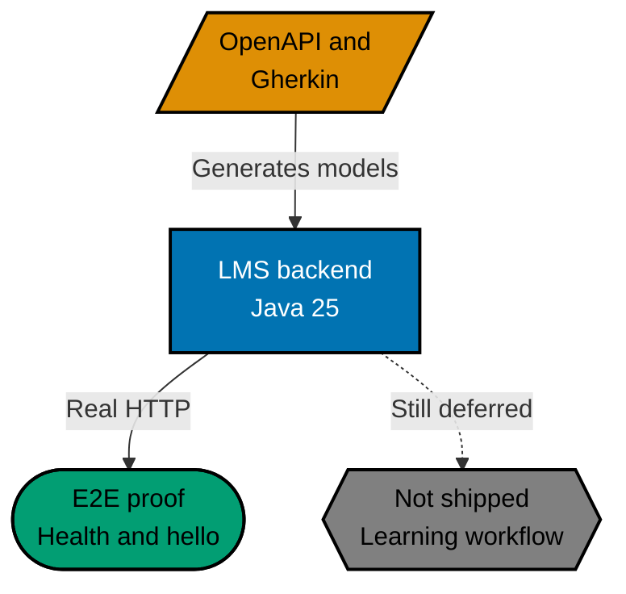
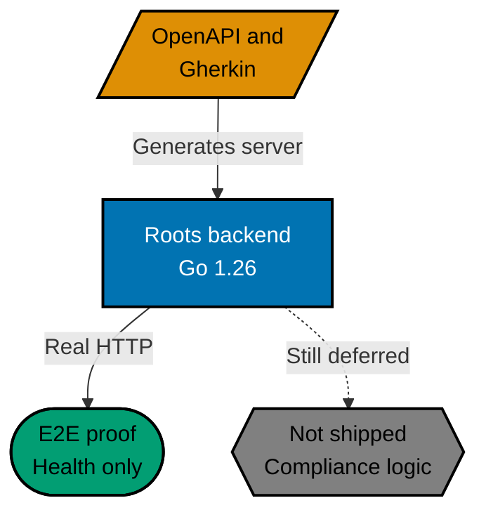

The previous platform update ended with three repositories and BeaverNest newly folded into
`ose-public`. That arrangement did not last. BeaverNest first gained a Flutter client beside its F#
backend, then moved back into an independent repository and rebuilt around Phoenix LiveView. Two
tools that began inside product repositories also became independent: HIPPO for host-resource
coordination and RHINO for repository-hygiene validation.

The endpoint is five **OSE Code Repositories**: `ose-public`, the private sibling, `beaver-nest`, `rhino`,
and `hippo`. The name helps readers find the complete engineering surface. It does not create a
parent repository, a five-way parity set, or a shared release train. Each repository versions,
gates, and releases independently.

That distinction matters because this was also the first reporting period in which OSE added new
backend product surfaces. `ose-public` now contains a Java/Spring backend foundation for the
learning-management domain and a Go/Gin foundation for reusable Sharia-compliance capability.
Both run, both follow executable contracts, and both have black-box HTTP proof. Neither implements
its eventual domain capability yet.

## Five Repositories With Five Jobs

The current repository map gives each boundary a specific purpose:

| Repository                                               | Current responsibility                                                             |
| -------------------------------------------------------- | ---------------------------------------------------------------------------------- |
| [`ose-public`](https://github.com/wahidyankf/ose-public) | The public OSE products, libraries, research, documentation, and governance source |
| The private sibling                                      | Authorized operations, infrastructure, and private product-support work            |
| [BeaverNest](https://github.com/wahidyankf/beaver-nest)  | An independent, family-only product and applied learning lab                       |
| [RHINO](https://github.com/wahidyankf/rhino)             | Generic, configuration-driven repository-hygiene validation                        |
| [HIPPO](https://github.com/wahidyankf/hippo)             | Generic coordination for resource-sensitive local development work                 |

Solid arrows mark the one source-parity relationship. Dashed arrows show pinned consumption or
selective knowledge transfer; they do not create ownership or automatic propagation.

Only `ose-public` and the private sibling form a parity pair. Their broader in-tree F# `apps/rhino-cli`
and its shared behavior corpus remain byte-identical. Independent RHINO is a different tool and
sits outside that boundary. BeaverNest, RHINO, and HIPPO carry no automatic governance or source
propagation obligation from OSE Public.

The separation also has a practical rule: consumers pin published releases and checksums. They do
not copy upstream implementations into their own trees. At the current endpoint, OSE Public, OSE
Private, BeaverNest, and RHINO all pin HIPPO v0.5.2. BeaverNest and HIPPO pin RHINO v0.1.3. RHINO
uses HIPPO to guard its own builds, while HIPPO uses RHINO to check its documentation contract.

## BeaverNest Leaves, Rebuilds, and Becomes Operational

BeaverNest crossed more than one architecture during this period. Its short-lived in-tree version
paired Flutter Web with an F#/Giraffe backend. The current product lives in its own repository and
uses Phoenix LiveView and Elixir. The earlier implementation was removed rather than maintained as
a second product line.

The independent application now serves page-scoped Codex conversations, streams partial responses,
resumes retained threads, and lets eligible administrators choose from models and reasoning efforts
reported by the local Codex installation. Parent and child roles stay read-only. An eligible admin
may enable repository writes only for the current connected chat; reload, reconnect, logout, and
clear-chat flows restore the safer default.

One-time family setup and persistent login protect centralized chat, learning, and theme records.
A checksum-verified migration moves those records into private SQLite state. The cutover retains
the old sources until the routed release proves the new database generation, and it locks against
active writes instead of racing them.

The serving path now reflects its family-only purpose. Tailscale provides private reachability,
Caddy holds a stable loopback route, and immutable Phoenix releases can move behind that route
without dropping the healthy slot. Compatible LiveView reconnects preserve the visible transcript
and can continue an interrupted Codex turn without repeating text already shown.

A persistent scheduler records daily backup claims and results in SQLite. It verifies an independent
SQLite snapshot before publishing an owned artifact-and-receipt pair. This is a real, continuously
used family service, but it is not a public SaaS product and should not be described as one.

## HIPPO Becomes the Shared Resource Arbiter

BeaverNest's resource guard became the independent
[HIPPO](https://github.com/wahidyankf/hippo) repository: **Host Infrastructure Pressure & Process
Orchestrator**. The first standalone release shipped on September 4; the current consumers pin
v0.5.2.

HIPPO addresses a problem that one repository cannot solve alone. A build in one checkout, a test
suite in another, and a development server in a third can each size themselves sensibly and still
overload the same machine together. HIPPO places a generic arbiter in front of that work.

In reservation mode, service, ephemeral, and transactional owners claim fixed CPU-and-memory
vectors from a shared ledger. Admission is atomic and first-in, first-out. Host-pressure evidence
still overrides a reservation that fits numerically. HIPPO can pass the admitted concurrency into
environment variables that Nx, Cargo, Gradle, Go, or another build system already understands; it
does not compile knowledge of those tools into the binary.

The ownership boundary is deliberately narrow. A guard may signal only the process group it
started. Under critical pressure, another owner can mark a victim, but the victim's own guard must
stop its child. Corrupt or unreadable shared state fails closed rather than being rewritten into a
convenient empty ledger.

The releases also made contention an ordinary, explicit outcome. Exit `75` means the caller may
retry the same deferred request; `--wait-for-admission` can apply a bounded retry budget. Cleanup
that cannot immediately obtain the coordination lock leaves a reconcilable owner mark for the next
holder instead of inventing a successful cleanup.

## RHINO Separates Checking From Policy

[RHINO](https://github.com/wahidyankf/rhino), the **Repository Hygiene & INtegration Orchestrator**,
started as a new Rust repository on September 7 and published v0.1.0 through v0.1.3 the following
day. Its releases provide checksum-verified archives for Apple Silicon and Intel macOS, plus ARM64
and x86-64 Linux.

RHINO checks five broad concerns:

- governed instruction files stay within their declared word budgets;
- directory maps continue to match the trees they describe;
- relative Markdown links resolve;
- Mermaid diagrams use declared legibility and color rules; and
- canonical agent and skill definitions remain compatible with every declared coding harness.

The binary contains no OSE word limit, directory name, palette, or harness roster. Each consumer
declares those values in `repo-config.yml`. A missing required key or unknown key in a RHINO-owned
section is a configuration error, not an invitation for the tool to guess.

RHINO also reports what it inspected. A clean run over zero declared diagrams must remain visibly
different from a tool that silently skipped diagrams it should have read. Its exit contract keeps
policy findings separate from invalid invocation or configuration, and JSON output preserves the
same distinction for automation.

The runtime is read-only by construction. It does not write to the inspected repository, start a
subprocess, or touch the network. Its unit adapter enforces a 99% line-coverage floor; integration
and end-to-end adapters run the same Gherkin corpus through real filesystem and process boundaries.

### The Cutover Did Not Manufacture a Speed Claim

BeaverNest replaced its F# Badakmini validator and the corresponding .NET requirement with a
checksum-pinned RHINO release. Measurement found nearly identical direct gate wall-clock results:
220–229 milliseconds for RHINO versus 223–228 milliseconds for Badakmini. The honest conclusion is
parity, not a Rust speedup.

Other costs changed materially. Peak resident memory fell from 64.4 MiB to 8.4 MiB, and a consumer
now downloads one verified archive rather than requiring a 674 MB .NET SDK plus a local build.
During the cutover, measurement also caught two RHINO performance defects before adoption: directory
mapping repeatedly walked the full repository, and harness parity read almost 99 MB while using
less than 2 MB. The fixes preserved output while narrowing the work to what each rule could actually
inspect.

That result captures the purpose of the extraction. The main gain is one generic, released
implementation with repository-owned policy—not a benchmark story assembled after the fact.

## OSE Public Starts Two Backend Lanes

The most direct product change is the arrival of two backend foundations in `ose-public`. They use
different languages because they serve different domains, not because OSE needs another technology
demonstration.

Each lane uses the same shape vocabulary below: a slanted node is the contract, a rectangle is the
running service, a rounded node is executed E2E proof, and a hexagon is deferred domain capability.

### OSE LMS Backend: Java and Spring Boot

`ose-lms-be` is a Java 25 service on Spring Boot 4.1.1. It currently exposes two versioned REST
responses: `/api/v1/health` reports healthy, and `/api/v1/hello` returns a greeting. Spring Boot
Actuator exposes health and no other Actuator endpoint.

OpenAPI generates the response models used by the controllers, so a contract change that the code
does not follow fails compilation. Cucumber-JVM drives the canonical behavior corpus in process,
and a dedicated Playwright project starts the built jar and sends real HTTP for the public-boundary
proof. The end-to-end suite sets retries to zero.

This is not yet a learning-management system. It has no database, message broker, outbound call, or
learning workflow. The slice establishes the Java toolchain, contract generation, Nx targets,
coverage floor, and executable boundary on which real LMS behavior can land.

### Roots Backend: Go and Gin

`roots-be` is a Go 1.26 service on Gin. It began under the name `islamic-be` and was renamed before
the initialization plan closed. The final name reflects its intended ownership: a general-purpose
Sharia-compliance API that the OSE application may consume, rather than a service owned by that
application.

Its current OpenAPI contract exposes only `/api/v1/health`. The generated server interface makes an
unimplemented contract operation a compile-time failure. Godog drives the source Gherkin at the
unit boundary, while a dedicated Playwright suite drives the health scenarios through a real
process and real HTTP. The authored internal packages reach 100% line coverage against a 99% floor.

Roots has no compliance judgment, database, authentication, or outbound connection yet. Calling it
a Sharia-compliance service describes the boundary it reserves, not capability already delivered.

## OSE Private and the Shared Test Contract

OSE Private adopted the same HIPPO v0.5.2 consumer and converged with OSE Public on the shared
behavior-driven test contract. The two repositories also retain the byte-identical in-tree F#
`apps/rhino-cli`, including the static check that reads real adapter coverage instead of accepting
placeholder declarations.

Across the public projects, that contract reached AyoKoding, shared web UI, OrganicLever, the OSE
application, the existing OSE backend, and the OSE website. Unit proof remains mandatory. Higher
layers exist only where the project owns the corresponding boundary, and an inapplicable layer is
explained rather than represented by a target that merely exits successfully.

This work is infrastructure for trustworthy claims, not a user-facing feature. It matters here
because both new backends used that contract from their first slice instead of adding tests after
their architecture had already settled.

## What Changed in the Direction of Travel

The previous update said the platform backend had not shipped and that the maintained OSE family
had returned to three repositories. Both statements were accurate at that endpoint. Neither is the
current endpoint.

The platform now has backend foundations, but still no delivered LMS workflow or compliance rule.
The repository set now has five members, but only because BeaverNest has a product-specific home and
the two extracted tools have generic contracts worth maintaining independently.

That is a more useful result than preserving the old count for consistency. Repository boundaries
are architecture: they should change when ownership, release cadence, and maintenance evidence say
they are wrong.

## What's Next

The next product work can add the first real LMS and Roots capabilities to already verified HTTP
surfaces. Their domain split should remain visible: learning workflows belong to LMS, while reusable
Sharia-compliance judgments belong to Roots.

RHINO and HIPPO need continued adoption as upstream products rather than copied source. Their
consumer contracts should stay pinned, checksum-verified, and independently upgradeable.

BeaverNest can continue evolving for real family use while preserving its current safety properties:
private reachability, role-aware write access, recoverable state transitions, and verified backups.

The five repositories do add coordination cost. The standard for keeping each boundary is therefore
simple: it must give one product or tool a clearer owner than it had before.

Every public change remains visible in the
[`ose-public`](https://github.com/wahidyankf/ose-public),
[`beaver-nest`](https://github.com/wahidyankf/beaver-nest),
[`rhino`](https://github.com/wahidyankf/rhino), and
[`hippo`](https://github.com/wahidyankf/hippo) repositories. OSE Private remains available only to
authorized maintainers. Updates continue here on oseplatform.com, with educational content on
[ayokoding.com](https://ayokoding.com).

We continue to publish rolling platform updates. Subscribe to the RSS feed or check back as the work
evolves, Insha Allah.
