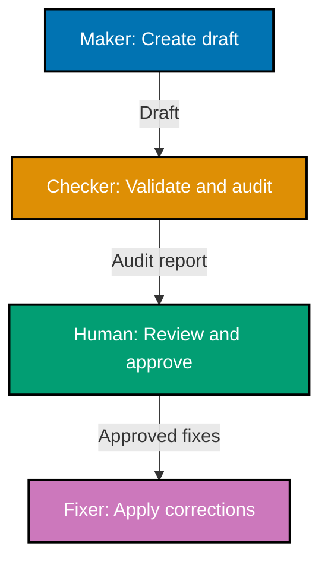

We're sharing an honest progress update on Open Sharia Enterprise Platform's early Phase 0 work. In the spirit of transparency and building in the open, here's where we are after 440+ commits of systematic foundation-building.

## Why Phase 0 Matters

Most software projects rush to write code. We're taking a different approach. Phase 0 isn't about building features—it's about building the foundation that makes everything else possible. Think of it as constructing the scaffolding, establishing the patterns, and setting the standards before laying the first brick of the actual building.

This approach might seem slow, but it's intentional. We're building a Sharia-compliant enterprise platform designed to last decades, not months. That requires foundations solid enough to support growth we can't even imagine yet. It means establishing conventions now that will prevent chaos later. It means thinking through architecture when changes are easy, not when production systems depend on our decisions.

We're in early Phase 0, pre-alpha. There's no product to download, no features to try. What we have is documentation beginning to take shape, infrastructure being built, and patterns being established. This is real progress, but there's substantial work ahead before Phase 0 completes.

## Building the Technical Foundation

The journey started with the basics that every serious software project needs. We standardized on Node.js 24.11.1 LTS with npm 11.6.3, using Volta to ensure everyone on the team works with identical versions. This might sound mundane, but version consistency prevents the "works on my machine" problems that plague collaborative projects.

We chose Nx as the monorepo tool. We're not building a single application—we're building a platform that will eventually comprise multiple applications sharing common code. Nx gives us that capability from day one. Our architecture divides the codebase into three distinct areas: deployable applications in `apps/`, reusable libraries in `libs/`, and experimental proof-of-concepts in `apps-labs/`. This last category deserves explanation—we need a playground for evaluating new frameworks and technologies without the discipline required in production code. It's where ideas get tested before they earn a place in the main platform.

The automation layer is being established. We configured Husky to enforce code formatting and commit message standards automatically. Every commit now passes through Prettier for consistent formatting and Commitlint to ensure our commit messages follow the Conventional Commits standard. This isn't about being pedantic—it's about maintaining clarity as the project grows. When you're looking back through hundreds of commits trying to understand when a specific change happened, well-formatted commit messages make the difference between five minutes and five hours.

We also committed to trunk-based development, meaning all work happens on the main branch with small, frequent commits. No long-lived feature branches that diverge for weeks and create painful merges. This keeps the codebase in a constantly releasable state and prevents the integration nightmares that plague traditional branching strategies.

## Documentation Foundations Taking Shape

Documentation usually happens last, if it happens at all. We're flipping that convention. Phase 0 focuses heavily on documentation infrastructure, because clear documentation is what transforms a collection of code into a platform others can actually use.

We adopted the Diátaxis framework, which organizes documentation into four distinct categories based on purpose. Tutorials teach newcomers by walking them through complete workflows. How-to guides help experienced users solve specific problems. Reference documentation provides technical specifications and API details. Explanation documents cover conceptual understanding and the reasoning behind our architectural decisions.

We've built the directory structure and are establishing conventions for each category. We integrated Obsidian for enhanced navigation, created a journals directory for capturing research notes in Logseq-style outliner format, and set up a plans directory to track project planning documents as they move from ideas through backlog to completion.

The conventions are beginning to solidify. We're establishing over 20 documentation standards covering everything from file naming patterns (prefixes that encode directory structure) to diagram accessibility (we use only color-blind friendly palettes in all Mermaid diagrams). We're defining when emoji usage is semantic and when it's forbidden. We standardized on ISO 8601 timestamps with UTC+7 for consistency across all metadata files.

These conventions solve real problems as they emerge. When a documentation file moves to a different directory, its filename prefix changes to reflect the new location—the convention makes reorganization trackable. When we use diagrams, they're automatically accessible to color-blind readers because we specified exactly which colors to use. When timestamps appear in metadata, they're unambiguous because we defined the format once and followed it everywhere.

## AI Agents: Automation with Oversight

Here's where things get interesting. We're building a system of over 20 specialized AI agents to assist with content creation, validation, and maintenance. This might sound like premature optimization, but it addresses a real challenge: maintaining quality and consistency across extensive documentation as the project scales.

The agents fall into clear categories. Content creation agents help draft documentation, tutorials, journal entries, and website content. Validation agents check documentation accuracy, verify links, and ensure content meets quality standards. Fixer agents apply validated corrections while maintaining human oversight. We also have agents for project planning, Hugo site development, and deployment operations.

The pattern we're developing is the maker-checker-fixer workflow. When we need new documentation, a maker agent creates the initial draft. A checker agent then validates it and generates an audit report identifying issues. A human reviews that report and decides which fixes to apply. Finally, a fixer agent applies only the approved changes, with confidence levels (HIGH, MEDIUM, FALSE_POSITIVE) indicating how certain we are about each fix.

This three-stage workflow with human review in the middle is crucial. We're not trying to fully automate content creation—we're using AI to handle routine work while preserving human judgment for decisions that matter. The agents catch formatting inconsistencies, broken links, and accessibility issues. Humans make choices about tone, messaging, and content strategy.

Seven agent families are emerging with this pattern: repository rules, ayokoding content, documentation tutorials, ose-platform-web content, README files, general documentation, and project plans. Each family has its own maker, checker, and fixer agents calibrated for its specific domain.

## Two Websites, One Mission

We launched two websites to serve different but complementary purposes. oseplatform.com is the project landing page where we share updates, announcements, and platform information. It's built with Hugo and the PaperMod theme—clean, accessible, professional. English only because our enterprise audience is international.

[ayokoding.com](https://ayokoding.com) is different. It's a bilingual educational platform (Indonesian and English) where we share the research, discoveries, and learning that happens while building OSE Platform. This embodies "learning in public"—the philosophy that knowledge shared benefits everyone. We built it with Hugo and the Hextra theme, optimized for documentation with navigation and tutorials.

The relationship between these sites is intentional. OSE Platform is what we're building. Ayokoding is how we're sharing what we learn in the process. One is the product, the other is the knowledge transfer. Both use automated deployment pipelines to Vercel, triggered by commits to dedicated environment branches (prod-ose-platform-web and prod-ayokoding-web).

Launching these websites during Phase 0 isn't premature—it's strategic. Open source creates trust, and trust requires transparency. By making our [GitHub repository](https://github.com/wahidyankf/ose-public) prominent on both sites and publishing progress updates like this one, we're demonstrating our commitment to building in the open. There's no smoke and mirrors, no proprietary secrets. What you see is what we're building.

## Security Planning from Day One

Most projects treat security as something to add later, after the core functionality works. We're taking a different approach: planning security infrastructure in parallel with the platform itself from the very beginning.

This means thinking about Security Operations Center (SOC) tooling now, not in Phase 3. It means considering red teaming infrastructure alongside the core architecture. It means treating compliance automation as a core component rather than a bolt-on feature. It means making security-first architectural decisions while those decisions are still easy to make.

We're not implementing all of this yet—Phase 0 is still foundation and research. But we're establishing the patterns and planning the infrastructure now so that when we start building production features in Phase 1, security isn't an afterthought we need to retrofit. It's integrated into the architecture from the first line of code.

This parallel planning model—thinking about enterprise platform and security infrastructure simultaneously—represents a fundamental shift from typical development approaches. It's harder now but dramatically easier in the long run.

## Development Practices Emerging

Beyond the technical infrastructure, we're establishing seven core development conventions that govern how we work. These cover AI agent standards (structure, naming, tool access patterns), the maker-checker-fixer quality workflow, confidence level assessment for automated fixes, repository validation patterns, content preservation principles, commit message formatting, and trunk-based development practices.

We also created designated directories for temporary files generated by agents. The `generated-reports/` directory holds validation and audit reports. The `local-temp/` directory stores miscellaneous temporary files and scratch work. Both are gitignored to keep the repository clean while giving agents organized places to store their outputs.

These details prevent future problems. When agent-generated reports have a consistent home, you don't waste time searching for validation output. When commit messages follow a standard format, you can write tools that parse them programmatically. When everyone follows trunk-based development, you avoid merge conflicts and integration delays.

## What's Actually Next

Phase 0 foundation work continues. We're still exploring architecture patterns, evaluating technologies for core platform components, designing security infrastructure, and researching compliance frameworks. The documentation framework is beginning to take shape, but substantial work remains before Phase 0 completes. This research phase concludes when we have clear answers to the fundamental questions that drive architectural decisions, not when a calendar says it's time to move on.

Phase 1 will focus on ERP foundation. That means core modules for accounting, inventory, and basic HR functionality. It means implementing the Sharia-compliance framework that makes this platform distinctive. It means production-ready authentication and authorization systems. It means establishing multi-tenancy architecture so one installation can serve multiple organizations. It means building the deployment infrastructure that makes all of this actually usable in production.

We don't have a timeline for Phase 1. This is a life-long project, and we're optimizing for quality over speed. Each phase completes when its foundation is truly solid, not when we've hit some arbitrary deadline. We'd rather take extra time to get the architecture right than rush to production and spend years paying for shortcuts we took under pressure.

## Current Reality

Let's be clear about where we actually are. This is early Phase 0, pre-alpha, foundational research and infrastructure. We've made 440+ commits of systematic work. Nothing is production-ready. You can't download this and use it for anything real yet.

What we have is foundation work in progress: a monorepo architecture established, documentation infrastructure beginning to take shape, automated quality checks being configured, specialized AI agents being developed, two live websites launched, development practices being established, and security planning integrated from the start. These aren't sexy features you can demo, but they're the foundations being built that will make everything else possible.

We're building this entirely in the open. Every decision, every convention, every line of code is visible on [GitHub](https://github.com/wahidyankf/ose-public). You can watch our progress through regular updates on oseplatform.com, follow the repository, subscribe to our RSS feed, or read the detailed research and guides we publish on [ayokoding.com](https://ayokoding.com).

This transparency is intentional. Open source creates trust. Building in public enables collaboration. Sharing our research helps others avoid the mistakes we've already made. We believe this approach produces better software and builds stronger communities.

## Stay Updated

We publish platform updates every second Sunday of each month. These updates share our progress, challenges, and decisions as we build OSE Platform in the open. Subscribe to our RSS feed or check back regularly to follow along.

440+ commits represent systematic, methodical progress toward foundations that will support enterprise fintech for decades. We're in early Phase 0, with the documentation framework beginning to take shape and infrastructure being built. We're not rushing. We're building it right.
