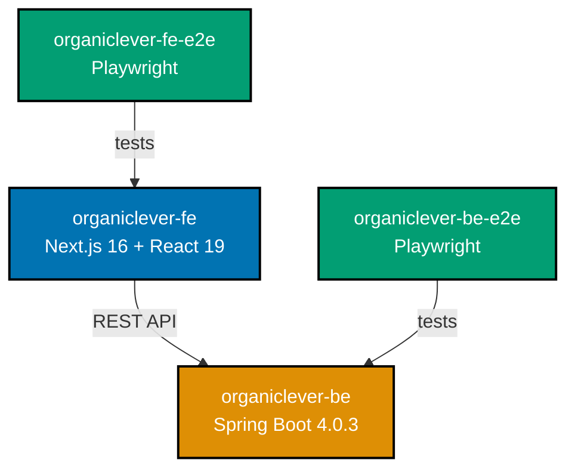
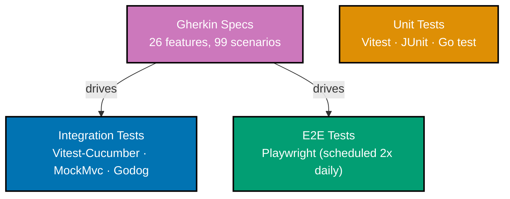

Phase 1 promised to exercise Phase 0 systems with a real product. Four weeks in, OrganicLever exists: frontend deployed at [www.organiclever.com](https://www.organiclever.com), Spring Boot backend running in local development with Docker Compose, E2E tests on schedule. Work landed across infrastructure solidification, testing infrastructure, coverage enforcement, CI/CD pipelines, and dependency modernization.

Infrastructure solidification remains the primary goal. Product features come second—we're building the systems that let us build products reliably. The OrganicLever content you see today is placeholder—auth flows, dashboard layout, members CRUD—just enough to exercise the CI/CD pipeline end-to-end.

## OrganicLever: From Plan to Product

Four weeks ago, OrganicLever was a plan. Now it's four projects in the Nx monorepo. All content is placeholder for now—the focus is on building and validating the CI/CD infrastructure, not product features.

**organiclever-fe** — Next.js 16 with React 19, TailwindCSS v4, shadcn-ui components, cookie-based auth, dashboard layout, members CRUD, Storybook 10 for component development. 99.57% test coverage via Vitest with v8 provider.

**organiclever-be** — Spring Boot 4.0.3 on Java 25, JSpecify + NullAway for null safety, Docker Compose for local development, REST API with members management. 100% test coverage via JaCoCo.

**organiclever-fe-e2e** — Playwright E2E tests for the frontend, running on scheduled CI twice daily.

**organiclever-be-e2e** — Playwright E2E tests for the backend REST API, validating API contracts end-to-end.

Flutter app was deferred—desktop and mobile clients will come later when the backend API stabilizes.

**OrganicLever Architecture:**

## Three-Tier Testing Infrastructure

Testing is organized into three tiers sharing a common Gherkin specification layer. 26 feature files define 99 scenarios that drive integration and E2E tests.

**Unit tests** cover isolated pure functions, hooks, and algorithmic logic—things integration tests cannot reach. Vitest for TypeScript, JUnit for Java, Go's testing package for Go projects.

**Integration tests** cover feature-level workflows with in-process mocking. Vitest-Cucumber with MSW for organiclever-fe, Cucumber JVM with MockMvc for organiclever-be, Godog with mock closures for Go libraries. All integration tests are deterministic and cacheable—no external services required.

**E2E tests** validate deployed systems end-to-end. Playwright runs against real browser instances for web, against live API endpoints for backend. Scheduled twice daily via GitHub Actions.

The key insight: shared Gherkin specs ensure integration and E2E tiers test the same behaviors. A scenario defined once in `.feature` files drives both Vitest-Cucumber integration tests and Playwright E2E tests, preventing specification drift between tiers. Unit tests remain standalone, covering isolated logic that doesn't need behavioral specification.

**Three-Tier Testing Architecture:**

## Coverage Enforcement: Zero to 95 Percent

Coverage enforcement didn't exist in Phase 0. During Phase 1, thresholds were introduced at 80% and progressively raised—80% → 85% → 90% → 95%—across all projects. The `rhino-cli test-coverage validate` command enforces thresholds using Codecov's line-based algorithm (covered / (covered + partial + missed)), running as part of `test:quick` on every pre-push.

**Final coverage numbers (all projects ≥95%):**

- **golang-commons**: 100%
- **organiclever-be**: 100% (JaCoCo)
- **organiclever-fe**: 99.57% (Vitest v8)
- **hugo-commons**: 97.59%
- **oseplatform-cli**: 97.30%
- **rhino-cli**: 95.68%
- **ayokoding-cli**: 95.48%

Reaching 95%+ in Go required creative techniques within gofmt constraints: `var osExit = os.Exit` injection for testing error paths, single-line function bodies, and mock closure patterns. Inline `if err != nil { return err }` doesn't survive gofmt—it always expands to multi-line. These patterns are documented for future reference.

Codecov badge integration was added for public visibility of coverage status.

## CI/CD Pipeline: Seven Workflows

Seven GitHub Actions workflows now automate quality and deployment:

**On push to main:**

- **main-ci** — Runs `test:quick` across all projects (Go, Java, TypeScript, Hugo), uploads coverage reports to Codecov for all 7 projects

**On pull request:**

- **pr-quality-gate** — Runs typecheck, lint, and `test:quick` for affected projects only, gating merge on all checks passing
- **format-pr** — Runs Prettier on changed files and auto-commits formatted results back to the PR branch
- **validate-docs-links** — Runs `rhino-cli docs validate-links` against all markdown files to catch broken internal links

**Scheduled (twice daily, 6 AM / 6 PM WIB):**

- **deploy-ayokoding-web** — Diffs `main` against `prod-ayokoding-web`, builds Hugo site and force-pushes to production branch if changes detected (Vercel picks up the push)
- **deploy-oseplatform-web** — Same change-detection and deploy pattern for oseplatform.com
- **e2e-organiclever** — Spins up Spring Boot backend via Docker Compose, waits for health check, runs Playwright against backend API; then builds Next.js app, starts it in Docker, runs Playwright against the web UI; uploads test reports as artifacts

Docker Compose orchestrates E2E environments—spinning up Spring Boot backend and Next.js frontend in containers, with Playwright running on the host against those services. Pre-push quality gate runs `nx affected -t test:quick` locally before code reaches CI.

## Infrastructure That Makes It Work

The testing and CI systems above didn't appear in isolation. They sit on top of tooling and workspace improvements that matured alongside OrganicLever.

**rhino-cli** evolved from v0.4.0 to v0.10.0. At the end of Phase 0 it handled agent validation and sync (4 commands). During Phase 1 it gained environment verification (`doctor`), test coverage enforcement (`test-coverage validate`), BDD spec coverage checking (`spec-coverage validate`), Java annotation validation (`java validate-annotations`), and documentation naming validation (`docs validate-naming`). All commands were restructured into domain-prefixed Cobra subcommands (e.g., `docs validate-links`, `agents validate-claude`), standardized on JSON output for CI integration, and backed by 39 Godog BDD scenarios.

**Nx workspace standardization** gave the monorepo consistent structure. Canonical targets (`build`, `lint`, `test:quick`, `test:unit`, `test:integration`, `test:e2e`, `dev`) are defined uniformly across all projects. Integration tests are marked cacheable in `nx.json` because they use in-process mocking only. Implicit dependencies and project tags keep the dependency graph accurate as projects multiply.

**Two shared libraries** were created in `libs/` during Phase 1. **golang-commons** provides shared Go utilities (test helpers for stdout capture, timestamp formatting) used across CLI tools. **hugo-commons** holds Hugo-specific utilities (link checking for Hugo sites), extracted from golang-commons when the link validation logic proved Hugo-specific. Both have Godog BDD test suites with deterministic in-process mocking—tmpdir mocks for hugo-commons, mock closures for golang-commons.

**Dependency modernization** kept the stack current. Next.js 14 → 16 (with React 18 → 19), TailwindCSS v3 → v4, Go 1.24 → 1.26, Spring Boot 4.0.1 → 4.0.3, Node.js 24.11.1 → 24.13.1, Nx 22.1 → 22.5.2, and latest Hugo themes. Two dedicated plans (local-ci-standardization, dependency-update) tracked these upgrades systematically.

## Governance and Agent System

As infrastructure grew, governance kept pace to prevent drift.

New conventions formalized the patterns emerging from OrganicLever development: three-tier testing definitions with per-tier tooling standards, BDD spec-to-test mapping linking Gherkin features to their implementations across tiers, and dynamic collection references prohibiting hardcoded counts of growing collections in documentation. Markdown quality is enforced automatically—Prettier formatting and markdownlint validation both run on pre-commit, and a Claude Code hook formats files after each edit. Generic educational content was removed from docs/explanation/ (it belongs in ayokoding-web), keeping style guides focused on repository-specific conventions.

The agent system grew from 56 to 58 specialized agents, with `swe-code-checker` added for validating projects against platform coding standards. Skills were consolidated from 33 to 28—removing redundancy while maintaining coverage.

## Metrics That Matter

**Week 12 → Week 16 (Phase 1 Progress):**

- **OrganicLever projects**: 0 → 4 (web, backend, web-e2e, be-e2e)
- **Test coverage**: none → 95%+ enforced across all 7 projects
- **CI/CD workflows**: 2 → 7
- **BDD specifications**: 0 → 26 features, 99 scenarios
- **rhino-cli**: v0.4.0 → v0.10.0 (4 commands → domain-prefixed subcommands, 39 BDD scenarios)
- **Agents**: 56 → 58
- **Skills**: 33 → 28 (consolidated)
- **Next.js**: 14 → 16, **Go**: 1.24 → 1.26, **TailwindCSS**: v3 → v4
- **Plans completed**: 2 (local-ci-standardization, dependency-update)

## What's Actually Next

The next month focuses on two priorities before moving to continuous deployment, Insha Allah:

**Local development and CI improvements** — Continuing to strengthen the developer experience and automated quality gates. The foundation has to be solid before we pipe anything to production automatically.

**Backend tech stack evaluation** — We're developing organiclever-be in multiple tech stacks in parallel (AI makes this practical) to evaluate which serves potential users best. The goal is a backend chosen for solid foundations—reliability, maintainability, performance characteristics that match our use case—not popularity. Once the evaluation settles, we'll commit to one stack and build the CD pipeline around it.

Continuous deployment comes after these problems are solved. No point automating delivery of something we haven't validated yet.

## Building in the Open

Four weeks of Phase 1 complete. OrganicLever exists—frontend deployed, backend in development, testing infrastructure in place. The testing setup would be excessive for a productivity tracker, but that's the point. We're building the infrastructure, not just the app.

Every commit visible on [GitHub](https://github.com/wahidyankf/ose-public). Platform updates published here on oseplatform.com every second Sunday. Educational content shared on [ayokoding.com](https://ayokoding.com).

We publish platform updates every second Sunday of each month. Subscribe to our RSS feed or check back regularly to follow along as Phase 1 continues, Insha Allah.
