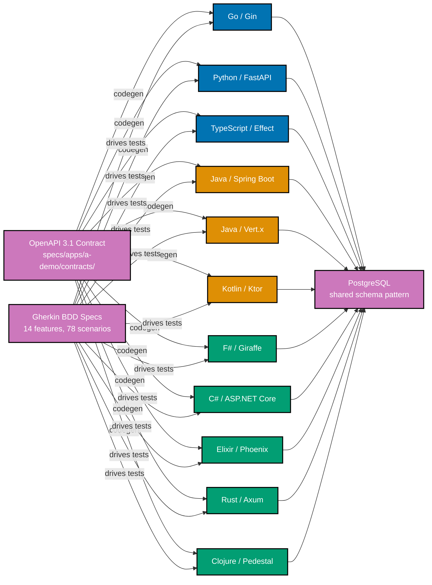
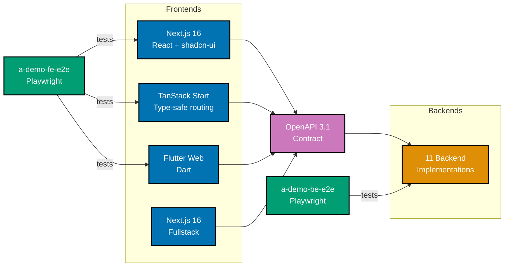
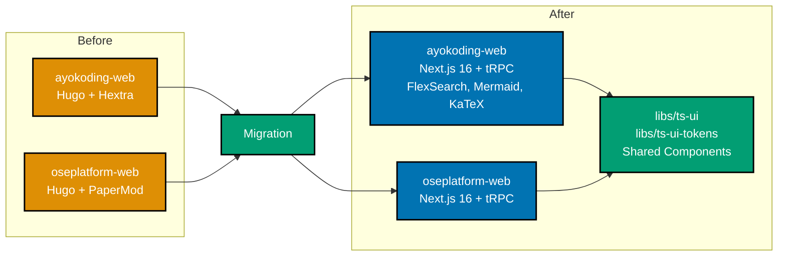
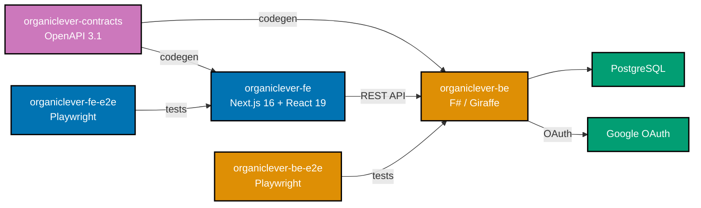
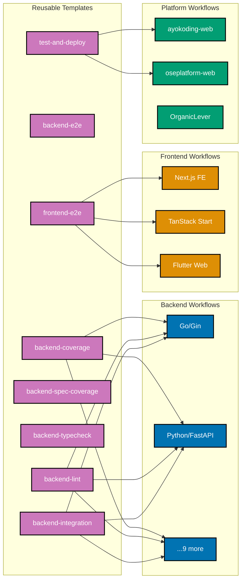

Four weeks ago we promised two things: local development and CI improvements, and a backend tech stack evaluation. Both delivered. The CI improvements shipped. The backend evaluation—well, we evaluated eleven of them. That is not a typo. We built the same expense tracker REST API in eleven different backend frameworks spanning ten programming languages, all sharing a single OpenAPI 3.1 contract and a single Gherkin BDD specification suite. AI-assisted development made this practical. Discipline made it useful.

Beyond the backends, both content platforms migrated from Hugo to fullstack Next.js 16, OrganicLever's backend pivoted from Java/Spring Boot to F#/Giraffe with OpenAPI contract enforcement, three demo frontends shipped across different frameworks, the project adopted FSL-1.1-MIT licensing, and CI/CD grew from 7 workflows to 29. The infrastructure that Phase 0 designed and Phase 1 Week 4 began exercising is now carrying serious weight.

The real value of this period is not the volume of output. The real value is what we learned building the same application eleven times over, and the infrastructure that made it possible to do so without drowning in inconsistency.

## The Polyglot Backend Experiment

### Why Eleven Backends

The Week 4 update mentioned we were developing OrganicLever's backend in multiple tech stacks to evaluate which serves potential users best. The original plan was perhaps three or four stacks—enough to make an informed choice. What actually happened was more ambitious.

AI-assisted development compressed what would have been months of work into weeks. Each backend took roughly two to three days from scaffold to passing E2E tests, because the patterns were established by the first few implementations. The OpenAPI contract defined what to build. The Gherkin specifications defined how to verify it. Each new backend was an exercise in translating established patterns into a new language's idioms.

The goal was never benchmarking. We did not build eleven backends to compare request latency or throughput numbers. The goal was to understand each language and framework through the experience of building a real application with real requirements: authentication, CRUD with business rules, reporting endpoints, admin operations, database migrations, repository abstractions, test coverage enforcement, and CI/CD integration. You learn different things writing a repository pattern in Clojure's `defprotocol` than you do writing one with Go's interfaces or Rust's traits.

Every backend implements the same domain: an expense tracker with user registration, password-based authentication, JWT token management, expense CRUD with currency and unit handling, attachment management, reporting endpoints, admin operations, and a health check. Realistic enough to exercise real patterns. Consistent enough to compare meaningfully.

### One Contract, Many Languages

The shared infrastructure that made this possible is the contract layer. Two artifacts define what every backend must implement:

**OpenAPI 3.1 contract** at `specs/apps/a-demo/contracts/openapi.yaml`—a single source of truth for every endpoint, request body, response schema, error format, and authentication requirement. Each backend has a `codegen` Nx target that generates language-specific types, models, and encoders/decoders from this specification. The generated code lives in `generated-contracts/` (gitignored, regenerated on build). Contract violations are caught automatically—`codegen` runs before `typecheck` and `build`, so if the implementation drifts from the contract, the build fails.

**Gherkin BDD specifications** at `specs/apps/a-demo/be/gherkin/`—14 feature files across 8 domains defining 78 scenarios that every backend must satisfy:

- **admin** (6 scenarios) — user management, role-based access
- **authentication** (12 scenarios) — password login, token lifecycle
- **expenses** (33 scenarios) — CRUD, currency handling, unit handling, attachments, reporting
- **health** (2 scenarios) — service health checks
- **security** (5 scenarios) — authorization, input validation
- **test-support** (2 scenarios) — test data management
- **token-management** (6 scenarios) — JWT refresh, revocation
- **user-lifecycle** (12 scenarios) — registration, account management

These specifications are consumed at all three testing levels. Unit tests mock dependencies and call service functions directly. Integration tests use a real PostgreSQL database via Docker Compose but still call service functions directly—no HTTP. E2E tests hit real HTTP endpoints via Playwright. Same Gherkin scenarios, different step implementations. Specification drift between testing tiers is structurally impossible.

### What Every Backend Shares

Despite the language diversity, every backend implements the same patterns:

- **Contract codegen** — Language-specific code generation from the OpenAPI 3.1 specification. Go uses `oapi-codegen`, Java and Kotlin use the OpenAPI Generator Gradle plugin, Python uses `datamodel-code-generator`, Rust uses a custom build script with `utoipa`, TypeScript uses `openapi-typescript`, F# and C# use NSwag, Elixir uses a custom Mix task, Clojure uses a custom library (`libs/clojure-openapi-codegen`).
- **Gherkin BDD specs** — All 78 scenarios consumed at unit and integration levels. Go uses Godog, Java and Kotlin use Cucumber JVM, Python uses `pytest-bdd`, Rust uses Cucumber-rs, TypeScript uses Vitest-Cucumber, F# uses TickSpec, C# uses Reqnroll, Elixir uses a custom Cabbage fork (`libs/elixir-cabbage`), Clojure uses `clj-cucumber`.
- **Database migrations** — Each backend manages its own PostgreSQL schema using language-idiomatic tooling. No shared migration files—each stack owns its schema lifecycle independently.
- **Repository pattern** — Interface-based abstraction separating domain logic from database access. The implementation varies by language paradigm: interfaces in Go, Java, Kotlin, C#, and TypeScript; traits in Rust; protocols in Elixir and Clojure; function-record abstractions in F#.
- **90%+ test coverage** — Enforced via `rhino-cli test-coverage validate` running as part of `test:quick`. Coverage tools vary by language: Go's built-in cover, JaCoCo for Java, Kover for Kotlin, coverage.py for Python, cargo-llvm-cov for Rust, Vitest v8 for TypeScript, AltCover for F#, Coverlet for C#, ExCoveralls for Elixir, Cloverage for Clojure.
- **Docker integration testing** — Each backend has a `docker-compose.yml` spinning up PostgreSQL for integration tests. Tests call service functions directly against the real database—no HTTP layer involved.
- **Three-level testing** — Unit (mocked, cacheable), integration (real PostgreSQL, not cacheable), E2E (real HTTP via Playwright, not cacheable). All three levels consume the same Gherkin specifications.
- **Dedicated CI workflow** — Each backend has its own GitHub Actions workflow running lint, typecheck, test:quick, and test:integration on every push to main.

### Database Migration Tooling

Each backend uses the migration tool native to its ecosystem:

| Language   | Framework    | Migration Tool       | Notes                                 |
| ---------- | ------------ | -------------------- | ------------------------------------- |
| Go         | Gin          | goose                | SQL-based migrations                  |
| Python     | FastAPI      | Alembic              | Auto-generated from SQLAlchemy models |
| Rust       | Axum         | sqlx CLI             | Compile-time SQL verification         |
| Java       | Spring Boot  | Liquibase            | XML changelogs                        |
| Java       | Vert.x       | Liquibase            | Same tooling, different framework     |
| Kotlin     | Ktor         | Flyway               | Kotlin DSL configuration              |
| F#         | Giraffe      | DbUp                 | Embedded SQL scripts                  |
| C#         | ASP.NET Core | EF Core              | Code-first migrations                 |
| TypeScript | Effect       | @effect/sql Migrator | Effect-native migration system        |
| Elixir     | Phoenix      | Ecto                 | Elixir migration modules              |
| Clojure    | Pedestal     | Migratus             | EDN-configured SQL migrations         |

The migration tooling standardization was its own completed plan (`database-migration-tooling`). Each backend manages schema independently—no shared migration files across languages. The schema is equivalent but owned by each stack's native tooling.

### Language-by-Language Observations

These are observations from building the same application, not rankings. Every language has trade-offs. The point was to experience those trade-offs firsthand rather than reading about them.

**JVM Family — Java/Spring Boot, Java/Vert.x, Kotlin/Ktor**

Spring Boot remains the most conventional path. JSpecify with NullAway provides compile-time null safety that catches real bugs. JaCoCo coverage reporting is straightforward. The ecosystem is mature—every problem has a well-documented solution. The verbosity is real but predictable.

Vert.x offers a reactive alternative on the same JVM. The programming model differs significantly—event-loop-based, non-blocking by default. Liquibase migrations shared the same tooling as Spring Boot, but the application structure diverged. Interesting for high-concurrency scenarios, but the ecosystem is smaller.

Kotlin/Ktor brings JVM reliability with modern language features. Coroutines make async code readable. Null safety is baked into the type system rather than bolted on. Flyway migrations integrate cleanly. The codebase ended up noticeably more concise than the Java equivalents.

**Functional Family — F#/Giraffe, Elixir/Phoenix, Clojure/Pedestal**

F# surprised us. The function-record pattern for repository abstraction—defining a record type whose fields are functions—is elegant and testable. Computation expressions handle async and error flows cleanly. AltCover with `--linecover` avoids the BRDA inflation that `task{}` expressions cause in branch coverage. DbUp migrations are simple and reliable. This experience settled the question: F#/Giraffe is the chosen backend for OrganicLever.

Elixir/Phoenix brings the BEAM's concurrency model. Pattern matching, immutability by default, and the supervision tree are genuinely different from everything else in this list. The Cabbage library for Gherkin required a custom fork (`libs/elixir-cabbage`) to work with our testing patterns, and OpenAPI codegen needed a custom library (`libs/elixir-openapi-codegen`). The ecosystem is smaller but the runtime characteristics are distinctive.

Clojure/Pedestal represents a fundamentally different approach. `defprotocol` for the repository pattern, immutable data structures everywhere, REPL-driven development. Migratus for migrations required locale-aware configuration to handle currency formatting correctly. The codebase is the most concise of all eleven. The learning curve is the steepest.

**Systems Languages — Go/Gin, Rust/Axum**

Go is straightforward in the way Go always is. Interfaces for the repository pattern, GORM for database access, goose for migrations. The testing story with Godog is clean. `go test` with coverage just works. The codebase is verbose but every line is obvious.

Rust/Axum demands more upfront thought. The ownership model catches real bugs—use-after-free, data races—at compile time. Traits for the repository pattern work well. `cargo-llvm-cov` for coverage and `sqlx` for compile-time SQL verification add safety that other languages cannot match. The trade-off is compilation time and a steeper learning curve for contributors unfamiliar with the borrow checker.

**TypeScript/Effect**

Effect brings algebraic effects and structured concurrency to TypeScript. The `@effect/sql` Migrator handles database migrations within the Effect ecosystem. Error handling is type-safe and composable. The codebase reads differently from conventional TypeScript—Effect's pipe-based composition is closer to functional languages than to typical Node.js code. Vitest integration is seamless.

## Demo Frontends: Three Frameworks, One API

The backend experiment has a frontend counterpart. Three frontend frameworks consume the same backend API, validated by the same OpenAPI contract:

**a-demo-fe-ts-nextjs** — Next.js 16 with React Server Components, TypeScript, and shadcn-ui. The default frontend, exercising the same patterns used in OrganicLever and the content platforms. App Router with server and client components, route-based code splitting, and Vitest for unit tests.

**a-demo-fe-ts-tanstack-start** — TanStack Start, a newer full-stack React framework. Evaluating an alternative to Next.js for future projects. Type-safe routing, built-in data loading patterns, and a different mental model from App Router.

**a-demo-fe-dart-flutterweb** — Flutter Web in Dart. Cross-platform potential is the draw—the same codebase could target mobile and desktop. The web rendering pipeline differs fundamentally from DOM-based frameworks. Evaluating whether Flutter's widget tree model works for our use cases.

**a-demo-fs-ts-nextjs** — A fullstack Next.js 16 demo combining frontend and backend in one application. Route Handlers serve the API, React Server Components render the UI, and the OpenAPI contract governs both sides. Useful for understanding the trade-offs between separate frontend/backend deployments versus a unified fullstack application.

All frontends have contract codegen from the shared OpenAPI specification and are validated by Playwright E2E tests in `a-demo-fe-e2e`.

## Hugo to Next.js: Platform Migrations

Both content platforms—ayokoding.com and oseplatform.com—migrated from Hugo static sites to fullstack Next.js 16 applications during this period. The Hugo sites served well through Phase 0 and early Phase 1, but the limitations became apparent as the project grew: no API layer, no server components, no shared TypeScript component libraries, limited search capabilities, and a separate build toolchain from the rest of the monorepo.

### ayokoding-web

The ayokoding-web migration was the larger effort. The Hugo site used the Hextra theme and contained over 1,039 markdown files—915 in English and 124 in Indonesian. All content migrated to the new Next.js 16 application, preserving URLs, bilingual routing, and content structure.

The new platform gained capabilities the Hugo site never had:

- **Full-text search** via FlexSearch, indexing all content client-side for instant results without a search service
- **Mermaid diagram rendering** — diagrams defined in markdown render as interactive SVGs
- **KaTeX math rendering** — mathematical notation renders correctly in technical content
- **tRPC API layer** — type-safe API routes for content querying, search, and navigation
- **React Server Components** — content pages render on the server, shipping minimal JavaScript to the client
- **Shared UI libraries** — components from `libs/ts-ui` and `libs/ts-ui-tokens` used across ayokoding-web, oseplatform-web, and OrganicLever

Three completed plans tracked this migration: `ayokoding-web-v2` for the initial rewrite, `ayokoding-web-v1-to-v2-migration` for content migration and URL preservation, and `ayokoding-web-ci-quality-standardization` for test infrastructure.

Both backend and frontend E2E test suites were created: `ayokoding-web-be-e2e` validates the tRPC API, and `ayokoding-web-fe-e2e` validates the rendered UI via Playwright.

### oseplatform-web

The oseplatform-web migration followed the same pattern. The Hugo site used the PaperMod theme—a simpler site with fewer pages but the same architectural limitations. The new Next.js 16 application shares the component library, deployment patterns, and testing infrastructure established by the ayokoding-web migration.

The plan `oseplatform-web-nextjs-rewrite` tracked this work, and `oseplatform-web-e2e-apps` added the E2E test suites.

You are reading this update on the migrated oseplatform-web. The Hugo site that published the Week 4 update no longer exists—this is its Next.js successor.

## OrganicLever Fullstack Evolution

OrganicLever—the Phase 1 product that exercises the platform—underwent a significant architectural shift during this period.

### The Chosen Stack

The Week 4 update described OrganicLever's backend as Spring Boot 4.0.3 on Java 25. That backend served its purpose: it validated the CI/CD pipeline, E2E testing patterns, and Docker Compose workflows. The polyglot experiment settled the question.

**F#/Giraffe is the chosen backend.** The function-record pattern for repository abstraction, computation expressions for async and error handling, and the .NET ecosystem's maturity for enterprise applications aligned well with the project's functional programming principles. The decision was pragmatic—F#'s strengths matched our domain, and the demo implementation proved those strengths were not theoretical.

**Next.js with Effect-TS and TypeScript is the chosen web frontend.** The combination of React Server Components for rendering, Effect for type-safe error handling and composability, and TypeScript for the full stack gives a frontend that matches the functional discipline of the F# backend. The demo experiments with TanStack Start and Flutter Web informed this decision—both are capable frameworks, but Next.js + Effect-TS gives the strongest alignment with our functional programming principles and the broadest ecosystem support.

**Mobile stack remains undecided.** Flutter is a candidate given the demo frontend evaluation, but the decision will come later when OrganicLever's domain features are mature enough to warrant a mobile client.

The backend now runs F#/Giraffe with PostgreSQL, DbUp migrations, AltCover for test coverage, and the same three-level testing and contract-driven patterns applied to the demo backends. OrganicLever adopted the same OpenAPI contract enforcement—an OpenAPI 3.1 specification at `specs/apps/organiclever/contracts/` with codegen for both `organiclever-be` and `organiclever-fe`.

### Authentication and OAuth

JWT-based authentication with refresh tokens was implemented initially in Spring Boot, then migrated to F#/Giraffe as part of the pivot. Google OAuth login was integrated for user authentication. The auth flow is end-to-end tested via Playwright in `organiclever-be-e2e` and `organiclever-fe-e2e`.

## Infrastructure Maturation

The polyglot explosion and platform migrations were built on infrastructure that matured significantly during this period. None of it appeared overnight—each improvement was a completed plan responding to real friction discovered during development.

### rhino-cli Improvements

rhino-cli evolved from v0.10.0 to handle the demands of a monorepo with 30+ projects across 10+ languages.

**`doctor --fix`** — The doctor command previously diagnosed missing tools but required manual installation. The `--fix` flag now auto-installs missing dependencies, with `--dry-run` to preview changes. The `--scope minimal` flag checks only core tools (git, Volta, Node.js, npm, Go, Docker, jq) for faster CI runs.

**`env init`** — Bootstraps `.env` files from `.env.example` templates. No more manually copying and editing environment files when setting up a new development environment.

**`env backup` and `env restore`** — Environment variable management across the monorepo. Backup captures all `.env` files, restore replays them. Two plans (`env-backup-restore` and `env-enhanced-backup-restore`) refined this workflow.

**Expanded tool verification** — The doctor command now checks Playwright browser versions, Rust toolchain versions, Flutter SDK versions, and Brewfile dependencies. As the polyglot monorepo grew, so did the list of tools that needed to be present and correctly versioned.

The `native-dev-setup-improvements` and `cli-testing-alignment` plans tracked these changes. All rhino-cli commands are backed by Godog BDD scenarios with mock-based unit tests and real-filesystem integration tests.

### Spec Coverage Enforcement

The `spec-coverage` Nx target—which validates that Gherkin specifications are consumed by test implementations—was extended to cover all projects in the monorepo. The `spec-coverage-full-enforcement` plan added multi-language step extraction supporting Go, TypeScript, Java, Kotlin, Python, Rust, F#, C#, Elixir, Clojure, and Dart. The `specs-structure-consistency` plan ensured specification directories follow a consistent structure across all applications.

`rhino-cli spec-coverage validate` now runs as a separate Nx target in the pre-push hook, enforced alongside `typecheck`, `lint`, and `test:quick`. If a Gherkin scenario exists without a corresponding step implementation, the push is blocked.

### CI/CD: From 7 to 29 Workflows

The CI/CD infrastructure grew from 7 workflows to 29, organized around 8 reusable workflow templates:

**Reusable templates:**

- `_reusable-backend-coverage.yml` — Coverage upload for any backend
- `_reusable-backend-e2e.yml` — E2E test execution with Docker Compose
- `_reusable-backend-integration.yml` — Integration test execution with real PostgreSQL
- `_reusable-backend-lint.yml` — Lint and typecheck for any backend
- `_reusable-backend-spec-coverage.yml` — Spec coverage validation
- `_reusable-backend-typecheck.yml` — Type checking
- `_reusable-frontend-e2e.yml` — Frontend E2E test execution
- `_reusable-test-and-deploy.yml` — Test and deploy content sites

Each of the 11 demo backends has a dedicated workflow (`test-a-demo-be-*.yml`) that composes these reusable templates. The 3 demo frontends and 1 fullstack demo each have their own workflows too. OrganicLever, ayokoding-web, and oseplatform-web round out the total.

The `demo-ci-test-standardization` and `ci-standardization` plans tracked the workflow buildout. Reusable templates eliminated duplication—each backend workflow is roughly 30 lines composing shared templates, rather than 200+ lines of duplicated YAML.

### Developer Experience

**Brewfile** — A declarative Homebrew manifest listing every tool the monorepo needs. `brew bundle` installs everything. Combined with `rhino doctor --fix`, a new developer can go from a fresh machine to a working environment with two commands.

**Docker Compose standardization** — Every backend that needs PostgreSQL has a `docker-compose.yml` for local development and integration testing. The patterns are consistent across languages: same PostgreSQL version, same port mapping conventions, same health check configurations.

**Shared libraries** — The `libs/` directory grew from 2 to 8 libraries during this period:

- **golang-commons** — Shared Go utilities (existing)
- **hugo-commons** — Hugo-specific utilities (existing, will be archived when Hugo sites are fully removed)
- **ts-ui** — Shared React UI components built with shadcn-ui and Radix
- **ts-ui-tokens** — Design tokens for consistent theming across TypeScript applications
- **clojure-openapi-codegen** — Custom OpenAPI code generator for Clojure (the ecosystem lacked a suitable one)
- **elixir-cabbage** — Custom fork of the Cabbage BDD library for Elixir Gherkin testing
- **elixir-gherkin** — Gherkin parser for Elixir
- **elixir-openapi-codegen** — Custom OpenAPI code generator for Elixir

Four of the six new libraries were created to fill gaps in the Clojure and Elixir ecosystems where existing OpenAPI codegen or BDD tooling did not meet our needs. Building custom libraries was not the plan—it was the pragmatic response to real gaps discovered during the polyglot experiment.

## FSL-1.1-MIT: Protecting the Mission

On April 4—one day before this update—the project completed its migration from MIT to FSL-1.1-MIT (Functional Source License).

### What FSL-1.1-MIT Means

The Functional Source License is a source-available license created by Sentry. The code is publicly available—anyone can read it, fork it, modify it, and run it. The single restriction: you cannot offer a competing product in the same functional domain during the initial license period. After two years from each version's release, the code automatically converts to the MIT license with no restrictions.

This is not proprietary. This is not closed-source. This is time-delayed open source with a single commercial protection: don't use our code to build a competing Sharia-compliant enterprise platform and sell it against us during the initial years.

### Per-App Domain Scoping

The restriction is scoped per application domain, not blanket across the repository:

- **organiclever-fe, organiclever-be** — Restricted domain: productivity tracking for Sharia-compliant businesses
- **oseplatform-web** — Restricted domain: Sharia-compliant enterprise platform marketing and content
- **Behavioral specs** (`specs/`) — FSL-1.1-MIT protecting the WHAT (behavioral contracts that define our product)
- **Demo apps** (`a-demo-*`) — MIT license. Reference implementations meant for learning. No restrictions.
- **Libraries** (`libs/`) — MIT license. Reusable infrastructure should be freely available.
- **ayokoding-web** — Educational content. Knowledge sharing is part of the mission, not something to restrict.

The distinction follows a principle: the HOW (implementation patterns, libraries, educational content) is freely available under MIT. The WHAT (behavioral specifications that define our specific products) and the products themselves are protected under FSL-1.1-MIT during the initial period.

### Why Now

The project reached the point where the specifications and product code represent meaningful intellectual property. During Phase 0, everything was scaffolding—protecting it would have been premature. Now, with 78 Gherkin scenarios defining the demo domain, OrganicLever's auth flows implemented, and content platforms live, the specifications encode real product decisions worth protecting.

The license change also prepares for Phase 2 and beyond. When external contributors join, the licensing terms need to be clear from the start. Changing licenses after community contributions creates legal complexity. Setting the terms now—while the contributor base is small—is cleaner.

Educational content on ayokoding.com remains freely available. The governance documentation, conventions, and development practices are MIT-licensed. The mission is to democratize access to Sharia-compliant enterprise systems. FSL-1.1-MIT protects the commercial viability needed to reach that goal while guaranteeing eventual full open-source freedom.

## Testing and Quality Standards

The testing infrastructure that served 7 projects in Week 4 now serves 30+ projects across 10+ languages. The three-level testing standard and contract-driven pipeline described in the polyglot section above now apply uniformly across the monorepo. The main evolution during this period was coverage recalibration.

### Coverage Recalibration

Week 4 enforced 95%+ coverage uniformly. That worked for 7 projects in 2 languages. With 11 backends, 3 frontends, 2 content platforms, and multiple CLI tools, the thresholds were recalibrated to reflect the different testing economics of each project type:

- **Backend apps** — 90%+ (service logic, repository implementations, and route handlers)
- **Frontend apps** — 70%+ (UI components with mocked API layers by design)
- **Content platforms** — 80%+ (content rendering, search, API routes)
- **CLI tools** — 90%+ (core logic, command parsing, output formatting)

The reduction from 95% to 90% for backends was deliberate. Across 11 languages, some coverage tools measure differently—AltCover's line coverage for F# `task{}` expressions, Cloverage's Clojure macro handling, cargo-llvm-cov's treatment of Rust's pattern matching. A uniform 95% threshold created false pressure to write tests that tested coverage tools rather than business logic. 90% is the right floor—it catches gaps without incentivizing coverage gaming.

## What Changed: Week 16 to Week 20

These are structural changes—capabilities the project has now that it did not have four weeks ago:

- **Demo backend apps**: 0 to 11 (Go, Python, Rust, Java x2, Kotlin, F#, C#, TypeScript, Elixir, Clojure)
- **Demo frontend apps**: 0 to 3 + 1 fullstack (Next.js, TanStack Start, Flutter Web, Next.js fullstack)
- **Gherkin specifications (demo)**: 0 to 14 features, 78 scenarios across 8 domains
- **GitHub Actions workflows**: 7 to 29 (8 reusable templates)
- **Shared libraries**: 2 to 8 (6 new, including 4 custom for Clojure/Elixir ecosystem gaps)
- **OrganicLever backend**: Spring Boot (Java) to F#/Giraffe
- **Content platforms**: Hugo to Next.js 16 (both sites migrated)
- **License**: MIT to FSL-1.1-MIT
- **Coverage threshold**: 95% uniform to tiered (90% BE, 80% content, 70% FE)
- **Languages with production backends**: 1 (Java) to 10 (Go, Python, Rust, Java, Kotlin, F#, C#, TypeScript, Elixir, Clojure)
- **Content files migrated**: 1,039 markdown files (915 EN, 124 ID) in ayokoding-web alone
- **Spec coverage**: enforced across all projects with multi-language step extraction

This was a concentrated push to establish the polyglot foundation. The coming period will shift toward depth over breadth.

## What's Actually Next

The polyglot foundation is laid. The platforms are migrated. The licensing is set. CI is finally taking shape. The next four weeks shift focus from CI to CD, infrastructure exploration, and fundamental building, Insha Allah.

**Continuous Deployment** — CI validates code. CD delivers it. The 29 workflows verify quality, but nothing automatically promotes a validated build to production. The next phase builds the deployment pipeline: automated promotion from main to production branches, deployment verification, rollback capabilities, and environment management. The goal is confidence that a green CI run can flow to production without manual intervention.

**Infrastructure exploration** — The monorepo now has 30+ projects across 10+ languages. That scale creates real infrastructure questions. Nx remote caching for faster builds across CI and local development. Container orchestration patterns for the multi-backend landscape. Database provisioning and migration automation in deployment contexts. Observability—knowing what is running, how it is performing, and when something breaks—before users tell us.

**Fundamental building** — OrganicLever has authentication and an API contract. It does not yet have the features that make it a productivity tracker. The next phase builds domain fundamentals: the core data models, business rules, and user workflows that define what OrganicLever actually does. The tech stack decisions are made—F# backend, Next.js + Effect-TS + TypeScript web frontend. The contract-driven pipeline is ready to carry real business logic. It is time to give it something meaningful to carry.

## Building in the Open

Eight weeks of Phase 1 complete. Eleven backends across ten languages, three frontends, two platform migrations, one license change. The tech stack is chosen. The infrastructure designed in Phase 0 and stress-tested in early Phase 1 carried the load. Now the focus shifts from proving the platform to building on it.

Every commit visible on [GitHub](https://github.com/wahidyankf/open-sharia-enterprise). Platform updates published here on oseplatform.com. Educational content shared on [ayokoding.com](https://ayokoding.com).

We publish platform updates every first weekend of each month. Subscribe to our RSS feed or check back regularly to follow along as Phase 1 continues, Insha Allah.
