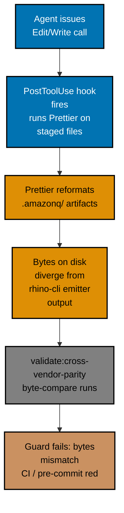

# Post-Mortem: Amazon Q Bindings — Prettier Parity Guard Break

| Field              | Value                                                    |
| ------------------ | -------------------------------------------------------- |
| Incident date      | 2026-05-03                                               |
| Investigation date | 2026-05-03                                               |
| Severity           | Sev-3 — Moderate (parity-guard breakage with workaround) |
| Status             | Resolved                                                 |
| Author             | Maintainer + assisting agent (blameless retrospective)   |

## Summary

On 2026-05-03, the `validate:cross-vendor-parity` byte-equality guard began failing on every `Edit` or `Write` operation touching any file in the repository. The Claude Code post-tool hook ran Prettier over all staged files, which reformatted the emitter-generated `.amazonq/` binding artifacts. Because those files must remain byte-for-byte identical to the output of `rhino-cli agents emit-bindings`, the parity guard's byte-compare rejected them. No production users were affected. The fix — adding emitter-generated paths to `.prettierignore` — was applied the same day and the guard returned to green.

## Impact

- **Services affected**: developer workflow on the local machine; no production deployment was blocked.
- **Duration**: one working session (approximately 2026-05-03 morning WIB) until the root-cause fix was applied.
- **MTTD**: effectively zero — the parity guard surfaced the failure immediately on the first `Edit` after the post-tool hook ran.
- **MTTR**: same session; fix applied within hours of detection.
- **Blast radius**: every `Edit` or `Write` operation in the session triggered a false-positive guard failure, making the parity gate unusable until the session was understood.

## Detection

The parity guard (`validate:cross-vendor-parity`) fired immediately after the first `Edit` call in an affected session. The guard compares the bytes on disk under `.amazonq/` against a fresh `rhino-cli agents emit-bindings` run; the mismatch was flagged as a CI-blocking error. **(Automated Health Check)**

## Timeline

All timestamps are absolute local time (**WIB, UTC+7**).

| Time (WIB UTC+7) | Event                                                                                                                                              |
| ---------------- | -------------------------------------------------------------------------------------------------------------------------------------------------- |
| 2026-05-03 09:00 | Agent session begins; first `Edit` call triggers the Claude Code PostToolUse hook, which runs Prettier over all staged files including `.amazonq/` |
| 2026-05-03 09:01 | Prettier reformats `.amazonq/rules/00-agents-md.md` and related binding artifacts (trailing newline normalization, line-length wrapping)           |
| 2026-05-03 09:02 | `validate:cross-vendor-parity` runs as part of pre-commit / CI check; byte-compare between on-disk `.amazonq/` and fresh emitter output fails      |
| 2026-05-03 09:05 | Investigation begins: parity guard output shows diff between Prettier-formatted bytes and emitter-canonical bytes                                  |
| 2026-05-03 09:30 | Root cause identified: `.prettierignore` does not list `.amazonq/**` or other emitter-generated directories                                        |
| 2026-05-03 09:45 | Fix applied: `.amazonq/**` (and analogous emitter-generated paths) added to `.prettierignore`; Prettier re-run to confirm no reformatting occurs   |
| 2026-05-03 10:00 | `validate:cross-vendor-parity` re-run; byte-compare passes; guard green                                                                            |
| 2026-05-03 10:05 | Pattern documented in repo memory; session continues normally                                                                                      |

## Root Cause

The `.prettierignore` file did not list `.amazonq/**` or any other emitter-generated directory. Prettier treats every file it can reach as hand-authored content and applies formatting normalization (trailing newlines, line-length wrapping, quote style). The `.amazonq/` binding artifacts are **not** hand-authored — they are emitted byte-for-byte by `rhino-cli agents emit-bindings` from the canonical `.claude/agents/` sources. The parity guard's entire purpose is to guarantee that the bytes on disk match the emitter output exactly. Once Prettier rewrote those bytes, the invariant was broken and the guard correctly rejected the session's state.

The root condition was the **absence of an ignore rule** protecting emitter-generated output from a formatter that assumed all files were editable hand-authored content.

## Trigger

The proximate trigger was a **routine `Edit` call** in the agent session. The Claude Code PostToolUse hook is configured to run Prettier over all staged files after every `Edit` or `Write` operation. With `.amazonq/**` absent from `.prettierignore`, the hook formatted the binding artifacts on the first operation that staged any file.

The trigger is distinct from the root cause: an `Edit` call running Prettier is expected, correct behaviour. The fault was the missing ignore rule that left emitter-generated files exposed to that behaviour.

## Contributing Factors

- **No Prettier ignore rule for emitter-generated paths**: `.prettierignore` covered hand-authored files but had no entry for `.amazonq/**` or the category of "files produced by code generation / emitters." The pattern was not established at the time the `.amazonq/` directory was introduced.
- **PostToolUse hook scope**: the hook runs Prettier on all staged files without any allowlist or denylist beyond `.prettierignore`. This is correct behaviour, but it means any emitter-generated path missing from `.prettierignore` is silently at risk.
- **Parity guard found the problem, but only after the fact**: the guard is a strong correctness check, but it fires after the damage is already done (bytes already rewritten). There was no pre-flight warning that `.amazonq/` was about to be modified.
- **Pattern not yet documented**: the general principle — "emitter-generated output files must be excluded from formatters" — was not written down as a convention before this incident. Future maintainers adding new emitter-generated directories had no signal to add an ignore rule.

## Resolution & Mitigations

**Applied fix (this incident)**: Added `.amazonq/**` and analogous emitter-generated paths to `.prettierignore`. Prettier no longer touches these files, so the parity guard's byte invariant is preserved across all `Edit` and `Write` operations.

**Open root-cause fix**: The fix above closes the specific gap for `.amazonq/**`. The broader systemic condition — no documented convention requiring emitter-generated output to be excluded from formatters — is addressed by the action items below.

## Action Items

| #   | Action                                                                                                                                     | Owner      | Priority | Ticket | Status  |
| --- | ------------------------------------------------------------------------------------------------------------------------------------------ | ---------- | -------- | ------ | ------- |
| 1   | Add `.amazonq/**` and all emitter-generated output paths to `.prettierignore`                                                              | Maintainer | P0       | —      | ✅ Done |
| 2   | Add a pre-commit or CI guard that detects when a new emitter-generated directory exists on disk but is absent from `.prettierignore`       | Maintainer | P1       | —      | Open    |
| 3   | Document the emitter-generated exclusion pattern in `AGENTS.md` and the relevant convention so future maintainers know to add ignore rules | Maintainer | P2       | —      | Open    |

> The P0 item carries `—` in the `Ticket` column because it was fixed inline the same day and
> needs no `plans/` promotion. The open P1/P2 items likewise remain `—` (no promotion pending yet);
> promote them to a `plans/` entry if and when they are scheduled. `doc_status` is `closed` because
> every P0 action item is resolved, per the [Post-Mortem Convention](../../../repo-governance/conventions/structure/post-mortems.md).

## What Went Well

- **The parity guard caught the problem immediately.** The `validate:cross-vendor-parity` check fired on the first affected operation, surfacing the failure before any commit reached the repository. The guard fulfilled its design intent.
- **The fix was contained and low-risk.** Adding entries to `.prettierignore` is a non-destructive, easily reversible change with no side effects on other files.
- **No production impact.** The parity guard prevented a broken state from propagating; the entire incident was contained to one local developer session.

### Where We Got Lucky

- **The emitter output was not committed in the broken state.** Had the guard been absent or bypassed, the reformatted `.amazonq/` bytes would have been committed, silently breaking the invariant for every future parity check.
- **The Prettier changes were cosmetic.** Trailing newlines and line-length wrapping do not alter the semantic meaning of the binding files. A more aggressive formatter transformation (e.g., reordering YAML keys) could have produced subtler breakage.

## Lessons Learned

- **Emitter-generated output files must be excluded from formatters.** Any file produced by a code generation or emitter tool — where byte-for-byte idempotency is a correctness requirement — must be listed in `.prettierignore` (and analogous ignore files for other formatters) at the time the directory is introduced.
- **Parity guards are necessary but not sufficient.** They detect byte drift after it occurs; they do not prevent the formatter from running in the first place. An upstream ignore rule is the defense-in-depth layer that prevents the situation from arising.
- **Conventions need to precede patterns, not follow incidents.** The lack of a documented rule for emitter-generated exclusions meant the gap was invisible until it bit. Establishing the pattern explicitly — and checking for it during code review — would have prevented this entirely.
- **The PostToolUse hook is a sharp tool.** Running Prettier automatically after every `Edit` is a valuable productivity feature, but it silently reaches files the maintainer may not intend to reformat. Review `.prettierignore` whenever adding new auto-generated or emitter-produced directories to the repository.

## References

- [Post-Mortem Convention](../../../repo-governance/conventions/structure/post-mortems.md) — authoritative rules governing this document
- [No Secrets in Git](../../../repo-governance/conventions/security/no-secrets-in-committed-files.md) — hard iron rule; this incident has no secrets, but the rule applies to all post-mortems
- `.prettierignore` — root-level Prettier ignore file where the fix was applied
- `validate:cross-vendor-parity` Nx target — the parity guard that detected the byte drift (defined in `nx.json` / project config)
- [Multi-Harness Binding Convention](../../../repo-governance/conventions/structure/multi-harness-binding.md) — defines the cross-vendor parity guard and the emitter-generated bindings (`.amazonq/`) involved in this incident
