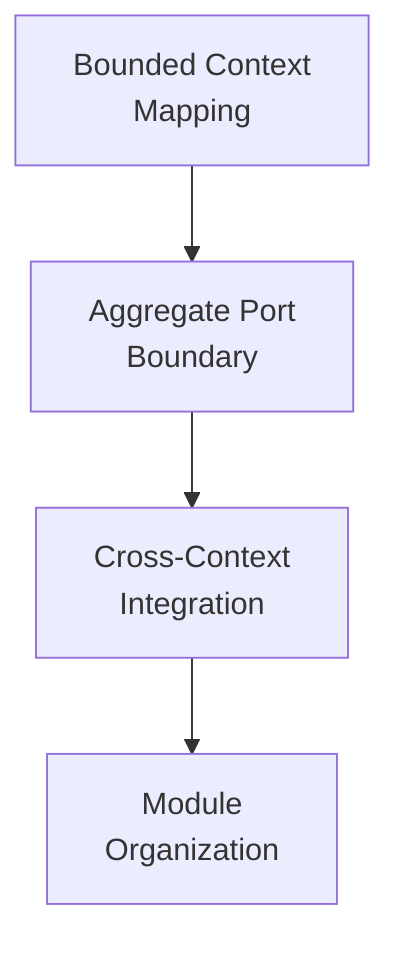

# DDD + Hexagonal in Practice

This is the bridge between a product's domain model and the code structure that protects it. Use it when a business boundary needs to become a bounded context, port, adapter, or integration contract in `organiclever-be` and future OSE Platform services.

## Before You Start

This directory applies DDD and Hexagonal Architecture; it does not teach either from scratch. Use these learning resources if those terms are new to you:

- **DDD fundamentals** — [Domain-Driven Design Learning Path](../../../../../apps/ayokoding-www/content/en/learn/legacy/software-engineering/software-architecture/domain-driven-design-ddd/)
- **Hexagonal fundamentals** — [Hexagonal Architecture Overview](../../../../../apps/ayokoding-www/content/en/learn/legacy/software-engineering/software-architecture/hexagonal-architecture/overview.md)
- **DDD + Hexagonal in Production** — [Cases](../../../../../apps/ayokoding-www/content/en/learn/legacy/software-engineering/software-architecture/by-example/cases/overview.md) (In FP and In OOP cases)

This directory is **OSE Platform-specific conventions** — not educational tutorials. The ayokoding-www tutorials above supply the conceptual foundation.

**See also**: [DDD Standards](../domain-driven-design-ddd/README.md), [Hexagonal Architecture Standards](../hexagonal-architecture/README.md) — the two sibling convention sets that this directory integrates.

## What This Directory Covers

DDD and Hexagonal Architecture are complementary but address different concerns. DDD provides the _what_ — how to carve business domains into bounded contexts, aggregates, and events. Hexagonal Architecture provides the _where_ — how to structure code so that domain logic never depends on infrastructure. This directory defines how OSE Platform combines them.

| DDD Concern                | Hexagonal Concern         | Integration Standard                                                                                                                     |
| -------------------------- | ------------------------- | ---------------------------------------------------------------------------------------------------------------------------------------- |
| Bounded context boundary   | Hexagon boundary          | [Bounded Context Mapping Standards](./bounded-context-mapping-standards.md) — one-context-one-hexagon rule and context map translation   |
| Aggregate and repository   | Domain core + output port | [Aggregate Port Boundary Standards](./aggregate-port-boundary-standards.md) — aggregate operations mapped to input and output ports      |
| Context map relationships  | Cross-hexagon wiring      | [Cross-Context Integration Standards](./cross-context-integration-standards.md) — domain events, ACLs, Open Host Services, saga patterns |
| Ubiquitous language naming | Package and module naming | [Module Organization Standards](./module-organization-standards.md) — package naming and module hierarchy conventions                    |

## OrganicLever Domain

This directory uses an **OrganicLever** Sharia-compliant Procure-to-Pay model as its canonical
architecture example. The example is independent of OSE portfolio priorities and does not describe
the implemented OrganicLever productivity product.

| Bounded Context | Nx App            | Primary Stack | Aggregate Roots                        |
| --------------- | ----------------- | ------------- | -------------------------------------- |
| Purchasing      | `organiclever-be` | F#/Giraffe    | `PurchaseRequisition`, `PurchaseOrder` |
| Supplier        | `organiclever-be` | F#/Giraffe    | `Supplier`                             |
| Receiving       | `organiclever-be` | F#/Giraffe    | `GoodsReceiptNote`                     |
| Invoicing       | `organiclever-be` | F#/Giraffe    | `Invoice`                              |
| Payments        | `organiclever-be` | F#/Giraffe    | `Payment`                              |

The F#/Giraffe backend (`organiclever-be`) hosts the composition root and HTTP adapter while domain and port definitions remain language-agnostic by design. These same bounded contexts appear in the ayokoding-www cases using the name `procurement-platform-be`.

## Convention Standards

### 1. [Bounded Context Mapping Standards](./bounded-context-mapping-standards.md) — how DDD bounded contexts map onto hexagonal port/adapter structure

How DDD bounded contexts map onto hexagonal port/adapter structure. Covers the one-context-one-hexagon rule, context map pattern translation into port design, and the OrganicLever context boundary catalog.

### 2. [Aggregate Port Boundary Standards](./aggregate-port-boundary-standards.md) — how DDD aggregates align with hexagonal port/adapter boundaries

How DDD aggregates align with hexagonal port/adapter boundaries. Defines which aggregate operations become input ports, which persistence needs become output ports, and how aggregate invariants are protected across the port boundary.

### 3. [Cross-Context Integration Standards](./cross-context-integration-standards.md) — how bounded contexts communicate using domain events, ACLs, and saga patterns

How bounded contexts communicate using domain events, Anti-Corruption Layers, Open Host Services, and saga patterns. Defines event envelope conventions, ACL adapter placement, and OrganicLever cross-context wiring.

### 4. [Module Organization Standards](./module-organization-standards.md) — Java/Spring Boot package structure and F# module hierarchy for combined DDD+Hexagonal projects

Java/Spring Boot package structure and F# module hierarchy for combined DDD+Hexagonal projects. Covers package naming, layer ordering, ubiquitous language encoding in package names, and the OrganicLever module catalog.

## How These Standards Relate

The standards form a dependency chain. Read them in order for first-time orientation:

Practitioners working on a specific concern can jump directly to the relevant standard. Each standard cross-references the others where needed.

## Rationale

Maintaining separate documentation for DDD and Hexagonal Architecture risks gaps at their intersection — the integration decisions that most commonly cause implementation confusion. This directory closes that gap by codifying how OSE Platform resolves the tension between DDD's context-centric view and Hexagonal Architecture's port-centric view.

**See**: [Cases](../../../../../apps/ayokoding-www/content/en/learn/legacy/software-engineering/software-architecture/by-example/cases/overview.md) for the educational counterpart with worked production examples.

## Related Documentation

- **[DDD Standards](../domain-driven-design-ddd/README.md)** — Aggregate, value object, domain event, and bounded context standards
- **[Hexagonal Architecture Standards](../hexagonal-architecture/README.md)** — Port, adapter, composition root, and testing standards
- **[C4 Architecture Model](../c4-architecture-model/README.md)** — Visual representation of hexagonal layers and bounded context containers
- **[FSM Standards](../finite-state-machine-fsm/README.md)** — Entity lifecycle state machines living inside the domain core
- **[Architecture Index](../README.md)** — All architecture pattern documentation
- **[Cases — In FP](../../../../../apps/ayokoding-www/content/en/learn/legacy/software-engineering/software-architecture/by-example/cases/in-fp/overview.md)** — Production F#/Giraffe case
- **[Cases — In OOP](../../../../../apps/ayokoding-www/content/en/learn/legacy/software-engineering/software-architecture/by-example/cases/in-oop/overview.md)** — Production Java/Spring Boot case
