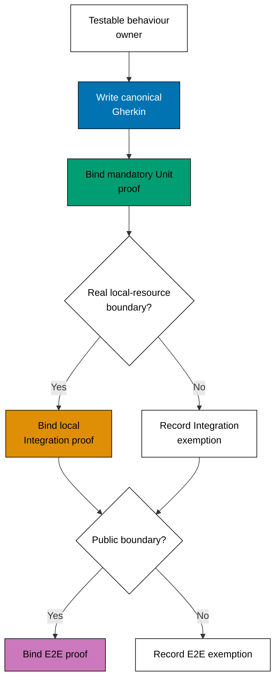
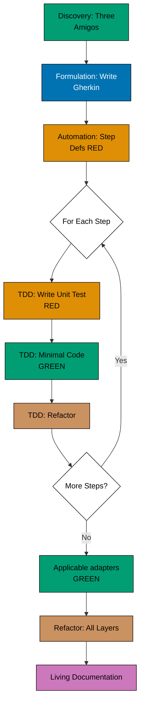

# Software Development Practices

Good delivery starts by making the desired outcome testable. This guide helps product partners and early-career engineers see where shared examples (BDD) and technical tests (TDD) fit together.

## Overview

Writing tests after code can make intent hard to recover, while product context can get lost between a conversation and a change. Test-first practices keep both visible:

1. **Test-Driven Development (TDD)** - Write tests first, then implement code to pass those tests
2. **Behaviour-Driven Development (BDD)** - Specify behaviour through examples in collaboration with domain experts

Both practices emphasize writing tests before implementation. In OSE, every testable application,
library, and executable tool uses BDD to state observable behaviour in canonical Gherkin, while TDD
drives the mandatory Unit implementation and each applicable higher-layer adapter. The normative
contract is the [canonical BDD standard](../../../../repo-governance/development/behaviour-driven-development.md).

## Quick Decision: How BDD and TDD Combine

**Decision Matrix**:

| Your Situation                          | Required Approach | Start With                                                                                                                                                            |
| --------------------------------------- | ----------------- | --------------------------------------------------------------------------------------------------------------------------------------------------------------------- |
| Complex business rules + domain experts | BDD + TDD         | [BDD Three Amigos](./behaviour-driven-development-bdd/README.md) — OSE Platform BDD guidance for Gherkin scenarios and Three Amigos collaboration                     |
| Technical library or framework          | BDD + TDD         | State observable API behaviour in Gherkin, then use [TDD Red-Green-Refactor](./test-driven-development-tdd/README.md) — OSE TDD standards for its Unit implementation |
| API with business logic                 | BDD + TDD         | Specify the public contract, then use [Outside-In TDD](./test-driven-development-tdd/README.md) — OSE TDD standards for the inner loop                                |
| Pure functions and algorithms           | BDD + TDD         | State input/output behaviour in Gherkin, then use [TDD and FP](./test-driven-development-tdd/README.md) — OSE TDD standards for pure Unit implementation              |
| Legacy code without tests               | BDD + TDD         | Capture current observable behaviour in Gherkin and Unit characterization tests before changing it                                                                    |
| New feature with acceptance criteria    | BDD + TDD         | [BDD Gherkin Scenarios](./behaviour-driven-development-bdd/README.md) — OSE guidance for applying canonical Gherkin and adapters                                      |

## Documentation Structure

### 🧪 [Test-Driven Development (TDD)](./test-driven-development-tdd/README.md) — Red-Green-Refactor cycle, testing frameworks, and domain-driven testing

**Red-Green-Refactor cycle for building reliable software**

Test-Driven Development is a software development approach where tests are written before production code. The practice follows a simple cycle: write a failing test (Red), make it pass with minimal code (Green), then improve the design (Refactor).

**OSE Platform Standards:**

- [Test-Driven Development (TDD)](./test-driven-development-tdd/README.md) — OSE Platform TDD standards for Red-Green-Refactor cycle, testing frameworks, and domain-driven testing
- [TDD Cycle Standards](test-driven-development-tdd/tdd-cycle-standards.md) - Red-Green-Refactor requirements
- [Testing Standards](test-driven-development-tdd/testing-standards.md) - FIRST principles, AAA pattern
- [Test Doubles Standards](test-driven-development-tdd/test-doubles-standards.md) - When to use mocks, stubs, fakes
- [Integration Testing Standards](test-driven-development-tdd/integration-testing-standards.md) - Real isolated local resources with no external network
- [TDD with DDD Standards](test-driven-development-tdd/tdd-with-ddd-standards.md) - Testing aggregates and domain models

**Use TDD when you want to:**

- Build reliable software with high test coverage
- Design APIs and interfaces from the consumer's perspective
- Create a safety net for refactoring
- Document expected behaviour through executable examples
- Practice disciplined, incremental development

### 🎭 [Behaviour-Driven Development (BDD)](./behaviour-driven-development-bdd/README.md) — Gherkin scenarios, Three Amigos collaboration, and acceptance testing

**Specification by example using Gherkin scenarios**

Behaviour-Driven Development extends TDD by focusing on behaviour specification through concrete examples written in natural language. BDD emphasizes collaboration between developers, QA, and business stakeholders using a shared vocabulary (Gherkin syntax with Given-When-Then).

**OSE Platform Standards:**

- [Behaviour-Driven Development (BDD)](./behaviour-driven-development-bdd/README.md) — OSE Platform guidance for applying the canonical Gherkin, adapter, and semantic-review contract
- [Gherkin Standards](behaviour-driven-development-bdd/gherkin-standards.md) - Feature file structure, Given-When-Then requirements
- [Scenario Standards](behaviour-driven-development-bdd/scenario-standards.md) - Scenario independence, naming conventions
- [Three Amigos Standards](behaviour-driven-development-bdd/three-amigos-standards.md) - Collaborative discovery requirements
- [Living Documentation Standards](behaviour-driven-development-bdd/living-documentation-standards.md) - CI/CD integration requirements
- [BDD with DDD Standards](behaviour-driven-development-bdd/bdd-with-ddd-standards.md) - Ubiquitous language in scenarios

**Use BDD for every testable behaviour owner. Collaborative discovery is especially valuable when you have:**

- Complex business rules requiring stakeholder collaboration
- Need for living documentation that stays synchronized with code
- Cross-functional teams (developers, QA, business analysts, domain experts)
- Requirements that benefit from concrete examples
- Acceptance criteria that must be testable and unambiguous

## How TDD and BDD Work Together

TDD and BDD complement each other throughout the development process:

| Aspect             | TDD                          | BDD                                       |
| ------------------ | ---------------------------- | ----------------------------------------- |
| **Focus**          | Technical correctness        | Business behaviour                        |
| **Level**          | Unit and applicable adapters | Observable scenarios across project roles |
| **Language**       | Programming language         | Natural language (Gherkin)                |
| **Audience**       | Developers                   | Developers + Business + QA                |
| **When to Write**  | Before implementation        | During requirements discovery             |
| **Test Structure** | Arrange-Act-Assert           | Given-When-Then                           |
| **Granularity**    | Fine-grained (functions)     | Coarse-grained (user scenarios)           |
| **Feedback Loop**  | Seconds to minutes           | Minutes to hours                          |
| **Documentation**  | Code as documentation        | Executable specifications                 |
| **Refactoring**    | Enables safe refactoring     | Validates behaviour remains unchanged     |

**Example workflow (Outside-In TDD with BDD):**

1. **Discovery** - Hold Three Amigos session to explore feature with business, dev, QA
2. **Formulation** - Write BDD scenarios in Gherkin (Given-When-Then)
3. **Automation (Outer)** - Write step definitions that call application code (RED - fails)
4. **TDD Inner Loop** - For each step:
   - Write unit test (RED)
   - Implement minimal code (GREEN)
   - Refactor (REFACTOR)
   - Repeat until step passes
5. **Applicable adapters** - Run zero-network Integration and public-boundary E2E proof where the scenario can be expressed
6. **Refactor** - Improve design across all layers
7. **Living Documentation** - BDD scenarios serve as up-to-date specification

**Legend**: 🟢 Teal = Passing tests (GREEN) | 🟠 Orange = Failing tests (RED) | 🟤 Brown = Refactoring

See [TDD Standards](test-driven-development-tdd/README.md) — OSE TDD standards; and
[BDD Guidance](behaviour-driven-development-bdd/README.md) — OSE guidance for applying canonical
Gherkin and adapters.

## Applying Standards by Role

### For Developers

**Prerequisites**: Complete [AyoKoding TDD](../../../../apps/ayokoding-www/content/en/learn/legacy/software-engineering/development/test-driven-development-tdd/) and [AyoKoding BDD](../../../../apps/ayokoding-www/content/en/learn/legacy/software-engineering/development/behavior-driven-development-bdd/) learning paths first.

1. **TDD Workflow** - Follow [TDD Cycle Standards](test-driven-development-tdd/tdd-cycle-standards.md) for Red-Green-Refactor
2. **Testing Standards** - Apply [Testing Standards](test-driven-development-tdd/testing-standards.md) for FIRST principles
3. **Domain Testing** - Follow [TDD with DDD Standards](test-driven-development-tdd/tdd-with-ddd-standards.md) for aggregates
4. **Integration Tests** - Use [Integration Testing Standards](test-driven-development-tdd/integration-testing-standards.md) for real isolated local resources with no external network

### For Teams Adopting BDD

**Prerequisites**: Complete [AyoKoding BDD](../../../../apps/ayokoding-www/content/en/learn/legacy/software-engineering/development/behavior-driven-development-bdd/) learning path first.

1. **Collaboration** - Follow [Three Amigos Standards](behaviour-driven-development-bdd/three-amigos-standards.md) for discovery sessions
2. **Gherkin Writing** - Apply [Gherkin Standards](behaviour-driven-development-bdd/gherkin-standards.md) for feature files
3. **Scenario Design** - Follow [Scenario Standards](behaviour-driven-development-bdd/scenario-standards.md) for independence
4. **Domain Integration** - Use [BDD with DDD Standards](behaviour-driven-development-bdd/bdd-with-ddd-standards.md) for ubiquitous language

### For Architects and Technical Leads

**Prerequisites**: Complete [AyoKoding TDD](../../../../apps/ayokoding-www/content/en/learn/legacy/software-engineering/development/test-driven-development-tdd/) and [AyoKoding BDD](../../../../apps/ayokoding-www/content/en/learn/legacy/software-engineering/development/behavior-driven-development-bdd/) learning paths first.

1. **Review Complete Standards** - Read [TDD Standards](test-driven-development-tdd/README.md) — OSE TDD standards; and [BDD Guidance](behaviour-driven-development-bdd/README.md) — OSE guidance for applying canonical Gherkin and adapters
2. **Architecture Integration** - Follow [TDD with DDD Standards](test-driven-development-tdd/tdd-with-ddd-standards.md)
3. **Testing Strategy** - Use decision matrices above to guide team approach
4. **Living Documentation** - Implement [Living Documentation Standards](behaviour-driven-development-bdd/living-documentation-standards.md)

### For QA Engineers and Business Analysts

**Prerequisites**: Complete [AyoKoding BDD](../../../../apps/ayokoding-www/content/en/learn/legacy/software-engineering/development/behavior-driven-development-bdd/) learning path first.

1. **Collaboration Standards** - Follow [Three Amigos Standards](behaviour-driven-development-bdd/three-amigos-standards.md)
2. **Gherkin Writing** - Apply [Gherkin Standards](behaviour-driven-development-bdd/gherkin-standards.md)
3. **Scenario Design** - Follow [Scenario Standards](behaviour-driven-development-bdd/scenario-standards.md)
4. **Living Documentation** - Maintain [Living Documentation Standards](behaviour-driven-development-bdd/living-documentation-standards.md)

## Practices in This Repository

The open-sharia-enterprise project applies both TDD and BDD:

**TDD Application:**

- Unit tests for all domain logic (Aggregates, Value Objects, Entities)
- Test-first development for pure functions
- Property-based testing for functional code
- Characterization tests for legacy code integration

**BDD Application:**

- Canonical Gherkin scenarios under each owner's recursive `specs/apps/**/behaviours/` or
  `specs/libs/**/behaviours/` corpus, including technical libraries and executable tools
- Ubiquitous Language from DDD used in feature files
- Three Amigos sessions with domain experts for compliance features
- Mandatory Unit bindings, applicable higher-layer adapters, and living documentation synchronized
  with Nx `test:coverage` and `test:quick`

**Complementary Practices:**

- [Domain-Driven Design](../architecture/domain-driven-design-ddd/README.md) - TDD/BDD test domain models
- [C4 Architecture Model](../architecture/c4-architecture-model/README.md) - Document tested components
- [Functional Programming](../../../../repo-governance/development/pattern/functional-programming.md) - Pure functions enable easier testing

## Related Documentation

- **[Software Design Index](../README.md)** - Parent software design documentation
- **[Architecture](../architecture/README.md)** - C4 and DDD documentation
- **[Explanation Documentation Index](../../README.md)** - All conceptual documentation
- **[Functional Programming Principles](../../../../repo-governance/development/pattern/functional-programming.md)** - FP practices in this repository
- **[Implementation Workflow](../../../../repo-governance/development/workflow/implementation.md)** - TDD in development process
- **[Code Quality Standards](../../../../repo-governance/development/quality/code.md)** - Testing requirements
