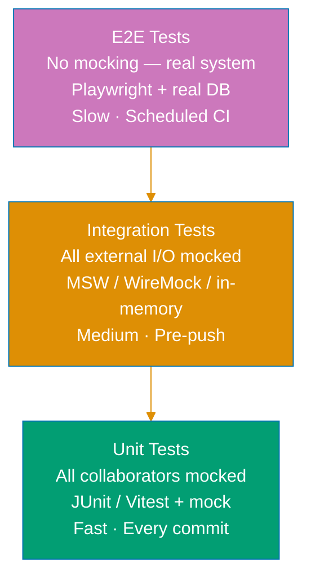

# Three-Tier Testing Model

## The Mocking Boundary — The Most Important Rule

**Unit and integration tests MUST mock all external I/O. E2E tests MUST NOT mock anything.**

```
Unit        → mock everything external
Integration → mock everything external
E2E         → mock nothing
```

This single rule defines the boundary between tiers. Every other property of each tier follows from it.

## The Three Tiers

### Unit Tests

**What they are**: Tests that verify one class or function in complete isolation from all collaborators.

**Scope**: Single class, function, or module. No integration with other real components.

**Mocking rule**: All collaborators mocked. Repositories replaced with in-memory fakes or mocks.
HTTP clients stubbed. File system mocked. Clock frozen. No real network. No real DB.

**Speed**: Milliseconds per test. Hundreds run in seconds.

**When to use**:

- Domain logic (value objects, aggregates, domain services)
- Pure functions and calculations (Zakat rate, tax, profit margin)
- Input validation and error handling
- Business rule enforcement

**What they prove**: The logic of a unit is correct given controlled inputs.

**Java tools**: JUnit 6 Jupiter + Mockito + AssertJ

**TypeScript tools**: Vitest + `vi.fn()` / `vi.mock()` + Testing Library

---

### Integration Tests

**What they are**: Tests that verify multiple internal layers working together — routing, use cases,
services, and repositories — while keeping all external I/O mocked.

**Scope**: A feature flow end-to-end within the application boundary. The full internal stack is
real (routing, middleware, use cases, services), but external dependencies (DB, external HTTP
services, email, payment gateways) are replaced with mocks or in-memory implementations.

**Mocking rule**: Same as unit tests — no real network, no real DB. Differences from unit:
in-memory repository implementations (instead of mocks) are preferred because they behave more
realistically. HTTP calls to external services are intercepted by MSW (TypeScript) or WireMock
(Java).

**Speed**: Seconds per test. Dozens run in under a minute.

**When to use**:

- BDD Gherkin scenarios (user-facing feature flows through the system)
- Testing that routing, middleware, authentication, and business logic wire together correctly
- Testing response shapes and status codes of internal API routes
- Multi-step workflows involving several internal services

**What they prove**: The internal layers are correctly wired and behave as specified — without
depending on external infrastructure.

**Java tools**: JUnit 6 + Cucumber JVM + MockMvc (in-process HTTP) + WireMock + in-memory
repository implementations

**TypeScript tools**: Vitest + `@amiceli/vitest-cucumber` + MSW (Mock Service Worker) + in-memory
state + Testing Library

---

### E2E Tests

**What they are**: Tests that exercise the complete deployed system — real network, real database,
real browser (if applicable) — with no mocking of any kind.

**Scope**: The full system from the user's point of view. Clicks a button → HTTP request →
real server → real DB → real response → UI updates.

**Mocking rule**: **Zero mocking.** No MSW. No WireMock. No in-memory implementations. Every
layer is real.

**Speed**: Seconds to minutes per test. Run in scheduled CI pipelines, not on every commit.

**When to use**:

- Critical user journeys (login, member creation, payment)
- Deployment smoke tests
- BDD acceptance scenarios that validate the live system
- Cross-service flows that only manifest with real infrastructure

**What they prove**: The system as deployed works correctly for real users.

**Java tools**: Playwright (TypeScript) + Testcontainers (real PostgreSQL) for backend REST API
E2E testing

**TypeScript tools**: Playwright + `playwright-bdd` (Gherkin-driven browser automation, no mocking)

---

## Tier Comparison

| Property        | Unit                    | Integration                                 | E2E                         |
| --------------- | ----------------------- | ------------------------------------------- | --------------------------- |
| Scope           | 1 class/function        | Internal layers                             | Full system                 |
| External I/O    | Mocked                  | Mocked                                      | Real                        |
| DB              | Mocked / in-memory impl | In-memory impl                              | Real (Testcontainers)       |
| HTTP (outbound) | Mocked                  | MSW / WireMock                              | Real                        |
| Browser         | N/A                     | N/A                                         | Real (Playwright)           |
| Speed           | ms                      | seconds                                     | minutes                     |
| Run frequency   | Every commit            | Pre-push                                    | Scheduled CI                |
| Java tools      | JUnit 6 + Mockito       | JUnit 6 + Cucumber JVM + MockMvc + WireMock | Playwright + Testcontainers |
| TS tools        | Vitest + vi.fn          | Vitest + vitest-cucumber + MSW              | Playwright + playwright-bdd |

## Test Pyramid



## File Naming and Directory Structure

**REQUIRED** structure across all project types:

```
src/
  test/
    unit/               # Fast isolated tests (co-located with source is also acceptable for TS)
    integration/        # Mocked-infrastructure feature flows
  components/
    Foo.unit.test.tsx   # TypeScript: unit tests may be co-located with source
```

**REQUIRED** naming conventions:

| Tier        | Java                             | TypeScript                         |
| ----------- | -------------------------------- | ---------------------------------- |
| Unit        | `ZakatCalculatorTest.java`       | `ZakatCalculator.unit.test.ts`     |
| Integration | `MemberListIntegrationTest.java` | `member-list.integration.test.tsx` |
| E2E         | `*.feature` + step definitions   | `*.feature` + step definitions     |

## Common Mistakes

### Calling real APIs in integration tests

```typescript
// WRONG — real HTTP call in integration test
it("should load member list", async () => {
  const response = await fetch("https://api.example.com/members"); // ❌ real network
});

// CORRECT — MSW intercepts the call
server.use(
  http.get("/api/members", () => HttpResponse.json(MOCK_MEMBERS)),
);
it("should load member list", async () => {
  render(<MemberList />);
  expect(await screen.findByText("Alice")).toBeInTheDocument(); // ✅ MSW-mocked
});
```

### Using Testcontainers in integration tests

```java
// WRONG — Testcontainers = real DB = belongs in E2E
@Testcontainers
class MemberRepositoryIntegrationTest { // ❌ this is E2E-level, not integration-level
    @Container
    static PostgreSQLContainer<?> postgres = new PostgreSQLContainer<>("postgres:16");
}

// CORRECT — in-memory repository for integration tests
class MemberRepositoryIntegrationTest {
    private MemberRepository repository = new InMemoryMemberRepository(); // ✅
}
```

### Mocking in E2E tests

```typescript
// WRONG — mocking in E2E defeats the purpose
test("user can log in", async ({ page }) => {
  await page.route("**/api/auth", (route) => route.fulfill({ body: JSON.stringify({ token: "fake" }) })); // ❌
});

// CORRECT — let the real system handle it
test("user can log in", async ({ page }) => {
  await page.goto("/login");
  await page.fill("[name=email]", "user@example.com");
  await page.click("button[type=submit]"); // ✅ real HTTP, real auth
});
```

## Related Standards

- [Testing Standards](./testing-standards.md) — FIRST principles, AAA pattern, test naming
- [Integration Testing Standards](./integration-testing-standards.md) — in-memory repos, MSW, WireMock patterns
- [Test Doubles Standards](./test-doubles-standards.md) — mocks, stubs, in-memory implementations
- [Java Testing Standards](../../programming-languages/java/testing-standards.md) — Java-specific tools and patterns
- [TypeScript Testing](../../programming-languages/typescript/testing.md) — TypeScript-specific tools and patterns
