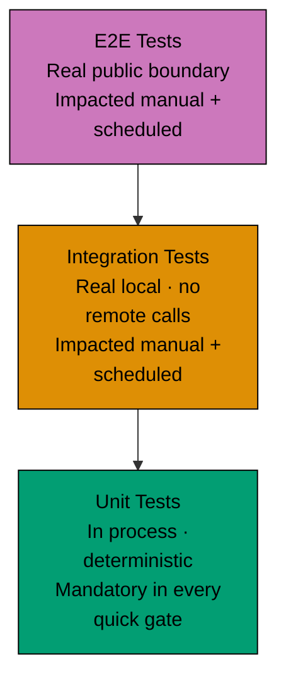

# Three-Level Testing Model

## The Boundary Contract — The Most Important Rule

Classify a test by the real boundary it crosses, not by its framework or size.

```
Unit        → in-process production behaviour; no real OS, network, clock, or randomness
Integration → at least one real isolated same-machine resource; zero external network
E2E         → real public browser, HTTP/API, or process boundary; isolated synthetic data
```

Unit is mandatory for every active Gherkin scenario. Integration and E2E apply only when the owner
has their real boundary; a genuine mismatch requires an independently documented scenario-level
exemption and alternative proof.

## The Three Tiers

### Unit Tests

**What they are**: Tests that invoke production behaviour entirely in process through deterministic
inputs, injected ports, and in-memory collaborators.

**Scope**: One behaviour path. It may compose multiple in-process modules; physical class count does
not define the layer.

**Boundary rule**: No real filesystem, process environment, child process, standard stream, network,
database service, live clock, or uncontrolled randomness. Inject or freeze each such dependency. A
shell script or harness plugin subject that the Unit runner cannot load in process follows
[Script-Subject Unit Proof](../../../../../repo-governance/development/behaviour-driven-development/script-subject-unit-proof.md) instead: it runs directly with every collaborator faked.

**Speed**: Milliseconds per test. Hundreds run in seconds.

**When to use**:

- Domain logic (value objects, aggregates, domain services)
- Pure functions and calculations (Zakat rate, tax, profit margin)
- Input validation and error handling
- Business rule enforcement

**What they prove**: The logic of a unit is correct given controlled inputs.

**Rust tools**: Built-in `#[test]` / `#[tokio::test]` + `mockall` crate + `assert_eq!` / `assert!`

**TypeScript tools**: Vitest + `vi.fn()` / `vi.mock()` + Testing Library

---

### Integration Tests

**What they are**: Tests that invoke production code against at least one real, isolated resource
owned on the same machine.

**Scope**: Real temporary files, environment state, child processes, standard streams, or an
embedded/local database reached without a socket. Setup and cleanup use unique synthetic resources.

**Boundary rule**: No external network and no service the test did not start. A loopback socket the
test starts and stops is Integration when `repo-config.yml` allowlists the project. MSW, WireMock,
mockito, and in-memory repositories are Unit doubles, not Integration proof.

**Speed**: Seconds per test. Dozens run in under a minute.

**When to use**:

- Filesystem persistence, environment loading, caches, and generated artifacts
- Child-process/stdin/stdout adapters whose subject is not the product's public process boundary
- Embedded databases, local stores, or a loopback server the test starts and stops itself
- Composition against real same-machine resources that Unit replaces with ports

**What they prove**: Production adapters behave against their real local resource without external
network or shared infrastructure.

**Rust tools**: Built-in test runner plus temporary filesystem/process/embedded-store fixtures

**TypeScript tools**: Vitest plus Node temporary filesystem/process/embedded-store fixtures

---

### E2E Tests

**What they are**: Tests that invoke the product through its real public browser, HTTP/API, or
published process boundary.

**Scope**: The observable system from the caller's point of view. Internal dependencies may use an
isolated test deployment, but the public boundary and result under assertion are real.

**Boundary rule**: Do not replace the public subject with route interception, a fake process, or a
direct internal call. Use synthetic identities/data only and fail closed rather than falling back to
developer, staging, or production state.

**Speed**: Seconds to minutes per test. Run in scheduled CI pipelines, not on every commit.

**When to use**:

- Critical user journeys (login, member creation, payment)
- Deployment smoke tests
- BDD acceptance scenarios that validate the live system
- Cross-service flows that only manifest with real infrastructure

**What they prove**: The system as deployed works correctly for real users.

**Rust tools**: Playwright (TypeScript) + real PostgreSQL via Docker for backend REST API E2E
testing

**TypeScript tools**: Playwright + `playwright-bdd` (Gherkin-driven browser automation, no mocking)

---

## Tier Comparison

| Property      | Unit                          | Integration                             | E2E                                  |
| ------------- | ----------------------------- | --------------------------------------- | ------------------------------------ |
| Boundary      | In-process behaviour          | Real isolated local resource            | Real public browser/API/process      |
| Files/env     | Injected or in-memory         | Real and isolated                       | Through public subject as applicable |
| Network       | None                          | Owned loopback when allowlisted         | Allowed when it is the public path   |
| Clock/random  | Fixed/injected                | Controlled and restored                 | Isolated test identity/data          |
| Applicability | Mandatory for every scenario  | Only for a genuine local boundary       | Only for a genuine public boundary   |
| Execution     | Every `test:quick`            | Manual impacted; scheduled complete     | Manual impacted; scheduled complete  |
| Typical tools | Native runner + injected port | Native runner + temp/embedded resources | Playwright, HTTP client, public CLI  |

## Test Pyramid


```mermaid
flowchart TD
    accTitle: Test Pyramid
    accDescr: E2E Tests Real public boundary Impacted manual + scheduled leads to Integration Tests Real local · no remote calls Impacted manual + scheduled; and 1 more links.
    E2E["E2E Tests<br/>Real public boundary<br/>Impacted manual +<br/>scheduled"]
    INT["Integration Tests<br/>Real local · no<br/>remote calls<br/>Impacted manual +<br/>scheduled"]
    UNIT["Unit Tests<br/>In process ·<br/>deterministic<br/>Mandatory in every<br/>quick gate"]

    E2E --> INT
    INT --> UNIT

    classDef purple fill:#CC78BC,stroke:#000000,color:#000000
    classDef orange fill:#DE8F05,stroke:#000000,color:#000000
    classDef teal fill:#029E73,stroke:#000000,color:#000000
    class E2E purple
    class INT orange
    class UNIT teal
    classDef default fill:#0173B2,stroke:#000000,color:#FFFFFF
```

## File Naming and Directory Structure

**REQUIRED** structure across all project types:

```
src/
  test/
    unit/               # Fast isolated tests (co-located with source is also acceptable for TS)
    integration/        # Real isolated local resources; no external network
  components/
    Foo.unit.test.tsx   # TypeScript: unit tests may be co-located with source
```

**REQUIRED** naming conventions:

| Tier        | Rust                              | TypeScript                         |
| ----------- | --------------------------------- | ---------------------------------- |
| Unit        | `zakat_calculator_test.rs`        | `ZakatCalculator.unit.test.ts`     |
| Integration | `member_list_integration_test.rs` | `member-list.integration.test.tsx` |
| E2E         | `*.feature` + step definitions    | `*.feature` + step definitions     |

## Common Mistakes

### Calling real APIs in integration tests

```typescript
// WRONG — real HTTP call in integration test
it("should load member list", async () => {
  const response = await fetch("https://api.example.com/members"); // ❌ real network
});

// CORRECT — public HTTP behaviour belongs to E2E
test("should load member list", async ({ request }) => {
  const response = await request.get("/api/members");
  expect(response.ok()).toBe(true); // ✅ real public API boundary
});
```

### Using networked databases in integration tests

```rust
// WRONG — PostgreSQL uses a network transport, even on the same machine
#[sqlx::test]
async fn member_repository_integration_test(pool: PgPool) { // ❌ real DB = E2E tier
    // …
}

// CORRECT — a real isolated embedded database file reaches no external network
#[test]
fn member_repository_integration_test() {
    let temp_dir = tempfile::tempdir().expect("isolated database directory");
    let connection = rusqlite::Connection::open(temp_dir.path().join("members.sqlite"))
        .expect("open isolated SQLite file");
    let repository = SqliteMemberRepository::new(connection); // ✅ real local resource
    // Exercise and assert repository persistence, then let temp_dir clean up.
}
```

An in-memory repository is a Unit double. A networked database can support E2E only when the test
observes the product through its real public HTTP or process boundary; direct database access does
not become E2E merely because networking is enabled.

### Mocking in E2E tests

```typescript
// WRONG — replacing the public subject defeats E2E proof
test("user can log in", async ({ page }) => {
  await page.route("**/api/auth", (route) => route.fulfill({ body: JSON.stringify({ token: "fake" }) })); // ❌
});

// CORRECT — invoke the real public boundary with synthetic test identity/data
test("user can log in", async ({ page }) => {
  await page.goto("/login");
  await page.fill("[name=email]", "user@example.com");
  await page.click("button[type=submit]"); // ✅ real HTTP, real auth
});
```

## Related Standards

- [Testing Standards](./testing-standards.md) — FIRST principles, AAA pattern, test naming
- [Integration Testing Standards](./integration-testing-standards.md) — real isolated local resources and zero-network rules
- [Test Doubles Standards](./test-doubles-standards.md) — mocks, stubs, in-memory implementations
- [TypeScript Testing](../../programming-languages/typescript/testing.md) — TypeScript-specific tools and patterns
