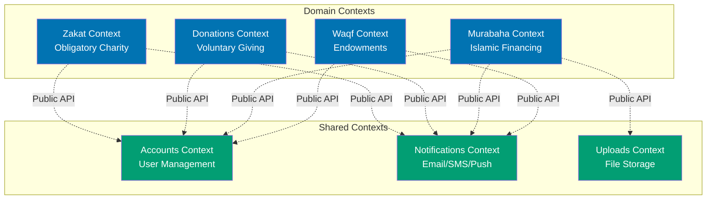
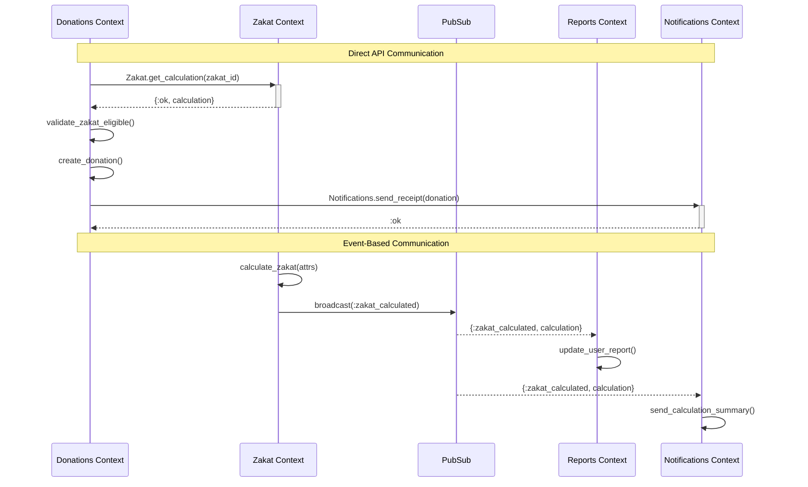

# Phoenix Contexts

## Quick Reference

### Context Fundamentals

- [What are Contexts](#what-are-contexts) - Definition and purpose
- [Context Boundaries](#context-boundaries) - Defining clear boundaries
- [Public vs Private APIs](#public-vs-private-apis) - API design
- [Single Responsibility](#single-responsibility-principle) - Focused contexts

### Context Organization

- [Directory Structure](#directory-structure) - File organization
- [Schema Location](#schema-location) - Where schemas belong
- [Business Logic](#business-logic-organization) - Logic organization
- [Query Modules](#query-modules) - Extracting complex queries

### Context Design Patterns

- [CRUD Contexts](#crud-contexts) - Basic data access
- [Rich Domain Contexts](#rich-domain-contexts) - Business logic encapsulation
- [Cross-Context Communication](#cross-context-communication) - Inter-context dependencies
- [Shared Contexts](#shared-contexts) - Reusable functionality

### Best Practices

- [Naming Conventions](#naming-conventions) - Consistent naming
- [Error Handling](#error-handling) - Return value conventions
- [Transaction Management](#transaction-management) - Data consistency
- [Testing Contexts](#testing-contexts) - Context testing strategies

## Overview

Phoenix Contexts are a way to organize code by grouping related functionality. They provide clear boundaries between different domains of your application and serve as the public API for those domains.

This guide covers context design for Phoenix 1.7+ applications in the open-sharia-enterprise platform, focusing on Islamic financial domains including Zakat calculation, Murabaha contracts, and donation management.

### Why Contexts Matter

**Organization**: Contexts prevent "god modules" by organizing code into focused, cohesive units.

**Encapsulation**: Contexts hide implementation details and expose clean public APIs.

**Testability**: Well-designed contexts are easy to test in isolation.

**Maintainability**: Clear boundaries make code easier to understand and modify.

**Scalability**: Contexts align with Domain-Driven Design principles for complex applications.

## What are Contexts

### Definition

A **context** is a module that groups related functionality and provides the public API for a specific domain area of your application.

**Key characteristics**:

- Groups related functions, schemas, and business logic
- Exposes public API functions
- Hides implementation details
- Acts as the single entry point for a domain

### Example: Zakat Context

```elixir
defmodule OsePlatform.Zakat do
  @moduledoc """
  The Zakat context handles all Zakat-related operations.

  Zakat is the obligatory charity in Islam, calculated as 2.5% of wealth
  that meets the nisab threshold and has been held for one lunar year (hawal).

  This context provides:
  - Zakat calculation based on wealth type
  - Hawal (lunar year) tracking
  - Nisab threshold validation
  - Calculation history
  """

  import Ecto.Query
  alias OsePlatform.Repo
  alias OsePlatform.Zakat.{Calculation, Calculator, HawalTracker}

  ## Public API

  @doc """
  Calculates Zakat for the given wealth parameters.

  ## Parameters

  - `attrs` - Map containing:
    - `:user_id` - User UUID
    - `:wealth` - Total wealth amount (Decimal)
    - `:nisab` - Nisab threshold (Decimal)
    - `:wealth_type` - Type of wealth (string)

  ## Returns

  - `{:ok, calculation}` - Successfully calculated Zakat
  - `{:error, :missing_required_params}` - Missing required parameters
  - `{:error, changeset}` - Invalid parameters

  ## Examples

      iex> calculate_zakat(%{
      ...>   user_id: "user-123",
      ...>   wealth: Decimal.new("10000"),
      ...>   nisab: Decimal.new("5000"),
      ...>   wealth_type: "cash"
      ...> })
      {:ok, %Calculation{zakat_amount: #Decimal<250.00>}}

  """
  def calculate_zakat(attrs) do
    with {:ok, validated_attrs} <- validate_zakat_params(attrs),
         {:ok, hawal_status} <- HawalTracker.check_hawal(validated_attrs.user_id),
         {:ok, zakat_data} <- Calculator.calculate(validated_attrs, hawal_status) do
      %Calculation{}
      |> Calculation.changeset(zakat_data)
      |> Repo.insert()
    end
  end

  @doc """
  Gets a Zakat calculation by ID.

  Returns `{:ok, calculation}` if found, `{:error, :not_found}` otherwise.
  """
  def get_calculation(id) do
    case Repo.get(Calculation, id) do
      nil -> {:error, :not_found}
      calculation -> {:ok, calculation}
    end
  end

  @doc """
  Lists all Zakat calculations for a user.

  Returns list of calculations ordered by most recent first.
  """
  def list_user_calculations(user_id) do
    Calculation
    |> where([c], c.user_id == ^user_id)
    |> order_by([c], desc: c.inserted_at)
    |> Repo.all()
  end

  ## Private Functions

  defp validate_zakat_params(attrs) do
    required_keys = [:user_id, :wealth, :nisab, :wealth_type]

    if Enum.all?(required_keys, &Map.has_key?(attrs, &1)) do
      {:ok, attrs}
    else
      {:error, :missing_required_params}
    end
  end
end
```

## Context Boundaries

### Defining Clear Boundaries

**Rule**: Each context should represent a distinct area of your application domain.

**Examples in Islamic Finance**:

- **Zakat** - Obligatory charity calculations
- **Donations** - Voluntary charitable giving
- **Murabaha** - Islamic financing contracts
- **Accounts** - User authentication and management
- **Notifications** - Email, SMS, push notifications

### How to Identify Boundaries

**Ask these questions**:

1. **Does this functionality belong to a single domain concept?**
   - ✅ Zakat calculation, hawal tracking, nisab validation
   - ❌ Zakat calculation, user authentication, email sending

2. **Would a domain expert recognize this grouping?**
   - ✅ An Islamic finance scholar would recognize "Zakat" as a cohesive concept
   - ❌ "Finance" is too broad

3. **Can this context evolve independently?**
   - ✅ Changes to Zakat rules don't affect Murabaha contracts
   - ❌ If changing one requires changing the other, they're too coupled

4. **Does this context have a clear public API?**
   - ✅ `Zakat.calculate_zakat/1`, `Zakat.list_calculations/1`
   - ❌ `Finance.do_something/1` is too vague

### Example: Well-Defined Boundaries

```elixir
# ✅ GOOD: Clear, focused contexts

defmodule OsePlatform.Zakat do
  @moduledoc """
  Zakat context - handles obligatory charity.
  """
  # Functions related only to Zakat
end

defmodule OsePlatform.Donations do
  @moduledoc """
  Donations context - handles voluntary charitable giving.
  """
  # Functions related only to donations
end

defmodule OsePlatform.Murabaha do
  @moduledoc """
  Murabaha context - handles Islamic financing contracts.
  """
  # Functions related only to Murabaha
end

# ❌ BAD: Unclear, overlapping boundaries

defmodule OsePlatform.Finance do
  @moduledoc """
  Finance context - handles... everything?
  """
  # ❌ Too broad - mixes Zakat, donations, Murabaha, payments
  def calculate_zakat(attrs), do: ...
  def create_donation(attrs), do: ...
  def process_murabaha_payment(attrs), do: ...
  def send_receipt_email(user_id), do: ...  # Not even finance!
end
```

## Public vs Private APIs

### Public API Functions

**Public functions** are the context's interface to the rest of your application.

**Characteristics**:

- Documented with `@doc`
- Return consistent result tuples `{:ok, value}` or `{:error, reason}`
- Validate inputs
- Handle errors gracefully
- Form the context's contract

```elixir
defmodule OsePlatform.Zakat do
  @doc """
  Public API - calculates Zakat and persists result.
  """
  def calculate_zakat(attrs) do
    # Public function - fully documented, validated, error-handled
  end

  @doc """
  Public API - retrieves calculation by ID.
  """
  def get_calculation(id) do
    case Repo.get(Calculation, id) do
      nil -> {:error, :not_found}
      calculation -> {:ok, calculation}
    end
  end
end
```

### Private Functions

**Private functions** are implementation details not exposed outside the context.

**Characteristics**:

- Defined with `defp`
- Can have simpler return values
- Can assume validated inputs
- Can change without breaking external code
- Not documented with `@doc` (use `# Private` comments)

```elixir
defmodule OsePlatform.Zakat do
  # Public API
  def calculate_zakat(attrs) do
    with {:ok, validated} <- validate_attrs(attrs),  # Private
         {:ok, hawal} <- check_hawal(validated),     # Private
         {:ok, result} <- perform_calculation(validated, hawal) do  # Private
      {:ok, result}
    end
  end

  ## Private Functions

  # Validates calculation parameters
  defp validate_attrs(attrs) do
    # Implementation detail - can change freely
  end

  # Checks if hawal (lunar year) is completed
  defp check_hawal(attrs) do
    # Implementation detail
  end

  # Performs actual calculation
  defp perform_calculation(attrs, hawal_status) do
    # Implementation detail
  end
end
```

### API Design Guidelines

**Return value conventions**:

```elixir
# ✅ GOOD: Consistent return values

def get_calculation(id) do
  case Repo.get(Calculation, id) do
    nil -> {:error, :not_found}
    calculation -> {:ok, calculation}
  end
end

def create_calculation(attrs) do
  %Calculation{}
  |> Calculation.changeset(attrs)
  |> Repo.insert()
  # Returns {:ok, calculation} or {:error, changeset}
end

# ❌ BAD: Inconsistent returns

def get_calculation(id) do
  Repo.get(Calculation, id)  # Returns calculation or nil (no tuple!)
end

def create_calculation(attrs) do
  Repo.insert!(%Calculation{}, attrs)  # Raises on error!
end
```

**Bang function convention**:

```elixir
# Provide both versions when appropriate

@doc """
Returns `{:ok, calculation}` or `{:error, :not_found}`.
"""
def get_calculation(id) do
  case Repo.get(Calculation, id) do
    nil -> {:error, :not_found}
    calculation -> {:ok, calculation}
  end
end

@doc """
Returns calculation or raises `Ecto.NoResultsError`.

Use only when you're certain the record exists.
"""
def get_calculation!(id) do
  Repo.get!(Calculation, id)
end
```

## Single Responsibility Principle

### Focused Contexts

**Rule**: Each context should have a single, well-defined responsibility.

**✅ GOOD: Focused responsibilities**

```elixir
defmodule OsePlatform.Zakat do
  @moduledoc """
  Handles Zakat calculations and tracking.

  Responsibilities:
  - Calculate Zakat based on wealth and nisab
  - Track hawal (lunar year) completion
  - Store calculation history
  - Validate nisab thresholds
  """
end

defmodule OsePlatform.Notifications do
  @moduledoc """
  Handles all notifications across the platform.

  Responsibilities:
  - Send email notifications
  - Send SMS notifications
  - Manage notification templates
  - Track delivery status
  """
end
```

**❌ BAD: Multiple responsibilities**

```elixir
defmodule OsePlatform.Zakat do
  @moduledoc """
  Handles Zakat... and donations... and emails... and reports...

  ❌ Too many responsibilities!
  """

  # Zakat functions
  def calculate_zakat(attrs), do: ...

  # ❌ Donation functions (wrong context!)
  def create_donation(attrs), do: ...

  # ❌ Email functions (wrong context!)
  def send_zakat_receipt(user_id), do: ...

  # ❌ Report generation (wrong context!)
  def generate_annual_report(user_id), do: ...
end
```

### When to Split a Context

**Signs a context is too large**:

1. **File size** - Module exceeds 300-400 lines
2. **Function count** - More than 15-20 public functions
3. **Multiple concerns** - Handles unrelated operations
4. **Team conflicts** - Multiple developers editing frequently
5. **Unclear naming** - Can't describe context in one sentence

**Example: Splitting a large context**

```elixir
# ❌ BAD: Fat context

defmodule OsePlatform.Zakat do
  # Calculation functions
  def calculate_zakat(attrs), do: ...
  def recalculate_all(user_id), do: ...

  # Hawal tracking functions
  def start_hawal_tracking(user_id), do: ...
  def check_hawal_completion(user_id), do: ...
  def reset_hawal(user_id), do: ...

  # Nisab management functions
  def get_current_nisab(currency), do: ...
  def update_nisab_rate(currency, rate), do: ...
  def list_nisab_rates(), do: ...

  # Report functions
  def generate_zakat_report(user_id), do: ...
  def export_zakat_summary(user_id), do: ...

  # ... 30 more functions
end

# ✅ GOOD: Split into focused contexts

defmodule OsePlatform.Zakat do
  @moduledoc """
  Core Zakat calculation and management.
  """

  alias OsePlatform.Zakat.{HawalTracker, NisabService}

  def calculate_zakat(attrs) do
    # Use other services/modules
    with {:ok, hawal} <- HawalTracker.check_completion(attrs.user_id),
         {:ok, nisab} <- NisabService.get_current(attrs.currency) do
      # Perform calculation
    end
  end

  def recalculate_all(user_id), do: ...
end

defmodule OsePlatform.Zakat.HawalTracker do
  @moduledoc """
  Tracks hawal (lunar year) completion for Zakat eligibility.
  """

  def start_tracking(user_id), do: ...
  def check_completion(user_id), do: ...
  def reset(user_id), do: ...
end

defmodule OsePlatform.Zakat.NisabService do
  @moduledoc """
  Manages nisab thresholds and rates.
  """

  def get_current(currency), do: ...
  def update_rate(currency, rate), do: ...
  def list_rates(), do: ...
end

defmodule OsePlatform.Reports.ZakatReports do
  @moduledoc """
  Generates Zakat-related reports.
  """

  alias OsePlatform.Zakat

  def generate_report(user_id) do
    # Uses Zakat context public API
    calculations = Zakat.list_user_calculations(user_id)
    # Generate report
  end

  def export_summary(user_id), do: ...
end
```

## Directory Structure

### Standard Context Structure

```
lib/ose_platform/
├── zakat/                          # Zakat context
│   ├── calculation.ex              # Calculation schema
│   ├── calculator.ex               # Business logic module
│   ├── hawal_tracker.ex            # Hawal tracking logic
│   ├── queries.ex                  # Complex queries
│   └── validators.ex               # Custom validators
├── zakat.ex                        # Context API module
├── donations/                      # Donations context
│   ├── donation.ex                 # Donation schema
│   ├── campaign.ex                 # Campaign schema
│   ├── queries.ex                  # Complex queries
│   └── payment_processor.ex        # Payment logic
├── donations.ex                    # Context API module
├── murabaha/                       # Murabaha context
│   ├── contract.ex                 # Contract schema
│   ├── payment.ex                  # Payment schema
│   ├── schedule_calculator.ex      # Payment schedule logic
│   └── queries.ex                  # Complex queries
└── murabaha.ex                     # Context API module
```

### Context Module Location

**Context API module** - Top level in `lib/ose_platform/`

```elixir
# lib/ose_platform/zakat.ex
defmodule OsePlatform.Zakat do
  @moduledoc """
  The Zakat context - public API.
  """
end
```

**Internal modules** - Inside context subdirectory

```elixir
# lib/ose_platform/zakat/calculation.ex
defmodule OsePlatform.Zakat.Calculation do
  use Ecto.Schema
  # Schema definition
end

# lib/ose_platform/zakat/calculator.ex
defmodule OsePlatform.Zakat.Calculator do
  @moduledoc """
  Business logic for Zakat calculations.
  Internal module - not exposed outside context.
  """
end
```

## Schema Location

### Schemas Belong to Contexts

**Rule**: Schemas live inside their context's subdirectory.

```
lib/ose_platform/
├── zakat/
│   ├── calculation.ex      # OsePlatform.Zakat.Calculation schema
│   └── hawal_period.ex     # OsePlatform.Zakat.HawalPeriod schema
├── donations/
│   ├── donation.ex         # OsePlatform.Donations.Donation schema
│   └── campaign.ex         # OsePlatform.Donations.Campaign schema
└── murabaha/
    ├── contract.ex         # OsePlatform.Murabaha.Contract schema
    └── payment.ex          # OsePlatform.Murabaha.Payment schema
```

### Schema Privacy

**Schemas are context-private** - Other contexts should not import schemas directly.

```elixir
# ❌ BAD: Importing another context's schema

defmodule OsePlatform.Donations do
  alias OsePlatform.Zakat.Calculation  # ❌ Don't do this!

  def create_donation_from_zakat(zakat_id) do
    # ❌ Directly accessing Zakat schema
    calculation = Repo.get(Calculation, zakat_id)
  end
end

# ✅ GOOD: Using context public API

defmodule OsePlatform.Donations do
  alias OsePlatform.Zakat  # ✅ Import context, not schema

  def create_donation_from_zakat(zakat_id) do
    # ✅ Use public API
    case Zakat.get_calculation(zakat_id) do
      {:ok, calculation} ->
        # Work with returned struct (public interface)
        create_donation(%{
          amount: calculation.zakat_amount,
          user_id: calculation.user_id
        })

      {:error, :not_found} ->
        {:error, :zakat_not_found}
    end
  end
end
```

## Business Logic Organization

### Where Business Logic Belongs

**Business logic** goes in contexts, not controllers or LiveViews.

```elixir
# ✅ GOOD: Business logic in context

defmodule OsePlatform.Zakat do
  @doc """
  Calculates Zakat based on wealth type.

  Different wealth types have different nisab thresholds and rates:
  - Gold/Silver: 85 grams gold equivalent
  - Cash: Same as gold nisab
  - Agricultural: 5% (irrigated) or 10% (rain-fed)
  - Livestock: Specific thresholds per animal type
  """
  def calculate_zakat(attrs) do
    # ✅ Business rules encapsulated in context
    with {:ok, validated} <- validate_wealth_params(attrs),
         {:ok, nisab} <- get_nisab_for_type(validated.wealth_type, validated.currency),
         {:ok, hawal} <- check_hawal_completion(validated.user_id),
         {:ok, zakat_data} <- calculate_amount(validated, nisab, hawal) do
      persist_calculation(zakat_data)
    end
  end

  # Business logic in private functions
  defp calculate_amount(attrs, nisab, hawal_status) do
    wealth = attrs.wealth
    eligible = hawal_status.completed? and Decimal.compare(wealth, nisab) == :gt

    zakat_amount = if eligible do
      calculate_by_wealth_type(attrs.wealth_type, wealth)
    else
      Decimal.new("0")
    end

    {:ok, %{
      wealth: wealth,
      nisab: nisab,
      zakat_amount: zakat_amount,
      eligible: eligible
    }}
  end

  defp calculate_by_wealth_type("gold", wealth), do: Decimal.mult(wealth, Decimal.new("0.025"))
  defp calculate_by_wealth_type("cash", wealth), do: Decimal.mult(wealth, Decimal.new("0.025"))
  defp calculate_by_wealth_type("agricultural_irrigated", wealth), do: Decimal.mult(wealth, Decimal.new("0.05"))
  defp calculate_by_wealth_type("agricultural_rainfed", wealth), do: Decimal.mult(wealth, Decimal.new("0.10"))
end

# ❌ BAD: Business logic in controller

defmodule OsePlatformWeb.ZakatController do
  use OsePlatformWeb, :controller

  def create(conn, params) do
    # ❌ Business logic in controller!
    wealth = Decimal.new(params["wealth"])
    nisab = Decimal.new(params["nisab"])

    zakat_amount = if Decimal.compare(wealth, nisab) == :gt do
      Decimal.mult(wealth, Decimal.new("0.025"))
    else
      Decimal.new("0")
    end

    # ❌ Direct Repo access
    calculation = %Calculation{
      wealth: wealth,
      nisab: nisab,
      zakat_amount: zakat_amount
    }

    Repo.insert(calculation)
  end
end
```

### Organizing Complex Logic

**For complex business logic**, extract into dedicated modules within the context.

```elixir
# Context uses internal modules

# lib/ose_platform/zakat.ex
defmodule OsePlatform.Zakat do
  alias OsePlatform.Zakat.{Calculator, HawalTracker, NisabService}

  def calculate_zakat(attrs) do
    with {:ok, nisab} <- NisabService.get_current(attrs.currency),
         {:ok, hawal} <- HawalTracker.check(attrs.user_id),
         {:ok, result} <- Calculator.calculate(attrs, nisab, hawal) do
      persist_calculation(result)
    end
  end
end

# lib/ose_platform/zakat/calculator.ex
defmodule OsePlatform.Zakat.Calculator do
  @moduledoc """
  Performs Zakat calculations based on Islamic jurisprudence.

  Handles different wealth types, nisab thresholds, and hawal requirements.
  Internal module - not exposed outside Zakat context.
  """

  @zakat_rate_cash Decimal.new("0.025")  # 2.5%
  @zakat_rate_agricultural_irrigated Decimal.new("0.05")  # 5%
  @zakat_rate_agricultural_rainfed Decimal.new("0.10")  # 10%

  def calculate(attrs, nisab, hawal_status) do
    # Complex calculation logic
  end

  defp calculate_by_type("gold", wealth), do: ...
  defp calculate_by_type("cash", wealth), do: ...
  defp calculate_by_type("agricultural", wealth, irrigation_type), do: ...
end

# lib/ose_platform/zakat/hawal_tracker.ex
defmodule OsePlatform.Zakat.HawalTracker do
  @moduledoc """
  Tracks hawal (lunar year) completion for Zakat eligibility.

  Islamic law requires wealth to be held for one full lunar year (354 days)
  before Zakat becomes obligatory.
  """

  def check(user_id) do
    # Hawal checking logic
  end
end
```

## Query Modules

### Extracting Complex Queries

**For complex or reused queries**, extract into a dedicated query module.

```elixir
# lib/ose_platform/murabaha/queries.ex
defmodule OsePlatform.Murabaha.Queries do
  @moduledoc """
  Reusable Ecto queries for Murabaha context.
  Internal module.
  """

  import Ecto.Query
  alias OsePlatform.Murabaha.{Contract, Payment}

  @doc """
  Query for active contracts with pending payments.
  """
  def active_contracts_with_pending_payments do
    from c in Contract,
      join: p in assoc(c, :payments),
      where: c.status == "active" and p.status == "pending",
      preload: [payments: p],
      distinct: c.id
  end

  @doc """
  Query for contracts due this month.
  """
  def contracts_due_in_month(year, month) do
    start_date = Date.new!(year, month, 1)
    end_date = Date.end_of_month(start_date)

    from c in Contract,
      join: p in assoc(c, :payments),
      where: p.due_date >= ^start_date and p.due_date <= ^end_date,
      preload: [payments: p]
  end

  @doc """
  Query for user's contracts with total paid amount.
  """
  def user_contracts_with_totals(user_id) do
    from c in Contract,
      left_join: p in assoc(c, :payments),
      where: c.user_id == ^user_id,
      group_by: c.id,
      select: %{
        contract: c,
        total_amount: c.total_amount,
        paid_amount: sum(p.amount),
        remaining: c.total_amount - sum(p.amount)
      }
  end
end

# Usage in context

defmodule OsePlatform.Murabaha do
  import Ecto.Query
  alias OsePlatform.Repo
  alias OsePlatform.Murabaha.Queries

  def list_active_contracts do
    Queries.active_contracts_with_pending_payments()
    |> Repo.all()
  end

  def list_contracts_due_this_month do
    today = Date.utc_today()
    Queries.contracts_due_in_month(today.year, today.month)
    |> Repo.all()
  end

  def get_user_contract_summary(user_id) do
    Queries.user_contracts_with_totals(user_id)
    |> Repo.all()
  end
end
```

### Query Composition

**Build queries compositionally** for flexibility.

```elixir
defmodule OsePlatform.Donations.Queries do
  import Ecto.Query
  alias OsePlatform.Donations.Donation

  @doc """
  Base query for donations.
  """
  def base do
    from d in Donation
  end

  @doc """
  Filter by user.
  """
  def by_user(query \\ base(), user_id) do
    where(query, [d], d.user_id == ^user_id)
  end

  @doc """
  Filter by campaign.
  """
  def by_campaign(query \\ base(), campaign_id) do
    where(query, [d], d.campaign_id == ^campaign_id)
  end

  @doc """
  Filter by date range.
  """
  def in_date_range(query \\ base(), start_date, end_date) do
    where(query, [d], d.inserted_at >= ^start_date and d.inserted_at <= ^end_date)
  end

  @doc """
  Order by most recent.
  """
  def recent_first(query \\ base()) do
    order_by(query, [d], desc: d.inserted_at)
  end

  @doc """
  Preload associations.
  """
  def with_associations(query \\ base(), associations) do
    preload(query, ^associations)
  end
end

# Usage - compose queries as needed

defmodule OsePlatform.Donations do
  alias OsePlatform.Donations.Queries
  alias OsePlatform.Repo

  def list_user_donations(user_id, opts \\ []) do
    Queries.base()
    |> Queries.by_user(user_id)
    |> Queries.recent_first()
    |> Queries.with_associations(opts[:preload] || [])
    |> Repo.all()
  end

  def list_campaign_donations(campaign_id, start_date, end_date) do
    Queries.base()
    |> Queries.by_campaign(campaign_id)
    |> Queries.in_date_range(start_date, end_date)
    |> Queries.recent_first()
    |> Repo.all()
  end
end
```

## CRUD Contexts

### Basic CRUD Pattern

**For simple data access**, use standard CRUD functions.

```elixir
defmodule OsePlatform.Campaigns do
  @moduledoc """
  Manages donation campaigns.
  """

  import Ecto.Query
  alias OsePlatform.Repo
  alias OsePlatform.Campaigns.Campaign

  @doc """
  Returns the list of campaigns.
  """
  def list_campaigns do
    Repo.all(Campaign)
  end

  @doc """
  Gets a single campaign.
  """
  def get_campaign(id) do
    case Repo.get(Campaign, id) do
      nil -> {:error, :not_found}
      campaign -> {:ok, campaign}
    end
  end

  @doc """
  Gets a single campaign. Raises if not found.
  """
  def get_campaign!(id) do
    Repo.get!(Campaign, id)
  end

  @doc """
  Creates a campaign.
  """
  def create_campaign(attrs) do
    %Campaign{}
    |> Campaign.changeset(attrs)
    |> Repo.insert()
  end

  @doc """
  Updates a campaign.
  """
  def update_campaign(%Campaign{} = campaign, attrs) do
    campaign
    |> Campaign.changeset(attrs)
    |> Repo.update()
  end

  @doc """
  Deletes a campaign.
  """
  def delete_campaign(%Campaign{} = campaign) do
    Repo.delete(campaign)
  end

  @doc """
  Returns an `%Ecto.Changeset{}` for tracking campaign changes.
  """
  def change_campaign(%Campaign{} = campaign, attrs \\ %{}) do
    Campaign.changeset(campaign, attrs)
  end
end
```

## Rich Domain Contexts

### Encapsulating Business Rules

**Rich contexts** contain complex business logic beyond simple CRUD.

```elixir
defmodule OsePlatform.Murabaha do
  @moduledoc """
  Islamic financing contracts (Murabaha).

  Murabaha is a cost-plus financing contract where the institution purchases
  an asset and sells it to the customer at cost plus an agreed profit margin,
  payable in installments.

  This context enforces Shariah compliance:
  - Profit disclosed upfront (no hidden fees)
  - Asset must exist and be owned before sale
  - Payment schedule calculated fairly
  - No penalty interest on late payments
  """

  import Ecto.Query
  alias OsePlatform.Repo
  alias OsePlatform.Murabaha.{Contract, Payment, ScheduleCalculator}

  @doc """
  Creates a new Murabaha contract.

  Validates Shariah compliance:
  - Asset must be specified
  - Cost and profit must be disclosed
  - Payment terms must be clear
  - Total amount = Cost + Profit (no hidden fees)
  """
  def create_contract(attrs) do
    with {:ok, validated} <- validate_contract_params(attrs),
         {:ok, schedule} <- ScheduleCalculator.generate(validated),
         {:ok, contract} <- insert_contract_with_payments(validated, schedule) do
      {:ok, contract}
    end
  end

  @doc """
  Processes a contract payment.

  Rules:
  - Cannot pay more than remaining balance
  - Payments applied to oldest due payment first
  - No penalty interest on late payments (Shariah-compliant)
  - Grace period for genuine financial difficulty
  """
  def process_payment(contract_id, amount, payment_date) do
    Repo.transaction(fn ->
      with {:ok, contract} <- get_contract_for_update(contract_id),
           {:ok, payment} <- find_next_due_payment(contract),
           {:ok, updated_payment} <- apply_payment(payment, amount, payment_date),
           {:ok, updated_contract} <- update_contract_balance(contract, amount) do
        {:ok, updated_payment}
      else
        {:error, reason} -> Repo.rollback(reason)
      end
    end)
  end

  @doc """
  Checks if payment is late and applies grace period.

  Shariah-compliant late payment handling:
  - Grace period for genuine financial difficulty
  - No penalty interest
  - Option to reschedule remaining payments
  - Cannot charge additional fees
  """
  def check_payment_status(payment_id) do
    with {:ok, payment} <- get_payment(payment_id) do
      grace_days = 7  # Grace period
      late_date = Date.add(payment.due_date, grace_days)
      today = Date.utc_today()

      status = cond do
        payment.paid_at != nil -> :paid
        Date.compare(today, late_date) == :gt -> :late
        Date.compare(today, payment.due_date) == :gt -> :grace_period
        true -> :pending
      end

      {:ok, %{payment: payment, status: status}}
    end
  end

  ## Private Functions

  defp validate_contract_params(attrs) do
    required = [:user_id, :asset_description, :cost, :profit_amount, :payment_terms]

    if Enum.all?(required, &Map.has_key?(attrs, &1)) do
      # Validate total = cost + profit (transparency requirement)
      total = Decimal.add(attrs.cost, attrs.profit_amount)

      if Decimal.compare(total, Decimal.new("0")) == :gt do
        {:ok, Map.put(attrs, :total_amount, total)}
      else
        {:error, :invalid_amount}
      end
    else
      {:error, :missing_required_params}
    end
  end

  defp insert_contract_with_payments(attrs, payment_schedule) do
    Repo.transaction(fn ->
      contract = %Contract{}
      |> Contract.changeset(attrs)
      |> Repo.insert!()

      payments = Enum.map(payment_schedule, fn payment_data ->
        %Payment{}
        |> Payment.changeset(Map.put(payment_data, :contract_id, contract.id))
        |> Repo.insert!()
      end)

      %{contract | payments: payments}
    end)
  end
end
```

## Cross-Context Communication

### Context Boundaries in OSE Platform



**Key Principles**:

- **Domain contexts** (blue) encapsulate specific business domains
- **Shared contexts** (teal) provide cross-cutting functionality
- Contexts communicate only through **public APIs** (dashed lines)
- No direct schema or internal module access between contexts

### Using Public APIs

**Rule**: Contexts communicate only through public APIs, never by accessing schemas or internal modules directly.

```elixir
# ✅ GOOD: Cross-context communication via public APIs

defmodule OsePlatform.Donations do
  alias OsePlatform.{Zakat, Notifications}

  @doc """
  Creates a donation from a Zakat calculation.

  Uses Zakat context to retrieve calculation, then creates donation.
  """
  def create_donation_from_zakat(zakat_id, attrs) do
    with {:ok, calculation} <- Zakat.get_calculation(zakat_id),
         :ok <- validate_zakat_eligible(calculation),
         {:ok, donation} <- create_donation(calculation, attrs),
         :ok <- Notifications.send_donation_receipt(donation) do
      {:ok, donation}
    end
  end

  defp validate_zakat_eligible(calculation) do
    if calculation.eligible and calculation.zakat_amount > 0 do
      :ok
    else
      {:error, :zakat_not_eligible}
    end
  end

  defp create_donation(calculation, attrs) do
    %Donation{}
    |> Donation.changeset(%{
      user_id: calculation.user_id,
      amount: calculation.zakat_amount,
      source: "zakat_obligation",
      reference_id: calculation.id
    })
    |> Repo.insert()
  end
end

# ❌ BAD: Directly accessing another context's internals

defmodule OsePlatform.Donations do
  alias OsePlatform.Zakat.Calculation  # ❌ Don't import schemas!

  def create_donation_from_zakat(zakat_id, attrs) do
    # ❌ Direct schema access
    calculation = Repo.get(Calculation, zakat_id)

    # ❌ Bypassing Zakat context API
    %Donation{}
    |> Donation.changeset(attrs)
    |> Repo.insert()
  end
end
```

### Event-Based Communication

**For loose coupling**, use events via Phoenix PubSub.

```elixir
# Publishing events

defmodule OsePlatform.Zakat do
  def calculate_zakat(attrs) do
    case do_calculate(attrs) do
      {:ok, calculation} ->
        # ✅ Publish event - other contexts can subscribe
        Phoenix.PubSub.broadcast(
          OsePlatform.PubSub,
          "zakat:calculations",
          {:zakat_calculated, calculation}
        )

        {:ok, calculation}

      error -> error
    end
  end
end

# Subscribing to events

defmodule OsePlatform.Reports do
  use GenServer

  def init(_) do
    # ✅ Subscribe to Zakat events
    Phoenix.PubSub.subscribe(OsePlatform.PubSub, "zakat:calculations")
    {:ok, %{}}
  end

  def handle_info({:zakat_calculated, calculation}, state) do
    # ✅ React to event - no direct coupling
    update_user_report(calculation.user_id)
    {:noreply, state}
  end
end
```

### Communication Patterns



**Two Communication Patterns**:

1. **Direct API calls** (top half):
   - Synchronous communication
   - Direct dependency on context's public API
   - Used when you need the result immediately
   - Example: Getting Zakat calculation before creating donation

2. **Event-based** (bottom half):
   - Asynchronous communication via PubSub
   - Loose coupling - publisher doesn't know subscribers
   - Used for side effects and notifications
   - Example: Broadcasting Zakat calculation for reports and notifications

## Shared Contexts

### Identifying Shared Functionality

**Shared contexts** provide functionality used across multiple domains.

**Examples**:

- `Accounts` - User authentication and management
- `Notifications` - Email, SMS, push notifications
- `Uploads` - File upload and storage
- `Geolocation` - Address and location services

```elixir
# Shared Notifications context

defmodule OsePlatform.Notifications do
  @moduledoc """
  Shared context for notifications across all domains.

  Used by:
  - Zakat context (calculation receipts)
  - Donations context (donation confirmations)
  - Murabaha context (payment reminders)
  """

  @doc """
  Sends a receipt email.

  Used by multiple contexts to send receipts.
  """
  def send_receipt_email(user_id, receipt_type, data) do
    with {:ok, user} <- Accounts.get_user(user_id),
         {:ok, template} <- get_template(receipt_type),
         {:ok, email} <- render_email(template, user, data) do
      deliver_email(email)
    end
  end

  @doc """
  Sends a notification to user's preferred channel.

  Checks user preferences and sends via email, SMS, or push.
  """
  def send_notification(user_id, notification_type, message) do
    # Notification logic
  end
end

# Usage from Zakat context

defmodule OsePlatform.Zakat do
  alias OsePlatform.Notifications

  def calculate_zakat(attrs) do
    case do_calculate(attrs) do
      {:ok, calculation} ->
        # Use shared Notifications context
        Notifications.send_receipt_email(
          calculation.user_id,
          "zakat_calculation",
          calculation
        )

        {:ok, calculation}

      error -> error
    end
  end
end

# Usage from Donations context

defmodule OsePlatform.Donations do
  alias OsePlatform.Notifications

  def create_donation(attrs) do
    case do_create(attrs) do
      {:ok, donation} ->
        # Use shared Notifications context
        Notifications.send_receipt_email(
          donation.user_id,
          "donation_confirmation",
          donation
        )

        {:ok, donation}

      error -> error
    end
  end
end
```

## Naming Conventions

### Context Names

**Singular vs Plural**:

- Use **plural** for contexts managing collections: `Accounts`, `Donations`, `Campaigns`
- Use **singular** for contexts representing single concepts: `Zakat`, `Murabaha`

```elixir
# ✅ GOOD: Clear, descriptive names

defmodule OsePlatform.Zakat do
  # Singular - represents the concept of Zakat
end

defmodule OsePlatform.Donations do
  # Plural - manages multiple donations
end

defmodule OsePlatform.Accounts do
  # Plural - manages multiple user accounts
end
```

### Function Names

**Follow Elixir naming conventions**:

- `list_*` - Returns list of items
- `get_*` - Returns single item or nil
- `get_*!` - Returns single item or raises
- `create_*` - Creates new item
- `update_*` - Updates existing item
- `delete_*` - Deletes item
- `change_*` - Returns changeset for form

```elixir
defmodule OsePlatform.Donations do
  def list_donations(), do: ...          # Returns list
  def get_donation(id), do: ...          # Returns {:ok, donation} or {:error, :not_found}
  def get_donation!(id), do: ...         # Returns donation or raises
  def create_donation(attrs), do: ...    # Creates donation
  def update_donation(donation, attrs), do: ...  # Updates donation
  def delete_donation(donation), do: ...  # Deletes donation
  def change_donation(donation, attrs \\ %{}), do: ...  # Returns changeset
end
```

## Error Handling

### Consistent Error Returns

**Return tuples** for predictable error handling.

```elixir
# ✅ GOOD: Consistent {:ok, value} or {:error, reason} tuples

defmodule OsePlatform.Zakat do
  def get_calculation(id) do
    case Repo.get(Calculation, id) do
      nil -> {:error, :not_found}
      calculation -> {:ok, calculation}
    end
  end

  def calculate_zakat(attrs) do
    with {:ok, validated} <- validate_attrs(attrs),
         {:ok, result} <- perform_calculation(validated) do
      {:ok, result}
    else
      {:error, :missing_params} -> {:error, :missing_params}
      {:error, changeset} -> {:error, changeset}
    end
  end
end

# Usage with pattern matching

case Zakat.get_calculation(id) do
  {:ok, calculation} ->
    # Handle success
  {:error, :not_found} ->
    # Handle not found
end
```

### Error Reason Atoms

**Use descriptive atoms** for error reasons.

```elixir
defmodule OsePlatform.Murabaha do
  def create_contract(attrs) do
    cond do
      missing_required?(attrs) ->
        {:error, :missing_required_params}

      invalid_amount?(attrs) ->
        {:error, :invalid_contract_amount}

      insufficient_credit?(attrs) ->
        {:error, :insufficient_credit_limit}

      true ->
        do_create_contract(attrs)
    end
  end
end
```

## Transaction Management

### When to Use Transactions

**Use transactions** when multiple database operations must succeed or fail together.

```elixir
defmodule OsePlatform.Murabaha do
  @doc """
  Creates contract with payment schedule.

  Uses transaction to ensure both contract and payments are created atomically.
  """
  def create_contract_with_schedule(attrs, schedule) do
    Repo.transaction(fn ->
      with {:ok, contract} <- insert_contract(attrs),
           {:ok, payments} <- insert_payments(contract.id, schedule) do
        %{contract | payments: payments}
      else
        {:error, reason} -> Repo.rollback(reason)
      end
    end)
  end

  defp insert_contract(attrs) do
    %Contract{}
    |> Contract.changeset(attrs)
    |> Repo.insert()
  end

  defp insert_payments(contract_id, schedule) do
    payments = Enum.map(schedule, fn payment_data ->
      %Payment{}
      |> Payment.changeset(Map.put(payment_data, :contract_id, contract_id))
      |> Repo.insert!()
    end)

    {:ok, payments}
  end
end
```

### Transaction Error Handling

```elixir
# Using Repo.transaction/2 (returns {:ok, result} or {:error, reason})

case Murabaha.create_contract_with_schedule(attrs, schedule) do
  {:ok, contract} ->
    # Transaction succeeded
    {:ok, contract}

  {:error, :insufficient_credit_limit} ->
    # Application error
    {:error, :insufficient_credit}

  {:error, %Ecto.Changeset{} = changeset} ->
    # Validation error
    {:error, changeset}
end
```

## Testing Contexts

### Unit Testing Contexts

**Test context functions in isolation** using DataCase.

```elixir
defmodule OsePlatform.ZakatTest do
  use OsePlatform.DataCase, async: true

  alias OsePlatform.Zakat

  describe "calculate_zakat/1" do
    test "calculates correct zakat for eligible wealth" do
      attrs = %{
        user_id: "user-123",
        wealth: Decimal.new("10000"),
        nisab: Decimal.new("5000"),
        wealth_type: "cash"
      }

      assert {:ok, calculation} = Zakat.calculate_zakat(attrs)
      assert calculation.zakat_amount == Decimal.new("250")  # 2.5% of 10000
      assert calculation.eligible == true
    end

    test "returns zero zakat when wealth below nisab" do
      attrs = %{
        user_id: "user-123",
        wealth: Decimal.new("4000"),
        nisab: Decimal.new("5000"),
        wealth_type: "cash"
      }

      assert {:ok, calculation} = Zakat.calculate_zakat(attrs)
      assert calculation.zakat_amount == Decimal.new("0")
      assert calculation.eligible == false
    end

    test "returns error for missing required params" do
      attrs = %{wealth: Decimal.new("10000")}

      assert {:error, :missing_required_params} = Zakat.calculate_zakat(attrs)
    end
  end

  describe "list_user_calculations/1" do
    test "returns calculations ordered by most recent first" do
      user_id = "user-123"

      calculation1 = insert(:zakat_calculation, user_id: user_id, inserted_at: ~U[2026-01-01 00:00:00Z])
      calculation2 = insert(:zakat_calculation, user_id: user_id, inserted_at: ~U[2026-01-02 00:00:00Z])

      calculations = Zakat.list_user_calculations(user_id)

      assert length(calculations) == 2
      assert hd(calculations).id == calculation2.id  # Most recent first
    end

    test "returns empty list for user with no calculations" do
      calculations = Zakat.list_user_calculations("user-999")

      assert calculations == []
    end
  end
end
```

## Related Documentation

- **[Phoenix Idioms](ex-soen-plwe-to-elph__idioms.md)** - Idiomatic Phoenix patterns
- **[Phoenix Best Practices](ex-soen-plwe-to-elph__best-practices.md)** - Production standards
- **[Phoenix Anti-Patterns](ex-soen-plwe-to-elph__anti-patterns.md)** - Common mistakes
- **[Data Access](ex-soen-plwe-to-elph__data-access.md)** - Ecto schemas and queries
- **[Testing](ex-soen-plwe-to-elph__testing.md)** - Testing strategies

---

**Last Updated**: 2026-01-25
**Phoenix Version**: 1.7+
**Elixir Version**: 1.14+
