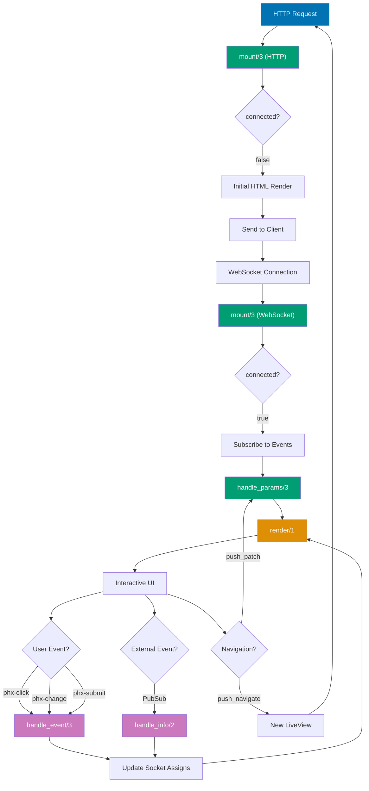

# Phoenix LiveView Guide

## Quick Reference

**Navigation**: [Stack Libraries](../README.md) > [Elixir Phoenix](./README.md) > LiveView

**Related Guides**:

- [Channels](channels.md) - Traditional real-time communication
- [Testing](testing.md) - LiveView testing strategies
- [Security](security.md) - Authentication and authorization
- [Performance](performance.md) - Optimization techniques

## Overview

Phoenix LiveView enables rich, real-time user experiences with server-rendered HTML. LiveView automatically handles WebSocket communication, updates the DOM efficiently, and maintains server state without requiring custom JavaScript.

**Target Audience**: Developers building interactive web applications, particularly Islamic finance platforms requiring dynamic forms, real-time calculations, and collaborative features.

**Phoenix Version**: Phoenix 1.7+ with LiveView 0.20+, Elixir 1.14+

## Core Concepts

### LiveView Lifecycle

```elixir
defmodule OseWeb.ZakatCalculatorLive do
  use OseWeb, :live_view

  alias Ose.Zakat

  # Mount - called on both initial HTTP and LiveView connection
  @impl true
  def mount(_params, session, socket) do
    # Session available from HTTP request
    user_id = Map.get(session, "user_id")

    if connected?(socket) do
      # Only run on WebSocket connection, not initial HTTP
      subscribe_to_updates(user_id)
    end

    socket =
      socket
      |> assign(:user_id, user_id)
      |> assign(:assets, [])
      |> assign(:calculation, nil)
      |> assign(:loading, false)

    {:ok, socket}
  end

  # Handle URL params (runs after mount)
  @impl true
  def handle_params(params, _uri, socket) do
    case params do
      %{"id" => calculation_id} ->
        # Load existing calculation
        calculation = Zakat.get_calculation(calculation_id)
        {:noreply, assign(socket, :calculation, calculation)}

      _ ->
        {:noreply, socket}
    end
  end

  # Render template
  @impl true
  def render(assigns) do
    ~H"""
    <div class="zakat-calculator">
      <h1>Zakat Calculator</h1>

      <.form for={@form} phx-change="validate" phx-submit="calculate">
        <.input field={@form[:gold_grams]} label="Gold (grams)" type="number" step="0.01" />
        <.input field={@form[:silver_grams]} label="Silver (grams)" type="number" step="0.01" />
        <.input field={@form[:cash]} label="Cash" type="number" step="0.01" />
        <.input field={@form[:investments]} label="Investments" type="number" step="0.01" />

        <.button type="submit" phx-disable-with="Calculating...">
          Calculate Zakat
        </.button>
      </.form>

      <%= if @calculation do %>
        <.result_card calculation={@calculation} />
      <% end %>
    </div>
    """
  end

  # Handle form validation
  @impl true
  def handle_event("validate", %{"assets" => assets_params}, socket) do
    changeset = Zakat.change_assets(assets_params)
    {:noreply, assign(socket, :form, to_form(changeset))}
  end

  # Handle form submission
  @impl true
  def handle_event("calculate", %{"assets" => assets_params}, socket) do
    case Zakat.calculate(socket.assigns.user_id, assets_params) do
      {:ok, calculation} ->
        socket =
          socket
          |> assign(:calculation, calculation)
          |> put_flash(:info, "Zakat calculated successfully")

        {:noreply, socket}

      {:error, changeset} ->
        {:noreply, assign(socket, :form, to_form(changeset))}
    end
  end

  # Handle async info messages
  @impl true
  def handle_info({:calculation_updated, calculation}, socket) do
    {:noreply, assign(socket, :calculation, calculation)}
  end

  defp subscribe_to_updates(user_id) do
    Phoenix.PubSub.subscribe(Ose.PubSub, "zakat:user:#{user_id}")
  end
end
```

**LiveView Lifecycle Flow**:



**Key Points**:

- **Mount called twice**: Once for initial HTTP render, once after WebSocket connection
- **connected?/0**: Use to differentiate HTTP vs WebSocket mount
- **handle_params/3**: Handles URL changes (runs after mount)
- **render/1**: Generates HTML template (runs after every state change)
- **handle_event/3**: Handles user interactions (clicks, form changes, submissions)
- **handle_info/2**: Handles messages from PubSub, processes, timers
- **Navigation**: `push_navigate` creates new LiveView, `push_patch` stays in same LiveView

### Component Structure

```elixir
defmodule OseWeb.DonationCardComponent do
  use Phoenix.LiveComponent

  # Required render function
  @impl true
  def render(assigns) do
    ~H"""
    <div class="donation-card" id={@id}>
      <h3>{@donation.campaign_name}</h3>
      <p class="amount">{format_currency(@donation.amount)}</p>
      <p class="donor">{@donation.donor_name}</p>

      <button phx-click="edit" phx-target={@myself}>
        Edit
      </button>
    </div>
    """
  end

  # Update is called when component props change
  @impl true
  def update(assigns, socket) do
    socket =
      socket
      |> assign(assigns)
      |> assign_new(:editing, fn -> false end)

    {:ok, socket}
  end

  # Handle events targeted at this component
  @impl true
  def handle_event("edit", _params, socket) do
    # Send to parent LiveView
    send(self(), {:edit_donation, socket.assigns.donation.id})

    {:noreply, assign(socket, :editing, true)}
  end

  defp format_currency(amount) do
    Number.Currency.number_to_currency(amount)
  end
end
```

## Forms and Validation

### Phoenix Form Integration

```elixir
defmodule OseWeb.DonationFormLive do
  use OseWeb, :live_view

  alias Ose.Donations
  alias Ose.Donations.Donation

  @impl true
  def mount(_params, _session, socket) do
    changeset = Donations.change_donation(%Donation{})

    socket =
      socket
      |> assign(:campaigns, Donations.list_active_campaigns())
      |> assign(:form, to_form(changeset))

    {:ok, socket}
  end

  @impl true
  def render(assigns) do
    ~H"""
    <div class="donation-form">
      <.form for={@form} phx-change="validate" phx-submit="save">
        <.input
          field={@form[:campaign_id]}
          type="select"
          label="Campaign"
          options={campaign_options(@campaigns)}
          prompt="Select a campaign"
        />

        <.input
          field={@form[:amount]}
          type="number"
          label="Amount"
          step="0.01"
          min="1"
        />

        <.input
          field={@form[:donor_name]}
          type="text"
          label="Your Name"
          placeholder="Anonymous"
        />

        <.input
          field={@form[:donor_email]}
          type="email"
          label="Email"
        />

        <.input
          field={@form[:message]}
          type="textarea"
          label="Message (optional)"
          rows="3"
        />

        <.input
          field={@form[:is_recurring]}
          type="checkbox"
          label="Make this a recurring donation"
        />

        <%= if @form.source.changes[:is_recurring] do %>
          <.input
            field={@form[:recurrence_period]}
            type="select"
            label="Frequency"
            options={["monthly", "quarterly", "annually"]}
          />
        <% end %>

        <.button type="submit" phx-disable-with="Processing...">
          Donate
        </.button>
      </.form>
    </div>
    """
  end

  @impl true
  def handle_event("validate", %{"donation" => donation_params}, socket) do
    changeset =
      %Donation{}
      |> Donations.change_donation(donation_params)
      |> Map.put(:action, :validate)

    {:noreply, assign(socket, :form, to_form(changeset))}
  end

  @impl true
  def handle_event("save", %{"donation" => donation_params}, socket) do
    case Donations.create_donation(donation_params) do
      {:ok, donation} ->
        socket =
          socket
          |> put_flash(:info, "Donation submitted successfully!")
          |> push_navigate(to: ~p"/donations/#{donation.id}/confirmation")

        {:noreply, socket}

      {:error, %Ecto.Changeset{} = changeset} ->
        {:noreply, assign(socket, :form, to_form(changeset))}
    end
  end

  defp campaign_options(campaigns) do
    Enum.map(campaigns, fn campaign ->
      {campaign.name, campaign.id}
    end)
  end
end
```

### Dynamic Forms

```elixir
defmodule OseWeb.WaqfBeneficiariesLive do
  use OseWeb, :live_view

  alias Ose.Waqf

  @impl true
  def mount(_params, _session, socket) do
    changeset = Waqf.change_waqf(%Waqf.Waqf{
      beneficiaries: [%Waqf.Beneficiary{}]
    })

    {:ok, assign(socket, :form, to_form(changeset))}
  end

  @impl true
  def render(assigns) do
    ~H"""
    <div class="waqf-form">
      <.form for={@form} phx-change="validate" phx-submit="save">
        <.input field={@form[:name]} label="Waqf Name" />
        <.input field={@form[:amount]} type="number" label="Total Amount" />

        <div class="beneficiaries">
          <h3>Beneficiaries</h3>

          <.inputs_for :let={beneficiary_form} field={@form[:beneficiaries]}>
            <div class="beneficiary-row">
              <.input field={beneficiary_form[:name]} label="Name" />
              <.input
                field={beneficiary_form[:allocation_percent]}
                type="number"
                label="Allocation %"
                min="0"
                max="100"
              />

              <button
                type="button"
                phx-click="remove_beneficiary"
                phx-value-index={beneficiary_form.index}
              >
                Remove
              </button>

              <.input
                field={beneficiary_form[:_destroy]}
                type="hidden"
                value={to_string(beneficiary_form.data._destroy || false)}
              />
            </div>
          </.inputs_for>

          <button type="button" phx-click="add_beneficiary">
            Add Beneficiary
          </button>
        </div>

        <div class="total-allocation">
          Total: <%= calculate_total_allocation(@form) %>%
        </div>

        <.button type="submit">Create Waqf</.button>
      </.form>
    </div>
    """
  end

  @impl true
  def handle_event("validate", %{"waqf" => waqf_params}, socket) do
    changeset =
      %Waqf.Waqf{}
      |> Waqf.change_waqf(waqf_params)
      |> Map.put(:action, :validate)

    {:noreply, assign(socket, :form, to_form(changeset))}
  end

  @impl true
  def handle_event("add_beneficiary", _params, socket) do
    existing = socket.assigns.form.source.changes[:beneficiaries] || []

    beneficiaries =
      existing
      |> Enum.reject(& &1.data._destroy)
      |> Kernel.++([%Waqf.Beneficiary{}])

    changeset =
      socket.assigns.form.source
      |> Ecto.Changeset.put_assoc(:beneficiaries, beneficiaries)

    {:noreply, assign(socket, :form, to_form(changeset))}
  end

  @impl true
  def handle_event("remove_beneficiary", %{"index" => index}, socket) do
    index = String.to_integer(index)
    beneficiaries = socket.assigns.form.source.changes[:beneficiaries] || []

    beneficiaries =
      beneficiaries
      |> Enum.with_index()
      |> Enum.map(fn {beneficiary, i} ->
        if i == index do
          Ecto.Changeset.change(beneficiary, _destroy: true)
        else
          beneficiary
        end
      end)

    changeset =
      socket.assigns.form.source
      |> Ecto.Changeset.put_assoc(:beneficiaries, beneficiaries)

    {:noreply, assign(socket, :form, to_form(changeset))}
  end

  @impl true
  def handle_event("save", %{"waqf" => waqf_params}, socket) do
    case Waqf.create_waqf(waqf_params) do
      {:ok, waqf} ->
        socket =
          socket
          |> put_flash(:info, "Waqf created successfully")
          |> push_navigate(to: ~p"/waqf/#{waqf.id}")

        {:noreply, socket}

      {:error, changeset} ->
        {:noreply, assign(socket, :form, to_form(changeset))}
    end
  end

  defp calculate_total_allocation(form) do
    beneficiaries = form.source.changes[:beneficiaries] || []

    beneficiaries
    |> Enum.reject(& &1.data._destroy)
    |> Enum.map(fn changeset ->
      case changeset.changes[:allocation_percent] do
        nil -> 0
        value when is_binary(value) -> String.to_integer(value)
        value -> value
      end
    end)
    |> Enum.sum()
  end
end
```

## File Uploads

### Single File Upload

```elixir
defmodule OseWeb.DocumentUploadLive do
  use OseWeb, :live_view

  alias Ose.Documents

  @impl true
  def mount(_params, _session, socket) do
    socket =
      socket
      |> assign(:uploaded_files, [])
      |> allow_upload(:document,
        accept: ~w(.pdf .doc .docx),
        max_entries: 1,
        max_file_size: 10_000_000,
        auto_upload: true
      )

    {:ok, socket}
  end

  @impl true
  def render(assigns) do
    ~H"""
    <div class="document-upload">
      <.form for={@form} phx-change="validate" phx-submit="save">
        <.input field={@form[:title]} label="Document Title" />

        <div class="upload-area" phx-drop-target={@uploads.document.ref}>
          <.live_file_input upload={@uploads.document} />

          <%= for entry <- @uploads.document.entries do %>
            <div class="upload-entry">
              <div class="filename">{entry.client_name}</div>

              <div class="progress">
                <div class="progress-bar" style={"width: #{entry.progress}%"}>
                  {entry.progress}%
                </div>
              </div>

              <button
                type="button"
                phx-click="cancel_upload"
                phx-value-ref={entry.ref}
              >
                Cancel
              </button>

              <%= for error <- upload_errors(@uploads.document, entry) do %>
                <p class="error">{error_to_string(error)}</p>
              <% end %>
            </div>
          <% end %>
        </div>

        <.button type="submit">Save Document</.button>
      </.form>

      <%= for file <- @uploaded_files do %>
        <div class="uploaded-file">
          Uploaded: {file.filename}
        </div>
      <% end %>
    </div>
    """
  end

  @impl true
  def handle_event("validate", _params, socket) do
    {:noreply, socket}
  end

  @impl true
  def handle_event("cancel_upload", %{"ref" => ref}, socket) do
    {:noreply, cancel_upload(socket, :document, ref)}
  end

  @impl true
  def handle_event("save", %{"title" => title}, socket) do
    uploaded_files =
      consume_uploaded_entries(socket, :document, fn %{path: path}, entry ->
        # Copy to permanent location
        dest = Path.join("priv/static/uploads", entry.client_name)
        File.cp!(path, dest)

        # Create database record
        Documents.create(%{
          title: title,
          filename: entry.client_name,
          content_type: entry.client_type,
          path: dest
        })

        {:ok, %{filename: entry.client_name, path: dest}}
      end)

    socket =
      socket
      |> update(:uploaded_files, &(&1 ++ uploaded_files))
      |> put_flash(:info, "Document uploaded successfully")

    {:noreply, socket}
  end

  defp error_to_string(:too_large), do: "File is too large (max 10MB)"
  defp error_to_string(:not_accepted), do: "Invalid file type"
  defp error_to_string(:too_many_files), do: "Too many files"
end
```

### Multiple File Upload with Preview

```elixir
defmodule OseWeb.ImageGalleryLive do
  use OseWeb, :live_view

  @impl true
  def mount(_params, _session, socket) do
    socket =
      socket
      |> assign(:uploaded_files, [])
      |> allow_upload(:photos,
        accept: ~w(.jpg .jpeg .png .gif),
        max_entries: 10,
        max_file_size: 5_000_000,
        chunk_size: 64_000
      )

    {:ok, socket}
  end

  @impl true
  def render(assigns) do
    ~H"""
    <div class="gallery-upload">
      <div class="upload-area" phx-drop-target={@uploads.photos.ref}>
        <.live_file_input upload={@uploads.photos} />
        <p>Drop images here or click to select (max 10 files)</p>
      </div>

      <div class="preview-grid">
        <%= for entry <- @uploads.photos.entries do %>
          <div class="preview-item">
            <.live_img_preview entry={entry} width="200" />

            <div class="preview-info">
              <p>{entry.client_name}</p>
              <p class="size">{format_bytes(entry.client_size)}</p>

              <div class="progress-bar" style={"width: #{entry.progress}%"} />

              <button
                type="button"
                phx-click="remove_photo"
                phx-value-ref={entry.ref}
              >
                Remove
              </button>

              <%= for error <- upload_errors(@uploads.photos, entry) do %>
                <p class="error">{error_to_string(error)}</p>
              <% end %>
            </div>
          </div>
        <% end %>
      </div>

      <button
        phx-click="upload_all"
        disabled={@uploads.photos.entries == []}
      >
        Upload All ({length(@uploads.photos.entries)} files)
      </button>

      <div class="uploaded-gallery">
        <%= for file <- @uploaded_files do %>
          
        <% end %>
      </div>
    </div>
    """
  end

  @impl true
  def handle_event("remove_photo", %{"ref" => ref}, socket) do
    {:noreply, cancel_upload(socket, :photos, ref)}
  end

  @impl true
  def handle_event("upload_all", _params, socket) do
    uploaded_files =
      consume_uploaded_entries(socket, :photos, fn %{path: path}, entry ->
        # Generate unique filename
        ext = Path.extname(entry.client_name)
        filename = "#{Ecto.UUID.generate()}#{ext}"
        dest = Path.join("priv/static/uploads/photos", filename)

        File.cp!(path, dest)

        {:ok, %{
          filename: entry.client_name,
          url: "/uploads/photos/#{filename}"
        }}
      end)

    {:noreply, update(socket, :uploaded_files, &(&1 ++ uploaded_files))}
  end

  defp format_bytes(bytes) do
    cond do
      bytes >= 1_000_000 -> "#{Float.round(bytes / 1_000_000, 1)} MB"
      bytes >= 1_000 -> "#{Float.round(bytes / 1_000, 1)} KB"
      true -> "#{bytes} B"
    end
  end

  defp error_to_string(:too_large), do: "File too large (max 5MB)"
  defp error_to_string(:not_accepted), do: "Invalid file type"
  defp error_to_string(:too_many_files), do: "Too many files (max 10)"
end
```

## Streams for Large Collections

### Efficient List Rendering

```elixir
defmodule OseWeb.DonationListLive do
  use OseWeb, :live_view

  alias Ose.Donations

  @impl true
  def mount(_params, _session, socket) do
    socket =
      socket
      |> stream(:donations, Donations.list_recent_donations(limit: 50))
      |> assign(:page, 1)

    {:ok, socket}
  end

  @impl true
  def render(assigns) do
    ~H"""
    <div class="donation-list">
      <h1>Recent Donations</h1>

      <div id="donations" phx-update="stream">
        <%= for {dom_id, donation} <- @streams.donations do %>
          <div id={dom_id} class="donation-card">
            <p class="donor">{donation.donor_name}</p>
            <p class="amount">{format_currency(donation.amount)}</p>
            <p class="time">{relative_time(donation.inserted_at)}</p>

            <button phx-click="delete" phx-value-id={donation.id}>
              Delete
            </button>
          </div>
        <% end %>
      </div>

      <button phx-click="load_more">Load More</button>
    </div>
    """
  end

  @impl true
  def handle_event("load_more", _params, socket) do
    page = socket.assigns.page + 1
    donations = Donations.list_recent_donations(page: page, limit: 50)

    socket =
      socket
      |> stream(:donations, donations, at: -1)
      |> assign(:page, page)

    {:noreply, socket}
  end

  @impl true
  def handle_event("delete", %{"id" => id}, socket) do
    donation = Donations.get_donation!(id)
    {:ok, _} = Donations.delete_donation(donation)

    # Remove from stream
    {:noreply, stream_delete(socket, :donations, donation)}
  end

  # Handle real-time updates
  @impl true
  def handle_info({:donation_created, donation}, socket) do
    # Insert at beginning
    {:noreply, stream_insert(socket, :donations, donation, at: 0)}
  end

  @impl true
  def handle_info({:donation_updated, donation}, socket) do
    {:noreply, stream_insert(socket, :donations, donation)}
  end

  defp format_currency(amount) do
    Number.Currency.number_to_currency(amount)
  end

  defp relative_time(datetime) do
    Timex.from_now(datetime)
  end
end
```

### Stream Operations

```elixir
defmodule OseWeb.CampaignDashboardLive do
  use OseWeb, :live_view

  @impl true
  def mount(%{"id" => campaign_id}, _session, socket) do
    if connected?(socket) do
      Phoenix.PubSub.subscribe(Ose.PubSub, "campaign:#{campaign_id}")
    end

    campaign = Donations.get_campaign!(campaign_id)
    donations = Donations.list_campaign_donations(campaign_id)

    socket =
      socket
      |> assign(:campaign, campaign)
      |> stream(:donations, donations)

    {:ok, socket}
  end

  # Insert new donation at top
  @impl true
  def handle_info({:new_donation, donation}, socket) do
    {:noreply, stream_insert(socket, :donations, donation, at: 0)}
  end

  # Update existing donation
  @impl true
  def handle_info({:donation_updated, donation}, socket) do
    {:noreply, stream_insert(socket, :donations, donation)}
  end

  # Delete donation
  @impl true
  def handle_info({:donation_deleted, donation_id}, socket) do
    {:noreply, stream_delete_by_dom_id(socket, :donations, "donations-#{donation_id}")}
  end

  # Reset stream completely
  @impl true
  def handle_event("refresh", _params, socket) do
    donations = Donations.list_campaign_donations(socket.assigns.campaign.id)

    {:noreply, stream(socket, :donations, donations, reset: true)}
  end
end
```

## Async Operations

### Task with Progress

```elixir
defmodule OseWeb.ReportGeneratorLive do
  use OseWeb, :live_view

  @impl true
  def mount(_params, _session, socket) do
    {:ok, assign(socket, :report, nil, :progress, 0)}
  end

  @impl true
  def render(assigns) do
    ~H"""
    <div class="report-generator">
      <button phx-click="generate" disabled={@progress > 0 && @progress < 100}>
        Generate Report
      </button>

      <%= if @progress > 0 && @progress < 100 do %>
        <div class="progress">
          <div class="progress-bar" style={"width: #{@progress}%"}>
            {@progress}%
          </div>
        </div>
      <% end %>

      <%= if @report do %>
        <div class="report-content">
          <.display_report report={@report} />
        </div>
      <% end %>
    </div>
    """
  end

  @impl true
  def handle_event("generate", _params, socket) do
    user_id = socket.assigns.user_id

    # Start async task
    task =
      Task.Supervisor.async_nolink(Ose.TaskSupervisor, fn ->
        generate_report_with_progress(user_id, self())
      end)

    socket =
      socket
      |> assign(:report_task, task.ref)
      |> assign(:progress, 1)

    {:noreply, socket}
  end

  @impl true
  def handle_info({:progress, percent}, socket) do
    {:noreply, assign(socket, :progress, percent)}
  end

  @impl true
  def handle_info({ref, report}, socket) when ref == socket.assigns.report_task do
    Process.demonitor(ref, [:flush])

    socket =
      socket
      |> assign(:report, report)
      |> assign(:progress, 100)

    {:noreply, socket}
  end

  @impl true
  def handle_info({:DOWN, ref, _, _, reason}, socket) when ref == socket.assigns.report_task do
    socket =
      socket
      |> put_flash(:error, "Report generation failed: #{inspect(reason)}")
      |> assign(:progress, 0)

    {:noreply, socket}
  end

  defp generate_report_with_progress(user_id, parent_pid) do
    send(parent_pid, {:progress, 10})
    donations = Ose.Donations.get_user_donations(user_id)

    send(parent_pid, {:progress, 30})
    zakat = Ose.Zakat.get_user_calculations(user_id)

    send(parent_pid, {:progress, 60})
    analysis = analyze_data(donations, zakat)

    send(parent_pid, {:progress, 90})
    format_report(analysis)
  end

  defp analyze_data(_donations, _zakat), do: %{}
  defp format_report(_analysis), do: %{}
end
```

### Async Assign

```elixir
defmodule OseWeb.DashboardLive do
  use OseWeb, :live_view

  @impl true
  def mount(_params, _session, socket) do
    socket =
      socket
      |> assign_async(:stats, fn ->
        {:ok, %{stats: load_stats()}}
      end)
      |> assign_async(:recent_donations, fn ->
        {:ok, %{recent_donations: load_recent_donations()}}
      end)
      |> assign_async(:charts, fn ->
        {:ok, %{charts: load_chart_data()}}
      end)

    {:ok, socket}
  end

  @impl true
  def render(assigns) do
    ~H"""
    <div class="dashboard">
      <.async_result :let={stats} assign={@stats}>
        <:loading>Loading statistics...</:loading>
        <:failed :let={reason}>Failed to load: {reason}</:failed>

        <div class="stats-grid">
          <.stat_card title="Total Donations" value={stats.total_donations} />
          <.stat_card title="Total Amount" value={stats.total_amount} />
          <.stat_card title="Active Campaigns" value={stats.active_campaigns} />
        </div>
      </.async_result>

      <.async_result :let={donations} assign={@recent_donations}>
        <:loading>Loading donations...</:loading>

        <div class="recent-donations">
          <%= for donation <- donations do %>
            <.donation_card donation={donation} />
          <% end %>
        </div>
      </.async_result>
    </div>
    """
  end

  defp load_stats do
    # Expensive operation
    Process.sleep(1000)
    %{total_donations: 1234, total_amount: 50000, active_campaigns: 15}
  end

  defp load_recent_donations do
    Process.sleep(500)
    []
  end

  defp load_chart_data do
    Process.sleep(800)
    %{}
  end
end
```

## Navigation and URLs

### Push Navigate

```elixir
defmodule OseWeb.CampaignLive do
  use OseWeb, :live_view

  @impl true
  def handle_event("view_campaign", %{"id" => id}, socket) do
    # Client-side navigation (no page reload)
    {:noreply, push_navigate(socket, to: ~p"/campaigns/#{id}")}
  end

  @impl true
  def handle_event("external_link", _params, socket) do
    # Redirect with page reload
    {:noreply, redirect(socket, external: "https://example.com")}
  end
end
```

### Patch Navigation (Same LiveView)

```elixir
defmodule OseWeb.DonationIndexLive do
  use OseWeb, :live_view

  @impl true
  def mount(_params, _session, socket) do
    {:ok, assign(socket, :donations, [])}
  end

  @impl true
  def handle_params(params, _uri, socket) do
    case params do
      %{"filter" => filter} ->
        donations = Donations.list_donations(filter: filter)
        {:noreply, assign(socket, donations: donations, filter: filter)}

      _ ->
        donations = Donations.list_donations()
        {:noreply, assign(socket, donations: donations, filter: nil)}
    end
  end

  @impl true
  def handle_event("filter", %{"filter" => filter}, socket) do
    # Updates URL and triggers handle_params
    {:noreply, push_patch(socket, to: ~p"/donations?filter=#{filter}")}
  end
end
```

## Advanced Patterns

### Temporary Assigns (Memory Optimization)

```elixir
defmodule OseWeb.LargeFormLive do
  use OseWeb, :live_view

  @impl true
  def mount(_params, _session, socket) do
    socket =
      socket
      # Don't keep form data in memory after render
      |> assign(:form, to_form(%{}))
      |> temporary_assigns(form: nil)

    {:ok, socket}
  end
end
```

### Debouncing Input

```elixir
defmodule OseWeb.SearchLive do
  use OseWeb, :live_view

  @impl true
  def render(assigns) do
    ~H"""
    <div>
      <form phx-change="search" phx-debounce="300">
        <input
          type="text"
          name="query"
          value={@query}
          placeholder="Search..."
          phx-debounce="blur"
        />
      </form>

      <div id="results">
        <%= for result <- @results do %>
          <.result_item result={result} />
        <% end %>
      </div>
    </div>
    """
  end

  @impl true
  def handle_event("search", %{"query" => query}, socket) do
    results = search_donations(query)
    {:noreply, assign(socket, query: query, results: results)}
  end

  defp search_donations(query) do
    # Search implementation
    []
  end
end
```

### Throttling Events

```elixir
defmodule OseWeb.LiveChartLive do
  use OseWeb, :live_view

  @impl true
  def render(assigns) do
    ~H"""
    <div
      phx-window-mousemove="mouse_move"
      phx-throttle="100"
    >
      <canvas id="chart" phx-hook="Chart" />
    </div>
    """
  end
end
```

### JS Commands

```elixir
defmodule OseWeb.NotificationLive do
  use OseWeb, :live_view

  import Phoenix.LiveView.JS

  @impl true
  def render(assigns) do
    ~H"""
    <div>
      <button phx-click={show_notification()}>
        Show Notification
      </button>

      <div id="notification" class="hidden">
        Success!
      </div>
    </div>
    """
  end

  defp show_notification do
    JS.show(to: "#notification")
    |> JS.transition("fade-in")
    |> JS.hide(to: "#notification", time: 3000, transition: "fade-out")
  end

  @impl true
  def handle_event("delete_item", %{"id" => id}, socket) do
    Donations.delete_donation(id)

    {:noreply,
     socket
     |> push_event("item-deleted", %{id: id})
     |> push_js(
       JS.hide(to: "#item-#{id}", transition: "fade-out")
       |> JS.remove_class("active", to: "#item-#{id}")
     )}
  end
end
```

## Testing LiveViews

### Basic LiveView Tests

```elixir
defmodule OseWeb.ZakatCalculatorLiveTest do
  use OseWeb.ConnCase, async: true

  import Phoenix.LiveViewTest

  alias Ose.Zakat

  test "renders calculator form", %{conn: conn} do
    {:ok, view, html} = live(conn, ~p"/zakat/calculator")

    assert html =~ "Zakat Calculator"
    assert has_element?(view, "form")
    assert has_element?(view, "input[name='assets[gold_grams]']")
  end

  test "calculates zakat", %{conn: conn} do
    {:ok, view, _html} = live(conn, ~p"/zakat/calculator")

    view
    |> form("form", assets: %{
      gold_grams: "100",
      silver_grams: "0",
      cash: "10000",
      investments: "5000"
    })
    |> render_submit()

    assert has_element?(view, ".result-card")
    assert render(view) =~ "Zakat Amount:"
  end

  test "validates input", %{conn: conn} do
    {:ok, view, _html} = live(conn, ~p"/zakat/calculator")

    view
    |> form("form", assets: %{gold_grams: "-10"})
    |> render_change()

    assert render(view) =~ "must be greater than 0"
  end
end
```

### Testing Events

```elixir
defmodule OseWeb.DonationFormLiveTest do
  use OseWeb.ConnCase, async: true

  import Phoenix.LiveViewTest

  test "creates donation", %{conn: conn} do
    campaign = insert(:campaign)

    {:ok, view, _html} = live(conn, ~p"/donations/new")

    assert view
           |> form("form",
             donation: %{
               campaign_id: campaign.id,
               amount: "100",
               donor_name: "Test Donor"
             }
           )
           |> render_submit()

    assert_redirect(view, ~p"/donations/#{donation_id}/confirmation")
  end

  test "handles async events", %{conn: conn} do
    {:ok, view, _html} = live(conn, ~p"/dashboard")

    # Simulate PubSub message
    send(view.pid, {:donation_created, %{id: 1, amount: 100}})

    assert render(view) =~ "New donation: $100"
  end
end
```

### Testing Components

```elixir
defmodule OseWeb.DonationCardComponentTest do
  use OseWeb.ConnCase, async: true

  import Phoenix.LiveViewTest

  test "renders donation card" do
    donation = %{
      id: 1,
      campaign_name: "Test Campaign",
      amount: Decimal.new("100.00"),
      donor_name: "Test Donor"
    }

    html =
      render_component(&OseWeb.DonationCardComponent.render/1,
        id: "donation-1",
        donation: donation
      )

    assert html =~ "Test Campaign"
    assert html =~ "$100.00"
    assert html =~ "Test Donor"
  end

  test "handles edit event" do
    donation = build(:donation)

    view =
      live_isolated_component(OseWeb.DonationCardComponent,
        id: "donation-1",
        donation: donation
      )

    view
    |> element("button", "Edit")
    |> render_click()

    # Component should notify parent
    assert_received {:edit_donation, donation_id}
  end
end
```

## Related Documentation

- **[Channels Guide](channels.md)** - Traditional real-time with WebSockets
- **[Testing Guide](testing.md)** - Comprehensive testing strategies
- **[Security Guide](security.md)** - Authentication and authorization
- **[Performance Guide](performance.md)** - Optimization techniques
- **[Phoenix LiveView Documentation](https://hexdocs.pm/phoenix_live_view)** - Official reference
- **LiveView Templates (TODO: ./templates/liveview-template.md)** - Starter templates
