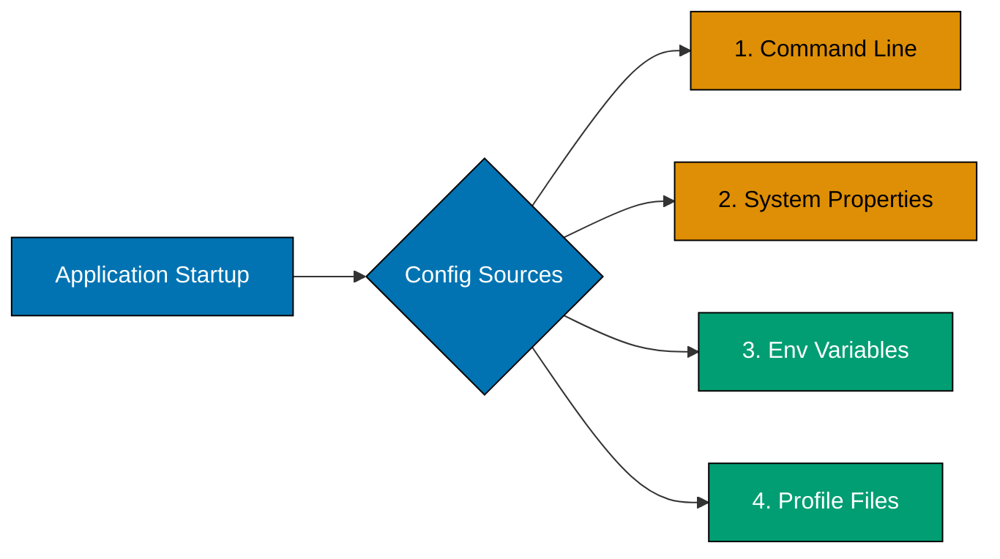
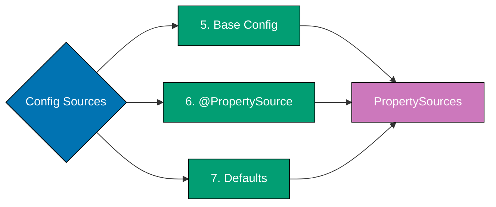

# Spring Boot Configuration

## 📋 Quick Reference

- [Application Properties Structure](#application-properties-structure) - Main configuration files
- [Profile-Based Configuration](#profile-based-configuration) - Environment-specific settings
- [@ConfigurationProperties](#configurationproperties) - Type-safe configuration classes
- [Environment Variables](#environment-variables) - Externalized secrets and settings
- [Secrets Management](#secrets-management) - Vault integration, encryption
- [Feature Flags](#feature-flags) - Feature toggles for gradual rollout
- [Configuration Testing](#configuration-testing) - Testing different configurations
- [OSE Platform Examples](#ose-platform-examples) - Real-world configuration patterns
- [Configuration Checklist](#configuration-checklist) - Best practices
- [Related Documentation](#related-documentation)

## Overview

Spring Boot provides flexible configuration management through properties files, environment variables, and type-safe configuration classes. This guide covers configuration strategies, externalization patterns, secrets management, and feature flags for production applications.

**Spring Boot Version**: 3.x
**Configuration Formats**: YAML (preferred), Properties

**Key Benefits**:

- **Externalization**: Configuration separated from code
- **Type Safety**: `@ConfigurationProperties` with validation
- **Environment-Specific**: Profiles for dev/test/prod
- **Secrets Management**: Integration with Vault, encrypted properties
- **Feature Toggles**: Gradual rollout and A/B testing

**Configuration Precedence** (highest to lowest):

1. Command line arguments (`--server.port=9000`)
2. Java system properties (`-Dserver.port=9000`)
3. OS environment variables (`SERVER_PORT=9000`)
4. Profile-specific files (`application-prod.yml`)
5. Application configuration files (`application.yml`)
6. `@PropertySource` annotations
7. Default values in `@ConfigurationProperties`

### Configuration Loading Hierarchy

Configuration sources are loaded in priority order (highest to lowest):





```mermaid
%% Color Palette: Blue #0173B2, Orange #DE8F05, Teal #029E73, Purple #CC78BC
%% All colors are color-blind friendly and meet WCAG AA contrast standards
graph TD
    D[PropertySources] --> E{Resolution}
    E --> F[Final Config]
    F --> G[@Value Injection]
    F --> H[@ConfigProps Binding]
    G --> J[App Context]
    H --> J

    style D fill:#CC78BC,stroke:#000,color:#fff
    style E fill:#CC78BC,stroke:#000,color:#fff
    style F fill:#CC78BC,stroke:#000,color:#fff
    style G fill:#0173B2,stroke:#000,color:#fff
    style H fill:#0173B2,stroke:#000,color:#fff
    style J fill:#0173B2,stroke:#000,color:#fff
```

**Loading Sequence**:

1. **Orange (Runtime Sources)**: Command line args and system properties (highest precedence)
2. **Teal (External Sources)**: Environment variables and configuration files
3. **Purple (Resolution)**: PropertySources merged with precedence rules
4. **Blue (Injection)**: Configuration injected into application context

**Precedence Rule**: Earlier sources override later sources. Command line > System properties > Environment variables > Profile files > Base config > Defaults.

## Application Properties Structure

```yaml
# Application identity
spring:
  application:
    name: payment-service
  profiles:
    active: ${SPRING_PROFILES_ACTIVE:dev}

# Server configuration
server:
  port: ${SERVER_PORT:8080}
  compression:
    enabled: true
    min-response-size: 1024

# Database (externalized)
spring:
  datasource:
    url: ${DATABASE_URL:jdbc:postgresql://localhost:5432/ose}
    username: ${DATABASE_USERNAME:dev_user}
    password: ${DATABASE_PASSWORD:dev_password}
    hikari:
      maximum-pool-size: ${DB_POOL_SIZE:10}
      minimum-idle: 5

# JPA configuration
spring:
  jpa:
    hibernate:
      ddl-auto: validate
    properties:
      hibernate:
        dialect: org.hibernate.dialect.PostgreSQLDialect
    show-sql: false

# Flyway migrations
spring:
  flyway:
    enabled: true
    locations: classpath:db/migration
    baseline-on-migrate: true

# Security (secrets externalized)
ose:
  security:
    jwt:
      secret: ${JWT_SECRET}
      expiration-ms: ${JWT_EXPIRATION_MS:3600000}
      issuer: ose-platform

# Actuator
management:
  endpoints:
    web:
      exposure:
        include: ${ACTUATOR_ENDPOINTS:health,info,metrics}
  endpoint:
    health:
      show-details: when-authorized

# Logging
logging:
  level:
    root: INFO
    com.oseplatform: DEBUG
    org.springframework.web: INFO
    org.hibernate.SQL: DEBUG
```

### Development Profile

```yaml
# application-dev.yml
spring:
  jpa:
    show-sql: true
    properties:
      hibernate:
        format_sql: true
  devtools:
    restart:
      enabled: true

logging:
  level:
    com.oseplatform: DEBUG
    org.hibernate.SQL: DEBUG
    org.hibernate.type.descriptor.sql.BasicBinder: TRACE

# Development features
ose:
  features:
    email-notifications: false
    sms-notifications: false
```

### Production Profile

```yaml
# application-prod.yml
spring:
  jpa:
    show-sql: false
  datasource:
    hikari:
      maximum-pool-size: 20
      minimum-idle: 10

logging:
  level:
    root: WARN
    com.oseplatform: INFO

# Production features
ose:
  features:
    email-notifications: true
    sms-notifications: true

management:
  endpoints:
    web:
      exposure:
        include: health,info,metrics,prometheus
```

## @ConfigurationProperties

```java
@ConfigurationProperties(prefix = "ose.zakat")
@Validated
public class ZakatProperties {

    @NotNull
    @DecimalMin("0.001")
    @DecimalMax("1.0")
    private BigDecimal nisabPercentage = new BigDecimal("0.025");

    @Min(1)
    @Max(366)
    private int hawalDays = 354;

    @NotNull
    private Currency defaultCurrency = Currency.getInstance("USD");

    @Valid
    private Notifications notifications = new Notifications();

    public static class Notifications {
        private boolean emailEnabled = true;
        private boolean smsEnabled = false;
        private String fromEmail = "noreply@oseplatform.com";

        // Getters and setters
    }

    // Getters and setters
}

@Configuration
@EnableConfigurationProperties(ZakatProperties.class)
public class ZakatConfig {
    // Properties now available for injection
}
```

**application.yml**:

```yaml
ose:
  zakat:
    nisab-percentage: 0.025
    hawal-days: 354
    default-currency: USD
    notifications:
      email-enabled: true
      sms-enabled: false
      from-email: noreply@oseplatform.com
```

### Local Development (.env)

```bash
# Database
DATABASE_URL=jdbc:postgresql://localhost:5432/ose_platform
DATABASE_USERNAME=dev_user
DATABASE_PASSWORD=dev_password

# Security
JWT_SECRET=dev-secret-key-change-in-production
JWT_EXPIRATION_MS=3600000

# Profiles
SPRING_PROFILES_ACTIVE=dev
```

### Production Environment

```bash
# Kubernetes ConfigMap/Secrets
DATABASE_URL=jdbc:postgresql://prod-db.cluster.local:5432/ose_platform
DATABASE_USERNAME=prod_user
DATABASE_PASSWORD=${VAULT_DB_PASSWORD}

JWT_SECRET=${VAULT_JWT_SECRET}
JWT_EXPIRATION_MS=1800000

SPRING_PROFILES_ACTIVE=prod
SERVER_PORT=8080
```

## Configuration Validation

```java
@ConfigurationProperties(prefix = "ose.payment.gateway")
@Validated
public class PaymentGatewayProperties {

    @NotBlank(message = "API URL is required")
    @URL(message = "API URL must be valid")
    private String apiUrl;

    @NotBlank(message = "API key is required")
    private String apiKey;

    @Min(value = 1000, message = "Timeout must be at least 1000ms")
    @Max(value = 60000, message = "Timeout cannot exceed 60000ms")
    private int timeoutMs = 30000;

    @Min(1)
    @Max(10)
    private int maxRetries = 3;

    // Getters and setters
}
```

**Application fails to start if validation fails**:

```
***************************
APPLICATION FAILED TO START
***************************

Description:

Binding to target org.springframework.boot.context.properties.bind.BindException:
Failed to bind properties under 'ose.payment.gateway' to PaymentGatewayProperties

Reason: Field error in object 'ose.payment.gateway' on field 'apiUrl':
rejected value [invalid-url]; API URL must be valid
```

### HashiCorp Vault Integration

**Dependencies**:

```xml
<dependency>
    <groupId>org.springframework.cloud</groupId>
    <artifactId>spring-cloud-starter-vault-config</artifactId>
</dependency>
```

**Configuration**:

```yaml
# application.yml
spring:
  cloud:
    vault:
      enabled: true
      uri: ${VAULT_ADDR:http://localhost:8200}
      token: ${VAULT_TOKEN}
      kv:
        enabled: true
        backend: secret
        default-context: ose-platform
        application-name: zakat-service
```

**Vault Secrets** (`secret/ose-platform/zakat-service`):

```json
{
  "database": {
    "url": "jdbc:postgresql://prod-db.cluster.local:5432/ose_platform",
    "username": "prod_user",
    "password": "super-secret-password"
  },
  "jwt": {
    "secret": "super-secret-jwt-key-512-bits-long",
    "expiration-ms": 1800000
  },
  "api-keys": {
    "payment-gateway": "pk_live_abc123xyz",
    "email-service": "ses_key_123456"
  }
}
```

**Usage in Configuration Properties**:

```java
@ConfigurationProperties(prefix = "database")
@Validated
public class DatabaseProperties {

    @NotBlank
    private String url;

    @NotBlank
    private String username;

    @NotBlank
    private String password;

    // Getters and setters - values populated from Vault
}

@Configuration
@EnableConfigurationProperties(DatabaseProperties.class)
public class DataSourceConfig {

    @Bean
    public DataSource dataSource(DatabaseProperties props) {
        HikariConfig config = new HikariConfig();
        config.setJdbcUrl(props.getUrl());
        config.setUsername(props.getUsername());
        config.setPassword(props.getPassword());  // Securely fetched from Vault
        return new HikariDataSource(config);
    }
}
```

### Encrypted Properties (Jasypt)

**Dependencies**:

```xml
<dependency>
    <groupId>com.github.ulisesbocchio</groupId>
    <artifactId>jasypt-spring-boot-starter</artifactId>
    <version>3.0.5</version>
</dependency>
```

**Configuration**:

```yaml
# application.yml
jasypt:
  encryptor:
    password: ${JASYPT_ENCRYPTOR_PASSWORD}
    algorithm: PBEWithMD5AndDES
    iv-generator-classname: org.jasypt.iv.NoIvGenerator

# Encrypted values
ose:
  payment:
    api-key: ENC(encrypted-value-here)
  database:
    password: ENC(another-encrypted-value)
```

**Encrypting Values**:

```bash
# Encrypt a value
java -cp jasypt-1.9.3.jar \
  org.jasypt.intf.cli.JasyptPBEStringEncryptionCLI \
  input="my-secret-value" \
  password="${JASYPT_ENCRYPTOR_PASSWORD}" \
  algorithm=PBEWithMD5AndDES

# Output: encrypted-value-here
```

**Usage**:

```java
@ConfigurationProperties(prefix = "ose.payment")
public class PaymentProperties {

    private String apiKey;  // Automatically decrypted by Jasypt

    // Getters and setters
}
```

### AWS Secrets Manager Integration

```yaml
# application.yml
spring:
  config:
    import: aws-secretsmanager:ose-platform/prod/secrets

aws:
  secretsmanager:
    region: us-east-1
```

**Secrets in AWS Secrets Manager**:

```json
{
  "database-url": "jdbc:postgresql://...",
  "database-username": "prod_user",
  "database-password": "secret",
  "jwt-secret": "secret-key"
}
```

**Automatic Property Mapping**:

```java
@Value("${database-url}")
private String databaseUrl;  // Fetched from AWS Secrets Manager

@Value("${jwt-secret}")
private String jwtSecret;
```

### Using Spring Profiles for Feature Flags

```java
@Configuration
public class FeatureConfig {

    @Bean
    @Profile("feature-new-zakat-calculation")
    public ZakatCalculationService newZakatCalculationService() {
        return new EnhancedZakatCalculationService();
    }

    @Bean
    @Profile("!feature-new-zakat-calculation")
    public ZakatCalculationService oldZakatCalculationService() {
        return new LegacyZakatCalculationService();
    }
}
```

**Activate Feature**:

```bash
# Environment variable
SPRING_PROFILES_ACTIVE=prod,feature-new-zakat-calculation

# Command line
java -jar app.jar --spring.profiles.active=prod,feature-new-zakat-calculation
```

### Custom Feature Flag Configuration

```java
@ConfigurationProperties(prefix = "ose.features")
@Validated
public class FeatureFlagProperties {

    private boolean emailNotifications = true;
    private boolean smsNotifications = false;
    private boolean newZakatCalculation = false;
    private boolean advancedReporting = false;
    private boolean murabahaApplicationWorkflow = false;

    // Getters and setters
}

@Configuration
@EnableConfigurationProperties(FeatureFlagProperties.class)
public class FeatureFlagConfig {
    // Properties available for injection
}
```

**application-prod.yml**:

```yaml
ose:
  features:
    email-notifications: true
    sms-notifications: true
    new-zakat-calculation: false # Disabled in production
    advanced-reporting: true
    murabaha-application-workflow: true
```

**application-dev.yml**:

```yaml
ose:
  features:
    email-notifications: false # Don't spam during development
    sms-notifications: false
    new-zakat-calculation: true # Test new feature in dev
    advanced-reporting: true
    murabaha-application-workflow: true
```

**Usage in Service**:

```java
@Service
@Slf4j
public class ZakatCalculationService {

    private final FeatureFlagProperties featureFlags;
    private final ZakatCalculationService legacyService;
    private final EnhancedZakatCalculationService enhancedService;

    public ZakatCalculationResponse calculate(CreateZakatRequest request, String userId) {
        if (featureFlags.isNewZakatCalculation()) {
            log.info("Using enhanced zakat calculation");
            return enhancedService.calculate(request, userId);
        } else {
            log.info("Using legacy zakat calculation");
            return legacyService.calculate(request, userId);
        }
    }
}
```

### Conditional Bean Registration

```java
@Configuration
public class NotificationConfig {

    @Bean
    @ConditionalOnProperty(
        prefix = "ose.features",
        name = "email-notifications",
        havingValue = "true"
    )
    public EmailNotificationService emailNotificationService() {
        return new EmailNotificationService();
    }

    @Bean
    @ConditionalOnProperty(
        prefix = "ose.features",
        name = "email-notifications",
        havingValue = "false",
        matchIfMissing = true
    )
    public EmailNotificationService noOpEmailNotificationService() {
        return new NoOpEmailNotificationService();  // Does nothing
    }
}
```

### Feature Flag for Gradual Rollout

```java
@ConfigurationProperties(prefix = "ose.features.rollout")
public class FeatureRolloutProperties {

    // Percentage of users to enable new feature (0-100)
    private int newZakatCalculationPercent = 0;

    public boolean isEnabledForUser(String userId) {
        if (newZakatCalculationPercent == 0) {
            return false;
        }
        if (newZakatCalculationPercent == 100) {
            return true;
        }

        // Hash user ID to get consistent result for same user
        int hash = Math.abs(userId.hashCode());
        return (hash % 100) < newZakatCalculationPercent;
    }

    // Getters and setters
}

@Service
public class ZakatCalculationService {

    private final FeatureRolloutProperties rollout;

    public ZakatCalculationResponse calculate(CreateZakatRequest request, String userId) {
        if (rollout.isEnabledForUser(userId)) {
            log.info("Using enhanced zakat calculation for user: {}", userId);
            return enhancedService.calculate(request, userId);
        } else {
            log.info("Using legacy zakat calculation for user: {}", userId);
            return legacyService.calculate(request, userId);
        }
    }
}
```

**Configuration**:

```yaml
# application-prod.yml
ose:
  features:
    rollout:
      new-zakat-calculation-percent: 10 # Enable for 10% of users


# Gradually increase: 0 → 10 → 25 → 50 → 100
```

### Testing with Different Profiles

```java
@SpringBootTest
@ActiveProfiles("test")
class ZakatCalculationServiceTest {

    @Autowired
    private ZakatCalculationService service;

    @Autowired
    private FeatureFlagProperties featureFlags;

    @Test
    void testConfiguration() {
        // Feature flags loaded from application-test.yml
        assertThat(featureFlags.isEmailNotifications()).isFalse();
        assertThat(featureFlags.isSmsNotifications()).isFalse();
    }

    @Test
    void calculate_validRequest_returnsResponse() {
        CreateZakatRequest request = new CreateZakatRequest(
            new BigDecimal("10000"),
            "USD",
            LocalDate.now()
        );

        ZakatCalculationResponse response = service.calculate(request, "user-123");

        assertThat(response).isNotNull();
        assertThat(response.zakatAmount()).isNotNull();
    }
}
```

**application-test.yml**:

```yaml
# Test profile configuration
spring:
  datasource:
    url: jdbc:h2:mem:testdb
    username: sa
    password:
  jpa:
    hibernate:
      ddl-auto: create-drop
  flyway:
    enabled: false

ose:
  features:
    email-notifications: false # Disable external services in tests
    sms-notifications: false
    new-zakat-calculation: true # Test new features

  zakat:
    nisab-percentage: 0.025
    hawal-days: 354
```

### Testing Configuration Properties

```java
@SpringBootTest(properties = {
    "ose.zakat.nisab-percentage=0.03",
    "ose.zakat.hawal-days=365"
})
class ZakatPropertiesTest {

    @Autowired
    private ZakatProperties properties;

    @Test
    void propertiesLoadedCorrectly() {
        assertThat(properties.getNisabPercentage())
            .isEqualByComparingTo(new BigDecimal("0.03"));
        assertThat(properties.getHawalDays()).isEqualTo(365);
    }
}
```

### Testing with @TestPropertySource

```java
@SpringBootTest
@TestPropertySource(properties = {
    "ose.payment.gateway.api-url=https://test-gateway.example.com",
    "ose.payment.gateway.api-key=test-key",
    "ose.payment.gateway.timeout-ms=5000"
})
class PaymentGatewayIntegrationTest {

    @Autowired
    private PaymentGatewayProperties properties;

    @Autowired
    private PaymentGatewayClient client;

    @Test
    void testConfiguration() {
        assertThat(properties.getApiUrl())
            .isEqualTo("https://test-gateway.example.com");
        assertThat(properties.getTimeoutMs()).isEqualTo(5000);
    }

    @Test
    void processPayment_validRequest_succeeds() {
        // Test with test gateway configuration
        PaymentResult result = client.processPayment(new PaymentRequest(/*...*/));
        assertThat(result.isSuccess()).isTrue();
    }
}
```

### Configuration Validation Testing

```java
@SpringBootTest(properties = {
    "ose.payment.gateway.api-url=invalid-url",  // Invalid URL
    "ose.payment.gateway.timeout-ms=100000"  // Exceeds max
})
class ConfigurationValidationTest {

    @Test
    void invalidConfiguration_failsToStart() {
        // Application context fails to load due to validation errors
        assertThrows(BindException.class, () -> {
            new SpringApplicationBuilder(Application.class)
                .properties(
                    "ose.payment.gateway.api-url=invalid-url",
                    "ose.payment.gateway.timeout-ms=100000"
                )
                .run();
        });
    }
}
```

### Zakat Calculation Configuration

```java
@ConfigurationProperties(prefix = "ose.zakat")
@Validated
public class ZakatProperties {

    @NotNull
    @DecimalMin("0.001")
    @DecimalMax("1.0")
    private BigDecimal nisabPercentage = new BigDecimal("0.025");  // 2.5%

    @Min(1)
    @Max(366)
    private int hawalDays = 354;  // Lunar year

    @NotNull
    private Currency defaultCurrency = Currency.getInstance("USD");

    @Valid
    private NisabThreshold nisabThreshold = new NisabThreshold();

    @Valid
    private Notifications notifications = new Notifications();

    public static class NisabThreshold {
        @NotBlank
        private String apiUrl = "https://api.example.com/nisab";

        @Min(1000)
        @Max(60000)
        private int cacheTtlSeconds = 3600;  // 1 hour

        // Getters and setters
    }

    public static class Notifications {
        private boolean emailEnabled = true;
        private boolean smsEnabled = false;

        @Email
        private String fromEmail = "noreply@oseplatform.com";

        @NotBlank
        private String zakatDueTemplate = "zakat-due-email";

        // Getters and setters
    }

    // Getters and setters
}
```

**application.yml**:

```yaml
ose:
  zakat:
    nisab-percentage: 0.025
    hawal-days: 354
    default-currency: USD
    nisab-threshold:
      api-url: ${NISAB_API_URL:https://api.example.com/nisab}
      cache-ttl-seconds: 3600
    notifications:
      email-enabled: true
      sms-enabled: false
      from-email: noreply@oseplatform.com
      zakat-due-template: zakat-due-email
```

**Usage**:

```java
@Service
public class ZakatCalculationService {

    private final ZakatProperties zakatProperties;

    public ZakatCalculationResponse calculate(CreateZakatRequest request, String userId) {
        BigDecimal nisabPercentage = zakatProperties.getNisabPercentage();

        Money zakatAmount = wealth.multiply(nisabPercentage);

        // Use notification settings
        if (zakatProperties.getNotifications().isEmailEnabled()) {
            sendEmailNotification(userId, zakatAmount);
        }

        return response;
    }
}
```

### Murabaha Application Configuration

```java
@ConfigurationProperties(prefix = "ose.murabaha")
@Validated
public class MurabahaProperties {

    @Valid
    private CreditCheck creditCheck = new CreditCheck();

    @Valid
    private RiskAssessment riskAssessment = new RiskAssessment();

    @Valid
    private Installments installments = new Installments();

    public static class CreditCheck {
        @NotBlank
        private String apiUrl;

        @NotBlank
        private String apiKey;

        @Min(500)
        @Max(850)
        private int minimumScore = 650;

        @Min(1000)
        @Max(30000)
        private int timeoutMs = 10000;

        // Getters and setters
    }

    public static class RiskAssessment {
        @NotNull
        private Set<RiskLevel> allowedRiskLevels = Set.of(RiskLevel.LOW, RiskLevel.MEDIUM);

        @DecimalMin("0.01")
        @DecimalMax("0.50")
        private BigDecimal maxMarkupPercentage = new BigDecimal("0.30");  // 30%

        // Getters and setters
    }

    public static class Installments {
        @Min(1)
        @Max(360)
        private int minimumMonths = 6;

        @Min(1)
        @Max(360)
        private int maximumMonths = 60;

        private boolean gracePeriodEnabled = true;

        @Min(0)
        @Max(90)
        private int gracePeriodDays = 7;

        // Getters and setters
    }

    // Getters and setters
}
```

**application.yml**:

```yaml
ose:
  murabaha:
    credit-check:
      api-url: ${CREDIT_API_URL}
      api-key: ${CREDIT_API_KEY}
      minimum-score: 650
      timeout-ms: 10000
    risk-assessment:
      allowed-risk-levels:
        - LOW
        - MEDIUM
      max-markup-percentage: 0.30
    installments:
      minimum-months: 6
      maximum-months: 60
      grace-period-enabled: true
      grace-period-days: 7
```

**Usage**:

```java
@Service
public class MurabahaApplicationService {

    private final MurabahaProperties murabahaProperties;

    public MurabahaApplicationResult processApplication(MurabahaApplicationRequest request) {
        // Validate credit score
        CreditScore score = creditCheckService.check(request.applicantId());
        if (score.getScore() < murabahaProperties.getCreditCheck().getMinimumScore()) {
            return MurabahaApplicationResult.rejected("Credit score too low");
        }

        // Validate risk level
        RiskAssessment assessment = riskAssessmentService.assess(request);
        if (!murabahaProperties.getRiskAssessment().getAllowedRiskLevels()
                .contains(assessment.getRiskLevel())) {
            return MurabahaApplicationResult.rejected("Risk level not acceptable");
        }

        // Validate installment period
        int months = request.installmentMonths();
        if (months < murabahaProperties.getInstallments().getMinimumMonths() ||
            months > murabahaProperties.getInstallments().getMaximumMonths()) {
            return MurabahaApplicationResult.rejected("Invalid installment period");
        }

        return MurabahaApplicationResult.approved();
    }
}
```

### Waqf Project Configuration

```java
@ConfigurationProperties(prefix = "ose.waqf")
@Validated
public class WaqfProperties {

    @Valid
    private Donations donations = new Donations();

    @Valid
    private Projects projects = new Projects();

    @Valid
    private Reporting reporting = new Reporting();

    public static class Donations {
        @DecimalMin("1.00")
        private BigDecimal minimumAmount = new BigDecimal("10.00");

        @DecimalMin("1.00")
        private BigDecimal maximumAmount = new BigDecimal("1000000.00");

        private boolean recurringEnabled = true;

        @NotEmpty
        private List<String> allowedCurrencies = List.of("USD", "EUR", "GBP", "SAR");

        // Getters and setters
    }

    public static class Projects {
        @Min(1)
        @Max(1000)
        private int maxActiveProjects = 50;

        @DecimalMin("1000.00")
        private BigDecimal minimumFundingGoal = new BigDecimal("5000.00");

        private boolean autoApproveEnabled = false;

        // Getters and setters
    }

    public static class Reporting {
        private boolean monthlyReportsEnabled = true;
        private boolean quarterlyReportsEnabled = true;
        private boolean annualReportsEnabled = true;

        @NotEmpty
        private List<String> reportRecipients = List.of("admin@oseplatform.com");

        // Getters and setters
    }

    // Getters and setters
}
```

**application.yml**:

```yaml
ose:
  waqf:
    donations:
      minimum-amount: 10.00
      maximum-amount: 1000000.00
      recurring-enabled: true
      allowed-currencies:
        - USD
        - EUR
        - GBP
        - SAR
    projects:
      max-active-projects: 50
      minimum-funding-goal: 5000.00
      auto-approve-enabled: false
    reporting:
      monthly-reports-enabled: true
      quarterly-reports-enabled: true
      annual-reports-enabled: true
      report-recipients:
        - admin@oseplatform.com
        - finance@oseplatform.com
```

### Externalization

- [ ] All environment-specific values externalized (no hardcoded URLs, credentials)
- [ ] Database connection details in environment variables
- [ ] API keys and secrets in Vault or encrypted properties
- [ ] Default values provided for optional settings
- [ ] Configuration documented with comments

### Type Safety

- [ ] `@ConfigurationProperties` used for complex configuration
- [ ] Validation annotations on configuration classes (`@NotNull`, `@Min`, `@Max`)
- [ ] Configuration classes tested for validation
- [ ] Nested configuration classes for grouping related properties
- [ ] Clear property naming convention (prefix-based hierarchy)

### Profiles

- [ ] Development profile (`application-dev.yml`) with debug settings
- [ ] Test profile (`application-test.yml`) with in-memory databases
- [ ] Production profile (`application-prod.yml`) with production settings
- [ ] Profile-specific overrides documented
- [ ] Active profile specified via environment variable

### Secrets Management

- [ ] Sensitive data (passwords, API keys) never in version control
- [ ] Vault or AWS Secrets Manager integration for production secrets
- [ ] Encrypted properties for sensitive configuration
- [ ] Secret rotation strategy defined
- [ ] Secrets access audited and logged

### Feature Flags

- [ ] Feature flags for new features and experimental functionality
- [ ] Conditional bean registration based on feature flags
- [ ] Gradual rollout percentage for phased releases
- [ ] Feature flag documentation and ownership
- [ ] Feature flag cleanup process (remove after full rollout)

### Testing

- [ ] Configuration tested with `@SpringBootTest` and `@ActiveProfiles`
- [ ] Configuration validation tested (invalid values fail fast)
- [ ] Test profile isolates tests from external dependencies
- [ ] Configuration property injection tested
- [ ] Edge cases and boundary values tested

### Production Readiness

- [ ] Configuration validated at startup (fail fast on invalid config)
- [ ] Actuator endpoints secured (only expose health/metrics)
- [ ] Logging levels appropriate for production (WARN/ERROR)
- [ ] Connection pool sizes tuned for production load
- [ ] Timeouts configured for all external calls
- [ ] Compression enabled for API responses
- [ ] Metrics and monitoring configured

## 🔗 Related Documentation

- [Spring Boot README](./README.md) - Framework overview
- [Idioms](idioms.md) - Configuration patterns
- [Best Practices](best-practices.md) - Production best practices
- [Observability](observability.md) - Metrics and monitoring
- [Performance](performance.md) - Performance tuning

**External Resources**:

- [Spring Boot Configuration Properties](https://docs.spring.io/spring-boot/reference/features/external-config.html)
- [Spring Cloud Vault](https://docs.spring.io/spring-cloud-vault/docs/current/reference/html/)
- [Jasypt Spring Boot](https://github.com/ulisesbocchio/jasypt-spring-boot)
- [AWS Secrets Manager Spring Boot](https://docs.awspring.io/spring-cloud-aws/docs/current/reference/html/index.html#integrating-your-spring-cloud-application-with-the-aws-secrets-manager)

---

**Next Steps:**

- Review [Observability](observability.md) for monitoring configuration
- Explore [Performance](performance.md) for performance-related configuration
- Check [Best Practices](best-practices.md) for configuration management patterns

## See Also

**OSE Explanation Foundation**:

- [Spring Framework Configuration](../jvm-spring/configuration.md) - Manual Spring configuration
- [Java Configuration](../../../programming-languages/java/build-configuration.md) - Java baseline configuration
- [Spring Boot Idioms](./idioms.md) - Configuration patterns
- [Spring Boot Best Practices](./best-practices.md) - Config standards
