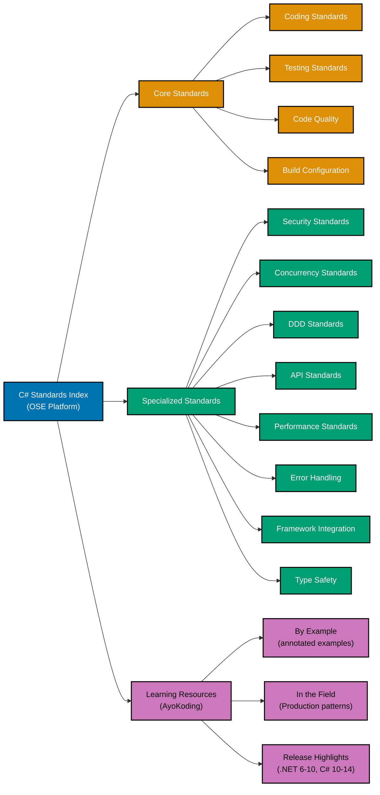

# C

**This is THE authoritative reference** for C# coding standards in OSE Platform.

All C# code written for the OSE Platform MUST comply with the standards documented here. These standards are mandatory, not optional. Non-compliance blocks code review and merge approval.

## Framework Stack

OSE Platform C# applications MUST use the following stack:

**Primary Framework**:

- **ASP.NET Core 8** (LTS) for web APIs and backend services
- **Entity Framework Core 8** for ORM and database access
- **Blazor** for interactive web UI components (where applicable)
- **SignalR** for real-time communication (WebSocket-based)

**Testing Stack**:

- **xUnit** (preferred) for unit and integration tests
- **FluentAssertions** for readable, expressive assertions
- **Moq** for interface mocking and test doubles
- **Bogus** for realistic fake test data generation
- **TestContainers.Net** for database integration tests (no mocked repositories)
- **Microsoft.AspNetCore.Mvc.Testing** (WebApplicationFactory) for API integration tests

**Build Tools**:

- **dotnet CLI** (primary): `dotnet build`, `dotnet test`, `dotnet publish`
- **MSBuild** for advanced build orchestration
- **NuGet** for package management
- **Directory.Build.props** for shared project settings across the solution
- **Directory.Packages.props** for centralized package version management
- **global.json** for SDK version pinning
- **Nx** for monorepo management (cross-project dependencies)

**Code Quality Tools**:

- **Roslyn Analyzers** (Microsoft.CodeAnalysis.NetAnalyzers) - built-in static analysis
- **dotnet format** - code formatting enforcement
- **.editorconfig** - editor and formatting rules
- **SonarAnalyzer.CSharp** - bug detection and code smell identification
- **Coverlet** - code coverage measurement
- **ReportGenerator** - coverage report generation

**.NET Version Strategy**:

- **Baseline**: .NET 6 LTS (minimum supported, maintenance mode)
- **Recommended**: .NET 8 LTS (MUST use for new projects) - performance, native AOT, C# 12
- **Current**: .NET 9 (short-term support) - C# 13, Task.WhenEach, LINQ improvements
- **Upcoming**: .NET 10 LTS (C# 14, planned 2025) - collection extensions, params improvements

**See**: [Programming Language Documentation Separation Convention](../../../../../governance/conventions/structure/programming-language-docs-separation.md) for C#-specific release documentation location

## Prerequisite Knowledge

**REQUIRED**: This documentation assumes you have completed the AyoKoding C# learning path. These are **OSE Platform-specific style guides**, not educational tutorials.

**You MUST understand C# fundamentals before using these standards:**

- **[C# Learning Path](../../../../../apps/ayokoding-web/content/en/learn/software-engineering/programming-languages/c-sharp/)** - Complete 0-95% language coverage
- **[C# By Example](../../../../../apps/ayokoding-web/content/en/learn/software-engineering/programming-languages/c-sharp/by-example/)** - Annotated code examples (beginner to advanced)

**What this documentation covers**: OSE Platform naming conventions, framework choices, repository-specific patterns, how to apply C# knowledge in THIS codebase.

**What this documentation does NOT cover**: C# syntax, language fundamentals, generic patterns (those are in ayokoding-web).

**See**: [Programming Language Documentation Separation Convention](../../../../../governance/conventions/structure/programming-language-docs-separation.md) for content separation rules.

## Software Engineering Principles

C# development in OSE Platform enforces foundational software engineering principles:

1. **[Automation Over Manual](../../../../../governance/principles/software-engineering/automation-over-manual.md)** - MUST automate through Roslyn analyzers, `dotnet format`, `dotnet test`, NuGet restore, CI/CD pipelines, Coverlet coverage measurement, and code generation via Source Generators

2. **[Explicit Over Implicit](../../../../../governance/principles/software-engineering/explicit-over-implicit.md)** - MUST enforce explicitness through `#nullable enable` for nullable reference types, explicit DI registration lifetimes (Singleton/Scoped/Transient), explicit `async/await` throughout call chains, explicit `CancellationToken` propagation, and file-scoped namespaces that match folder structure

3. **[Immutability Over Mutability](../../../../../governance/principles/software-engineering/immutability.md)** - MUST use `record` types for value objects and DTOs (structural equality, `with` expressions), `init`-only properties, `IReadOnlyList<T>` and `IReadOnlyDictionary<T,V>` for exposed collections, and `readonly struct` for small value types

4. **[Pure Functions Over Side Effects](../../../../../governance/principles/software-engineering/pure-functions.md)** - MUST implement functional core/imperative shell architecture, pure domain logic without side effects, LINQ for collection transformations, and testable business logic isolated from ASP.NET Core infrastructure and EF Core I/O

5. **[Reproducibility First](../../../../../governance/principles/software-engineering/reproducibility.md)** - MUST ensure reproducibility through `global.json` for SDK version pinning, `Directory.Packages.props` for centralized NuGet version management, `packages.lock.json` for lockfile-based restores, and `.editorconfig` for deterministic formatting

## .NET Version Strategy

OSE Platform follows a three-tier .NET versioning strategy aligned with Microsoft's LTS cadence:

**.NET 6 LTS (Baseline - Minimum Supported)**:

- Maintenance mode; no new projects should target .NET 6
- Minimal APIs introduced, C# 10 (record structs, global using, file-scoped namespaces)
- Required for legacy service compatibility only

**.NET 8 LTS (Recommended - REQUIRED for new projects)**:

- All new OSE Platform C# projects MUST target .NET 8 LTS
- C# 12: primary constructors, collection expressions, `ref readonly` parameters, alias any type
- Native AOT compilation for CLI tools and serverless functions
- `FrozenDictionary<TKey,TValue>` for immutable high-performance lookups
- Keyed DI services for multiple implementations of the same interface
- `TimeProvider` abstraction for testable time-dependent code
- `IExceptionHandler` for structured global exception handling in ASP.NET Core
- Data Protection API improvements, OpenAPI (Swagger) built-in improvements

**.NET 9 (Current - Short-Term Support)**:

- C# 13: `params` collections, `allows ref struct` generic constraint, `\e` escape sequence
- `Task.WhenEach` for processing tasks as they complete
- LINQ: `CountBy`, `AggregateBy`, `Index` new extension methods
- `SearchValues<string>` for high-performance string set membership
- `HybridCache` in ASP.NET Core (L1+L2 cache abstraction)
- JSON serialization improvements (nullable annotations, indented option)

**.NET 10 LTS (Upcoming - C# 14)**:

- Planned LTS release; new projects started after GA SHOULD use .NET 10
- C# 14: collection extensions, `params` improvements (planned)
- .NET MAUI improvements, Blazor enhancements

**Unlike Go's 6-month cadence**: .NET follows an annual release cycle with every other release being LTS (Long-Term Support, 3 years). OSE Platform targets LTS releases for production services; STS releases for experimental features and tooling.

**See**: C# release highlights documentation (when available) for detailed feature documentation

## OSE Platform Coding Standards (Authoritative)

**MUST follow these mandatory standards for all C# code in OSE Platform:**

1. **[Coding Standards](coding-standards.md)** - Naming conventions, namespace organization, C# 12 idioms, anti-patterns
2. **[Testing Standards](testing-standards.md)** - xUnit, FluentAssertions, Moq, TestContainers.Net, WebApplicationFactory
3. **[Code Quality Standards](code-quality-standards.md)** - Roslyn analyzers, dotnet format, .editorconfig, nullable reference types
4. **[Build Configuration](build-configuration.md)** - .csproj SDK-style, Directory.Build.props, NuGet Central Package Management
5. **[Error Handling Standards](error-handling-standards.md)** - Exception hierarchy, ProblemDetails, Result pattern, global middleware
6. **[Concurrency Standards](concurrency-standards.md)** - async/await, CancellationToken, Channel<T>, Parallel.ForEachAsync
7. **[Performance Standards](performance-standards.md)** - Span<T>, ArrayPool<T>, BenchmarkDotNet, dotnet-trace profiling
8. **[Security Standards](security-standards.md)** - Data Protection API, JWT, FluentValidation, CORS, secrets management
9. **[API Standards](api-standards.md)** - Controller-based vs Minimal API, versioning, OpenAPI, CQRS with MediatR
10. **[DDD Standards](ddd-standards.md)** - Value Objects with records, Aggregate roots, Domain Events, Clean Architecture
11. **[Framework Integration](framework-integration.md)** - ASP.NET Core DI, EF Core configuration, SignalR, middleware pipeline
12. **[Type Safety Standards](type-safety-standards.md)** - Nullable reference types, generics, discriminated unions, pattern matching

## Documentation Structure

### Quick Reference

**Mandatory Standards (All C# Developers MUST follow)**:

1. [Coding Standards](coding-standards.md) - Naming, namespace structure, C# 12 idioms compliance
2. [Testing Standards](testing-standards.md) - xUnit, FluentAssertions, coverage requirements
3. [Code Quality Standards](code-quality-standards.md) - Roslyn analyzers, dotnet format, nullable reference types

**Context-Specific Standards (Apply when relevant)**:

- **Security**: [Security Standards](security-standards.md) - JWT, CORS, secrets for user-facing services
- **Concurrency**: [Concurrency Standards](concurrency-standards.md) - async/await, CancellationToken for asynchronous code
- **Domain Modeling**: [DDD Standards](ddd-standards.md) - records, aggregates, value objects for business domains
- **APIs**: [API Standards](api-standards.md) - REST conventions, versioning for HTTP endpoints
- **Performance**: [Performance Standards](performance-standards.md) - Span<T>, profiling for optimization
- **Error Handling**: [Error Handling Standards](error-handling-standards.md) - ProblemDetails, Result pattern for resilience
- **Build**: [Build Configuration](build-configuration.md) - .csproj, NuGet Central Package Management
- **Framework**: [Framework Integration](framework-integration.md) - ASP.NET Core DI, EF Core for web services
- **Type Safety**: [Type Safety Standards](type-safety-standards.md) - Nullable reference types, generics, pattern matching

### Documentation Organization

## Primary Use Cases in OSE Platform

**Backend Services**:

- RESTful APIs for Sharia-compliant business operations MUST use ASP.NET Core 8 with Controller-based or Minimal API patterns
- GraphQL endpoints for complex domain queries SHOULD use Hot Chocolate or Strawberry Shake
- gRPC services for internal microservice communication MAY use `Grpc.AspNetCore`
- Event-driven services MUST use MediatR for in-process domain event dispatch, and MassTransit or Azure Service Bus for cross-service messaging

**Enterprise Integration**:

- Zakat calculation engines MUST implement pure domain services with no ASP.NET Core infrastructure dependencies
- Murabaha contract processing MUST use transactional EF Core DbContext with explicit `SaveChangesAsync` boundaries
- Compliance and audit trail MUST use domain events published via MediatR `INotification` with persistent event store
- Financial reporting MUST use read models with CQRS separation (queries bypass EF Core write models)

**Business Logic**:

- Sharia-compliant calculation engines MUST use `decimal` arithmetic (never `float` or `double` for money)
- Complex validation rules MUST use FluentValidation with explicit rule chains
- Financial transaction processing MUST enforce transactional boundaries at the application service layer
- Multi-currency support MUST use `Money` value objects with explicit `Currency` types

## Reproducible Builds and Automation

**Version Management (REQUIRED)**:

- MUST use `global.json` to pin the .NET SDK version (e.g., `"version": "8.0.404"`) at solution root
- MUST use Directory.Build.props with `<TargetFramework>net8.0</TargetFramework>` and shared analyzer configuration
- SHOULD use MISE/asdf with `.tool-versions` OR winget/choco manifests for local dotnet SDK version management
- MUST NOT rely on ambient system-installed .NET SDK without version verification

**Dependency Management (REQUIRED)**:

- MUST use `Directory.Packages.props` (NuGet Central Package Management) to declare all package versions in one place
- MUST set `<RestorePackagesWithLockFile>true</RestorePackagesWithLockFile>` and commit `packages.lock.json`
- SHOULD use `<ManagePackageVersionsCentrally>true</ManagePackageVersionsCentrally>` to enforce centralized versioning
- MUST NOT reference packages with floating versions (e.g., `*` or `1.0.*`) in production projects
- MUST run `dotnet restore --locked-mode` in CI/CD to enforce lockfile integrity

**Automated Quality (REQUIRED)**:

- MUST enable `<Nullable>enable</Nullable>` and `<ImplicitUsings>enable</ImplicitUsings>` in all projects
- MUST set `<TreatWarningsAsErrors>true</TreatWarningsAsErrors>` in CI builds
- MUST use `dotnet format --verify-no-changes` in CI/CD (format violations fail the build)
- MUST include `Microsoft.CodeAnalysis.NetAnalyzers` for Roslyn static analysis
- SHOULD include `SonarAnalyzer.CSharp` for additional code smell detection
- MUST achieve >=95% line coverage measured with Coverlet and enforced by `rhino-cli test-coverage validate`

**Testing Automation (REQUIRED)**:

- MUST write unit tests with xUnit (Fact/Theory attributes, AAA pattern)
- MUST use FluentAssertions for all assertions (`result.Should().Be(expected)`)
- MUST use TestContainers.Net for database integration tests (no mocked DbContext for repository tests)
- MUST use WebApplicationFactory for ASP.NET Core integration tests
- SHOULD use Bogus for generating realistic domain test data (Zakat payer profiles, Murabaha contract data)
- SHOULD use Moq for mocking external dependencies and application service interfaces

**Build Automation (REQUIRED)**:

- MUST integrate `dotnet format`, `dotnet build`, and `dotnet test` in CI/CD pipeline
- SHOULD use Makefile or Taskfile for local development build tasks
- MUST collect Coverlet coverage and enforce threshold with `rhino-cli test-coverage validate`
- SHOULD use pre-commit hooks for `dotnet format` and analyzer validation

**See**: [Automation Over Manual](../../../../../governance/principles/software-engineering/automation-over-manual.md), [Reproducibility First](../../../../../governance/principles/software-engineering/reproducibility.md)

## Integration with Repository Governance

**Development Practices**:

- [Functional Programming](../../../../../governance/development/pattern/functional-programming.md) - MUST follow FP principles for domain logic (pure functions, immutability with records)
- [Implementation Workflow](../../../../../governance/development/workflow/implementation.md) - MUST follow "make it work → make it right → make it fast" process
- [Code Quality Standards](../../../../../governance/development/quality/code.md) - MUST meet platform-wide quality requirements
- [Commit Messages](../../../../../governance/development/workflow/commit-messages.md) - MUST use Conventional Commits format

**Code Review Requirements**:

- All C# code MUST pass automated checks (`dotnet format --verify-no-changes`, `dotnet build /p:TreatWarningsAsErrors=true`, `dotnet test`, Coverlet coverage >=95% enforced by `rhino-cli test-coverage validate`)
- Code reviewers MUST verify compliance with standards in this index
- Non-compliance with mandatory standards (Coding, Testing, Code Quality) blocks merge
- Nullable reference type warnings treated as errors MUST be resolved before merge

## Related Documentation

**Software Engineering Principles**:

- [Automation Over Manual](../../../../../governance/principles/software-engineering/automation-over-manual.md)
- [Explicit Over Implicit](../../../../../governance/principles/software-engineering/explicit-over-implicit.md)
- [Immutability Over Mutability](../../../../../governance/principles/software-engineering/immutability.md)
- [Pure Functions Over Side Effects](../../../../../governance/principles/software-engineering/pure-functions.md)
- [Reproducibility First](../../../../../governance/principles/software-engineering/reproducibility.md)

**Development Practices**:

- [Functional Programming](../../../../../governance/development/pattern/functional-programming.md)
- [Maker-Checker-Fixer Pattern](../../../../../governance/development/pattern/maker-checker-fixer.md)

**Platform Documentation**:

- [Tech Stack Languages Index](../README.md)
- [Monorepo Structure](../../../../reference/monorepo-structure.md)

---

**Status**: Authoritative Standard (Mandatory Compliance)

**.NET Version**: .NET 6 (minimum), .NET 8 LTS (recommended), .NET 9 (current STS)
**C# Version**: C# 10 (minimum), C# 12 (recommended with .NET 8), C# 13 (.NET 9)
**Framework Stack**: ASP.NET Core 8, EF Core 8, xUnit, FluentAssertions, Moq, TestContainers.Net
**Maintainers**: Platform Architecture Team
