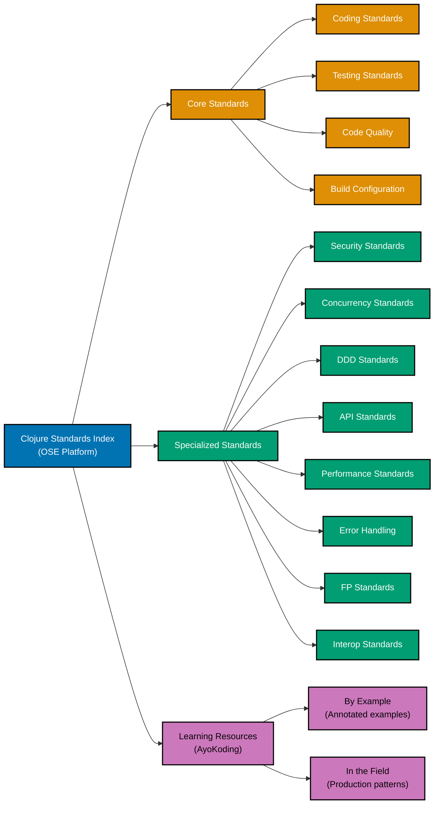

# Clojure

**This is THE authoritative reference** for Clojure coding standards in OSE Platform.

All Clojure code written for the OSE Platform MUST comply with the standards documented here. These standards are mandatory, not optional. Non-compliance blocks code review and merge approval.

## Framework Stack

OSE Platform Clojure applications MUST use the following stack:

**Build and Dependency Management**:

- `deps.edn` + `tools.deps` (modern, preferred) for dependency and classpath management
- `tools.build` with `build.clj` for building JARs and uberjars
- Leiningen (`project.clj`) for legacy projects and ecosystem compatibility
- Babashka for scripting build tasks and automation

**HTTP and Web**:

- **Ring** - HTTP server abstraction (request/response maps, middleware)
- **Reitit** - Data-driven routing (vector-based, preferred for new projects)
- **Compojure** - Macro-based routing (legacy, still widely used)
- **Pedestal** - Full HTTP framework for structured services
- **Muuntaja** - Content negotiation and format transformation (JSON, Transit, EDN)
- **Cheshire** - JSON serialization and deserialization

**Database**:

- **next.jdbc** - Modern JDBC wrapper (primary, preferred over clojure.java.jdbc)
- **HugSQL** / **HoneySQL** - SQL generation (data-driven query building)

**System Lifecycle**:

- **Integrant** - Data-driven system lifecycle management (preferred)
- **Mount** - State management with defstate (alternative)
- **Component** - Stuart Sierra's component library (mature, widely adopted)

**Testing Stack**:

- `clojure.test` (built-in) for unit and integration tests
- **Midje** for BDD-style `fact`/`facts` assertions
- **test.check** for property-based (generative) testing
- **cloverage** for code coverage measurement (>=95% required)

**Quality Tools**:

- **clj-kondo** - Static analysis and linting (MANDATORY, run in CI and pre-commit)
- **cljfmt** - Code formatting (MANDATORY, enforced in pre-commit hooks)
- **Eastwood** - Additional linting for reflection warnings and code smells
- **zprint** - Alternative formatter (optional, consistent with cljfmt)

**Clojure Version Strategy**:

- **1.10** (minimum supported) - Clojure spec, improved errors, REPL enhancements
- **1.11** (recommended) - `clojure.math`, `update-keys`/`update-vals`, keyword args from maps
- **1.12** (latest, RECOMMENDED for new projects) - Method values, array class syntax, Java interop improvements

**See**: [Programming Language Documentation Separation Convention](../../../../../governance/conventions/structure/programming-language-docs-separation.md) for Clojure-specific documentation location

## Prerequisite Knowledge

**REQUIRED**: This documentation assumes you have completed the AyoKoding Clojure learning path. These are **OSE Platform-specific style guides**, not educational tutorials.

**You MUST understand Clojure fundamentals before using these standards:**

- **[Clojure Learning Path](../../../../../apps/ayokoding-web/content/en/learn/software-engineering/programming-languages/clojure/)** - Complete language coverage
- **[Clojure By Example](../../../../../apps/ayokoding-web/content/en/learn/software-engineering/programming-languages/clojure/by-example/)** - Annotated code examples (beginner to advanced)

**What this documentation covers**: OSE Platform naming conventions, framework choices, repository-specific patterns, how to apply Clojure knowledge in THIS codebase.

**What this documentation does NOT cover**: Clojure syntax, language fundamentals, REPL basics, S-expression syntax (those are in ayokoding-web).

**See**: [Programming Language Documentation Separation Convention](../../../../../governance/conventions/structure/programming-language-docs-separation.md) for content separation rules.

## Software Engineering Principles

Clojure development in OSE Platform enforces foundational software engineering principles. Clojure's design **naturally enforces** many of these principles through immutable persistent data structures, pure functions as the default, and the functional programming model:

1. **[Automation Over Manual](../../../../../governance/principles/software-engineering/automation-over-manual.md)** - MUST automate through `clj-kondo` linting, `cljfmt` formatting, `cloverage` coverage measurement, `tools.build` for artifact creation, and CI/CD integration for all quality gates

2. **[Explicit Over Implicit](../../../../../governance/principles/software-engineering/explicit-over-implicit.md)** - MUST enforce explicitness through namespaced keywords (`:zakat/amount`), explicit namespace aliases in `require`, `ex-info` with structured data maps for errors, explicit system lifecycle with Integrant configuration, and `s/def` specs as explicit domain contracts

3. **[Immutability Over Mutability](../../../../../governance/principles/software-engineering/immutability.md)** - Clojure's persistent data structures (lists, vectors, maps, sets) are **immutable by default**. MUST leverage this natural immutability: use `assoc`/`dissoc`/`update` to produce new maps rather than mutating state, reserve atoms/refs/agents for intentional shared mutable state, and prefer pure data transformation pipelines

4. **[Pure Functions Over Side Effects](../../../../../governance/principles/software-engineering/pure-functions.md)** - Clojure's functional core encourages pure functions by default. MUST implement functional core/imperative shell architecture: pure domain functions (zakat calculation, contract validation) isolated from I/O (database, HTTP), side-effecting functions marked with `!` suffix, and REPL-testable pure functions

5. **[Reproducibility First](../../../../../governance/principles/software-engineering/reproducibility.md)** - MUST ensure reproducibility through `deps.edn` with exact dependency coordinates and SHA hashes, committed `deps.lock` files (where applicable), pinned JVM version in `.tool-versions` or `.sdkmanrc`, and deterministic builds via `tools.build`

## Clojure Version Strategy

OSE Platform follows a three-tier Clojure versioning strategy:

**Clojure 1.10 (Minimum - Required)**:

- All projects MUST support Clojure 1.10 as the minimum
- `clojure.spec.alpha` for data validation and domain contracts
- Improved error messages with `clojure.main/ex-triage`
- REPL preloads and socket REPL support

**Clojure 1.11 (Recommended)**:

- Projects SHOULD migrate to Clojure 1.11 when feasible
- `clojure.math` namespace (math functions without Java interop)
- `update-keys` and `update-vals` for map transformations
- Keyword arguments from maps in function calls
- `parse-long`, `parse-double` convenience functions

**Clojure 1.12 (Latest - Recommended for new projects)**:

- New projects SHOULD use Clojure 1.12 for the latest stable features
- Method values: `String/toUpperCase` as first-class functions
- Array class syntax: `String/1` for single-element arrays
- `add-lib` and `add-libs` for dynamic dependency loading in REPL
- Improved Java interop with functional interfaces as Clojure functions
- `clojure.java.process` namespace for process management
- Stream reduction improvements

**See**: [Clojure Release Notes](https://clojure.org/releases/devchangelog) for detailed feature documentation

## OSE Platform Coding Standards (Authoritative)

**MUST follow these mandatory standards for all Clojure code in OSE Platform:**

1. **[Coding Standards](./coding-standards.md)** - Naming conventions, namespace organization, REPL-driven development, threading macros, destructuring
2. **[Testing Standards](./testing-standards.md)** - clojure.test, Midje, test.check, cloverage, REPL-based test running
3. **[Code Quality Standards](./code-quality-standards.md)** - clj-kondo configuration, cljfmt formatting, Eastwood linting
4. **[Build Configuration](./build-configuration.md)** - deps.edn structure, tools.build, Leiningen, Babashka scripting
5. **[Error Handling Standards](./error-handling-standards.md)** - ex-info, structured error data, try/catch patterns, Result-like maps
6. **[Concurrency Standards](./concurrency-standards.md)** - Atoms, refs with STM, agents, core.async channels
7. **[Performance Standards](./performance-standards.md)** - Lazy sequences, transducers, type hints, criterium benchmarking, memoize
8. **[Security Standards](./security-standards.md)** - Input validation with spec, parameterized queries, buddy authentication, secrets management
9. **[API Standards](./api-standards.md)** - Ring handlers, Reitit routing, middleware composition, content negotiation, REST conventions
10. **[DDD Standards](./ddd-standards.md)** - Data-driven domain modeling, records, protocols, multimethods, Clojure specs as invariants
11. **[Functional Programming Standards](./functional-programming-standards.md)** - Transducers, threading macros, higher-order functions, macros for DSLs
12. **[Interop Standards](./interop-standards.md)** - Java interop syntax, type hints, collection conversion, doto macro

## Documentation Structure

### Quick Reference

**Mandatory Standards (All Clojure Developers MUST follow)**:

1. [Coding Standards](./coding-standards.md) - Naming, namespace structure, REPL-driven development
2. [Testing Standards](./testing-standards.md) - clojure.test, coverage requirements, property-based testing
3. [Code Quality Standards](./code-quality-standards.md) - clj-kondo configuration, formatting rules

**Context-Specific Standards (Apply when relevant)**:

- **Security**: [Security Standards](./security-standards.md) - Input validation, JWT for user-facing services
- **Concurrency**: [Concurrency Standards](./concurrency-standards.md) - Atoms, STM, core.async for concurrent code
- **Domain Modeling**: [DDD Standards](./ddd-standards.md) - Data-driven design for business domains
- **APIs**: [API Standards](./api-standards.md) - Ring/Reitit patterns for web services
- **Performance**: [Performance Standards](./performance-standards.md) - Transducers, type hints, benchmarking when needed
- **Error Handling**: [Error Handling Standards](./error-handling-standards.md) - ex-info, structured errors
- **Functional Programming**: [FP Standards](./functional-programming-standards.md) - Transducers, higher-order functions, macros
- **Build**: [Build Configuration](./build-configuration.md) - deps.edn, tools.build for project setup
- **Java Interop**: [Interop Standards](./interop-standards.md) - JVM library integration

### Documentation Organization

## Primary Use Cases in OSE Platform

**Financial Rule Engines**:

- Zakat calculation engines MUST use Clojure for pure functional rule evaluation
- Murabaha and Ijarah contract pricing logic SHOULD use Clojure for immutable data pipelines
- Sharia compliance rule engines MAY use Clojure's multimethod dispatch for open-closed rule sets
- Financial domain validation MUST use `clojure.spec.alpha` for contract invariants

**Data Transformation Pipelines**:

- ETL pipelines MUST use Clojure's lazy sequences and transducers for memory-efficient processing
- Data enrichment workflows SHOULD use threading macros (`->>`) for readable transformation chains
- Reporting and aggregation MAY use `reducers` or `core.async` for parallel processing
- Configuration-driven transformations SHOULD use Clojure's data-driven approach (EDN config driving pipeline shape)

**Functional Microservices**:

- REST API services MUST use Ring + Reitit for HTTP handling
- System lifecycle MUST use Integrant for dependency injection via configuration
- Background processing workers SHOULD use core.async channels for task queues
- Inter-service communication MAY use Transit format for Clojure-native serialization

## Reproducible Builds and Automation

**Version Management (REQUIRED)**:

- MUST use `deps.edn` with exact Maven coordinates and SHA-based git dependencies
- SHOULD use MISE/asdf with `.tool-versions` OR SDKMAN with `.sdkmanrc` for JVM version pinning
- MUST pin JVM version (OpenJDK 17+ LTS recommended, OpenJDK 21 LTS preferred)
- MUST NOT rely on system-installed Java without version verification

**Dependency Management (REQUIRED)**:

- MUST use `deps.edn` for dependency declarations with exact version coordinates
- SHOULD use `:git/sha` for git dependencies to ensure reproducibility
- MUST use `:mvn/version` with specific version strings (no LATEST or RELEASE)
- SHOULD run `clojure -P` (prepare) in CI/CD to download all dependencies before build

**Automated Quality (REQUIRED)**:

- MUST use `clj-kondo` for linting (configured in `.clj-kondo/config.edn`)
- MUST use `cljfmt` for code formatting (enforced in pre-commit hooks)
- SHOULD use `Eastwood` for additional static analysis (reflection warnings, misuse detection)
- MUST achieve >=95% test coverage for domain logic (measured with `cloverage`)
- SHOULD enable `*warn-on-reflection*` in development to catch unintentional reflection

**Testing Automation (REQUIRED)**:

- MUST write unit tests with `clojure.test` (`deftest`/`testing`/`is`/`are`)
- SHOULD use `test.check` for property-based testing of domain invariants
- MAY use Midje for BDD-style `fact`/`facts` assertions on complex business rules
- MUST run tests via REPL during development (REPL-driven development)
- SHOULD use `cloverage` for coverage measurement and enforce >=95% threshold

**Build Automation (REQUIRED)**:

- MUST use `tools.build` (`build.clj`) for building JAR and uberjar artifacts
- SHOULD use Babashka scripts for build task automation (`bb.edn`)
- MUST integrate `clj-kondo` and `cljfmt` checks in CI/CD pipeline
- SHOULD use pre-commit hooks for `cljfmt` formatting and `clj-kondo` linting

**See**: [Automation Over Manual](../../../../../governance/principles/software-engineering/automation-over-manual.md), [Reproducibility First](../../../../../governance/principles/software-engineering/reproducibility.md)

## Integration with Repository Governance

**Development Practices**:

- [Functional Programming](../../../../../governance/development/pattern/functional-programming.md) - MUST follow FP principles for domain logic (Clojure naturally enforces these)
- [Implementation Workflow](../../../../../governance/development/workflow/implementation.md) - MUST follow "make it work → make it right → make it fast" process, leveraging REPL for interactive iteration
- [Code Quality Standards](../../../../../governance/development/quality/code.md) - MUST meet platform-wide quality requirements
- [Commit Messages](../../../../../governance/development/workflow/commit-messages.md) - MUST use Conventional Commits format

**Code Review Requirements**:

- All Clojure code MUST pass automated checks (`clj-kondo`, `cljfmt`, `cloverage` >=95% for domain logic)
- Code reviewers MUST verify compliance with standards in this index
- Non-compliance with mandatory standards (Coding, Testing, Code Quality) blocks merge
- Reflection warnings MUST be resolved (use type hints or suppress intentionally)

## Related Documentation

**Software Engineering Principles**:

- [Automation Over Manual](../../../../../governance/principles/software-engineering/automation-over-manual.md)
- [Explicit Over Implicit](../../../../../governance/principles/software-engineering/explicit-over-implicit.md)
- [Immutability Over Mutability](../../../../../governance/principles/software-engineering/immutability.md)
- [Pure Functions Over Side Effects](../../../../../governance/principles/software-engineering/pure-functions.md)
- [Reproducibility First](../../../../../governance/principles/software-engineering/reproducibility.md)

**Development Practices**:

- [Functional Programming](../../../../../governance/development/pattern/functional-programming.md)
- [Maker-Checker-Fixer Pattern](../../../../../governance/development/pattern/maker-checker-fixer.md)

**Platform Documentation**:

- [Tech Stack Languages Index](../README.md)
- [Monorepo Structure](../../../../reference/monorepo-structure.md)

---

**Status**: Authoritative Standard (Mandatory Compliance)

**Clojure Version**: 1.10 (minimum), 1.11 (recommended), 1.12 (latest, recommended for new projects)
**Framework Stack**: Ring, Reitit, next.jdbc, Integrant, clj-kondo, cljfmt, deps.edn
**Maintainers**: Platform Architecture Team
