# F

**This is THE authoritative reference** for F# coding standards in OSE Platform.

All F# code written for the OSE Platform MUST comply with the standards documented here. These standards are mandatory, not optional. Non-compliance blocks code review and merge approval.

## Framework Stack

OSE Platform F# applications MUST use the following stack:

**Web Frameworks**:

- **Giraffe** - Functional ASP.NET Core wrapper; HttpHandler composition with the fish operator (`>=>`)
- **Saturn** - Opinionated layer on top of Giraffe; `controller {}` and `application {}` computation expressions
- **SAFE Stack** - Full-stack functional web stack (Saturn + Azure + Fable + Elmish) for rich client applications
- **Falco** - Lightweight alternative with minimal dependencies for simple HTTP services

**Testing Stack**:

- **Expecto** - F#-native test framework with `testList` / `testCase` / `testProperty`
- **FsCheck** - Property-based testing (port of Haskell's QuickCheck)
- **FsUnit** - F# DSL for NUnit / xUnit assertions
- **Unquote** - Quotation-based assertions with readable failure messages

**Quality Tools**:

- **Fantomas** - F# code formatter (MANDATORY — zero negotiation)
- **FSharpLint** - Style linter for F# conventions
- **dotnet format** - SDK-integrated formatter invoker
- **.editorconfig** - Editor-agnostic indentation and style rules

**Build Tools**:

- **dotnet CLI** (primary): `dotnet build`, `dotnet test`, `dotnet publish`
- **.fsproj** - SDK-style project file (FILE ORDER MATTERS — F# compiler processes files top-to-bottom)
- **FAKE** - F# Make; F#-native build scripting (optional, for complex pipelines)
- **Paket** - Alternative package manager with `paket.dependencies` + `paket.lock` (opt-in per project)

**Coverage**:

- **Coverlet** - Cross-platform coverage collection integrated with `dotnet test`
- **ReportGenerator** - HTML coverage reports from Coverlet output
- **AltCover** - Alternative coverage engine with fine-grained instrumentation

**F# Version Strategy**:

- **Minimum**: F# 6 (MUST use minimum) — computation expressions for `task {}`, anonymous record updates
- **Recommended**: F# 8 / .NET 8 LTS (SHOULD use for production) — current LTS, improved type inference, `_.Property` shorthand
- **Latest**: F# 9 / .NET 9 (RECOMMENDED for new projects) — nullable reference type integration, lock expression, improved `use!` in CEs

**See**: [Programming Language Documentation Separation Convention](../../../../../governance/conventions/structure/programming-language-docs-separation.md) for F#-specific release documentation location

## Prerequisite Knowledge

**REQUIRED**: This documentation assumes you have completed the AyoKoding F# learning path. These are **OSE Platform-specific style guides**, not educational tutorials.

**You MUST understand F# fundamentals before using these standards:**

- **[F# Learning Path](../../../../../apps/ayokoding-web/content/en/learn/software-engineering/programming-languages/f-sharp/)** - Complete language coverage from basics to advanced
- **[F# By Example](../../../../../apps/ayokoding-web/content/en/learn/software-engineering/programming-languages/f-sharp/by-example/)** - Annotated code examples covering discriminated unions, computation expressions, and more

**What this documentation covers**: OSE Platform naming conventions, framework choices, repository-specific patterns, how to apply F# knowledge in THIS codebase.

**What this documentation does NOT cover**: F# syntax, language fundamentals, discriminated union semantics, computation expression mechanics (those are in ayokoding-web).

**See**: [Programming Language Documentation Separation Convention](../../../../../governance/conventions/structure/programming-language-docs-separation.md) for content separation rules.

## Software Engineering Principles

F# development in OSE Platform enforces foundational software engineering principles. F# naturally enforces most of them — the language design makes compliance the path of least resistance:

1. **[Automation Over Manual](../../../../../governance/principles/software-engineering/automation-over-manual.md)** - MUST automate through Fantomas formatting, FSharpLint, `dotnet test`, Coverlet coverage collection, and CI/CD integration. F# `dotnet` tooling integrates directly with Nx via project targets.

2. **[Explicit Over Implicit](../../../../../governance/principles/software-engineering/explicit-over-implicit.md)** - MUST enforce explicitness through explicit type annotations on public APIs, explicit `Result` and `Option` return types (no null), explicit module qualification, and explicit Fantomas configuration in `.fantomasrc`.

3. **[Immutability Over Mutability](../../../../../governance/principles/software-engineering/immutability.md)** - F# enforces this BY DEFAULT. All `let` bindings are immutable. Record types are immutable. MUST NOT use `mutable` except at proven hot paths with documented justification. The compiler is your enforcement mechanism.

4. **[Pure Functions Over Side Effects](../../../../../governance/principles/software-engineering/pure-functions.md)** - MUST implement functional core / imperative shell. Domain logic (Zakat calculations, Murabaha pricing, Nisab thresholds) MUST be pure functions. I/O, database access, and HTTP calls live at the shell. F# `Result` and `Async` types make the boundary visible.

5. **[Reproducibility First](../../../../../governance/principles/software-engineering/reproducibility.md)** - MUST ensure reproducibility through `global.json` for SDK pinning, `.fsproj` with exact NuGet version constraints, `packages.lock.json` for lockfile enforcement (`RestoreLockedMode=true`), and `Directory.Build.props` for shared settings across the workspace.

## F# Version Strategy

OSE Platform follows a three-tier F# versioning strategy aligned with .NET LTS releases:

**F# 6 / .NET 6 (Minimum - REQUIRED)**:

- All projects MUST support F# 6 as minimum baseline
- `task {}` computation expression (native Task interop without Async wrapping)
- Anonymous record type updates (`{ record with Field = newValue }`)
- `_` (underscore) discard pattern in `use` bindings
- Struct discriminated unions for performance-critical value types

**F# 8 / .NET 8 LTS (Recommended - SHOULD use)**:

- Projects SHOULD target F# 8 / .NET 8 for production workloads (.NET 8 LTS supported until November 2026)
- `_.Property` shorthand for lambda expressions (`fun x -> x.Name` becomes `_.Name`)
- Improved type inference for generic functions
- Enhanced pattern matching exhaustiveness checking
- `[<TailCall>]` attribute for enforced tail recursion (compiler error if not tail-recursive)
- Nested record field update syntax

**F# 9 / .NET 9 (Latest - RECOMMENDED for new projects)**:

- New projects SHOULD use F# 9 / .NET 9 for the latest stable features
- Nullable reference type integration (F# types interoperate cleanly with C# NRT APIs)
- `lock` expression as first-class expression (cleaner than `lock obj (fun () -> ...)`)
- Improved `use!` semantics in computation expressions
- Dictionary expression literals
- Partial active patterns returning `voption` for zero-allocation matching

**Unlike Go**: .NET follows an annual release cycle with LTS releases every two years. F# version numbers track .NET SDK versions. The platform strategy is: target the current LTS for stability, adopt latest features on new projects.

**See**: [F# Learning Path](../../../../../apps/ayokoding-web/content/en/learn/software-engineering/programming-languages/f-sharp/) for detailed feature documentation

## OSE Platform Coding Standards (Authoritative)

**MUST follow these mandatory standards for all F# code in OSE Platform:**

1. **[Coding Standards](coding-standards.md)** - Naming conventions, module organization, pipeline idioms, discriminated unions
2. **[Testing Standards](testing-standards.md)** - Expecto, FsCheck property-based testing, coverage requirements
3. **[Code Quality Standards](code-quality-standards.md)** - Fantomas (mandatory), FSharpLint, compiler warnings as errors
4. **[Build Configuration](build-configuration.md)** - .fsproj structure, file ordering, Paket, FAKE, global.json
5. **[Error Handling Standards](error-handling-standards.md)** - Railway-oriented programming, Result type, FsToolkit patterns
6. **[Concurrency Standards](concurrency-standards.md)** - Async workflows, MailboxProcessor actor model, Task interop
7. **[Performance Standards](performance-standards.md)** - Tail recursion, struct DUs, BenchmarkDotNet, AltCover
8. **[Security Standards](security-standards.md)** - Type-driven validation, Giraffe auth, parameterized queries
9. **[API Standards](api-standards.md)** - Giraffe HttpHandler composition, Saturn controllers, JSON serialization
10. **[DDD Standards](ddd-standards.md)** - Domain modeling with DUs, value objects as records, aggregate pattern
11. **[Functional Programming Standards](functional-programming-standards.md)** - Computation expressions, monadic composition, applicative validation
12. **[Type Safety Standards](type-safety-standards.md)** - Making illegal states unrepresentable, units of measure, single-case DUs

## Documentation Structure

### Quick Reference

**Mandatory Standards (All F# Developers MUST follow)**:

1. [Coding Standards](coding-standards.md) - Naming, module structure, pipeline operator
2. [Testing Standards](testing-standards.md) - Expecto framework, FsCheck, coverage >=95%
3. [Code Quality Standards](code-quality-standards.md) - Fantomas formatting, exhaustive pattern matching

**Context-Specific Standards (Apply when relevant)**:

- **Error Handling**: [Error Handling Standards](error-handling-standards.md) - Result type, railway-oriented programming
- **Concurrency**: [Concurrency Standards](concurrency-standards.md) - Async workflows, MailboxProcessor for concurrent code
- **Domain Modeling**: [DDD Standards](ddd-standards.md) - DU-driven domain modeling for Sharia finance rules
- **APIs**: [API Standards](api-standards.md) - Giraffe/Saturn HTTP patterns for web services
- **Performance**: [Performance Standards](performance-standards.md) - Tail recursion, profiling when needed
- **Security**: [Security Standards](security-standards.md) - Type-driven validation, auth middleware
- **Type Safety**: [Type Safety Standards](type-safety-standards.md) - Units of measure, single-case DUs, type providers
- **Functional Patterns**: [Functional Programming Standards](functional-programming-standards.md) - CEs, composition, applicative validation
- **Build**: [Build Configuration](build-configuration.md) - .fsproj ordering, Paket, Directory.Build.props

### Documentation Organization

```mermaid
%% Color Palette: Blue #0173B2, Orange #DE8F05, Teal #029E73, Purple #CC78BC
%% All colors are color-blind friendly and meet WCAG AA contrast standards

graph TD
    A["F# Standards Index<br/>(OSE Platform)"]:::blue
    B["Core Standards"]:::orange
    C["Specialized Standards"]:::teal
    D["Learning Resources<br/>(AyoKoding)"]:::purple

    A --> B
    A --> C
    A --> D

    B --> E["Coding Standards"]:::orange
    B --> F["Testing Standards"]:::orange
    B --> G["Code Quality"]:::orange
    B --> H["Build Configuration"]:::orange

    C --> I["Error Handling<br/>(Railway-Oriented)"]:::teal
    C --> J["Concurrency<br/>(Async / MailboxProcessor)"]:::teal
    C --> K["DDD Standards<br/>(DU Domain Modeling)"]:::teal
    C --> L["API Standards<br/>(Giraffe / Saturn)"]:::teal
    C --> M["Performance Standards"]:::teal
    C --> N["Security Standards"]:::teal
    C --> O["Type Safety<br/>(Units of Measure)"]:::teal
    C --> P["Functional Programming<br/>(Computation Expressions)"]:::teal

    D --> Q["By Example<br/>(Annotated examples)"]:::purple
    D --> R["In the Field<br/>(Production patterns)"]:::purple

    classDef blue fill:#0173B2,stroke:#000000,color:#FFFFFF,stroke-width:2px
    classDef orange fill:#DE8F05,stroke:#000000,color:#FFFFFF,stroke-width:2px
    classDef teal fill:#029E73,stroke:#000000,color:#FFFFFF,stroke-width:2px
    classDef purple fill:#CC78BC,stroke:#000000,color:#000000,stroke-width:2px
```

## Primary Use Cases in OSE Platform

**Financial Domain Computation**:

- Zakat calculation engines MUST use F# for type-safe, pure function arithmetic
- Nisab threshold evaluation SHOULD use discriminated unions to model all valid states
- Murabaha and Musharakah pricing rules SHOULD use F# units of measure to prevent currency confusion
- Audit trail computation MUST use immutable record chains — F# records are immutable by default

**DSLs for Sharia Finance Rules**:

- Sharia compliance rule engines SHOULD be modeled as discriminated union state machines
- Fatwa-derived computation rules SHOULD use computation expressions for readable, sequential logic
- Halal screening criteria SHOULD use active patterns for extensible, named matching logic
- Type providers SHOULD be used to integrate Sharia finance data feeds (JSON, XML, SQL) safely

**Functional Microservices**:

- HTTP microservices MUST use Giraffe or Saturn with HttpHandler composition
- Event-driven services SHOULD use MailboxProcessor actors for message processing
- CQRS read models SHOULD use F# record projections from domain events
- SAFE Stack applications SHOULD share domain DU types between server (Saturn) and client (Fable)

## Reproducible Builds and Automation

**Version Management (REQUIRED)**:

- MUST use `global.json` with `sdk.version` to pin the exact .NET SDK version
- MUST use `.fsproj` with explicit `<TargetFramework>net8.0</TargetFramework>` (or net9.0)
- MUST enable `RestoreLockedMode` in `Directory.Build.props` for `packages.lock.json` enforcement
- SHOULD NOT rely on system-installed SDK without version verification

**Dependency Management (REQUIRED)**:

- MUST use NuGet with explicit version constraints in `.fsproj` (`<PackageReference Include="..." Version="x.y.z" />`)
- MUST commit `packages.lock.json` and enable `RestoreLockedMode=true` for hermetic restores
- SHOULD use `dotnet list package --outdated` regularly to track dependency drift
- MAY use Paket (`paket.dependencies` + `paket.lock`) for projects requiring fine-grained transitive control

**Automated Quality (REQUIRED)**:

- MUST use Fantomas for code formatting — zero manual formatting debates
- MUST configure `.fantomasrc` in project root for consistent settings
- SHOULD use FSharpLint for additional style enforcement
- MUST set `<TreatWarningsAsErrors>true</TreatWarningsAsErrors>` in `.fsproj`
- MUST enable exhaustive pattern match warnings (enabled by default — never suppress)
- MUST achieve >=95% line coverage measured with Coverlet and enforced by `rhino-cli test-coverage validate`

**Testing Automation (REQUIRED)**:

- MUST write tests with Expecto (`testList` / `testCase` / `testProperty`)
- MUST use FsCheck for property-based testing of domain logic (Zakat calculation invariants, etc.)
- SHOULD use FsUnit DSL assertions when xUnit / NUnit integration is required
- SHOULD test pure functions directly without test doubles
- MUST avoid test doubles for pure domain functions — test them directly with inputs and expected outputs

**Build Automation (REQUIRED)**:

- MUST use `dotnet build`, `dotnet test`, `dotnet publish` as primary build commands
- SHOULD use FAKE build scripts for complex multi-step pipelines
- MUST integrate Nx project targets for monorepo cross-project dependency tracking
- SHOULD use pre-commit hooks for Fantomas formatting (Husky + lint-staged)

**See**: [Automation Over Manual](../../../../../governance/principles/software-engineering/automation-over-manual.md), [Reproducibility First](../../../../../governance/principles/software-engineering/reproducibility.md)

## Integration with Repository Governance

**Development Practices**:

- [Functional Programming](../../../../../governance/development/pattern/functional-programming.md) - F# naturally aligns; MUST follow functional core / imperative shell
- [Implementation Workflow](../../../../../governance/development/workflow/implementation.md) - MUST follow "make it work → make it right → make it fast" process
- [Code Quality Standards](../../../../../governance/development/quality/code.md) - MUST meet platform-wide quality requirements
- [Commit Messages](../../../../../governance/development/workflow/commit-messages.md) - MUST use Conventional Commits format

**Code Review Requirements**:

- All F# code MUST pass automated checks (Fantomas, `dotnet test`, coverage >=95% enforced by `rhino-cli test-coverage validate`)
- Code reviewers MUST verify Fantomas formatting compliance (CI should enforce this automatically)
- Non-compliance with mandatory standards (Coding, Testing, Code Quality) blocks merge
- Incomplete pattern match warnings MUST be resolved before merge — never suppressed with `#nowarn`

## Related Documentation

**Software Engineering Principles**:

- [Automation Over Manual](../../../../../governance/principles/software-engineering/automation-over-manual.md)
- [Explicit Over Implicit](../../../../../governance/principles/software-engineering/explicit-over-implicit.md)
- [Immutability Over Mutability](../../../../../governance/principles/software-engineering/immutability.md)
- [Pure Functions Over Side Effects](../../../../../governance/principles/software-engineering/pure-functions.md)
- [Reproducibility First](../../../../../governance/principles/software-engineering/reproducibility.md)

**Development Practices**:

- [Functional Programming](../../../../../governance/development/pattern/functional-programming.md)
- [Maker-Checker-Fixer Pattern](../../../../../governance/development/pattern/maker-checker-fixer.md)

**Platform Documentation**:

- [Tech Stack Languages Index](../README.md)
- [Monorepo Structure](../../../../reference/monorepo-structure.md)

---

**Status**: Authoritative Standard (Mandatory Compliance)

**F# Version**: F# 6 (minimum), F# 8 / .NET 8 LTS (recommended), F# 9 / .NET 9 (latest)
**Framework Stack**: Giraffe, Saturn, Expecto, FsCheck, Fantomas, dotnet CLI
**Maintainers**: Platform Architecture Team
