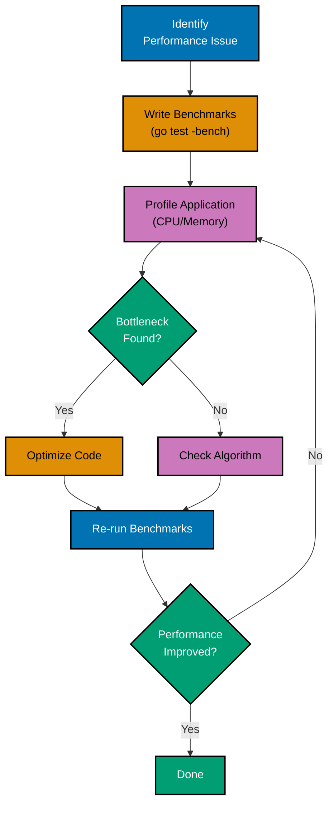
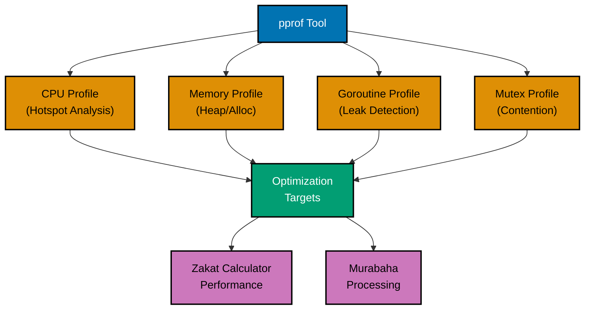
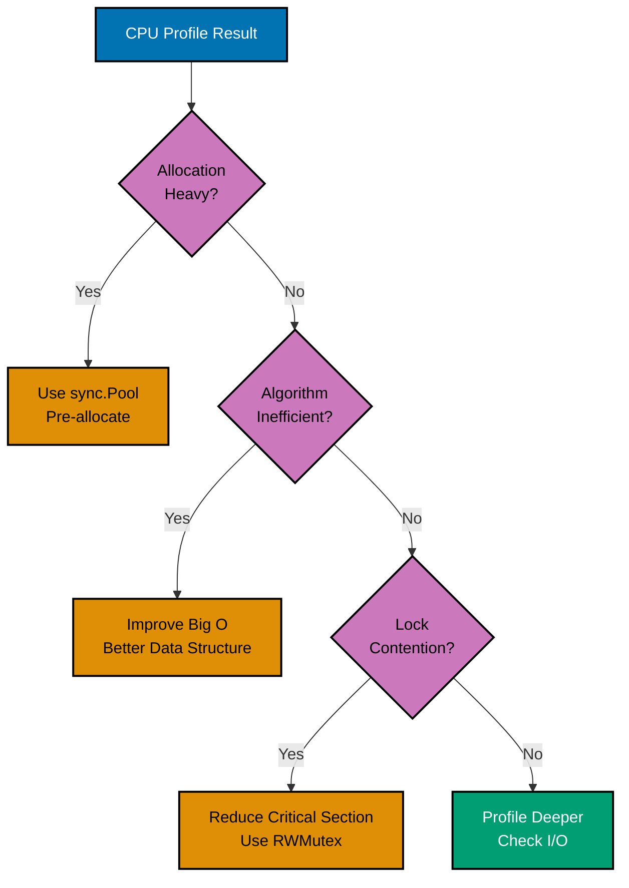
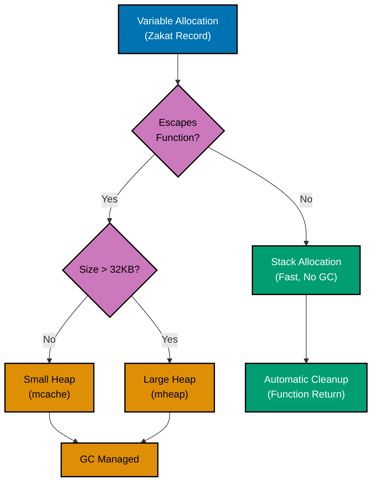
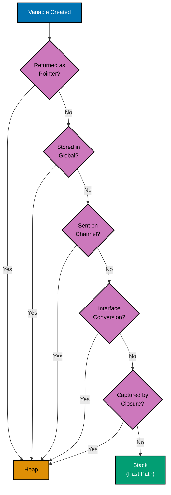
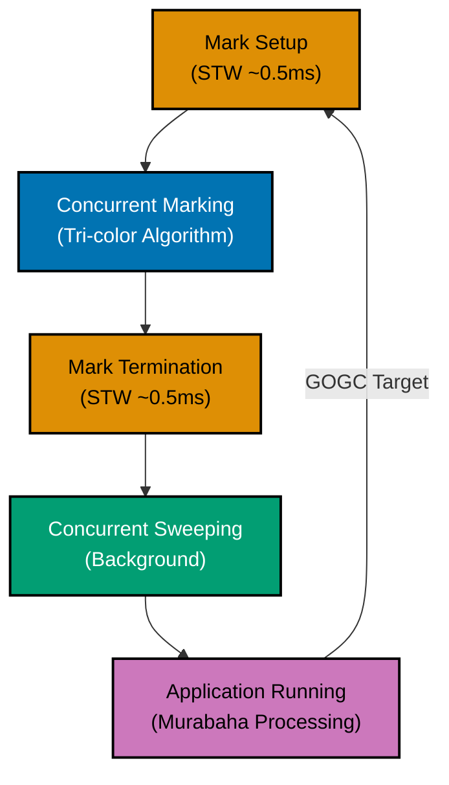

# Go Performance Standards

**Quick Reference**: [Prerequisite Knowledge](#prerequisite-knowledge) | [Purpose](#purpose) | [Performance Optimization](#part-1-performance-optimization) | [Memory Management](#part-2-memory-management)

## Prerequisite Knowledge

**REQUIRED**: You MUST understand Go fundamentals from [AyoKoding Go Learning Path](../../../../../apps/ayokoding-web/content/en/learn/software-engineering/programming-languages/golang/_index.md) before using these standards.

**This document is OSE Platform-specific**, not a Go tutorial. This document assumes you have completed:

- Go syntax and basic programming concepts
- Functions, methods, and interfaces
- Slices, maps, and channels
- Goroutines and basic concurrency

Without this foundational knowledge, you will struggle to apply these performance standards effectively.

## Purpose

This document defines **authoritative performance standards** for Go development in the OSE Platform. These are prescriptive rules for writing performant, memory-efficient code that MUST be followed for production applications.

**Target Audience**: OSE Platform Go developers optimizing for performance

**Scope**: Benchmarking, profiling, memory optimization, garbage collection tuning, escape analysis, and performance patterns

**Compliance**: Code reviews MUST verify adherence to these standards for performance-critical paths.

---

## Part 1: Performance Optimization

## Performance Fundamentals

### Understanding Performance Metrics

Key metrics for Go applications:

```go
package main

import (
 "fmt"
 "runtime"
 "time"
)

func main() {
 // CPU usage
 fmt.Printf("NumCPU: %d\n", runtime.NumCPU())
 fmt.Printf("GOMAXPROCS: %d\n", runtime.GOMAXPROCS(0))

 // Memory statistics
 var m runtime.MemStats
 runtime.ReadMemStats(&m)
 fmt.Printf("Alloc: %d MB\n", m.Alloc/1024/1024)
 fmt.Printf("TotalAlloc: %d MB\n", m.TotalAlloc/1024/1024)
 fmt.Printf("Sys: %d MB\n", m.Sys/1024/1024)
 fmt.Printf("NumGC: %d\n", m.NumGC)

 // Goroutines
 fmt.Printf("NumGoroutine: %d\n", runtime.NumGoroutine())

 // Timing operations
 start := time.Now()
 // ... operation ...
 duration := time.Since(start)
 fmt.Printf("Duration: %v\n", duration)
}
```

### Big O Complexity

Understanding algorithmic complexity:

```go
package main

import "fmt"

// O(1) - Constant time
func getFirst(slice []int) int {
 return slice[0]
}

// O(n) - Linear time
func sum(slice []int) int {
 total := 0
 for _, v := range slice {
  total += v
 }
 return total
}

// O(n²) - Quadratic time
func findDuplicates(slice []int) []int {
 var duplicates []int
 for i := 0; i < len(slice); i++ {
  for j := i + 1; j < len(slice); j++ {
   if slice[i] == slice[j] {
    duplicates = append(duplicates, slice[i])
   }
  }
 }
 return duplicates
}

// O(log n) - Logarithmic time
func binarySearch(sorted []int, target int) int {
 left, right := 0, len(sorted)-1
 for left <= right {
  mid := (left + right) / 2
  if sorted[mid] == target {
   return mid
  } else if sorted[mid] < target {
   left = mid + 1
  } else {
   right = mid - 1
  }
 }
 return -1
}

func main() {
 data := []int{1, 2, 3, 4, 5, 5, 6}
 fmt.Println(getFirst(data))
 fmt.Println(sum(data))
 fmt.Println(findDuplicates(data))
 fmt.Println(binarySearch(data, 4))
}
```

### Latency Numbers

Understanding system latencies:

```go
package main

import (
 "fmt"
 "time"
)

func demonstrateLatencies() {
 // L1 cache reference: ~0.5 ns
 // L2 cache reference: ~7 ns
 // Main memory reference: ~100 ns

 // Measure memory access
 data := make([]int, 1000000)
 start := time.Now()
 for i := range data {
  data[i] = i
 }
 fmt.Printf("Sequential memory access: %v\n", time.Since(start))

 // Network round trip (localhost): ~1 ms
 // Network round trip (same datacenter): ~5 ms
 // Network round trip (cross-country): ~50 ms

 // Disk operations
 // SSD sequential read: ~1 GB/s
 // SSD random read: ~200 MB/s
 // HDD sequential read: ~100 MB/s
 // HDD random read: ~1 MB/s
}
```

## Benchmarking

### Writing Benchmarks

**REQUIRED**: All performance-critical functions MUST have benchmarks.

Basic benchmark structure:

```go
package stringops

import (
 "strings"
 "testing"
)

// Function to benchmark
func Concat(strs []string) string {
 var result string
 for _, s := range strs {
  result += s
 }
 return result
}

func ConcatBuilder(strs []string) string {
 var builder strings.Builder
 for _, s := range strs {
  builder.WriteString(s)
 }
 return builder.String()
}

// Benchmark functions start with Benchmark
func BenchmarkConcat(b *testing.B) {
 strs := []string{"hello", "world", "foo", "bar"}

 // Reset timer to exclude setup
 b.ResetTimer()

 for i := 0; i < b.N; i++ {
  _ = Concat(strs)
 }
}

func BenchmarkConcatBuilder(b *testing.B) {
 strs := []string{"hello", "world", "foo", "bar"}
 b.ResetTimer()

 for i := 0; i < b.N; i++ {
  _ = ConcatBuilder(strs)
 }
}

// Run with: go test -bench=. -benchmem
```

### Benchmark Options

Using benchmark flags effectively:

```go
package main

import (
 "testing"
)

// Run specific benchmark
// go test -bench=BenchmarkFoo

// Run all benchmarks
// go test -bench=.

// Run with memory stats
// go test -bench=. -benchmem

// Run for specific time
// go test -bench=. -benchtime=10s

// Run with specific count
// go test -bench=. -count=5

// Run with CPU profiling
// go test -bench=. -cpuprofile=cpu.prof

// Run with memory profiling
// go test -bench=. -memprofile=mem.prof

func BenchmarkExample(b *testing.B) {
 // Benchmark code
 for i := 0; i < b.N; i++ {
  _ = i * 2
 }
}
```

### Sub-Benchmarks

Organizing related benchmarks:

```go
package main

import (
 "strings"
 "testing"
)

func BenchmarkStringOperations(b *testing.B) {
 data := []string{"hello", "world", "foo", "bar", "baz"}

 b.Run("Concat", func(b *testing.B) {
  for i := 0; i < b.N; i++ {
   var result string
   for _, s := range data {
    result += s
   }
  }
 })

 b.Run("Join", func(b *testing.B) {
  for i := 0; i < b.N; i++ {
   _ = strings.Join(data, "")
  }
 })

 b.Run("Builder", func(b *testing.B) {
  for i := 0; i < b.N; i++ {
   var builder strings.Builder
   for _, s := range data {
    builder.WriteString(s)
   }
   _ = builder.String()
  }
 })
}

// Output:
// BenchmarkStringOperations/Concat
// BenchmarkStringOperations/Join
// BenchmarkStringOperations/Builder
```

### Benchmark Memory Reporting

**REQUIRED**: Memory-sensitive code MUST report allocations.

Analyzing memory allocations:

```go
package main

import (
 "testing"
)

func makeSlice() []int {
 return make([]int, 1000)
}

func makeSliceWithCapacity() []int {
 s := make([]int, 0, 1000)
 for i := 0; i < 1000; i++ {
  s = append(s, i)
 }
 return s
}

func BenchmarkMakeSlice(b *testing.B) {
 b.ReportAllocs()  // Report allocations per operation

 for i := 0; i < b.N; i++ {
  _ = makeSlice()
 }
}

func BenchmarkMakeSliceWithCapacity(b *testing.B) {
 b.ReportAllocs()

 for i := 0; i < b.N; i++ {
  _ = makeSliceWithCapacity()
 }
}

// Output shows:
// BenchmarkMakeSlice-8           500000   3000 ns/op   8192 B/op   1 allocs/op
// BenchmarkMakeSliceWithCapacity-8   1000000   1000 ns/op   8192 B/op   1 allocs/op
```

### Benchmark Setup and Cleanup

Managing benchmark state:

```go
package main

import (
 "database/sql"
 "testing"
)

func BenchmarkDatabaseQuery(b *testing.B) {
 // Setup: runs once
 db, err := sql.Open("postgres", "connection_string")
 if err != nil {
  b.Fatal(err)
 }
 defer db.Close()

 // Reset timer to exclude setup
 b.ResetTimer()

 // Benchmark loop
 for i := 0; i < b.N; i++ {
  // Stop timer for per-iteration setup
  b.StopTimer()
  // ... per-iteration setup ...
  b.StartTimer()

  // Actual operation to benchmark
  _, _ = db.Query("SELECT * FROM users")
 }

 // Cleanup happens via defer
}

func BenchmarkWithRunParallel(b *testing.B) {
 // Setup
 data := make([]int, 1000)
 for i := range data {
  data[i] = i
 }

 b.ResetTimer()

 // Run benchmark in parallel
 b.RunParallel(func(pb *testing.PB) {
  for pb.Next() {
   // Operation to benchmark
   sum := 0
   for _, v := range data {
    sum += v
   }
  }
 })
}
```

## Profiling with pprof

### Performance Profiling Workflow



### Enabling Profiling

**REQUIRED**: Production applications MUST expose pprof endpoints for diagnostics.

Setting up pprof in your application:

```go
package main

import (
 "log"
 "net/http"
 _ "net/http/pprof"  // Import for side effects
 "time"
)

func main() {
 // Start profiling server
 go func() {
  log.Println("Profiling server on :6060")
  log.Println(http.ListenAndServe("localhost:6060", nil))
 }()

 // Your application code
 for {
  doWork()
  time.Sleep(100 * time.Millisecond)
 }
}

func doWork() {
 // Simulate work
 data := make([]byte, 1024*1024)
 for i := range data {
  data[i] = byte(i)
 }
}

// Access profiles:
// http://localhost:6060/debug/pprof/
// http://localhost:6060/debug/pprof/heap
// http://localhost:6060/debug/pprof/goroutine
// http://localhost:6060/debug/pprof/profile?seconds=30
```

### Programmatic Profiling

Creating profiles programmatically:

```go
package main

import (
 "log"
 "os"
 "runtime"
 "runtime/pprof"
 "time"
)

func main() {
 // CPU profiling
 cpuFile, err := os.Create("cpu.prof")
 if err != nil {
  log.Fatal(err)
 }
 defer cpuFile.Close()

 if err := pprof.StartCPUProfile(cpuFile); err != nil {
  log.Fatal(err)
 }
 defer pprof.StopCPUProfile()

 // Your application code
 doWork()

 // Memory profiling
 memFile, err := os.Create("mem.prof")
 if err != nil {
  log.Fatal(err)
 }
 defer memFile.Close()

 runtime.GC()  // Get up-to-date statistics
 if err := pprof.WriteHeapProfile(memFile); err != nil {
  log.Fatal(err)
 }

 // Goroutine profiling
 goroutineFile, err := os.Create("goroutine.prof")
 if err != nil {
  log.Fatal(err)
 }
 defer goroutineFile.Close()

 if err := pprof.Lookup("goroutine").WriteTo(goroutineFile, 0); err != nil {
  log.Fatal(err)
 }
}

func doWork() {
 for i := 0; i < 1000000; i++ {
  _ = fibonacci(20)
 }
}

func fibonacci(n int) int {
 if n <= 1 {
  return n
 }
 return fibonacci(n-1) + fibonacci(n-2)
}
```

### Analyzing Profiles

#### Profile Types and Tools



Using pprof tool:

```bash
# Analyze CPU profile
go tool pprof cpu.prof

# Interactive commands in pprof:
# top - show top functions by CPU time
# top10 - show top 10 functions
# list funcName - show source code with annotations
# web - open visualization in browser (requires graphviz)
# pdf - generate PDF visualization
# png - generate PNG visualization

# Analyze memory profile
go tool pprof mem.prof

# Compare profiles (before and after optimization)
go tool pprof -base=old.prof new.prof

# Web interface
go tool pprof -http=:8080 cpu.prof

# Fetch profile from running server
go tool pprof http://localhost:6060/debug/pprof/profile?seconds=30

# Memory profile from running server
go tool pprof http://localhost:6060/debug/pprof/heap
```

## CPU Profiling

### CPU Profile Example

Identifying CPU hotspots:

```go
package main

import (
 "log"
 "os"
 "runtime/pprof"
)

func main() {
 // Create CPU profile
 f, err := os.Create("cpu.prof")
 if err != nil {
  log.Fatal(err)
 }
 defer f.Close()

 if err := pprof.StartCPUProfile(f); err != nil {
  log.Fatal(err)
 }
 defer pprof.StopCPUProfile()

 // CPU-intensive operations
 result := processData()
 log.Printf("Result: %d\n", result)
}

func processData() int {
 sum := 0
 for i := 0; i < 10000000; i++ {
  sum += expensiveCalculation(i)
 }
 return sum
}

func expensiveCalculation(n int) int {
 // Simulate expensive operation
 result := 0
 for i := 0; i < 100; i++ {
  result += n * i
 }
 return result
}

// Analyze with:
// go tool pprof cpu.prof
// (pprof) top
// (pprof) list expensiveCalculation
```

### Optimizing Based on CPU Profile

#### Optimization Decision Tree



Before and after optimization:

```go
package main

// BEFORE: Inefficient
func sumSlowBefore(data []int) int {
 sum := 0
 for i := 0; i < len(data); i++ {
  sum += data[i]
 }
 return sum
}

// AFTER: Optimized (though difference is minimal in this simple case)
func sumOptimized(data []int) int {
 sum := 0
 // Range is slightly more efficient
 for _, v := range data {
  sum += v
 }
 return sum
}

// BEFORE: String concatenation in loop
func buildStringBefore(n int) string {
 result := ""
 for i := 0; i < n; i++ {
  result += "a"
 }
 return result
}

// AFTER: Use strings.Builder
import "strings"

func buildStringAfter(n int) string {
 var builder strings.Builder
 builder.Grow(n)  // Pre-allocate
 for i := 0; i < n; i++ {
  builder.WriteString("a")
 }
 return builder.String()
}

// BEFORE: Repeated map lookups
func processBefore(data map[string]int, keys []string) int {
 sum := 0
 for _, key := range keys {
  if _, ok := data[key]; ok {
   sum += data[key]  // Double lookup
  }
 }
 return sum
}

// AFTER: Single lookup
func processAfter(data map[string]int, keys []string) int {
 sum := 0
 for _, key := range keys {
  if val, ok := data[key]; ok {
   sum += val  // Single lookup
  }
 }
 return sum
}
```

## Memory Profiling

### Memory Profile Example

Tracking memory allocations:

```go
package main

import (
 "log"
 "os"
 "runtime"
 "runtime/pprof"
)

func main() {
 // Your application code
 data := generateData()
 log.Printf("Generated %d items\n", len(data))

 // Force GC to get accurate profile
 runtime.GC()

 // Create memory profile
 f, err := os.Create("mem.prof")
 if err != nil {
  log.Fatal(err)
 }
 defer f.Close()

 if err := pprof.WriteHeapProfile(f); err != nil {
  log.Fatal(err)
 }
}

func generateData() [][]byte {
 var data [][]byte
 for i := 0; i < 1000; i++ {
  // Each allocation visible in profile
  data = append(data, make([]byte, 1024*1024))
 }
 return data
}

// Analyze with:
// go tool pprof mem.prof
// (pprof) top
// (pprof) list generateData
// (pprof) web
```

### Memory Profile Types

Different memory profile views:

```go
package main

import (
 "runtime/pprof"
)

func analyzeMemoryProfiles() {
 // Heap profile (default)
 // Shows current live objects
 pprof.Lookup("heap")

 // Allocation profile
 // Shows all allocations since program start
 pprof.Lookup("allocs")

 // Stack trace that led to blocking on synchronization primitives
 pprof.Lookup("block")

 // Goroutine profile
 pprof.Lookup("goroutine")

 // Mutex contention profile
 pprof.Lookup("mutex")

 // Thread creation profile
 pprof.Lookup("threadcreate")
}

// View different samples:
// go tool pprof -alloc_space mem.prof  # Total allocations
// go tool pprof -alloc_objects mem.prof  # Number of allocations
// go tool pprof -inuse_space mem.prof  # Live objects (default)
// go tool pprof -inuse_objects mem.prof  # Live object count
```

### Reducing Allocations

**REQUIRED**: High-throughput code MUST minimize allocations.

Strategies to minimize allocations:

```go
package main

import (
 "fmt"
 "sync"
)

// BEFORE: Allocates on every call
func processItemBefore(item string) []byte {
 buffer := make([]byte, 1024)
 // ... use buffer ...
 return buffer
}

// AFTER: Use sync.Pool to reuse buffers
var bufferPool = sync.Pool{
 New: func() interface{} {
  return make([]byte, 1024)
 },
}

func processItemAfter(item string) []byte {
 buffer := bufferPool.Get().([]byte)
 defer bufferPool.Put(buffer)
 // ... use buffer ...
 return buffer
}

// BEFORE: Interface conversion allocates
func sumInterface(items []interface{}) int {
 sum := 0
 for _, item := range items {
  sum += item.(int)  // Allocation for interface boxing
 }
 return sum
}

// AFTER: Use concrete type
func sumConcrete(items []int) int {
 sum := 0
 for _, item := range items {
  sum += item  // No allocation
 }
 return sum
}

// BEFORE: Escape to heap
func createUser(name string) *Beneficiary {
 u := Beneficiary{Name: name}  // Escapes to heap
 return &u
}

// AFTER: Return value (stack allocation when possible)
func createUserValue(name string) Beneficiary {
 return Beneficiary{Name: name}  // Stack allocation
}

type Beneficiary struct {
 Name string
}

func main() {
 fmt.Println("Memory optimization examples")
}
```

## Goroutine Profiling

### Detecting Goroutine Leaks

Identifying leaked goroutines:

```go
package main

import (
 "fmt"
 "net/http"
 _ "net/http/pprof"
 "runtime"
 "time"
)

func main() {
 // Enable profiling
 go func() {
  http.ListenAndServe("localhost:6060", nil)
 }()

 // Leak goroutines
 for i := 0; i < 100; i++ {
  go leakyGoroutine()
 }

 // Monitor goroutine count
 ticker := time.NewTicker(time.Second)
 for range ticker.C {
  fmt.Printf("Goroutines: %d\n", runtime.NumGoroutine())
 }
}

// BAD: Goroutine never exits
func leakyGoroutine() {
 ch := make(chan int)
 <-ch  // Blocks forever
}

// GOOD: Goroutine with timeout
func goodGoroutine() {
 ch := make(chan int)
 select {
 case <-ch:
  return
 case <-time.After(time.Second):
  return  // Exit after timeout
 }
}

// View goroutines:
// curl http://localhost:6060/debug/pprof/goroutine?debug=2
// go tool pprof http://localhost:6060/debug/pprof/goroutine
```

### Goroutine Profile Analysis

Understanding goroutine states:

```go
package main

import (
 "context"
 "fmt"
 "runtime"
 "time"
)

func main() {
 ctx, cancel := context.WithCancel(context.Background())
 defer cancel()

 // Start workers
 for i := 0; i < 10; i++ {
  go worker(ctx, i)
 }

 // Monitor
 time.Sleep(5 * time.Second)
 fmt.Printf("Active goroutines: %d\n", runtime.NumGoroutine())

 // Cancel and wait
 cancel()
 time.Sleep(time.Second)
 fmt.Printf("After cancel: %d\n", runtime.NumGoroutine())
}

func worker(ctx context.Context, id int) {
 ticker := time.NewTicker(100 * time.Millisecond)
 defer ticker.Stop()

 for {
  select {
  case <-ticker.C:
   // Do work
  case <-ctx.Done():
   fmt.Printf("Worker %d exiting\n", id)
   return
  }
 }
}

// Goroutine states in profile:
// - Running: executing
// - Runnable: waiting for CPU
// - Waiting: blocked (channel, lock, syscall, etc.)
// - Syscall: in system call
// - Dead: exited
```

## Blocking Profiling

### Block Profile

Identifying synchronization bottlenecks:

```go
package main

import (
 "fmt"
 "log"
 "net/http"
 _ "net/http/pprof"
 "runtime"
 "sync"
 "time"
)

func main() {
 // Enable block profiling
 runtime.SetBlockProfileRate(1)  // Capture all blocking events

 // Start profiling server
 go func() {
  log.Println(http.ListenAndServe("localhost:6060", nil))
 }()

 // Create contention
 var mu sync.Mutex
 for i := 0; i < 10; i++ {
  go func() {
   for {
    mu.Lock()
    time.Sleep(10 * time.Millisecond)  // Hold lock
    mu.Unlock()
   }
  }()
 }

 time.Sleep(10 * time.Second)
}

// Access block profile:
// go tool pprof http://localhost:6060/debug/pprof/block
// (pprof) top
// (pprof) list
```

### Reducing Blocking

Optimizing synchronization:

```go
package main

import (
 "sync"
)

// BEFORE: High contention
type CounterBefore struct {
 mu    sync.Mutex
 value int
}

func (c *CounterBefore) Increment() {
 c.mu.Lock()
 c.value++
 c.mu.Unlock()
}

// AFTER: Use sync/atomic
import "sync/atomic"

type CounterAfter struct {
 value int64
}

func (c *CounterAfter) Increment() {
 atomic.AddInt64(&c.value, 1)  // Lock-free
}

// BEFORE: Single lock for read-heavy workload
type CacheBefore struct {
 mu   sync.Mutex
 data map[string]string
}

func (c *CacheBefore) Get(key string) string {
 c.mu.Lock()
 defer c.mu.Unlock()
 return c.data[key]
}

// AFTER: Use RWMutex for read-heavy workload
type CacheAfter struct {
 mu   sync.RWMutex
 data map[string]string
}

func (c *CacheAfter) Get(key string) string {
 c.mu.RLock()  // Multiple readers allowed
 defer c.mu.RUnlock()
 return c.data[key]
}

// BETTER: Use sync.Map for concurrent access
type CacheBest struct {
 data sync.Map
}

func (c *CacheBest) Get(key string) (string, bool) {
 val, ok := c.data.Load(key)
 if !ok {
  return "", false
 }
 return val.(string), true
}

func (c *CacheBest) Set(key, value string) {
 c.data.Store(key, value)
}
```

## Mutex Profiling

### Mutex Contention Profile

Detecting mutex contention:

```go
package main

import (
 "log"
 "net/http"
 _ "net/http/pprof"
 "runtime"
 "sync"
 "time"
)

func main() {
 // Enable mutex profiling
 runtime.SetMutexProfileFraction(1)  // Sample 1% of mutex contention

 // Start profiling server
 go func() {
  log.Println(http.ListenAndServe("localhost:6060", nil))
 }()

 // Create contention
 var mu sync.Mutex
 var counter int

 for i := 0; i < 100; i++ {
  go func() {
   for {
    mu.Lock()
    counter++
    time.Sleep(time.Millisecond)
    mu.Unlock()
   }
  }()
 }

 time.Sleep(10 * time.Second)
}

// Access mutex profile:
// go tool pprof http://localhost:6060/debug/pprof/mutex
```

### Reducing Mutex Contention

**REQUIRED**: High-contention code MUST use sharding or lock-free alternatives.

Strategies to minimize contention:

```go
package main

import (
 "hash/fnv"
 "sync"
 "sync/atomic"
)

// Strategy 1: Sharding
type ShardedMap struct {
 shards []*mapShard
}

type mapShard struct {
 mu   sync.RWMutex
 data map[string]string
}

func NewShardedMap(shardCount int) *ShardedMap {
 sm := &ShardedMap{
  shards: make([]*mapShard, shardCount),
 }
 for i := 0; i < shardCount; i++ {
  sm.shards[i] = &mapShard{
   data: make(map[string]string),
  }
 }
 return sm
}

func (sm *ShardedMap) getShard(key string) *mapShard {
 h := fnv.New32a()
 h.Write([]byte(key))
 return sm.shards[h.Sum32()%uint32(len(sm.shards))]
}

func (sm *ShardedMap) Set(key, value string) {
 shard := sm.getShard(key)
 shard.mu.Lock()
 shard.data[key] = value
 shard.mu.Unlock()
}

func (sm *ShardedMap) Get(key string) (string, bool) {
 shard := sm.getShard(key)
 shard.mu.RLock()
 defer shard.mu.RUnlock()
 val, ok := shard.data[key]
 return val, ok
}

// Strategy 2: Use atomic operations
type AtomicCounter struct {
 value int64
}

func (c *AtomicCounter) Add(delta int64) {
 atomic.AddInt64(&c.value, delta)
}

func (c *AtomicCounter) Get() int64 {
 return atomic.LoadInt64(&c.value)
}

// Strategy 3: Lock-free data structures
type LockFreeStack struct {
 head atomic.Value
}

type node struct {
 value interface{}
 next  *node
}

func (s *LockFreeStack) Push(value interface{}) {
 n := &node{value: value}
 for {
  old := s.head.Load()
  n.next = old.(*node)
  if s.head.CompareAndSwap(old, n) {
   return
  }
 }
}
```

## Allocation Reduction

### Avoiding String Allocations

**REQUIRED**: String-heavy code MUST use strings.Builder.

Efficient string operations:

```go
package main

import (
 "strings"
 "unsafe"
)

// BEFORE: Creates new strings
func concatBefore(a, b, c string) string {
 return a + b + c  // Multiple allocations
}

// AFTER: Use strings.Builder
func concatAfter(a, b, c string) string {
 var builder strings.Builder
 builder.Grow(len(a) + len(b) + len(c))
 builder.WriteString(a)
 builder.WriteString(b)
 builder.WriteString(c)
 return builder.String()
}

// Zero-copy string to []byte (unsafe, read-only)
func stringToBytes(s string) []byte {
 return unsafe.Slice(unsafe.StringData(s), len(s))
}

// Zero-copy []byte to string (unsafe, read-only)
func bytesToString(b []byte) string {
 return unsafe.String(unsafe.SliceData(b), len(b))
}

// BEFORE: Allocates intermediate strings
func splitAndProcessBefore(s string) int {
 parts := strings.Split(s, ",")
 count := 0
 for _, part := range parts {
  if len(part) > 0 {
   count++
  }
 }
 return count
}

// AFTER: Use strings.Count (no allocation)
func splitAndProcessAfter(s string) int {
 if len(s) == 0 {
  return 0
 }
 return strings.Count(s, ",") + 1
}
```

### Avoiding Interface Allocations

Reducing interface boxing:

```go
package main

import "fmt"

// BEFORE: Interface boxing allocates
func sumInterface(items ...interface{}) int {
 sum := 0
 for _, item := range items {
  sum += item.(int)  // Unboxing
 }
 return sum
}

// AFTER: Use concrete types
func sumConcrete(items ...int) int {
 sum := 0
 for _, item := range items {
  sum += item  // No boxing/unboxing
 }
 return sum
}

// BEFORE: fmt.Sprintf allocates
func formatBefore(name string, age int) string {
 return fmt.Sprintf("%s is %d years old", name, age)
}

// AFTER: Use strings.Builder for complex formatting
import "strings"

func formatAfter(name string, age int) string {
 var builder strings.Builder
 builder.Grow(len(name) + 20)  // Estimate
 builder.WriteString(name)
 builder.WriteString(" is ")
 builder.WriteString(fmt.Sprint(age))  // Still allocates for int conversion
 builder.WriteString(" years old")
 return builder.String()
}

// BEST: Use strconv for primitive types
import "strconv"

func formatBest(name string, age int) string {
 var builder strings.Builder
 builder.Grow(len(name) + 20)
 builder.WriteString(name)
 builder.WriteString(" is ")
 builder.WriteString(strconv.Itoa(age))  // No reflection
 builder.WriteString(" years old")
 return builder.String()
}
```

## Garbage Collection Tuning

### GC Metrics

**REQUIRED**: Production applications MUST monitor GC metrics.

Monitoring garbage collection:

```go
package main

import (
 "fmt"
 "runtime"
 "time"
)

func printGCStats() {
 var stats runtime.MemStats
 runtime.ReadMemStats(&stats)

 fmt.Printf("GC Statistics:\n")
 fmt.Printf("  Alloc: %d MB\n", stats.Alloc/1024/1024)
 fmt.Printf("  TotalAlloc: %d MB\n", stats.TotalAlloc/1024/1024)
 fmt.Printf("  Sys: %d MB\n", stats.Sys/1024/1024)
 fmt.Printf("  NumGC: %d\n", stats.NumGC)
 fmt.Printf("  PauseTotalNs: %d ms\n", stats.PauseTotalNs/1000000)
 fmt.Printf("  Last Pause: %d ms\n", stats.PauseNs[(stats.NumGC+255)%256]/1000000)

 // GC Percentage (default 100)
 // GOGC=100 means GC when heap doubles
 // GOGC=200 means GC when heap triples
 // GOGC=off disables GC
}

func monitorGC() {
 ticker := time.NewTicker(time.Second)
 for range ticker.C {
  printGCStats()
 }
}
```

### GC Tuning Options

Configuring garbage collection:

```go
package main

import (
 "fmt"
 "os"
 "runtime"
 "runtime/debug"
)

func configureGC() {
 // Set GC percentage (default 100)
 // Higher = less frequent GC, more memory usage
 // Lower = more frequent GC, less memory usage
 debug.SetGCPercent(200)  // GC when heap doubles to 200%

 // Disable GC (use with caution)
 debug.SetGCPercent(-1)

 // Set memory limit (Go 1.19+)
 // Helps prevent OOM
 debug.SetMemoryLimit(1024 * 1024 * 1024)  // 1 GB

 // Environment variable
 // GOGC=200 go run main.go
 // GOMEMLIMIT=1GiB go run main.go

 // Get current GC settings
 gcPercent := debug.SetGCPercent(-1)  // Get without changing
 debug.SetGCPercent(gcPercent)        // Restore
 fmt.Printf("GC Percent: %d\n", gcPercent)

 // Force GC manually (use sparingly)
 runtime.GC()
}

// Read environment variable
func readGCConfig() {
 gogc := os.Getenv("GOGC")
 fmt.Printf("GOGC: %s\n", gogc)

 memlimit := os.Getenv("GOMEMLIMIT")
 fmt.Printf("GOMEMLIMIT: %s\n", memlimit)
}
```

### Reducing GC Pressure

**REQUIRED**: Long-lived services MUST minimize GC pressure.

Strategies to minimize GC work:

```go
package main

import (
 "sync"
)

// Strategy 1: Object pooling
var objectPool = sync.Pool{
 New: func() interface{} {
  return &Object{}
 },
}

type Object struct {
 Data [1024]byte
}

func usePooling() {
 obj := objectPool.Get().(*Object)
 defer objectPool.Put(obj)
 // Use obj
}

// Strategy 2: Pre-allocation
func preAllocate() {
 // Pre-allocate large slices
 data := make([]int, 0, 100000)
 for i := 0; i < 100000; i++ {
  data = append(data, i)
 }
}

// Strategy 3: Reuse buffers
type BufferManager struct {
 pool sync.Pool
}

func NewBufferManager(size int) *BufferManager {
 return &BufferManager{
  pool: sync.Pool{
   New: func() interface{} {
    return make([]byte, size)
   },
  },
 }
}

func (bm *BufferManager) Get() []byte {
 return bm.pool.Get().([]byte)
}

func (bm *BufferManager) Put(buf []byte) {
 bm.pool.Put(buf)
}

// Strategy 4: Avoid pointer-heavy structures
type DataBefore struct {
 Values []*int  // Many pointers = GC overhead
}

type DataAfter struct {
 Values []int  // No pointers = less GC work
}
```

## Compiler Optimizations

### Inlining

Understanding function inlining:

```go
package main

// Small functions are inlined automatically
func add(a, b int) int {
 return a + b  // Likely inlined
}

// Large functions are not inlined
func complexCalculation(a, b, c, d, e, f, g, h int) int {
 // Many operations
 result := a + b*c - d/e + f*g - h
 result = result * result
 return result % 1000
 // Not inlined due to size
}

// Prevent inlining
//go:noinline
func noInline(x int) int {
 return x * 2
}

// Check inlining:
// go build -gcflags='-m' main.go
// Output shows:
// - "can inline add"
// - "inlining call to add"
```

### Bounds Check Elimination

Compiler eliminates unnecessary bounds checks:

```go
package main

func sumWithBoundsCheck(slice []int) int {
 sum := 0
 // Bounds check on every access
 for i := 0; i < len(slice); i++ {
  sum += slice[i]  // Bounds check here
 }
 return sum
}

func sumNoBoundsCheck(slice []int) int {
 sum := 0
 // Compiler eliminates bounds check
 for _, v := range slice {
  sum += v  // No bounds check needed
 }
 return sum
}

// Check bounds checks:
// go build -gcflags='-d=ssa/check_bce' main.go
```

### Loop Optimizations

Compiler optimizes loops:

```go
package main

// Loop unrolling
func unrolledSum(slice []int) int {
 sum := 0
 // Compiler may unroll small loops
 for i := 0; i < len(slice); i += 4 {
  if i+3 < len(slice) {
   sum += slice[i] + slice[i+1] + slice[i+2] + slice[i+3]
  } else {
   for j := i; j < len(slice); j++ {
    sum += slice[j]
   }
  }
 }
 return sum
}

// Dead code elimination
func deadCode(x int) int {
 y := x * 2  // Used
 z := x * 3  // Unused, eliminated
 _ = z
 return y
}
```

## Concurrency Performance

### Goroutine Creation Cost

Understanding goroutine overhead:

```go
package main

import (
 "fmt"
 "runtime"
 "sync"
 "time"
)

func measureGoroutineCost() {
 const n = 100000

 // Measure goroutine creation time
 start := time.Now()
 var wg sync.WaitGroup
 wg.Add(n)
 for i := 0; i < n; i++ {
  go func() {
   wg.Done()
  }()
 }
 wg.Wait()
 duration := time.Since(start)

 fmt.Printf("Created %d goroutines in %v\n", n, duration)
 fmt.Printf("Average: %v per goroutine\n", duration/n)

 // Memory per goroutine: ~2KB stack initially
 var m runtime.MemStats
 runtime.ReadMemStats(&m)
 fmt.Printf("Goroutines: %d\n", runtime.NumGoroutine())
 fmt.Printf("Alloc: %d MB\n", m.Alloc/1024/1024)
}
```

### Worker Pool Pattern

**REQUIRED**: High-concurrency applications MUST use worker pools.

Limiting concurrency:

```go
package main

import (
 "fmt"
 "sync"
)

// Worker pool limits concurrent goroutines
func workerPool(jobs <-chan int, results chan<- int, workerCount int) {
 var wg sync.WaitGroup

 // Start workers
 for i := 0; i < workerCount; i++ {
  wg.Add(1)
  go func(id int) {
   defer wg.Done()
   for job := range jobs {
    // Process job
    result := job * 2
    results <- result
   }
  }(i)
 }

 // Wait for workers
 wg.Wait()
 close(results)
}

func useWorkerPool() {
 const jobCount = 1000
 const workerCount = 10

 jobs := make(chan int, jobCount)
 results := make(chan int, jobCount)

 // Start worker pool
 go workerPool(jobs, results, workerCount)

 // Send jobs
 for i := 0; i < jobCount; i++ {
  jobs <- i
 }
 close(jobs)

 // Collect results
 for result := range results {
  fmt.Println(result)
 }
}
```

### Semaphore Pattern

Rate limiting with semaphores:

```go
package main

import (
 "context"
 "fmt"
 "golang.org/x/sync/semaphore"
 "time"
)

func useSemaphore() {
 // Limit to 5 concurrent operations
 sem := semaphore.NewWeighted(5)
 ctx := context.Background()

 for i := 0; i < 20; i++ {
  // Acquire semaphore (blocks if limit reached)
  if err := sem.Acquire(ctx, 1); err != nil {
   fmt.Printf("Failed to acquire semaphore: %v\n", err)
   break
  }

  go func(id int) {
   defer sem.Release(1)

   // Do work
   fmt.Printf("Worker %d starting\n", id)
   time.Sleep(time.Second)
   fmt.Printf("Worker %d done\n", id)
  }(i)
 }

 // Wait for all to finish
 if err := sem.Acquire(ctx, 5); err != nil {
  fmt.Printf("Failed to acquire semaphore: %v\n", err)
 }
}
```

## Data Structure Performance

### Slice Performance

**REQUIRED**: Slices with known size MUST be pre-allocated.

Optimizing slice operations:

```go
package main

// SLOW: Repeated append without capacity
func slowAppend() []int {
 var slice []int
 for i := 0; i < 100000; i++ {
  slice = append(slice, i)  // Reallocates ~17 times
 }
 return slice
}

// FAST: Pre-allocated capacity
func fastAppend() []int {
 slice := make([]int, 0, 100000)
 for i := 0; i < 100000; i++ {
  slice = append(slice, i)  // No reallocation
 }
 return slice
}

// SLOW: Inserting at beginning
func slowInsert(slice []int, value int) []int {
 return append([]int{value}, slice...)  // Copies entire slice
}

// FAST: Append and swap
func fastInsert(slice []int, value int) []int {
 slice = append(slice, value)
 copy(slice[1:], slice)
 slice[0] = value
 return slice
}

// SLOW: Removing from middle
func slowRemove(slice []int, index int) []int {
 return append(slice[:index], slice[index+1:]...)  // Preserves order
}

// FAST: Swap with last element
func fastRemove(slice []int, index int) []int {
 slice[index] = slice[len(slice)-1]
 return slice[:len(slice)-1]
}
```

### Map Performance

**REQUIRED**: Maps with known size MUST be pre-sized.

Optimizing map operations:

```go
package main

// SLOW: Growing map repeatedly
func slowMap() map[int]string {
 m := make(map[int]string)
 for i := 0; i < 100000; i++ {
  m[i] = "value"  // Rehashes ~14 times
 }
 return m
}

// FAST: Pre-sized map
func fastMap() map[int]string {
 m := make(map[int]string, 100000)
 for i := 0; i < 100000; i++ {
  m[i] = "value"  // No rehashing
 }
 return m
}

// SLOW: Checking existence then accessing
func slowMapAccess(m map[string]int, key string) int {
 if _, ok := m[key]; ok {
  return m[key]  // Double lookup
 }
 return 0
}

// FAST: Single lookup
func fastMapAccess(m map[string]int, key string) int {
 if val, ok := m[key]; ok {
  return val  // Single lookup
 }
 return 0
}
```

### Channel Performance

Understanding channel costs:

```go
package main

import (
 "sync"
)

// Unbuffered channels (synchronization point)
func unbufferedChannel() {
 ch := make(chan int)
 go func() {
  ch <- 42  // Blocks until receive
 }()
 <-ch
}

// Buffered channels (reduced blocking)
func bufferedChannel() {
 ch := make(chan int, 100)  // Buffer size 100
 for i := 0; i < 100; i++ {
  ch <- i  // No blocking until buffer full
 }
 close(ch)
 for range ch {
  // Process
 }
}

// Compare with sync.Mutex for simple synchronization
func useMutex() {
 var mu sync.Mutex
 var value int

 mu.Lock()
 value = 42
 mu.Unlock()

 mu.Lock()
 _ = value
 mu.Unlock()
}

// Channels are slower than mutexes for simple sync
// Use channels for communication, mutexes for protection
```

## String Operations

### String Building Performance

**REQUIRED**: String concatenation in loops MUST use strings.Builder.

Efficient string concatenation:

```go
package main

import (
 "bytes"
 "strings"
)

// SLOWEST: String concatenation
func concatString(strs []string) string {
 result := ""
 for _, s := range strs {
  result += s  // O(n²) - copies entire string each time
 }
 return result
}

// MEDIUM: bytes.Buffer
func concatBuffer(strs []string) string {
 var buf bytes.Buffer
 for _, s := range strs {
  buf.WriteString(s)
 }
 return buf.String()
}

// FAST: strings.Builder
func concatBuilder(strs []string) string {
 var builder strings.Builder
 for _, s := range strs {
  builder.WriteString(s)
 }
 return builder.String()
}

// FASTEST: strings.Builder with pre-allocation
func concatBuilderPrealloc(strs []string) string {
 totalLen := 0
 for _, s := range strs {
  totalLen += len(s)
 }

 var builder strings.Builder
 builder.Grow(totalLen)  // Pre-allocate exact size
 for _, s := range strs {
  builder.WriteString(s)
 }
 return builder.String()
}

// For simple joins, use strings.Join
func concatJoin(strs []string) string {
 return strings.Join(strs, "")
}
```

### String Comparison Performance

Optimizing string comparisons:

```go
package main

import "strings"

// SLOW: Case-insensitive comparison
func slowCompareInsensitive(a, b string) bool {
 return strings.ToLower(a) == strings.ToLower(b)  // Allocates
}

// FAST: Case-insensitive without allocation
func fastCompareInsensitive(a, b string) bool {
 return strings.EqualFold(a, b)  // No allocation
}

// SLOW: Checking prefix
func slowHasPrefix(s, prefix string) bool {
 return len(s) >= len(prefix) && s[:len(prefix)] == prefix
}

// FAST: Use standard library
func fastHasPrefix(s, prefix string) bool {
 return strings.HasPrefix(s, prefix)  // Optimized
}
```

## Performance Best Practices

### Measurement First

**REQUIRED**: You MUST measure before optimizing.

Always measure before optimizing:

```go
package main

import (
 "fmt"
 "runtime"
 "time"
)

func measurePerformance(name string, fn func()) {
 // Capture initial state
 var m1 runtime.MemStats
 runtime.ReadMemStats(&m1)
 start := time.Now()

 // Run function
 fn()

 // Capture final state
 duration := time.Since(start)
 var m2 runtime.MemStats
 runtime.ReadMemStats(&m2)

 // Report results
 fmt.Printf("%s:\n", name)
 fmt.Printf("  Time: %v\n", duration)
 fmt.Printf("  Alloc: %d bytes\n", m2.TotalAlloc-m1.TotalAlloc)
 fmt.Printf("  Mallocs: %d\n", m2.Mallocs-m1.Mallocs)
}

func main() {
 measurePerformance("Version 1", func() {
  // Implementation 1
 })

 measurePerformance("Version 2", func() {
  // Implementation 2
 })
}
```

### Profile-Guided Optimization (PGO)

Using PGO in Go 1.21+:

```bash
# Step 1: Build with profiling
go build -o myapp main.go

# Step 2: Run and collect CPU profile
./myapp -cpuprofile=default.pgo

# Step 3: Rebuild with PGO
go build -pgo=default.pgo -o myapp main.go

# Go compiler uses profile to optimize hot paths
# - Better inlining decisions
# - Better devirtualization
# - Typically 2-14% performance improvement
```

### Use Appropriate Data Structures

Choose data structures wisely:

```go
package main

import (
 "container/heap"
 "container/list"
 "container/ring"
)

// Use slice for:
// - Sequential access
// - Known size
// - Index-based access
func useSlice() {
 data := make([]int, 0, 1000)
 data = append(data, 1, 2, 3)
}

// Use map for:
// - Key-value lookups
// - O(1) average access
// - Unique keys
func useMap() {
 m := make(map[string]int, 1000)
 m["key"] = 42
}

// Use linked list for:
// - Frequent insertions/deletions
// - Unknown size
// - No index access needed
func useLinkedList() {
 l := list.New()
 l.PushBack(1)
 l.PushFront(2)
}

// Use ring buffer for:
// - Fixed-size circular buffer
// - FIFO operations
func useRing() {
 r := ring.New(100)
 r.Value = 42
}

// Use heap for:
// - Priority queue
// - K smallest/largest elements
type IntHeap []int

func (h IntHeap) Len() int           { return len(h) }
func (h IntHeap) Less(i, j int) bool { return h[i] < h[j] }
func (h IntHeap) Swap(i, j int)      { h[i], h[j] = h[j], h[i] }
func (h *IntHeap) Push(x interface{}) { *h = append(*h, x.(int)) }
func (h *IntHeap) Pop() interface{} {
 old := *h
 n := len(old)
 x := old[n-1]
 *h = old[0 : n-1]
 return x
}

func useHeap() {
 h := &IntHeap{2, 1, 5}
 heap.Init(h)
 heap.Push(h, 3)
 heap.Pop(h)
}
```

### Avoid Premature Optimization

Focus on correctness first:

```go
package main

// Phase 1: Make it work (correctness)
func calculateSum(numbers []int) int {
 sum := 0
 for _, n := range numbers {
  sum += n
 }
 return sum
}

// Phase 2: Make it right (clean code)
func calculateSumClean(numbers []int) (int, error) {
 if numbers == nil {
  return 0, fmt.Errorf("nil slice")
 }

 sum := 0
 for _, n := range numbers {
  sum += n
 }
 return sum, nil
}

// Phase 3: Make it fast (only if needed)
import "fmt"

func calculateSumParallel(numbers []int) (int, error) {
 if numbers == nil {
  return 0, fmt.Errorf("nil slice")
 }

 // Only optimize if profiling shows it's needed
 // Parallel only helps for very large slices
 if len(numbers) < 10000 {
  return calculateSumClean(numbers)
 }

 // Parallel implementation
 // ... (only if profiling shows benefit)
 return calculateSumClean(numbers)
}
```

## Common Performance Pitfalls

### Pitfall: Unnecessary Copying

Avoiding large value copies:

```go
package main

type LargeStruct struct {
 Data [1024]int
}

// BAD: Copies large struct
func processStructBad(ls LargeStruct) {
 _ = ls.Data[0]
}

// GOOD: Use pointer
func processStructGood(ls *LargeStruct) {
 _ = ls.Data[0]
}

// BAD: Returns large struct by value
func createStructBad() LargeStruct {
 return LargeStruct{}  // Copies on return
}

// GOOD: Returns pointer
func createStructGood() *LargeStruct {
 return &LargeStruct{}
}
```

### Pitfall: defer in Loops

defer overhead in tight loops:

```go
package main

import (
 "os"
)

// BAD: defer in loop
func processBad(filenames []string) error {
 for _, name := range filenames {
  f, err := os.Open(name)
  if err != nil {
   return err
  }
  defer f.Close()  // Deferred until function returns, not loop iteration

  // Process file
 }
 return nil
}

// GOOD: Explicit close or use anonymous function
func processGood(filenames []string) error {
 for _, name := range filenames {
  if err := func() error {
   f, err := os.Open(name)
   if err != nil {
    return err
   }
   defer f.Close()  // Now deferred until anonymous function returns

   // Process file
   return nil
  }(); err != nil {
   return err
  }
 }
 return nil
}
```

### Pitfall: Inefficient String Concatenation

See String Operations section above.

### Pitfall: Not Pre-allocating Slices

See Memory Optimization section above.

### Pitfall: Using + for Path Joining

```go
package main

import (
 "path/filepath"
)

// BAD: String concatenation for paths
func pathBad(dir, file string) string {
 return dir + "/" + file  // Wrong on Windows
}

// GOOD: Use filepath.Join
func pathGood(dir, file string) string {
 return filepath.Join(dir, file)  // Cross-platform
}
```

### Pitfall: Inefficient Range Over Map

```go
package main

// BAD: Range allocates iterator
func rangeMapBad(m map[string]int) {
 for k := range m {
  _ = m[k]  // Another lookup
 }
}

// GOOD: Use both key and value
func rangeMapGood(m map[string]int) {
 for k, v := range m {
  _, _ = k, v  // Single lookup
 }
}
```

---

## Part 2: Memory Management

## Memory Management Fundamentals

### Stack vs Heap

#### Memory Allocation Decision Flow



Go manages memory in two primary areas:

**Stack**:

- Fast allocation/deallocation (push/pop operations)
- LIFO (Last In, First Out) structure
- Per-goroutine, fixed size (default 2KB, can grow to ~1GB)
- Automatically managed (no GC overhead)
- Used for function local variables, parameters, return values

**Heap**:

- Slower allocation/deallocation
- Garbage collector manages cleanup
- Shared across all goroutines
- Used for dynamically sized data, data that escapes function scope
- Subject to GC pauses

```go
func StackAllocation() {
 x := 42 // Allocated on stack (local variable, doesn't escape)
 fmt.Println(x)
 // x automatically deallocated when function returns
}

func HeapAllocation() *int {
 x := 42
 return &x // x escapes to heap (returned pointer)
 // x remains in memory, cleaned up by GC
}
```

### Memory Allocation

Go runtime allocates memory using size classes to reduce fragmentation:

- **Small objects** (≤32KB): Allocated from per-thread caches (mcache)
- **Large objects** (>32KB): Allocated directly from heap

```go
// Small allocation (stack or small heap allocation)
x := 10

// Large allocation (heap)
largeSlice := make([]byte, 1<<20) // 1MB slice
```

## Go Memory Model

### Memory Layout

```go
type Example struct {
 a bool   // 1 byte
 // 7 bytes padding for alignment
 b int64  // 8 bytes
 c int32  // 4 bytes
 // 4 bytes padding for alignment
}

// Size: 24 bytes (not 13 bytes due to padding)
```

Viewing struct size:

```go
import "unsafe"

fmt.Println(unsafe.Sizeof(Example{})) // 24
```

### Value vs Pointer Semantics

```go
// Value semantics - copies entire struct
type Point struct {
 X, Y float64
}

func MoveValue(p Point, dx, dy float64) Point {
 p.X += dx // modifies copy
 p.Y += dy
 return p
}

// Pointer semantics - modifies original
func MovePointer(p *Point, dx, dy float64) {
 p.X += dx // modifies original
 p.Y += dy
}

func Example() {
 p1 := Point{X: 0, Y: 0}
 p2 := MoveValue(p1, 10, 20)
 fmt.Println(p1) // {0 0} - unchanged
 fmt.Println(p2) // {10 20} - new value

 p3 := Point{X: 0, Y: 0}
 MovePointer(&p3, 10, 20)
 fmt.Println(p3) // {10 20} - modified
}
```

### Struct Memory Alignment

**REQUIRED**: Performance-critical structs MUST be optimized for alignment.

Fields are aligned to their natural boundaries for CPU efficiency:

```go
// Poor alignment - 24 bytes
type BadLayout struct {
 a bool   // 1 byte
 b int64  // 8 bytes (7 bytes padding before)
 c bool   // 1 byte
 // 7 bytes padding at end
}

// Good alignment - 16 bytes
type GoodLayout struct {
 b int64  // 8 bytes
 a bool   // 1 byte
 c bool   // 1 byte
 // 6 bytes padding at end
}

fmt.Println(unsafe.Sizeof(BadLayout{}))  // 24
fmt.Println(unsafe.Sizeof(GoodLayout{})) // 16
```

## Pointers

### Pointer Basics

```go
// Create pointer
x := 42
ptr := &x // ptr holds address of x

// Dereference pointer
value := *ptr // value = 42

// Modify through pointer
*ptr = 100
fmt.Println(x) // 100

// Pointer to struct
type Person struct {
 Name string
 Age  int
}

p := &Person{Name: "Alice", Age: 30}
p.Age = 31 // Automatic dereferencing

// new() allocates and returns pointer to zero value
ptr2 := new(int) // ptr2 = &0
```

### No Pointer Arithmetic

Unlike C, Go doesn't allow pointer arithmetic for safety:

```go
arr := [3]int{1, 2, 3}
ptr := &arr[0]

// ptr + 1 // Compile error: invalid operation

// Use slices instead for sequential access
slice := arr[:]
fmt.Println(slice[1]) // 2
```

### Nil Pointers

```go
var ptr *int // nil pointer

// Dereferencing nil pointer causes panic
// *ptr = 42 // panic: runtime error: invalid memory address

// Always check for nil
if ptr != nil {
 *ptr = 42
}

// Safe pointer initialization
ptr = new(int)
*ptr = 42 // safe now
```

## Escape Analysis

### Escape Analysis Decision Tree



Escape analysis determines whether a variable can be allocated on the stack or must be allocated on the heap.

### What is Escape Analysis?

The compiler analyzes variable lifetimes to decide allocation location:

- **Stack allocation**: Variable doesn't outlive function (faster)
- **Heap allocation**: Variable escapes function scope (slower, GC overhead)

```go
// Stack allocation - x doesn't escape
func StackExample() int {
 x := 42
 return x // returns value, not address
}

// Heap allocation - x escapes via pointer
func HeapExample() *int {
 x := 42
 return &x // x escapes to heap
}

// Heap allocation - x escapes via closure
func ClosureExample() func() int {
 x := 42
 return func() int {
  return x // closure captures x, x escapes to heap
 }
}
```

### Viewing Escape Analysis

**REQUIRED**: Performance-critical code MUST be analyzed for escapes.

```bash
# View escape analysis decisions
go build -gcflags='-m' main.go

# More verbose output
go build -gcflags='-m -m' main.go
```

Example output:

```
./main.go:5:9: &x escapes to heap
./main.go:4:2: moved to heap: x
```

### Optimizing for Stack Allocation

```go
// Heap allocation - interface causes escape
func PrintInterface(v interface{}) {
 fmt.Println(v)
}

func Example1() {
 x := 42
 PrintInterface(x) // x escapes to heap (interface conversion)
}

// Stack allocation - concrete type
func PrintInt(x int) {
 fmt.Println(x)
}

func Example2() {
 x := 42
 PrintInt(x) // x stays on stack
}
```

### Common Escape Scenarios

**1. Returning Pointers**:

```go
func EscapeReturn() *int {
 x := 42
 return &x // x escapes
}
```

**2. Storing in Global**:

```go
var global *int

func EscapeGlobal() {
 x := 42
 global = &x // x escapes
}
```

**3. Sending on Channel**:

```go
func EscapeChannel(ch chan *int) {
 x := 42
 ch <- &x // x escapes
}
```

**4. Interface Conversion**:

```go
func EscapeInterface() interface{} {
 x := 42
 return x // x escapes (boxed in interface)
}
```

**5. Slice/Map Storage**:

```go
func EscapeSlice() []*int {
 x := 42
 return []*int{&x} // x escapes
}
```

## Garbage Collection

Go uses a concurrent, tri-color mark-and-sweep garbage collector.

### GC Algorithm

#### GC Cycle Phases



**Phases**:

1. **Mark Setup** (Stop-The-World): Prepare for marking
2. **Marking** (Concurrent): Mark reachable objects
3. **Mark Termination** (Stop-The-World): Finalize marking
4. **Sweeping** (Concurrent): Reclaim unreachable objects

### GC Tuning

**GOGC** - GC target percentage (default: 100):

```bash
# Trigger GC when heap grows 100% beyond live objects
GOGC=100 ./myapp

# More aggressive GC (heap grows 50% before GC)
GOGC=50 ./myapp

# Less aggressive GC (heap grows 200% before GC)
GOGC=200 ./myapp

# Disable GC (not recommended for production)
GOGC=off ./myapp
```

**GOMEMLIMIT** - Memory limit (Go 1.19+):

```bash
# Limit heap memory to 1GB
GOMEMLIMIT=1GiB ./myapp

# Soft limit - GC becomes more aggressive near limit
GOMEMLIMIT=2GiB ./myapp
```

```go
import "runtime/debug"

// Set memory limit programmatically (Go 1.19+)
debug.SetMemoryLimit(1 << 30) // 1GB

// Read current limit
limit := debug.SetMemoryLimit(-1)
```

### GC Metrics

**REQUIRED**: Production applications MUST monitor GC metrics.

```go
import "runtime"

func PrintGCStats() {
 var m runtime.MemStats
 runtime.ReadMemStats(&m)

 fmt.Printf("Alloc = %v MiB", bToMb(m.Alloc))
 fmt.Printf("\tTotalAlloc = %v MiB", bToMb(m.TotalAlloc))
 fmt.Printf("\tSys = %v MiB", bToMb(m.Sys))
 fmt.Printf("\tNumGC = %v\n", m.NumGC)
 fmt.Printf("GC Pause = %v ms\n", float64(m.PauseNs[(m.NumGC+255)%256])/1e6)
}

func bToMb(b uint64) uint64 {
 return b / 1024 / 1024
}
```

### Triggering GC Manually

```go
import "runtime"

// Trigger GC explicitly (rarely needed)
runtime.GC()

// Free OS memory (returns memory to OS)
debug.FreeOSMemory()
```

### Green Tea GC (Default since Go 1.26)

Green Tea GC was introduced experimentally in Go 1.25 and became the **default garbage collector in Go 1.26**. No configuration needed — all Go 1.26 programs benefit automatically.

```bash
# Disable Green Tea GC (fallback to previous GC, removal expected in Go 1.27)
GOEXPERIMENT=nogreenteagc go build main.go
```

Benefits:

- 10-40% reduction in GC overhead for GC-heavy programs
- Additional ~10% improvement on newer CPUs (Intel Ice Lake, AMD Zen 4+)
- Better locality and CPU scalability for marking/scanning small objects
- Leverages vector instructions for scanning small objects

### Goroutine Leak Profiling (Go 1.26, Experimental)

Go 1.26 adds experimental goroutine leak detection via the runtime profiler:

```bash
# Enable goroutine leak profiling
GOEXPERIMENT=goroutineleakprofile go build main.go

# Access via pprof endpoint
# /debug/pprof/goroutineleak
```

The runtime uses GC to detect goroutines permanently blocked on concurrency primitives (channels, mutexes) where the primitive has become unreachable. This catches goroutine leaks that would otherwise go unnoticed in production.

### Stack Allocation for Slice Backing Stores (Go 1.26)

The Go 1.26 compiler allocates slice backing stores on the stack in more situations, reducing heap allocations without code changes. This benefits small, short-lived slices automatically.

## Memory Allocation Patterns

### Pre-allocation

**REQUIRED**: Collections with known size MUST be pre-allocated.

```go
// Poor - multiple allocations as slice grows
func BuildSliceBad() []int {
 var result []int
 for i := 0; i < 1000; i++ {
  result = append(result, i) // multiple reallocations
 }
 return result
}

// Good - single allocation with known capacity
func BuildSliceGood() []int {
 result := make([]int, 0, 1000) // pre-allocate capacity
 for i := 0; i < 1000; i++ {
  result = append(result, i) // no reallocation
 }
 return result
}

// Maps also benefit from pre-allocation
func BuildMapGood() map[int]string {
 result := make(map[int]string, 1000) // pre-size
 for i := 0; i < 1000; i++ {
  result[i] = fmt.Sprintf("value%d", i)
 }
 return result
}
```

### Object Pooling (sync.Pool)

**REQUIRED**: Frequently allocated objects SHOULD use sync.Pool.

```go
import "sync"

// Pool for expensive-to-create objects
var bufferPool = sync.Pool{
 New: func() interface{} {
  return new(bytes.Buffer)
 },
}

func ProcessData(data []byte) string {
 // Get buffer from pool
 buf := bufferPool.Get().(*bytes.Buffer)
 defer func() {
  buf.Reset()           // clear buffer
  bufferPool.Put(buf)   // return to pool
 }()

 // Use buffer
 buf.Write(data)
 return buf.String()
}
```

Real-world example with http.Response:

```go
var responsePool = sync.Pool{
 New: func() interface{} {
  return &Response{
   Header: make(http.Header),
  }
 },
}

func HandleRequest(w http.ResponseWriter, r *http.Request) {
 resp := responsePool.Get().(*Response)
 defer responsePool.Put(resp)

 // Use response...
}
```

### Reducing Allocations

```go
// Poor - multiple string allocations
func ConcatBad(strs []string) string {
 result := ""
 for _, s := range strs {
  result += s // new allocation each iteration
 }
 return result
}

// Good - single allocation with strings.Builder
func ConcatGood(strs []string) string {
 var builder strings.Builder
 for _, s := range strs {
  builder.WriteString(s) // grows capacity efficiently
 }
 return builder.String()
}

// Better - pre-allocate capacity
func ConcatBetter(strs []string) string {
 totalLen := 0
 for _, s := range strs {
  totalLen += len(s)
 }

 var builder strings.Builder
 builder.Grow(totalLen) // pre-allocate
 for _, s := range strs {
  builder.WriteString(s)
 }
 return builder.String()
}
```

### Memory Reuse

```go
// Reuse slice backing array
func ProcessBatch(data []byte) {
 const batchSize = 1024
 buf := make([]byte, batchSize)

 for len(data) > 0 {
  n := batchSize
  if len(data) < batchSize {
   n = len(data)
  }

  // Reuse buf for each batch
  batch := buf[:n]
  copy(batch, data[:n])

  // Process batch...

  data = data[n:]
 }
}
```

## Memory Profiling

### Using pprof for Memory Profiling

```go
import (
 "net/http"
 _ "net/http/pprof"
 "runtime"
)

func main() {
 // Enable HTTP pprof endpoint
 go func() {
  http.ListenAndServe("localhost:6060", nil)
 }()

 // Your application code...
}
```

Collect and analyze memory profile:

```bash
# Heap profile (allocated and in-use memory)
go tool pprof http://localhost:6060/debug/pprof/heap

# Allocation profile (all allocations, not just live)
go tool pprof http://localhost:6060/debug/pprof/allocs

# Save profile to file
curl http://localhost:6060/debug/pprof/heap > heap.prof

# Analyze profile
go tool pprof heap.prof
```

### Programmatic Profiling

```go
import (
 "os"
 "runtime/pprof"
)

func ProfileMemory() {
 f, err := os.Create("mem.prof")
 if err != nil {
  panic(err)
 }
 defer f.Close()

 // Write heap profile
 runtime.GC() // get up-to-date statistics
 if err := pprof.WriteHeapProfile(f); err != nil {
  panic(err)
 }
}
```

### Analyzing Memory Profiles

```bash
# Interactive mode
go tool pprof mem.prof

# Commands in pprof:
# top10 - show top 10 memory consumers
# list FunctionName - show source code with allocations
# web - open visualization in browser (requires graphviz)
# pdf - generate PDF report
```

### Memory Leak Detection

**REQUIRED**: Long-running services MUST monitor for memory leaks.

```go
import "runtime"

func DetectLeak() {
 var m1, m2 runtime.MemStats

 // Baseline
 runtime.ReadMemStats(&m1)

 // Run workload
 for i := 0; i < 1000; i++ {
  DoWork()
 }

 // Force GC and check memory
 runtime.GC()
 runtime.ReadMemStats(&m2)

 // Compare allocations
 delta := m2.Alloc - m1.Alloc
 if delta > nisab {
  fmt.Printf("Potential leak: %d bytes retained\n", delta)
 }
}
```

## Memory Optimization Techniques

### Reducing Allocations

**1. Use value receivers when possible**:

```go
// Heap allocation - pointer receiver
type Counter struct {
 count int
}

func (c *Counter) Increment() {
 c.count++
}

// Stack allocation - value receiver (if Counter doesn't escape)
type Counter struct {
 count int
}

func (c Counter) Increment() Counter {
 c.count++
 return c
}
```

**2. Avoid unnecessary interface conversions**:

```go
// Causes allocation
func PrintAny(v interface{}) {
 fmt.Println(v) // v is boxed on heap
}

// No allocation
func PrintInt(v int) {
 fmt.Println(v) // v stays on stack
}
```

**3. Reuse byte slices**:

```go
// Poor - new allocation each time
func ReadDataBad(r io.Reader) ([]byte, error) {
 buf := make([]byte, 4096)
 return buf, nil
}

// Good - reuse buffer
type Reader struct {
 buf []byte
}

func NewReader() *Reader {
 return &Reader{buf: make([]byte, 4096)}
}

func (r *Reader) ReadData(reader io.Reader) ([]byte, error) {
 n, err := reader.Read(r.buf)
 return r.buf[:n], err
}
```

### Stack vs Heap Allocation

```go
// Optimize for stack allocation
func ProcessDataStack(size int) {
 // Small fixed-size array on stack
 var buf [256]byte

 // Use buf...
}

// Heap allocation required for dynamic size
func ProcessDataHeap(size int) {
 // Dynamic slice on heap
 buf := make([]byte, size)

 // Use buf...
}
```

### Efficient Data Structures

**Use arrays instead of slices for fixed-size data**:

```go
// Heap allocation
func UseSlice() {
 s := make([]int, 100)
 // ...
}

// Stack allocation (if doesn't escape)
func UseArray() {
 var a [100]int
 // ...
}
```

**Use struct instead of map for known fields**:

```go
// Heap allocation, slower access
func UseMap() {
 m := map[string]int{
  "x": 1,
  "y": 2,
  "z": 3,
 }
}

// Stack allocation (if doesn't escape), faster access
func UseStruct() {
 s := struct {
  X, Y, Z int
 }{X: 1, Y: 2, Z: 3}
}
```

### String Interning

```go
import "sync"

// String interning to reduce memory usage
type StringIntern struct {
 mu      sync.RWMutex
 strings map[string]string
}

func NewStringIntern() *StringIntern {
 return &StringIntern{
  strings: make(map[string]string),
 }
}

func (si *StringIntern) Intern(s string) string {
 si.mu.RLock()
 interned, ok := si.strings[s]
 si.mu.RUnlock()

 if ok {
  return interned // return existing string
 }

 si.mu.Lock()
 defer si.mu.Unlock()

 // Double-check after acquiring write lock
 if interned, ok := si.strings[s]; ok {
  return interned
 }

 si.strings[s] = s
 return s
}

// Go 1.23+ unique package for interning
import "unique"

func InternString(s string) unique.Handle[string] {
 return unique.Make(s) // returns canonical reference
}
```

## Unsafe Package

The `unsafe` package bypasses Go's type safety for performance-critical code.

### unsafe.Pointer

```go
import "unsafe"

// Convert pointer types
func PointerCast() {
 var x int32 = 42
 ptr := unsafe.Pointer(&x)

 // Cast to different pointer type
 floatPtr := (*float32)(ptr)
 fmt.Println(*floatPtr) // Bit pattern of 42 as float32
}

// Access struct field by offset
func FieldAccess() {
 type Point struct {
  X, Y int
 }

 p := Point{X: 10, Y: 20}
 ptr := unsafe.Pointer(&p)

 // Get Y field offset
 yOffset := unsafe.Offsetof(p.Y)

 // Access Y through pointer arithmetic
 yPtr := (*int)(unsafe.Add(ptr, yOffset))
 fmt.Println(*yPtr) // 20
}
```

### When to Use unsafe

**Valid use cases**:

- Interfacing with C code (cgo)
- Low-level system programming
- Performance-critical code with proven bottlenecks
- Implementing certain data structures (e.g., custom allocators)

**Avoid unsafe for**:

- General application code
- Premature optimization
- Type conversions (use proper casting instead)
- Any case where safe alternative exists

### Risks and Safety Concerns

```go
// DANGEROUS - undefined behavior
func DangerousCode() {
 x := 42
 ptr := unsafe.Pointer(&x)

 // Incorrect: accessing beyond memory bounds
 badPtr := (*[10]int)(ptr) // x is single int, not array
 // badPtr[5] = 100 // undefined behavior, likely crash
}

// SAFE - proper bounds checking
func SafeCode() {
 arr := [10]int{1, 2, 3, 4, 5, 6, 7, 8, 9, 10}
 ptr := unsafe.Pointer(&arr)
 arrPtr := (*[10]int)(ptr)
 arrPtr[5] = 100 // safe
}
```

## Memory Safety

### Preventing Memory Leaks

**1. Close resources properly**:

```go
func ReadFile(filename string) error {
 file, err := os.Open(filename)
 if err != nil {
  return err
 }
 defer file.Close() // ensures file is closed

 // Read file...
 return nil
}
```

**2. Cancel contexts**:

```go
func ProcessWithTimeout() {
 ctx, cancel := context.WithTimeout(context.Background(), 5*time.Second)
 defer cancel() // prevents goroutine leak

 // Use ctx...
}
```

**3. Stop timers**:

```go
func UseTimer() {
 timer := time.NewTimer(5 * time.Second)
 defer timer.Stop() // prevents timer leak

 select {
 case <-timer.C:
  fmt.Println("Timer expired")
 case <-done:
  return
 }
}
```

### Goroutine Leaks

**REQUIRED**: All goroutines MUST have exit conditions.

```go
// Leak - goroutine waits forever
func LeakyGoroutine() {
 ch := make(chan int)
 go func() {
  val := <-ch // blocks forever if nothing sent
  fmt.Println(val)
 }()
 // ch never receives value, goroutine leaks
}

// Fixed - use context for cancellation
func FixedGoroutine() {
 ctx, cancel := context.WithCancel(context.Background())
 defer cancel()

 ch := make(chan int)
 go func() {
  select {
  case val := <-ch:
   fmt.Println(val)
  case <-ctx.Done():
   return // goroutine exits when context cancelled
  }
 }()
}
```

### Resource Cleanup

```go
// Resource management pattern
type Resource struct {
 // ...
}

func (r *Resource) Close() error {
 // Cleanup logic
 return nil
}

func UseResource() error {
 r, err := NewResource()
 if err != nil {
  return err
 }
 defer r.Close() // ensures cleanup

 // Use resource...
 return nil
}
```

## Best Practices

### When to Optimize Memory

**Optimize when**:

- Profiling shows memory as bottleneck
- Application has high memory usage
- Frequent GC pauses impact performance
- Memory limits are constraining (containers)

**Don't optimize when**:

- No measured performance problem
- Code clarity suffers significantly
- Optimization complexity outweighs benefits

### Measuring Before Optimizing

**REQUIRED**: You MUST measure before optimizing memory.

```go
import "testing"

func BenchmarkMemory(b *testing.B) {
 b.ReportAllocs() // report allocations

 b.ResetTimer()
 for i := 0; i < b.N; i++ {
  // Code to benchmark
  _ = BuildSlice()
 }
}
```

Run benchmark:

```bash
go test -bench=. -benchmem
```

Output shows allocations per operation:

```
BenchmarkMemory-8   1000000   1234 ns/op   256 B/op   3 allocs/op
```

### Memory-Efficient Patterns

**1. Use value types when appropriate**:

```go
// Good - small value types
type Point struct {
 X, Y float64
}

// Pass by value for small structs
func Distance(a, b Point) float64 {
 dx := a.X - b.X
 dy := a.Y - b.Y
 return math.Sqrt(dx*dx + dy*dy)
}
```

**2. Avoid unnecessary copying**:

```go
// Poor - copies large struct
func ProcessBad(data LargeStruct) {
 // ...
}

// Good - passes pointer
func ProcessGood(data *LargeStruct) {
 // ...
}
```

**3. Pre-allocate collections**:

```go
// Know size in advance
items := make([]Item, 0, 1000)

// Don't know size - grow geometrically
var items []Item
for _, data := range source {
 items = append(items, process(data))
}
```

### Trade-offs

**Memory vs Speed**:

```go
// Fast but more memory - cache results
type Calculator struct {
 cache map[int]int
}

func (c *Calculator) Fibonacci(n int) int {
 if val, ok := c.cache[n]; ok {
  return val
 }
 // Calculate and cache...
}

// Slow but less memory - recalculate
func Fibonacci(n int) int {
 if n <= 1 {
  return n
 }
 return Fibonacci(n-1) + Fibonacci(n-2)
}
```

## Common Pitfalls

### Memory Leaks

**1. Unclosed resources**:

```go
// Leak - file not closed
func ReadFileLeaky(filename string) ([]byte, error) {
 file, err := os.Open(filename)
 if err != nil {
  return nil, err
 }
 // Missing: defer file.Close()

 return io.ReadAll(file)
}
```

**2. Goroutine leaks**:

```go
// Leak - goroutine waits forever
func ProcessLeaky() {
 ch := make(chan Result)
 go func() {
  result := compute()
  ch <- result // blocks if no receiver
 }()
 // Function returns without receiving from ch
}
```

**3. Timer/Ticker leaks**:

```go
// Leak - timer not stopped
func PeriodicTaskLeaky() {
 ticker := time.NewTicker(1 * time.Second)
 // Missing: defer ticker.Stop()

 for range ticker.C {
  doWork()
 }
}
```

### Excessive Allocations

```go
// Poor - allocates in loop
func SumBad(numbers []int) int {
 sum := 0
 for _, n := range numbers {
  s := fmt.Sprintf("%d", n) // unnecessary allocation
  sum += len(s)
 }
 return sum
}

// Good - avoid unnecessary allocations
func SumGood(numbers []int) int {
 sum := 0
 for _, n := range numbers {
  digits := 0
  temp := n
  if temp == 0 {
   digits = 1
  } else {
   for temp > 0 {
    digits++
    temp /= 10
   }
  }
  sum += digits
 }
 return sum
}
```

### Large Object Copying

```go
// Poor - copies large struct
type LargeData struct {
 Buffer [1024 * 1024]byte
}

func ProcessBad(data LargeData) {
 // Copies 1MB struct
}

// Good - use pointer
func ProcessGood(data *LargeData) {
 // Only copies pointer (8 bytes)
}
```

### Slice Gotchas

**Slice memory retention**:

```go
// Leak - retains original backing array
func GetHeaderBad(data []byte) []byte {
 header := data[:10] // shares backing array with data
 return header       // entire data array retained
}

// Fixed - copy to new slice
func GetHeaderGood(data []byte) []byte {
 header := make([]byte, 10)
 copy(header, data[:10]) // independent backing array
 return header           // original data can be GC'd
}
```

**Slice capacity growth**:

```go
// Inefficient - grows slice multiple times
func BuildBad() []int {
 var slice []int
 for i := 0; i < 1000000; i++ {
  slice = append(slice, i) // multiple reallocations
 }
 return slice
}

// Efficient - single allocation
func BuildGood() []int {
 slice := make([]int, 0, 1000000)
 for i := 0; i < 1000000; i++ {
  slice = append(slice, i) // no reallocation
 }
 return slice
}
```

---

## Conclusion

Performance optimization and memory management in Go requires understanding:

1. **Measurement**: Always profile before optimizing
2. **Benchmarking**: Use testing.B for microbenchmarks
3. **Profiling**: Use pprof for CPU, memory, goroutine, blocking, and mutex profiling
4. **Memory**: Pre-allocate, use object pools, minimize allocations
5. **GC**: Tune GOGC and GOMEMLIMIT, reduce GC pressure
6. **Concurrency**: Use worker pools, limit goroutines, avoid contention
7. **Data Structures**: Choose appropriate structures, pre-size collections
8. **Compiler**: Leverage inlining, bounds check elimination, PGO
9. **Escape Analysis**: Understand stack vs heap allocation
10. **Memory Safety**: Prevent leaks, close resources, cancel contexts

Key principles:

- Make it work, make it right, make it fast (in that order)
- Measure before and after optimization
- Focus on algorithmic improvements first
- Optimize hot paths identified by profiling
- Don't sacrifice readability for minor gains

**Next Steps**:

- Read [Concurrency and Parallelism](./concurrency-standards.md)
- Explore [Best Practices](./coding-standards.md#part-2-naming--organization-best-practices)

---

**Go Version**: 1.21+ (baseline), 1.22+ (recommended), 1.23+ (latest stable), 1.25 (experimental Green Tea GC)
**Maintainers**: Platform Documentation Team
