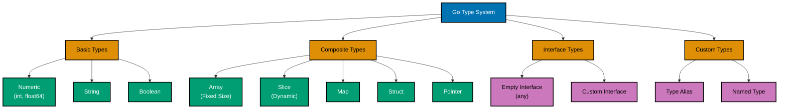
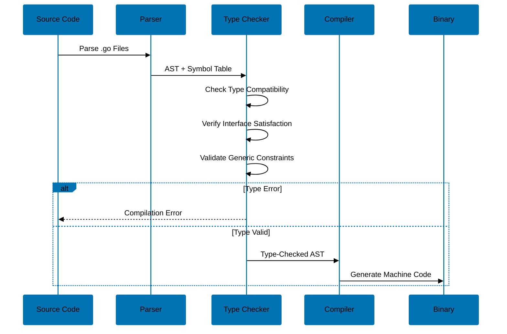

# Type Safety in Go

**Quick Reference**: [Overview](#overview) | [Type System Fundamentals](#type-system-fundamentals) | [Basic Types](#basic-types) | [Composite Types](#composite-types) | [Type Declarations](#type-declarations) | [Interface Types](#interface-types) | [Type Assertions](#type-assertions) | [Type Switches](#type-switches) | [Type Conversions](#type-conversions) | [Generics (Go 1.18+)](#generics-go-118) | [Type Constraints](#type-constraints) | [Type Parameters](#type-parameters) | [Type Inference](#type-inference) | [Zero Values](#zero-values) | [Type Safety Patterns](#type-safety-patterns) | [Type Safety Best Practices](#type-safety-best-practices) | [Common Type Safety Pitfalls](#common-type-safety-pitfalls) | [Conclusion](#conclusion)

## Overview

Go is a statically typed language with a strong emphasis on type safety. The type system is designed to catch errors at compile time while maintaining simplicity and ease of use. This document explores Go's type system, from basic types to advanced features like generics, and demonstrates how to leverage type safety effectively.

**Audience**: Developers who want to understand Go's type system and write type-safe code.

**Prerequisites**: Basic Go programming knowledge, familiarity with static typing concepts.

**Related Documentation**:

- [Interfaces and Composition](./design-patterns.md#part-3-interfaces-and-composition-patterns)
- [Error Handling](./error-handling-standards.md)
- [Best Practices](./coding-standards.md#part-2-naming--organization-best-practices)

### Type Hierarchy in Go



### Static Typing

Go uses static typing, meaning types are checked at compile time:

```go
package main

func main() {
    var x int = 42
    var y string = "hello"

    // This will not compile
    // x = y  // cannot use y (variable of type string) as int value in assignment

    // Type must match
    x = 100  // OK
    y = "world"  // OK
}
```

### Type Identity

Two types are identical if they have the same underlying structure:

```go
// Named types
type Celsius float64
type Fahrenheit float64

// These are different types even though both are float64
var temp1 Celsius = 20.0
var temp2 Fahrenheit = 68.0

// Cannot assign directly
// temp1 = temp2  // cannot use temp2 (variable of type Fahrenheit) as Celsius value

// Must convert
temp1 = Celsius(temp2)  // OK
```

### Type Safety Benefits

Type safety in Go provides:

```go
// 1. Compile-time error detection
func Add(a, b int) int {
    return a + b
}

// Add("hello", "world")  // Compile error: cannot use "hello" as int

// 2. Self-documenting code
func ProcessUser(id int, name string, age int) error {
    // Parameters clearly show expected types
    return nil
}

// 3. Editor support and refactoring
func CalculateTotal(items []Item) float64 {
    // IDE can provide accurate autocomplete
    var total float64
    for _, item := range items {
        total += item.Price  // IDE knows item is type Item
    }
    return total
}
```

### Numeric Types

Go provides various numeric types with specific sizes:

```go
package main

import "fmt"

func main() {
    // Integers
    var i8 int8 = 127           // -128 to 127
    var i16 int16 = 32767       // -32768 to 32767
    var i32 int32 = 2147483647  // -2^31 to 2^31-1
    var i64 int64 = 9223372036854775807  // -2^63 to 2^63-1

    // Unsigned integers
    var u8 uint8 = 255          // 0 to 255
    var u16 uint16 = 65535      // 0 to 65535
    var u32 uint32 = 4294967295 // 0 to 2^32-1
    var u64 uint64 = 18446744073709551615  // 0 to 2^64-1

    // Platform-dependent
    var i int = 42    // 32 or 64 bits depending on platform
    var u uint = 42   // 32 or 64 bits depending on platform

    // Floating point
    var f32 float32 = 3.14
    var f64 float64 = 3.14159265359

    // Complex numbers
    var c64 complex64 = 1 + 2i
    var c128 complex128 = 1 + 2i

    // Type matters for operations
    var a int32 = 10
    var b int64 = 20
    // var c = a + b  // invalid: mismatched types
    var c = int64(a) + b  // OK: explicit conversion

    fmt.Println(i8, u8, i, f32, c64, c)
}
```

### String Type

Strings are immutable sequences of bytes:

```go
package main

import "fmt"

func main() {
    var s string = "hello"

    // Strings are immutable
    // s[0] = 'H'  // cannot assign to s[0]

    // Can create new strings
    s = "Hello"  // OK
    s = s + " world"  // OK

    // String indexing returns bytes
    b := s[0]  // b is type byte (uint8)
    fmt.Printf("%c %T\n", b, b)  // H uint8

    // Range over string yields runes
    for i, r := range "hello 世界" {
        fmt.Printf("%d: %c (%T)\n", i, r, r)
        // 0: h (int32)
        // 1: e (int32)
        // ...
        // 6: 世 (int32)
        // 9: 界 (int32)
    }
}
```

### Boolean Type

Boolean type with two values:

```go
package main

func main() {
    var b bool = true
    var c bool = false

    // Boolean operations
    result := b && c  // false
    result = b || c   // true
    result = !b       // false

    // No implicit conversion
    var i int = 1
    // if i {  // non-bool i (type int) used as if condition
    //     fmt.Println("true")
    // }

    // Must be explicit
    if i != 0 {
        // OK
    }
}
```

### Byte and Rune

Special aliases for character data:

```go
package main

import "fmt"

func main() {
    // byte is alias for uint8 (ASCII/UTF-8 byte)
    var b byte = 'A'
    fmt.Printf("%c %d %T\n", b, b, b)  // A 65 uint8

    // rune is alias for int32 (Unicode code point)
    var r rune = '世'
    fmt.Printf("%c %d %T\n", r, r, r)  // 世 19990 int32

    // String to bytes
    str := "hello"
    bytes := []byte(str)  // []byte{104, 101, 108, 108, 111}

    // String to runes
    runes := []rune(str)  // []rune{104, 101, 108, 108, 111}

    // Handling Unicode
    str = "hello 世界"
    bytes = []byte(str)  // Length: 12 (5 ASCII + 6 UTF-8 bytes for Chinese)
    runes = []rune(str)  // Length: 8 (5 ASCII + 2 Chinese characters + 1 space)

    fmt.Printf("Bytes: %d, Runes: %d\n", len(bytes), len(runes))
}
```

### Array Types

Fixed-size sequences with type-safe length:

```go
package main

import "fmt"

func main() {
    // Array type includes length
    var a [3]int          // Array of 3 ints
    var b [5]int          // Different type from a

    // a = b  // cannot use b (variable of type [5]int) as [3]int value

    // Array initialization
    primes := [5]int{2, 3, 5, 7, 11}

    // Compiler infers length
    squares := [...]int{1, 4, 9, 16, 25}  // [5]int

    // Arrays are values
    c := a  // c is a copy of a
    c[0] = 100
    fmt.Println(a[0])  // 0 (a unchanged)
    fmt.Println(c[0])  // 100
}
```

### Slice Types

Dynamic sequences with type-safe elements:

```go
package main

import "fmt"

func main() {
    // Slice type doesn't include length
    var s []int  // nil slice

    // Make slice with capacity
    s = make([]int, 5)      // length 5, capacity 5
    s = make([]int, 5, 10)  // length 5, capacity 10

    // Slice literal
    primes := []int{2, 3, 5, 7, 11}

    // Type safety with append
    s = append(s, 42)       // OK
    // s = append(s, "hi")  // cannot use "hi" as int

    // Slices of different element types are incompatible
    var ints []int
    var strs []string
    // ints = strs  // cannot use strs as []int value
}
```

### Map Types

Type-safe key-value associations:

```go
package main

func main() {
    // Map type specifies key and value types
    var m map[string]int

    // Make map
    m = make(map[string]int)

    // Map literal
    ages := map[string]int{
        "Alice": 30,
        "Bob":   25,
    }

    // Type must match
    ages["Charlie"] = 35  // OK
    // ages["Dave"] = "forty"  // cannot use "forty" as int
    // ages[42] = 30  // cannot use 42 as string

    // Comma-ok idiom
    age, ok := ages["Alice"]  // age: int, ok: bool
    if ok {
        println(age)
    }

    // Maps with struct keys (must be comparable)
    type Point struct {
        X, Y int
    }
    locations := make(map[Point]string)
    locations[Point{0, 0}] = "origin"
}
```

### Struct Types

Type-safe collections of fields:

```go
package main

import "fmt"

// Struct type definition
type Person struct {
    Name    string
    Age     int
    Email   string
    Address Address  // Embedded struct
}

type Address struct {
    Street  string
    City    string
    ZipCode string
}

func main() {
    // Struct literal
    p := Person{
        Name: "Alice",
        Age:  30,
        Email: "alice@example.com",
        Address: Address{
            Street:  "123 Main St",
            City:    "New York",
            ZipCode: "10001",
        },
    }

    // Type-safe field access
    fmt.Println(p.Name)         // OK
    fmt.Println(p.Address.City) // OK

    // Cannot access non-existent fields
    // fmt.Println(p.Phone)  // p.Phone undefined

    // Type checking on assignment
    p.Age = 31  // OK
    // p.Age = "thirty-one"  // cannot use "thirty-one" as int
}
```

### Pointer Types

Type-safe memory addresses:

```go
package main

import "fmt"

func main() {
    var x int = 42
    var p *int = &x  // p points to x

    fmt.Println(*p)  // 42 (dereference)
    *p = 100         // Modify through pointer
    fmt.Println(x)   // 100

    // Pointer types are distinct
    var y float64 = 3.14
    var q *float64 = &y

    // p = q  // cannot use q (variable of type *float64) as *int value

    // Nil pointer safety
    var r *int  // nil
    // fmt.Println(*r)  // panic: runtime error: invalid memory address

    if r != nil {
        fmt.Println(*r)  // Safe
    }
}
```

### Channel Types

Type-safe communication channels:

```go
package main

import "fmt"

func main() {
    // Channel type specifies element type and direction
    var ch chan int          // Bidirectional channel
    var send chan<- int      // Send-only channel
    var recv <-chan int      // Receive-only channel

    ch = make(chan int, 5)   // Buffered channel

    // Type safety
    ch <- 42         // OK
    // ch <- "hi"    // cannot use "hi" as int in send

    // Direction enforcement
    send = ch  // OK: bidirectional can be send-only
    recv = ch  // OK: bidirectional can be receive-only

    // send = recv  // cannot use recv (variable of type <-chan int) as chan<- int

    // Cannot receive from send-only
    // val := <-send  // invalid operation: <-send (receive from send-only type chan<- int)

    // Cannot send to receive-only
    // recv <- 42  // invalid operation: recv <- 42 (send to receive-only type <-chan int)

    val := <-ch
    fmt.Println(val)
}
```

### Named Types

Create new types with specific names:

```go
package main

import "fmt"

// Define new types
type UserID int
type Username string
type Email string

// Types with different names are distinct
func GetUser(id UserID) {
    fmt.Printf("Getting beneficiary %d\n", id)
}

func main() {
    var id UserID = 123
    var num int = 456

    GetUser(id)         // OK
    // GetUser(num)     // cannot use num (variable of type int) as UserID value
    GetUser(UserID(num))  // OK: explicit conversion

    // Even with same underlying type, named types are distinct
    var name Username = "alice"
    var email Email = "alice@example.com"

    // name = email  // cannot use email (variable of type Email) as Username value
}
```

### Type Aliases

Create alternative names for existing types:

```go
package main

// Type alias (Go 1.9+)
type MyInt = int  // MyInt is just another name for int

type UserID int   // UserID is a new distinct type

func main() {
    var a int = 42
    var b MyInt = 42
    var c UserID = 42

    // MyInt and int are the same type
    a = b  // OK
    b = a  // OK

    // UserID is a different type
    // a = c  // cannot use c (variable of type UserID) as int value
    a = int(c)  // OK: explicit conversion
}
```

### Method Sets and Type Identity

Methods are part of type identity:

```go
package main

import "fmt"

type Celsius float64
type Fahrenheit float64

// Method on Celsius
func (c Celsius) ToFahrenheit() Fahrenheit {
    return Fahrenheit(c*9/5 + 32)
}

// Method on Fahrenheit
func (f Fahrenheit) ToCelsius() Celsius {
    return Celsius((f - 32) * 5 / 9)
}

func main() {
    var temp Celsius = 20
    f := temp.ToFahrenheit()
    fmt.Printf("%.2f°C = %.2f°F\n", temp, f)

    // Cannot call Fahrenheit methods on Celsius
    // temp.ToCelsius()  // temp.ToCelsius undefined

    // Method sets are type-specific
    var raw float64 = 20.0
    // raw.ToFahrenheit()  // raw.ToFahrenheit undefined
}
```

### Interface Basics

Interfaces define method sets without implementation:

```go
package main

import "fmt"

// Interface type
type Writer interface {
    Write(p []byte) (n int, err error)
}

type Reader interface {
    Read(p []byte) (n int, err error)
}

// Type satisfies interface by implementing methods
type Buffer struct {
    data []byte
}

func (b *Buffer) Write(p []byte) (int, error) {
    b.data = append(b.data, p...)
    return len(p), nil
}

func (b *Buffer) Read(p []byte) (int, error) {
    n := copy(p, b.data)
    b.data = b.data[n:]
    return n, nil
}

// Function accepting interface
func WriteData(w Writer, data []byte) error {
    _, err := w.Write(data)
    return err
}

func main() {
    var buf Buffer

    // Buffer satisfies Writer interface
    err := WriteData(&buf, []byte("hello"))
    if err != nil {
        fmt.Println(err)
    }
}
```

### Empty Interface

Interface{} accepts any type:

```go
package main

import "fmt"

// Before Go 1.18
func PrintAny(v interface{}) {
    fmt.Println(v)
}

// Go 1.18+: use any (alias for interface{})
func PrintValue(v any) {
    fmt.Println(v)
}

func main() {
    PrintAny(42)
    PrintAny("hello")
    PrintAny([]int{1, 2, 3})

    // any is type-safe, but loses specific type info
    var x any = 42
    // var y int = x  // cannot use x (variable of type any) as int value

    // Need type assertion to recover type
    var y int = x.(int)  // OK
    fmt.Println(y)
}
```

### Interface Embedding

Compose interfaces from other interfaces:

```go
package main

import "io"

// Embed multiple interfaces
type ReadWriter interface {
    io.Reader
    io.Writer
}

type ReadWriteCloser interface {
    io.Reader
    io.Writer
    io.Closer
}

// Equivalent to
type ReadWriterExplicit interface {
    Read(p []byte) (n int, err error)
    Write(p []byte) (n int, err error)
}

// Type must satisfy all embedded interfaces
type File struct {
    // ...
}

func (f *File) Read(p []byte) (int, error) {
    // implementation
    return 0, nil
}

func (f *File) Write(p []byte) (int, error) {
    // implementation
    return 0, nil
}

func (f *File) Close() error {
    // implementation
    return nil
}

func main() {
    var f File

    // File satisfies all interfaces
    var rw ReadWriter = &f
    var rwc ReadWriteCloser = &f

    _, _ = rw, rwc
}
```

### Interface Satisfaction

Type satisfies interface implicitly:

```go
package main

import "fmt"

type Shape interface {
    Area() float64
    Perimeter() float64
}

type Rectangle struct {
    Width, Height float64
}

// Rectangle implicitly satisfies Shape
func (r Rectangle) Area() float64 {
    return r.Width * r.Height
}

func (r Rectangle) Perimeter() float64 {
    return 2 * (r.Width + r.Height)
}

type Circle struct {
    Radius float64
}

// Circle also satisfies Shape
func (c Circle) Area() float64 {
    return 3.14159 * c.Radius * c.Radius
}

func (c Circle) Perimeter() float64 {
    return 2 * 3.14159 * c.Radius
}

// Function accepting interface
func PrintShapeInfo(s Shape) {
    fmt.Printf("Area: %.2f, Perimeter: %.2f\n", s.Area(), s.Perimeter())
}

func main() {
    r := Rectangle{Width: 10, Height: 5}
    c := Circle{Radius: 7}

    PrintShapeInfo(r)  // OK
    PrintShapeInfo(c)  // OK
}
```

### Type Assertion Flow

```mermaid
%% Color Palette: Blue #0173B2, Orange #DE8F05, Teal #029E73, Purple #CC78BC
%% All colors are color-blind friendly and meet WCAG AA contrast standards

graph TD
    A["Interface Value<br/>#40;any#41;"]:::blue --> B{Type Assertion}:::purple
    B -->|"v.#40;TargetType#41;"| C{Panic-based}:::orange
    B -->|"v, ok := v.#40;TargetType#41;"| D{Safe#40;comma-ok#41;}:::teal

    C -->|Success| E["Value<br/>#40;TargetType#41;"]:::teal
    C -->|Failure| F["Panic"]:::orange

    D -->|Success| G["value, true"]:::teal
    D -->|Failure| H["zero value, false"]:::teal

    I["Zakat Amount<br/>#40;interface&#123;&#125;#41;"]:::blue --> J{Assert to<br/>float64}:::purple
    J --> K["amount.#40;float64#41;<br/>Calculate"]:::teal

    classDef blue fill:#0173B2,stroke:#000000,color:#FFFFFF,stroke-width:2px
    classDef orange fill:#DE8F05,stroke:#000000,color:#000000,stroke-width:2px
    classDef teal fill:#029E73,stroke:#000000,color:#FFFFFF,stroke-width:2px
    classDef purple fill:#CC78BC,stroke:#000000,color:#000000,stroke-width:2px
```



### Basic Type Assertions

Extract concrete type from interface:

```go
package main

import "fmt"

func main() {
    var i interface{} = "hello"

    // Type assertion with panic risk
    s := i.(string)
    fmt.Println(s)  // "hello"

    // n := i.(int)  // panic: interface conversion: interface {} is string, not int

    // Safe type assertion with comma-ok
    s, ok := i.(string)
    if ok {
        fmt.Println("String:", s)
    }

    n, ok := i.(int)
    if !ok {
        fmt.Println("Not an int")  // This will print
    } else {
        fmt.Println("Int:", n)
    }
}
```

### Type Assertion Patterns

Common patterns for type checking:

```go
package main

import (
    "fmt"
    "io"
)

// Pattern 1: Check for optional interface
func WriteString(w io.Writer, s string) error {
    // Check if Writer also has WriteString method
    if sw, ok := w.(io.StringWriter); ok {
        // Use more efficient method
        _, err := sw.WriteString(s)
        return err
    }

    // Fallback to Write
    _, err := w.Write([]byte(s))
    return err
}

// Pattern 2: Check for specific capability
func Close(v interface{}) error {
    if closer, ok := v.(io.Closer); ok {
        return closer.Close()
    }
    return nil  // Not closeable, no error
}

// Pattern 3: Progressive refinement
func ProcessValue(v interface{}) {
    // Try most specific first
    if n, ok := v.(int); ok {
        fmt.Printf("Integer: %d\n", n)
        return
    }

    if s, ok := v.(string); ok {
        fmt.Printf("String: %s\n", s)
        return
    }

    fmt.Printf("Unknown type: %T\n", v)
}

func main() {
    ProcessValue(42)
    ProcessValue("hello")
    ProcessValue(3.14)
}
```

### Type Assertion with Nil

Handling nil interface values:

```go
package main

import "fmt"

func main() {
    var i interface{}  // nil interface

    // Type assertion on nil interface panics
    // s := i.(string)  // panic: interface conversion: interface is nil, not string

    // Safe version
    s, ok := i.(string)
    if !ok {
        fmt.Println("Not a string (or nil)")
    }
    fmt.Println(s, ok)  // "" false

    // Check for nil first
    if i == nil {
        fmt.Println("Interface is nil")
        return
    }

    s = i.(string)  // Now safe if i != nil
}
```

### Type Switch Pattern Matching

```mermaid
%% Color Palette: Blue #0173B2, Orange #DE8F05, Teal #029E73, Purple #CC78BC
%% All colors are color-blind friendly and meet WCAG AA contrast standards

graph TD
    A["Interface Value"]:::blue --> B["switch v := i.#40;type#41;"]:::purple
    B --> C["case int"]:::orange
    B --> D["case string"]:::orange
    B --> E["case float64"]:::orange
    B --> F["case PaymentProcessor"]:::teal
    B --> G["default"]:::orange

    C --> H["Handle int<br/>v is int"]:::teal
    D --> I["Handle string<br/>v is string"]:::teal
    E --> J["Handle float64<br/>v is float64"]:::teal
    F --> K["Call ProcessPayment#40;#41;<br/>#40;Interface method#41;"]:::teal
    G --> L["Unknown type<br/>v is interface&#123;&#125;"]:::teal

    classDef blue fill:#0173B2,stroke:#000000,color:#FFFFFF,stroke-width:2px
    classDef orange fill:#DE8F05,stroke:#000000,color:#000000,stroke-width:2px
    classDef teal fill:#029E73,stroke:#000000,color:#FFFFFF,stroke-width:2px
    classDef purple fill:#CC78BC,stroke:#000000,color:#000000,stroke-width:2px
```



### Basic Type Switch

Switch on interface type:

```go
package main

import "fmt"

func Describe(i interface{}) {
    switch v := i.(type) {
    case int:
        fmt.Printf("Integer: %d\n", v)
    case string:
        fmt.Printf("String: %s (length %d)\n", v, len(v))
    case bool:
        fmt.Printf("Boolean: %t\n", v)
    case float64:
        fmt.Printf("Float: %.2f\n", v)
    default:
        fmt.Printf("Unknown type: %T\n", v)
    }
}

func main() {
    Describe(42)
    Describe("hello")
    Describe(true)
    Describe(3.14)
    Describe([]int{1, 2, 3})
}
```

### Type Switch with Multiple Cases

Handle multiple types in one case:

```go
package main

import "fmt"

func ProcessNumber(i interface{}) {
    switch v := i.(type) {
    case int, int8, int16, int32, int64:
        fmt.Printf("Signed integer: %v\n", v)
    case uint, uint8, uint16, uint32, uint64:
        fmt.Printf("Unsigned integer: %v\n", v)
    case float32, float64:
        fmt.Printf("Floating point: %v\n", v)
    case complex64, complex128:
        fmt.Printf("Complex number: %v\n", v)
    default:
        fmt.Printf("Not a number: %T\n", v)
    }
}

func main() {
    ProcessNumber(42)
    ProcessNumber(uint(42))
    ProcessNumber(3.14)
    ProcessNumber(1 + 2i)
    ProcessNumber("not a number")
}
```

### Type Switch with Interface Checks

Check for interface satisfaction:

```go
package main

import (
    "fmt"
    "io"
)

func HandleIO(v interface{}) {
    switch t := v.(type) {
    case io.Reader:
        fmt.Println("Can read")
        // t is io.Reader here
        buf := make([]byte, 100)
        t.Read(buf)
    case io.Writer:
        fmt.Println("Can write")
        // t is io.Writer here
        t.Write([]byte("hello"))
    case io.ReadWriter:
        fmt.Println("Can read and write")
        // t is io.ReadWriter here
        buf := make([]byte, 100)
        t.Read(buf)
        t.Write(buf)
    default:
        fmt.Printf("Cannot do I/O: %T\n", t)
    }
}
```

### Nil Case in Type Switch

Handle nil interface separately:

```go
package main

import "fmt"

func DescribeValue(i interface{}) {
    switch v := i.(type) {
    case nil:
        fmt.Println("Nil value")
    case int:
        fmt.Printf("Integer: %d\n", v)
    case string:
        fmt.Printf("String: %s\n", v)
    default:
        fmt.Printf("Other: %T %v\n", v, v)
    }
}

func main() {
    DescribeValue(nil)
    DescribeValue(42)
    DescribeValue("hello")
}
```

### Explicit Conversions

Convert between compatible types:

```go
package main

import "fmt"

func main() {
    // Numeric conversions
    var i int = 42
    var f float64 = float64(i)  // int to float64
    var u uint = uint(f)         // float64 to uint

    fmt.Println(i, f, u)

    // String conversions
    s := "hello"
    b := []byte(s)      // string to []byte
    r := []rune(s)      // string to []rune
    s2 := string(b)     // []byte to string
    s3 := string(r)     // []rune to string

    fmt.Println(s, s2, s3)

    // Integer to string (rune conversion)
    i = 65
    s = string(i)       // "A" (not "65"!)
    fmt.Println(s)

    // Named type conversions
    type UserID int
    var id UserID = 123
    var num int = int(id)  // UserID to int
    id = UserID(num)       // int to UserID

    fmt.Println(id, num)
}
```

### Conversion Rules

Understanding conversion constraints:

```go
package main

func main() {
    // 1. Numeric types can convert to each other
    var i int = 42
    var f float64 = float64(i)  // OK
    var u uint = uint(f)         // OK (truncates decimal)

    // 2. Cannot convert between incompatible types
    var s string = "hello"
    // var n int = int(s)  // cannot convert s (variable of type string) to int

    // 3. Named types must convert explicitly
    type Celsius float64
    type Fahrenheit float64

    var c Celsius = 20.0
    var f2 Fahrenheit = Fahrenheit(c)  // Must convert

    // 4. Pointer conversions limited to unsafe package
    var p *int = &i
    // var q *float64 = (*float64)(p)  // cannot convert p to *float64

    // 5. Slice/array conversions
    arr := [3]int{1, 2, 3}
    slice := arr[:]  // Array to slice (not conversion, but slicing)

    // Cannot convert slice back to array directly
    // arr2 := [3]int(slice)  // cannot convert slice to [3]int

    _, _, _, _, _, _, _ = f, u, s, f2, p, arr, slice
}
```

### String/Numeric Conversions

Proper way to convert strings and numbers:

```go
package main

import (
    "fmt"
    "strconv"
)

func main() {
    // String to integer (use strconv)
    s := "123"
    i, err := strconv.Atoi(s)
    if err != nil {
        fmt.Println("Conversion error:", err)
        return
    }
    fmt.Println("Integer:", i)

    // Integer to string (use strconv, not conversion!)
    i = 42
    s = strconv.Itoa(i)
    fmt.Println("String:", s)

    // WRONG: string(42) converts rune to string
    wrong := string(42)
    fmt.Println("Wrong:", wrong)  // "*" (ASCII 42)

    // String to float
    s = "3.14"
    f, err := strconv.ParseFloat(s, 64)
    if err != nil {
        fmt.Println("Conversion error:", err)
        return
    }
    fmt.Println("Float:", f)

    // Float to string
    f = 3.14159
    s = strconv.FormatFloat(f, 'f', 2, 64)  // "3.14"
    fmt.Println("Formatted:", s)
}
```

### Generic Functions

Functions with type parameters:

```go
package main

import (
    "fmt"
    "golang.org/x/exp/constraints"
)

// Generic function with type parameter
func PrintT any {
    fmt.Println(value)
}

// Generic function with ordered constraint
func MaxT constraints.Ordered T {
    if a > b {
        return a
    }
    return b
}

func main() {
    // Type inference
    Print(42)         // T = int
    Print("hello")    // T = string
    Print(3.14)       // T = float64

    // Explicit type argument
    Printint
    Printstring

    // Using constrained generic
    fmt.Println(Max(10, 20))      // 20
    fmt.Println(Max(3.14, 2.71))  // 3.14
    fmt.Println(Max("abc", "xyz"))  // "xyz"
}
```

### Generic Types

Types with type parameters:

```go
package main

import "fmt"

// Generic slice type
type Stack[T any] struct {
    items []T
}

func (s *Stack[T]) Push(item T) {
    s.items = append(s.items, item)
}

func (s *Stack[T]) Pop() (T, bool) {
    if len(s.items) == 0 {
        var zero T
        return zero, false
    }
    item := s.items[len(s.items)-1]
    s.items = s.items[:len(s.items)-1]
    return item, true
}

// Generic map wrapper
type Cache[K comparable, V any] struct {
    data map[K]V
}

func NewCache[K comparable, V any]() *Cache[K, V] {
    return &Cache[K, V]{
        data: make(map[K]V),
    }
}

func (c *Cache[K, V]) Set(key K, value V) {
    c.data[key] = value
}

func (c *Cache[K, V]) Get(key K) (V, bool) {
    v, ok := c.data[key]
    return v, ok
}

func main() {
    // Stack of ints
    intStack := &Stack[int]{}
    intStack.Push(1)
    intStack.Push(2)
    fmt.Println(intStack.Pop())  // 2 true

    // Stack of strings
    strStack := &Stack[string]{}
    strStack.Push("hello")
    strStack.Push("world")
    fmt.Println(strStack.Pop())  // "world" true

    // Cache with string keys and int values
    cache := NewCache[string, int]()
    cache.Set("age", 30)
    age, ok := cache.Get("age")
    fmt.Println(age, ok)  // 30 true
}
```

### Multiple Type Parameters

Functions and types with multiple type parameters:

```go
package main

import "fmt"

// Function with two type parameters
func MapT any, U any U) []U {
    result := make([]U, len(slice))
    for i, v := range slice {
        result[i] = f(v)
    }
    return result
}

// Type with two type parameters
type Pair[T, U any] struct {
    First  T
    Second U
}

func (p Pair[T, U]) String() string {
    return fmt.Sprintf("(%v, %v)", p.First, p.Second)
}

// Generic function operating on Pair
func SwapT, U any Pair[U, T] {
    return Pair[U, T]{
        First:  p.Second,
        Second: p.First,
    }
}

func main() {
    // Map slice of ints to strings
    nums := []int{1, 2, 3, 4, 5}
    strs := Map(nums, func(n int) string {
        return fmt.Sprintf("num%d", n)
    })
    fmt.Println(strs)  // [num1 num2 num3 num4 num5]

    // Create pairs
    p1 := Pair[string, int]{"age", 30}
    fmt.Println(p1)  // (age, 30)

    // Swap pair
    p2 := Swap(p1)
    fmt.Println(p2)  // (30, age)
}
```

### Built-in Constraints

Go 1.18+ provides predeclared constraints:

```go
package main

import "fmt"

// any: allows any type (alias for interface{})
func PrintAnyT any {
    fmt.Println(v)
}

// comparable: allows types that support == and !=
func ContainsT comparable bool {
    for _, v := range slice {
        if v == value {
            return true
        }
    }
    return false
}

func main() {
    PrintAny(42)
    PrintAny("hello")
    PrintAny(struct{ X int }{X: 10})

    fmt.Println(Contains([]int{1, 2, 3}, 2))         // true
    fmt.Println(Contains([]string{"a", "b"}, "c"))   // false

    // comparable works with comparable types
    type Point struct{ X, Y int }
    fmt.Println(Contains([]Point{{0, 0}, {1, 1}}, Point{0, 0}))  // true
}
```

### Interface Constraints

Custom constraints using interfaces:

```go
package main

import (
    "fmt"
    "golang.org/x/exp/constraints"
)

// Constraint: types with String() method
type Stringer interface {
    String() string
}

func PrintStringT Stringer {
    fmt.Println(v.String())
}

// Type satisfying constraint
type Person struct {
    Name string
    Age  int
}

func (p Person) String() string {
    return fmt.Sprintf("%s (%d)", p.Name, p.Age)
}

// Constraint: numeric types
type Number interface {
    constraints.Integer | constraints.Float
}

func SumT Number T {
    var sum T
    for _, n := range numbers {
        sum += n
    }
    return sum
}

func main() {
    p := Person{"Alice", 30}
    PrintString(p)  // Alice (30)

    ints := []int{1, 2, 3, 4, 5}
    fmt.Println(Sum(ints))  // 15

    floats := []float64{1.1, 2.2, 3.3}
    fmt.Println(Sum(floats))  // 6.6
}
```

### Union Constraints

Constraints with type unions:

```go
package main

import "fmt"

// Union of specific types
type StringOrInt interface {
    string | int
}

func DoubleT StringOrInt T {
    switch any(v).(type) {
    case string:
        s := any(v).(string)
        return any(s + s).(T)
    case int:
        i := any(v).(int)
        return any(i * 2).(T)
    }
    return v
}

// Union with underlying type constraint
type SignedInteger interface {
    ~int | ~int8 | ~int16 | ~int32 | ~int64
}

func AbsT SignedInteger T {
    if v < 0 {
        return -v
    }
    return v
}

// Named type based on int
type MyInt int

func main() {
    fmt.Println(Double("hello"))  // "hellohello"
    fmt.Println(Double(21))       // 42

    fmt.Println(Abs(-42))         // 42
    fmt.Println(Abs(int8(-10)))   // 10

    // Works with named type due to ~int
    var mi MyInt = -5
    fmt.Println(Abs(mi))          // 5
}
```

### Method Constraints

Constraints requiring specific methods:

```go
package main

import (
    "fmt"
    "math"
)

// Constraint: types with Area method
type Shaped interface {
    Area() float64
}

func TotalAreaT Shaped float64 {
    var total float64
    for _, s := range shapes {
        total += s.Area()
    }
    return total
}

type Rectangle struct {
    Width, Height float64
}

func (r Rectangle) Area() float64 {
    return r.Width * r.Height
}

type Circle struct {
    Radius float64
}

func (c Circle) Area() float64 {
    return math.Pi * c.Radius * c.Radius
}

// Constraint: types with multiple methods
type Measurable interface {
    Area() float64
    Perimeter() float64
}

func PrintMeasurementsT Measurable {
    fmt.Printf("Area: %.2f, Perimeter: %.2f\n", m.Area(), m.Perimeter())
}

func (r Rectangle) Perimeter() float64 {
    return 2 * (r.Width + r.Height)
}

func (c Circle) Perimeter() float64 {
    return 2 * math.Pi * c.Radius
}

func main() {
    rects := []Rectangle{
        {Width: 10, Height: 5},
        {Width: 3, Height: 4},
    }
    fmt.Printf("Total rect area: %.2f\n", TotalArea(rects))

    circles := []Circle{
        {Radius: 5},
        {Radius: 3},
    }
    fmt.Printf("Total circle area: %.2f\n", TotalArea(circles))

    PrintMeasurements(Rectangle{Width: 10, Height: 5})
    PrintMeasurements(Circle{Radius: 7})
}
```

### Type Parameter Lists

Syntax for declaring type parameters:

```go
package main

import "golang.org/x/exp/constraints"

// Single type parameter
func IdentityT any T {
    return v
}

// Multiple type parameters
func PairT, U any (T, U) {
    return first, second
}

// Type parameters with constraints
func MaxT constraints.Ordered T {
    if a > b {
        return a
    }
    return b
}

// Mixing constrained and unconstrained parameters
func ConvertSliceT any, U any U) []U {
    result := make([]U, len(slice))
    for i, v := range slice {
        result[i] = convert(v)
    }
    return result
}
```

### Type Parameter Scope

Understanding where type parameters are valid:

```go
package main

import "fmt"

// Type parameter scoped to function
func SwapT any (T, T) {
    return b, a
}

// Type parameter scoped to type
type Box[T any] struct {
    value T
}

// Method uses type's type parameter
func (b *Box[T]) Get() T {
    return b.value
}

func (b *Box[T]) Set(v T) {
    b.value = v
}

// Method with additional type parameter
func (b *Box[T]) TransformU any U) Box[U] {
    return Box[U]{value: f(b.value)}
}

func main() {
    a, b := Swap(1, 2)
    fmt.Println(a, b)  // 2 1

    box := &Box[int]{value: 42}
    fmt.Println(box.Get())  // 42

    box.Set(100)
    fmt.Println(box.Get())  // 100

    // Transform int box to string box
    strBox := box.Transform(func(i int) string {
        return fmt.Sprintf("num%d", i)
    })
    fmt.Println(strBox.Get())  // "num100"
}
```

### Type Parameter Inference

Go infers type arguments when possible:

```go
package main

import (
    "fmt"
    "golang.org/x/exp/constraints"
)

func MinT constraints.Ordered T {
    if a < b {
        return a
    }
    return b
}

func MapT, U any U) []U {
    result := make([]U, len(slice))
    for i, v := range slice {
        result[i] = f(v)
    }
    return result
}

func main() {
    // Type inference from arguments
    fmt.Println(Min(10, 20))        // T inferred as int
    fmt.Println(Min(3.14, 2.71))    // T inferred as float64
    fmt.Println(Min("abc", "xyz"))  // T inferred as string

    // Can specify explicitly if needed
    fmt.Println(Minint)

    // Inference with multiple type parameters
    nums := []int{1, 2, 3}
    strs := Map(nums, func(n int) string {  // T=int, U=string inferred
        return fmt.Sprintf("n%d", n)
    })
    fmt.Println(strs)  // [n1 n2 n3]
}
```

### Function Argument Inference

Compiler infers types from function arguments:

```go
package main

import (
    "fmt"
    "golang.org/x/exp/constraints"
)

func AddT constraints.Integer T {
    return a + b
}

func main() {
    // Inference from literal types
    result1 := Add(1, 2)         // T = int
    result2 := Add(int8(1), 2)   // T = int8

    // Inference from variable types
    var a int32 = 10
    var b int32 = 20
    result3 := Add(a, b)  // T = int32

    fmt.Println(result1, result2, result3)
}
```

### Return Type Inference

Compiler can infer based on expected return type:

```go
package main

import "fmt"

func Zero[T any]() T {
    var zero T
    return zero
}

func main() {
    // Inference from assignment
    var i int = Zero()        // T = int
    var s string = Zero()     // T = string
    var f float64 = Zero()    // T = float64

    fmt.Println(i, s, f)  // 0  0

    // Can also specify explicitly
    i = Zero[int]()
}
```

### Constraint Inference

Compiler infers constraints from usage:

```go
package main

import "fmt"

func KeysK comparable, V any []K {
    keys := make([]K, 0, len(m))
    for k := range m {
        keys = append(keys, k)
    }
    return keys
}

func main() {
    // K and V inferred from map type
    ages := map[string]int{"Alice": 30, "Bob": 25}
    names := Keys(ages)  // K=string, V=int inferred
    fmt.Println(names)   // [Alice Bob] (order varies)

    // Works with any comparable key type
    scores := map[int]float64{1: 95.5, 2: 87.3}
    ids := Keys(scores)  // K=int, V=float64 inferred
    fmt.Println(ids)
}
```

### Zero Value Behavior

Every type has a well-defined zero value:

```go
package main

import "fmt"

func main() {
    // Numeric types: 0
    var i int
    var f float64
    fmt.Println(i, f)  // 0 0

    // Boolean: false
    var b bool
    fmt.Println(b)  // false

    // String: ""
    var s string
    fmt.Println(s == "")  // true

    // Pointer: nil
    var p *int
    fmt.Println(p == nil)  // true

    // Slice: nil
    var slice []int
    fmt.Println(slice == nil)  // true
    fmt.Println(len(slice))    // 0

    // Map: nil
    var m map[string]int
    fmt.Println(m == nil)  // true

    // Channel: nil
    var ch chan int
    fmt.Println(ch == nil)  // true

    // Function: nil
    var fn func()
    fmt.Println(fn == nil)  // true

    // Interface: nil
    var iface interface{}
    fmt.Println(iface == nil)  // true

    // Struct: all fields zero
    type Point struct {
        X, Y int
    }
    var pt Point
    fmt.Println(pt)  // {0 0}
}
```

### Useful Zero Values

Many Go types are designed to be useful at zero value:

```go
package main

import (
    "bytes"
    "fmt"
    "sync"
)

func main() {
    // bytes.Buffer ready to use
    var buf bytes.Buffer
    buf.WriteString("hello")
    fmt.Println(buf.String())  // "hello"

    // sync.Mutex ready to use
    var mu sync.Mutex
    mu.Lock()
    // critical section
    mu.Unlock()

    // Slices work with nil
    var slice []int
    slice = append(slice, 1, 2, 3)  // Works on nil slice
    fmt.Println(slice)  // [1 2 3]

    // Maps need make
    var m map[string]int
    // m["key"] = 1  // panic: assignment to entry in nil map
    m = make(map[string]int)
    m["key"] = 1  // OK
}
```

### Zero Value in Generics

Handling zero values with type parameters:

```go
package main

import "fmt"

// Return zero value of type T
func Zero[T any]() T {
    var zero T
    return zero
}

// Check if value equals zero
func IsZeroT comparable bool {
    return v == Zero[T]()
}

// Pointer to zero value
func ZeroPtr[T any]() *T {
    return new(T)  // Allocates zero value
}

func main() {
    fmt.Println(Zero[int]())        // 0
    fmt.Println(Zero[string]())     // ""
    fmt.Println(Zero[bool]())       // false

    fmt.Println(IsZero(0))          // true
    fmt.Println(IsZero(42))         // false
    fmt.Println(IsZero(""))         // true
    fmt.Println(IsZero("hello"))    // false

    p := ZeroPtr[int]()
    fmt.Println(*p)                 // 0
}
```

### Option Type Pattern

Type-safe optional values:

```go
package main

import "fmt"

// Option type
type Option[T any] struct {
    value *T
}

func SomeT any Option[T] {
    return Option[T]{value: &v}
}

func None[T any]() Option[T] {
    return Option[T]{value: nil}
}

func (o Option[T]) IsSome() bool {
    return o.value != nil
}

func (o Option[T]) IsNone() bool {
    return o.value == nil
}

func (o Option[T]) Unwrap() T {
    if o.value == nil {
        panic("called Unwrap on None")
    }
    return *o.value
}

func (o Option[T]) UnwrapOr(defaultValue T) T {
    if o.value == nil {
        return defaultValue
    }
    return *o.value
}

func (o Option[T]) MapU any U) Option[U] {
    if o.value == nil {
        return None[U]()
    }
    return Some(f(*o.value))
}

func main() {
    // Some value
    opt1 := Some(42)
    fmt.Println(opt1.IsSome())    // true
    fmt.Println(opt1.Unwrap())    // 42

    // None value
    opt2 := None[int]()
    fmt.Println(opt2.IsNone())    // true
    fmt.Println(opt2.UnwrapOr(0)) // 0 (default)

    // Map over option
    opt3 := Some(10).Map(func(x int) string {
        return fmt.Sprintf("value: %d", x)
    })
    fmt.Println(opt3.Unwrap())  // "value: 10"
}
```

### Self-Referential Generics (Go 1.26+)

Go 1.26 allows generic types to reference themselves in their own type parameter constraints, enabling type-safe recursive patterns:

```go
// Self-referential constraint: T must implement Adder[T]
type Adder[A Adder[A]] interface {
    Add(A) A
}

// Concrete type satisfying the constraint
type Vec2D struct {
    X, Y float64
}

func (v Vec2D) Add(other Vec2D) Vec2D {
    return Vec2D{X: v.X + other.X, Y: v.Y + other.Y}
}

// Generic algorithm works with any self-adding type
func Sum[A Adder[A]](items []A) A {
    result := items[0]
    for _, item := range items[1:] {
        result = result.Add(item)
    }
    return result
}

// Usage
vectors := []Vec2D{{1, 2}, {3, 4}, {5, 6}}
total := Sum(vectors) // Vec2D{9, 12}
```

Use cases:

- **Chainable builders**: Methods return the concrete type, not the interface
- **Recursive data structures**: Type-safe linked lists, trees
- **Algebraic types**: Monoid, group operations with type guarantees
- **Comparable collections**: Self-referencing for comparison operators

### Result Type Pattern

Type-safe error handling:

```go
package main

import "fmt"

// Result type
type Result[T any] struct {
    value T
    err   error
}

func OkT any Result[T] {
    return Result[T]{value: v}
}

func ErrT any Result[T] {
    return Result[T]{err: err}
}

func (r Result[T]) IsOk() bool {
    return r.err == nil
}

func (r Result[T]) IsErr() bool {
    return r.err != nil
}

func (r Result[T]) Unwrap() (T, error) {
    return r.value, r.err
}

func (r Result[T]) UnwrapOr(defaultValue T) T {
    if r.err != nil {
        return defaultValue
    }
    return r.value
}

func (r Result[T]) MapU any U) Result[U] {
    if r.err != nil {
        return ErrU
    }
    return Ok(f(r.value))
}

// Example usage
func Divide(a, b int) Result[float64] {
    if b == 0 {
        return Errfloat64)
    }
    return Ok(float64(a) / float64(b))
}

func main() {
    // Success case
    r1 := Divide(10, 2)
    if r1.IsOk() {
        val, _ := r1.Unwrap()
        fmt.Println("Result:", val)  // Result: 5
    }

    // Error case
    r2 := Divide(10, 0)
    if r2.IsErr() {
        _, err := r2.Unwrap()
        fmt.Println("Error:", err)  // Error: division by zero
    }

    // With default
    fmt.Println(r2.UnwrapOr(0.0))  // 0
}
```

### Type-Safe Builder Pattern

Builder with compile-time safety:

```go
package main

import "fmt"

// Builder states as types
type (
    NoHost    struct{}
    HasHost   struct{ host string }
    NoPort    struct{}
    HasPort   struct{ port int }
)

// Builder with state tracking
type ServerBuilder[H, P any] struct {
    host string
    port int
}

func NewServerBuilder() ServerBuilder[NoHost, NoPort] {
    return ServerBuilder[NoHost, NoPort]{}
}

func (b ServerBuilder[NoHost, P]) WithHost(host string) ServerBuilder[HasHost, P] {
    return ServerBuilder[HasHost, P]{
        host: host,
        port: b.port,
    }
}

func (b ServerBuilder[H, NoPort]) WithPort(port int) ServerBuilder[H, HasPort] {
    return ServerBuilder[H, HasPort]{
        host: b.host,
        port: port,
    }
}

// Build only available when both host and port are set
func (b ServerBuilder[HasHost, HasPort]) Build() Server {
    return Server{
        Host: b.host,
        Port: b.port,
    }
}

type Server struct {
    Host string
    Port int
}

func main() {
    // Must set both host and port
    server := NewServerBuilder().
        WithHost("localhost").
        WithPort(8080).
        Build()

    fmt.Printf("Server: %s:%d\n", server.Host, server.Port)

    // Won't compile without both
    // incomplete := NewServerBuilder().WithHost("localhost")
    // incomplete.Build()  // Build() not available
}
```

### Type-Safe State Machine

Compile-time state transitions:

```go
package main

import "fmt"

// State types
type (
    Stopped struct{}
    Running struct{ pid int }
    Paused  struct{ pid int }
)

// State machine
type Process[S any] struct {
    state S
}

// State transitions
func NewProcess() Process[Stopped] {
    return Process[Stopped]{state: Stopped{}}
}

func (p Process[Stopped]) Start(pid int) Process[Running] {
    return Process[Running]{state: Running{pid: pid}}
}

func (p Process[Running]) Pause() Process[Paused] {
    return Process[Paused]{state: Paused{pid: p.state.pid}}
}

func (p Process[Paused]) Resume() Process[Running] {
    return Process[Running]{state: Running{pid: p.state.pid}}
}

func (p Process[Running]) Stop() Process[Stopped] {
    return Process[Stopped]{state: Stopped{}}
}

func (p Process[Paused]) Stop() Process[Stopped] {
    return Process[Stopped]{state: Stopped{}}
}

// Only running processes can get PID
func (p Process[Running]) PID() int {
    return p.state.pid
}

func main() {
    // Valid state transitions
    proc := NewProcess()
    proc = proc.Start(1234)
    fmt.Println("PID:", proc.PID())

    proc = proc.Pause()
    // proc.PID()  // Won't compile: PID() not available on Paused

    proc = proc.Resume()
    fmt.Println("PID:", proc.PID())

    proc = proc.Stop()
    // proc.PID()  // Won't compile: PID() not available on Stopped

    // Invalid transitions won't compile
    // proc.Start(5678)  // Won't compile: Start() not available on Stopped (already started)
}
```

### Use Named Types for Domain Concepts

Create distinct types for domain concepts:

```go
package main

import "fmt"

// Named types provide type safety
type UserID int
type OrderID int
type ProductID int

type Beneficiary struct {
    ID    UserID
    Name  string
}

type Order struct {
    ID     OrderID
    UserID UserID  // Type-safe relationship
}

// Type-safe functions
func GetUser(id UserID) (*Beneficiary, error) {
    // Implementation
    return &Beneficiary{ID: id, Name: "Alice"}, nil
}

func GetOrder(id OrderID) (*Order, error) {
    // Implementation
    return &Order{ID: id, UserID: 123}, nil
}

func main() {
    var userID UserID = 123
    var orderID OrderID = 456

    // Type-safe calls
    beneficiary, _ := GetUser(userID)
    order, _ := GetOrder(orderID)

    // Won't compile: type mismatch
    // GetUser(orderID)  // cannot use orderID (variable of type OrderID) as UserID
    // GetOrder(userID)  // cannot use userID (variable of type UserID) as OrderID

    fmt.Println(beneficiary, order)
}
```

### Prefer Small Interfaces

Define focused interfaces:

```go
package main

import "io"

// Good: small, focused interfaces
type Reader interface {
    Read(p []byte) (n int, err error)
}

type Writer interface {
    Write(p []byte) (n int, err error)
}

type Closer interface {
    Close() error
}

// Compose when needed
type ReadWriter interface {
    Reader
    Writer
}

type ReadWriteCloser interface {
    Reader
    Writer
    Closer
}

// Bad: large interface
type BadFileSystem interface {
    Open(name string) error
    Close() error
    Read(p []byte) (n int, err error)
    Write(p []byte) (n int, err error)
    Seek(offset int64, whence int) (int64, error)
    Stat() (FileInfo, error)
    // ... many more methods
}

type FileInfo interface{}  // placeholder
```

### Accept Interfaces, Return Structs

Function signature best practices:

```go
package main

import (
    "fmt"
    "io"
)

// Accept interface: flexible, testable
func ProcessData(r io.Reader) error {
    // Can accept any Reader implementation
    buf := make([]byte, 100)
    _, err := r.Read(buf)
    return err
}

// Return struct: specific, clear ownership
type Config struct {
    Host string
    Port int
}

func LoadConfig() (*Config, error) {
    // Returns concrete type
    return &Config{
        Host: "localhost",
        Port: 8080,
    }, nil
}

// Bad: return interface (less clear)
func BadLoadConfig() (interface{}, error) {
    return &Config{Host: "localhost", Port: 8080}, nil
}

func main() {
    config, err := LoadConfig()
    if err != nil {
        return
    }

    // Can access struct fields directly
    fmt.Printf("%s:%d\n", config.Host, config.Port)

    // vs bad version
    badConfig, _ := BadLoadConfig()
    // Must type assert
    c := badConfig.(*Config)
    fmt.Printf("%s:%d\n", c.Host, c.Port)
}
```

### Use Type Parameters for Reusable Code

When to use generics:

```go
package main

import (
    "fmt"
    "golang.org/x/exp/constraints"
)

// Good: generic data structure
type Stack[T any] struct {
    items []T
}

func (s *Stack[T]) Push(item T) {
    s.items = append(s.items, item)
}

func (s *Stack[T]) Pop() (T, bool) {
    if len(s.items) == 0 {
        var zero T
        return zero, false
    }
    item := s.items[len(s.items)-1]
    s.items = s.items[:len(s.items)-1]
    return item, true
}

// Good: generic algorithm
func FilterT any bool) []T {
    result := make([]T, 0, len(slice))
    for _, v := range slice {
        if predicate(v) {
            result = append(result, v)
        }
    }
    return result
}

// Better: use constraints
func AddT constraints.Integer | constraints.Float T {
    return a + b
}

func main() {
    // Type-safe stack
    s := &Stack[int]{}
    s.Push(1)
    s.Push(2)

    // Type-safe filter
    nums := []int{1, 2, 3, 4, 5}
    evens := Filter(nums, func(n int) bool { return n%2 == 0 })
    fmt.Println(evens)  // [2 4]
}
```

### Validate at Boundaries

Type-safe validation at system boundaries:

```go
package main

import (
    "errors"
    "fmt"
    "strings"
)

// Internal domain type
type Email struct {
    value string
}

// Constructor validates and creates type
func NewEmail(s string) (Email, error) {
    if len(s) == 0 {
        return Email{}, errors.New("email cannot be empty")
    }
    if !strings.Contains(s, "@") {
        return Email{}, errors.New("email must contain @")
    }
    return Email{value: s}, nil
}

func (e Email) String() string {
    return e.value
}

// Internal code works with validated type
func SendEmail(to Email, subject, body string) error {
    // No need to validate: type guarantees validity
    fmt.Printf("Sending to %s: %s\n", to, subject)
    return nil
}

func main() {
    // Validate at boundary
    email, err := NewEmail("beneficiary@example.com")
    if err != nil {
        fmt.Println("Invalid email:", err)
        return
    }

    // Use validated type internally
    SendEmail(email, "Hello", "Test message")

    // Invalid email caught at construction
    _, err = NewEmail("invalid")
    fmt.Println(err)  // email must contain @
}
```

### Pitfall: Nil Interface Values

Nil interface value vs nil concrete value:

```go
package main

import "fmt"

type MyError struct {
    msg string
}

func (e *MyError) Error() string {
    return e.msg
}

// BAD: returns typed nil
func BadFunction() error {
    var err *MyError  // nil pointer
    return err        // Returns interface containing nil pointer
}

// GOOD: returns untyped nil
func GoodFunction() error {
    var err *MyError  // nil pointer
    if err != nil {
        return err
    }
    return nil  // Returns nil interface
}

func main() {
    // Bad: interface is non-nil even though value is nil
    err := BadFunction()
    if err != nil {
        fmt.Println("Error occurred (but err is actually nil!)")
        // err is (*MyError)(nil), not nil
    }

    // Good: interface is nil
    err = GoodFunction()
    if err != nil {
        fmt.Println("Error occurred")
    } else {
        fmt.Println("No error")  // This prints
    }
}
```

### Pitfall: Comparing Interfaces

Interface comparison pitfalls:

```go
package main

import "fmt"

func main() {
    // Comparable types work
    var i interface{} = 42
    var j interface{} = 42
    fmt.Println(i == j)  // true

    // Non-comparable types panic
    var x interface{} = []int{1, 2, 3}
    var y interface{} = []int{1, 2, 3}
    // fmt.Println(x == y)  // panic: runtime error: comparing uncomparable type []int

    // Safe comparison with type assertion
    if s1, ok1 := x.([]int); ok1 {
        if s2, ok2 := y.([]int); ok2 {
            // Must compare elements manually
            equal := len(s1) == len(s2)
            for i := 0; i < len(s1) && equal; i++ {
                equal = s1[i] == s2[i]
            }
            fmt.Println("Equal:", equal)
        }
    }
}
```

### Pitfall: Type Assertion Panics

Unsafe type assertions:

```go
package main

import "fmt"

func main() {
    var i interface{} = "hello"

    // BAD: panics if wrong type
    // n := i.(int)  // panic: interface conversion: interface {} is string, not int

    // GOOD: safe type assertion
    n, ok := i.(int)
    if !ok {
        fmt.Println("Not an int")
    } else {
        fmt.Println("Int:", n)
    }

    // GOOD: type switch for multiple types
    switch v := i.(type) {
    case int:
        fmt.Println("Int:", v)
    case string:
        fmt.Println("String:", v)
    default:
        fmt.Println("Unknown type:", v)
    }
}
```

### Pitfall: Slice/Map Reference Semantics

Understanding reference types:

```go
package main

import "fmt"

func ModifySlice(s []int) {
    s[0] = 999  // Modifies original
}

func AppendSlice(s []int) {
    s = append(s, 100)  // Doesn't affect original!
}

func ModifyMap(m map[string]int) {
    m["new"] = 42  // Modifies original
}

func main() {
    // Slices: header copied, but data shared
    slice := []int{1, 2, 3}
    ModifySlice(slice)
    fmt.Println(slice)  // [999 2 3] - modified

    AppendSlice(slice)
    fmt.Println(slice)  // [999 2 3] - NOT modified

    // Maps: reference semantics
    m := map[string]int{"a": 1}
    ModifyMap(m)
    fmt.Println(m)  // map[a:1 new:42] - modified
}
```

### Pitfall: String Concatenation

Inefficient string building:

```go
package main

import (
    "fmt"
    "strings"
)

func main() {
    // BAD: creates new string each iteration
    var result string
    for i := 0; i < 1000; i++ {
        result += "x"  // Allocates 1000 times
    }

    // GOOD: use strings.Builder
    var builder strings.Builder
    builder.Grow(1000)  // Pre-allocate
    for i := 0; i < 1000; i++ {
        builder.WriteString("x")
    }
    result = builder.String()

    fmt.Println(len(result))
}
```

### Pitfall: Pointer to Loop Variable

Loop variable capture:

```go
package main

import "fmt"

func main() {
    // BAD: all pointers point to same variable (Go 1.21 and earlier)
    var ptrs []*int
    for i := 0; i < 3; i++ {
        ptrs = append(ptrs, &i)  // All point to same i
    }
    // In Go 1.21 and earlier: Prints 3 3 3
    // In Go 1.22+: Prints 0 1 2 (fixed)

    // GOOD: create new variable (works in all versions)
    ptrs = nil
    for i := 0; i < 3; i++ {
        i := i  // Create new variable
        ptrs = append(ptrs, &i)
    }
    for _, p := range ptrs {
        fmt.Println(*p)  // Prints 0 1 2
    }

    // Go 1.22+: loop variable per iteration (automatic fix)
    ptrs = nil
    for i := range 3 {
        ptrs = append(ptrs, &i)  // OK in Go 1.22+
    }
}
```

## Conclusion

Type safety in Go provides compile-time guarantees that prevent entire classes of bugs. Key takeaways:

1. **Static Typing**: Types checked at compile time
2. **Named Types**: Create domain-specific types for clarity
3. **Interfaces**: Small, focused interfaces with implicit satisfaction
4. **Generics**: Type-safe reusable code (Go 1.18+)
5. **Type Assertions**: Safe extraction of concrete types
6. **Type Switches**: Handle multiple types elegantly
7. **Zero Values**: Design types to be useful at zero value
8. **Best Practices**:
   - Accept interfaces, return structs
   - Use named types for domain concepts
   - Validate at boundaries
   - Prefer compile-time safety over runtime checks

Type safety makes code more maintainable, refactorable, and less prone to bugs. Embrace Go's type system to write robust, self-documenting code.

**Next Steps**:

- Read [Best Practices](./coding-standards.md#part-2-naming--organization-best-practices)
- Explore [Error Handling](./error-handling-standards.md)
- Study [Concurrency and Parallelism](./concurrency-standards.md)

---

**Go Version**: 1.21+ (baseline), 1.22+ (recommended), 1.23 (latest)
**Maintainers**: Platform Documentation Team

## Type System Architecture

```mermaid
%%{init: {'theme':'base', 'themeVariables': { 'primaryColor':'#0173B2','primaryTextColor':'#fff','primaryBorderColor':'#0173B2','lineColor':'#DE8F05','secondaryColor':'#029E73','tertiaryColor':'#CC78BC','fontSize':'16px'}}}%%
flowchart TD
    A[Go Type System] --> B[Basic Types]
    A --> C[Composite Types]
    A --> D[Interface Types]
    A --> E[Generic Types]

    B --> B1[Numeric<br/>int float]
    B --> B2[String<br/>UTF-8]
    B --> B3[Boolean<br/>bool]

    C --> C1[Array Slice<br/>Sequential]
    C --> C2[Map<br/>Key-Value]
    C --> C3[Struct<br/>Composite]

    D --> D1[Methods<br/>Contracts]
    D --> D2[Empty Interface<br/>any]
    D --> D3[Type Assertion<br/>Runtime Check]

    E --> E1[Type Parameters<br/>[T any]]
    E --> E2[Constraints<br/>Interface Bounds]
    E --> E3[Type Inference<br/>Auto Detection]

    B1 --> F[Zakat Amount<br/>Decimal Types]
    C3 --> G[Donation Struct<br/>Composite Data]
    E1 --> H[Generic Collections<br/>Type Safe]

    style A fill:#0173B2,color:#fff
    style B fill:#DE8F05,color:#fff
    style C fill:#029E73,color:#fff
    style D fill:#CC78BC,color:#fff
    style E fill:#0173B2,color:#fff
    style F fill:#DE8F05,color:#fff
    style G fill:#029E73,color:#fff
    style H fill:#0173B2,color:#fff
```

## Compile-Time Type Checking


