# Kotlin

**This is THE authoritative reference** for Kotlin coding standards in OSE Platform.

All Kotlin code written for the OSE Platform MUST comply with the standards documented here. These standards are mandatory, not optional. Non-compliance blocks code review and merge approval.

## Framework Stack

OSE Platform Kotlin applications MUST use the following stack:

**HTTP Server Frameworks**:

- **Ktor 3.x** - Async-first, coroutine-native HTTP server and client (preferred for new services)
- **Spring Boot 3.x** - Enterprise framework with full Kotlin support and Spring ecosystem integration

**Enterprise Features**:

- **Spring Security 6.x** - Authentication, authorization, OAuth2/JWT integration
- **Spring Data JPA** - Repository abstraction, Kotlin-specific extensions
- **Exposed** - JetBrains SQL framework, Kotlin-native alternative to JPA for Ktor projects

**Testing Stack**:

- **JUnit 5** (Jupiter) for unit and integration tests with Kotlin
- **Kotest** - Kotlin-first BDD test framework (describe/it style, property-based testing)
- **MockK** - Kotlin-native mocking library (`every`, `coEvery` for coroutines, `verify`, `coVerify`)
- **kotlinx-coroutines-test** - Coroutine testing utilities (`runTest`, `TestCoroutineScheduler`)
- **TestContainers** - Database and infrastructure integration tests

**Build Tools**:

- **Gradle 8.x** with Kotlin DSL (`build.gradle.kts`) - Primary build system
- **Kotlin Gradle Plugin** (`kotlin("jvm")`) for JVM targets
- **Gradle Version Catalogs** (`libs.versions.toml`) for dependency management
- **Gradle Wrapper** (`gradlew`) MUST be committed to enforce reproducible builds

**Code Quality**:

- **ktlint** - Kotlin code formatter and style checker (enforced via Gradle plugin or pre-commit hooks)
- **Detekt** - Static analysis for Kotlin (code smells, complexity, security)
- **Kover** - JetBrains code coverage tool for Kotlin (preferred over JaCoCo for Kotlin projects)

**Kotlin Version Strategy**:

- **Baseline**: Kotlin 1.9 LTS (MUST use minimum) - Stable K2 compiler preview, stable coroutines
- **Recommended**: Kotlin 2.0 (SHOULD migrate to) - K2 compiler stable, improved type inference
- **Latest Stable**: Kotlin 2.1 (RECOMMENDED for new projects) - Guard conditions in `when`, non-local `break`/`continue`
- **Upcoming**: Kotlin 2.2 - Compile-time constant expressions, union types in errors

**JVM Target**:

- **JDK 17** - Minimum required for Spring Boot 3.x and Ktor 3.x
- **JDK 21** - Recommended for virtual threads integration and latest LTS features

**See**: [Programming Language Documentation Separation Convention](../../../../../governance/conventions/structure/programming-language-docs-separation.md) for Kotlin-specific release documentation location

## Prerequisite Knowledge

**REQUIRED**: This documentation assumes you have completed the AyoKoding Kotlin learning path. These are **OSE Platform-specific style guides**, not educational tutorials.

**You MUST understand Kotlin fundamentals before using these standards:**

- **[Kotlin Learning Path](../../../../../apps/ayokoding-web/content/en/learn/software-engineering/programming-languages/kotlin/)** - Complete 0-95% language coverage
- **[Kotlin By Example](../../../../../apps/ayokoding-web/content/en/learn/software-engineering/programming-languages/kotlin/by-example/)** - Annotated code examples (beginner to advanced)

**What this documentation covers**: OSE Platform naming conventions, framework choices, repository-specific patterns, how to apply Kotlin knowledge in THIS codebase.

**What this documentation does NOT cover**: Kotlin syntax, language fundamentals, generic patterns (those are in ayokoding-web).

**See**: [Programming Language Documentation Separation Convention](../../../../../governance/conventions/structure/programming-language-docs-separation.md) for content separation rules.

## Software Engineering Principles

Kotlin development in OSE Platform enforces foundational software engineering principles:

1. **[Automation Over Manual](../../../../../governance/principles/software-engineering/automation-over-manual.md)** - MUST automate through Gradle tasks, ktlint, Detekt, Kover, GitHub Actions CI/CD, Kotlin compiler plugins, and code generation via `ksp` (Kotlin Symbol Processing)

2. **[Explicit Over Implicit](../../../../../governance/principles/software-engineering/explicit-over-implicit.md)** - MUST enforce explicitness through Kotlin's null safety system (?/!! operators with explicit intent), sealed classes for exhaustive `when` expressions, explicit coroutine scope management, and explicit dependency injection configuration

3. **[Immutability Over Mutability](../../../../../governance/principles/software-engineering/immutability.md)** - MUST use `val` over `var`, data classes for value types, immutable collections (`listOf`, `mapOf`), and copy patterns instead of mutation; Kotlin's `val` and data class `copy()` enable true immutable programming

4. **[Pure Functions Over Side Effects](../../../../../governance/principles/software-engineering/pure-functions.md)** - MUST implement functional core/imperative shell architecture, pure domain logic without side effects, extension functions for pure transformations, and `Flow` for reactive data pipelines with explicit side-effect management

5. **[Reproducibility First](../../../../../governance/principles/software-engineering/reproducibility.md)** - MUST ensure reproducibility through Gradle Wrapper (`gradlew`), `libs.versions.toml` version catalog, Gradle build cache, Kotlin version pinning in `build.gradle.kts`, and SDKMAN/MISE for JDK version management

## Kotlin Version Strategy

OSE Platform follows a three-tier Kotlin versioning strategy focused on modern, stable features:

**Kotlin 1.9 LTS (Baseline - REQUIRED)**:

- All projects MUST support Kotlin 1.9 minimum (LTS stability)
- Stable coroutines and Flow API
- Kotlin/JVM with JDK 17 minimum
- `when` with guard conditions (preview)
- Stable K2 compiler preview mode

**Kotlin 2.0 (Target - RECOMMENDED)**:

- Projects SHOULD migrate to Kotlin 2.0 when feasible
- K2 compiler stable release (2x faster compilation)
- Improved type inference (less explicit annotations needed)
- Smart cast improvements across coroutine boundaries
- `data object` as stable feature
- Compose Multiplatform stabilization

**Kotlin 2.1 (Latest Stable - RECOMMENDED for new projects)**:

- New projects SHOULD use Kotlin 2.1 for latest stable features
- Guard conditions in `when` expressions (`when (x) { is Foo if condition -> ... }`)
- Non-local `break` and `continue` in inline lambda expressions
- Multi-dollar interpolation for string templates
- Stable compiler plugin API for KSP

**Kotlin 2.2 (Upcoming)**:

- Compile-time constant expressions (expanded `const val` capabilities)
- Improved union types in error hierarchies
- Enhanced context receivers (stable after experimental)

**Unlike Go's 6-month cadence**: Kotlin follows a roughly quarterly release schedule with LTS designations every few major versions. The K2 compiler (Kotlin 2.0+) is a significant milestone providing 2x faster compilation and improved IDE support.

**See**: Kotlin release highlights documentation (when available) for detailed feature documentation

## OSE Platform Coding Standards (Authoritative)

**MUST follow these mandatory standards for all Kotlin code in OSE Platform:**

1. **[Coding Standards](./coding-standards.md)** - Naming conventions, package organization, Effective Kotlin idioms
2. **[Testing Standards](./testing-standards.md)** - JUnit 5, Kotest, MockK, coroutine testing, coverage requirements
3. **[Code Quality Standards](./code-quality-standards.md)** - ktlint, Detekt, Kotlin compiler warnings, Gradle build tasks
4. **[Build Configuration](./build-configuration.md)** - build.gradle.kts structure, Kotlin Gradle DSL, version catalog
5. **[Error Handling Standards](./error-handling-standards.md)** - Result<T>, sealed class hierarchies, coroutine exception handling
6. **[Concurrency Standards](./concurrency-standards.md)** - Coroutines, structured concurrency, Flow, StateFlow, channels
7. **[Performance Standards](./performance-standards.md)** - Inline functions, reified generics, lazy initialization, sequence vs list
8. **[Security Standards](./security-standards.md)** - Input validation, Spring Security, JWT, encrypted storage
9. **[API Standards](./api-standards.md)** - Ktor routing DSL, content negotiation, authentication, REST conventions
10. **[DDD Standards](./ddd-standards.md)** - Value Objects, sealed domain states, Aggregates, Domain Events
11. **[Framework Integration](./framework-integration.md)** - Ktor server, Spring Boot with Kotlin, coroutine integration
12. **[Type Safety Standards](./type-safety-standards.md)** - Null safety, sealed classes, data classes, generics variance

## Documentation Structure

### Quick Reference

**Mandatory Standards (All Kotlin Developers MUST follow)**:

1. [Coding Standards](./coding-standards.md) - Naming, package structure, Effective Kotlin compliance
2. [Testing Standards](./testing-standards.md) - JUnit 5, Kotest, MockK, coroutine testing, coverage >=95%
3. [Code Quality Standards](./code-quality-standards.md) - ktlint configuration, Detekt static analysis

**Context-Specific Standards (Apply when relevant)**:

- **Security**: [Security Standards](./security-standards.md) - Input validation, JWT, encryption for user-facing services
- **Concurrency**: [Concurrency Standards](./concurrency-standards.md) - Coroutines, Flow for async/reactive code
- **Domain Modeling**: [DDD Standards](./ddd-standards.md) - Aggregates, Value Objects for business domains
- **APIs**: [API Standards](./api-standards.md) - Ktor routing, REST conventions for HTTP endpoints
- **Performance**: [Performance Standards](./performance-standards.md) - Inline functions, profiling, optimization
- **Error Handling**: [Error Handling Standards](./error-handling-standards.md) - Result<T>, sealed errors, coroutine exceptions
- **Type Safety**: [Type Safety Standards](./type-safety-standards.md) - Null safety, sealed classes, generics
- **Framework**: [Framework Integration](./framework-integration.md) - Ktor 3.x, Spring Boot 3.x, Android
- **Build**: [Build Configuration](./build-configuration.md) - Gradle KTS, version catalog, build tasks

### Documentation Organization

```mermaid
%% Color Palette: Blue #0173B2, Orange #DE8F05, Teal #029E73, Purple #CC78BC
%% All colors are color-blind friendly and meet WCAG AA contrast standards

graph TD
    A["Kotlin Standards Index<br/>(OSE Platform)"]:::blue
    B["Core Standards"]:::orange
    C["Specialized Standards"]:::teal
    D["Learning Resources<br/>(AyoKoding)"]:::purple

    A --> B
    A --> C
    A --> D

    B --> E["Coding Standards"]:::orange
    B --> F["Testing Standards"]:::orange
    B --> G["Code Quality"]:::orange
    B --> H["Build Configuration"]:::orange

    C --> I["Security Standards"]:::teal
    C --> J["Concurrency Standards"]:::teal
    C --> K["DDD Standards"]:::teal
    C --> L["API Standards"]:::teal
    C --> M["Performance Standards"]:::teal
    C --> N["Error Handling"]:::teal
    C --> O["Type Safety"]:::teal
    C --> P["Framework Integration"]:::teal

    D --> Q["By Example<br/>(Annotated examples)"]:::purple
    D --> R["In the Field<br/>(Production patterns)"]:::purple
    D --> S["Release Highlights<br/>(Kotlin 2.0, 2.1)"]:::purple

    classDef blue fill:#0173B2,stroke:#000000,color:#FFFFFF,stroke-width:2px
    classDef orange fill:#DE8F05,stroke:#000000,color:#FFFFFF,stroke-width:2px
    classDef teal fill:#029E73,stroke:#000000,color:#FFFFFF,stroke-width:2px
    classDef purple fill:#CC78BC,stroke:#000000,color:#000000,stroke-width:2px
```

## Primary Use Cases in OSE Platform

**HTTP Services with Ktor**:

- RESTful APIs for Sharia-compliant business operations MUST use Ktor 3.x routing DSL with coroutines
- Ktor services MUST use `suspend` functions in route handlers (async-first architecture)
- Content negotiation MUST use `ContentNegotiation` plugin with `kotlinx.serialization`
- Authentication MUST use Ktor's `Authentication` plugin with JWT or session tokens

**Enterprise Services with Spring Boot**:

- Complex enterprise services with Spring ecosystem dependencies MUST use Spring Boot 3.x
- Spring Boot Kotlin projects MUST use `@SpringBootApplication` with `runApplication<T>()` idiom
- Kotlin `suspend` functions integrate with Spring WebFlux for reactive endpoints
- Spring Data repositories MUST use Kotlin-specific extensions for cleaner repository interfaces

**Domain Modeling**:

- Business entities MUST use Kotlin data classes for value objects with automatic `equals`/`hashCode`/`copy`
- Domain state machines MUST use sealed classes with exhaustive `when` expressions
- Sharia-compliant calculation engines (Zakat, Murabaha) MUST use pure functions with immutable data
- Aggregate invariants MUST use `require()` and `check()` for precondition enforcement

**Concurrent Data Processing**:

- Background jobs and workers MUST use Kotlin Coroutines with structured concurrency
- Event streams MUST use `Flow` for reactive data pipelines with backpressure support
- State management in services MUST use `StateFlow` or `SharedFlow` for observable state
- Parallel data processing MUST use `async`/`await` with appropriate `CoroutineDispatcher`

## Reproducible Builds and Automation

**Version Management (REQUIRED)**:

- MUST use Gradle Wrapper (`gradlew`) committed to repository (no system Gradle dependency)
- MUST use SDKMAN with `.sdkmanrc` OR MISE/asdf with `.tool-versions` to pin JDK version
- MUST specify Kotlin version in `libs.versions.toml` version catalog
- MUST NOT rely on system-installed JDK without version verification

**Dependency Management (REQUIRED)**:

- MUST use `libs.versions.toml` Gradle version catalog for all dependency versions
- MUST use BOM (Bill of Materials) for framework version alignment (Spring Boot BOM, Ktor BOM)
- SHOULD use `dependencyResolutionManagement` in `settings.gradle.kts` for repository declarations
- MUST commit `gradle/wrapper/gradle-wrapper.properties` with exact Gradle version

**Automated Quality (REQUIRED)**:

- MUST use `ktlint` for code formatting (enforced via Gradle plugin `id("org.jlleitschuh.gradle.ktlint")`)
- MUST use Detekt for static analysis with `detekt.yml` configuration committed to repository
- MUST use Kover for code coverage measurement (minimum 95% line coverage for domain logic)
- SHOULD enable Kotlin compiler strict mode (`allWarningsAsErrors = true` in `kotlinOptions`)
- MUST run `detekt` and `ktlintCheck` as part of CI/CD pipeline

**Testing Automation (REQUIRED)**:

- MUST write tests with JUnit 5 or Kotest (consistent within a project)
- MUST use MockK for mocking (NOT Mockito - MockK is Kotlin-native and coroutine-aware)
- MUST use `kotlinx-coroutines-test` with `runTest` for coroutine testing
- MUST use TestContainers for database and infrastructure integration tests
- MUST achieve >=95% line coverage for domain logic (measured with Kover, enforced in CI)

**Build Automation (REQUIRED)**:

- MUST use Gradle tasks for all build automation (`build`, `test`, `check`, `detekt`, `ktlintCheck`)
- SHOULD use KSP (Kotlin Symbol Processing) for code generation instead of KAPT where available
- MUST integrate quality checks in CI/CD pipeline (all checks must pass before merge)
- SHOULD use Gradle build cache for faster incremental builds

**See**: [Automation Over Manual](../../../../../governance/principles/software-engineering/automation-over-manual.md), [Reproducibility First](../../../../../governance/principles/software-engineering/reproducibility.md)

## Integration with Repository Governance

**Development Practices**:

- [Functional Programming](../../../../../governance/development/pattern/functional-programming.md) - MUST follow FP principles for domain logic (pure functions, immutability, extension functions)
- [Implementation Workflow](../../../../../governance/development/workflow/implementation.md) - MUST follow "make it work → make it right → make it fast" process
- [Code Quality Standards](../../../../../governance/development/quality/code.md) - MUST meet platform-wide quality requirements
- [Commit Messages](../../../../../governance/development/workflow/commit-messages.md) - MUST use Conventional Commits format

**Code Review Requirements**:

- All Kotlin code MUST pass automated checks (ktlint, Detekt, Kover coverage >=95%)
- Code reviewers MUST verify compliance with standards in this index
- Non-compliance with mandatory standards (Coding, Testing, Code Quality) blocks merge
- Coroutine leaks and thread-blocking MUST be detected with Detekt coroutine rules

## Related Documentation

**Software Engineering Principles**:

- [Automation Over Manual](../../../../../governance/principles/software-engineering/automation-over-manual.md)
- [Explicit Over Implicit](../../../../../governance/principles/software-engineering/explicit-over-implicit.md)
- [Immutability Over Mutability](../../../../../governance/principles/software-engineering/immutability.md)
- [Pure Functions Over Side Effects](../../../../../governance/principles/software-engineering/pure-functions.md)
- [Reproducibility First](../../../../../governance/principles/software-engineering/reproducibility.md)

**Development Practices**:

- [Functional Programming](../../../../../governance/development/pattern/functional-programming.md)
- [Maker-Checker-Fixer Pattern](../../../../../governance/development/pattern/maker-checker-fixer.md)

**Platform Documentation**:

- [Tech Stack Languages Index](../README.md)
- [Monorepo Structure](../../../../reference/monorepo-structure.md)

---

**Status**: Authoritative Standard (Mandatory Compliance)

**Kotlin Version**: 1.9 LTS (baseline), 2.0 (recommended), 2.1 (recommended for new projects)
**JVM Version**: JDK 17 (minimum), JDK 21 (recommended)
**Framework Stack**: Ktor 3.x, Spring Boot 3.x, JUnit 5, Kotest, MockK, Gradle KTS
**Maintainers**: Platform Architecture Team
