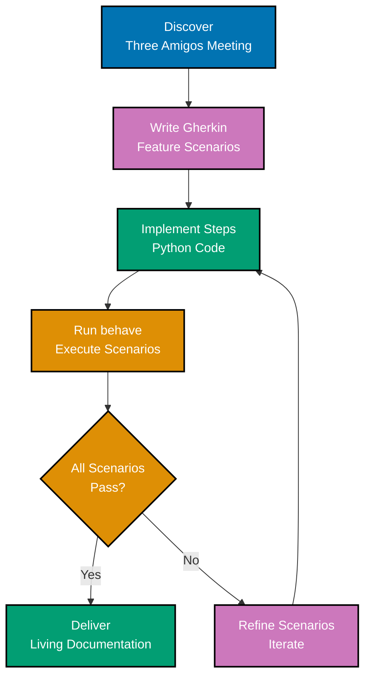
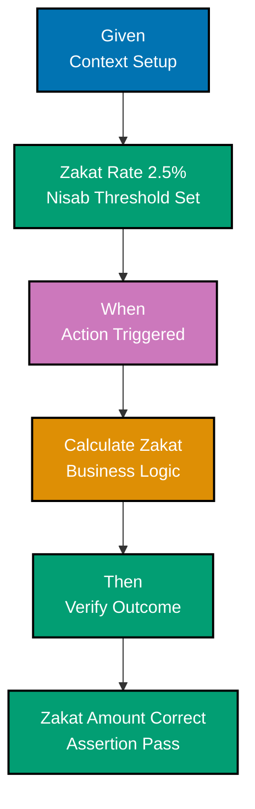
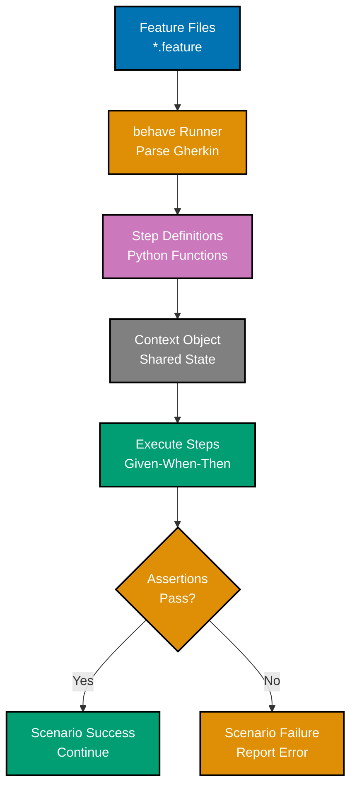
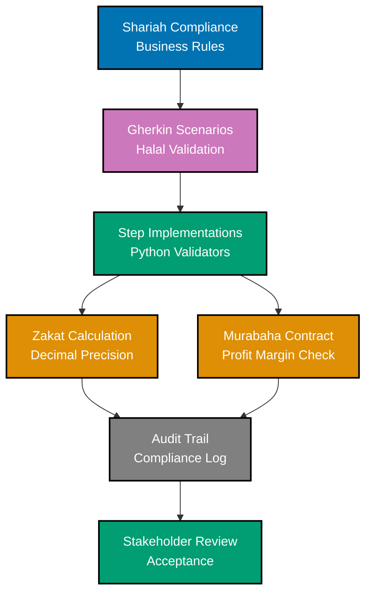

# Behaviour-Driven Development in Python

**Quick Reference**: [Overview](#overview) | [BDD Workflow](#bdd-workflow) | [Gherkin Syntax](#gherkin-syntax) | [behave Framework](#behave-framework) | [pytest-bdd](#pytest-bdd) | [Step Definitions](#step-definitions) | [Scenario Outlines](#scenario-outlines) | [Best Practices](#bdd-best-practices) | [Financial Domain BDD](#financial-domain-bdd-examples) | [References](#references)

## Overview

Behaviour-Driven Development (BDD) uses executable specifications written in natural language (Gherkin) to define system behavior. For OSE Platform financial applications, BDD ensures Islamic finance rules are correctly implemented and understood by both developers and domain experts.

### BDD Benefits for Financial Domain

**Shared Understanding**: Business rules in plain language.

**Living Documentation**: Specifications that execute as tests.

**Domain Alignment**: Tests match business requirements exactly.

**Collaboration**: Non-technical stakeholders contribute scenarios.

**Audit Trail**: Compliance requirements documented and tested.

## BDD Workflow

Three Amigos conversation: Business Analyst, Developer, Tester.

### BDD Cycle



### Given-When-Then Structure



### behave Execution Flow



### Financial Domain BDD



### BDD Cycle (Implementation)

```gherkin
# 1. DISCOVER: Write scenarios with stakeholders
Feature: Zakat Calculation
  As a platform user
  I want to calculate my Zakat obligation
  So that I can fulfill my Islamic duty

  Scenario: Calculate Zakat for wealth exceeding nisab
    Given I have wealth of $100,000
    And the nisab threshold is $85,000
    When I calculate my Zakat obligation
    Then my Zakat should be $2,500

# 2. IMPLEMENT: Write step definitions and code
# 3. DELIVER: Run scenarios as tests
```

**Why this matters**: BDD bridges communication gap between technical and non-technical stakeholders. Executable specifications prevent misunderstandings.

## Gherkin Syntax

Gherkin uses Given-When-Then structure.

### Basic Gherkin

```gherkin
Feature: QardHasan Interest-Free Loan
  As a borrower
  I want to take an interest-free loan (QardHasan)
  So that I can meet my financial needs without Riba

  Scenario: Record QardHasan loan disbursement
    Given a QardHasan loan with ID "QL-2025-001"
    And the principal amount is $50,000
    When the loan is disbursed on 2025-01-15
    Then the loan status should be "active"
    And the remaining balance should be $50,000

  Scenario: Record loan repayment
    Given an active QardHasan loan with principal $50,000
    And the current repaid amount is $0
    When the borrower pays $20,000
    Then the repaid amount should be $20,000
    And the remaining balance should be $30,000

  Scenario: Fully repay loan
    Given an active QardHasan loan with principal $50,000
    And the current repaid amount is $40,000
    When the borrower pays $10,000
    Then the loan should be marked as "fully_repaid"
    And the remaining balance should be $0
```

**Why this matters**: Gherkin readable by non-programmers. Given sets context, When triggers action, Then verifies outcome. Scenarios document business rules.

## behave Framework

behave is Python's popular BDD framework.

### Project Structure

```
features/
├── zakat_calculation.feature
├── qard_hasan_loan.feature
├── murabaha_contract.feature
└── steps/
    ├── __init__.py
    ├── zakat_steps.py
    ├── loan_steps.py
    └── contract_steps.py
```

### Feature File

```gherkin
# features/zakat_calculation.feature
Feature: Zakat Calculation
  Zakat is 2.5% of qualifying wealth exceeding nisab threshold

  Background:
    Given the standard Zakat rate is 2.5%
    And the gold nisab threshold is 85 grams

  Scenario: Wealth exceeds nisab
    Given I have wealth of $100,000
    And the nisab threshold is $85,000
    When I calculate Zakat
    Then the Zakat amount should be $2,500

  Scenario: Wealth below nisab
    Given I have wealth of $50,000
    And the nisab threshold is $85,000
    When I calculate Zakat
    Then the Zakat amount should be $0
```

### Step Definitions (behave)

```python
# features/steps/zakat_steps.py
from behave import given, when, then
from decimal import Decimal
from zakat_calculator import ZakatCalculator


@given('the standard Zakat rate is {rate}%')
def step_set_zakat_rate(context, rate):
    """Set Zakat rate in context."""
    context.zakat_rate = Decimal(rate) / Decimal("100")


@given('the gold nisab threshold is {grams:d} grams')
def step_set_nisab_grams(context, grams):
    """Set nisab threshold in grams."""
    context.nisab_grams = grams


@given('I have wealth of ${amount}')
def step_set_wealth(context, amount):
    """Set wealth amount."""
    context.wealth = Decimal(amount.replace(",", ""))


@given('the nisab threshold is ${threshold}')
def step_set_nisab_threshold(context, threshold):
    """Set nisab threshold."""
    context.nisab = Decimal(threshold.replace(",", ""))


@when('I calculate Zakat')
def step_calculate_zakat(context):
    """Calculate Zakat obligation."""
    calculator = ZakatCalculator()
    context.zakat_amount = calculator.calculate(
        context.wealth,
        context.nisab
    )


@then('the Zakat amount should be ${expected_amount}')
def step_verify_zakat_amount(context, expected_amount):
    """Verify calculated Zakat amount."""
    expected = Decimal(expected_amount.replace(",", ""))
    assert context.zakat_amount == expected, \
        f"Expected ${expected}, got ${context.zakat_amount}"
```

### Running behave

```bash
# Run all features
behave

# Run specific feature
behave features/zakat_calculation.feature

# Run with specific tag
behave --tags=@critical

# Generate HTML report
behave --format html --outfile report.html
```

**Why this matters**: behave separates scenarios (features/) from implementation (steps/). Step definitions reusable across scenarios. Context object shares state within scenario.

## pytest-bdd

pytest-bdd integrates BDD with pytest.

### Feature File (pytest-bdd)

```gherkin
# features/donation_campaign.feature
Feature: Donation Campaign Management
  Track donations and campaign progress

  Scenario: Create new donation campaign
    Given I create a campaign "Ramadan Relief"
    And the target amount is $500,000
    When I save the campaign
    Then the campaign should be in "active" status
    And the current amount should be $0

  Scenario: Record donation to campaign
    Given an active campaign with target $500,000
    And current donations total $0
    When a donor contributes $10,000
    Then the current donations should total $10,000
    And the campaign progress should be 2%
```

### Step Definitions (pytest-bdd)

```python
# tests/test_donation_campaign.py
import pytest
from pytest_bdd import scenarios, given, when, then, parsers
from decimal import Decimal
from donation_campaign import DonationCampaign, Money

# Load all scenarios from feature file
scenarios('../features/donation_campaign.feature')


@given('I create a campaign "Ramadan Relief"')
def create_campaign(context):
    """Create campaign in context."""
    context['campaign_name'] = "Ramadan Relief"


@given(parsers.parse('the target amount is ${amount:d}'))
def set_target_amount(context, amount):
    """Set campaign target."""
    context['target_amount'] = Money(
        amount=Decimal(str(amount)),
        currency="USD"
    )


@when('I save the campaign')
def save_campaign(context):
    """Save campaign to context."""
    context['campaign'] = DonationCampaign(
        id="CAMP-001",
        name=context['campaign_name'],
        target_amount=context['target_amount'],
        current_amount=Money(amount=Decimal("0"), currency="USD"),
        start_date=date.today(),
    )


@then(parsers.parse('the campaign should be in "{status}" status'))
def verify_campaign_status(context, status):
    """Verify campaign status."""
    assert context['campaign'].is_active == (status == "active")


@then(parsers.parse('the current amount should be ${amount:d}'))
def verify_current_amount(context, amount):
    """Verify current donation amount."""
    expected = Decimal(str(amount))
    assert context['campaign'].current_amount.amount == expected
```

**Why this matters**: pytest-bdd integrates with pytest ecosystem. Fixtures and plugins available. parsers enable flexible parameter extraction.

## Scenario Outlines

Test multiple examples with single scenario template.

### Scenario Outline

```gherkin
# features/zakat_calculation.feature
Feature: Zakat Calculation
  Calculate Zakat for various wealth amounts

  Scenario Outline: Calculate Zakat for different wealth levels
    Given I have wealth of $<wealth>
    And the nisab threshold is $<nisab>
    When I calculate Zakat
    Then the Zakat amount should be $<zakat>

    Examples:
      | wealth  | nisab  | zakat  |
      | 100,000 | 85,000 | 2,500  |
      | 150,000 | 85,000 | 3,750  |
      | 200,000 | 85,000 | 5,000  |
      | 84,999  | 85,000 | 0      |
      | 85,000  | 85,000 | 2,125  |
```

**Why this matters**: Scenario Outlines reduce duplication. Examples table documents test matrix. Clear coverage of edge cases.

## BDD Best Practices

### Use Ubiquitous Language

```gherkin
# GOOD: Domain language from Islamic finance
Scenario: Calculate Murabaha total selling price
  Given an asset cost of $200,000
  And a profit margin rate of 15%
  When the Murabaha contract is created
  Then the total selling price should be $230,000

# BAD: Technical jargon
Scenario: Calculate markup
  Given base value is 200000
  And multiplier is 0.15
  When function executes
  Then result equals 230000
```

### Keep Scenarios Focused

```gherkin
# GOOD: Single responsibility
Scenario: Record Zakat payment
  Given a Zakat obligation of $2,500
  When the payer submits payment
  Then the payment status should be "completed"

# BAD: Multiple responsibilities
Scenario: Complex workflow
  Given a Zakat obligation
  And a payment method
  When the payer submits payment
  And the payment is validated
  And the receipt is generated
  And the email is sent
  Then everything should work
```

### Use Background for Common Setup

```gherkin
Feature: Murabaha Contract
  Background:
    Given the platform is configured for Islamic finance
    And the Murabaha profit margin limit is 30%
    And all contracts use USD currency

  Scenario: Create valid contract
    Given an asset cost of $200,000
    And a profit margin of 15%
    When the contract is created
    Then it should be accepted

  Scenario: Reject excessive profit margin
    Given an asset cost of $200,000
    And a profit margin of 35%
    When the contract is created
    Then it should be rejected with "exceeds maximum allowed margin"
```

## Financial Domain BDD Examples

### Zakat Distribution

```gherkin
Feature: Zakat Distribution
  Distribute collected Zakat to eligible recipients

  Background:
    Given the Zakat collection total is $1,000,000
    And there are 8 eligible distribution categories

  Scenario: Distribute Zakat equally across categories
    When Zakat is distributed
    Then each category should receive $125,000
    And the total distributed should equal $1,000,000

  Scenario Outline: Validate recipient eligibility
    Given a recipient in category "<category>"
    And their income is $<income>
    When eligibility is checked
    Then they should be "<status>"

    Examples:
      | category | income | status     |
      | Poor     | 10,000 | eligible   |
      | Needy    | 20,000 | eligible   |
      | Wealthy  | 200,000| ineligible |
```

## BDD Checklist

### Feature File Quality

- [ ] Scenarios written in plain language (non-technical stakeholders can read)
- [ ] Given-When-Then structure followed consistently
- [ ] Scenarios focus on behavior, not implementation details
- [ ] Examples table used for scenario outlines (multiple inputs)
- [ ] Background section for common setup steps

### Scenario Structure

- [ ] Given: Context/preconditions clear and complete
- [ ] When: Single action described (not multiple actions)
- [ ] Then: Expected outcome specified clearly
- [ ] And: Used appropriately for additional steps
- [ ] Scenario names describe business value

### Step Definitions

- [ ] Step definitions are reusable across scenarios
- [ ] No business logic in steps (delegate to domain layer)
- [ ] Steps follow Python idioms (behave/pytest-bdd conventions)
- [ ] Error messages are descriptive and helpful
- [ ] Context object used to share state within scenario

### Collaboration

- [ ] Scenarios reviewed by business stakeholders
- [ ] Ubiquitous language used consistently (domain terminology)
- [ ] Scenarios executable and automated (not just documentation)
- [ ] Living documentation kept up to date
- [ ] Three Amigos conversation: BA, Dev, Tester

### behave/pytest-bdd Best Practices

- [ ] Feature files organized by domain
- [ ] Step definitions modular and maintainable
- [ ] Tags used for organizing scenarios (@smoke, @critical, @wip)
- [ ] Background steps minimized (only truly shared setup)
- [ ] Data tables used appropriately for structured data

### Financial Domain BDD

- [ ] Shariah compliance scenarios included (halal/haram validation)
- [ ] Zakat calculation scenarios with examples (nisab, rates, exemptions)
- [ ] Murabaha contract scenarios with Given-When-Then
- [ ] Audit trail scenarios verified (who, what, when)
- [ ] Currency scenarios tested (USD, SAR, EUR conversions)

## References

### Official Documentation

- [behave Documentation](https://behave.readthedocs.io/)
- [pytest-bdd Documentation](https://pytest-bdd.readthedocs.io/)
- [Cucumber Gherkin](https://cucumber.io/docs/gherkin/)

### Related Documentation

- [Test-Driven Development](./ex-soen-prla-py__test-driven-development.md) - TDD methodology
- [Domain-Driven Design](./ex-soen-prla-py__domain-driven-design.md) - Ubiquitous language

### Books

- "BDD in Action" by John Ferguson Smart
- "The Cucumber Book" by Matt Wynne and Aslak Hellesøy

---

**Last Updated**: 2025-01-23
**Python Version**: 3.11+ (baseline), 3.12+ (stable maintenance), 3.14.x (latest stable)
**Maintainers**: OSE Platform Documentation Team
