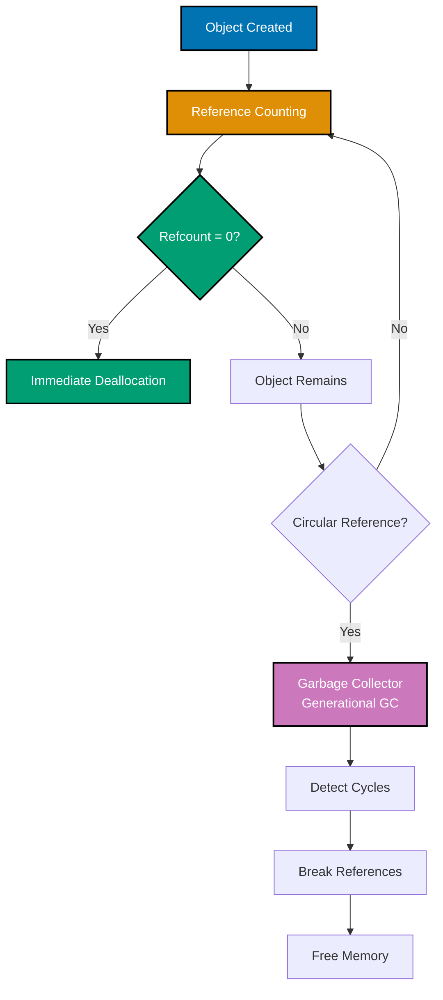
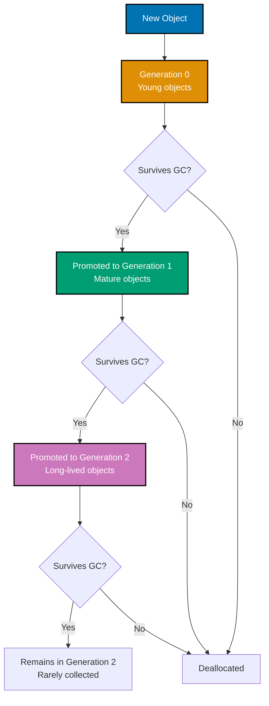
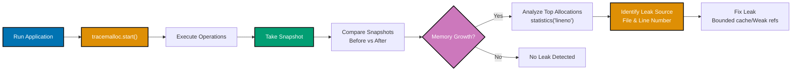
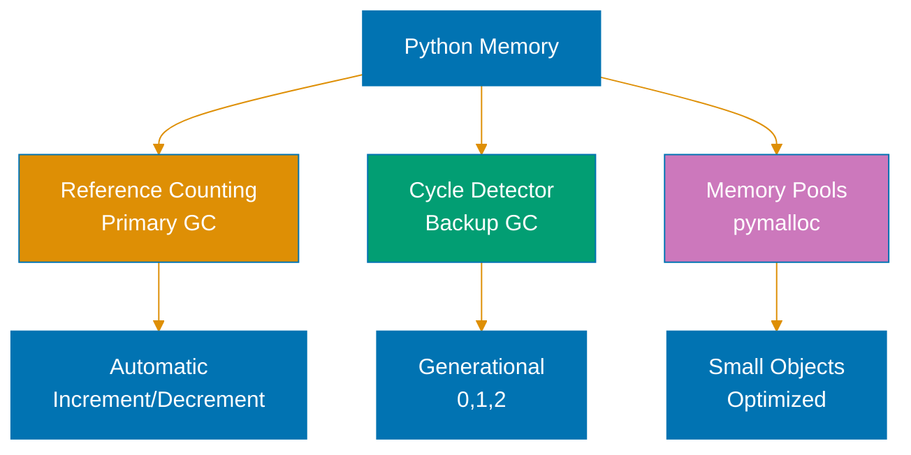

# Python Memory Management

**Quick Reference**: [Overview](#overview) | [Reference Counting](#reference-counting) | [Garbage Collection](#garbage-collection) | [Weak References](#weak-references) | [Memory Profiling](#memory-profiling) | [Memory Leaks](#memory-leaks) | [**slots**](#slots-attribute) | [Generator Efficiency](#generator-memory-efficiency) | [References](#references)

## Overview

Python manages memory automatically through reference counting and garbage collection. Understanding memory management helps prevent leaks and optimize resource usage for financial applications processing large datasets.

## Reference Counting

Python tracks object references and deallocates when count reaches zero.

### Reference Counting Basics

```python
import sys
from decimal import Decimal


# Check reference count
wealth = Decimal("100000")
print(sys.getrefcount(wealth))  # 2 (wealth + getrefcount argument)

# Create reference
another_ref = wealth
print(sys.getrefcount(wealth))  # 3

# Delete reference
del another_ref
print(sys.getrefcount(wealth))  # 2

# Object deallocated when refcount reaches 0
del wealth  # Object freed immediately
```

**Why this matters**: Reference counting provides deterministic cleanup. Objects freed when last reference deleted. Predictable resource management.

### Python Memory Management Architecture



**Two-layer memory management**:

1. **Reference counting**: Immediate cleanup when refcount reaches zero
2. **Garbage collection**: Handles circular references that reference counting can't

## Garbage Collection

GC handles circular references that reference counting can't.

### Garbage Collection Module

```python
import gc
from typing import List


class DonationCampaign:
    """Campaign that may create circular references."""

    def __init__(self, name: str):
        self.name = name
        self.related_campaigns: List['DonationCampaign'] = []

    def add_related(self, campaign: 'DonationCampaign') -> None:
        """Create circular reference."""
        self.related_campaigns.append(campaign)
        campaign.related_campaigns.append(self)  # Circular!


# Create circular reference
campaign1 = DonationCampaign("Campaign 1")
campaign2 = DonationCampaign("Campaign 2")
campaign1.add_related(campaign2)

# Reference counting can't free these
del campaign1, campaign2

# Garbage collector handles circular references
collected = gc.collect()  # Force collection
print(f"Collected {collected} objects")

# Disable/enable GC
gc.disable()  # Disable (use with caution)
gc.enable()   # Re-enable

# Check GC stats
print(gc.get_stats())
```

**Why this matters**: GC breaks circular references. Runs periodically (generation-based). Can disable for performance-critical sections (rarely needed).

### Garbage Collection Generations



**Generational GC strategy**:

- **Generation 0**: Young objects #40;most frequent collection#41;
- **Generation 1**: Mature objects #40;less frequent collection#41;
- **Generation 2**: Long-lived objects #40;rare collection#41;

**Why this matters**: Generational GC optimizes for object lifetimes. Most objects die young #40;temporary variables#41;. Long-lived objects rarely collected.

## Weak References

Weak references don't increase reference count.

### Using Weak References

```python
import weakref
from typing import Dict
from decimal import Decimal


class ZakatCalculationCache:
    """Cache using weak references (memory-efficient)."""

    def __init__(self):
        self._cache: weakref.WeakValueDictionary = weakref.WeakValueDictionary()

    def get_or_calculate(self, payer_id: str, wealth: Decimal) -> Decimal:
        """Get cached result or calculate."""
        # Check cache
        cached = self._cache.get(payer_id)
        if cached is not None:
            return cached

        # Calculate and cache (weak reference)
        zakat = wealth * Decimal("0.025")
        self._cache[payer_id] = zakat  # Weak reference
        return zakat


# Usage: Cache doesn't prevent garbage collection
cache = ZakatCalculationCache()
result = cache.get_or_calculate("PAYER-001", Decimal("100000"))

# If no other references to result, it can be garbage collected
# Cache automatically cleaned up
```

**Why this matters**: Weak references don't prevent GC. Useful for caches (don't keep objects alive). Automatic cache cleanup.

## Memory Profiling

Profile memory usage to find leaks.

### Using memory_profiler

```python
# Install: pip install memory-profiler
from memory_profiler import profile
from decimal import Decimal
from typing import List


@profile
def process_zakat_batch(count: int) -> List[Decimal]:
    """Process batch and profile memory."""
    results = []

    for i in range(count):
        wealth = Decimal(str(i * 1000))
        zakat = wealth * Decimal("0.025")
        results.append(zakat)

    return results


# Run with: python -m memory_profiler script.py
# Shows line-by-line memory usage
```

### Using tracemalloc

```python
import tracemalloc
from decimal import Decimal


def analyze_memory():
    """Analyze memory usage with tracemalloc."""
    tracemalloc.start()

    # Allocate memory
    wealth_data = [Decimal(str(i * 1000)) for i in range(100000)]

    # Get memory snapshot
    snapshot = tracemalloc.take_snapshot()
    top_stats = snapshot.statistics('lineno')

    print("Top 10 memory allocations:")
    for stat in top_stats[:10]:
        print(stat)

    tracemalloc.stop()
```

**Why this matters**: Memory profiling identifies leaks. tracemalloc built into Python. memory_profiler provides line-level detail.

## Memory Leaks

Common causes and solutions.

### Circular References

```python
# LEAK: Circular reference without __del__
class BadCampaign:
    """Creates circular reference."""

    def __init__(self):
        self.donations = []
        self.donations.append(self)  # Circular!


# FIXED: Avoid circular references
class GoodCampaign:
    """No circular references."""

    def __init__(self):
        self.donations = []
        # Don't reference self in collections


# ALTERNATIVE: Use weak references
import weakref


class Campaign:
    """Uses weak reference for parent."""

    def __init__(self, parent=None):
        self.parent_ref = weakref.ref(parent) if parent else None
```

### Global Caches

```python
# LEAK: Unbounded global cache
_global_cache = {}  # BAD: Grows indefinitely


def get_zakat_cached(payer_id: str) -> Decimal:
    """Unbounded cache (memory leak)."""
    if payer_id not in _global_cache:
        _global_cache[payer_id] = calculate_zakat(payer_id)  # Never evicted!
    return _global_cache[payer_id]


# FIXED: Bounded cache with LRU
from functools import lru_cache


@lru_cache(maxsize=1000)  # Limited size
def get_zakat_cached(payer_id: str) -> Decimal:
    """Bounded cache with automatic eviction."""
    return calculate_zakat(payer_id)
```

**Why this matters**: Unbounded caches leak memory. Circular references prevent collection. Use weak references or bounded caches.

### Memory Leak Detection Workflow



**Leak detection process**:

1. **Start tracemalloc**: Enable memory tracing
2. **Snapshot before**: Capture baseline memory
3. **Execute operations**: Run suspected leak code
4. **Snapshot after**: Capture final memory
5. **Compare**: Identify unexpected growth
6. **Fix**: Use bounded caches or weak references

## **slots** Attribute

Reduce memory overhead for instances.

### Using **slots**

```python
from decimal import Decimal


# WITHOUT __slots__: ~56 bytes per instance
class DonationWithoutSlots:
    """Standard class with __dict__."""

    def __init__(self, donor_id: str, amount: Decimal):
        self.donor_id = donor_id
        self.amount = amount


# WITH __slots__: ~40 bytes per instance
class DonationWithSlots:
    """Optimized class with __slots__."""

    __slots__ = ('donor_id', 'amount')

    def __init__(self, donor_id: str, amount: Decimal):
        self.donor_id = donor_id
        self.amount = amount


# Memory savings significant for many instances
donations = [
    DonationWithSlots(f"D{i}", Decimal("100"))
    for i in range(100000)
]
# Saves ~1.6MB compared to without __slots__
```

**Why this matters**: **slots** eliminates **dict** overhead. 20-30% memory savings per instance. Significant for large collections.

## Generator Memory Efficiency

Generators compute values lazily.

### Generator vs List

```python
from decimal import Decimal
from typing import Iterator, List


# LIST: Stores all values in memory
def calculate_zakat_list(count: int) -> List[Decimal]:
    """Returns list (high memory)."""
    results = []
    for i in range(count):
        wealth = Decimal(str(i * 1000))
        results.append(wealth * Decimal("0.025"))
    return results


# GENERATOR: Computes values on demand
def calculate_zakat_generator(count: int) -> Iterator[Decimal]:
    """Returns generator (low memory)."""
    for i in range(count):
        wealth = Decimal(str(i * 1000))
        yield wealth * Decimal("0.025")


# Memory comparison
list_result = calculate_zakat_list(1000000)  # ~80MB
gen_result = calculate_zakat_generator(1000000)  # ~100 bytes

# Process generator
for zakat in gen_result:
    process(zakat)  # Constant memory usage
```

**Why this matters**: Generators use constant memory. Ideal for large datasets. Lazy evaluation reduces memory pressure.

## References

### Official Documentation

- [Python Memory Management](https://docs.python.org/3/c-api/memory.html)
- [gc Module](https://docs.python.org/3/library/gc.html)
- [weakref Module](https://docs.python.org/3/library/weakref.html)
- [tracemalloc](https://docs.python.org/3/library/tracemalloc.html)

### Related Documentation

- [Performance](./ex-soen-prla-py__performance.md) - Performance optimization
- [Concurrency and Parallelism](./ex-soen-prla-py__concurrency-and-parallelism.md) - Parallel processing

---

**Last Updated**: 2025-01-23
**Python Version**: 3.11+ (baseline), 3.12+ (stable maintenance), 3.14.x (latest stable)
**Maintainers**: OSE Platform Documentation Team

## Python Memory Management


