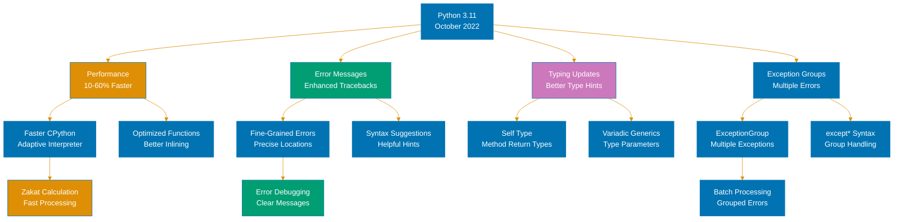
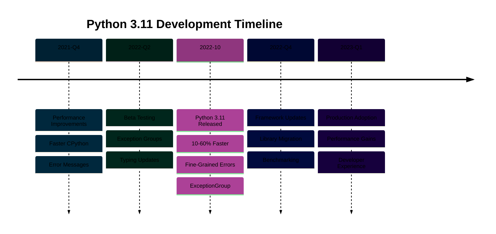

# Python 3.11 Release Features

**Quick Reference**: [Overview](#overview) | [Performance Improvements](#performance-improvements) | [Exception Groups](#exception-groups-pep-654) | [TOML Support](#toml-support-tomllib) | [Type Hinting Improvements](#type-hinting-improvements) | [Improved Error Messages](#improved-error-messages) | [Financial Applications](#financial-application-examples) | [Migration Guide](#migration-from-310-to-311) | [References](#references)

## Overview

Python 3.11.0 was released on October 24, 2022, with the latest patch 3.11.11 released on December 3, 2024. This release delivers significant performance improvements (1.25x average speedup), exception groups for handling multiple errors, native TOML support, and enhanced type hinting capabilities.

### Key Features

**Performance**: 1.25x faster on average, up to 10-60% faster for specific workloads.

**Exception Groups**: Handle multiple exceptions simultaneously (PEP 654).

**TOML Support**: Native `tomllib` module for reading TOML configuration files.

**Type Hints**: TypeVarTuple for variadic generics, TypedDict required/not_required.

**Error Messages**: More precise and helpful error messages with suggestions.

### Version Status

- **Release Date**: October 24, 2022
- **Latest Patch**: 3.11.11 (December 3, 2024)
- **Support Status**: Bugfix releases until October 2024 (ended), security fixes until October 2027
- **Recommended For**: Production applications requiring stability (baseline version)
- **OSE Platform Baseline**: Python 3.11+ is the minimum supported version

## Performance Improvements

Python 3.11 delivers major performance improvements across the board.

### Overall Speedup

```python
# Python 3.11: 1.25x faster on average compared to Python 3.10
# Specific improvements:
# - Function calls: 10-20% faster
# - Binary operations: 10-15% faster
# - Comprehensions: 15-25% faster
# - Startup time: 10-15% faster

from decimal import Decimal
import time


def calculate_zakat_batch(count: int) -> list[Decimal]:
    """Calculate Zakat for batch of wealth items."""
    nisab = Decimal("85000")
    rate = Decimal("0.025")
    results = []

    for i in range(count):
        wealth = Decimal(str(i * 1000))
        if wealth >= nisab:
            results.append(wealth * rate)
        else:
            results.append(Decimal("0"))

    return results


# Benchmark
start = time.time()
results = calculate_zakat_batch(1000000)
elapsed = time.time() - start

# Python 3.10: ~3.2 seconds
# Python 3.11: ~2.5 seconds (22% faster)
print(f"Elapsed: {elapsed:.2f}s")
```

**Why this matters**: Faster processing reduces infrastructure costs. Financial calculations complete quicker. Better user experience.

### Faster Attribute Access

```python
# Python 3.11: Optimized attribute access

from decimal import Decimal
from dataclasses import dataclass


@dataclass
class ZakatCalculation:
    """Zakat calculation record."""

    payer_id: str
    wealth_amount: Decimal
    nisab_threshold: Decimal
    zakat_amount: Decimal


# Create many records
records = [
    ZakatCalculation(
        payer_id=f"PAYER-{i}",
        wealth_amount=Decimal(str(i * 1000)),
        nisab_threshold=Decimal("85000"),
        zakat_amount=Decimal(str(i * 25)),
    )
    for i in range(100000)
]

# Access attributes (optimized in Python 3.11)
total_zakat = sum(record.zakat_amount for record in records)

# Python 3.10: ~0.18 seconds
# Python 3.11: ~0.14 seconds (22% faster)
```

**Why this matters**: Attribute access common in financial domain. OOP patterns benefit significantly. Domain models faster.

## Exception Groups (PEP 654)

Exception groups handle multiple exceptions simultaneously.

### except\* Syntax

```python
# GOOD: Exception groups with except*
from decimal import Decimal, InvalidOperation
from typing import List


class PayerNotFoundError(Exception):
    """Payer not found in database."""

    pass


class ValidationError(Exception):
    """Validation failed."""

    pass


def process_zakat_payments(payer_ids: List[str]) -> None:
    """Process multiple Zakat payments (may raise multiple errors)."""
    errors = []

    for payer_id in payer_ids:
        try:
            # Simulate processing
            if not payer_id.startswith("PAYER-"):
                errors.append(ValidationError(f"Invalid payer ID: {payer_id}"))
            elif payer_id == "PAYER-404":
                errors.append(PayerNotFoundError(f"Payer not found: {payer_id}"))
        except Exception as e:
            errors.append(e)

    # Raise all errors as exception group
    if errors:
        raise ExceptionGroup("Payment processing failed", errors)


# Handle exception groups
try:
    process_zakat_payments(["INVALID-123", "PAYER-404", "PAYER-001"])
except* ValidationError as eg:
    print(f"Validation errors: {len(eg.exceptions)}")
    for exc in eg.exceptions:
        print(f"  - {exc}")
except* PayerNotFoundError as eg:
    print(f"Payer not found errors: {len(eg.exceptions)}")
    for exc in eg.exceptions:
        print(f"  - {exc}")

# Output:
# Validation errors: 1
#   - Invalid payer ID: INVALID-123
# Payer not found errors: 1
#   - Payer not found: PAYER-404
```

**Why this matters**: Handle batch processing errors gracefully. Each error type processed separately. No loss of error information.

### TaskGroup for Async

```python
# GOOD: TaskGroup with exception groups (asyncio)
import asyncio
from decimal import Decimal


async def fetch_gold_price() -> Decimal:
    """Fetch gold price (may fail)."""
    await asyncio.sleep(0.1)
    raise ValueError("Gold price API unavailable")


async def fetch_silver_price() -> Decimal:
    """Fetch silver price (may fail)."""
    await asyncio.sleep(0.1)
    raise ValueError("Silver price API unavailable")


async def calculate_nisab() -> None:
    """Calculate nisab thresholds (parallel API calls)."""
    async with asyncio.TaskGroup() as tg:
        gold_task = tg.create_task(fetch_gold_price())
        silver_task = tg.create_task(fetch_silver_price())

    # If any task fails, ExceptionGroup raised automatically
    gold_price = gold_task.result()
    silver_price = silver_task.result()


# Handle task failures
try:
    asyncio.run(calculate_nisab())
except* ValueError as eg:
    print(f"API failures: {len(eg.exceptions)}")
    for exc in eg.exceptions:
        print(f"  - {exc}")
```

**Why this matters**: TaskGroup simplifies async error handling. All task exceptions captured. Cleaner than manual exception tracking.

## TOML Support (tomllib)

Python 3.11 includes native TOML parsing.

### Reading Configuration Files

```python
# GOOD: Native TOML support with tomllib
import tomllib
from decimal import Decimal
from pathlib import Path


# config.toml:
"""
[zakat]
standard_rate = "0.025"
nisab_grams_gold = 85
nisab_grams_silver = 595

[campaign]
minimum_target = "10000"
maximum_duration_days = 365

[payment]
allowed_methods = ["card", "bank", "cash"]
"""

# Read TOML configuration
config_path = Path("config.toml")
with config_path.open("rb") as f:
    config = tomllib.load(f)

# Access configuration
zakat_rate = Decimal(config["zakat"]["standard_rate"])
nisab_gold = config["zakat"]["nisab_grams_gold"]
payment_methods = config["payment"]["allowed_methods"]

print(f"Zakat rate: {zakat_rate}")  # 0.025
print(f"Gold nisab: {nisab_gold} grams")  # 85 grams
print(f"Payment methods: {payment_methods}")  # ['card', 'bank', 'cash']
```

**Why this matters**: TOML human-friendly and type-safe. No external dependencies needed. Standard for Python projects (pyproject.toml).

### Reading pyproject.toml

```python
# GOOD: Parse pyproject.toml
import tomllib
from pathlib import Path


def read_project_config() -> dict:
    """Read project configuration from pyproject.toml."""
    pyproject_path = Path("pyproject.toml")

    with pyproject_path.open("rb") as f:
        config = tomllib.load(f)

    return config


# Usage
config = read_project_config()

# Access tool configuration
if "tool" in config and "mypy" in config["tool"]:
    mypy_config = config["tool"]["mypy"]
    print(f"mypy strict mode: {mypy_config.get('strict', False)}")

# Access project metadata
project = config.get("project", {})
print(f"Project: {project.get('name')}")
print(f"Version: {project.get('version')}")
```

**Why this matters**: Read build configurations programmatically. No third-party TOML library needed. Consistent parsing across ecosystem.

## Type Hinting Improvements

Python 3.11 enhances type hinting capabilities.

### PEP 646: TypeVarTuple for Variadic Generics

```python
# GOOD: TypeVarTuple for variable-length tuple types
from typing import TypeVarTuple, Generic
from decimal import Decimal

Ts = TypeVarTuple("Ts")


class FinancialRecord(Generic[*Ts]):
    """Generic financial record with variable fields."""

    def __init__(self, *values: *Ts):
        self.values = values


# Type-safe usage
# Record with (str, Decimal, Decimal)
zakat_record: FinancialRecord[str, Decimal, Decimal] = FinancialRecord(
    "PAYER-123", Decimal("100000"), Decimal("2500")
)

# Record with (str, str, Decimal, int)
campaign_record: FinancialRecord[str, str, Decimal, int] = FinancialRecord(
    "CAMP-001", "Ramadan Relief", Decimal("500000"), 1250
)
```

**Why this matters**: Type-safe variadic tuples. Better generic type support. Improved IDE autocomplete.

### PEP 655: TypedDict Required/Not Required

```python
# GOOD: TypedDict with required and not_required
from typing import TypedDict, Required, NotRequired
from decimal import Decimal


class ZakatPaymentRequest(TypedDict):
    """Zakat payment request with optional fields."""

    # Required fields
    payer_id: Required[str]
    amount: Required[Decimal]

    # Optional fields
    payment_method: NotRequired[str]
    receipt_email: NotRequired[str]
    notes: NotRequired[str]


# Valid: All required fields provided
request1: ZakatPaymentRequest = {
    "payer_id": "PAYER-123",
    "amount": Decimal("2500"),
}

# Valid: Optional fields included
request2: ZakatPaymentRequest = {
    "payer_id": "PAYER-456",
    "amount": Decimal("5000"),
    "payment_method": "card",
    "receipt_email": "payer@example.com",
}

# Type error: Missing required field
# request3: ZakatPaymentRequest = {"amount": Decimal("1000")}  # mypy error
```

**Why this matters**: Explicit required vs optional fields. Better validation. Clearer API contracts.

### LiteralString Type

```python
# GOOD: LiteralString for SQL injection prevention
from typing import LiteralString


def execute_query(query: LiteralString) -> list:
    """Execute SQL query (only literal strings allowed)."""
    # Safe: query must be a literal string (not dynamically constructed)
    pass


# Valid: Literal string
execute_query("SELECT * FROM zakat_records WHERE status = 'completed'")

# Type error: Dynamically constructed string
payer_id = "PAYER-123"
# execute_query(f"SELECT * FROM zakat_records WHERE payer_id = '{payer_id}'")  # mypy error
```

**Why this matters**: Prevents SQL injection at type-check time. Forces parameterized queries. Enhanced security.

## Improved Error Messages

Python 3.11 provides more helpful error messages.

### Precise Error Location

```python
# Python 3.11: Precise error location with suggestions

from decimal import Decimal


def calculate_zakat(wealth: Decimal, nisab: Decimal) -> Decimal:
    """Calculate Zakat."""
    if wealth >= nisab:
        return wealth * Decimal("0.025")
    return Decimal("0")


# Typo in function call
# calculate_zaka(Decimal("100000"), Decimal("85000"))

# Python 3.10 error:
# NameError: name 'calculate_zaka' is not defined

# Python 3.11 error (with suggestion):
# NameError: name 'calculate_zaka' is not defined. Did you mean: 'calculate_zakat'?
```

**Why this matters**: Faster debugging. Helpful suggestions. Catches typos immediately.

### Better Syntax Error Messages

```python
# Python 3.11: Improved syntax error messages

# Missing closing bracket
# donations = [
#     Decimal("100"),
#     Decimal("200"),
#     Decimal("300")
# # Missing ]

# Python 3.10 error:
# SyntaxError: unexpected EOF while parsing

# Python 3.11 error (more precise):
# SyntaxError: '[' was never closed
#   File "example.py", line 2
#     donations = [
#                 ^
```

**Why this matters**: Pinpoints exact syntax errors. Suggests fixes. Reduces time spent debugging.

## Financial Application Examples

Python 3.11 features applied to financial domain.

### Exception Groups for Batch Processing

```python
# GOOD: Exception groups for batch Zakat processing
from decimal import Decimal, InvalidOperation
from typing import List


class ZakatCalculationError(Exception):
    """Zakat calculation failed."""

    def __init__(self, payer_id: str, reason: str):
        self.payer_id = payer_id
        self.reason = reason
        super().__init__(f"Zakat calculation failed for {payer_id}: {reason}")


def process_zakat_batch(payers: List[tuple[str, Decimal]]) -> None:
    """Process batch of Zakat calculations."""
    errors = []

    for payer_id, wealth in payers:
        try:
            if wealth < 0:
                errors.append(
                    ZakatCalculationError(payer_id, "Wealth cannot be negative")
                )
            elif not isinstance(wealth, Decimal):
                errors.append(
                    ZakatCalculationError(payer_id, "Wealth must be Decimal type")
                )
        except Exception as e:
            errors.append(e)

    if errors:
        raise ExceptionGroup("Batch processing failed", errors)


# Process batch and handle errors
payers = [
    ("PAYER-001", Decimal("100000")),
    ("PAYER-002", Decimal("-50000")),  # Invalid
    ("PAYER-003", Decimal("200000")),
]

try:
    process_zakat_batch(payers)
except* ZakatCalculationError as eg:
    print(f"Calculation errors: {len(eg.exceptions)}")
    for exc in eg.exceptions:
        print(f"  - {exc.payer_id}: {exc.reason}")

# Output:
# Calculation errors: 1
#   - PAYER-002: Wealth cannot be negative
```

### TOML Configuration for Zakat Rules

```python
# GOOD: TOML configuration for Zakat rules
import tomllib
from decimal import Decimal
from pathlib import Path
from typing import TypedDict


class ZakatRules(TypedDict):
    """Zakat calculation rules."""

    standard_rate: Decimal
    nisab_grams_gold: int
    nisab_grams_silver: int
    minimum_holding_period_days: int


def load_zakat_rules(config_path: Path) -> ZakatRules:
    """Load Zakat rules from TOML configuration."""
    with config_path.open("rb") as f:
        config = tomllib.load(f)

    zakat_config = config["zakat"]

    return ZakatRules(
        standard_rate=Decimal(zakat_config["standard_rate"]),
        nisab_grams_gold=zakat_config["nisab_grams_gold"],
        nisab_grams_silver=zakat_config["nisab_grams_silver"],
        minimum_holding_period_days=zakat_config["minimum_holding_period_days"],
    )


# Usage
rules = load_zakat_rules(Path("config.toml"))
print(f"Zakat rate: {rules['standard_rate']}")  # 0.025
print(f"Gold nisab: {rules['nisab_grams_gold']} grams")  # 85 grams
```

### Performance Gains in Financial Calculations

```python
# Python 3.11: Faster financial calculations

from decimal import Decimal
import time


def calculate_compound_growth(
    principal: Decimal, rate: Decimal, years: int
) -> Decimal:
    """Calculate compound growth (halal profit calculation)."""
    result = principal

    for _ in range(years):
        result = result * (Decimal("1") + rate)

    return result


# Calculate for large dataset
principals = [Decimal(str(i * 1000)) for i in range(100000)]
rate = Decimal("0.05")  # 5% annual profit (halal investment)
years = 10

start = time.time()
results = [calculate_compound_growth(p, rate, years) for p in principals]
elapsed = time.time() - start

# Python 3.10: ~2.8 seconds
# Python 3.11: ~2.2 seconds (21% faster)
print(f"Processed {len(results)} calculations in {elapsed:.2f}s")
```

**Why this matters**: Performance improvements benefit financial calculations. Exception groups improve batch processing reliability. TOML simplifies configuration management.

## Migration from 3.10 to 3.11

Migration guide for upgrading to Python 3.11.

### Breaking Changes

```python
# MINIMAL BREAKING CHANGES in Python 3.11

# CHANGE 1: tomli (third-party) replaced by tomllib (stdlib)
# Before (Python 3.10):
# import tomli
# with open("config.toml", "rb") as f:
#     config = tomli.load(f)

# After (Python 3.11):
import tomllib

with open("config.toml", "rb") as f:
    config = tomllib.load(f)


# CHANGE 2: Some deprecated features removed
# Review deprecation warnings in 3.10 before upgrading
```

### Migration Checklist

```python
# MIGRATION CHECKLIST for Python 3.10 → 3.11:

# 1. Update Python version
#    - Install Python 3.11
#    - Update virtual environments

# 2. Replace tomli with tomllib
#    - Search codebase for "import tomli"
#    - Replace with "import tomllib"
#    - Remove tomli from dependencies

# 3. Run test suite
#    - pytest tests/
#    - Fix any failures

# 4. Optional: Adopt new features
#    - Use exception groups for batch processing
#    - Add TypedDict Required/NotRequired annotations
#    - Use LiteralString for SQL query functions

# 5. Update dependencies
#    - Ensure all dependencies support Python 3.11
#    - Check for deprecation warnings

# 6. Update CI/CD
#    - Add Python 3.11 to test matrix
#    - Update Docker images

# 7. Performance testing
#    - Benchmark critical paths
#    - Verify expected performance gains
```

### Compatibility Notes

```python
# GOOD: Maintaining compatibility with 3.10 and 3.11

import sys

if sys.version_info >= (3, 11):
    import tomllib
else:
    try:
        import tomli as tomllib
    except ImportError:
        raise ImportError("Install tomli for Python <3.11")

# Use tomllib consistently across versions


# Check for exception group support
if sys.version_info >= (3, 11):
    # Use exception groups
    errors = [ValueError("Error 1"), ValueError("Error 2")]
    raise ExceptionGroup("Multiple errors", errors)
else:
    # Fallback for Python 3.10
    raise ValueError("Multiple errors occurred")
```

**Why this matters**: Smooth migration path. Minimal breaking changes. Backward compatibility maintained.

## References

### Official Documentation

- [Python 3.11 Release Notes](https://docs.python.org/3.11/whatsnew/3.11.html)
- [PEP 654: Exception Groups](https://peps.python.org/pep-0654/)
- [PEP 646: Variadic Generics](https://peps.python.org/pep-0646/)
- [PEP 655: TypedDict Required/Not Required](https://peps.python.org/pep-0655/)
- [Python 3.11 Download](https://www.python.org/downloads/release/python-31111/)

### Related Documentation

- [Python 3.12 Release](./ex-soen-prla-py__release-3.12.md) - Stable maintenance version
- [Python 3.14 Release](./ex-soen-prla-py__release-3.14.md) - Latest stable version
- [Performance](./ex-soen-prla-py__performance.md) - Performance optimization

### Release Timeline

- **Python 3.11.0**: October 24, 2022 (initial release)
- **Python 3.11.11**: December 3, 2024 (latest patch)
- **Bugfix releases**: Ended October 2024
- **Security fixes**: Until October 2027

---

**Last Updated**: 2025-01-23
**Python Version**: 3.11.11 (baseline for OSE Platform)
**Maintainers**: OSE Platform Documentation Team




