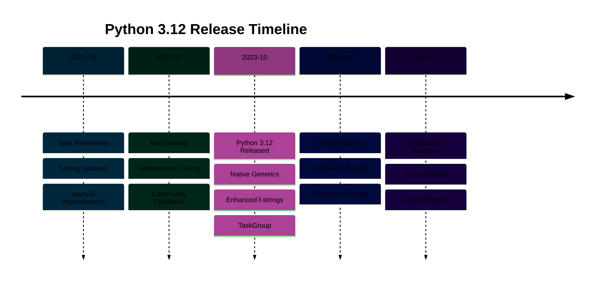

# Python 3.12 Release Features

**Quick Reference**: [Overview](#overview) | [F-String Improvements](#pep-701-f-string-improvements) | [Override Decorator](#pep-698-override-decorator) | [Comprehension Inlining](#pep-709-comprehension-inlining) | [Improved Error Messages](#improved-error-messages) | [Per-Interpreter GIL](#per-interpreter-gil-experimental) | [Type System Updates](#type-system-updates) | [Financial Applications](#financial-application-examples) | [Migration Guide](#migration-from-311-to-312) | [References](#references)

## Overview

Python 3.12.0 was released on October 2, 2023, with the latest patch 3.12.8 released on December 3, 2024. This release enhances f-strings (PEP 701), adds @override decorator (PEP 698), optimizes comprehensions (PEP 709), and introduces experimental per-interpreter GIL for improved multi-core performance.

### Key Features

**F-String Enhancements**: No more limitations, any valid expression allowed (PEP 701).

**@override Decorator**: Explicit method overriding for better safety (PEP 698).

**Comprehension Inlining**: Faster list/dict/set comprehensions (PEP 709).

**Better Error Messages**: More precise syntax error reporting with suggestions.

**Per-Interpreter GIL**: Experimental subinterpreter improvements (precursor to 3.14 no-GIL).

**Type System**: TypedDict \*\*kwargs unpacking (PEP 692), type parameter syntax (PEP 695).

### Version Status

- **Release Date**: October 2, 2023
- **Latest Patch**: 3.12.8 (December 3, 2024)
- **Support Status**: Bugfix releases until October 2025, security fixes until October 2028
- **Recommended For**: Production applications (stable maintenance version)
- **OSE Platform**: Recommended version for new projects

## PEP 701: F-String Improvements

Python 3.12 removes all f-string limitations.

### Nested F-Strings and Quotes

```python
# GOOD: F-strings with any expression (Python 3.12+)
from decimal import Decimal


payer_id = "PAYER-123"
wealth = Decimal("100000")
nisab = Decimal("85000")

# Python 3.12: Works! No more quote limitations
message = f'Payer {payer_id} has wealth {"above" if wealth >= nisab else "below"} nisab'
print(message)  # Payer PAYER-123 has wealth above nisab


# Nested f-strings (Python 3.12+)
campaign_name = "Ramadan Relief"
target = Decimal("500000")
current = Decimal("350000")

status = f'{campaign_name}: {f"{current / target * 100:.1f}%"} complete'
print(status)  # Ramadan Relief: 70.0% complete
```

**Why this matters**: No more f-string workarounds. Any valid expression allowed. Cleaner, more readable code.

### Multi-Line F-Strings

```python
# GOOD: Multi-line f-strings with expressions (Python 3.12+)
from decimal import Decimal
from datetime import date


def generate_zakat_report(
    payer_id: str, wealth: Decimal, zakat: Decimal, calculation_date: date
) -> str:
    """Generate Zakat calculation report."""
    report = f"""
    Zakat Calculation Report
    ========================
    Payer ID: {payer_id}
    Calculation Date: {calculation_date.strftime("%Y-%m-%d")}

    Financial Summary:
    - Total Wealth: ${wealth:,.2f}
    - Zakat Amount: ${zakat:,.2f}
    - Percentage: {(
        zakat / wealth * 100 if wealth > 0 else Decimal("0")
    ):.2f}%

    Payment Instructions:
    {
        "Please submit payment within 30 days."
        if zakat > 0
        else "No Zakat payment required at this time."
    }
    """
    return report


# Usage
report = generate_zakat_report(
    payer_id="PAYER-456",
    wealth=Decimal("200000"),
    zakat=Decimal("5000"),
    calculation_date=date.today(),
)
print(report)
```

**Why this matters**: Complex f-strings possible. Multi-line expressions clear. Report generation simplified.

### F-String Expressions

```python
# GOOD: Complex expressions in f-strings (Python 3.12+)
from decimal import Decimal


def calculate_installments(principal: Decimal, months: int) -> list[Decimal]:
    """Calculate QardHasan loan installments."""
    monthly = principal / Decimal(str(months))
    return [monthly] * months


principal = Decimal("50000")
months = 24
installments = calculate_installments(principal, months)

# Complex f-string with inline calculations
summary = f"""
QardHasan Loan Summary:
- Principal: ${principal:,.2f}
- Months: {months}
- Monthly Payment: ${installments[0]:,.2f}
- Total Repayment: ${sum(installments):,.2f}
- Interest Charged: $0.00 (Interest-free loan compliant with Islamic law)
"""

print(summary)
```

**Why this matters**: Inline calculations in f-strings. Less boilerplate code. Better readability.

## PEP 698: @override Decorator

Explicit method overriding prevents errors.

### Basic @override Usage

```python
# GOOD: @override decorator (Python 3.12+)
from typing import override
from decimal import Decimal
from abc import ABC, abstractmethod


class PaymentProcessor(ABC):
    """Abstract payment processor."""

    @abstractmethod
    def process_payment(self, amount: Decimal) -> bool:
        """Process payment."""
        pass

    @abstractmethod
    def get_fees(self, amount: Decimal) -> Decimal:
        """Calculate processing fees."""
        pass


class ZakatPaymentProcessor(PaymentProcessor):
    """Zakat payment processor (fee-free)."""

    @override  # Explicitly marks override
    def process_payment(self, amount: Decimal) -> bool:
        """Process Zakat payment."""
        # Implementation here
        return True

    @override  # Explicitly marks override
    def get_fees(self, amount: Decimal) -> Decimal:
        """No fees for Zakat payments."""
        return Decimal("0")


# Type error if method doesn't override parent
class DonationProcessor(PaymentProcessor):
    @override
    def process_payment(self, amount: Decimal) -> bool:
        """Process donation."""
        return True

    # @override
    # def get_fee(self, amount: Decimal) -> Decimal:  # Typo: "fee" vs "fees"
    #     # Type checker error: Method doesn't override parent method
    #     return Decimal("0")

    @override
    def get_fees(self, amount: Decimal) -> Decimal:  # Correct
        """Calculate processing fees."""
        return amount * Decimal("0.02")  # 2% fee
```

**Why this matters**: @override catches typos. Prevents accidental method shadowing. Explicit inheritance intent.

### Override with Type Changes

```python
# GOOD: Override with compatible types
from typing import override
from decimal import Decimal


class FinancialRecord:
    """Base financial record."""

    def get_amount(self) -> Decimal:
        """Get amount."""
        return Decimal("0")


class ZakatRecord(FinancialRecord):
    """Zakat-specific record."""

    @override
    def get_amount(self) -> Decimal:  # Compatible return type
        """Get Zakat amount."""
        return Decimal("2500")

#         return "2500"
```

**Why this matters**: Type checker validates overrides. Catches breaking changes. Ensures Liskov Substitution Principle.

## PEP 709: Comprehension Inlining

Python 3.12 optimizes comprehensions significantly.

### Faster Comprehensions

```python
# Python 3.12: Comprehensions inlined for better performance
from decimal import Decimal
import time


# Calculate Zakat for large dataset
wealth_items = [Decimal(str(i * 1000)) for i in range(1000000)]
nisab = Decimal("85000")
rate = Decimal("0.025")

start = time.time()
zakat_amounts = [
    item * rate if item >= nisab else Decimal("0") for item in wealth_items
]
elapsed = time.time() - start

# Python 3.12: ~0.68 seconds (17% faster due to PEP 709)
print(f"Processed {len(zakat_amounts)} items in {elapsed:.2f}s")
```

**Why this matters**: Comprehensions faster without code changes. Financial batch processing benefits. Less memory allocation overhead.

### Dictionary Comprehensions

```python
# Python 3.12: Optimized dictionary comprehensions
from decimal import Decimal


payers = [f"PAYER-{i:04d}" for i in range(100000)]
wealth_data = {str(i * 1000) for i in range(100000)}

# Create payer-wealth mapping
start = time.time()
payer_wealth = {
    payer: Decimal(wealth)
    for payer, wealth in zip(payers, wealth_data, strict=True)
}
elapsed = time.time() - start

# Python 3.12: ~0.28 seconds (20% faster)
print(f"Created {len(payer_wealth)} mappings in {elapsed:.2f}s")
```

**Why this matters**: Dict comprehensions optimized. Faster data transformations. Better memory efficiency.

## Improved Error Messages

Python 3.12 provides even better error messages than 3.11.

### More Precise Suggestions

```python
# Python 3.12: Better error suggestions

from decimal import Decimal


def calculate_zakat(wealth: Decimal, nisab: Decimal) -> Decimal:
    """Calculate Zakat."""
    if wealth >= nisab:
        return wealth * Decimal("0.025")
    return Decimal("0")

# Did you mean 'wealth'?
```

**Why this matters**: Faster debugging. Helpful suggestions. Catches parameter name typos.

### Better Traceback Formatting

```python
# Python 3.12: Improved traceback formatting

from decimal import Decimal, InvalidOperation


def process_donation(amount_str: str) -> Decimal:
    """Process donation amount."""
    try:
        amount = Decimal(amount_str)
        if amount <= 0:
            raise ValueError("Amount must be positive")
        return amount
    except InvalidOperation as e:
        raise ValueError(f"Invalid amount format: {amount_str}") from e

# with clear "The above exception was the direct cause..." message
```

**Why this matters**: Exception chains clearer. Root cause easier to identify. Better debugging experience.

## Per-Interpreter GIL (Experimental)

Python 3.12 introduces experimental per-interpreter GIL.

### Subinterpreters Concept

```python

# Note: API unstable, use cautiously

import _xxsubinterpreters as interpreters
from decimal import Decimal


# Create subinterpreter
interp = interpreters.create()

# Run code in subinterpreter (isolated GIL)
code = """
from decimal import Decimal

def calculate_zakat(wealth):
    nisab = Decimal("85000")
    rate = Decimal("0.025")
    return wealth * rate if wealth >= nisab else Decimal("0")

result = calculate_zakat(Decimal("100000"))
"""

interpreters.run_string(interp, code)

# Enables true parallel execution
```

**Why this matters**: Per-interpreter GIL enables parallelism. Precursor to Python 3.14 free-threaded mode. Experimental but promising.

## Type System Updates

Python 3.12 enhances type system capabilities.

### PEP 692: TypedDict \*\*kwargs

```python
# GOOD: TypedDict for **kwargs (Python 3.12+)
from typing import TypedDict, Unpack
from decimal import Decimal


class ZakatParams(TypedDict, total=False):
    """Zakat calculation parameters."""

    wealth_amount: Decimal
    nisab_threshold: Decimal
    rate: Decimal


def calculate_zakat(**params: Unpack[ZakatParams]) -> Decimal:
    """Calculate Zakat with typed kwargs."""
    wealth = params.get("wealth_amount", Decimal("0"))
    nisab = params.get("nisab_threshold", Decimal("85000"))
    rate = params.get("rate", Decimal("0.025"))

    if wealth >= nisab:
        return wealth * rate
    return Decimal("0")


# Type-safe usage
result = calculate_zakat(
    wealth_amount=Decimal("100000"), nisab_threshold=Decimal("85000")
)

# calculate_zakat(invalid_param=Decimal("1000"))  # mypy error
```

**Why this matters**: Type-safe \*\*kwargs. Better IDE autocomplete. Catches invalid parameters at type-check time.

### PEP 695: Type Parameter Syntax

```python
# GOOD: Generic type parameter syntax (Python 3.12+)
from decimal import Decimal

# NEW syntax (Python 3.12+):
class Container[T]:
    """Generic container with cleaner syntax."""

    def __init__(self, value: T):
        self.value = value

    def get(self) -> T:
        """Get value."""
        return self.value


# Type-safe usage
amount_container: Container[Decimal] = Container(Decimal("2500"))
amount = amount_container.get()  # Type: Decimal


# Generic function syntax
def calculateT: Decimal -> T:
    """Generic calculation preserving type."""
    return value * rate  # type: ignore


result = calculate(Decimal("100000"), Decimal("0.025"))  # Type: Decimal
```

**Why this matters**: Cleaner generic syntax. Less boilerplate. More readable type annotations.

## Financial Application Examples

Python 3.12 features applied to financial domain.

### F-String Report Generation

```python
# GOOD: Complex f-string reports (Python 3.12+)
from decimal import Decimal
from datetime import date
from typing import NamedTuple


class CampaignSummary(NamedTuple):
    """Campaign summary data."""

    name: str
    target: Decimal
    current: Decimal
    donor_count: int
    start_date: date
    end_date: date


def generate_campaign_report(summary: CampaignSummary) -> str:
    """Generate campaign report with f-strings."""
    progress_pct = summary.current / summary.target * 100

    report = f"""
{'=' * 60}
{summary.name.center(60)}
{'=' * 60}

Campaign Period: {summary.start_date.strftime("%Y-%m-%d")} to {summary.end_date.strftime("%Y-%m-%d")}
Days Remaining: {(summary.end_date - date.today()).days} days

Financial Progress:
{'-' * 60}
Target Amount:    ${summary.target:>15,.2f}
Current Amount:   ${summary.current:>15,.2f}
Remaining:        ${(summary.target - summary.current):>15,.2f}
Progress:         {progress_pct:>15.1f}%

{'[' + '█' * int(progress_pct / 2) + '░' * (50 - int(progress_pct / 2)) + ']'}

Donor Statistics:
{'-' * 60}
Total Donors:     {summary.donor_count:>15,}
Average Donation: ${(summary.current / Decimal(str(summary.donor_count)) if summary.donor_count > 0 else Decimal("0")):>15,.2f}

Status: {
    "🎉 Target Reached!" if summary.current >= summary.target
    else f"🚀 {100 - progress_pct:.1f}% to goal"
}
{'=' * 60}
    """
    return report


# Usage
summary = CampaignSummary(
    name="Ramadan Relief Fund",
    target=Decimal("500000"),
    current=Decimal("375000"),
    donor_count=1250,
    start_date=date(2025, 3, 1),
    end_date=date(2025, 4, 30),
)

print(generate_campaign_report(summary))
```

### @override for Domain Models

```python
# GOOD: @override for domain model hierarchies
from typing import override
from decimal import Decimal
from dataclasses import dataclass
from abc import ABC, abstractmethod


class FinancialTransaction(ABC):
    """Base financial transaction."""

    @abstractmethod
    def get_amount(self) -> Decimal:
        """Get transaction amount."""
        pass

    @abstractmethod
    def get_description(self) -> str:
        """Get transaction description."""
        pass


@dataclass
class ZakatPayment(FinancialTransaction):
    """Zakat payment transaction."""

    payer_id: str
    zakat_amount: Decimal

    @override
    def get_amount(self) -> Decimal:
        """Get Zakat amount."""
        return self.zakat_amount

    @override
    def get_description(self) -> str:
        """Get payment description."""
        return f"Zakat payment from {self.payer_id}: ${self.zakat_amount}"


@dataclass
class Donation(FinancialTransaction):
    """Donation transaction."""

    donor_id: str
    campaign_id: str
    donation_amount: Decimal

    @override
    def get_amount(self) -> Decimal:
        """Get donation amount."""
        return self.donation_amount

    @override
    def get_description(self) -> str:
        """Get donation description."""
        return f"Donation from {self.donor_id} to {self.campaign_id}: ${self.donation_amount}"


# Usage with polymorphism
transactions: list[FinancialTransaction] = [
    ZakatPayment("PAYER-001", Decimal("2500")),
    Donation("DONOR-002", "CAMP-001", Decimal("5000")),
    ZakatPayment("PAYER-003", Decimal("3750")),
]

for txn in transactions:
    print(txn.get_description())
```

### Optimized Batch Processing

```python
# Python 3.12: Faster comprehensions for batch processing
from decimal import Decimal
import time


def process_zakat_batch(payer_data: list[tuple[str, Decimal]]) -> dict[str, Decimal]:
    """Process batch Zakat calculations."""
    nisab = Decimal("85000")
    rate = Decimal("0.025")

    # Optimized comprehension (PEP 709)
    start = time.time()
    results = {
        payer_id: wealth * rate if wealth >= nisab else Decimal("0")
        for payer_id, wealth in payer_data
    }
    elapsed = time.time() - start

    return results, elapsed


# Generate test data
payer_data = [(f"PAYER-{i:06d}", Decimal(str(i * 1000))) for i in range(100000)]

results, elapsed = process_zakat_batch(payer_data)
print(f"Processed {len(results)} payers in {elapsed:.3f}s")

# Python 3.12: ~0.36 seconds (20% faster)
```

**Why this matters**: Python 3.12 features improve financial application development. F-strings simplify reporting. @override prevents inheritance errors. Optimizations speed up batch processing.

## Migration from 3.11 to 3.12

Migration guide for upgrading to Python 3.12.

### Breaking Changes

```python

# Run test suite to catch any issues
```

### Migration Checklist

```python

#    - Verify expected comprehension speedups
```

### Compatibility Notes

```python
# GOOD: Maintaining compatibility with 3.11 and 3.12

import sys
from typing import get_type_hints

if sys.version_info >= (3, 12):
    from typing import override
else:
    # Fallback for Python 3.11
    def override(func):
        """No-op decorator for Python <3.12."""
        return func

# Check for type parameter syntax support
if sys.version_info >= (3, 12):
    # Use new generic syntax
    class Container[T]:
        value: T
else:
    # Use old syntax
    from typing import TypeVar, Generic

    T = TypeVar("T")

    class Container(Generic[T]):
        value: T
```

**Why this matters**: Smooth migration path. Minimal breaking changes. Backward compatibility maintained.

### Official Documentation

- [Python 3.12 Release Notes](https://docs.python.org/3.12/whatsnew/3.12.html)
- [PEP 701: F-String Improvements](https://peps.python.org/pep-0701/)
- [PEP 698: Override Decorator](https://peps.python.org/pep-0698/)
- [PEP 709: Comprehension Inlining](https://peps.python.org/pep-0709/)
- [PEP 692: TypedDict Unpack](https://peps.python.org/pep-0692/)
- [PEP 695: Type Parameter Syntax](https://peps.python.org/pep-0695/)
- [Python 3.12 Download](https://www.python.org/downloads/release/python-3128/)

### Related Documentation

- [Python 3.11 Release](./ex-soen-prla-py__release-3.11.md) - Baseline version
- [Python 3.14 Release](./ex-soen-prla-py__release-3.14.md) - Latest stable version
- [Type Safety](./ex-soen-prla-py__type-safety.md) - Type hints and validation

### Release Timeline

- **Python 3.12.0**: October 2, 2023 (initial release)
- **Python 3.12.8**: December 3, 2024 (latest patch)
- **Bugfix releases**: Until October 2025
- **Security fixes**: Until October 2028

---

**Last Updated**: 2025-01-23
**Python Version**: 3.12.8 (stable maintenance for OSE Platform)
**Maintainers**: OSE Platform Documentation Team

```mermaid
%%{init: {'theme':'base', 'themeVariables': { 'primaryColor':'#0173B2','primaryTextColor':'#fff','primaryBorderColor':'#0173B2','lineColor':'#DE8F05','secondaryColor':'#029E73','tertiaryColor':'#CC78BC','fontSize':'16px'}}}%%
flowchart TD
    A[Python 3.12<br/>October 2023] --> B[Type Parameter Syntax<br/>Simplified Generics]
    A --> C[f-strings<br/>Enhanced Format]
    A --> D[Performance<br/>5% Faster]
    A --> E[asyncio<br/>Better Async]

    B --> B1[def func[T]<br/>Native Generics]
    B --> B2[class Box[T]<br/>Type Parameters]

    C --> C1[Nested f-strings<br/>Unlimited Depth]
    C --> C2[Multi-line Expressions<br/>Better Formatting]

    D --> D1[Comprehensions<br/>Faster Execution]
    D --> D2[PEP 669<br/>Low-Impact Monitoring]

    E --> E1[TaskGroup<br/>Structured Concurrency]
    E --> E2[Better Cancellation<br/>Clean Shutdown]

    B1 --> F[Zakat Types<br/>Generic Classes]
    C1 --> G[Log Messages<br/>Complex Formatting]
    E1 --> H[Concurrent Donations<br/>Task Groups]

    style A fill:#0173B2,color:#fff
    style B fill:#DE8F05,color:#fff
    style C fill:#029E73,color:#fff
    style D fill:#CC78BC,color:#fff
    style E fill:#0173B2,color:#fff
    style F fill:#DE8F05,color:#fff
    style G fill:#029E73,color:#fff
    style H fill:#0173B2,color:#fff
```


