# Rust

**This is THE authoritative reference** for Rust coding standards in OSE Platform.

All Rust code written for the OSE Platform MUST comply with the standards documented here. These standards are mandatory, not optional. Non-compliance blocks code review and merge approval.

## Framework Stack

OSE Platform Rust applications MUST use the following stack:

**Web Framework**:

- **Axum 0.8** (RECOMMENDED) - Async web framework built on Tokio, composable with Tower middleware
- **Actix-web 4** - Actor-based, high-performance alternative for throughput-critical services
- **hyper 1.x** - HTTP primitives layer for custom HTTP handling
- **tower** - Middleware and service abstraction layer

**Async Runtime**:

- **Tokio 1.x** - Standard async runtime (REQUIRED for Axum and async code)

**Database**:

- **SQLx** (RECOMMENDED) - Async, compile-time SQL verification, no ORM overhead
- **SeaORM** - Async ORM built on SQLx when active-record patterns needed
- **Diesel** - Synchronous ORM with strong type guarantees

**Serialization**:

- **Serde** - Standard serialization/deserialization framework (REQUIRED)
- **serde_json** - JSON support via Serde (REQUIRED for REST APIs)

**Error Handling**:

- **thiserror** - Custom error type derivation for libraries and domain errors
- **anyhow** - Error context and propagation for application-level code

**Testing**:

- Built-in `cargo test` with `#[test]` and `#[cfg(test)]`
- **tokio::test** for async test functions
- **proptest** - Property-based testing
- **mockall** - Trait mocking with `#[automock]`
- **rstest** - Test fixtures and parameterized tests

**Quality Tools**:

- **rustfmt** (MANDATORY) - Canonical formatting via `.rustfmt.toml`
- **Clippy** (MANDATORY) - Extensive lint set including `clippy::pedantic`
- **cargo audit** - Security vulnerability scanning via RustSec advisory database
- **cargo deny** - Dependency policy enforcement via `deny.toml`

**Coverage**:

- **cargo-llvm-cov** (RECOMMENDED) - LLVM-based coverage measurement
- **cargo-tarpaulin** - Alternative coverage tool

**Go Version Strategy**:

- **Baseline**: Rust 2018 edition (MUST support minimum)
- **Recommended**: Rust 2021 edition (SHOULD use for all current projects)
- **Upcoming**: Rust 2024 edition (SHOULD adopt when stabilized)
- **Version**: Rust 1.82+ (stable)

**See**: [Programming Language Documentation Separation Convention](../../../../../governance/conventions/structure/programming-language-docs-separation.md) for Rust-specific release documentation location

## Prerequisite Knowledge

**REQUIRED**: This documentation assumes you have completed the AyoKoding Rust learning path. These are **OSE Platform-specific style guides**, not educational tutorials.

**You MUST understand Rust fundamentals before using these standards:**

- **[Rust Learning Path](../../../../../apps/ayokoding-web/content/en/learn/software-engineering/programming-languages/rust/)** - Complete language coverage
- **[Rust By Example](../../../../../apps/ayokoding-web/content/en/learn/software-engineering/programming-languages/rust/by-example/)** - Annotated code examples from basic to advanced

**What this documentation covers**: OSE Platform naming conventions, framework choices, repository-specific patterns, how to apply Rust knowledge in THIS codebase.

**What this documentation does NOT cover**: Rust syntax, ownership/borrowing fundamentals, language concepts (those are in ayokoding-web).

**See**: [Programming Language Documentation Separation Convention](../../../../../governance/conventions/structure/programming-language-docs-separation.md) for content separation rules.

## Software Engineering Principles

Rust development in OSE Platform enforces foundational software engineering principles — and uniquely, Rust ENFORCES many of them at the compiler level rather than by convention:

1. **[Automation Over Manual](../../../../../governance/principles/software-engineering/automation-over-manual.md)** - MUST automate through `rustfmt` (formatting), Clippy (linting), `cargo test` (testing), `cargo audit` (security), `cargo deny` (dependencies), and CI/CD integration. The compiler itself automates correctness verification.

2. **[Explicit Over Implicit](../../../../../governance/principles/software-engineering/explicit-over-implicit.md)** - MUST enforce explicitness through explicit error returns (`Result<T, E>`), explicit lifetime annotations when needed, explicit type declarations for public APIs, explicit `mut` declarations for mutability, and explicit `unsafe` blocks for unsafe operations.

3. **[Immutability Over Mutability](../../../../../governance/principles/software-engineering/immutability.md)** - Rust ENFORCES immutability by default at the compiler level. All bindings are immutable unless explicitly declared `mut`. The ownership system prevents shared mutable state. No other language in the OSE Platform stack enforces this principle at compile time.

4. **[Pure Functions Over Side Effects](../../../../../governance/principles/software-engineering/pure-functions.md)** - MUST implement functional core/imperative shell architecture. Rust's ownership system naturally encourages pure functions (functions that take ownership or borrow data and return new values). Iterator combinators produce functional pipelines. The borrow checker prevents hidden shared mutable state.

5. **[Reproducibility First](../../../../../governance/principles/software-engineering/reproducibility.md)** - MUST ensure reproducibility through `Cargo.toml` with semantic versioning, `Cargo.lock` committed for binaries (not libraries), `rust-toolchain.toml` for exact toolchain pinning, and `cargo vendor` for offline builds.

## Rust Edition Strategy

OSE Platform follows a three-tier Rust edition strategy:

**Rust 2018 Edition (Minimum - REQUIRED)**:

- All projects MUST support Rust 2018 edition as minimum
- `extern crate` no longer required
- `use` paths simplified
- NLL (Non-Lexical Lifetimes) stabilized

**Rust 2021 Edition (Recommended - SHOULD use)**:

- Projects SHOULD use Rust 2021 for all new work
- `use` in closures captures only needed fields (closure capture improvements)
- `IntoIterator` for arrays stabilized
- `panic!` macro takes format strings uniformly
- Or-patterns in `match` (`A | B` in patterns)
- `Cargo.toml` `resolver = "2"` default (better feature unification)

**Rust 2024 Edition (Upcoming - SHOULD adopt)**:

- Projects SHOULD adopt Rust 2024 when stabilized
- `gen` blocks for generator syntax
- Stricter lifetime inference in `impl Trait`
- `unsafe` in `extern` blocks required explicitly

**Unlike Java's LTS model**: Rust editions are backward compatible — Rust 2015 code compiles with Rust 2024 toolchains. Editions change language idioms, not remove features. Migrate editions using `cargo fix --edition`.

## OSE Platform Coding Standards (Authoritative)

**MUST follow these mandatory standards for all Rust code in OSE Platform:**

1. **[Coding Standards](coding-standards.md)** - Naming conventions, module organization, idiomatic Rust
2. **[Testing Standards](testing-standards.md)** - cargo test, proptest, mockall, tokio::test, coverage
3. **[Code Quality Standards](code-quality-standards.md)** - rustfmt, Clippy, cargo audit, cargo deny, unsafe policy
4. **[Build Configuration](build-configuration.md)** - Cargo.toml, workspaces, Cargo.lock, profiles, cargo-nextest
5. **[Error Handling Standards](error-handling-standards.md)** - Result/Option, thiserror, anyhow, ? operator
6. **[Concurrency Standards](concurrency-standards.md)** - Send/Sync, async/await, Tokio, Arc/Mutex, channels
7. **[Performance Standards](performance-standards.md)** - Zero-cost abstractions, criterion.rs, profiling, allocations
8. **[Security Standards](security-standards.md)** - Memory safety, cargo audit, secrecy crate, safe code policy
9. **[API Standards](api-standards.md)** - Axum routing, extractors, Tower middleware, AppState
10. **[DDD Standards](ddd-standards.md)** - Value objects, aggregates, Repository trait, domain events
11. **[Memory Management Standards](memory-management-standards.md)** - Ownership, borrowing, lifetimes, smart pointers
12. **[Type Safety Standards](type-safety-standards.md)** - Traits, generics, algebraic types, phantom types

## Documentation Structure

### Quick Reference

**Mandatory Standards (All Rust Developers MUST follow)**:

1. [Coding Standards](coding-standards.md) - Naming, module structure, idiomatic Rust compliance
2. [Testing Standards](testing-standards.md) - cargo test patterns, coverage requirements, async testing
3. [Code Quality Standards](code-quality-standards.md) - rustfmt configuration, Clippy lint set

**Context-Specific Standards (Apply when relevant)**:

- **Security**: [Security Standards](security-standards.md) - cargo audit, safe code, secrets management
- **Concurrency**: [Concurrency Standards](concurrency-standards.md) - async/await, Tokio, Send/Sync
- **Domain Modeling**: [DDD Standards](ddd-standards.md) - Value objects, aggregates, Repository trait
- **APIs**: [API Standards](api-standards.md) - Axum routing, extractors, middleware
- **Performance**: [Performance Standards](performance-standards.md) - Profiling, benchmarks, zero-cost abstractions
- **Error Handling**: [Error Handling Standards](error-handling-standards.md) - Result/Option, thiserror, anyhow
- **Memory**: [Memory Management Standards](memory-management-standards.md) - Ownership, lifetimes, smart pointers
- **Type Safety**: [Type Safety Standards](type-safety-standards.md) - Traits, generics, algebraic types
- **Build**: [Build Configuration](build-configuration.md) - Cargo.toml, workspaces, profiles

### Documentation Organization

```mermaid
%% Color Palette: Blue #0173B2, Orange #DE8F05, Teal #029E73, Purple #CC78BC
%% All colors are color-blind friendly and meet WCAG AA contrast standards

graph TD
    A["Rust Standards Index<br/>(OSE Platform)"]:::blue
    B["Core Standards"]:::orange
    C["Specialized Standards"]:::teal
    D["Learning Resources<br/>(AyoKoding)"]:::purple

    A --> B
    A --> C
    A --> D

    B --> E["Coding Standards"]:::orange
    B --> F["Testing Standards"]:::orange
    B --> G["Code Quality"]:::orange
    B --> H["Build Configuration"]:::orange

    C --> I["Security Standards"]:::teal
    C --> J["Concurrency Standards"]:::teal
    C --> K["DDD Standards"]:::teal
    C --> L["API Standards"]:::teal
    C --> M["Performance Standards"]:::teal
    C --> N["Error Handling"]:::teal
    C --> O["Memory Management"]:::teal
    C --> P["Type Safety"]:::teal

    D --> Q["By Example<br/>(Annotated examples)"]:::purple
    D --> R["In the Field<br/>(Production patterns)"]:::purple

    classDef blue fill:#0173B2,stroke:#000000,color:#FFFFFF,stroke-width:2px
    classDef orange fill:#DE8F05,stroke:#000000,color:#FFFFFF,stroke-width:2px
    classDef teal fill:#029E73,stroke:#000000,color:#FFFFFF,stroke-width:2px
    classDef purple fill:#CC78BC,stroke:#000000,color:#000000,stroke-width:2px
```

## Primary Use Cases in OSE Platform

**High-Performance Financial Computation**:

- Zakat calculation engines MUST use Rust for deterministic arithmetic without GC pauses
- Profit-sharing (Musharakah) calculations SHOULD use Rust where precision and throughput are critical
- Financial data pipelines MAY use Rust for zero-copy parsing and transformation
- All financial computation MUST use `rust_decimal` or `fixed` crates — never `f32`/`f64`

**WebAssembly (WASM) Compilation**:

- Client-side computation modules SHOULD compile to WASM using `wasm-pack`
- Shared business logic between server and browser MAY be written in Rust and compiled to both
- WASM targets use `wasm-bindgen` for JavaScript interop

**CLI Tools**:

- Repository automation tools MAY use Rust for single-binary distribution without runtime dependency
- Administrative tools SHOULD use `clap` for argument parsing
- `tracing` for structured logging in CLI tools

**System-Level Services**:

- Services requiring direct OS interface MUST use Rust over C/C++ for memory safety
- Custom network protocol implementations MAY use Rust with `tokio` for async I/O
- Embedded targets (Cortex-M) for IoT/hardware integration use `no_std` Rust

## Reproducible Builds and Automation

**Version Management (REQUIRED)**:

- MUST use `rust-toolchain.toml` to pin exact toolchain version
- MUST specify `edition = "2021"` (or later) in `Cargo.toml`
- SHOULD use `rustup` for local toolchain management
- MUST NOT rely on system-installed Rust without toolchain file verification

**Dependency Management (REQUIRED)**:

- MUST use `Cargo.toml` for dependency declarations with semantic versioning
- MUST commit `Cargo.lock` for binaries (git-ignore for libraries)
- SHOULD run `cargo update` on a schedule and review changes
- MUST use `cargo deny` with `deny.toml` to enforce license and security policies
- SHOULD use `cargo audit` in CI/CD to detect known vulnerabilities

**Automated Quality (REQUIRED)**:

- MUST use `rustfmt` for formatting (enforced via pre-commit hooks)
- MUST use `cargo clippy -- -D warnings` in CI (deny all warnings)
- MUST enable `clippy::pedantic` lint group for comprehensive analysis
- MUST use `cargo test` for all automated testing
- SHOULD use `cargo-nextest` for faster parallel test execution
- MUST achieve >=95% line coverage for domain logic (measured with `cargo-llvm-cov`)

**Testing Automation (REQUIRED)**:

- MUST write unit tests in `#[cfg(test)]` modules within source files
- MUST write integration tests in the `tests/` directory
- MUST use `#[tokio::test]` for async test functions
- SHOULD use `proptest` for property-based testing of domain invariants
- SHOULD use `mockall` with `#[automock]` for trait mocking

**Build Automation (REQUIRED)**:

- MUST use `Makefile` or `justfile` for build task automation (`build`, `test`, `lint`, `fmt`)
- SHOULD integrate `cargo clippy` and `cargo test` in CI/CD pipeline
- MUST use `cargo build --release` with LTO for production binaries

**See**: [Automation Over Manual](../../../../../governance/principles/software-engineering/automation-over-manual.md), [Reproducibility First](../../../../../governance/principles/software-engineering/reproducibility.md)

## Integration with Repository Governance

**Development Practices**:

- [Functional Programming](../../../../../governance/development/pattern/functional-programming.md) - MUST follow FP principles; Rust's ownership system naturally enforces functional style
- [Implementation Workflow](../../../../../governance/development/workflow/implementation.md) - MUST follow "make it work -> make it right -> make it fast" process
- [Code Quality Standards](../../../../../governance/development/quality/code.md) - MUST meet platform-wide quality requirements
- [Commit Messages](../../../../../governance/development/workflow/commit-messages.md) - MUST use Conventional Commits format

**Code Review Requirements**:

- All Rust code MUST pass automated checks (`cargo clippy -- -D warnings`, `cargo test`, coverage >=95% for domain logic)
- Code reviewers MUST verify compliance with standards in this index
- Non-compliance with mandatory standards (Coding, Testing, Code Quality) blocks merge
- `unsafe` blocks MUST include a `// SAFETY:` comment documenting invariants
- Data races are prevented by the compiler — reviewers verify `Send`/`Sync` bounds are correctly applied

## Related Documentation

**Software Engineering Principles**:

- [Automation Over Manual](../../../../../governance/principles/software-engineering/automation-over-manual.md)
- [Explicit Over Implicit](../../../../../governance/principles/software-engineering/explicit-over-implicit.md)
- [Immutability Over Mutability](../../../../../governance/principles/software-engineering/immutability.md)
- [Pure Functions Over Side Effects](../../../../../governance/principles/software-engineering/pure-functions.md)
- [Reproducibility First](../../../../../governance/principles/software-engineering/reproducibility.md)

**Development Practices**:

- [Functional Programming](../../../../../governance/development/pattern/functional-programming.md)
- [Maker-Checker-Fixer Pattern](../../../../../governance/development/pattern/maker-checker-fixer.md)

**Platform Documentation**:

- [Tech Stack Languages Index](../README.md)
- [Monorepo Structure](../../../../reference/monorepo-structure.md)

---

**Status**: Authoritative Standard (Mandatory Compliance)

**Rust Version**: 1.82+ (stable), Edition 2021 (recommended)
**Framework Stack**: Axum 0.8, Tokio 1.x, SQLx, Serde, thiserror, anyhow, Clippy, rustfmt
**Maintainers**: Platform Architecture Team
