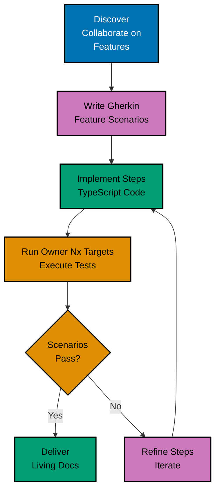
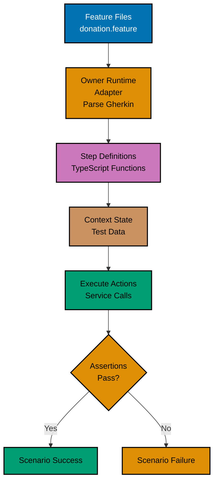
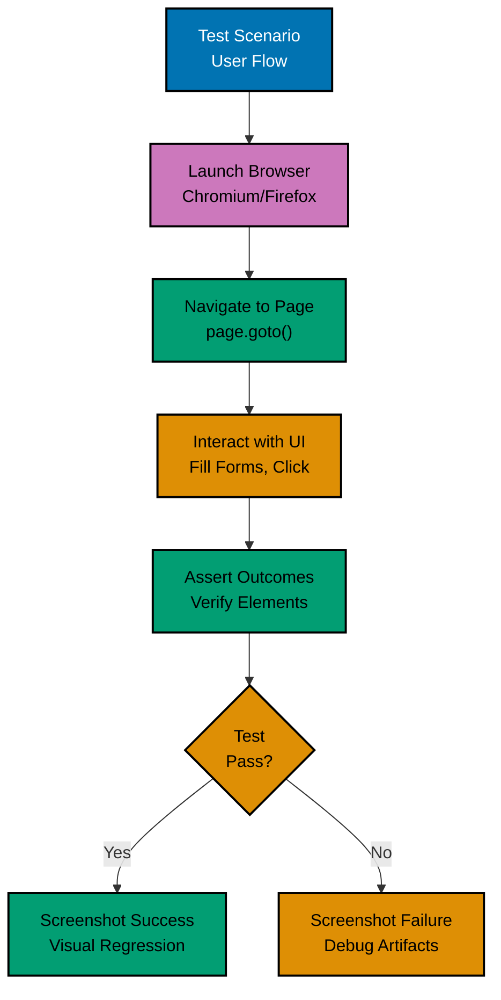
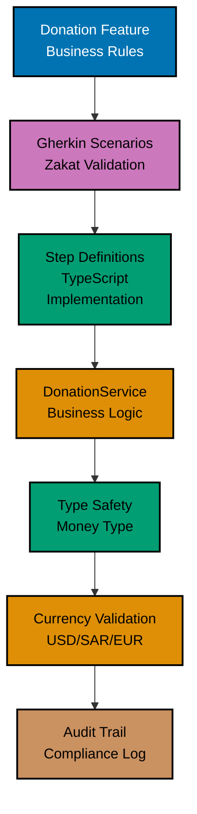

# TypeScript Behaviour-Driven Development

**Quick Reference**: [Overview](#overview) | [Gherkin](#gherkin-syntax) | [Unit Bindings](#vitest-cucumber-unit-bindings) | [Playwright](#playwright-bdd-e2e-testing) | [Component Testing](#component-testing) | [Visual Regression](#visual-regression-testing) | [Related Documentation](#related-documentation)

## Overview

Behaviour-Driven Development (BDD) uses natural language to describe system behaviour. Gherkin
syntax allows stakeholders to understand and validate requirements. Every testable TypeScript
owner stores that behaviour in its recursively discovered `specs/apps/**/behaviours/` or
`specs/libs/**/behaviours/` corpus and follows the
[canonical OSE BDD contract](../../../../../repo-governance/development/behaviour-driven-development.md).

### BDD Principles

- **Shared Understanding**: Business, QA, Dev collaborate
- **Living Documentation**: Tests document system behaviour
- **Executable Specifications**: Gherkin scenarios are automated
- **Outside-In**: Start from user perspective

### BDD Workflow



### Owner-Local Adapter Execution



### Playwright E2E Flow



### Financial BDD Testing



## Gherkin Syntax

### Basic Structure

```gherkin
Feature: Donation Processing
  As a donor
  I want to make donations
  So that I can contribute to charitable causes

  Background:
    Given the donation platform is running
    And the donor "Ahmad Ibrahim" is registered

  Scenario: Successful Zakat donation
    Given the donor has wealth of 100000 USD
    And the nisab threshold is 3000 USD
    When the donor submits a Zakat donation of 2500 USD
    Then the donation should be created successfully
    And the donation status should be "pending"
    And a confirmation email should be sent

  Scenario: Donation below minimum amount
    Given the minimum donation amount is 10 USD
    When the donor submits a donation of 5 USD
    Then the donation should be rejected
    And the error message should contain "below minimum"

  Scenario Outline: Multi-currency donations
    Given the exchange rate for <currency> is <rate> USD
    When the donor submits a donation of <amount> <currency>
    Then the equivalent USD amount should be <usd_amount>

    Examples:
      | currency | rate | amount | usd_amount |
      | EUR      | 1.10 | 1000   | 1100       |
      | SAR      | 0.27 | 1000   | 270        |
      | GBP      | 1.27 | 1000   | 1270       |
```

## Vitest Cucumber Unit Bindings

Use `@amiceli/vitest-cucumber` in the behaviour owner's `test:unit` suite. Unit setup replaces all
filesystem, database, environment, clock, process, and network dependencies with injected doubles.
The same native Unit runtime enforces the owner's minimum 99% line coverage.

```typescript
// tests/unit/steps/donation.steps.ts
import { describeFeature, loadFeature } from "@amiceli/vitest-cucumber";
import { expect, vi } from "vitest";
import { DonationService, type Donation } from "../../../src/donation-service";

const feature = await loadFeature("specs/apps/finance/donation/behaviours/donation/donation-processing.feature");

describeFeature(feature, ({ Scenario }) => {
  Scenario("Successful Zakat donation", ({ Given, When, Then, And }) => {
    const email = { sendConfirmation: vi.fn() };
    const service = new DonationService({ email });
    let donation: Donation | undefined;

    Given("the donor has wealth of 100000 USD", () => {
      service.setWealth({ amount: 100000, currency: "USD" });
    });
    And("the nisab threshold is 3000 USD", () => {
      service.setNisab({ amount: 3000, currency: "USD" });
    });
    When("the donor submits a Zakat donation of 2500 USD", async () => {
      donation = await service.create({ amount: 2500, currency: "USD", category: "zakat" });
    });
    Then("the donation should be created successfully", () => {
      expect(donation).toBeDefined();
    });
    And('the donation status should be "pending"', () => {
      expect(donation?.status).toBe("pending");
    });
    And("a confirmation email should be sent", () => {
      expect(email.sendConfirmation).toHaveBeenCalledOnce();
    });
  });
});
```

## Playwright BDD E2E Testing

### Setup

```typescript
// playwright.config.ts
import { defineConfig, devices } from "@playwright/test";
import { defineBddConfig } from "playwright-bdd";

const testDir = defineBddConfig({
  featuresRoot: "../../specs/apps/finance/donation/behaviours",
  features: "../../specs/apps/finance/donation/behaviours/**/*.feature",
  steps: ["./steps/**/*.steps.ts"],
  tags: "not @e2e-exempt",
});

export default defineConfig({
  testDir,
  fullyParallel: true,
  forbidOnly: !!process.env.CI,
  retries: process.env.CI ? 2 : 0,
  workers: process.env.CI ? 1 : undefined,
  reporter: "html",
  use: {
    baseURL: "http://localhost:3000",
    trace: "on-first-retry",
  },
  projects: [
    {
      name: "chromium",
      use: { ...devices["Desktop Chrome"] },
    },
    {
      name: "firefox",
      use: { ...devices["Desktop Firefox"] },
    },
    {
      name: "webkit",
      use: { ...devices["Desktop Safari"] },
    },
  ],
});
```

### E2E Step Binding Example

```typescript
// steps/donation.steps.ts
import { expect } from "@playwright/test";
import { createBdd } from "playwright-bdd";

const { Given, When, Then } = createBdd();

Given("an active donation campaign", async ({ page }) => {
  await page.goto("/campaigns/active-campaign");
});

When("the donor submits a donation of 1000 USD", async ({ page }) => {
  await page.getByLabel("Amount").fill("1000");
  await page.getByLabel("Currency").selectOption("USD");
  await page.getByRole("button", { name: "Donate" }).click();
});

Then("the donation should be accepted", async ({ page }) => {
  await expect(page.getByRole("status")).toContainText("Donation accepted");
  await expect(page).toHaveURL(/\/donations\/DON-/);
});
```

## Component Testing

### React Component Testing

```typescript
// components/DonationForm.test.tsx
import { test, expect } from "@playwright/experimental-ct-react";
import DonationForm from "./DonationForm";

test("renders donation form", async ({ mount }) => {
  const component = await mount(<DonationForm />);

  await expect(component.locator('input[name="amount"]')).toBeVisible();
  await expect(component.locator('select[name="currency"]')).toBeVisible();
  await expect(component.locator('button[type="submit"]')).toBeVisible();
});

test("validates amount input", async ({ mount }) => {
  const component = await mount(<DonationForm />);

  await component.locator('input[name="amount"]').fill("-100");
  await component.locator('button[type="submit"]').click();

  await expect(component.locator(".error")).toContainText(
    "Amount must be positive"
  );
});

test("calls onSubmit with valid data", async ({ mount }) => {
  const onSubmit = jest.fn();
  const component = await mount(<DonationForm onSubmit={onSubmit} />);

  await component.locator('input[name="amount"]').fill("1000");
  await component.locator('select[name="currency"]').selectOption("USD");
  await component.locator('button[type="submit"]').click();

  expect(onSubmit).toHaveBeenCalledWith({
    amount: 1000,
    currency: "USD",
  });
});
```

## Visual Regression Testing

### Playwright Visual Comparisons

```typescript
// e2e/visual-regression.spec.ts
import { test, expect } from "@playwright/test";

test("donation form visual regression", async ({ page }) => {
  await page.goto("/donate");

  // Take screenshot
  await expect(page).toHaveScreenshot("donation-form.png");
});

test("donation confirmation visual", async ({ page }) => {
  await page.goto("/donate");

  // Fill and submit form
  await page.fill('input[name="amount"]', "1000");
  await page.click('button[type="submit"]');

  // Wait for success message
  await page.waitForSelector(".success-message");

  // Visual comparison
  await expect(page).toHaveScreenshot("donation-confirmation.png");
});

test("donation form on mobile", async ({ page }) => {
  await page.setViewportSize({ width: 375, height: 667 });
  await page.goto("/donate");

  await expect(page).toHaveScreenshot("donation-form-mobile.png");
});
```

## BDD Checklist

### Feature File Quality

- [ ] Scenarios written in plain language (non-technical stakeholders can read)
- [ ] Given-When-Then structure followed consistently
- [ ] Scenarios focus on behaviour, not implementation details
- [ ] Scenario Outlines with Examples used for multiple inputs
- [ ] Background section for common setup steps

### Scenario Structure

- [ ] Given: Context/preconditions clear and complete
- [ ] When: Single action described (not multiple actions)
- [ ] Then: Expected outcome specified clearly
- [ ] And: Used appropriately for additional steps
- [ ] Scenario names describe business value (not UI details)

### Step Definitions

- [ ] Step definitions are reusable across scenarios
- [ ] No business logic in steps (delegate to service/domain layer)
- [ ] Steps follow TypeScript idioms (async/await, type safety)
- [ ] Error messages are descriptive and helpful
- [ ] Context variables typed correctly

### Collaboration

- [ ] Scenarios reviewed by business stakeholders
- [ ] Ubiquitous language used consistently (domain terminology)
- [ ] Scenarios executable through `@amiceli/vitest-cucumber` Unit bindings and every applicable adapter
- [ ] Living documentation kept up to date
- [ ] Three Amigos conversation: BA, Dev, Tester

### Vitest Cucumber/Playwright BDD Best Practices

- [ ] Feature files organized by domain below the owner's canonical `specs/**/behaviours/` corpus
- [ ] Unit bindings stay owner-local; E2E bindings stay in the dedicated E2E project
- [ ] Non-layer tags used only where they add meaning (`@smoke`, `@critical`); never `@unit`,
      `@integration`, `@e2e`, `@pending`, or `@wip`
- [ ] Background steps minimized (only truly shared setup)
- [ ] Page Object Model used for E2E tests (Playwright)

### Financial Domain BDD

- [ ] Shariah compliance scenarios included (halal/haram validation)
- [ ] Zakat calculation scenarios with examples (nisab, rates, exemptions)
- [ ] Murabaha contract scenarios with Given-When-Then (profit validation)
- [ ] Audit trail scenarios verified (who, what, when)
- [ ] Currency scenarios tested (USD, SAR, EUR conversions with Money type)

## Related Documentation

- **[TypeScript TDD](test-driven-development.md)** - TDD patterns
- **[TypeScript Best Practices](best-practices.md)** - Coding standards
- **[Canonical OSE BDD Contract](../../../../../repo-governance/development/behaviour-driven-development.md)** - Required corpus, adapters, boundaries, coverage, and review

---

**TypeScript Version**: 5.0+ (baseline), 5.4+ (milestone), 5.6+ (stable), 5.9.3+ (latest stable)
**Testing Frameworks**: `@amiceli/vitest-cucumber` 6.3.0, `playwright-bdd` 8.5.1, Playwright 1.57.0
**Maintainers**: OSE Documentation Team
