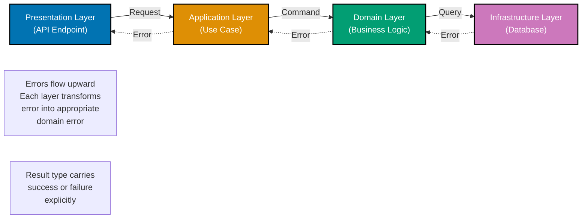
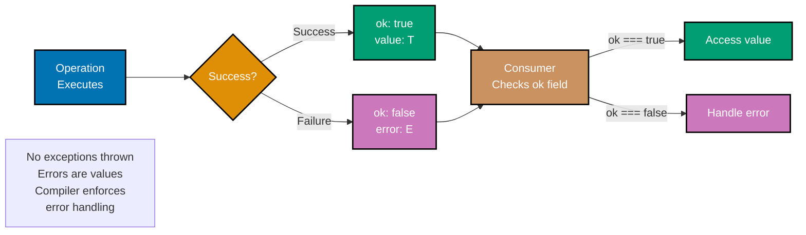
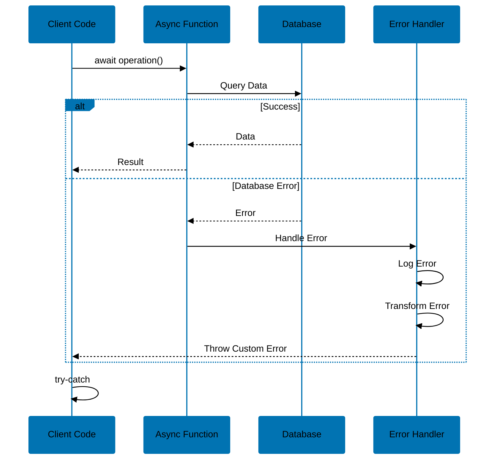

# TypeScript Error Handling

**Quick Reference**: [Overview](#overview) | [Result Pattern](#result-pattern) | [Either Pattern](#either-pattern) | [Custom Errors](#custom-error-hierarchies) | [Async Errors](#async-error-handling) | [Validation Errors](#validation-errors) | [Error Wrapping](#error-wrapping-and-context) | [Related Documentation](#related-documentation)

## Overview

Error handling is critical in financial systems where correctness and auditability are paramount. TypeScript provides multiple error handling patterns, from traditional exceptions to functional approaches like Result and Either types.

**Why Error Handling Matters**:

- **Financial accuracy**: Prevent silent failures in calculations
- **Auditability**: Comprehensive error logs for compliance
- **User experience**: Meaningful error messages
- **System resilience**: Graceful degradation
- **Type safety**: Compile-time error path checking

## Result Pattern

The Result pattern makes errors explicit in the type system.

### Error Propagation Through Layers



### Basic Result Type

```typescript
type Result<T, E = Error> = { readonly ok: true; readonly value: T } | { readonly ok: false; readonly error: E };

// Helper constructors
function ok<T>(value: T): Result<T, never> {
  return { ok: true, value };
}

function err<E>(error: E): Result<never, E> {
  return { ok: false, error };
}

// Zakat calculation with Result
function calculateZakat(wealth: number, nisab: number): Result<number, string> {
  if (wealth < 0) {
    return err("Wealth cannot be negative");
  }
  if (nisab < 0) {
    return err("Nisab cannot be negative");
  }
  if (wealth < nisab) {
    return ok(0);
  }
  return ok(wealth * 0.025);
}

// Usage
const result = calculateZakat(100000, 5000);
if (result.ok) {
  console.log("Zakat:", result.value);
} else {
  console.error("Error:", result.error);
}
```

### Result Type Pattern Flow



### Result Combinators

```typescript
// Map over successful result
function mapResult<T, U, E>(result: Result<T, E>, fn: (value: T) => U): Result<U, E> {
  if (result.ok) {
    return ok(fn(result.value));
  }
  return result;
}

// Chain results (flatMap)
function andThen<T, U, E>(result: Result<T, E>, fn: (value: T) => Result<U, E>): Result<U, E> {
  if (result.ok) {
    return fn(result.value);
  }
  return result;
}

// Map over error
function mapError<T, E, F>(result: Result<T, E>, fn: (error: E) => F): Result<T, F> {
  if (result.ok) {
    return result;
  }
  return err(fn(result.error));
}

// Financial example: Donation processing
function validateDonationAmount(amount: number): Result<number, string> {
  if (amount <= 0) {
    return err("Donation amount must be positive");
  }
  if (amount > 1000000) {
    return err("Donation amount exceeds maximum (1,000,000)");
  }
  return ok(amount);
}

function applyFee(amount: number): Result<number, string> {
  const fee = amount * 0.03;
  const netAmount = amount - fee;
  return ok(netAmount);
}

// Chain operations
function processDonation(amount: number): Result<number, string> {
  return andThen(validateDonationAmount(amount), applyFee);
}
```

## Either Pattern

Either is a more general Result type, often used in functional programming.

### Basic Either Type

```typescript
type Either<L, R> = { readonly _tag: "Left"; readonly left: L } | { readonly _tag: "Right"; readonly right: R };

function left<L>(value: L): Either<L, never> {
  return { _tag: "Left", left: value };
}

function right<R>(value: R): Either<never, R> {
  return { _tag: "Right", right: value };
}

// Type guards
function isLeft<L, R>(either: Either<L, R>): either is { _tag: "Left"; left: L } {
  return either._tag === "Left";
}

function isRight<L, R>(either: Either<L, R>): either is { _tag: "Right"; right: R } {
  return either._tag === "Right";
}

// Usage
function parseAmount(input: string): Either<string, number> {
  const parsed = parseFloat(input);
  if (isNaN(parsed)) {
    return left("Invalid number format");
  }
  return right(parsed);
}

const result = parseAmount("1000.50");
if (isRight(result)) {
  console.log("Amount:", result.right);
} else {
  console.error("Error:", result.left);
}
```

### Either Combinators

```typescript
function mapEither<L, R, S>(either: Either<L, R>, fn: (value: R) => S): Either<L, S> {
  if (isRight(either)) {
    return right(fn(either.right));
  }
  return either;
}

function chainEither<L, R, S>(either: Either<L, R>, fn: (value: R) => Either<L, S>): Either<L, S> {
  if (isRight(either)) {
    return fn(either.right);
  }
  return either;
}

function bimap<L, R, M, S>(either: Either<L, R>, leftFn: (left: L) => M, rightFn: (right: R) => S): Either<M, S> {
  if (isLeft(either)) {
    return left(leftFn(either.left));
  }
  return right(rightFn(either.right));
}
```

## Custom Error Hierarchies

Create domain-specific error classes for better error handling.

### Domain Error Classes

```typescript
// Base error
abstract class DomainError extends Error {
  constructor(
    message: string,
    public readonly code: string,
    public readonly timestamp: Date = new Date(),
  ) {
    super(message);
    this.name = this.constructor.name;
    Error.captureStackTrace(this, this.constructor);
  }
}

// Validation errors
class ValidationError extends DomainError {
  constructor(
    message: string,
    public readonly field?: string,
  ) {
    super(message, "VALIDATION_ERROR");
  }
}

class InvalidAmountError extends ValidationError {
  constructor(amount: number, reason: string) {
    super(`Invalid amount ${amount}: ${reason}`, "amount");
  }
}

class InvalidCurrencyError extends ValidationError {
  constructor(currency: string) {
    super(`Invalid currency: ${currency}`, "currency");
  }
}

// Business logic errors
class BusinessRuleError extends DomainError {
  constructor(message: string, code: string) {
    super(message, code);
  }
}

class InsufficientFundsError extends BusinessRuleError {
  constructor(
    public readonly available: number,
    public readonly required: number,
  ) {
    super(`Insufficient funds: available ${available}, required ${required}`, "INSUFFICIENT_FUNDS");
  }
}

class NisabNotMetError extends BusinessRuleError {
  constructor(
    public readonly wealth: number,
    public readonly nisab: number,
  ) {
    super(`Wealth ${wealth} below nisab threshold ${nisab}`, "NISAB_NOT_MET");
  }
}

// Infrastructure errors
class InfrastructureError extends DomainError {
  constructor(message: string, code: string) {
    super(message, code);
  }
}

class DatabaseError extends InfrastructureError {
  constructor(
    message: string,
    public readonly query?: string,
  ) {
    super(message, "DATABASE_ERROR");
  }
}

class NetworkError extends InfrastructureError {
  constructor(
    message: string,
    public readonly url?: string,
  ) {
    super(message, "NETWORK_ERROR");
  }
}
```

### Using Custom Errors

```typescript
class ZakatCalculator {
  calculate(wealth: number, nisab: number): number {
    if (wealth < 0) {
      throw new InvalidAmountError(wealth, "Wealth cannot be negative");
    }
    if (nisab < 0) {
      throw new InvalidAmountError(nisab, "Nisab cannot be negative");
    }
    if (wealth < nisab) {
      throw new NisabNotMetError(wealth, nisab);
    }
    return wealth * 0.025;
  }
}

// Error handling
try {
  const zakat = calculator.calculate(1000, 5000);
  console.log("Zakat:", zakat);
} catch (error) {
  if (error instanceof NisabNotMetError) {
    console.log("Nisab not met, no Zakat due");
  } else if (error instanceof InvalidAmountError) {
    console.error("Invalid input:", error.message);
  } else {
    console.error("Unexpected error:", error);
  }
}
```

## Async Error Handling

Handle errors in asynchronous operations safely.

### Try-Catch vs Result Pattern

```mermaid
%% Color Palette: Blue #0173B2, Orange #DE8F05, Teal #029E73, Purple #CC78BC, Brown #CA9161
sequenceDiagram
    participant C1 as Caller #40;Try-Catch#41;
    participant F1 as Function
    participant C2 as Caller #40;Result#41;
    participant F2 as Function

    Note over C1,F1: Try-Catch Pattern
    C1->>F1: call function#40;#41;
    activate F1
    alt Success
        F1-->>C1: return value
    else Failure
        F1--xC1: throw Error
        Note over C1: Must catch<br/>or app crashes
    end
    deactivate F1

    Note over C2,F2: Result Pattern
    C2->>F2: call function#40;#41;
    activate F2
    alt Success
        F2-->>C2: ok: true, value: T
    else Failure
        F2-->>C2: ok: false, error: E
    end
    deactivate F2
    Note over C2: Compiler forces<br/>error check

    classDef blue fill:#0173B2,stroke:#000000,color:#FFFFFF,stroke-width:2px
    classDef orange fill:#DE8F05,stroke:#000000,color:#FFFFFF,stroke-width:2px
    classDef teal fill:#029E73,stroke:#000000,color:#FFFFFF,stroke-width:2px
    classDef purple fill:#CC78BC,stroke:#000000,color:#FFFFFF,stroke-width:2px
```

### Try-Catch with Async/Await

```typescript
async function processDonation(donationId: string): Promise<void> {
  try {
    const donation = await fetchDonation(donationId);
    const validated = await validateDonation(donation);
    const processed = await saveDonation(validated);
    await sendReceipt(processed);
    console.log("Donation processed successfully");
  } catch (error) {
    if (error instanceof ValidationError) {
      console.error("Validation failed:", error.message);
    } else if (error instanceof DatabaseError) {
      console.error("Database error:", error.message);
    } else if (error instanceof NetworkError) {
      console.error("Network error:", error.message);
    } else {
      console.error("Unexpected error:", error);
    }
    // Rethrow or handle accordingly
    throw error;
  }
}
```

### Async Result Pattern

```typescript
async function validateDonationAsync(donation: Donation): Promise<Result<Donation, ValidationError>> {
  try {
    // Validation logic
    if (donation.amount <= 0) {
      return err(new InvalidAmountError(donation.amount, "Amount must be positive"));
    }
    return ok(donation);
  } catch (error) {
    return err(new ValidationError("Validation failed"));
  }
}

async function processDonationSafe(donationId: string): Promise<Result<void, DomainError>> {
  try {
    const donation = await fetchDonation(donationId);
    const validationResult = await validateDonationAsync(donation);

    if (!validationResult.ok) {
      return validationResult;
    }

    await saveDonation(validationResult.value);
    return ok(undefined);
  } catch (error) {
    if (error instanceof DomainError) {
      return err(error);
    }
    return err(new InfrastructureError("Unexpected error", "UNKNOWN"));
  }
}
```

### Promise.allSettled for Parallel Operations

```typescript
async function processMultipleDonations(donationIds: string[]): Promise<void> {
  const results = await Promise.allSettled(donationIds.map((id) => processDonation(id)));

  const succeeded = results.filter((r) => r.status === "fulfilled").length;
  const failed = results.filter((r) => r.status === "rejected");

  console.log(`Processed: ${succeeded}/${donationIds.length}`);

  if (failed.length > 0) {
    console.error("Failed donations:");
    failed.forEach((result, index) => {
      if (result.status === "rejected") {
        console.error(`  ${donationIds[index]}: ${result.reason}`);
      }
    });
  }
}
```

## Validation Errors

Collect and report multiple validation errors.

### Validation Result

```typescript
interface ValidationResult<T> {
  readonly valid: boolean;
  readonly value?: T;
  readonly errors: ValidationError[];
}

function success<T>(value: T): ValidationResult<T> {
  return { valid: true, value, errors: [] };
}

function failure<T>(errors: ValidationError[]): ValidationResult<T> {
  return { valid: false, errors };
}

// Validate donation input
interface DonationInput {
  donorId: string;
  amount: number;
  currency: string;
  category: string;
}

function validateDonationInput(input: DonationInput): ValidationResult<DonationInput> {
  const errors: ValidationError[] = [];

  if (!input.donorId || input.donorId.trim() === "") {
    errors.push(new ValidationError("Donor ID is required", "donorId"));
  }

  if (input.amount <= 0) {
    errors.push(new InvalidAmountError(input.amount, "Amount must be positive"));
  }

  if (input.currency.length !== 3) {
    errors.push(new InvalidCurrencyError(input.currency));
  }

  if (!["zakat", "sadaqah", "waqf"].includes(input.category)) {
    errors.push(new ValidationError("Invalid category", "category"));
  }

  if (errors.length > 0) {
    return failure(errors);
  }

  return success(input);
}

// Usage
const result = validateDonationInput({
  donorId: "",
  amount: -100,
  currency: "US",
  category: "invalid",
});

if (result.valid) {
  console.log("Valid donation:", result.value);
} else {
  console.error("Validation errors:");
  result.errors.forEach((error) => {
    console.error(`  ${error.field}: ${error.message}`);
  });
}
```

## Error Wrapping and Context

Add context to errors as they propagate up the call stack.

### Error Wrapping

```typescript
class WrappedError extends DomainError {
  constructor(
    message: string,
    code: string,
    public readonly cause: Error,
  ) {
    super(message, code);
  }
}

function wrapError(error: unknown, context: string): DomainError {
  if (error instanceof DomainError) {
    return error;
  }
  if (error instanceof Error) {
    return new WrappedError(`${context}: ${error.message}`, "WRAPPED_ERROR", error);
  }
  return new DomainError(`${context}: Unknown error`, "UNKNOWN_ERROR");
}

// Usage
async function processDonationWithContext(donationId: string): Promise<void> {
  try {
    const donation = await fetchDonation(donationId);
    // Process donation
  } catch (error) {
    throw wrapError(error, `Failed to process donation ${donationId}`);
  }
}
```

### Error Context Propagation

```typescript
interface ErrorContext {
  readonly operation: string;
  readonly timestamp: Date;
  readonly metadata: Record<string, unknown>;
}

class ContextualError extends DomainError {
  constructor(
    message: string,
    code: string,
    public readonly context: ErrorContext,
  ) {
    super(message, code);
  }
}

function createContext(operation: string, metadata: Record<string, unknown> = {}): ErrorContext {
  return {
    operation,
    timestamp: new Date(),
    metadata,
  };
}

async function calculateZakatWithContext(wealth: number, nisab: number): Promise<number> {
  const context = createContext("calculateZakat", { wealth, nisab });

  try {
    if (wealth < 0) {
      throw new ContextualError("Wealth cannot be negative", "INVALID_WEALTH", context);
    }
    if (nisab < 0) {
      throw new ContextualError("Nisab cannot be negative", "INVALID_NISAB", context);
    }
    if (wealth < nisab) {
      throw new ContextualError("Wealth below nisab threshold", "NISAB_NOT_MET", context);
    }
    return wealth * 0.025;
  } catch (error) {
    if (error instanceof ContextualError) {
      throw error;
    }
    throw new ContextualError("Unexpected error in Zakat calculation", "CALCULATION_ERROR", context);
  }
}
```

## Related Documentation

### TypeScript Core

- **[TypeScript Best Practices](best-practices.md)** - Coding standards
- **[TypeScript Type Safety](type-safety.md)** - Type system features
- **[TypeScript Functional Programming](functional-programming.md)** - FP patterns
- **[TypeScript Anti-Patterns](anti-patterns.md)** - Mistakes to avoid

### Development Practices

- **[Explicit Over Implicit](../../../../../governance/principles/software-engineering/explicit-over-implicit.md)** - Clear error handling

---

**TypeScript Version**: 5.0+ (baseline), 5.4+ (milestone), 5.6+ (stable), 5.9.3+ (latest stable)
**Maintainers**: OSE Documentation Team

## Error Handling Patterns

```mermaid
%%{init: {'theme':'base', 'themeVariables': { 'primaryColor':'#0173B2','primaryTextColor':'#fff','primaryBorderColor':'#0173B2','lineColor':'#DE8F05','secondaryColor':'#029E73','tertiaryColor':'#CC78BC','fontSize':'16px'}}}%%
flowchart LR
    A[Error Handling] --> B[Try-Catch<br/>Exceptions]
    A --> C[Result Type<br/>Success/Failure]
    A --> D[Error Union<br/>Type | Error]
    A --> E[Promise Rejection<br/>Async Errors]

    B --> B1[Synchronous<br/>Immediate Catch]
    B --> B2[Custom Errors<br/>Error Classes]

    C --> C1[Ok Err<br/>Rust-like]
    C --> C2[Type Safety<br/>Explicit Handling]

    D --> D1[Discriminated Union<br/>Tagged Types]
    D --> D2[Exhaustive Check<br/>Never Type]

    E --> E1[try-catch async<br/>await Pattern]
    E --> E2[.catch Handler<br/>Promise Chain]

    B2 --> F[ZakatError<br/>Custom Class]
    C1 --> G[Result<Amount><br/>Type-Safe]

    style A fill:#0173B2,color:#fff
    style B fill:#DE8F05,color:#fff
    style C fill:#029E73,color:#fff
    style D fill:#CC78BC,color:#fff
    style E fill:#0173B2,color:#fff
    style F fill:#DE8F05,color:#fff
    style G fill:#029E73,color:#fff
```

## Async Error Flow


