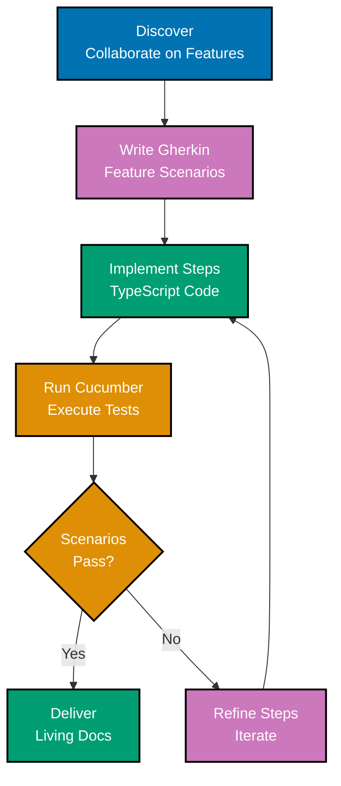
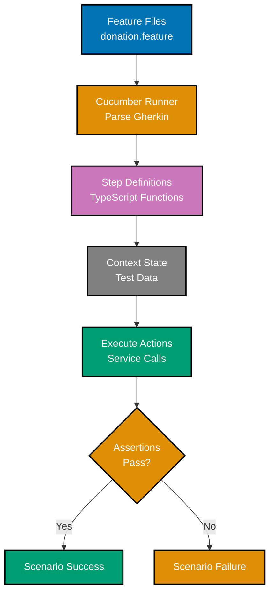
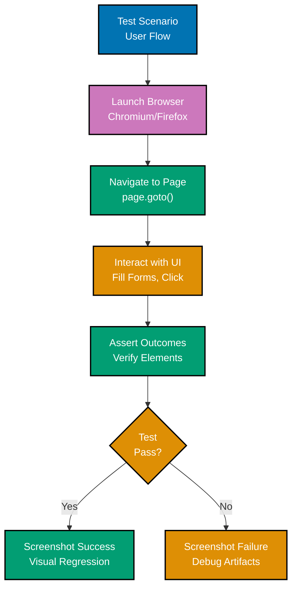
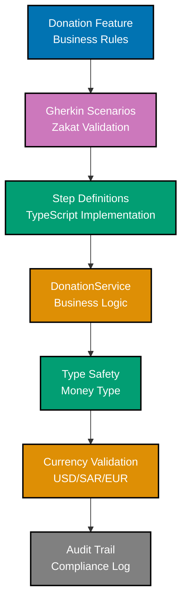

# TypeScript Behaviour-Driven Development

**Quick Reference**: [Overview](#overview) | [Gherkin](#gherkin-syntax) | [Cucumber](#cucumber-with-typescript) | [Playwright](#playwright-e2e-testing) | [Component Testing](#component-testing) | [Visual Regression](#visual-regression-testing) | [Related Documentation](#related-documentation)

## Overview

Behaviour-Driven Development (BDD) uses natural language to describe system behavior. Gherkin syntax allows stakeholders to understand and validate requirements.

### BDD Principles

- **Shared Understanding**: Business, QA, Dev collaborate
- **Living Documentation**: Tests document system behavior
- **Executable Specifications**: Gherkin scenarios are automated
- **Outside-In**: Start from user perspective

### BDD Workflow



### Cucumber Execution



### Playwright E2E Flow



### Financial BDD Testing



## Gherkin Syntax

### Basic Structure

```gherkin
Feature: Donation Processing
  As a donor
  I want to make donations
  So that I can contribute to charitable causes

  Background:
    Given the donation platform is running
    And the donor "Ahmad Ibrahim" is registered

  Scenario: Successful Zakat donation
    Given the donor has wealth of 100000 USD
    And the nisab threshold is 3000 USD
    When the donor submits a Zakat donation of 2500 USD
    Then the donation should be created successfully
    And the donation status should be "pending"
    And a confirmation email should be sent

  Scenario: Donation below minimum amount
    Given the minimum donation amount is 10 USD
    When the donor submits a donation of 5 USD
    Then the donation should be rejected
    And the error message should contain "below minimum"

  Scenario Outline: Multi-currency donations
    Given the exchange rate for <currency> is <rate> USD
    When the donor submits a donation of <amount> <currency>
    Then the equivalent USD amount should be <usd_amount>

    Examples:
      | currency | rate | amount | usd_amount |
      | EUR      | 1.10 | 1000   | 1100       |
      | SAR      | 0.27 | 1000   | 270        |
      | GBP      | 1.27 | 1000   | 1270       |
```

## Cucumber with TypeScript

### Setup

```typescript
// cucumber.js
module.exports = {
  default: {
    require: ["features/step-definitions/**/*.ts"],
    requireModule: ["ts-node/register"],
    format: ["progress", "html:reports/cucumber-report.html"],
    publishQuiet: true,
  },
};
```

### Step Definitions

```typescript
// features/step-definitions/donation.steps.ts
import { Given, When, Then } from "@cucumber/cucumber";
import { expect } from "@playwright/test";
import { DonationService } from "../../src/donation-service";

let donationService: DonationService;
let lastDonation: any;
let lastError: Error | null = null;

Given("the donation platform is running", () => {
  donationService = new DonationService();
});

Given("the donor {string} is registered", async (name: string) => {
  await donationService.registerDonor({
    name,
    email: `${name.toLowerCase().replace(" ", ".")}@example.com`,
  });
});

Given("the donor has wealth of {int} {word}", (amount: number, currency: string) => {
  // Set up test context
});

Given("the nisab threshold is {int} {word}", (amount: number, currency: string) => {
  // Configure nisab threshold
});

When("the donor submits a Zakat donation of {int} {word}", async (amount: number, currency: string) => {
  try {
    lastDonation = await donationService.create({
      donorId: "DNR-1234567890",
      amount,
      currency,
      category: "zakat",
    });
    lastError = null;
  } catch (error) {
    lastError = error as Error;
  }
});

Then("the donation should be created successfully", () => {
  expect(lastDonation).toBeDefined();
  expect(lastError).toBeNull();
});

Then("the donation status should be {string}", (status: string) => {
  expect(lastDonation.status).toBe(status);
});

Then("a confirmation email should be sent", () => {
  // Verify email was sent (mock check)
});
```

## Playwright E2E Testing

### Setup

```typescript
// playwright.config.ts
import { defineConfig, devices } from "@playwright/test";

export default defineConfig({
  testDir: "./e2e",
  fullyParallel: true,
  forbidOnly: !!process.env.CI,
  retries: process.env.CI ? 2 : 0,
  workers: process.env.CI ? 1 : undefined,
  reporter: "html",
  use: {
    baseURL: "http://localhost:3000",
    trace: "on-first-retry",
  },
  projects: [
    {
      name: "chromium",
      use: { ...devices["Desktop Chrome"] },
    },
    {
      name: "firefox",
      use: { ...devices["Desktop Firefox"] },
    },
    {
      name: "webkit",
      use: { ...devices["Desktop Safari"] },
    },
  ],
});
```

### E2E Test Example

```typescript
// e2e/donation-flow.spec.ts
import { test, expect } from "@playwright/test";

test.describe("Donation Flow", () => {
  test.beforeEach(async ({ page }) => {
    await page.goto("/");
  });

  test("complete donation flow", async ({ page }) => {
    // Navigate to donation page
    await page.click('a[href="/donate"]');
    await expect(page).toHaveURL("/donate");

    // Fill donation form
    await page.fill('input[name="amount"]', "1000");
    await page.selectOption('select[name="currency"]', "USD");
    await page.selectOption('select[name="category"]', "zakat");
    await page.fill('textarea[name="message"]', "Monthly Zakat payment");

    // Submit form
    await page.click('button[type="submit"]');

    // Verify success
    await expect(page.locator(".success-message")).toBeVisible();
    await expect(page.locator(".donation-id")).toContainText("DON-");

    // Verify confirmation email message
    await expect(page.locator(".email-sent")).toBeVisible();
  });

  test("validates minimum amount", async ({ page }) => {
    await page.goto("/donate");

    await page.fill('input[name="amount"]', "5");
    await page.selectOption('select[name="currency"]', "USD");
    await page.click('button[type="submit"]');

    await expect(page.locator(".error-message")).toContainText("Minimum donation is 10 USD");
  });

  test("handles API errors gracefully", async ({ page }) => {
    // Mock API failure
    await page.route("/api/donations", (route) =>
      route.fulfill({
        status: 500,
        body: JSON.stringify({ error: "Server error" }),
      }),
    );

    await page.goto("/donate");
    await page.fill('input[name="amount"]', "1000");
    await page.click('button[type="submit"]');

    await expect(page.locator(".error-message")).toContainText("Unable to process donation");
  });
});
```

## Component Testing

### React Component Testing

```typescript
// components/DonationForm.test.tsx
import { test, expect } from "@playwright/experimental-ct-react";
import DonationForm from "./DonationForm";

test("renders donation form", async ({ mount }) => {
  const component = await mount(<DonationForm />);

  await expect(component.locator('input[name="amount"]')).toBeVisible();
  await expect(component.locator('select[name="currency"]')).toBeVisible();
  await expect(component.locator('button[type="submit"]')).toBeVisible();
});

test("validates amount input", async ({ mount }) => {
  const component = await mount(<DonationForm />);

  await component.locator('input[name="amount"]').fill("-100");
  await component.locator('button[type="submit"]').click();

  await expect(component.locator(".error")).toContainText(
    "Amount must be positive"
  );
});

test("calls onSubmit with valid data", async ({ mount }) => {
  const onSubmit = jest.fn();
  const component = await mount(<DonationForm onSubmit={onSubmit} />);

  await component.locator('input[name="amount"]').fill("1000");
  await component.locator('select[name="currency"]').selectOption("USD");
  await component.locator('button[type="submit"]').click();

  expect(onSubmit).toHaveBeenCalledWith({
    amount: 1000,
    currency: "USD",
  });
});
```

## Visual Regression Testing

### Playwright Visual Comparisons

```typescript
// e2e/visual-regression.spec.ts
import { test, expect } from "@playwright/test";

test("donation form visual regression", async ({ page }) => {
  await page.goto("/donate");

  // Take screenshot
  await expect(page).toHaveScreenshot("donation-form.png");
});

test("donation confirmation visual", async ({ page }) => {
  await page.goto("/donate");

  // Fill and submit form
  await page.fill('input[name="amount"]', "1000");
  await page.click('button[type="submit"]');

  // Wait for success message
  await page.waitForSelector(".success-message");

  // Visual comparison
  await expect(page).toHaveScreenshot("donation-confirmation.png");
});

test("donation form on mobile", async ({ page }) => {
  await page.setViewportSize({ width: 375, height: 667 });
  await page.goto("/donate");

  await expect(page).toHaveScreenshot("donation-form-mobile.png");
});
```

## BDD Checklist

### Feature File Quality

- [ ] Scenarios written in plain language (non-technical stakeholders can read)
- [ ] Given-When-Then structure followed consistently
- [ ] Scenarios focus on behavior, not implementation details
- [ ] Scenario Outlines with Examples used for multiple inputs
- [ ] Background section for common setup steps

### Scenario Structure

- [ ] Given: Context/preconditions clear and complete
- [ ] When: Single action described (not multiple actions)
- [ ] Then: Expected outcome specified clearly
- [ ] And: Used appropriately for additional steps
- [ ] Scenario names describe business value (not UI details)

### Step Definitions

- [ ] Step definitions are reusable across scenarios
- [ ] No business logic in steps (delegate to service/domain layer)
- [ ] Steps follow TypeScript idioms (async/await, type safety)
- [ ] Error messages are descriptive and helpful
- [ ] Context variables typed correctly

### Collaboration

- [ ] Scenarios reviewed by business stakeholders
- [ ] Ubiquitous language used consistently (domain terminology)
- [ ] Scenarios executable and automated (Cucumber/Playwright)
- [ ] Living documentation kept up to date
- [ ] Three Amigos conversation: BA, Dev, Tester

### Cucumber/Playwright Best Practices

- [ ] Feature files organized by domain (features/donations/, features/campaigns/)
- [ ] Step definitions modular and maintainable (features/step-definitions/)
- [ ] Tags used for organizing scenarios (@smoke, @critical, @e2e)
- [ ] Background steps minimized (only truly shared setup)
- [ ] Page Object Model used for E2E tests (Playwright)

### Financial Domain BDD

- [ ] Shariah compliance scenarios included (halal/haram validation)
- [ ] Zakat calculation scenarios with examples (nisab, rates, exemptions)
- [ ] Murabaha contract scenarios with Given-When-Then (profit validation)
- [ ] Audit trail scenarios verified (who, what, when)
- [ ] Currency scenarios tested (USD, SAR, EUR conversions with Money type)

## Related Documentation

- **[TypeScript TDD](ex-soen-prla-ty__test-driven-development.md)** - TDD patterns
- **[TypeScript Best Practices](ex-soen-prla-ty__best-practices.md)** - Coding standards

---

**Last Updated**: 2025-01-23
**TypeScript Version**: 5.0+ (baseline), 5.4+ (milestone), 5.6+ (stable), 5.9.3+ (latest stable)
**Testing Frameworks**: Cucumber 10.x, Playwright 1.57.0
**Maintainers**: OSE Documentation Team
