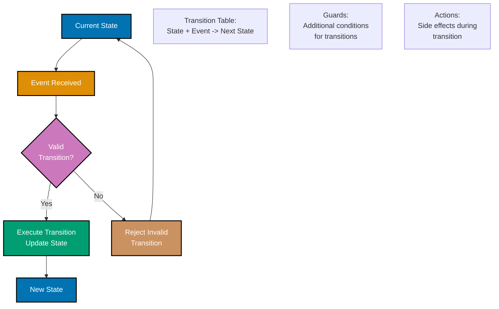
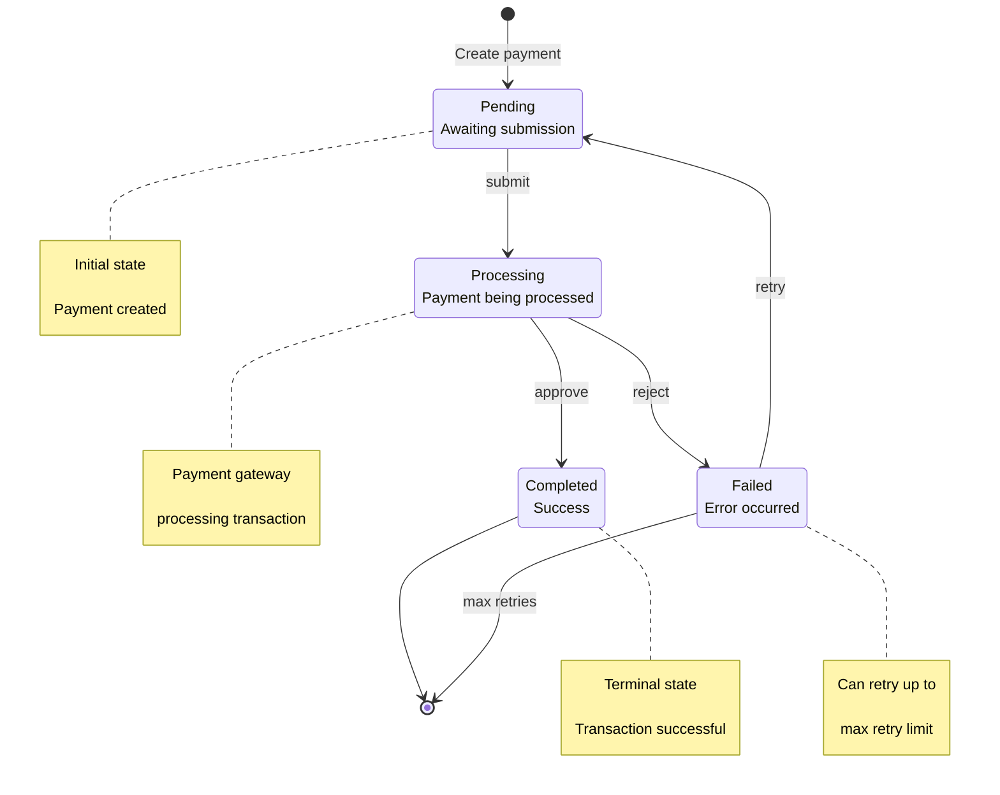
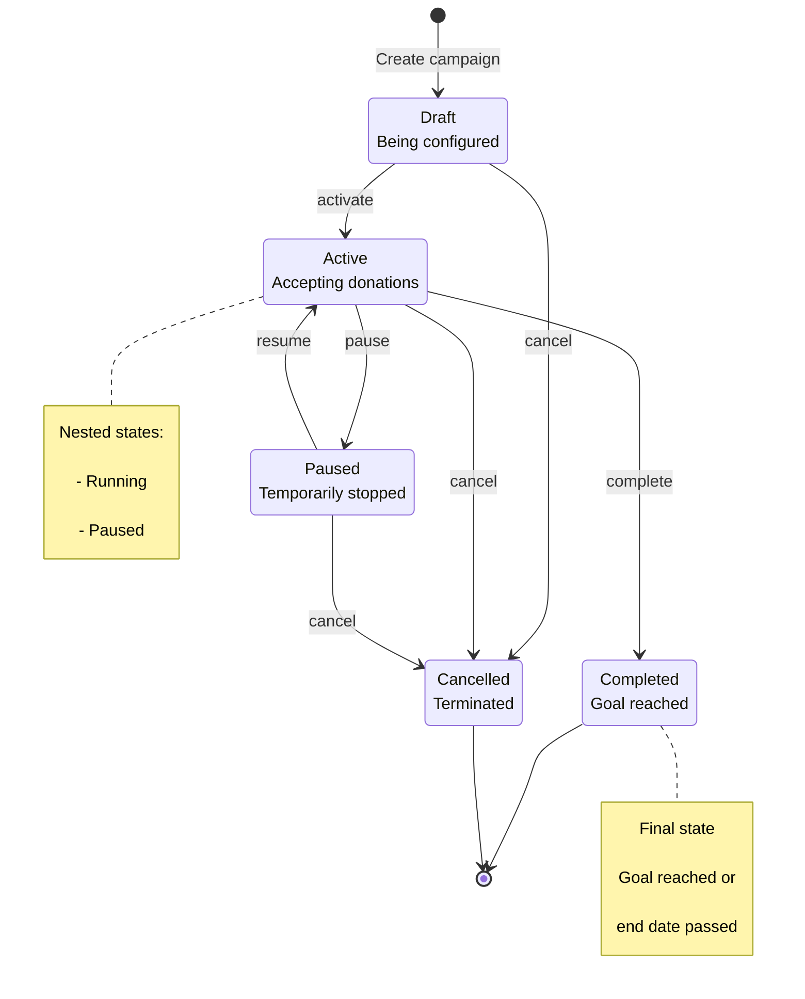
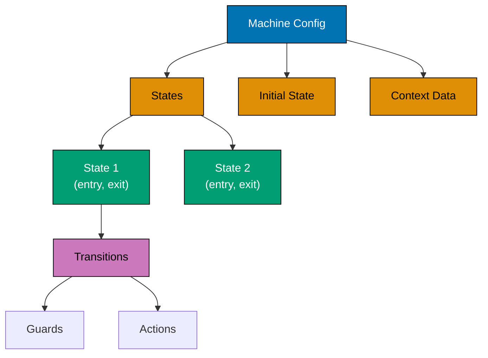
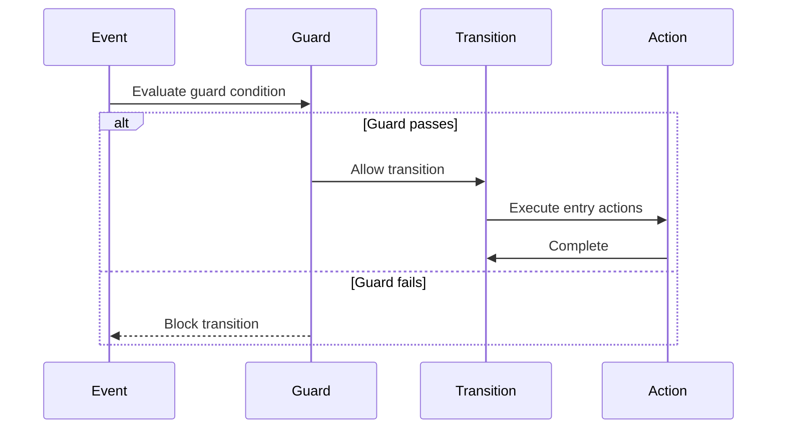
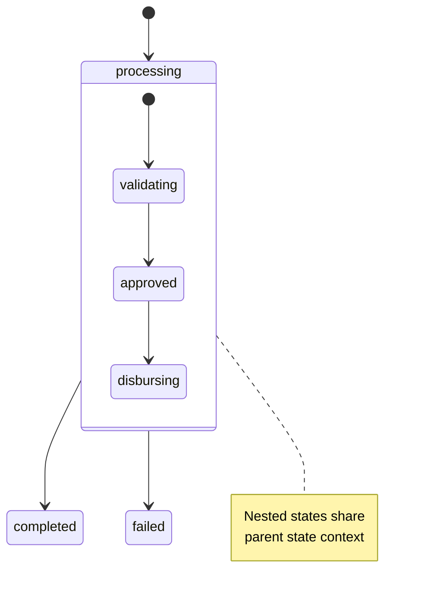
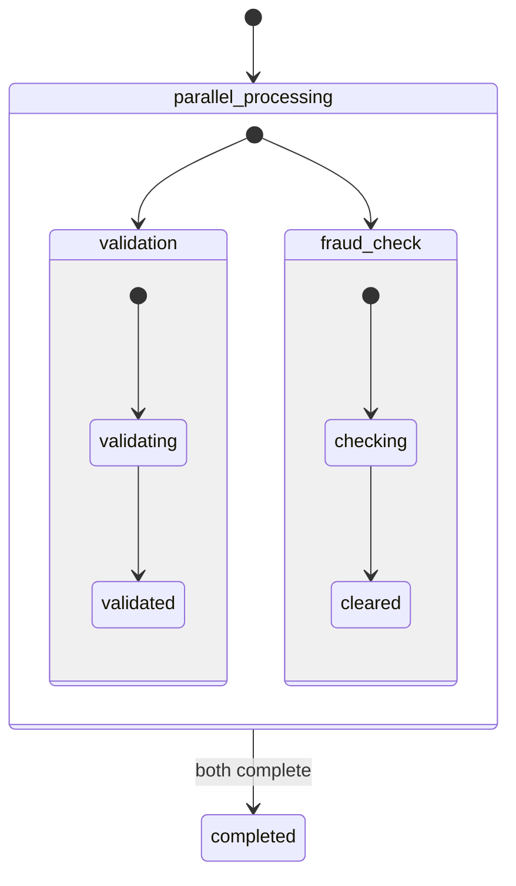
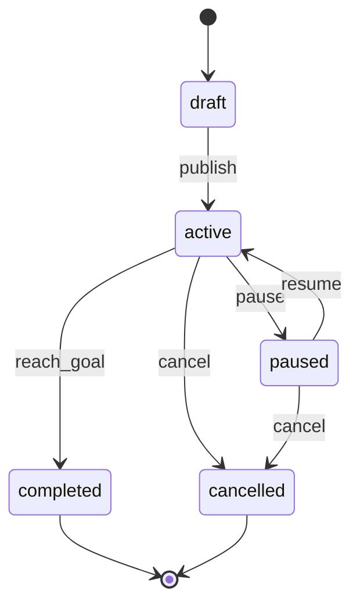

# TypeScript Finite State Machines

**Quick Reference**: [Overview](#overview) | [Basic Implementation](#basic-fsm-implementation) | [Type-Safe FSM](#type-safe-state-machine) | [XState](#xstate-library) | [Payment Flow](#complete-example-payment-flow) | [Related Documentation](#related-documentation)

## Overview

Finite State Machines (FSMs) model systems with distinct states and transitions. They're ideal for donation workflows, payment processing, and campaign lifecycles in financial applications.

### FSM Principles

- **Finite States**: Limited, well-defined set of states
- **Transitions**: Explicit state changes via events
- **Deterministic**: Same input always produces same output
- **Single State**: System is in exactly one state at a time

### State Transition Rules



## Basic FSM Implementation

### Payment State Machine Visualization



### Simple State Machine

```typescript
type DonationState = "pending" | "processing" | "completed" | "failed";
type DonationEvent = "submit" | "approve" | "reject" | "retry";

interface DonationContext {
  donationId: string;
  amount: number;
  retryCount: number;
}

class DonationStateMachine {
  private state: DonationState = "pending";
  private context: DonationContext;

  constructor(context: DonationContext) {
    this.context = context;
  }

  transition(event: DonationEvent): void {
    const nextState = this.getNextState(this.state, event);
    if (nextState) {
      console.log(`${this.state} -> ${nextState} (${event})`);
      this.state = nextState;
    } else {
      console.log(`Invalid transition: ${event} in ${this.state}`);
    }
  }

  private getNextState(currentState: DonationState, event: DonationEvent): DonationState | null {
    const transitions: Record<DonationState, Partial<Record<DonationEvent, DonationState>>> = {
      pending: {
        submit: "processing",
      },
      processing: {
        approve: "completed",
        reject: "failed",
      },
      completed: {},
      failed: {
        retry: "pending",
      },
    };

    return transitions[currentState][event] || null;
  }

  getState(): DonationState {
    return this.state;
  }
}

// Usage
const fsm = new DonationStateMachine({
  donationId: "DON-123",
  amount: 1000,
  retryCount: 0,
});

fsm.transition("submit"); // pending -> processing
fsm.transition("approve"); // processing -> completed
```

## Type-Safe State Machine

### Discriminated Union Pattern

```typescript
type PendingState = {
  status: "pending";
  submittedAt: Date;
};

type ProcessingState = {
  status: "processing";
  processedBy: string;
  startedAt: Date;
};

type CompletedState = {
  status: "completed";
  completedAt: Date;
  transactionId: string;
};

type FailedState = {
  status: "failed";
  failedAt: Date;
  error: string;
  retryCount: number;
};

type DonationState = PendingState | ProcessingState | CompletedState | FailedState;

// Type-safe state checks
function isDonationCompleted(state: DonationState): state is CompletedState {
  return state.status === "completed";
}

// Exhaustive pattern matching
function processDonation(state: DonationState): string {
  switch (state.status) {
    case "pending":
      return `Submitted at ${state.submittedAt.toISOString()}`;
    case "processing":
      return `Processing by ${state.processedBy}`;
    case "completed":
      return `Completed: ${state.transactionId}`;
    case "failed":
      return `Failed: ${state.error}`;
    default:
      // TypeScript ensures exhaustiveness
      const _exhaustive: never = state;
      return _exhaustive;
  }
}
```

### Donation Campaign State Machine



### Builder Pattern FSM

```typescript
class StateMachine<S extends string, E extends string> {
  private states = new Map<S, Map<E, S>>();
  private currentState: S;

  constructor(initialState: S) {
    this.currentState = initialState;
  }

  addTransition(from: S, event: E, to: S): this {
    if (!this.states.has(from)) {
      this.states.set(from, new Map());
    }
    this.states.get(from)!.set(event, to);
    return this;
  }

  transition(event: E): boolean {
    const transitions = this.states.get(this.currentState);
    if (!transitions) return false;

    const nextState = transitions.get(event);
    if (!nextState) return false;

    this.currentState = nextState;
    return true;
  }

  getState(): S {
    return this.currentState;
  }
}

// Usage
type CampaignState = "draft" | "active" | "paused" | "completed" | "cancelled";
type CampaignEvent = "activate" | "pause" | "resume" | "complete" | "cancel";

const campaign = new StateMachine<CampaignState, CampaignEvent>("draft");

campaign
  .addTransition("draft", "activate", "active")
  .addTransition("active", "pause", "paused")
  .addTransition("paused", "resume", "active")
  .addTransition("active", "complete", "completed")
  .addTransition("draft", "cancel", "cancelled")
  .addTransition("active", "cancel", "cancelled")
  .addTransition("paused", "cancel", "cancelled");

campaign.transition("activate"); // draft -> active
campaign.transition("pause"); // active -> paused
```

## XState Library

### XState Machine Configuration



### Basic XState Machine

```typescript
import { createMachine, interpret } from "xstate";

const donationMachine = createMachine({
  id: "donation",
  initial: "pending",
  context: {
    donationId: "",
    amount: 0,
    retryCount: 0,
  },
  states: {
    pending: {
      on: {
        SUBMIT: "processing",
      },
    },
    processing: {
      on: {
        APPROVE: "completed",
        REJECT: "failed",
      },
    },
    completed: {
      type: "final",
    },
    failed: {
      on: {
        RETRY: {
          target: "pending",
          actions: "incrementRetryCount",
        },
      },
    },
  },
});

// Create service
const service = interpret(donationMachine)
  .onTransition((state) => {
    console.log(`State: ${state.value}`);
  })
  .start();

// Send events
service.send({ type: "SUBMIT" });
service.send({ type: "APPROVE" });
```

### Guard and Action Execution Flow



### XState with Guards and Actions

```typescript
import { createMachine, assign } from "xstate";

interface DonationContext {
  donationId: string;
  amount: number;
  retryCount: number;
  maxRetries: number;
}

type DonationEvent =
  | { type: "SUBMIT"; donationId: string; amount: number }
  | { type: "APPROVE"; transactionId: string }
  | { type: "REJECT"; error: string }
  | { type: "RETRY" };

const donationMachine = createMachine<DonationContext, DonationEvent>({
  id: "donation",
  initial: "pending",
  context: {
    donationId: "",
    amount: 0,
    retryCount: 0,
    maxRetries: 3,
  },
  states: {
    pending: {
      on: {
        SUBMIT: {
          target: "processing",
          actions: assign({
            donationId: (_, event) => event.donationId,
            amount: (_, event) => event.amount,
          }),
        },
      },
    },
    processing: {
      on: {
        APPROVE: "completed",
        REJECT: {
          target: "failed",
          actions: assign({
            retryCount: (context) => context.retryCount + 1,
          }),
        },
      },
    },
    completed: {
      type: "final",
    },
    failed: {
      on: {
        RETRY: [
          {
            target: "pending",
            cond: (context) => context.retryCount < context.maxRetries,
          },
          {
            target: "permanentlyFailed",
          },
        ],
      },
    },
    permanentlyFailed: {
      type: "final",
    },
  },
});
```

### Nested State Hierarchy



### Nested States

```typescript
const campaignMachine = createMachine({
  id: "campaign",
  initial: "draft",
  states: {
    draft: {
      on: {
        ACTIVATE: "active",
      },
    },
    active: {
      initial: "running",
      states: {
        running: {
          on: {
            PAUSE: "paused",
          },
        },
        paused: {
          on: {
            RESUME: "running",
          },
        },
      },
      on: {
        COMPLETE: "completed",
        CANCEL: "cancelled",
      },
    },
    completed: {
      type: "final",
    },
    cancelled: {
      type: "final",
    },
  },
});
```

### Parallel State Regions



### Parallel States

```typescript
const donationProcessMachine = createMachine({
  id: "donationProcess",
  type: "parallel",
  states: {
    payment: {
      initial: "idle",
      states: {
        idle: {
          on: { PROCESS_PAYMENT: "processing" },
        },
        processing: {
          on: {
            PAYMENT_SUCCESS: "success",
            PAYMENT_FAILED: "failed",
          },
        },
        success: { type: "final" },
        failed: { type: "final" },
      },
    },
    notification: {
      initial: "idle",
      states: {
        idle: {
          on: { SEND_EMAIL: "sending" },
        },
        sending: {
          on: {
            EMAIL_SENT: "sent",
            EMAIL_FAILED: "failed",
          },
        },
        sent: { type: "final" },
        failed: { type: "final" },
      },
    },
  },
});
```

## Complete Example: Payment Flow

### Payment State Machine

```typescript
type PaymentStatus = "initiated" | "processing" | "verifying" | "completed" | "failed" | "refunded";

type PaymentEvent =
  | { type: "PROCESS" }
  | { type: "VERIFY" }
  | { type: "COMPLETE" }
  | { type: "FAIL"; reason: string }
  | { type: "REFUND" };

interface PaymentContext {
  paymentId: string;
  amount: number;
  currency: string;
  donorId: string;
  transactionId?: string;
  failureReason?: string;
}

class PaymentFSM {
  private state: PaymentStatus = "initiated";
  private context: PaymentContext;
  private listeners: Array<(state: PaymentStatus) => void> = [];

  constructor(context: PaymentContext) {
    this.context = context;
  }

  on(listener: (state: PaymentStatus) => void): void {
    this.listeners.push(listener);
  }

  private notify(): void {
    this.listeners.forEach((listener) => listener(this.state));
  }

  transition(event: PaymentEvent): void {
    const prevState = this.state;

    switch (this.state) {
      case "initiated":
        if (event.type === "PROCESS") {
          this.state = "processing";
          this.processPayment();
        }
        break;

      case "processing":
        if (event.type === "VERIFY") {
          this.state = "verifying";
          this.verifyPayment();
        } else if (event.type === "FAIL") {
          this.state = "failed";
          this.context.failureReason = event.reason;
        }
        break;

      case "verifying":
        if (event.type === "COMPLETE") {
          this.state = "completed";
        } else if (event.type === "FAIL") {
          this.state = "failed";
          this.context.failureReason = event.reason;
        }
        break;

      case "completed":
        if (event.type === "REFUND") {
          this.state = "refunded";
          this.processRefund();
        }
        break;

      case "failed":
        // Terminal state
        break;

      case "refunded":
        // Terminal state
        break;
    }

    if (prevState !== this.state) {
      console.log(`Payment ${this.context.paymentId}: ${prevState} -> ${this.state}`);
      this.notify();
    }
  }

  private async processPayment(): Promise<void> {
    // Simulate payment processing
    setTimeout(() => {
      this.transition({ type: "VERIFY" });
    }, 1000);
  }

  private async verifyPayment(): Promise<void> {
    // Simulate verification
    setTimeout(() => {
      const success = Math.random() > 0.1;
      if (success) {
        this.context.transactionId = `TXN-${Date.now()}`;
        this.transition({ type: "COMPLETE" });
      } else {
        this.transition({ type: "FAIL", reason: "Verification failed" });
      }
    }, 1000);
  }

  private async processRefund(): Promise<void> {
    // Process refund
    console.log(`Refunding payment ${this.context.paymentId}`);
  }

  getState(): PaymentStatus {
    return this.state;
  }

  getContext(): PaymentContext {
    return { ...this.context };
  }
}

// Usage
const payment = new PaymentFSM({
  paymentId: "PAY-123",
  amount: 1000,
  currency: "USD",
  donorId: "DNR-456",
});

payment.on((state) => {
  console.log(`Payment state changed to: ${state}`);
});

payment.transition({ type: "PROCESS" });
// Automatically transitions through processing -> verifying -> completed

// Later...
payment.transition({ type: "REFUND" });
```

### Campaign State Transitions



### Campaign Lifecycle FSM

```typescript
type CampaignStatus = "draft" | "scheduled" | "active" | "paused" | "completed" | "cancelled";

interface CampaignContext {
  campaignId: string;
  goal: number;
  raised: number;
  startDate: Date;
  endDate: Date;
}

const campaignFSM = createMachine<CampaignContext>({
  id: "campaign",
  initial: "draft",
  context: {
    campaignId: "",
    goal: 0,
    raised: 0,
    startDate: new Date(),
    endDate: new Date(),
  },
  states: {
    draft: {
      on: {
        SCHEDULE: {
          target: "scheduled",
          cond: (context) => context.startDate > new Date(),
        },
        ACTIVATE: {
          target: "active",
          cond: (context) => context.startDate <= new Date(),
        },
      },
    },
    scheduled: {
      on: {
        ACTIVATE: "active",
        CANCEL: "cancelled",
      },
    },
    active: {
      on: {
        PAUSE: "paused",
        COMPLETE: {
          target: "completed",
          cond: (context) => context.raised >= context.goal || context.endDate <= new Date(),
        },
        CANCEL: "cancelled",
      },
    },
    paused: {
      on: {
        RESUME: "active",
        CANCEL: "cancelled",
      },
    },
    completed: {
      type: "final",
    },
    cancelled: {
      type: "final",
    },
  },
});
```

## Related Documentation

- **[TypeScript Best Practices](ex-soen-prla-ty__best-practices.md)** - Coding standards
- **[TypeScript Type Safety](ex-soen-prla-ty__type-safety.md)** - Type patterns

---

**Last Updated**: 2025-01-23
**TypeScript Version**: 5.0+ (baseline), 5.4+ (milestone), 5.6+ (stable), 5.9.3+ (latest stable)
**Maintainers**: OSE Documentation Team
