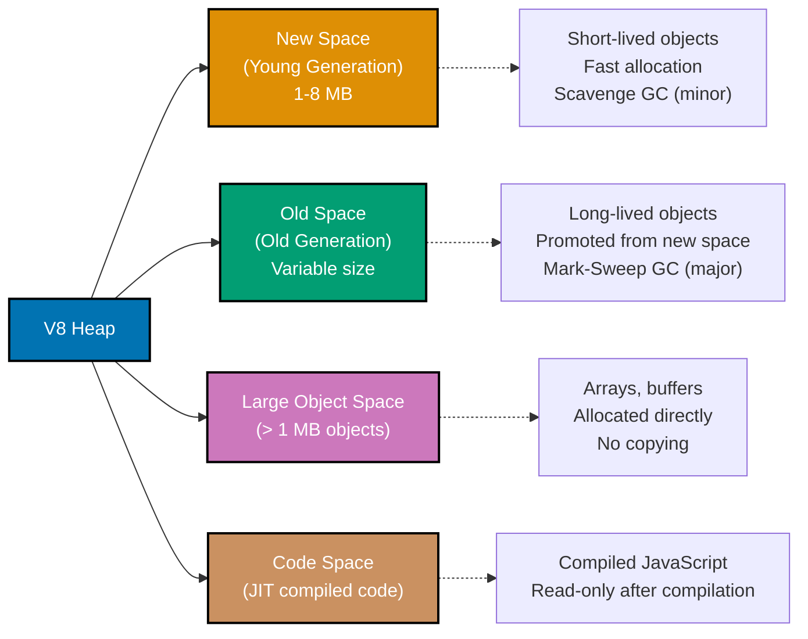
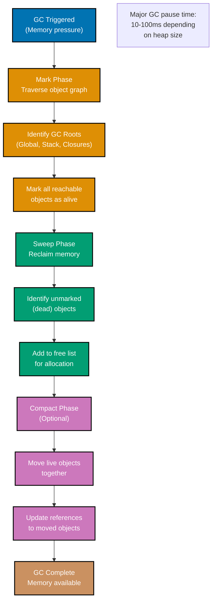
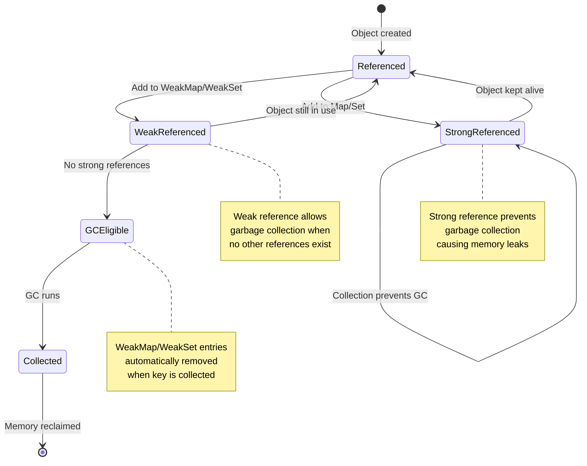
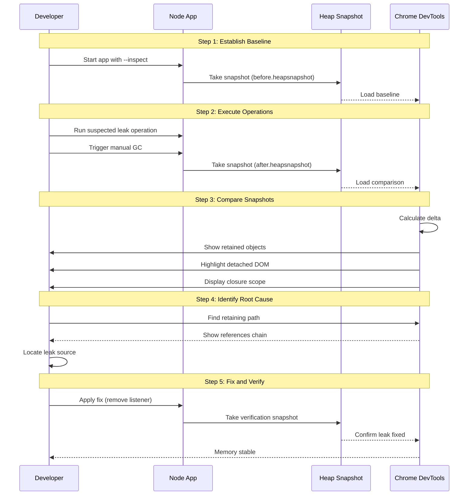
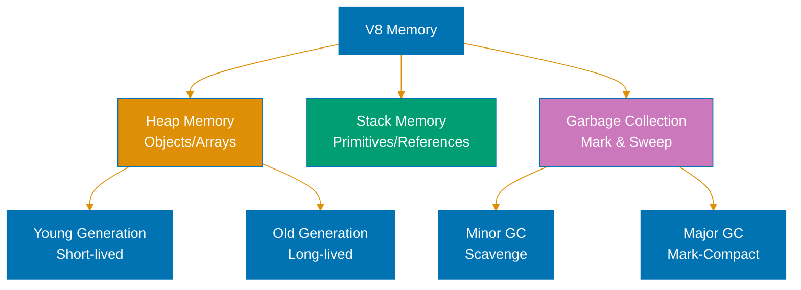

# TypeScript Memory Management

**Quick Reference**: [Overview](#overview) | [V8 Heap](#v8-heap-structure) | [Garbage Collection](#garbage-collection) | [Memory Leaks](#memory-leaks) | [Monitoring](#memory-monitoring) | [Optimization](#memory-optimization) | [Streams](#streaming-large-data) | [Related Documentation](#related-documentation)

## Overview

Understanding memory management is critical for Node.js applications handling large-scale donation processing and financial transactions. TypeScript compiles to JavaScript and runs on V8, which uses automatic garbage collection.

### Memory Principles

- **Heap vs Stack**: Objects on heap, primitives on stack
- **GC Roots**: Global variables, closures, event listeners
- **Reference Counting**: Circular references can leak
- **Generational GC**: Young generation (scavenge) vs old generation (mark-sweep)
- **Memory Pressure**: GC frequency increases with allocation rate

## V8 Heap Structure

### V8 Memory Spaces Architecture

V8 organizes memory into different spaces optimized for different object lifespans and sizes.



### Heap Regions

```typescript
// Check heap statistics
import v8 from "v8";

const heapStats = v8.getHeapStatistics();

console.log("Total heap size:", heapStats.total_heap_size / 1024 / 1024, "MB");
console.log("Used heap size:", heapStats.used_heap_size / 1024 / 1024, "MB");
console.log("Heap size limit:", heapStats.heap_size_limit / 1024 / 1024, "MB");

// Increase heap size if needed
// node --max-old-space-size=4096 app.js
```

### Memory Snapshots

```typescript
import v8 from "v8";
import fs from "fs";

function takeHeapSnapshot(filename: string): void {
  const snapshot = v8.writeHeapSnapshot(filename);
  console.log("Heap snapshot written to:", snapshot);
}

// Take snapshot before and after operation
takeHeapSnapshot("before.heapsnapshot");
processDonations();
takeHeapSnapshot("after.heapsnapshot");

// Analyze in Chrome DevTools
```

## Garbage Collection

### Garbage Collection Cycle (Mark-Sweep)

V8 uses mark-sweep algorithm for old generation garbage collection. Understanding the phases helps optimize memory usage.



### GC Types

```typescript
// Monitor GC events
import { PerformanceObserver } from "perf_hooks";

const obs = new PerformanceObserver((list) => {
  const entries = list.getEntries();
  entries.forEach((entry) => {
    console.log(`GC: ${entry.name} took ${entry.duration.toFixed(2)}ms`);
  });
});

obs.observe({ entryTypes: ["gc"] });

// Scavenge (minor GC): Collects young generation
// Mark-sweep (major GC): Collects old generation
// Incremental marking: Reduces pause times
```

### Manual GC (Development Only)

```typescript
// Start node with --expose-gc
// node --expose-gc app.js

declare global {
  var gc: () => void;
}

if (global.gc) {
  console.log("Before GC:", process.memoryUsage().heapUsed / 1024 / 1024, "MB");
  global.gc();
  console.log("After GC:", process.memoryUsage().heapUsed / 1024 / 1024, "MB");
}
```

## Memory Leaks

### Common Leak Patterns

```typescript
// ❌ LEAK: Global variables
let donations: Donation[] = [];

function processDonation(donation: Donation) {
  donations.push(donation); // Never cleared!
}

// ✅ FIX: Clear when done
function processDonationBatch(batch: Donation[]) {
  // Process batch
  // Clear reference when done
}

// ❌ LEAK: Event listeners not removed
class DonationService {
  constructor(private emitter: EventEmitter) {
    this.emitter.on("donation", this.handleDonation.bind(this));
  }

  private handleDonation(donation: Donation) {
    // Process
  }

  // Memory leak: listener never removed
}

// ✅ FIX: Remove listeners
class DonationService {
  private handler: (donation: Donation) => void;

  constructor(private emitter: EventEmitter) {
    this.handler = this.handleDonation.bind(this);
    this.emitter.on("donation", this.handler);
  }

  destroy() {
    this.emitter.off("donation", this.handler);
  }

  private handleDonation(donation: Donation) {
    // Process
  }
}

// ❌ LEAK: Closures capturing large objects
function createDonationProcessor() {
  const allDonations = new Array(1000000); // Large array

  return {
    process: (donation: Donation) => {
      // Closure captures allDonations
      console.log(allDonations.length);
    },
  };
}

// ✅ FIX: Don't capture unnecessary data
function createDonationProcessor() {
  const donationCount = 1000000; // Only capture what's needed

  return {
    process: (donation: Donation) => {
      console.log(donationCount);
    },
  };
}

// ❌ LEAK: Timers not cleared
class DonationMonitor {
  private intervalId: NodeJS.Timeout;

  start() {
    this.intervalId = setInterval(() => {
      this.checkDonations();
    }, 1000);
  }

  // Leak: interval never cleared
}

// ✅ FIX: Clear timers
class DonationMonitor {
  private intervalId: NodeJS.Timeout | null = null;

  start() {
    this.intervalId = setInterval(() => {
      this.checkDonations();
    }, 1000);
  }

  stop() {
    if (this.intervalId) {
      clearInterval(this.intervalId);
      this.intervalId = null;
    }
  }

  private checkDonations() {
    // Check
  }
}
```

### WeakMap and WeakRef

#### WeakMap/WeakSet Lifecycle

Weak references allow garbage collection of referenced objects, preventing memory leaks in caching scenarios.



```typescript
// ✅ GOOD: WeakMap for metadata
const donationMetadata = new WeakMap<Donation, { processed: boolean }>();

function processDonation(donation: Donation) {
  donationMetadata.set(donation, { processed: true });
  // Metadata automatically collected when donation is collected
}

// ✅ GOOD: WeakRef for caching
class DonationCache {
  private cache = new Map<string, WeakRef<Donation>>();

  set(id: string, donation: Donation): void {
    this.cache.set(id, new WeakRef(donation));
  }

  get(id: string): Donation | undefined {
    const ref = this.cache.get(id);
    if (!ref) return undefined;

    const donation = ref.deref();
    if (!donation) {
      // Object was collected, remove from cache
      this.cache.delete(id);
      return undefined;
    }

    return donation;
  }
}
```

## Memory Monitoring

### Memory Leak Detection Workflow

Systematically detecting and fixing memory leaks using Chrome DevTools and heap snapshots.



### Process Memory Usage

```typescript
function logMemoryUsage(): void {
  const usage = process.memoryUsage();

  console.log({
    rss: `${(usage.rss / 1024 / 1024).toFixed(2)} MB`, // Resident Set Size
    heapTotal: `${(usage.heapTotal / 1024 / 1024).toFixed(2)} MB`,
    heapUsed: `${(usage.heapUsed / 1024 / 1024).toFixed(2)} MB`,
    external: `${(usage.external / 1024 / 1024).toFixed(2)} MB`,
  });
}

// Monitor periodically
setInterval(logMemoryUsage, 10000);
```

### Memory Profiling with Clinic

```bash
# Install clinic
npm install -g clinic

# Profile memory
clinic doctor -- node app.js

# Memory heap profiling
clinic heapprofiler -- node app.js
```

### Finding Memory Leaks

```typescript
import memwatch from "@airbnb/node-memwatch";

memwatch.on("leak", (info) => {
  console.error("Memory leak detected:", info);
});

memwatch.on("stats", (stats) => {
  console.log("GC stats:", {
    numFullGC: stats.num_full_gc,
    numIncGC: stats.num_inc_gc,
    heapCompactions: stats.heap_compactions,
    usage: `${(stats.current_base / 1024 / 1024).toFixed(2)} MB`,
  });
});
```

## Memory Optimization

### Object Pooling

```typescript
class DonationPool {
  private pool: Donation[] = [];
  private readonly maxSize = 1000;

  acquire(data: DonationData): Donation {
    const donation = this.pool.pop() || this.create();

    // Reset and populate
    Object.assign(donation, data);

    return donation;
  }

  release(donation: Donation): void {
    if (this.pool.length < this.maxSize) {
      // Clear sensitive data
      this.reset(donation);
      this.pool.push(donation);
    }
  }

  private create(): Donation {
    return {} as Donation;
  }

  private reset(donation: Donation): void {
    // Clear properties
    for (const key in donation) {
      delete (donation as any)[key];
    }
  }
}

const pool = new DonationPool();

// Usage
const donation = pool.acquire(donationData);
processDonation(donation);
pool.release(donation);
```

### Avoid String Concatenation

```typescript
// ❌ SLOW: Creates many intermediate strings
let report = "";
for (const donation of donations) {
  report += `Donation ${donation.id}: ${donation.amount}\n`;
}

// ✅ FAST: Uses array join
const lines: string[] = [];
for (const donation of donations) {
  lines.push(`Donation ${donation.id}: ${donation.amount}`);
}
const report = lines.join("\n");
```

### Buffer for Binary Data

```typescript
// ❌ BAD: String for binary data
const data = fs.readFileSync("file.bin", "utf8");

// ✅ GOOD: Buffer for binary data
const buffer = fs.readFileSync("file.bin");

// Convert buffer to hex
const hex = buffer.toString("hex");

// Convert buffer to base64
const base64 = buffer.toString("base64");
```

## Streaming Large Data

### Stream Processing

```typescript
import { Transform } from "stream";
import { pipeline } from "stream/promises";
import fs from "fs";

// ❌ BAD: Load entire file into memory
async function processDonationsFile(filePath: string) {
  const content = await fs.promises.readFile(filePath, "utf8");
  const donations = JSON.parse(content);

  for (const donation of donations) {
    await processDonation(donation);
  }
}

// ✅ GOOD: Stream processing
async function processDonationsFileStreaming(filePath: string) {
  const processTransform = new Transform({
    objectMode: true,
    async transform(chunk, encoding, callback) {
      try {
        const donation = JSON.parse(chunk.toString());
        await processDonation(donation);
        callback();
      } catch (error) {
        callback(error as Error);
      }
    },
  });

  await pipeline(fs.createReadStream(filePath), split(), processTransform);
}
```

### Async Iterators for Large Datasets

```typescript
async function* fetchDonationsBatch(batchSize: number = 1000) {
  let offset = 0;

  while (true) {
    const batch = await prisma.donation.findMany({
      skip: offset,
      take: batchSize,
    });

    if (batch.length === 0) break;

    yield batch;
    offset += batchSize;
  }
}

// Usage
for await (const batch of fetchDonationsBatch()) {
  for (const donation of batch) {
    await processDonation(donation);
  }
}
```

### Database Cursors

```typescript
import { PrismaClient } from "@prisma/client";

const prisma = new PrismaClient();

async function processAllDonations() {
  const cursor = prisma.donation.findMany({
    orderBy: { id: "asc" },
    take: 1000,
  });

  let donations = await cursor;
  let lastId = donations[donations.length - 1]?.id;

  while (donations.length > 0) {
    // Process batch
    for (const donation of donations) {
      await processDonation(donation);
    }

    // Fetch next batch
    donations = await prisma.donation.findMany({
      orderBy: { id: "asc" },
      take: 1000,
      skip: 1,
      cursor: { id: lastId },
    });

    if (donations.length > 0) {
      lastId = donations[donations.length - 1].id;
    }
  }
}
```

## Related Documentation

- **[TypeScript Performance](ex-soen-prla-ty__performance.md)** - Performance optimization
- **[TypeScript Best Practices](ex-soen-prla-ty__best-practices.md)** - Coding standards

---

**Last Updated**: 2025-01-23
**TypeScript Version**: 5.0+ (baseline), 5.4+ (milestone), 5.6+ (stable), 5.9.3+ (latest stable)
**Maintainers**: OSE Documentation Team

## TypeScript Memory Management


