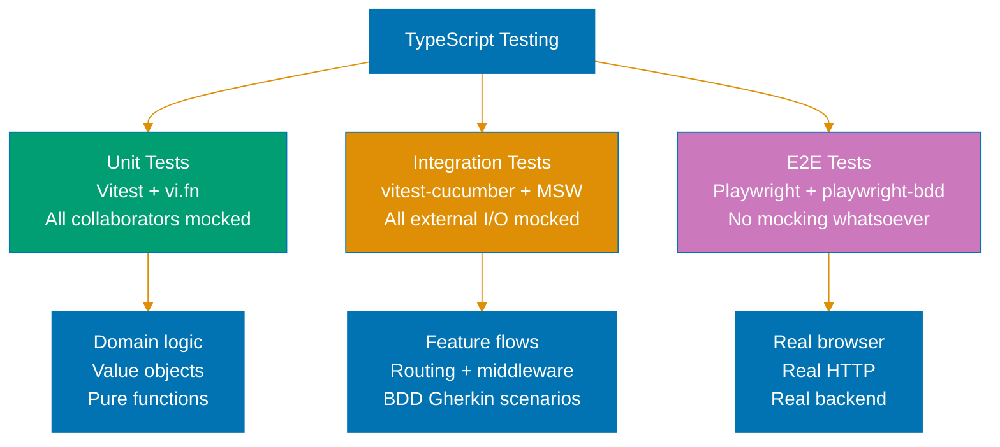
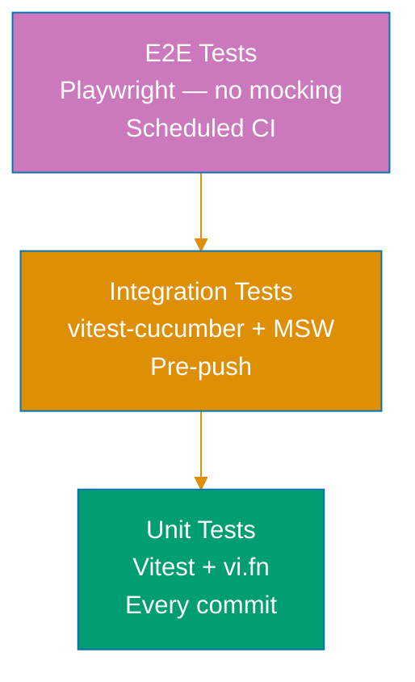

# TypeScript Testing

## Prerequisite Knowledge

**REQUIRED**: Read [Three-Tier Testing Model](../../development/test-driven-development-tdd/ex-soen-de-tedrdetd__three-tier-testing.md) before applying these standards. This document covers the TypeScript-specific implementation of each tier.

## The Mocking Boundary

**REQUIRED**: Unit and integration tests MUST mock all external I/O.

**REQUIRED**: E2E tests MUST NOT mock anything.



## Test Pyramid



---

## Unit Tests

### Tools

**REQUIRED**: Vitest + Testing Library + `vi.fn()` / `vi.mock()`.

**PROHIBITED**: Jest (use Vitest), real network calls, real DB, `fetch` without mocking.

### When to write unit tests

- Domain logic, value objects, calculations
- React component rendering and interaction logic
- Pure utility functions
- Input validation and error handling

### Setup — Vitest config (unit project)

```typescript
// vitest.config.ts
{
  test: {
    name: "unit",
    include: ["**/*.unit.{test,spec}.{ts,tsx}"],
    environment: "jsdom",
    setupFiles: ["./src/test/setup.ts"],
  }
}
```

### Mocking collaborators with vi.fn()

```typescript
// ZakatCalculator.unit.test.ts
import { describe, it, expect, vi } from "vitest";
import { ZakatService } from "./ZakatService";
import type { ZakatRepository } from "./ZakatRepository";

describe("ZakatService", () => {
  it("should calculate zakat for wealth above nisab", () => {
    const mockRepository: ZakatRepository = {
      save: vi.fn(), // ✅ mocked — no real DB
      findByUserId: vi.fn(),
    };
    const service = new ZakatService(mockRepository);

    const result = service.calculate({ wealth: 100_000, nisabThreshold: 3_000 });

    expect(result.zakatDue).toBe(2_500);
    expect(mockRepository.save).not.toHaveBeenCalled();
  });

  it("should return zero zakat below nisab", () => {
    const service = new ZakatService({ save: vi.fn(), findByUserId: vi.fn() });

    const result = service.calculate({ wealth: 2_000, nisabThreshold: 3_000 });

    expect(result.zakatDue).toBe(0);
  });
});
```

### Mocking modules with vi.mock()

```typescript
// auth.unit.test.ts
import { describe, it, expect, vi, beforeEach } from "vitest";
import { AuthService } from "./AuthService";

vi.mock("./cookie-store", () => ({
  getCookie: vi.fn(),
  setCookie: vi.fn(),
  deleteCookie: vi.fn(),
}));

import { getCookie, setCookie } from "./cookie-store";

describe("AuthService", () => {
  beforeEach(() => {
    vi.clearAllMocks();
  });

  it("should return null when auth cookie is absent", () => {
    vi.mocked(getCookie).mockReturnValue(null); // ✅ mocked cookie store

    const user = AuthService.getCurrentUser();

    expect(user).toBeNull();
  });

  it("should persist auth token on login", async () => {
    await AuthService.login({ email: "user@example.com", password: "secret" });

    expect(setCookie).toHaveBeenCalledWith("auth", expect.any(String));
  });
});
```

### Component unit tests

```typescript
// Breadcrumb.unit.test.tsx
import { describe, it, expect } from "vitest";
import { render, screen } from "@testing-library/react";
import { Breadcrumb } from "./Breadcrumb";

describe("Breadcrumb", () => {
  it("should render all crumb segments", () => {
    render(<Breadcrumb path="/dashboard/members/alice" />);

    expect(screen.getByText("Dashboard")).toBeInTheDocument();
    expect(screen.getByText("Members")).toBeInTheDocument();
    expect(screen.getByText("Alice")).toBeInTheDocument();
  });

  it("should mark the last segment as current page", () => {
    render(<Breadcrumb path="/dashboard/members" />);

    const membersLink = screen.getByText("Members");
    expect(membersLink).toHaveAttribute("aria-current", "page");
  });
});
```

---

## Integration Tests

### Tools

**REQUIRED**: Vitest + `@amiceli/vitest-cucumber` + MSW (Mock Service Worker) + Testing Library.

**PROHIBITED**: Real network calls, real backend, Testcontainers, `fetch` reaching real servers.

### When to write integration tests

- BDD Gherkin scenarios that test a full user-facing feature flow
- Multiple components wired together (routing, auth, data fetching)
- Testing HTTP error handling, loading states, and edge cases
- Verifying that the application wires its layers correctly

### MSW Server Setup

```typescript
// src/test/server.ts
import { setupServer } from "msw/node";
import { handlers } from "./handlers";

export const server = setupServer(...handlers);
```

```typescript
// src/test/setup.ts
import { beforeAll, afterEach, afterAll } from "vitest";
import { server } from "./server";

beforeAll(() => server.listen({ onUnhandledRequest: "error" }));
afterEach(() => server.resetHandlers());
afterAll(() => server.close());
```

```typescript
// src/test/handlers.ts
import { http, HttpResponse } from "msw";
import { MOCK_MEMBERS } from "./helpers/mock-data";

export const handlers = [
  http.get("/api/members", () => HttpResponse.json(MOCK_MEMBERS)),
  http.post("/api/members", async ({ request }) => {
    const body = (await request.json()) as { name: string; role: string };
    return HttpResponse.json({ id: "new-id", ...body }, { status: 201 });
  }),
  http.delete("/api/members/:id", () => new HttpResponse(null, { status: 204 })),
];
```

### Vitest config (integration project)

```typescript
// vitest.config.ts
{
  test: {
    name: "integration",
    include: ["**/*.integration.{test,spec}.{ts,tsx}"],
    environment: "jsdom",
    setupFiles: ["./src/test/setup.ts"],  // MSW server wired here
  }
}
```

### BDD-driven integration test (vitest-cucumber)

```typescript
// src/test/integration/member-list.integration.test.tsx
import { describeFeature, loadFeature } from "@amiceli/vitest-cucumber";
import { render, screen } from "@testing-library/react/pure";
import userEvent from "@testing-library/user-event";
import { AUTHENTICATED } from "../helpers/auth-mock";
import { server } from "../server";
import { MOCK_MEMBERS } from "../helpers/mock-data";
import { http, HttpResponse } from "msw";

const feature = await loadFeature("../../specs/apps/organiclever-fe/members/member-list.feature");

describeFeature(feature, ({ Scenario }) => {
  Scenario("Viewing the member list as a logged-in user", ({ Given, When, Then }) => {
    Given("a user is logged in", () => {
      document.cookie = `auth=${AUTHENTICATED}`;
      // ✅ Auth state set in-memory — no real login HTTP call
    });

    When("they navigate to the members page", () => {
      render(<MemberListPage />);
      // ✅ MSW handles GET /api/members, returns MOCK_MEMBERS
    });

    Then("they see all members in the list", async () => {
      for (const member of MOCK_MEMBERS) {
        expect(await screen.findByText(member.name)).toBeInTheDocument();
      }
    });
  });

  Scenario("Handling an API error", ({ Given, When, Then }) => {
    Given("the members API is unavailable", () => {
      server.use(
        http.get("/api/members", () => HttpResponse.json(null, { status: 500 })),
      );
      // ✅ Override MSW handler for this scenario — still no real network
    });

    When("they navigate to the members page", () => {
      render(<MemberListPage />);
    });

    Then("they see an error message", async () => {
      expect(await screen.findByText("Failed to load members")).toBeInTheDocument();
    });
  });
});
```

### In-memory state for destructive tests

When tests perform destructive operations (delete, edit), restore state after each scenario
using MSW handler resets:

```typescript
// src/test/integration/member-deletion.integration.test.tsx
import { server } from "../server";
import { MOCK_MEMBERS } from "../helpers/mock-data";
import { http, HttpResponse } from "msw";

describeFeature(feature, ({ Scenario, AfterEachScenario }) => {
  AfterEachScenario(() => {
    server.resetHandlers(); // ✅ Restore default handlers after each scenario
  });

  Scenario("Deleting a member", ({ Given, When, Then }) => {
    Given("there is a member named {string}", (name: string) => {
      server.use(http.get("/api/members", () => HttpResponse.json(MOCK_MEMBERS.filter((m) => m.name === name))));
    });

    When("the user deletes the member", async () => {
      const deleteButton = await screen.findByRole("button", { name: /delete/i });
      await userEvent.click(deleteButton);
    });

    Then("the member no longer appears in the list", async () => {
      await waitFor(() => {
        expect(screen.queryByText("Alice Johnson")).not.toBeInTheDocument();
      });
    });
  });
});
```

---

## E2E Tests

### Tools

**REQUIRED**: Playwright + `playwright-bdd`.

**PROHIBITED**: Any form of mocking (`page.route()`, MSW, `vi.mock()`). All network calls must
reach the real backend.

### When to write E2E tests

- Critical user journeys (login, create member, delete member)
- Cross-service flows requiring real backend + real DB
- Deployment smoke tests
- Acceptance scenarios that validate the live system

### E2E project structure

```
apps/organiclever-fe-e2e/
  tests/
    steps/
      auth/
        login.steps.ts
        logout.steps.ts
      members/
        member-list.steps.ts
        member-deletion.steps.ts
  playwright.config.ts
```

### E2E test (no mocking)

```typescript
// tests/steps/auth/login.steps.ts
import { Given, When, Then } from "@cucumber/cucumber";
import { expect } from "@playwright/test";

let page: Page;

Given("a registered user with email {string} and password {string}", async ({}, email: string, password: string) => {
  // ✅ Real credentials — real auth server handles this
  await page.goto("/login");
  await page.fill("[name=email]", email);
  await page.fill("[name=password]", password);
});

When("the user submits the login form", async () => {
  await page.click("button[type=submit]");
  // ✅ Real HTTP POST /api/auth — no mocking
});

Then("the user is redirected to the dashboard", async () => {
  await page.waitForURL("/dashboard");
  await expect(page.getByText("Welcome")).toBeVisible();
  // ✅ Real page rendered by real backend
});
```

### Nx targets for E2E

```bash
nx run organiclever-fe-e2e:test:e2e        # Headless — real system, no mocking
nx run organiclever-fe-e2e:test:e2e:ui     # Playwright UI mode
```

---

## Coverage Requirements

**REQUIRED**: ≥85% code coverage enforced via Vitest coverage.

```typescript
// vitest.config.ts — coverage config
coverage: {
  provider: "v8",
  thresholds: { lines: 85, functions: 85, branches: 85, statements: 85 },
  exclude: ["**/*.integration.test.*", "**/*.e2e.test.*", "node_modules"],
}
```

Coverage is measured on unit tests only. Integration and E2E tests do not contribute to the
coverage threshold because they test flows, not line-by-line logic.

---

## Related Standards

- [Three-Tier Testing Model](../../development/test-driven-development-tdd/ex-soen-de-tedrdetd__three-tier-testing.md) — authoritative tier definitions
- [Integration Testing Standards](../../development/test-driven-development-tdd/ex-soen-de-tedrdetd__integration-testing-standards.md) — in-memory repos, MSW patterns
- [TypeScript TDD](./ex-soen-prla-ty__test-driven-development.md) — Red-Green-Refactor cycle, Vitest setup
- [TypeScript BDD](./ex-soen-prla-ty__behaviour-driven-development.md) — Gherkin, vitest-cucumber, playwright-bdd

---

**Last Updated**: 2026-03-04
