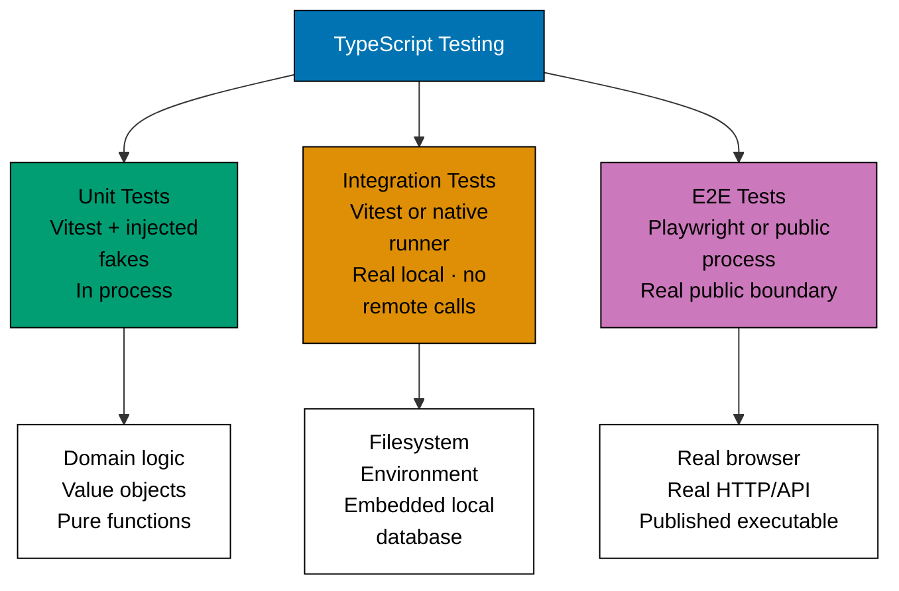
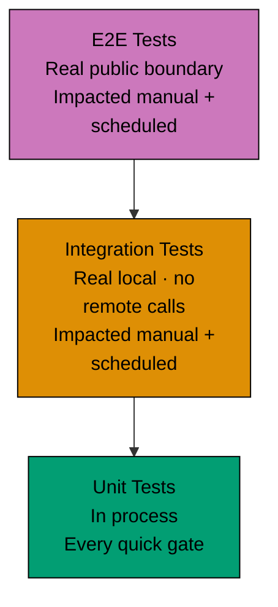

# TypeScript Testing

## Prerequisite Knowledge

**REQUIRED**: Read [Three-Tier Testing Model](../../development/test-driven-development-tdd/three-tier-testing.md) before applying these standards. This document covers the TypeScript-specific implementation of each tier.

## The Boundary Contract

**REQUIRED**: Unit tests stay in process and replace every operating-system or remote boundary with
an injected fake. Integration tests use at least one real, isolated same-machine resource but no
external network reach. E2E tests invoke the real public browser, HTTP/API, or process
boundary with isolated synthetic data.



## Test Pyramid



---

## Unit Tests

### Tools

**REQUIRED**: Vitest + Testing Library + `vi.fn()` / `vi.mock()`.

**PROHIBITED**: Jest (use Vitest), real network calls, real DB, `fetch` without mocking.

### When to write unit tests

- Domain logic, value objects, calculations
- React component rendering and interaction logic
- Pure utility functions
- Input validation and error handling

### Setup — Vitest config (unit project)

```typescript
// vitest.config.ts
{
  test: {
    name: "unit",
    include: ["**/*.unit.{test,spec}.{ts,tsx}"],
    environment: "jsdom",
    setupFiles: ["./src/test/setup.ts"],
  }
}
```

### Mocking collaborators with vi.fn()

```typescript
// ZakatCalculator.unit.test.ts
import { describe, it, expect, vi } from "vitest";
import { ZakatService } from "./ZakatService";
import type { ZakatRepository } from "./ZakatRepository";

describe("ZakatService", () => {
  it("should calculate zakat for wealth above nisab", () => {
    const mockRepository: ZakatRepository = {
      save: vi.fn(), // ✅ mocked — no real DB
      findByUserId: vi.fn(),
    };
    const service = new ZakatService(mockRepository);

    const result = service.calculate({ wealth: 100_000, nisabThreshold: 3_000 });

    expect(result.zakatDue).toBe(2_500);
    expect(mockRepository.save).not.toHaveBeenCalled();
  });

  it("should return zero zakat below nisab", () => {
    const service = new ZakatService({ save: vi.fn(), findByUserId: vi.fn() });

    const result = service.calculate({ wealth: 2_000, nisabThreshold: 3_000 });

    expect(result.zakatDue).toBe(0);
  });
});
```

### Mocking modules with vi.mock()

```typescript
// auth.unit.test.ts
import { describe, it, expect, vi, beforeEach } from "vitest";
import { AuthService } from "./AuthService";

vi.mock("./cookie-store", () => ({
  getCookie: vi.fn(),
  setCookie: vi.fn(),
  deleteCookie: vi.fn(),
}));

import { getCookie, setCookie } from "./cookie-store";

describe("AuthService", () => {
  beforeEach(() => {
    vi.clearAllMocks();
  });

  it("should return null when auth cookie is absent", () => {
    vi.mocked(getCookie).mockReturnValue(null); // ✅ mocked cookie store

    const user = AuthService.getCurrentUser();

    expect(user).toBeNull();
  });

  it("should persist auth token on login", async () => {
    await AuthService.login({ email: "user@example.com", password: "secret" });

    expect(setCookie).toHaveBeenCalledWith("auth", expect.any(String));
  });
});
```

### Component unit tests

```typescript
// Breadcrumb.unit.test.tsx
import { describe, it, expect } from "vitest";
import { render, screen } from "@testing-library/react";
import { Breadcrumb } from "./Breadcrumb";

describe("Breadcrumb", () => {
  it("should render all crumb segments", () => {
    render(<Breadcrumb path="/dashboard/members/alice" />);

    expect(screen.getByText("Dashboard")).toBeInTheDocument();
    expect(screen.getByText("Members")).toBeInTheDocument();
    expect(screen.getByText("Alice")).toBeInTheDocument();
  });

  it("should mark the last segment as current page", () => {
    render(<Breadcrumb path="/dashboard/members" />);

    const membersLink = screen.getByText("Members");
    expect(membersLink).toHaveAttribute("aria-current", "page");
  });
});
```

---

## Integration Tests

### Tools and boundary

Use Vitest or the project-native runner plus real isolated resources such as a temporary filesystem,
process environment snapshot, child process, standard stream, or embedded database. Integration
must not reach an external network, a service the test did not start, MSW, or another network
interceptor. An in-memory repository or intercepted `fetch` is Unit proof, not Integration proof.

### When to write integration tests

- Env-tier loading from real isolated files
- Filesystem persistence and cache behaviour
- Child-process and standard-stream adapters that reach no external network
- Embedded local database adapters reached without TCP or another socket

### Vitest config

```typescript
// vitest.config.ts
{
  test: {
    name: "integration",
    include: ["**/*.integration.{test,spec}.{ts,tsx}"],
    environment: "jsdom",
    fileParallelism: false, // Serialize when the adapter snapshots process-wide state.
  }
}
```

### Real-filesystem Integration example

```typescript
import { mkdtemp, rm, writeFile } from "node:fs/promises";
import { tmpdir } from "node:os";
import path from "node:path";
import { afterEach, expect, it } from "vitest";
import { loadTierEnv } from "@open-sharia-enterprise/ts-env-loader";

let root: string | undefined;
afterEach(async () => {
  if (root) await rm(root, { recursive: true, force: true });
});

it("loads the selected tier from a real isolated file", async () => {
  root = await mkdtemp(path.join(tmpdir(), "tier-env-"));
  await writeFile(path.join(root, ".env.stag"), "PUBLIC_NAME=staging\n");
  const env: Record<string, string | undefined> = { APP_ENV: "stag" };

  loadTierEnv({ appDir: root, env });

  expect(env.PUBLIC_NAME).toBe("staging");
});
```

---

## E2E Tests

### Tools

**REQUIRED**: Playwright + `playwright-bdd`.

Do not replace the public boundary under test with `page.route()`, MSW, `vi.mock()`, or a fake
process. Fixture-only dependencies may be isolated, but the browser/HTTP/API/process invocation and
its observable result must be real. Use synthetic accounts and records provisioned for the test;
never production identity or data.

### When to write E2E tests

- Critical user journeys (login, create member, delete member)
- Cross-service flows requiring real backend + real DB
- Deployment smoke tests
- Acceptance scenarios that validate the live system

### E2E project structure

```text
specs/apps/organiclever/app-web/behaviours/
  auth/
    login.feature

apps/organiclever-app-web-e2e/
  steps/
    auth/
      login.steps.ts
      logout.steps.ts
    members/
      member-list.steps.ts
      member-deletion.steps.ts
  playwright.config.ts
```

### E2E test (no mocking)

```typescript
// apps/organiclever-app-web-e2e/steps/auth/login.steps.ts
import { expect } from "@playwright/test";
import { createBdd } from "playwright-bdd";

const { Given, When, Then } = createBdd();

Given(
  "a registered user with email {string} and password {string}",
  async ({ page }, email: string, password: string) => {
    // ✅ Synthetic scenario credentials — the real public auth boundary handles them
    await page.goto("/login");
    await page.fill("[name=email]", email);
    await page.fill("[name=password]", password);
  },
);

When("the user submits the login form", async ({ page }) => {
  await page.click("button[type=submit]");
  // ✅ Real HTTP POST /api/auth — no mocking
});

Then("the user is redirected to the dashboard", async ({ page }) => {
  await page.waitForURL("/dashboard");
  await expect(page.getByText("Welcome")).toBeVisible();
  // ✅ Real page rendered by real backend
});
```

### Nx targets for E2E

```bash
./hippo run --class ephemeral --resource-tier standard --disk-path . -- npm exec nx -- run organiclever-app-web-e2e:test:e2e
./hippo run --class service --resource-tier standard --disk-path . -- npm exec nx -- run organiclever-app-web-e2e:test:e2e:ui
```

---

## Coverage Requirements

**REQUIRED**: ≥99% Unit line coverage enforced by the native `test:unit` Vitest invocation.

```typescript
// vitest.config.ts — coverage config
coverage: {
  provider: "v8",
  thresholds: { lines: 99 },
  exclude: ["**/*.integration.test.*", "**/*.e2e.test.*", "node_modules"],
}
```

Runtime code coverage is collected and enforced by the runtime target that produces it—normally
`test:unit` for TypeScript projects. Static `test:coverage:unit`,
`test:coverage:integration`, `test:coverage:e2e`, `test:coverage:behaviour`, and their aggregate
inspect the corpus/adapters without executing tests or consuming a runtime report.
Dedicated E2E projects do not own Unit and do not waive the source owner's 99% threshold. Exclude
an explicitly enumerated boundary adapter from Unit only when it is wholly a resource, process,
generated-code, or static-data boundary and named Integration or E2E runtime proof exercises it.
Keep exclusions to named files or narrow functions; broad path globs, mixed core-logic exclusions,
and boundary code without higher-layer proof are forbidden.

---

## Related Standards

- [Three-Level Testing Model](../../development/test-driven-development-tdd/three-tier-testing.md) — authoritative boundary definitions
- [Integration Testing Standards](../../development/test-driven-development-tdd/integration-testing-standards.md) — real isolated local-resource patterns
- [TypeScript TDD](./test-driven-development.md) — Red-Green-Refactor cycle, Vitest setup
- [TypeScript BDD](./behaviour-driven-development.md) — Gherkin, vitest-cucumber, playwright-bdd
