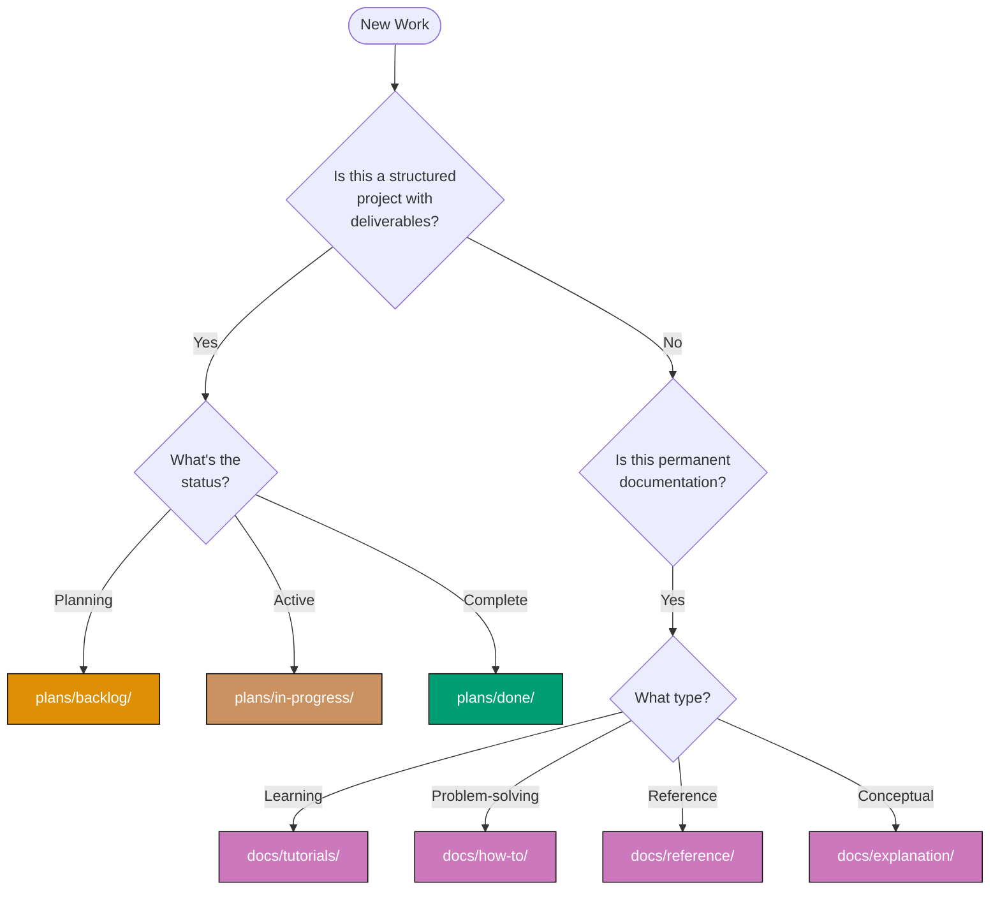

# How to Organize Your Work

## Problem

You're starting new work and need to know: **Where should I put this?** Should it go in `plans/` or `docs/`?

This guide helps you choose the right location based on the type and lifecycle of your work.

## Quick Decision Tree

%% Color palette: Blue #0173B2, Orange #DE8F05, Brown #CA9161, Teal #029E73, Purple #CC78BC
%% All colors are color-blind friendly and meet WCAG AA contrast standards



## The Two Work Folders

### docs/ - Permanent Documentation

**Purpose:** Long-term, structured documentation using the [Diátaxis framework](../../governance/conventions/structure/diataxis-framework.md)

**Key Characteristics:**

- **Lifecycle:** Permanent, evolves over time
- **Structure:** Four categories (tutorials, how-to, reference, explanation)
- **File Naming:** Kebab-case filenames describing the content
- **Diagram Format:** Mermaid
- **Audience:** Anyone who needs to understand, learn, or reference the project

**Subfolders:**

- `tutorials/` - Learning-oriented step-by-step guides
- `how-to/` - Problem-solving guides (like this one!)
- `reference/` - Technical reference material
- `explanation/` - Conceptual understanding

### plans/ - Project Planning

**Purpose:** Temporary, ephemeral project planning and tracking documents

**Key Characteristics:**

- **Lifecycle:** Temporary, moves between states, archived when done
- **Structure:** Three states (backlog, in-progress, done) plus ideas.md for quick captures
- **File Naming:** Folder names use `YYYY-MM-DD__[identifier]`
- **Diagram Format:** ASCII art
- **Audience:** Project team, stakeholders tracking progress

**Root Level:**

- `ideas.md` - Quick 1-3 liner ideas not yet formalized into plans

**Subfolders:**

- `backlog/` - Planned projects waiting to start
- `in-progress/` - Active projects being worked on
- `done/` - Completed and archived projects

**Standard Plan Files (inside plan folders)** — five-document multi-file layout:

- `README.md` - Plan overview and navigation
- `brd.md` - Business Requirements Document (business goal, impact, affected roles, success metrics)
- `prd.md` - Product Requirements Document (personas, user stories, Gherkin acceptance criteria, scope)
- `tech-docs.md` - Technical documentation (architecture, decisions, file impact)
- `delivery.md` - Delivery checklist (phased `- [ ]` items, one action per checkbox)

Single-file layout (`README.md` only) is an exception for trivially-small plans.

See [CLAUDE.md Plans Organization](../../CLAUDE.md#plans-organization) for full details.

## When to Use Each Folder

### Use plans/ when you're

✅ **Capturing quick ideas** - 1-3 liner todos for potential projects → `plans/ideas.md`
✅ **Planning a feature** - Structured project with requirements and timeline → `plans/backlog/`
✅ **Organizing a sprint** - Time-boxed work with deliverables
✅ **Designing a system** - Technical planning with architecture decisions
✅ **Tracking a project** - Work that moves through stages (backlog → in-progress → done)
✅ **Creating specifications** - Detailed requirements for implementation
✅ **Managing initiatives** - Strategic projects with clear outcomes

**Examples:**

- "Quick idea: Add OAuth2 authentication" → `plans/ideas.md`
- "I want to plan the monorepo migration" → `plans/backlog/2025-11-24__init-monorepo/`

### Use docs/ when you're

✅ **Writing a tutorial** - Teaching someone how to use something
✅ **Creating a how-to guide** - Solving a specific problem
✅ **Documenting APIs** - Reference material for developers
✅ **Explaining concepts** - Conceptual understanding of the system
✅ **Establishing conventions** - Project standards and guidelines
✅ **Recording decisions** - Architectural decision records (ADRs)

**Example:** "I want to document our authentication system" → `docs/explanation/ex-sys__authentication.md`

## Common Workflows

### Workflow 1: Quick Idea → Project Plan

**Scenario:** You have a quick idea for a feature but aren't ready for full planning yet.

**Steps:**

1. **Capture in plans/ideas.md** (Quick Capture Phase)

   ```markdown
   # Ideas

   - Add real-time notification system using WebSockets
   - Create admin dashboard for user management
   ```

   - One-liner or short description
   - No structure needed
   - Fast capture

2. **Promote to plans/backlog/** (When Ready for Planning)

   When the idea is ready for formal planning:

   ```
   plans/backlog/2025-11-25__notification-system/
   ├── README.md
   ├── brd.md
   ├── prd.md
   ├── tech-docs.md
   └── delivery.md
   ```

   - Create full five-document plan structure
   - Define business intent (brd), product requirements (prd), technical approach (tech-docs), and delivery checklist (delivery)
   - Remove or check off the idea from ideas.md

3. **Move to in-progress/** (Execution Phase)

   ```
   mv plans/backlog/2025-11-25__notification-system/ plans/in-progress/
   ```

4. **Complete and archive**

   ```
   mv plans/in-progress/2025-11-25__notification-system/ plans/done/
   ```

### Workflow 2: Brand Strategy Plan

**Scenario:** You want to develop your brand identity.

**Steps:**

1. **Create plan in plans/backlog/** (Planning Phase)

   ```
   plans/backlog/2025-11-24__brand-strategy/
   ├── README.md           # Overview of brand strategy
   ├── brd.md              # Brand goals, business impact, affected roles
   ├── prd.md              # Target audience personas, brand user stories, Gherkin acceptance criteria
   ├── tech-docs.md        # Brand guidelines, design systems
   └── delivery.md         # Delivery checklist for brand development
   ```

   - Define requirements and deliverables
   - Set timeline and milestones

2. **Move to in-progress/** (Execution Phase)

   ```
   mv plans/backlog/2025-11-24__brand-strategy/ plans/in-progress/
   ```

   - Update README status to "In Progress"
   - Start working on deliverables

3. **Move to done/** (Completion Phase)

   ```
   mv plans/in-progress/2025-11-24__brand-strategy/ plans/done/
   ```

   - Update README status to "Done"
   - Archive for historical reference

4. **Document in docs/** (Optional - if creating permanent guidelines)

   ```
   docs/reference/re-br__brand-guidelines.md
   ```

   - Extract permanent brand guidelines from the plan
   - Create reference documentation for the team

### Workflow 3: Feature Development

**Scenario:** You're building a new authentication system.

**Steps:**

1. **Plan in plans/backlog/**

   ```
   plans/backlog/2025-11-25__auth-system/
   ```

   - Create structured plan with requirements
   - Define technical approach
   - Set delivery milestones

2. **Execute (move to in-progress/)**

   ```
   plans/in-progress/2025-11-25__auth-system/
   ```

   - Implement the feature
   - Update delivery.md with progress

3. **Document in docs/**

   ```
   docs/explanation/[feature-name].md  # How it works
   docs/how-to/[task-name].md          # How to use it
   docs/reference/[component-name].md  # Reference documentation
   ```

   - Create permanent documentation
   - Write tutorials for users
   - Document reference materials for developers

4. **Archive plan**

   ```
   plans/done/2025-11-25__auth-system/
   ```

   - Move to done/ for historical record

### Workflow 4: Documentation Pattern

**Scenario:** You want to document a new coding convention.

**Steps:**

1. **Create formal doc in docs/explanation/**

   ```
   governance/conventions/formatting/new-convention.md
   ```

   - Write comprehensive explanation
   - Include examples and rationale
   - Follow [Diátaxis framework](../../governance/conventions/structure/diataxis-framework.md)

2. **Update CLAUDE.md** (If it affects project workflow)
   - Add reference to new convention
   - Link to the full documentation

## Moving Content Between Folders

### From plans/ideas.md to plans/backlog/

**When:** Your quick idea has solidified into a concrete project with deliverables.

**How:**

1. Create new plan folder: `plans/backlog/YYYY-MM-DD__[project-name]/`
2. Structure ideas into `brd.md`, `prd.md`, `tech-docs.md`, `delivery.md` (multi-file default) or a single `README.md` (trivially small)
3. Remove or check off the idea from `plans/ideas.md`

### From plans/ to docs/

**When:** The project is complete and needs permanent documentation for ongoing reference.

**How:**

1. Identify what needs permanent documentation:
   - System architecture → `docs/explanation/`
   - Setup instructions → `docs/how-to/`
   - API specifications → `docs/reference/`
2. Create appropriate docs following [Diátaxis framework](../../governance/conventions/structure/diataxis-framework.md)
3. Link from plan README to the permanent docs
4. Move plan to `plans/done/` for archival

**Example:**

```markdown
<!-- In plans/done/YYYY-MM-DD__[project-name]/README.md -->

## Permanent Documentation

This project is complete. See the following documentation:

- [[Feature] Explanation](../../docs/explanation/[feature-name].md)
- [How to [Task]](../../docs/how-to/[task-name].md)
- [[Component] Reference](../../docs/reference/[component-name].md)
```

## Quick Reference Table

| If you're doing...                         | Use folder...        | Example                                         |
| ------------------------------------------ | -------------------- | ----------------------------------------------- |
| Quick project ideas (1-3 liners)           | `plans/ideas.md`     | "Add OAuth2 authentication"                     |
| Planning a feature                         | `plans/backlog/`     | `2025-11-24__auth-system/`                      |
| Working on a project                       | `plans/in-progress/` | Move from backlog when starting                 |
| Archiving completed project                | `plans/done/`        | Move from in-progress when done                 |
| Writing a tutorial                         | `docs/tutorials/`    | `getting-started.md`                            |
| Creating a how-to guide                    | `docs/how-to/`       | `add-new-app.md`                                |
| Documenting reference material             | `docs/reference/`    | `monorepo-structure.md`                         |
| Explaining a concept                       | `docs/explanation/`  | `ai-agents.md`                                  |
| Recording project conventions              | `docs/explanation/`  | `meta/file-naming.md`                           |
| Research documentation                     | `docs/explanation/`  | Final decision and rationale                    |
| Sprint planning                            | `plans/backlog/`     | One plan per sprint goal                        |
| Technical specifications                   | `plans/` or `docs/`  | Plans if temporary, docs/ if permanent standard |
| Architecture Decision Records (ADRs)       | `docs/explanation/`  | `ex-adr__use-postgresql.md`                     |
| Project roadmap (current work)             | `plans/`             | Multiple plans in backlog/in-progress           |
| Project roadmap (historical documentation) | `docs/explanation/`  | Summary of completed work and direction         |

## Troubleshooting

### "I'm not sure if this should be temporary or permanent"

**Ask yourself:**

- Will this need to be referenced months/years from now? → `docs/`
- Is this specific to a time-bound project? → `plans/`

**Rule of thumb:** When in doubt, start in `plans/ideas.md`. It's easier to promote quick ideas to full plans or permanent docs later.

### "Should this be a plan or documentation?"

**Plans are for:**

- Time-bound projects with a beginning and end
- Work that moves through stages (backlog → in-progress → done)
- Project-specific requirements and deliverables
- Temporary planning artifacts

**Documentation is for:**

- Permanent reference material
- System explanations that don't change often
- Learning resources and how-to guides
- Standards and conventions

**Example:**

- "Building the auth system" → `plans/` (time-bound project)
- "How the auth system works" → `docs/explanation/` (permanent)
- "How to use auth in your code" → `docs/how-to/` (permanent)

### "Where do I put [specific thing]?"

**Common specific cases:**

| What                   | Where                | Why                                     |
| ---------------------- | -------------------- | --------------------------------------- |
| Git commit history     | Git only             | Not in this system                      |
| Code comments          | Source code          | Not in this system                      |
| README.md (repo root)  | Repo root            | Special file for GitHub                 |
| CLAUDE.md              | Repo root            | Special file for Claude Code            |
| API schemas            | `docs/reference/`    | Permanent reference                     |
| Architecture diagrams  | `docs/explanation/`  | Permanent system understanding          |
| Sprint burndown charts | `plans/in-progress/` | Project-specific tracking               |
| Team onboarding guide  | `docs/tutorials/`    | Learning-oriented                       |
| Troubleshooting guide  | `docs/how-to/`       | Problem-solving                         |
| Product requirements   | `plans/backlog/`     | Project planning                        |
| System requirements    | `docs/reference/`    | Permanent specs                         |
| Quick ideas            | `plans/ideas.md`     | Fast capture of potential projects      |
| Proof of concept       | `plans/in-progress/` | Structured exploration with deliverable |
| Research findings      | `docs/explanation/`  | Permanent knowledge                     |

## Related Documentation

- [Diátaxis Framework](../../governance/conventions/structure/diataxis-framework.md) - Understanding the four documentation types
- [File Naming Convention](../../governance/conventions/structure/file-naming.md) - How to name files in `docs/`
- [Diagram and Schema Convention](../../governance/conventions/formatting/diagrams.md) - When to use Mermaid vs ASCII art
- [CLAUDE.md - Plans Organization](../../CLAUDE.md#plans-organization) - Detailed guide to the plans/ folder
- [CLAUDE.md - Documentation Organization](../../CLAUDE.md#documentation-organization) - Overview of docs/ structure

---

**Last Updated:** 2025-11-24
