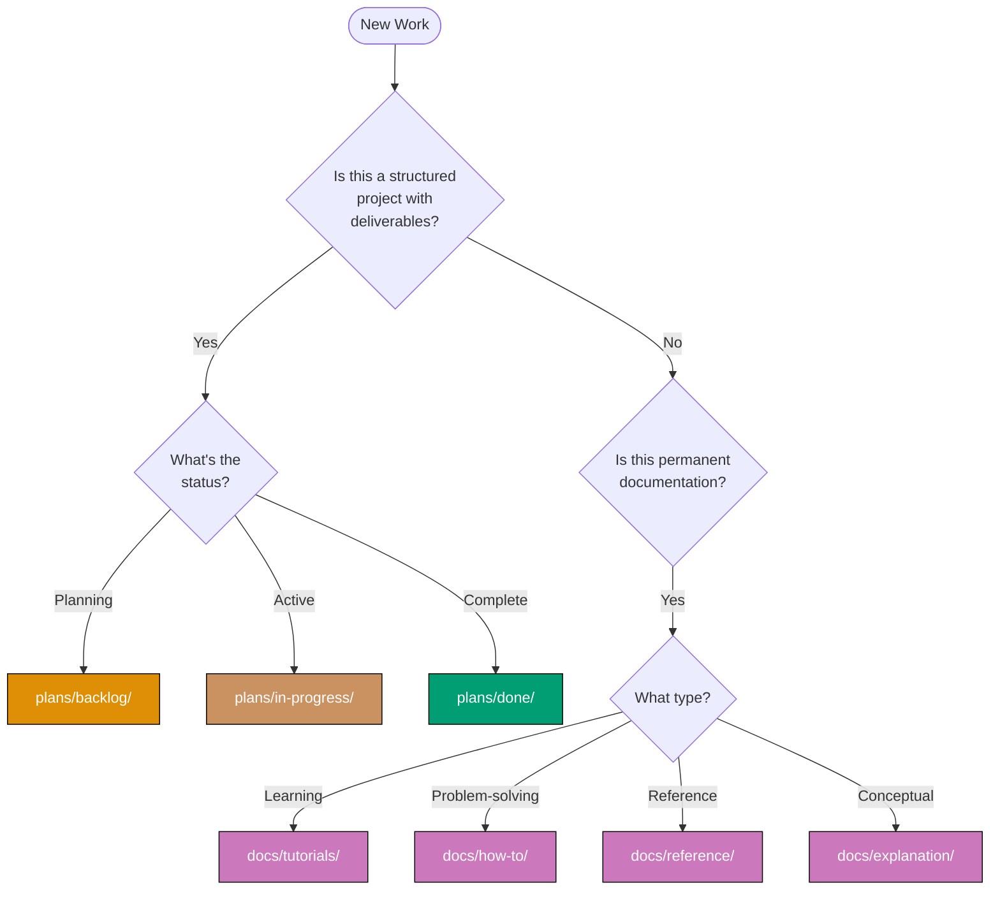

# How to Organize Your Work

## Problem

You're starting new work and need to know: **Where should I put this?** Should it go in `plans/` or `docs/`?

This guide helps you choose the right location based on the type and lifecycle of your work.

## Quick Decision Tree

%% Color palette: Blue #0173B2, Orange #DE8F05, Brown #CA9161, Teal #029E73, Purple #CC78BC
%% All colors are color-blind friendly and meet WCAG AA contrast standards


```mermaid
flowchart TD
    Start([New Work]) --> Q1{Is this a structured<br/>project with<br/>deliverables?}
    Q1 -->|Yes| Q2{What's the<br/>status?}
    Q2 -->|Planning| Backlog[plans/backlog/]
    Q2 -->|Active| InProgress[plans/in-progress/]
    Q2 -->|Complete| Done[plans/done/]
    Q1 -->|No| Q3{Is this permanent<br/>documentation?}
    Q3 -->|Yes| Q4{What type?}
    Q4 -->|Learning| Tutorial[docs/tutorials/]
    Q4 -->|Problem-solving| HowTo[docs/how-to/]
    Q4 -->|Reference| Reference[docs/reference/]
    Q4 -->|Conceptual| Explanation[docs/explanation/]

    style Backlog fill:#DE8F05,stroke:#000000,color:#FFFFFF
    style InProgress fill:#CA9161,stroke:#000000,color:#FFFFFF
    style Done fill:#029E73,stroke:#000000,color:#FFFFFF
    style Tutorial fill:#CC78BC,stroke:#000000,color:#FFFFFF
    style HowTo fill:#CC78BC,stroke:#000000,color:#FFFFFF
    style Reference fill:#CC78BC,stroke:#000000,color:#FFFFFF
    style Explanation fill:#CC78BC,stroke:#000000,color:#FFFFFF
```

## The Two Work Folders

### docs/ - Permanent Documentation

**Purpose:** Long-term, structured documentation using the [Diátaxis framework](../../repo-governance/conventions/structure/diataxis-framework.md)

**Key Characteristics:**

- **Lifecycle:** Permanent, evolves over time
- **Structure:** Four categories (tutorials, how-to, reference, explanation)
- **File Naming:** Kebab-case filenames describing the content
- **Diagram Format:** Mermaid
- **Audience:** Anyone who needs to understand, learn, or reference the project

**Subfolders:**

- `tutorials/` - Learning-oriented step-by-step guides
- `how-to/` - Problem-solving guides (like this one!)
- `reference/` - Technical reference material
- `explanation/` - Conceptual understanding

### plans/ - Project Planning

**Purpose:** Temporary, ephemeral project planning and tracking documents

**Key Characteristics:**

- **Lifecycle:** Temporary, moves between states, archived when done
- **Structure:** Three states (backlog, in-progress, done) plus `ideas/` for two-pager idea briefs
- **File Naming:** Stage-aware — `backlog/` and `in-progress/` use `[identifier]`; `done/` uses `YYYY-MM-DD__[identifier]`
- **Diagram Format:** ASCII art
- **Audience:** Project team, stakeholders tracking progress

**Root Level:**

- `ideas/` - Two-pager idea briefs not yet formalized into full plans (one file per idea, plus a `README.md` index)

**Subfolders:**

- `backlog/` - Planned projects waiting to start
- `in-progress/` - Active projects being worked on
- `done/` - Completed and archived projects

**Standard Plan Files (inside plan folders)** — the six-document mature core:

- `README.md` - Plan overview and navigation
- `brd.md` - Business Requirements Document (business goal, impact, affected roles, success metrics)
- `prd.md` - Product Requirements Document (personas, user stories, Gherkin acceptance criteria, scope)
- `tech-docs.md`, or `tech-docs/README.md` with mapped companions - Technical documentation (architecture, decisions, file impact), in exactly one of the two forms
- `delivery.md` - Delivery checklist (phased `- [ ]` items, one action per checkbox)
- `learnings.md` - Learnings captured during execution, each routed before archival

A new formal plan never collapses to one `README.md`: simple work belongs in the task list, and early work in an idea brief.

See [AGENTS.md Plans Organization](../../AGENTS.md#plans--temporary-files) for full details.

## When to Use Each Folder

### Use plans/ when you're

✅ **Capturing an idea** - a two-pager brief for a potential project → `plans/ideas/`
✅ **Planning a feature** - Structured project with requirements and timeline → `plans/backlog/`
✅ **Organizing a sprint** - Time-boxed work with deliverables
✅ **Designing a system** - Technical planning with architecture decisions
✅ **Tracking a project** - Work that moves through stages (backlog → in-progress → done)
✅ **Creating specifications** - Detailed requirements for implementation
✅ **Managing initiatives** - Strategic projects with clear outcomes

**Examples:**

- "Idea: Add OAuth2 authentication" → `plans/ideas/oauth2-authentication.md`
- "I want to plan the monorepo migration" → `plans/backlog/init-monorepo/`

### Use docs/ when you're

✅ **Writing a tutorial** - Teaching someone how to use something
✅ **Creating a how-to guide** - Solving a specific problem
✅ **Documenting APIs** - Reference material for developers
✅ **Explaining concepts** - Conceptual understanding of the system
✅ **Establishing conventions** - Project standards and guidelines
✅ **Recording decisions** - Architectural decision records (ADRs)

**Example:** "I want to document our authentication system" → `docs/explanation/ex-sys__authentication.md`

## Common Workflows

### Workflow 1: Quick Idea → Project Plan

**Scenario:** You have a quick idea for a feature but aren't ready for full planning yet.

**Steps:**

1. **Capture as a two-pager in plans/ideas/** (Idea-Brief Phase)

   ```
   plans/ideas/notification-system.md
   ```

   - A shortened idea brief: problem, why-now, direction sketch, scope, open questions
   - Not a full plan — no BRD/PRD/tech-docs/delivery split
   - Scan `plans/ideas/` first and fold into an existing brief if one already covers it

2. **Promote to plans/backlog/** (When Ready for Planning)

   When the idea is ready for formal planning:

   ```
   plans/backlog/notification-system/
   ├── README.md
   ├── brd.md
   ├── prd.md
   ├── tech-docs.md
   ├── delivery.md
   └── learnings.md
   ```

   - Create the six-document plan structure (mature core plus one technical form)
   - Define business intent (brd), product requirements (prd), technical approach (tech-docs), delivery checklist (delivery), and learnings log (learnings)
   - Delete the two-pager from `plans/ideas/` (the idea now lives as a plan)

3. **Move to in-progress/** (Execution Phase)

   ```
   mv plans/backlog/notification-system/ plans/in-progress/
   ```

4. **Complete and archive**

   ```
   mv plans/in-progress/notification-system/ plans/done/
   ```

### Workflow 2: Brand Strategy Plan

**Scenario:** You want to develop your brand identity.

**Steps:**

1. **Create plan in plans/backlog/** (Planning Phase)

   ```
   plans/backlog/brand-strategy/
   ├── README.md           # Overview of brand strategy
   ├── brd.md              # Brand goals, business impact, affected roles
   ├── prd.md              # Target audience personas, brand user stories, Gherkin acceptance criteria
   ├── tech-docs.md        # Brand guidelines, design systems
   └── delivery.md         # Delivery checklist for brand development
   ```

   - Define requirements and deliverables
   - Set timeline and milestones

2. **Move to in-progress/** (Execution Phase)

   ```
   mv plans/backlog/brand-strategy/ plans/in-progress/
   ```

   - Update README status to "In Progress"
   - Start working on deliverables

3. **Move to done/** (Completion Phase)

   ```
   mv plans/in-progress/2025-11-24__brand-strategy/ plans/done/
   ```

   - Update README status to "Done"
   - Archive for historical reference

4. **Document in docs/** (Optional - if creating permanent guidelines)

   ```
   docs/reference/re-br__brand-guidelines.md
   ```

   - Extract permanent brand guidelines from the plan
   - Create reference documentation for the team

### Workflow 3: Feature Development

**Scenario:** You're building a new authentication system.

**Steps:**

1. **Plan in plans/backlog/**

   ```
   plans/backlog/auth-system/
   ```

   - Create structured plan with requirements
   - Define technical approach
   - Set delivery milestones

2. **Execute (move to in-progress/)**

   ```
   plans/in-progress/auth-system/
   ```

   - Implement the feature
   - Update delivery.md with progress

3. **Document in docs/**

   ```
   docs/explanation/[feature-name].md  # How it works
   docs/how-to/[task-name].md          # How to use it
   docs/reference/[component-name].md  # Reference documentation
   ```

   - Create permanent documentation
   - Write tutorials for users
   - Document reference materials for developers

4. **Archive plan**

   ```
   plans/done/2025-11-25__auth-system/
   ```

   - Move to done/ for historical record

### Workflow 4: Documentation Pattern

**Scenario:** You want to document a new coding convention.

**Steps:**

1. **Create formal doc in docs/explanation/**

   ```
   repo-governance/conventions/formatting/new-convention.md
   ```

   - Write the explanation
   - Include examples and rationale
   - Follow [Diátaxis framework](../../repo-governance/conventions/structure/diataxis-framework.md)

2. **Update CLAUDE.md** (If it affects project workflow)
   - Add reference to new convention
   - Link to the full documentation

## Moving Content Between Folders

### From plans/ideas/ to plans/backlog/

**When:** Your two-pager has ripened into a concrete project with deliverables.

**How:**

1. Create new plan folder: `plans/backlog/[project-name]/`
2. Carry the two-pager's problem, scope, and open questions into `brd.md`, `prd.md`, `tech-docs.md`, `delivery.md` (multi-file default) or a single `README.md` (trivially small)
3. Delete the two-pager from `plans/ideas/` and remove its line from `plans/ideas/README.md`

### From plans/ to docs/

**When:** The project is complete and needs permanent documentation for ongoing reference.

**How:**

1. Identify what needs permanent documentation:
   - System architecture → `docs/explanation/`
   - Setup instructions → `docs/how-to/`
   - API specifications → `docs/reference/`
2. Create appropriate docs following [Diátaxis framework](../../repo-governance/conventions/structure/diataxis-framework.md)
3. Link from plan README to the permanent docs
4. Move plan to `plans/done/` for archival

**Example:**

```markdown
<!-- In plans/done/YYYY-MM-DD__[project-name]/README.md -->

## Permanent Documentation

This project is complete. See the following documentation:

- [[Feature] Explanation](../../docs/explanation/[feature-name].md)
- [How to [Task]](../../docs/how-to/[task-name].md)
- [[Component] Reference](../../docs/reference/[component-name].md)
```

## Quick Reference Table

| If you're doing...                         | Use folder...        | Example                                         |
| ------------------------------------------ | -------------------- | ----------------------------------------------- |
| Idea briefs (two-pagers)                   | `plans/ideas/`       | `oauth2-authentication.md`                      |
| Planning a feature                         | `plans/backlog/`     | `auth-system/`                                  |
| Working on a project                       | `plans/in-progress/` | Move from backlog when starting                 |
| Archiving completed project                | `plans/done/`        | Move from in-progress when done                 |
| Writing a tutorial                         | `docs/tutorials/`    | `getting-started.md`                            |
| Creating a how-to guide                    | `docs/how-to/`       | `add-new-app.md`                                |
| Documenting reference material             | `docs/reference/`    | `monorepo-structure.md`                         |
| Explaining a concept                       | `docs/explanation/`  | `ai-agents.md`                                  |
| Recording project conventions              | `docs/explanation/`  | `meta/file-naming.md`                           |
| Research documentation                     | `docs/explanation/`  | Final decision and rationale                    |
| Sprint planning                            | `plans/backlog/`     | One plan per sprint goal                        |
| Technical specifications                   | `plans/` or `docs/`  | Plans if temporary, docs/ if permanent standard |
| Architecture Decision Records (ADRs)       | `docs/explanation/`  | `ex-adr__use-postgresql.md`                     |
| Project roadmap (current work)             | `plans/`             | Multiple plans in backlog/in-progress           |
| Project roadmap (historical documentation) | `docs/explanation/`  | Summary of completed work and direction         |

## Troubleshooting

### "I'm not sure if this should be temporary or permanent"

**Ask yourself:**

- Will this need to be referenced months/years from now? → `docs/`
- Is this specific to a time-bound project? → `plans/`

**Rule of thumb:** When in doubt, start in `plans/ideas/` with a two-pager. It's easier to promote a brief to a full plan or permanent docs later.

### "Should this be a plan or documentation?"

**Plans are for:**

- Time-bound projects with a beginning and end
- Work that moves through stages (backlog → in-progress → done)
- Project-specific requirements and deliverables
- Temporary planning artifacts

**Documentation is for:**

- Permanent reference material
- System explanations that don't change often
- Learning resources and how-to guides
- Standards and conventions

**Example:**

- "Building the auth system" → `plans/` (time-bound project)
- "How the auth system works" → `docs/explanation/` (permanent)
- "How to use auth in your code" → `docs/how-to/` (permanent)

### "Where do I put [specific thing]?"

**Common specific cases:**

| What                     | Where                | Why                                      |
| ------------------------ | -------------------- | ---------------------------------------- |
| Git commit history       | Git only             | Not in this system                       |
| Code comments            | Source code          | Not in this system                       |
| README.md (repo root)    | Repo root            | Special file for GitHub                  |
| CLAUDE.md                | Repo root            | Special file for Claude Code             |
| API schemas              | `docs/reference/`    | Permanent reference                      |
| Architecture diagrams    | `docs/explanation/`  | Permanent system understanding           |
| Sprint burndown charts   | `plans/in-progress/` | Project-specific tracking                |
| Team onboarding guide    | `docs/tutorials/`    | Learning-oriented                        |
| Troubleshooting guide    | `docs/how-to/`       | Problem-solving                          |
| Product requirements     | `plans/backlog/`     | Project planning                         |
| System requirements      | `docs/reference/`    | Permanent specs                          |
| Idea briefs (two-pagers) | `plans/ideas/`       | Promotable capture of potential projects |
| Proof of concept         | `plans/in-progress/` | Structured exploration with deliverable  |
| Research findings        | `docs/explanation/`  | Permanent knowledge                      |

## Related Documentation

- [Diátaxis Framework](../../repo-governance/conventions/structure/diataxis-framework.md) - Understanding the four documentation types
- [File Naming Convention](../../repo-governance/conventions/structure/file-naming.md) - How to name files in `docs/`
- [Diagram and Schema Convention](../../repo-governance/conventions/formatting/diagrams.md) - When to use Mermaid vs ASCII art
- [AGENTS.md - Plans Organization](../../AGENTS.md#plans--temporary-files) - Detailed guide to the plans/ folder
- [AGENTS.md - Project Structure](../../AGENTS.md#project-structure) - Overview of docs/ structure

---

**Last Updated:** 2025-11-24
