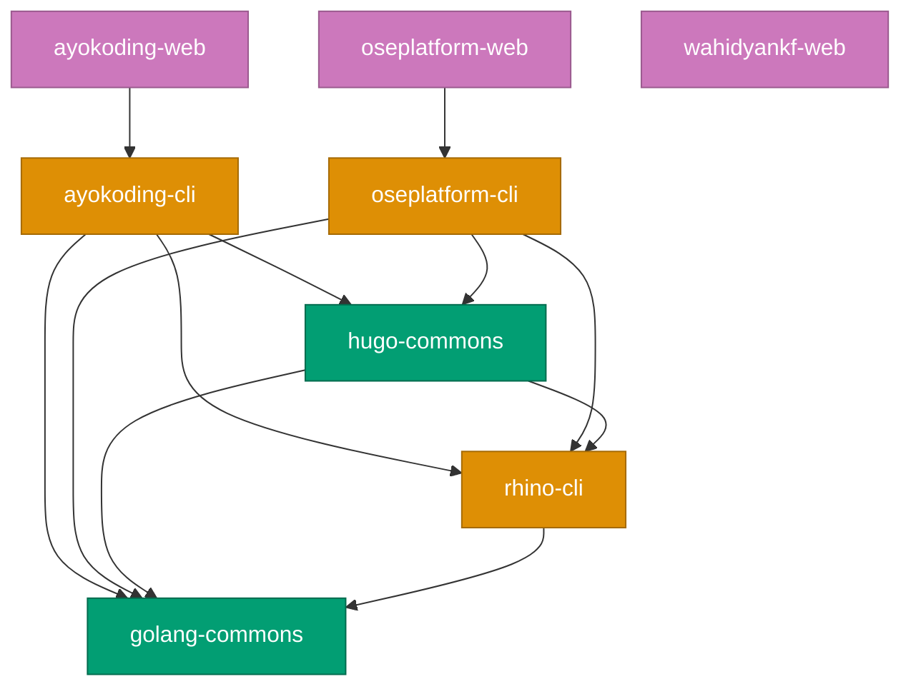
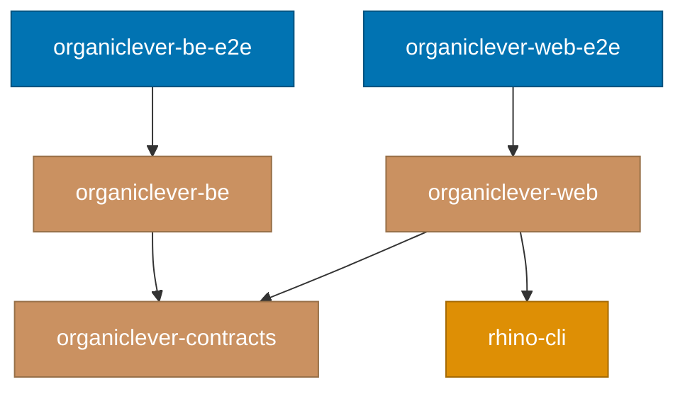

# Project Dependency Graph

Complete reference for how projects depend on each other in the Nx monorepo.
Run `nx graph` to visualize this interactively.

> **Note**: The polyglot demo apps (`a-demo-be-*`, `a-demo-fe-*`, `a-demo-fs-ts-nextjs`) and
> their contract/spec infrastructure were extracted to
> [ose-primer](https://github.com/wahidyankf/ose-primer) on 2026-04-18. That repository is the
> authoritative reference for polyglot showcase dependency patterns.

## Dependency Mechanisms

Nx tracks project relationships through three mechanisms:

### 1. `implicitDependencies` (Project-Level)

Declared in `project.json`. When the dependency project changes, `nx affected`
flags the dependent project for re-testing.

```json
"implicitDependencies": ["rhino-cli"]
```

### 2. `dependsOn` (Task-Level)

Declared per target in `project.json`. Controls execution order — the dependency
task runs before the dependent task.

### 3. `inputs` with `{workspaceRoot}` (File-Level)

Declared per target. When matched files change, the target's cache is
invalidated and `nx affected` flags the project.

```json
"inputs": [
  "default",
  "{workspaceRoot}/specs/apps/organiclever-web/**/*.feature"
]
```

## Visual Dependency Graph

**Go ecosystem and content sites:**



**OrganicLever product stack:**



**Legend**:

- Green: Libraries
- Orange: CLI tools
- Purple: Web sites
- Brown: OrganicLever product apps
- Blue: E2E tests

## Shared Infrastructure Projects

### rhino-cli

**Location**: `apps/rhino-cli/`

Repository management CLI used by most projects for coverage validation
(`test-coverage validate`) and spec coverage (`spec-coverage validate`).

- **Dependents**: CLI tools, libs, content platforms, organiclever-web
- **Mechanism**: `implicitDependencies`
- **Own dependency**: `golang-commons`
- **Note**: `golang-commons` does NOT depend on `rhino-cli` to avoid a circular
  dependency. Changes to `rhino-cli`'s coverage algorithm are caught by the
  main CI running `--all`.

### golang-commons

**Location**: `libs/golang-commons/`

Shared Go utilities (time formatting, test helpers, output capture).

- **Dependents**: `rhino-cli`, `hugo-commons`, `ayokoding-cli`, `oseplatform-cli`
- **Mechanism**: Go module `replace` directives + `implicitDependencies`

## Project Dependency Table

### Content Platforms

| Project         | Dependencies    | Spec Inputs |
| --------------- | --------------- | ----------- |
| ayokoding-web   | ayokoding-cli   | (none)      |
| oseplatform-web | oseplatform-cli | (none)      |
| wahidyankf-web  | (none)          | (none)      |

### OrganicLever

| Project                | Dependencies                      | Spec Inputs                                 |
| ---------------------- | --------------------------------- | ------------------------------------------- |
| organiclever-contracts | (none)                            | (self — project root is spec dir)           |
| organiclever-web       | rhino-cli, organiclever-contracts | organiclever-web/\* (test:integration)      |
| organiclever-be        | organiclever-contracts            | organiclever-be/\* (test:integration)       |
| organiclever-web-e2e   | organiclever-web                  | organiclever-web/\* (typecheck, test:quick) |
| organiclever-be-e2e    | organiclever-be                   | organiclever-be/\* (typecheck, test:quick)  |

### CLI Tools

| Project         | Dependencies                            | Spec Inputs                           |
| --------------- | --------------------------------------- | ------------------------------------- |
| ayokoding-cli   | golang-commons, hugo-commons, rhino-cli | ayokoding-cli/\* (test:integration)   |
| oseplatform-cli | golang-commons, hugo-commons, rhino-cli | oseplatform-cli/\* (test:integration) |
| rhino-cli       | golang-commons                          | rhino-cli/\* (test:integration)       |

### Libraries

| Project        | Dependencies              | Spec Inputs                          |
| -------------- | ------------------------- | ------------------------------------ |
| golang-commons | (none)                    | golang-commons/\* (test:integration) |
| hugo-commons   | golang-commons, rhino-cli | hugo-commons/\* (test:integration)   |

## Spec Directory Mapping

All Gherkin specs and API contracts live under `specs/` and are consumed via
`{workspaceRoot}` inputs.

| Spec Directory                       | Consumed By                            | Targets                                 |
| ------------------------------------ | -------------------------------------- | --------------------------------------- |
| `specs/apps/organiclever/contracts/` | organiclever-web, organiclever-be      | codegen                                 |
| `specs/apps/organiclever-web/`       | organiclever-web, organiclever-web-e2e | test:integration, typecheck, test:quick |
| `specs/apps/rhino/`                  | rhino-cli                              | test:integration                        |
| `specs/apps/ayokoding/`              | ayokoding-cli, ayokoding-web           | test:integration                        |
| `specs/apps/oseplatform/`            | oseplatform-cli, oseplatform-web       | test:integration                        |
| `specs/libs/golang-commons/`         | golang-commons                         | test:integration                        |
| `specs/libs/hugo-commons/`           | hugo-commons                           | test:integration                        |

## Design Decisions

### Why `golang-commons` does not depend on `rhino-cli`

`golang-commons` uses `rhino-cli` in its `test:quick` target for coverage
validation, but declaring this dependency would create a circular dependency:
`golang-commons -> rhino-cli -> golang-commons`. The risk is minimal because
`rhino-cli` coverage algorithm changes are rare and are caught by the main CI
workflow which runs `--all` projects.

## Related Documentation

- [Monorepo Structure Reference](./monorepo-structure.md) - Folder organization and file formats
- [Nx Configuration Reference](./nx-configuration.md) - Workspace configuration options
- [Nx Target Standards](../../governance/development/infra/nx-targets.md) - Canonical target names and caching rules
- [Three-Level Testing Standard](../../governance/development/quality/three-level-testing-standard.md) - Unit, integration, and E2E testing requirements
- [Code Coverage Reference](./code-coverage.md) - Coverage measurement and tools
