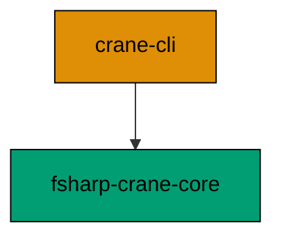
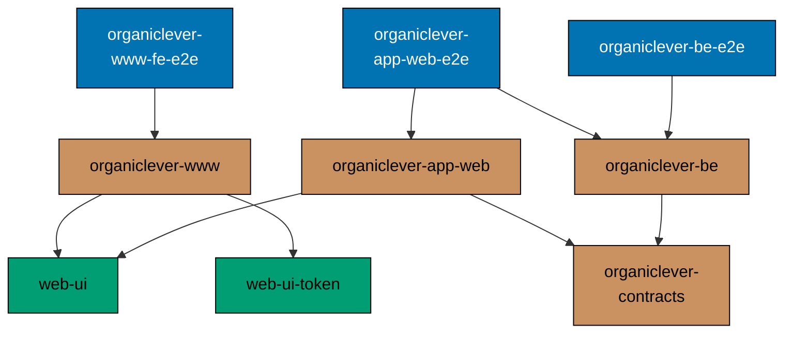
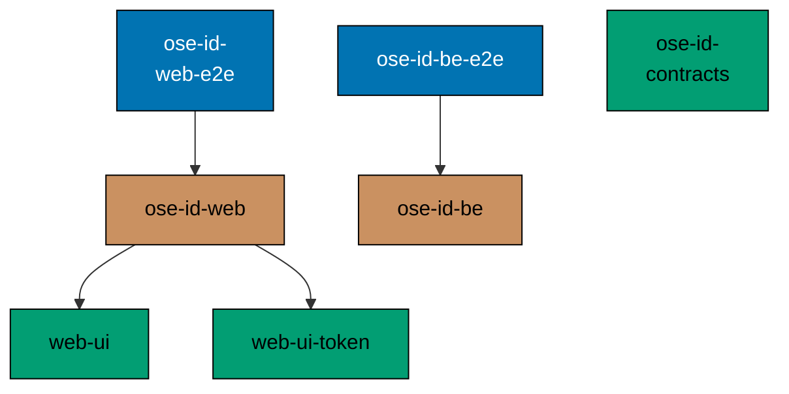

# Project Dependency Graph

Complete reference for how projects depend on each other in the Nx monorepo.
Run `./hippo run --class service --resource-tier standard --disk-path . -- npm exec nx -- graph` to visualize this
interactively.

> **Note**: The polyglot demo apps (`a-demo-be-*`, `a-demo-fe-*`, `a-demo-fs-ts-nextjs`) and
> their contract/spec infrastructure were removed from this repo on 2026-04-18.

## Dependency Mechanisms

Nx tracks project relationships through three mechanisms:

### 1. `implicitDependencies` (Project-Level)

Declared in `project.json`. When the dependency project changes, `nx affected`
flags the dependent project for re-testing.

```json
"implicitDependencies": ["fsharp-crane-core"]
```

### 2. `dependsOn` (Task-Level)

Declared per target in `project.json`. Controls execution order — the dependency
task runs before the dependent task.

### 3. `inputs` with `{workspaceRoot}` (File-Level)

Declared per target. When matched files change, the target's cache is
invalidated and `nx affected` flags the project.

```json
"inputs": [
  "default",
  "{workspaceRoot}/specs/apps/organiclever/**/*.feature"
]
```

## Visual Dependency Graph

**CLI ecosystem:**

Content sites no longer depend on any CLI — `ayokoding-www` and `ose-www` dropped their
`implicitDependencies` when the per-domain link-checkers were retired. RHINO, the repository
validator behind `./rhino`, is a pinned external executable, not an Nx project, so it has no node here.


```mermaid
graph TD
  accTitle: Visual Dependency Graph
  accDescr: crane-cli leads to fsharp-crane-core.
  CC[crane-cli]
  FCC[fsharp-crane-core]

  CC --> FCC

  classDef lib fill:#029E73,stroke:#000000,color:#000000
  classDef cli fill:#DE8F05,stroke:#000000,color:#000000

  class FCC lib
  class CC cli
```

**OrganicLever product stack:**


```mermaid
graph TD
  accTitle: Visual Dependency Graph 2
  accDescr: organiclever-www-fe-e2e leads to organiclever-www; organiclever-app-web-e2e leads to organiclever-app-web and organiclever-be; organiclever-be-e2e leads to organiclever-be; organiclever-www leads to web-ui and web-ui-token; organiclever-app-web leads to organiclever-contracts and web-ui; organiclever-be leads to organiclever-contracts.
  %% E2E tests (top level)
  OLWWWFEE2E[organiclever-<br/>www-fe-e2e]
  OLAPPE2E[organiclever-<br/>app-web-e2e]
  OLBE2E[organiclever-be-e2e]

  %% Apps
  OLWWW[organiclever-www]
  OLAPP[organiclever-app-web]
  OLB[organiclever-be]

  %% Shared
  OLC[organiclever-<br/>contracts]
  WU[web-ui]
  WUT[web-ui-token]

  %% Edges
  OLWWWFEE2E --> OLWWW
  OLAPPE2E --> OLAPP
  OLAPPE2E --> OLB
  OLBE2E --> OLB
  OLWWW --> WU
  OLWWW --> WUT
  OLAPP --> OLC
  OLAPP --> WU
  OLB --> OLC

  classDef lib fill:#029E73,stroke:#000000,color:#000000
  classDef product fill:#CA9161,stroke:#000000,color:#000000
  classDef e2e fill:#0173B2,stroke:#000000,color:#FFFFFF

  class WU,WUT lib
  class OLWWW,OLAPP,OLB,OLC product
  class OLWWWFEE2E,OLAPPE2E,OLBE2E e2e
```

**OSE ID product stack:**


```mermaid
graph TD
  accTitle: Visual Dependency Graph 3
  accDescr: ose-id-web-e2e leads to ose-id-web; ose-id-be-e2e leads to ose-id-be; ose-id-web leads to web-ui; ose-id-web leads to web-ui-token; ose-id-contracts stands alone with no dependent yet.
  %% E2E tests (top level)
  OIWE2E[ose-id-<br/>web-e2e]
  OIBE2E[ose-id-be-e2e]

  %% Apps
  OIW[ose-id-web]
  OIB[ose-id-be]

  %% Shared
  OIC[ose-id-<br/>contracts]
  WU[web-ui]
  WUT[web-ui-token]

  %% Edges
  OIWE2E --> OIW
  OIBE2E --> OIB
  OIW --> WU
  OIW --> WUT

  classDef lib fill:#029E73,stroke:#000000,color:#000000
  classDef product fill:#CA9161,stroke:#000000,color:#000000
  classDef e2e fill:#0173B2,stroke:#000000,color:#FFFFFF

  class OIC,WU,WUT lib
  class OIW,OIB product
  class OIWE2E,OIBE2E e2e
```

`ose-id-contracts` carries no edge on purpose. Unlike `ose-contracts` and `ose-lms-contracts`, the
OSE ID backend does not run an OpenAPI `codegen` target, so nothing declares an
`implicitDependencies` edge to it yet; the project exists so the contract is Nx-linted. A future
plan that turns on codegen adds the `ose-id-be --> ose-id-contracts` edge.

**Legend**:

- Green: Libraries
- Orange: CLI tools
- Purple: Web sites
- Brown: OrganicLever and OSE ID product apps
- Blue: E2E tests

## Shared Infrastructure Projects

## Project Dependency Table

### Content Platforms

| Project       | Dependencies | Spec Inputs |
| ------------- | ------------ | ----------- |
| ayokoding-www | (none)       | (none)      |
| ose-www       | (none)       | (none)      |

### OrganicLever

| Project                  | Dependencies                          | Spec Inputs                                     |
| ------------------------ | ------------------------------------- | ----------------------------------------------- |
| organiclever-contracts   | (none)                                | (self — project root is spec dir)               |
| organiclever-www         | web-ui, web-ui-token                  | organiclever-www/\* (test:integration)          |
| organiclever-app-web     | organiclever-contracts, web-ui        | organiclever-app-web/\* (test:integration)      |
| organiclever-be          | organiclever-contracts                | organiclever-be/\* (test:integration)           |
| organiclever-www-fe-e2e  | organiclever-www                      | organiclever-www/\* (test:e2e)                  |
| organiclever-app-web-e2e | organiclever-app-web, organiclever-be | organiclever-app-web/\* (typecheck, test:quick) |
| organiclever-be-e2e      | organiclever-be                       | organiclever-be/\* (typecheck, test:quick)      |

### OSE ID

| Project          | Dependencies         | Spec Inputs                                             |
| ---------------- | -------------------- | ------------------------------------------------------- |
| ose-id-contracts | (none)               | (self — project root is spec dir)                       |
| ose-id-be        | (none)               | ose/id-be/behaviours/\* (test:coverage:\*, test:quick)  |
| ose-id-web       | web-ui, web-ui-token | ose/id-web/behaviours/\* (test:coverage:\*, test:quick) |
| ose-id-be-e2e    | ose-id-be            | ose/id-be/behaviours/\* (typecheck, lint, test:quick)   |
| ose-id-web-e2e   | ose-id-web           | ose/id-web/behaviours/\* (typecheck, test:quick)        |

### CLI Tools

| Project   | Dependencies      | Spec Inputs                     |
| --------- | ----------------- | ------------------------------- |
| crane-cli | fsharp-crane-core | crane-cli/\* (test:integration) |

### Libraries

| Project           | Dependencies | Spec Inputs                      |
| ----------------- | ------------ | -------------------------------- |
| fsharp-crane-core | (none)       | fsharp-crane-core/\* (test:unit) |

## Spec Directory Mapping

All Gherkin specs and API contracts live under `specs/` and are consumed via
`{workspaceRoot}` inputs.

| Spec Directory                          | Consumed By                                    | Targets                                 |
| --------------------------------------- | ---------------------------------------------- | --------------------------------------- |
| `specs/apps/organiclever/be/contracts/` | organiclever-app-web, organiclever-be          | codegen                                 |
| `specs/apps/organiclever/`              | organiclever-app-web, organiclever-app-web-e2e | test:integration, typecheck, test:quick |
| `specs/apps/ayokoding/`                 | ayokoding-www                                  | test:integration                        |
| `specs/apps/ose/`                       | ose-www                                        | test:integration                        |
| `specs/apps/ose/id-be/behaviours/`      | ose-id-be, ose-id-be-e2e                       | test:coverage:\*, test:quick            |
| `specs/apps/ose/id-web/behaviours/`     | ose-id-web, ose-id-web-e2e                     | test:coverage:\*, test:quick            |

## Related Documentation

- [Monorepo Structure Reference](./monorepo-structure.md) - Folder organization and file formats
- [Nx Configuration Reference](./nx-configuration.md) - Workspace configuration options
- [Nx Target Standards](../../repo-governance/development/infra/nx-targets.md) - Canonical target names and caching rules
- [Behaviour-Driven Development](../../repo-governance/development/behaviour-driven-development.md) - Unit, integration, and E2E testing requirements
- [Code Coverage Reference](./code-coverage.md) - Coverage measurement and tools
