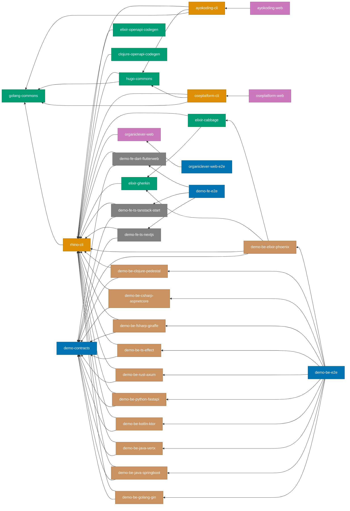

# Project Dependency Graph

Complete reference for how projects depend on each other in the Nx monorepo.
Run `nx graph` to visualize this interactively.

## Dependency Mechanisms

Nx tracks project relationships through three mechanisms:

### 1. `implicitDependencies` (Project-Level)

Declared in `project.json`. When the dependency project changes, `nx affected`
flags the dependent project for re-testing.

```json
"implicitDependencies": ["demo-contracts", "rhino-cli"]
```

### 2. `dependsOn` (Task-Level)

Declared per target in `project.json`. Controls execution order — the dependency
task runs before the dependent task. Cross-project `dependsOn` (e.g.,
`demo-contracts:bundle`) also creates an implicit project edge.

```json
"codegen": {
  "dependsOn": ["demo-contracts:bundle"]
}
```

### 3. `inputs` with `{workspaceRoot}` (File-Level)

Declared per target. When matched files change, the target's cache is
invalidated and `nx affected` flags the project.

```json
"inputs": [
  "default",
  "{workspaceRoot}/specs/apps/demo/be/gherkin/**/*.feature"
]
```

## Visual Dependency Graph

%% Color palette: Blue #0173B2, Orange #DE8F05, Teal #029E73, Purple #CC78BC, Brown #CA9161, Gray #808080
%% All colors are color-blind friendly and meet WCAG AA contrast standards



**Legend**:

- Blue: Specs / E2E tests
- Green: Libraries
- Orange: CLI tools
- Purple: Web sites
- Brown: Demo backends
- Gray: Demo frontends

## Shared Infrastructure Projects

These projects are dependencies of many other projects.

### demo-contracts

**Location**: `specs/apps/demo/contracts/`

The OpenAPI 3.1 specification consumed by all demo apps for type generation.

- **Dependents**: All 11 `demo-be-*` backends + all 3 `demo-fe-*` frontends (14 total)
- **Mechanism**: `implicitDependencies` + `codegen.dependsOn: ["demo-contracts:bundle"]`
- **Spec input**: `{workspaceRoot}/specs/apps/demo/contracts/generated/openapi-bundled.yaml`

### rhino-cli

**Location**: `apps/rhino-cli/`

Repository management CLI used by most projects for coverage validation
(`test-coverage validate`), spec coverage (`spec-coverage validate`),
contract post-processing (`contracts java-clean-imports`, `contracts dart-scaffold`),
and annotation validation (`java validate-annotations`).

- **Dependents**: 22 projects (all demo apps, CLI tools, libs, organiclever-web)
- **Mechanism**: `implicitDependencies`
- **Own dependency**: `golang-commons`
- **Note**: `golang-commons` does NOT depend on `rhino-cli` to avoid a circular
  dependency. Changes to `rhino-cli`'s coverage algorithm are caught by the
  main CI running `--all`.

### golang-commons

**Location**: `libs/golang-commons/`

Shared Go utilities (time formatting, test helpers, output capture).

- **Dependents**: `rhino-cli`, `hugo-commons`, `ayokoding-cli`, `oseplatform-cli`
- **Mechanism**: Go module `replace` directives + `implicitDependencies`

## Project Dependency Table

### Demo Backends

All demo backends share the same dependency pattern.

| Project                   | Dependencies                                              | Spec Inputs                 |
| ------------------------- | --------------------------------------------------------- | --------------------------- |
| demo-be-clojure-pedestal  | demo-contracts, rhino-cli                                 | contracts/\*, be/gherkin/\* |
| demo-be-csharp-aspnetcore | demo-contracts, rhino-cli                                 | contracts/\*, be/gherkin/\* |
| demo-be-elixir-phoenix    | demo-contracts, elixir-cabbage, elixir-gherkin, rhino-cli | contracts/\*, be/gherkin/\* |
| demo-be-fsharp-giraffe    | demo-contracts, rhino-cli                                 | contracts/\*, be/gherkin/\* |
| demo-be-golang-gin        | demo-contracts, rhino-cli                                 | contracts/\*, be/gherkin/\* |
| demo-be-java-springboot   | demo-contracts, rhino-cli                                 | contracts/\*, be/gherkin/\* |
| demo-be-java-vertx        | demo-contracts, rhino-cli                                 | contracts/\*, be/gherkin/\* |
| demo-be-kotlin-ktor       | demo-contracts, rhino-cli                                 | contracts/\*, be/gherkin/\* |
| demo-be-python-fastapi    | demo-contracts, rhino-cli                                 | contracts/\*, be/gherkin/\* |
| demo-be-rust-axum         | demo-contracts, rhino-cli                                 | contracts/\*, be/gherkin/\* |
| demo-be-ts-effect         | demo-contracts, rhino-cli                                 | contracts/\*, be/gherkin/\* |

**Spec input paths**:

- `contracts/*` = `{workspaceRoot}/specs/apps/demo/contracts/generated/openapi-bundled.yaml` (codegen)
- `be/gherkin/*` = `{workspaceRoot}/specs/apps/demo/be/gherkin/**/*.feature` (test:unit, test:quick)

### Demo Frontends

| Project                   | Dependencies              | Spec Inputs                 |
| ------------------------- | ------------------------- | --------------------------- |
| demo-fe-dart-flutterweb   | demo-contracts, rhino-cli | contracts/\*, fe/gherkin/\* |
| demo-fe-ts-nextjs         | demo-contracts, rhino-cli | contracts/\*, fe/gherkin/\* |
| demo-fe-ts-tanstack-start | demo-contracts, rhino-cli | contracts/\*, fe/gherkin/\* |

**Spec input paths**:

- `contracts/*` = `{workspaceRoot}/specs/apps/demo/contracts/generated/openapi-bundled.yaml` (codegen)
- `fe/gherkin/*` = `{workspaceRoot}/specs/apps/demo/fe/gherkin/**/*.feature` (test:unit, test:quick)

### E2E Test Projects

| Project              | Dependencies               | Spec Inputs                                 |
| -------------------- | -------------------------- | ------------------------------------------- |
| demo-be-e2e          | all 11 demo-be-\* backends | be/gherkin/\* (typecheck, test:quick)       |
| demo-fe-e2e          | all 3 demo-fe-\* frontends | fe/gherkin/\* (typecheck, test:quick)       |
| organiclever-web-e2e | organiclever-web           | organiclever-web/\* (typecheck, test:quick) |

E2E projects use `bddgen` to generate TypeScript from `.feature` files in
`test:quick` and `typecheck`. Gherkin spec inputs ensure cache invalidation
when feature files change.

### Hugo Sites

| Project         | Dependencies    | Spec Inputs |
| --------------- | --------------- | ----------- |
| ayokoding-web   | ayokoding-cli   | (none)      |
| oseplatform-web | oseplatform-cli | (none)      |

Hugo sites depend on their CLI tools for content automation (link checking,
title generation, navigation updates). The CLI tools are built via
`dependsOn` in `links:check` and `test:quick` targets.

### CLI Tools

| Project         | Dependencies                            | Spec Inputs                           |
| --------------- | --------------------------------------- | ------------------------------------- |
| ayokoding-cli   | golang-commons, hugo-commons, rhino-cli | ayokoding-cli/\* (test:integration)   |
| oseplatform-cli | golang-commons, hugo-commons, rhino-cli | oseplatform-cli/\* (test:integration) |
| rhino-cli       | golang-commons                          | rhino-cli/\* (test:integration)       |

### OrganicLever

| Project          | Dependencies | Spec Inputs                            |
| ---------------- | ------------ | -------------------------------------- |
| organiclever-web | rhino-cli    | organiclever-web/\* (test:integration) |

### Libraries

| Project                 | Dependencies              | Spec Inputs                          |
| ----------------------- | ------------------------- | ------------------------------------ |
| golang-commons          | (none)                    | golang-commons/\* (test:integration) |
| hugo-commons            | golang-commons, rhino-cli | hugo-commons/\* (test:integration)   |
| elixir-gherkin          | rhino-cli                 | (none)                               |
| elixir-cabbage          | elixir-gherkin, rhino-cli | (none)                               |
| elixir-openapi-codegen  | rhino-cli                 | (none)                               |
| clojure-openapi-codegen | rhino-cli                 | (none)                               |

### Specs

| Project        | Dependencies | Spec Inputs                                 |
| -------------- | ------------ | ------------------------------------------- |
| demo-contracts | (none)       | (self — project root is the spec directory) |

## Spec Directory Mapping

All Gherkin specs and API contracts live under `specs/` and are consumed via
`{workspaceRoot}` inputs.

| Spec Directory                 | Consumed By                            | Targets                                 |
| ------------------------------ | -------------------------------------- | --------------------------------------- |
| `specs/apps/demo/contracts/`   | all 14 demo apps                       | codegen                                 |
| `specs/apps/demo/be/gherkin/`  | 11 demo backends + demo-be-e2e         | test:unit, test:quick, typecheck        |
| `specs/apps/demo/fe/gherkin/`  | 3 demo frontends + demo-fe-e2e         | test:unit, test:quick, typecheck        |
| `specs/apps/organiclever-web/` | organiclever-web, organiclever-web-e2e | test:integration, typecheck, test:quick |
| `specs/apps/rhino-cli/`        | rhino-cli                              | test:integration                        |
| `specs/apps/ayokoding-cli/`    | ayokoding-cli                          | test:integration                        |
| `specs/apps/oseplatform-cli/`  | oseplatform-cli                        | test:integration                        |
| `specs/libs/golang-commons/`   | golang-commons                         | test:integration                        |
| `specs/libs/hugo-commons/`     | hugo-commons                           | test:integration                        |

## Design Decisions

### Why `golang-commons` does not depend on `rhino-cli`

`golang-commons` uses `rhino-cli` in its `test:quick` target for coverage
validation, but declaring this dependency would create a circular dependency:
`golang-commons -> rhino-cli -> golang-commons`. The risk is minimal because
`rhino-cli` coverage algorithm changes are rare and are caught by the main CI
workflow which runs `--all` projects.

### Why contracts use `implicitDependencies` instead of just `dependsOn`

Task-level `dependsOn: ["demo-contracts:bundle"]` controls execution order
(codegen runs after bundle), but does NOT make the project appear in
`nx affected` when the OpenAPI spec changes. Adding `demo-contracts` to
`implicitDependencies` ensures that spec changes trigger re-testing of all
consuming apps.

### Why E2E projects need spec inputs

E2E projects (`demo-be-e2e`, `demo-fe-e2e`, `organiclever-web-e2e`) use
`bddgen` to generate TypeScript from `.feature` files in their `test:quick`
and `typecheck` targets. Without spec inputs, feature file changes would not
invalidate the cache, causing stale generated code.

## Related Documentation

- [Monorepo Structure Reference](./re__monorepo-structure.md) - Folder organization and file formats
- [Nx Configuration Reference](./re__nx-configuration.md) - Workspace configuration options
- [Nx Target Standards](../../governance/development/infra/nx-targets.md) - Canonical target names and caching rules
- [Three-Level Testing Standard](../../governance/development/quality/three-level-testing-standard.md) - Unit, integration, and E2E testing requirements
