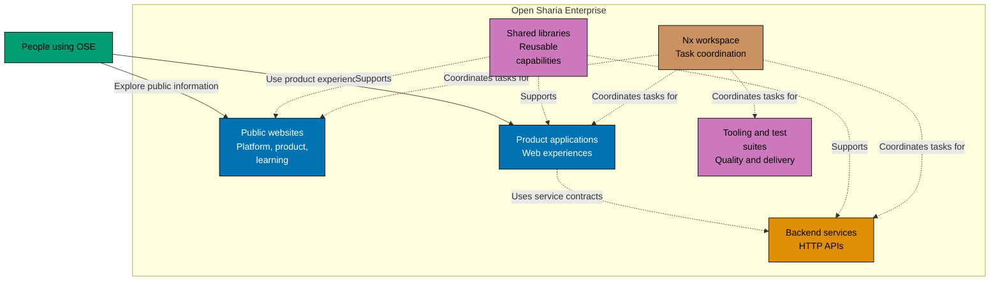

# System Architecture

This is the starting point for understanding how Open Sharia Enterprise (OSE) is organised. It is
written for product people who need a map of the platform and early engineers who need to find the
right technical boundary before reading implementation code.

OSE is an Nx monorepo containing independently deployable applications, shared libraries, and the
tooling that builds and checks them. The platform is pre-alpha, so this reference describes the
current shape of the system rather than a fixed long-term design.

## Platform at a glance

The diagram is a repository-level map, not a runtime request-flow diagram. It shows the main kinds
of software that live together and the role Nx plays in coordinating their work.

The key architectural boundaries are:

- **Applications** are deployable units in `apps/`. They can depend on shared libraries but do not
  import one another.
- **Libraries** are reusable capabilities in `libs/`, shared across applications where that makes
  sense.
- **Tooling and tests** are projects in the same workspace, so quality checks and affected-project
  builds can be coordinated with the applications they support.
- **Delivery** is handled per application; the deployment reference explains the environments and
  deployment paths that exist today.

For the complete directory and project conventions, see the
[Monorepo Structure Reference](../monorepo-structure.md).

## Read the architecture at the right level

OSE uses the C4 model to describe the system from broad context to implementation detail. Start at
the level that answers your question; you do not need to read every document in order.

| If you need to understand...                          | Start here                                                                                                            | What it covers                                                          |
| ----------------------------------------------------- | --------------------------------------------------------------------------------------------------------------------- | ----------------------------------------------------------------------- |
| Which software surfaces exist and what each is for    | [Applications & Containers](./applications.md) — Application inventory, C4 Level 2 containers, and their interactions | Application inventory, C4 Level 2 containers, and their interactions    |
| How a particular application is structured internally | [Components & Code](./components.md) — C4 Level 3 components and selected Level 4 code structure                      | C4 Level 3 components and selected Level 4 code structure               |
| How applications reach their environments             | [Deployment](./deployment.md) — Deployment architecture, environment branches, and Vercel configuration               | Deployment architecture, environment branches, and Vercel configuration |
| How changes are checked before delivery               | [CI/CD Pipeline](./ci-cd.md) — Local hooks, GitHub Actions, Nx orchestration, and quality gates                       | Local hooks, GitHub Actions, Nx orchestration, and quality gates        |
| Which technologies are in use                         | [Technology Stack](./technology-stack.md) — Languages, frameworks, quality tools, and architecture considerations     | Languages, frameworks, quality tools, and architecture considerations   |

## Suggested reading paths

### Product discovery

1. Read Applications & Containers to identify the current product, public,
   and supporting software surfaces.
2. Read Deployment to see how those surfaces are delivered.
3. Use Components & Code when you need more detail about a particular
   implementation boundary.

### Early engineering orientation

1. Read the [Monorepo Structure Reference](../monorepo-structure.md) for project and dependency
   rules.
2. Read Applications & Containers to choose the application or library you
   need to inspect.
3. Read Components & Code and the relevant application README before changing
   code.
4. Read CI/CD Pipeline to understand the checks that protect the system.

## Scope of this reference

This section explains the public OSE repository and its current technical architecture. Product
plans, research material, and detailed acceptance specifications live elsewhere in the repository;
the linked documents above provide the architectural route into those details.
