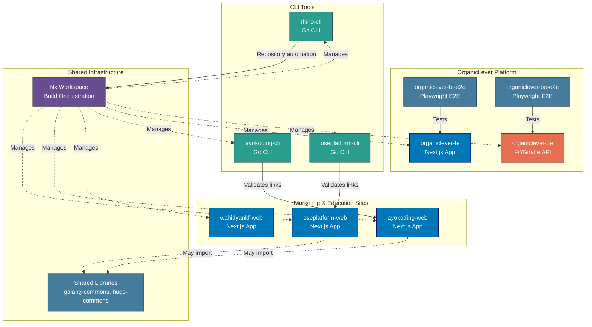

# Applications & Containers

Application inventory and C4 Level 2 container diagram for the Open Sharia Enterprise platform.

## Applications Inventory

The platform consists of the following applications across its technology stacks:

### Web Applications (Next.js)

#### oseplatform-web

- **Purpose**: Marketing and documentation website for OSE Platform
- **URL**: <https://oseplatform.com>
- **Technology**: Next.js 16 (App Router) + TypeScript + tRPC
- **Deployment**: Vercel (via `prod-oseplatform-web` branch)
- **Build Command**: `nx build oseplatform-web`
- **Dev Command**: `nx dev oseplatform-web`
- **Location**: `apps/oseplatform-web/`

#### ayokoding-web

- **Purpose**: Educational platform for programming, AI, and security
- **URL**: <https://ayokoding.com>
- **Technology**: Next.js 16 (App Router) + TypeScript + tRPC
- **Languages**: Bilingual (default English)
- **Deployment**: Vercel (via `prod-ayokoding-web` branch)
- **Build Command**: `nx build ayokoding-web`
- **Dev Command**: `nx dev ayokoding-web`
- **Location**: `apps/ayokoding-web/`
- **Content**: Co-located at `apps/ayokoding-web/content/`

#### wahidyankf-web

- **Purpose**: Personal portfolio site for Wahidyan Kresna Fridayoka
- **URL**: <https://www.wahidyankf.com>
- **Technology**: Next.js 16 (App Router) + TypeScript
- **Deployment**: Vercel (via `prod-wahidyankf-web` branch)
- **Build Command**: `nx build wahidyankf-web`
- **Dev Command**: `nx dev wahidyankf-web`
- **Dev Port**: 3201
- **Location**: `apps/wahidyankf-web/`

### CLI Tools (Go)

#### ayokoding-cli

- **Purpose**: Link validation for ayokoding-web content
- **Language**: Go 1.26
- **Build Command**: `nx build ayokoding-cli`
- **Location**: `apps/ayokoding-cli/`
- **Features**:
  - Link validation for ayokoding-web content
- **Usage**: Runs as part of ayokoding-web quality checks

#### rhino-cli

- **Purpose**: Repository management and automation
- **Language**: Go 1.26
- **Build Command**: `nx build rhino-cli`
- **Location**: `apps/rhino-cli/`
- **Status**: Active development

#### oseplatform-cli

- **Purpose**: OSE Platform site link validation
- **Language**: Go 1.26
- **Build Command**: `nx build oseplatform-cli`
- **Location**: `apps/oseplatform-cli/`
- **Features**:
  - Validates all internal links in oseplatform-web content
  - Text, JSON, and markdown output formats
- **Usage**: Runs as first step of `oseplatform-web`'s `test:quick` target

### OrganicLever Applications

#### organiclever-fe

- **Purpose**: Landing site for OrganicLever — local-first mode; BE integration deferred
- **URL**: <https://www.organiclever.com>
- **Technology**: Next.js 16 (App Router) + React 19 + TailwindCSS
- **Deployment**: Vercel (via `prod-organiclever-web` branch)
- **Build Command**: `nx build organiclever-fe`
- **Dev Command**: `nx dev organiclever-fe`
- **Location**: `apps/organiclever-fe/`
- **Features**:
  - Static landing page at `/` (no network dependency)
  - `/system/status/be` diagnostic page (probes `ORGANICLEVER_BE_URL` at request time)
  - Dormant Effect TS service layer preserved for future BE rewire
  - Radix UI / shadcn-ui component library
  - Production Dockerfile with standalone output

### Backend Services

#### organiclever-be

- **Purpose**: REST API backend for OrganicLever (F#/Giraffe implementation)
- **Technology**: F# + Giraffe + .NET
- **Build Command**: `nx build organiclever-be`
- **Dev Command**: `nx dev organiclever-be`
- **Location**: `apps/organiclever-be/`
- **Features**:
  - AltCover code coverage enforcement (>=90%)
  - Production Dockerfile with multi-stage build
  - OpenAPI 3.1 contract-first development

### E2E Test Suites (Playwright)

#### oseplatform-web-fe-e2e

- **Purpose**: Frontend E2E tests for oseplatform-web UI
- **Technology**: Playwright
- **Run Command**: `nx run oseplatform-web-fe-e2e:test:e2e`
- **Location**: `apps/oseplatform-web-fe-e2e/`

#### oseplatform-web-be-e2e

- **Purpose**: Backend E2E tests for oseplatform-web tRPC API
- **Technology**: Playwright
- **Run Command**: `nx run oseplatform-web-be-e2e:test:e2e`
- **Location**: `apps/oseplatform-web-be-e2e/`

#### ayokoding-web-fe-e2e

- **Purpose**: Frontend E2E tests for ayokoding-web UI
- **Technology**: Playwright
- **Run Command**: `nx run ayokoding-web-fe-e2e:test:e2e`
- **Location**: `apps/ayokoding-web-fe-e2e/`

#### ayokoding-web-be-e2e

- **Purpose**: Backend E2E tests for ayokoding-web tRPC API
- **Technology**: Playwright
- **Run Command**: `nx run ayokoding-web-be-e2e:test:e2e`
- **Location**: `apps/ayokoding-web-be-e2e/`

#### wahidyankf-web-fe-e2e

- **Purpose**: Frontend E2E tests for wahidyankf-web UI (Playwright-BDD)
- **Technology**: Playwright-BDD
- **Run Command**: `nx run wahidyankf-web-fe-e2e:test:e2e`
- **Location**: `apps/wahidyankf-web-fe-e2e/`

#### organiclever-fe-e2e

- **Purpose**: End-to-end tests for organiclever-fe
- **Technology**: Playwright
- **Run Command**: `nx run organiclever-fe-e2e:test:e2e`
- **Location**: `apps/organiclever-fe-e2e/`

#### organiclever-be-e2e

- **Purpose**: End-to-end tests for organiclever-be REST API
- **Technology**: Playwright
- **Run Command**: `nx run organiclever-be-e2e:test:e2e`
- **Location**: `apps/organiclever-be-e2e/`

## C4 Level 2: Container Diagram

Shows the high-level technical building blocks (containers) of the system. In C4 terminology, a "container" is a deployable/executable unit (web app, database, file system, etc.), not a Docker container.

## Application Interactions

**Independent Application Suites:**

Marketing & Education Sites:

- oseplatform-web: Next.js 16 content platform
- ayokoding-web: Next.js fullstack content platform (with CLI link validation)
- wahidyankf-web: Next.js 16 personal portfolio

CLI Tools:

- ayokoding-cli: Validates links in ayokoding-web content
- rhino-cli: Repository management automation

**Build-Time Dependencies:**

- All applications managed by Nx workspace
- CLI tools executed during build processes
- Shared libraries may be imported at build time via `@open-sharia-enterprise/[lib-name]`

**Link Validation Pipeline (ayokoding-web):**

ayokoding-cli validates internal links in ayokoding-web content as part of the quality gate.
Content is co-located at `apps/ayokoding-web/content/` and served by the Next.js application.
