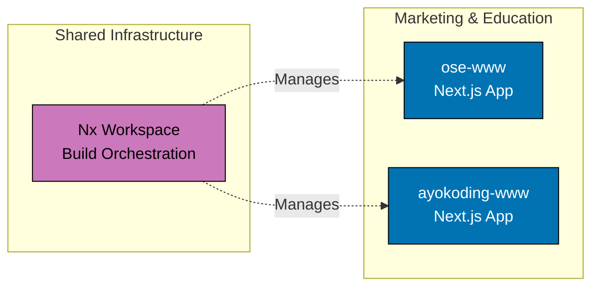
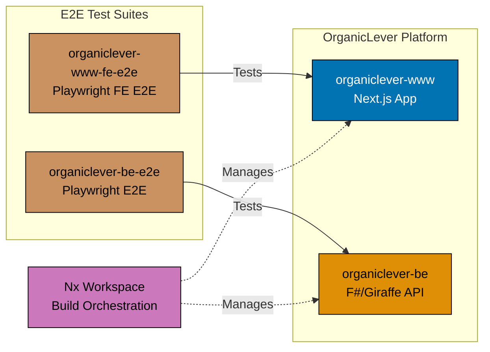

# Applications & Containers

Application inventory and C4 Level 2 container diagram for the Open Sharia Enterprise platform.

## Applications Inventory

The platform consists of the following applications across its technology stacks:

### Web Applications (Next.js)

#### ose-www

- **Purpose**: Public marketing website for OSE Platform
- **URL**: <https://oseplatform.com>
- **Technology**: Next.js 16 (App Router) + TypeScript + tRPC
- **Deployment**: Vercel (via `prod-ose-www` branch)
- **Build Command**: `./hippo run --class transactional --resource-tier standard --disk-path . -- npm exec nx -- build ose-www`
- **Dev Command**: `./hippo run --class service --resource-tier standard --disk-path . -- npm exec nx -- dev ose-www`
- **Dev Port**: 3100
- **Location**: `apps/ose-www/`

#### ayokoding-www

- **Purpose**: Educational platform for programming, AI, and security
- **URL**: <https://ayokoding.com>
- **Technology**: Next.js 16 (App Router) + TypeScript + tRPC
- **Languages**: Bilingual (default English)
- **Deployment**: Vercel (via `prod-ayokoding-www` branch)
- **Build Command**: `./hippo run --class transactional --resource-tier standard --disk-path . -- npm exec nx -- build ayokoding-www`
- **Dev Preflight**: `./hippo run --class transactional --resource-tier standard --disk-path . -- npm exec nx -- run ayokoding-www:generate-indexes`
- **Dev Command**: `./hippo run --class service --resource-tier standard --disk-path . --cwd apps/ayokoding-www -- node ../../scripts/next-with-port.mjs dev --env AYOKODING_WWW_PORT --default 3101`
- **Dev Port**: 3101
- **Location**: `apps/ayokoding-www/`
- **Content**: Co-located at `apps/ayokoding-www/content/`

#### organiclever-www

- **Purpose**: Marketing website for the OrganicLever productivity platform
- **URL**: <https://www.organiclever.com>
- **Technology**: Next.js 16 (App Router) + TypeScript
- **Deployment**: Vercel (via `prod-organiclever-www` branch)
- **Build Command**: `./hippo run --class transactional --resource-tier standard --disk-path . -- npm exec nx -- build organiclever-www`
- **Dev Command**: `./hippo run --class service --resource-tier standard --disk-path . -- npm exec nx -- dev organiclever-www`
- **Dev Port**: 3200
- **Location**: `apps/organiclever-www/`

### OrganicLever Applications

#### organiclever-www

- **Purpose**: Landing site for OrganicLever — local-first mode; BE integration deferred
- **URL**: <https://www.organiclever.com>
- **Technology**: Next.js 16 (App Router) + React 19 + TailwindCSS
- **Deployment**: Vercel — staging via `stag-organiclever-app-web` branch (CI-automated by
  `organiclever-app-test-local-deploy-stag.yml`, which deploys by force-pushing the stag
  branch). Production continuous delivery is **deferred** to a separate plan — no
  production-CD workflow exists yet; the gated `organiclever-app-test-stag.yml`
  runs the FE E2E gate against staging and stops on pass without promoting.
- **Build Command**: `./hippo run --class transactional --resource-tier standard --disk-path . -- npm exec nx -- build organiclever-www`
- **Dev Command**: `./hippo run --class service --resource-tier standard --disk-path . -- npm exec nx -- dev organiclever-www`
- **Location**: `apps/organiclever-www/`
- **Features**:
  - Static landing page at `/` (no network dependency)
  - `/system/status/be` diagnostic page (probes `ORGANICLEVER_BE_URL` at request time)
  - Dormant Effect TS service layer preserved for future BE rewire
  - Radix UI / shadcn-ui component library
  - Production Dockerfile with standalone output

### Backend Services

#### organiclever-be

- **Purpose**: REST API backend for OrganicLever (F#/Giraffe/ASP.NET 10 implementation)
- **Technology**: F# + Giraffe + ASP.NET 10 + EF Core + DbUp
- **Build Command**: `./hippo run --class transactional --resource-tier standard --disk-path . -- npm exec nx -- build organiclever-be`
- **Dev Command**: `./hippo run --class service --resource-tier standard --disk-path . -- npm exec nx -- dev organiclever-be`
- **Location**: `apps/organiclever-be/`
- **Features**:
  - Coverlet Unit line coverage enforcement (>=99%)
  - Production Dockerfile with multi-stage build
  - OpenAPI 3.1 contract-first development

#### ose-be

- **Purpose**: REST API backend for OSE Application platform (api.oseplatform.com)
- **Technology**: F# + Giraffe + ASP.NET 10 + EF Core + DbUp
- **Build Command**: `./hippo run --class transactional --resource-tier standard --disk-path . -- npm exec nx -- build ose-be`
- **Dev Command**: `./hippo run --class service --resource-tier standard --disk-path . -- npm exec nx -- dev ose-be`
- **Location**: `apps/ose-be/`
- **Features**:
  - Coverlet Unit line coverage enforcement (>=99%)
  - Hexagonal DDD architecture with 5 bounded contexts
  - OpenAPI 3.1 contract-first development (planned)

### E2E Test Suites (Playwright)

#### ose-www-fe-e2e

- **Purpose**: Frontend E2E tests for ose-www UI
- **Technology**: Playwright
- **Run Command**: `./hippo run --class ephemeral --resource-tier standard --disk-path . -- npm exec nx -- run ose-www-fe-e2e:test:e2e`
- **Location**: `apps/ose-www-fe-e2e/`

#### ose-www-be-e2e

- **Purpose**: Backend E2E tests for ose-www tRPC API
- **Technology**: Playwright
- **Run Command**: `./hippo run --class ephemeral --resource-tier standard --disk-path . -- npm exec nx -- run ose-www-be-e2e:test:e2e`
- **Location**: `apps/ose-www-be-e2e/`

#### ayokoding-www-fe-e2e

- **Purpose**: Frontend E2E tests for ayokoding-www UI
- **Technology**: Playwright
- **Run Command**: `./hippo run --class ephemeral --resource-tier standard --disk-path . -- npm exec nx -- run ayokoding-www-fe-e2e:test:e2e`
- **Location**: `apps/ayokoding-www-fe-e2e/`

#### ayokoding-www-be-e2e

- **Purpose**: Backend E2E tests for ayokoding-www tRPC API
- **Technology**: Playwright
- **Run Command**: `./hippo run --class ephemeral --resource-tier standard --disk-path . -- npm exec nx -- run ayokoding-www-be-e2e:test:e2e`
- **Location**: `apps/ayokoding-www-be-e2e/`

#### organiclever-www-fe-e2e

- **Purpose**: Frontend E2E tests for organiclever-www UI
- **Technology**: Playwright
- **Run Command**: `./hippo run --class ephemeral --resource-tier standard --disk-path . -- npm exec nx -- run organiclever-www-fe-e2e:test:e2e`
- **Location**: `apps/organiclever-www-fe-e2e/`

#### organiclever-be-e2e

- **Purpose**: End-to-end tests for organiclever-be REST API
- **Technology**: Playwright
- **Run Command**: `./hippo run --class ephemeral --resource-tier standard --disk-path . -- npm exec nx -- run organiclever-be-e2e:test:e2e`
- **Location**: `apps/organiclever-be-e2e/`

## C4 Level 2: Container Diagram

Shows the high-level technical building blocks (containers) of the system. In C4 terminology, a "container" is a deployable/executable unit (web app, database, file system, etc.), not a Docker container.

**Content sites and Nx orchestration:**

Internal-link validation is repository-wide and runs through `./rhino`, the wrapper for the
pinned external RHINO executable, so no content site depends on a per-domain CLI. RHINO is
repository tooling, not a container of the system or an Nx project: `rhino.lock` pins its release
and per-platform digests.

```mermaid
graph LR
    accTitle: C4 Level 2: Container Diagram
    accDescr: The Nx Workspace build orchestration manages the ose-www and ayokoding-www Next.js apps.
    subgraph "Marketing & Education"
        OSE[ose-www<br/>Next.js App]
        AYO[ayokoding-www<br/>Next.js App]
    end

    subgraph "Shared Infrastructure"
        NX[Nx Workspace<br/>Build Orchestration]
    end

    NX -.->|Manages| OSE
    NX -.->|Manages| AYO

    classDef blue fill:#0173B2,stroke:#000000,color:#FFFFFF
    classDef purple fill:#CC78BC,stroke:#000000,color:#000000
    class OSE,AYO blue
    class NX purple
    classDef default fill:#FFFFFF,stroke:#000000,color:#000000
```

**OrganicLever platform applications:**

```mermaid
graph LR
    accTitle: C4 Level 2: Container Diagram 2
    accDescr: organiclever-www-fe-e2e Playwright FE E2E leads to organiclever-www Next.js App via Tests; organiclever-be-e2e Playwright E2E leads to organiclever-be F/Giraffe API via Tests; Nx Workspace Build Orchestration leads to organiclever-www Next.js App via Manages; and 1 more links.
    subgraph "OrganicLever Platform"
        OL_FE[organiclever-www<br/>Next.js App]
        OL_BE[organiclever-be<br/>F#/Giraffe API]
    end

    subgraph "E2E Test Suites"
        OL_WWW_FE_E2E[organiclever-<br/>www-fe-e2e<br/>Playwright FE E2E]
        OL_BE_E2E[organiclever-be-e2e<br/>Playwright E2E]
    end

    NX[Nx Workspace<br/>Build Orchestration]

    OL_WWW_FE_E2E -->|Tests| OL_FE
    OL_BE_E2E -->|Tests| OL_BE
    NX -.->|Manages| OL_FE
    NX -.->|Manages| OL_BE

    classDef blue fill:#0173B2,stroke:#000000,color:#FFFFFF
    classDef orange fill:#DE8F05,stroke:#000000,color:#000000
    classDef brown fill:#CA9161,stroke:#000000,color:#000000
    classDef purple fill:#CC78BC,stroke:#000000,color:#000000
    class OL_FE blue
    class OL_BE orange
    class OL_WWW_FE_E2E,OL_BE_E2E brown
    class NX purple
    classDef default fill:#FFFFFF,stroke:#000000,color:#000000
```

## Application Interactions

**Independent Application Suites:**

Marketing & Education Sites:

- ose-www: Next.js 16 content platform
- ayokoding-www: Next.js fullstack content platform

Repository Tooling:

- RHINO: Pinned external executable, run through `./rhino`, for repository automation, including
  repository-wide link validation

**Build-Time Dependencies:**

- All applications managed by Nx workspace
- Repository tooling executed during validation gates
- Shared libraries may be imported at build time via `@open-sharia-enterprise/[lib-name]`

**Link Validation Pipeline:**

`./rhino md internal-link validate` checks internal Markdown links across the whole repository.
`repo-config.yml` excludes the `ose-www` and `ayokoding-www` content trees from its sources; that
content is co-located at `apps/<site>/content/` and served by the Next.js application.
