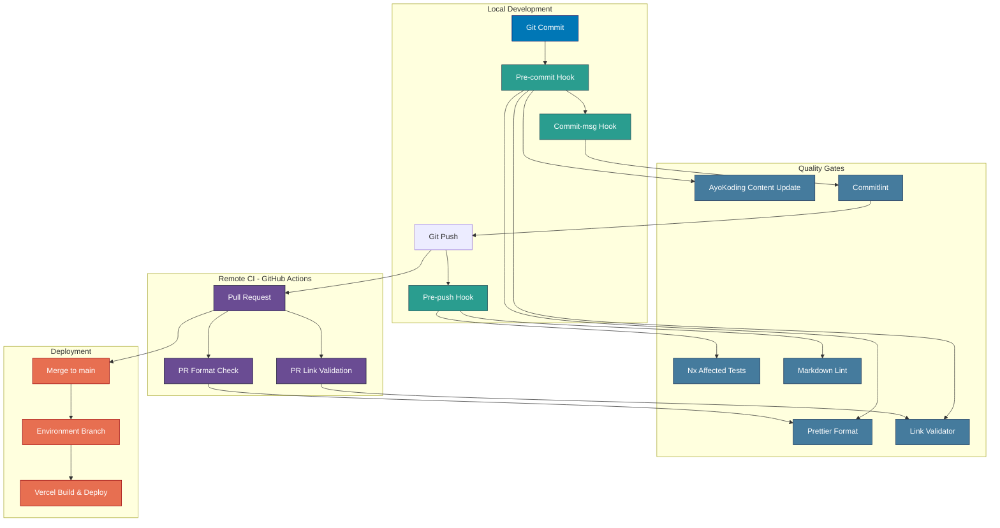
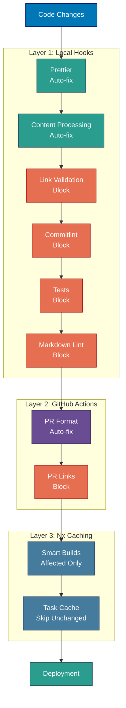

# CI/CD Pipeline

Git hooks, GitHub Actions workflows, Nx build system, and development workflow for the Open Sharia Enterprise platform.

## CI/CD Pipeline Overview

The platform uses a multi-layered quality assurance strategy combining local git hooks, GitHub Actions workflows (CI), and Nx caching. All continuous integration is handled through GitHub Actions.



## Git Hooks (Local Quality Gates)

### Pre-commit Hook

**Location**: `.husky/pre-commit`

**Execution Order:**

1. **AyoKoding Content Processing** (if affected):
   - Validate links in ayokoding-web content
2. **Prettier Formatting** (via lint-staged):
   - Format all staged files
   - Auto-stage formatted changes
3. **Link Validation**:
   - Validate markdown links in staged files only
   - Exit with error if validation fails

**Impact**: Ensures all committed code is formatted and content is processed

### Commit-msg Hook

**Location**: `.husky/commit-msg`

**Validation**: Conventional Commits format via Commitlint

**Format**: `<type>(<scope>): <description>`

**Valid Types**: feat, fix, docs, style, refactor, perf, test, chore, ci, revert

**Impact**: Ensures consistent commit message format

### Pre-push Hook

**Location**: `.husky/pre-push`

**Execution Order:**

1. **Nx Affected Tests**:
   - Run `test:quick` target for all affected projects
   - Only tests projects changed since last push
2. **Markdown Linting**:
   - Run markdownlint-cli2 on all markdown files
   - Exit with error if linting fails

**Impact**: Prevents pushing code that fails tests or has markdown violations

## GitHub Actions Workflows

### PR Quality Gate Workflow

**File**: `.github/workflows/pr-quality-gate.yml`

**Trigger**: Pull request opened, synchronized, or reopened

**Steps:**

1. Checkout PR branch
2. Setup language runtimes (Node.js, Go, .NET, Python)
3. Install dependencies
4. Run typecheck, lint, test:quick, spec-coverage for affected projects
5. Validate agent naming and workflow naming conventions

**Purpose**: Full quality gate on every PR — typecheck, lint, unit tests, coverage, naming validation

### PR Link Validation Workflow

**File**: `.github/workflows/pr-validate-links.yml`

**Trigger**: Pull request opened, synchronized, or reopened

**Steps:**

1. Checkout PR branch
2. Setup Go 1.26.0
3. Run link validation (`rhino-cli docs validate-links`)
4. Fail PR if broken links detected

**Purpose**: Prevent merging PRs with broken markdown links

### Test and Deploy AyoKoding Web Workflow

**File**: `.github/workflows/test-and-deploy-ayokoding-web.yml`

**Trigger**: Push to `main` branch (CRON twice daily + manual dispatch)

**Steps**: Full test pipeline via `_reusable-test-and-deploy.yml` (lint, typecheck, test:quick, E2E), then force-push to `prod-ayokoding-web`; Vercel auto-builds.

**Purpose**: Deploy ayokoding.com (Next.js 16 fullstack content platform)

### Test and Deploy OSE Platform Web Workflow

**File**: `.github/workflows/test-and-deploy-oseplatform-web.yml`

**Trigger**: Scheduled (6 AM and 6 PM WIB daily) or manual `workflow_dispatch`

**Steps:**

1. Detect changes in `apps/oseplatform-web/` vs `prod-oseplatform-web` branch
2. If changes exist (or `force_deploy=true`): setup Volta, Go 1.26.0
3. Install dependencies and run `nx build oseplatform-web`
4. Force-push `main` to `prod-oseplatform-web`; Vercel auto-builds

**Purpose**: Automated scheduled deployments for oseplatform.com with change detection to avoid unnecessary builds

### Test and Deploy wahidyankf-web Workflow

**File**: `.github/workflows/test-and-deploy-wahidyankf-web.yml`

**Trigger**: Scheduled or manual `workflow_dispatch`

**Steps:**

1. Detect changes in `apps/wahidyankf-web/` vs `prod-wahidyankf-web` branch
2. If changes exist (or `force_deploy=true`): setup Volta, Go 1.26.0
3. Install dependencies and run `nx build wahidyankf-web`
4. Force-push `main` to `prod-wahidyankf-web`; Vercel auto-builds

**Purpose**: Automated deployments for www.wahidyankf.com with change detection to avoid unnecessary builds

### Test and Deploy OrganicLever Workflow

**File**: `.github/workflows/test-and-deploy-organiclever.yml`

**Trigger**: Scheduled (6 AM and 6 PM WIB daily) or manual `workflow_dispatch`

**Steps:**

1. Run `spec-coverage` across all OrganicLever projects (`organiclever-be`, `organiclever-web`, `organiclever-be-e2e`, `organiclever-web-e2e`)
2. Run `fe-lint` for `organiclever-web`
3. Run `be-integration` tests with docker-compose (real PostgreSQL)
4. Run `fe-integration` tests (MSW-mocked)
5. Run combined `e2e` stage: full stack via docker-compose, then `organiclever-be-e2e` and `organiclever-web-e2e` Playwright tests
6. `detect-changes`: check `apps/organiclever-web/` vs previous commit
7. `deploy` (gated on all test jobs + `detect-changes == true`): force-push `HEAD` to `prod-organiclever-web`; Vercel auto-builds

**Purpose**: Automated scheduled deployments for www.organiclever.com, gated on full FE+BE test suite, with change detection to avoid unnecessary builds

### PR Quality Gate Workflow

**File**: `.github/workflows/pr-quality-gate.yml`

**Trigger**: Pull request opened, synchronized, or reopened

**Purpose**: Runs affected tests and quality checks for pull requests

## Nx Build System

**Caching Strategy:**

- **Cacheable Operations**: `build`, `test`, `lint`
- **Cache Location**: Local + Nx Cloud (if configured)
- **Affected Detection**: Compares against `main` branch

**Build Optimization:**

- **Affected Builds**: `nx affected -t build` only builds changed projects
- **Dependency Graph**: Automatically builds dependencies first
- **Parallel Execution**: Runs independent tasks concurrently

**Target Defaults:**

```json
{
  "build": {
    "dependsOn": ["^build"],
    "outputs": ["{projectRoot}/dist"],
    "cache": true
  },
  "test": {
    "dependsOn": ["build"],
    "cache": true
  },
  "lint": {
    "cache": true
  }
}
```

## Development Workflow

### Standard Development Flow

1. **Start Development**:

   ```bash
   nx dev [project-name]
   ```

2. **Make Changes**:
   - Edit code/content
   - Test locally

3. **Commit Changes**:

   ```bash
   git add .
   git commit -m "type(scope): description"
   ```

   - Pre-commit hook runs:
     - Formats code with Prettier
     - Processes ayokoding-web content if affected
     - Validates links
   - Commit-msg hook validates format
   - Commit created

4. **Push to Remote**:

   ```bash
   git push origin main
   ```

   - Pre-push hook runs:
     - Tests affected projects
     - Lints markdown

5. **Create Pull Request** (if using PR workflow):
   - GitHub Actions run:
     - Format check
     - Link validation
   - Review and merge

6. **Deploy** (for Vercel-deployed apps):

   ```bash
   git checkout prod-[app-name]
   git merge main
   git push origin prod-[app-name]
   ```

   - Vercel automatically builds and deploys

### Quality Assurance Layers



### Quality Gate Categories

**Auto-fix Gates** (Non-blocking with automatic fixes):

- Prettier formatting
- AyoKoding content processing
- PR format workflow

**Blocking Gates** (Must pass to proceed):

- Link validation (pre-commit, PR)
- Commitlint format check
- Affected tests (pre-push)
- Markdown linting (pre-push)
