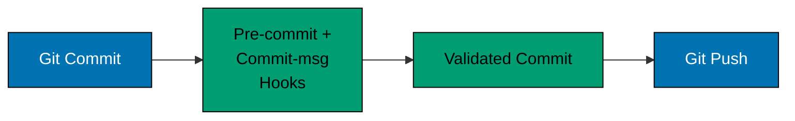
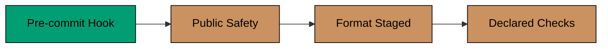
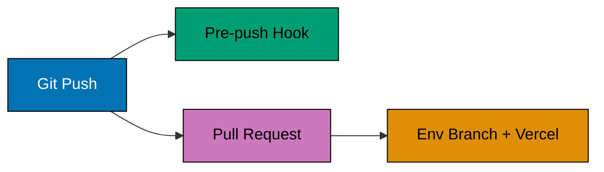
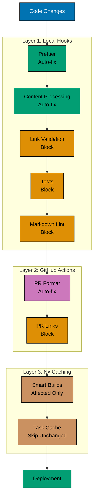

# CI/CD Pipeline

Git hooks, GitHub Actions workflows, Nx build system, and development workflow for the Open Sharia Enterprise platform.

## CI/CD Pipeline Overview

The platform uses a multi-layered quality assurance strategy combining local git hooks, GitHub
Actions workflows (CI), and Nx caching. All continuous integration is handled through GitHub
Actions. Commands described inside the hosted workflow sections are runner-owned and remain native;
local development commands use the root HIPPO consumer.

**Local development hooks:**


```mermaid
graph LR
    accTitle: CI/CD Pipeline Overview
    accDescr: Git Commit leads to Pre-commit + Commit-msg Hooks; Pre-commit + Commit-msg Hooks leads to Validated Commit; Validated Commit leads to Git Push.
    COMMIT[Git Commit]
    HOOKS[Pre-commit +<br/>Commit-msg<br/>Hooks]
    VALIDATED[Validated Commit]
    PUSH[Git Push]

    COMMIT --> HOOKS
    HOOKS --> VALIDATED
    VALIDATED --> PUSH

    classDef blue fill:#0173B2,stroke:#000000,color:#FFFFFF
    classDef teal fill:#029E73,stroke:#000000,color:#000000
    class COMMIT,PUSH blue
    class HOOKS,VALIDATED teal
    classDef default fill:#FFFFFF,stroke:#000000,color:#000000
```

**Pre-commit registry gates (declaration order, fail fast):**


```mermaid
graph LR
    accTitle: CI/CD Pipeline Overview 2
    accDescr: Pre-commit Hook leads to Public Safety; Public Safety leads to Format Staged; Format Staged leads to Declared Checks.
    PRE_COMMIT[Pre-commit Hook]
    SAFETY[Public Safety]
    FORMAT[Format Staged]
    CHECKS[Declared Checks]

    PRE_COMMIT --> SAFETY
    SAFETY --> FORMAT
    FORMAT --> CHECKS

    classDef teal fill:#029E73,stroke:#000000,color:#000000
    classDef brown fill:#CA9161,stroke:#000000,color:#000000
    class PRE_COMMIT teal
    class SAFETY,FORMAT,CHECKS brown
    classDef default fill:#0173B2,stroke:#000000,color:#FFFFFF
```

**Pre-push and remote CI flow:**


```mermaid
graph LR
    accTitle: CI/CD Pipeline Overview 3
    accDescr: Git Push leads to Pre-push Hook; Git Push leads to Pull Request; Pull Request leads to Env Branch + Vercel.
    PUSH[Git Push]
    PRE_PUSH[Pre-push Hook]
    PR[Pull Request]
    DEPLOY[Env Branch + Vercel]

    PUSH --> PRE_PUSH
    PUSH --> PR
    PR --> DEPLOY

    classDef blue fill:#0173B2,stroke:#000000,color:#FFFFFF
    classDef teal fill:#029E73,stroke:#000000,color:#000000
    classDef purple fill:#CC78BC,stroke:#000000,color:#000000
    classDef orange fill:#DE8F05,stroke:#000000,color:#000000
    class PUSH blue
    class PRE_PUSH teal
    class PR purple
    class DEPLOY orange
    classDef default fill:#FFFFFF,stroke:#000000,color:#000000
```

## Git Hooks (Local Quality Gates)

Each Husky hook is a thin shim that runs one surface of the `repo-config.yml` gate registry through
`./rhino gate run --surface <surface>` inside a `./hippo run` boundary. The registry, not this page,
owns every gate's command and order; list them with `./rhino gate list`. See
[Git Hook Lifecycle](../../../repo-governance/development/workflow/git-hook-lifecycle.md).

### Pre-commit Hook

**Location**: `.husky/pre-commit` (`./rhino gate run --surface pre-commit`)

**Execution Order:** declared gates in registry order, stopping at the first failure:

1. **Public-safety tree screen**: blocks outbound-unsafe staged content
2. **Formatting** (the `format-staged` mutation gate):
   - Formats staged files by extension (Prettier and each language's formatter)
   - Applies the formatted bytes to the index
3. **Deterministic checks**: repository configuration, environment policy, Markdown lint and
   validators, the emoji convention, and `shellcheck`/`hadolint`/`actionlint` over staged paths

**Impact**: Ensures committed files are formatted and pass the declared file checks

### Commit-msg Hook

**Location**: `.husky/commit-msg` (`./rhino gate run --surface commit-msg --message-file "$1"`)

**Validation**: the declared `commit-msg` gates — today the public-safety commit-message screen

**Format**: `<type>(<scope>): <description>` per the
[Commit Message Convention](../../../repo-governance/development/workflow/commit-messages.md)

**Impact**: Blocks a commit message that fails a declared gate

### Pre-push Hook

**Location**: `.husky/pre-push` (`./rhino gate run --surface pre-push --push-updates-stdin`)

**Execution Order:** the declared `pre-push` gates — today the public-safety tree screen and
environment-policy validation. Pre-push runs no `test:quick` and no Markdown lint.

**Impact**: Blocks a push that fails a declared gate; tests run in the PR quality gate

## GitHub Actions Workflows

### PR Quality Gate Workflow

**File**: `.github/workflows/pr-quality-gate.yml`

**Trigger**: Pull request opened, synchronized, or reopened, or push to `main`

**Steps:**

1. `Detect affected languages` reads the tags of `nx affected` projects.
2. `Repository policy` runs the whole `pull-request` surface with
   `./rhino gate run --surface pull-request --base <sha> --head <sha>`; `format-staged` replays the
   formatters over the changed paths and fails on any difference.
3. One job per detected language (TypeScript, .NET, Flutter, Java, Go, Python) runs affected
   `typecheck`, `lint`, and `test:quick` (plus `compat:min-version` where declared).
4. The stable `Quality gate` join fails if any of those jobs failed.

**Purpose**: Full quality gate on every PR and push to `main`. The registry is the check-set source
of truth for the `pull-request` surface; `gate validate` checks its composition.

**Note**: The standalone `markdown-validate.yml` workflow has been deleted. Per-file Markdown
validators (markdownlint, mermaid, heading hierarchy, naming, front matter) run as declared
`pre-commit` and `pull-request` gates; this workflow's Repository policy job runs the
`pull-request` surface through `./rhino gate run`. The repo-wide
`./rhino md internal-link validate` check is not currently a declared gate (see `./rhino gate list`).

### Registry-derived CI matrix

The former scheduled whole-repository quality workflow is retired. Gate-surface checks run through
`pr-quality-gate.yml`; scheduled service workflows retain their explicit full test-layer, audit, or
deployment responsibilities. Product workflows cover their owning groups, while
`non-product-full-quality.yml` covers libraries and executable tools.

### Non-Product Full-Quality Workflow

**File**: `.github/workflows/non-product-full-quality.yml`

**Trigger**: Scheduled at 8 AM and 8 PM WIB daily or manual `workflow_dispatch`

**Steps**: Run complete non-product Unit and static quick gates serially, then every applicable
non-networked Integration suite, then every applicable complete public-boundary E2E suite. The
ordered jobs fail closed; Integration and E2E remain outside pre-commit, pre-push, and PR/main.

**Purpose**: Ensure libraries and executable tools receive full scheduled test-layer coverage even
when no product deployment workflow owns them.

### AyoKoding Web Test + Deploy Workflow

**File**: `.github/workflows/ayokoding-www-test-local-deploy-prod.yml`

**Trigger**: Scheduled (6 AM and 6 PM WIB daily) or manual `workflow_dispatch` — no push trigger

**Steps**: Full local-stack test pipeline via `_reusable-www-test-local-deploy.yml` (lint, typecheck, test:quick, E2E), then "deploy" by force-pushing `main` to `prod-ayokoding-www`; Vercel auto-builds.

**Purpose**: Deploy ayokoding.com (Next.js 16 fullstack content platform)

### OSE Platform Web Test + Deploy Workflow

**File**: `.github/workflows/ose-www-test-local-deploy-prod.yml`

**Trigger**: Scheduled (6 AM and 6 PM WIB daily) or manual `workflow_dispatch`

**Steps:**

1. Detect changes in `apps/ose-www/` vs `prod-ose-www` branch
2. If changes exist (or `force_deploy=true`): setup Node (Volta)
3. Install dependencies and run `nx build ose-www`
4. Force-push `main` to `prod-ose-www`; Vercel auto-builds

**Purpose**: Automated scheduled deployments for oseplatform.com with change detection to avoid unnecessary builds

### OrganicLever App Test + Local-Deploy Staging Workflow

**File**: `.github/workflows/organiclever-app-test-local-deploy-stag.yml`

**Trigger**: Scheduled (3 AM and 3 PM WIB daily) or manual `workflow_dispatch`

**Steps:**

1. Run each project's static `test:coverage:behaviour` validator across the OrganicLever app projects (`organiclever-be`, `organiclever-app-web`, `organiclever-be-e2e`, and the app-web E2E projects)
2. Run `fe-lint` for `organiclever-app-web`
3. Run backend and frontend Integration suites only for their isolated non-network local-resource boundaries
4. Start the full Docker Compose stack, including PostgreSQL, for E2E proof through public boundaries
5. Run the `organiclever-be-e2e` (`BASE_URL: http://localhost:8202`) and `organiclever-app-web` FE E2E (`WEB_BASE_URL: http://localhost:3202`) Playwright tests with isolated synthetic data
6. `detect-changes`: check the app paths vs previous commit
7. `deploy` (gated on all test jobs + `detect-changes == true`): "deploy" by force-pushing `HEAD` to BOTH `stag-organiclever-app-web` (Vercel auto-builds the staging app) and `stag-organiclever-be` (the be-build-deploy workflow fires for the backend image)

**Purpose**: Automated scheduled staging deploys for the OrganicLever app group, gated on the full FE+BE test suite, with change detection to avoid unnecessary builds. Production continuous delivery is **deferred** to a separate plan — no production-CD workflow exists yet.

### OrganicLever App Test-Staging Gate Workflow

**File**: `.github/workflows/organiclever-app-test-stag.yml`

**Trigger**: Scheduled (+2.5h after the local-deploy-stag run) or manual `workflow_dispatch`

**Steps:**

1. Single job `e2e-staging` under the `organiclever-app-staging` env
2. Runs the `organiclever-app-web` FE E2E suite against the deployed staging URL using `WEB_BASE_URL: ${{ vars.WEB_BASE_URL }}` (Vercel bypass secret)
3. Uploads the Playwright report as an artifact

**Purpose**: Continuous gated health check of the staging deployment. Despite the `-deploy-prod` name slot reserved for the future promote step, this workflow currently **stops on pass without promoting** — production CD is deferred. It never deploys today.

### Web UI Storybook Deploy Workflow

**File**: `.github/workflows/web-ui-build-deploy-prod.yml`

**Trigger**: Scheduled (daily at 00:00 UTC) or manual `workflow_dispatch`

**Steps:**

1. Compare the Storybook inputs with `prod-web-ui`: `libs/web-ui/`, its `web-ui-token` workspace
   dependency, and the root package, Nx, TypeScript, and npm configuration files that affect the
   build.
2. Build the shared `web-ui` lib's Storybook (`nx run web-ui:build-storybook`) only when that
   comparison finds a change.
3. Force-push `HEAD` to `prod-web-ui` only after a successful changed-input build.

**Purpose**: Poll daily for Storybook-input changes and publish the `web-ui` component library's
Storybook to `prod-web-ui` only when the deployed baseline is stale. Unchanged scheduled or manual
runs are no-ops, avoiding both the Storybook build and the Vercel deployment.

### PR Quality Gate Workflow (duplicate entry)

**File**: `.github/workflows/pr-quality-gate.yml`

**Trigger**: Pull request opened, synchronized, or reopened, or push to `main`

**Purpose**: Runs affected tests and quality checks for pull requests (see primary entry above)

## Nx Build System

**Caching Strategy:**

- **Cacheable Operations**: `build`, `test`, `lint`
- **Cache Location**: Local + Nx Cloud (if configured)
- **Affected Detection**: Compares against `main` branch

**Build Optimization:**

- **Affected Builds**: `nx affected -t build` only builds changed projects
- **Dependency Graph**: Automatically builds dependencies first
- **Parallel Execution**: Runs independent tasks concurrently

**Target Defaults:**

```json
{
  "build": {
    "dependsOn": ["^build"],
    "outputs": ["{projectRoot}/dist"],
    "cache": true
  },
  "test": {
    "dependsOn": ["build"],
    "cache": true
  },
  "lint": {
    "cache": true
  }
}
```

## Development Workflow

### Standard Development Flow

1. **Start Development**:

   ```bash
   ./hippo run --class service --resource-tier standard --disk-path . -- npm exec nx -- dev [project-name]
   ```

2. **Make Changes**:
   - Edit code/content
   - Test locally

3. **Commit Changes**:

   ```bash
   git add .
   git commit -m "type(scope): description"
   ```

   - Pre-commit hook runs:
     - Formats code with Prettier
     - Processes ayokoding-www content if affected
     - Validates links
   - Commit-msg hook runs the public-safety screen on the message (format is checked by review)
   - Commit created

4. **Push to Remote** — target follows the declared Delivery Mode:

   ```bash
   # Default (`worktree-to-pr`): push the short-lived plan branch
   git push origin <plan-branch>

   # Direct-push modes, when explicitly declared:
   git push origin main
   ```

   - Pre-push hook runs (on any push target):
     - Tests affected projects
     - Lints markdown

5. **Open a Pull Request** — the default path (`worktree-to-pr`); skip only under a declared direct-push mode:
   - GitHub Actions run the full quality gate on every PR event
   - The exact current head and base must pass the required `Quality gate`
   - A focused agent pass checks the current head for secrets, protected environment values, and
     machine-specific paths
   - Applicable UI/API surface gates run before merge
   - Semantic PR review runs only when the user explicitly invokes it
   - Merge once the repository merge preconditions hold — `[AI]` by default

6. **Deploy** (for Vercel-deployed apps):

   ```bash
   git checkout prod-[app-name]
   git merge main
   git push origin prod-[app-name]
   ```

   - Vercel automatically builds and deploys

### Quality Assurance Layers


```mermaid
graph TB
    accTitle: Quality Assurance Layers
    accDescr: Code Changes leads to Prettier Auto-fix; Prettier Auto-fix leads to Content Processing Auto-fix; Content Processing Auto-fix leads to Link Validation Block; Link Validation Block leads to Tests Block; and 6 more links.
    CODE[Code Changes]

    subgraph "Layer 1: Local Hooks"
        L1_FORMAT[Prettier<br/>Auto-fix]
        L1_CONTENT[Content Processing<br/>Auto-fix]
        L1_LINKS[Link Validation<br/>Block]
        L1_TEST[Tests<br/>Block]
        L1_MD[Markdown Lint<br/>Block]
    end

    subgraph "Layer 2: GitHub Actions"
        L2_FORMAT[PR Format<br/>Auto-fix]
        L2_LINKS[PR Links<br/>Block]
    end

    subgraph "Layer 3: Nx Caching"
        L3_BUILD[Smart Builds<br/>Affected Only]
        L3_CACHE[Task Cache<br/>Skip Unchanged]
    end

    DEPLOY[Deployment]

    CODE --> L1_FORMAT
    L1_FORMAT --> L1_CONTENT
    L1_CONTENT --> L1_LINKS
    L1_LINKS --> L1_TEST
    L1_TEST --> L1_MD

    L1_MD --> L2_FORMAT
    L2_FORMAT --> L2_LINKS

    L2_LINKS --> L3_BUILD
    L3_BUILD --> L3_CACHE
    L3_CACHE --> DEPLOY

    classDef blue fill:#0173B2,stroke:#000000,color:#FFFFFF
    classDef teal fill:#029E73,stroke:#000000,color:#000000
    classDef orange fill:#DE8F05,stroke:#000000,color:#000000
    classDef purple fill:#CC78BC,stroke:#000000,color:#000000
    classDef brown fill:#CA9161,stroke:#000000,color:#000000
    class CODE blue
    class L1_FORMAT,L1_CONTENT,DEPLOY teal
    class L1_LINKS,L1_TEST,L1_MD,L2_LINKS orange
    class L2_FORMAT purple
    class L3_BUILD,L3_CACHE brown
    classDef default fill:#FFFFFF,stroke:#000000,color:#000000
```

### Quality Gate Categories

**Auto-fix Gates** (Non-blocking with automatic fixes):

- Prettier formatting
- AyoKoding content processing
- PR format workflow

**Blocking Gates** (Must pass to proceed):

- Link validation (pre-commit, PR)
- Affected tests (pre-push)
- Markdown linting (pre-push)
