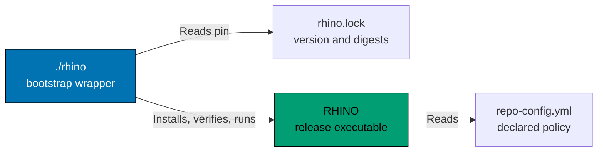

# Components & Code Architecture

C4 Level 3 component diagrams and Level 4 code architecture for the Open Sharia Enterprise platform.

## C4 Level 3: Component Diagrams

Shows the internal components within each container. Components are groupings of related functionality behind a well-defined interface.

### ose-www Components (Next.js 16)

**Component Responsibilities:**

- **Next.js App Router**: Static generation and routing for platform content
- **tRPC API**: Backend API for content retrieval and navigation
- **Source Directory**: App source at `apps/ose-www/src/`
- **Static Assets**: Images and public assets at `apps/ose-www/public/`

### RHINO (Pinned External Executable)

RHINO is not an in-tree application or Nx project. It is released independently from
[its upstream repository](https://github.com/wahidyankf/rhino); this repository carries only the
`./rhino` bootstrap wrapper and the `rhino.lock` pin.

**Component Responsibilities:**

- **`./rhino`**: POSIX-sh wrapper that installs the pinned release into a shared cache, verifies its
  SHA-256 digest, and forwards every argument unchanged
- **`rhino.lock`**: Pins the release version and a digest per platform
- **RHINO executable**: Runs the repository's validators and gates (for example,
  `./rhino md internal-link validate`)
- **`repo-config.yml`**: Declares every value RHINO enforces

### ayokoding-www Components (Next.js Fullstack Platform)

**Component Responsibilities:**

- **Next.js App Router**: Static generation and routing for educational content
- **tRPC API**: Backend API for content retrieval, search, and navigation
- **Content Directory**: Co-located markdown content at `apps/ayokoding-www/content/`
- **Bilingual Support**: Default English with Indonesian content

## C4 Level 4: Code Architecture

This page records no Level 4 code architecture: RHINO's source lives upstream, not in this
repository. For the in-tree F# CLI (`crane-cli` with its `fsharp-crane-core` library), see
[Hexagonal Architecture — CLI Apps: Directory Layout](../../../repo-governance/development/pattern/hexagonal-architecture-cli/overview-and-directory-layout.md).
