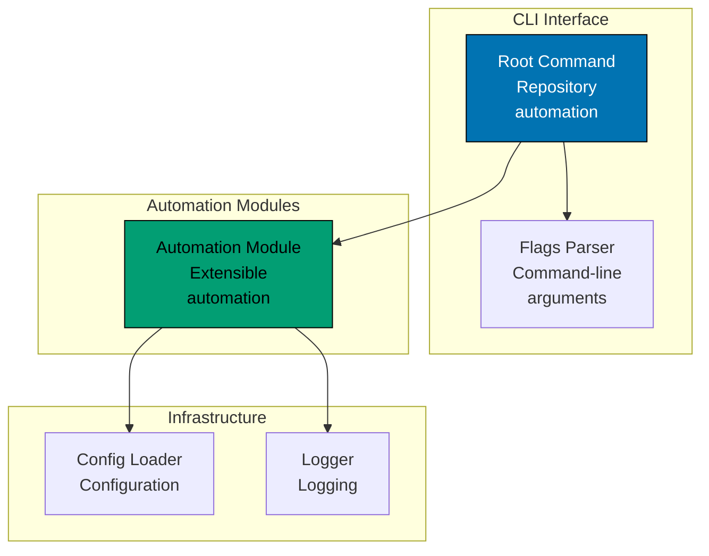

# Components & Code Architecture

C4 Level 3 component diagrams and Level 4 code architecture for the Open Sharia Enterprise platform.

## C4 Level 3: Component Diagrams

Shows the internal components within each container. Components are groupings of related functionality behind a well-defined interface.

### ose-www Components (Next.js 16)

**Component Responsibilities:**

- **Next.js App Router**: Static generation and routing for platform content
- **tRPC API**: Backend API for content retrieval and navigation
- **Source Directory**: App source at `apps/ose-www/src/`
- **Static Assets**: Images and public assets at `apps/ose-www/public/`

### rhino-cli Components (F# CLI Tool)

**Component Responsibilities:**

- **Root Command**: CLI entry point for repository automation tasks
- **Automation Module**: Extensible module system for automation workflows
- **Config Loader**: Load butler-specific configuration

### ayokoding-www Components (Next.js Fullstack Platform)

**Component Responsibilities:**

- **Next.js App Router**: Static generation and routing for educational content
- **tRPC API**: Backend API for content retrieval, search, and navigation
- **Content Directory**: Co-located markdown content at `apps/ayokoding-www/content/`
- **Bilingual Support**: Default English with Indonesian content

## C4 Level 4: Code Architecture

Shows implementation details for critical components. Focus on rhino-cli's F# package structure and key implementation patterns.

### rhino-cli Package Structure (F#)

`rhino-cli` is the repository's F# CLI tool (other F# projects are backend services and shared
libraries, not CLIs). Its `md links validate` command validates internal Markdown links across the
whole repository, including both content trees.
