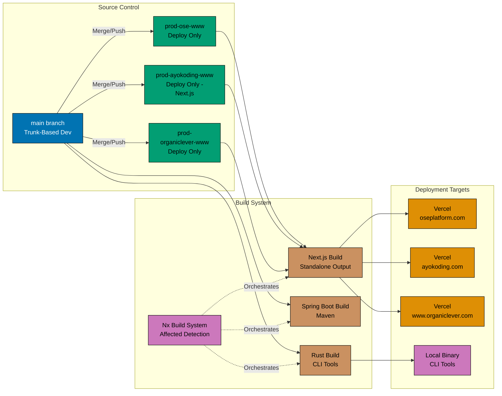

# Deployment Architecture

Deployment architecture, environment branches, and Vercel configuration for the Open Sharia Enterprise platform.

## Deployment Diagram

## Deployment Configuration

### Vercel Deployment

**Next.js Sites** (ose-www, ayokoding-www, organiclever-www):

- **Build Framework**: Next.js (standalone output)
- **Build Command**: `next build`
- **Output Directory**: `.next/`

**Security Headers (All Vercel Sites):**

- `X-Content-Type-Options: nosniff`
- `X-Frame-Options: SAMEORIGIN`
- `X-XSS-Protection: 1; mode=block`
- `Referrer-Policy: strict-origin-when-cross-origin`

**Caching Strategy:**

- Static assets (css/js/fonts/images): 1 year immutable cache
- HTML pages: Standard caching

### Environment Branches

- **Purpose**: Deployment triggers only
- **Branches**: `prod-ose-www`, `prod-ayokoding-www`, `stag-organiclever-app-web`, `stag-organiclever-be`
- **Policy**: NEVER commit directly to these branches outside CI automation
- **Workflows** (here, "deploy" means a **branch force-push** — Vercel builds web from the pushed branch;
  a be-build-deploy workflow fires for backends):
  - `ayokoding-www-test-local-deploy-prod.yml` (6 AM / 6 PM WIB) → `prod-ayokoding-www`
  - `ose-www-test-local-deploy-prod.yml` (6 AM / 6 PM WIB) → `prod-ose-www`
  - `organiclever-app-test-local-deploy-stag.yml` (3 AM / 3 PM WIB) → `stag-organiclever-app-web`
    and `stag-organiclever-be` (deploys to **staging**, not production)
  - `organiclever-app-test-stag.yml` (+2.5h after the stag deploy) — gated FE E2E
    against the staging URL; **stops on pass without promoting**. Production continuous delivery
    is deferred to a separate plan, so no production-CD workflow exists yet.
  - All workflows can also be triggered manually from the GitHub Actions UI
